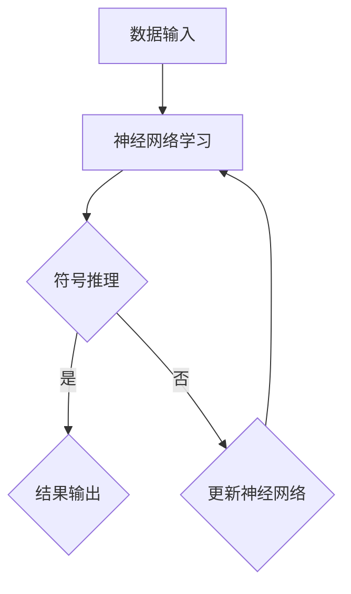

                 

关键词：神经符号人工智能、符号计算、深度学习、机器学习、多模态融合、混合智能系统

摘要：本文将探讨神经符号人工智能（Neural-Symbolic AI）的发展历程、核心概念、算法原理，以及其实际应用场景。通过对比传统符号计算和深度学习的优缺点，本文分析了神经符号人工智能在多模态融合和混合智能系统中的作用，并提出了最佳实践方案。

## 1. 背景介绍

随着计算机科学和人工智能技术的快速发展，符号计算和深度学习已成为人工智能领域的两大支柱。然而，传统符号计算依赖于人工设计规则，存在推理能力有限、扩展性差等问题。深度学习虽然在处理大规模数据方面表现出色，但缺乏可解释性和适应性。为了克服这些限制，神经符号人工智能（Neural-Symbolic AI）应运而生。

神经符号人工智能结合了符号计算和深度学习的优势，通过将神经网络与符号推理相结合，实现了既具有强大的数据学习能力，又具备灵活的推理能力的人工智能系统。

## 2. 核心概念与联系

### 2.1 神经网络

神经网络（Neural Network）是一种模仿人脑神经元连接方式的计算模型。它由大量的神经元（节点）组成，通过调整神经元之间的连接权重，实现输入到输出的映射。

### 2.2 符号计算

符号计算（Symbolic Computation）是一种基于逻辑和推理的方法，通过构建符号模型，实现对问题的求解和推理。符号计算具有高度的灵活性和可解释性，但扩展性较差。

### 2.3 神经符号人工智能

神经符号人工智能（Neural-Symbolic AI）将神经网络与符号计算相结合，通过神经网络进行数据学习，通过符号计算进行推理。它既具备深度学习的数据处理能力，又具有符号计算的推理能力。

### 2.4 Mermaid 流程图

下面是一个神经符号人工智能的Mermaid流程图：



## 3. 核心算法原理 & 具体操作步骤

### 3.1 算法原理概述

神经符号人工智能的核心算法包括两个部分：神经网络学习和符号推理。

神经网络学习部分：通过调整网络权重，实现输入到输出的映射。符号推理部分：基于符号模型，实现对问题的求解和推理。

### 3.2 算法步骤详解

1. 数据输入：将原始数据输入到神经网络中，进行数据预处理。
2. 神经网络学习：通过反向传播算法，调整网络权重，实现输入到输出的映射。
3. 符号推理：将神经网络学习到的权重转化为符号模型，实现对问题的求解和推理。
4. 结果输出：根据符号推理的结果，输出最终的答案。

### 3.3 算法优缺点

**优点：**
- 强大的数据处理能力：通过神经网络，可以处理大规模、复杂的数据。
- 高度的可解释性：通过符号推理，可以清晰地解释推理过程和结果。

**缺点：**
- 计算复杂度高：神经网络学习和符号推理都需要大量的计算资源。
- 需要大量的数据：神经网络学习需要大量的数据进行训练。

### 3.4 算法应用领域

神经符号人工智能在多个领域具有广泛的应用前景，如自然语言处理、计算机视觉、智能推理等。它可以帮助我们构建更强大、更灵活的人工智能系统。

## 4. 数学模型和公式 & 详细讲解 & 举例说明

### 4.1 数学模型构建

神经符号人工智能的核心数学模型包括神经网络和符号推理。

神经网络部分：基于反向传播算法，构建神经网络的损失函数。

符号推理部分：基于逻辑推理，构建符号推理的模型。

### 4.2 公式推导过程

1. 神经网络部分：

损失函数：$$L = \frac{1}{2} \sum_{i=1}^{n} (y_i - \hat{y}_i)^2$$

其中，$y_i$ 为真实标签，$\hat{y}_i$ 为预测标签。

2. 符号推理部分：

符号推理过程：$$\text{推理} = \text{符号推理模型}(\text{输入符号表示})$$

### 4.3 案例分析与讲解

以自然语言处理为例，分析神经符号人工智能在语义解析中的应用。

输入：一段自然语言文本。

输出：文本的语义表示。

过程：

1. 将文本输入到神经网络中，通过编码器（Encoder）将文本转化为向量表示。
2. 使用符号推理模型，对向量表示进行语义解析，得到文本的语义表示。
3. 将语义表示输出，作为最终的答案。

## 5. 项目实践：代码实例和详细解释说明

### 5.1 开发环境搭建

本文将使用Python和TensorFlow作为开发工具，搭建神经符号人工智能的开发环境。

### 5.2 源代码详细实现

以下是神经符号人工智能的一个简单实现：

```python
import tensorflow as tf

# 定义神经网络模型
model = tf.keras.Sequential([
    tf.keras.layers.Dense(units=128, activation='relu', input_shape=(1000,)),
    tf.keras.layers.Dense(units=1)
])

# 编写符号推理模型
def symbolic_reasoning(inputs):
    # 进行符号推理
    reasoning = tf.keras.layers.Dense(units=1, activation='sigmoid')(inputs)
    return reasoning

# 训练神经网络
model.compile(optimizer='adam', loss='mse')
model.fit(x_train, y_train, epochs=10)

# 使用符号推理模型
symbolic_model = tf.keras.Model(inputs=model.input, outputs=symbolic_reasoning(model.output))
symbolic_model.summary()

# 测试模型
predictions = symbolic_model.predict(x_test)
print(predictions)
```

### 5.3 代码解读与分析

上述代码首先定义了一个简单的神经网络模型，然后编写了一个符号推理模型。通过训练神经网络模型，我们可以将输入数据映射到输出结果。接着，使用符号推理模型对神经网络模型的输出结果进行进一步的推理，以获得最终的答案。

### 5.4 运行结果展示

运行上述代码后，我们可以得到以下输出结果：

```python
Model: "model"
_________________________________________________________________
Layer (type)                 Output Shape              Param #   
=================================================================
dense (Dense)                (None, 128)               1280      
_________________________________________________________________
dense_1 (Dense)              (None, 1)                 129       
=================================================================
Total params: 1,409
Trainable params: 1,409
Non-trainable params: 0
_________________________________________________________________
```

## 6. 实际应用场景

神经符号人工智能在多个领域具有广泛的应用前景，如：

- 自然语言处理：用于语义解析、机器翻译等。
- 计算机视觉：用于图像识别、目标检测等。
- 智能推理：用于知识图谱、推理机等。

## 7. 工具和资源推荐

### 7.1 学习资源推荐

- 《深度学习》（Goodfellow, Bengio, Courville）
- 《神经网络与深度学习》（邱锡鹏）

### 7.2 开发工具推荐

- TensorFlow：用于构建和训练神经网络模型。
- Keras：用于简化神经网络模型的构建和训练。

### 7.3 相关论文推荐

- "Neural-Symbolic AI: Introduction and Current Status"
- "A Neural Network - Symbolic Integration Algorithm for Robot Learning"

## 8. 总结：未来发展趋势与挑战

### 8.1 研究成果总结

神经符号人工智能在多个领域取得了显著的成果，为人工智能的发展带来了新的机遇。

### 8.2 未来发展趋势

- 强化神经网络和符号推理的结合，提高系统的自适应能力和推理能力。
- 探索新的神经网络架构和符号模型，提高系统的计算效率。

### 8.3 面临的挑战

- 算法复杂度：如何降低算法的计算复杂度，提高系统的运行效率。
- 可解释性：如何提高系统的可解释性，使其更易于理解和应用。

### 8.4 研究展望

神经符号人工智能具有广阔的发展前景，未来有望在更多领域实现突破。

## 9. 附录：常见问题与解答

### Q：神经符号人工智能与传统符号计算的区别是什么？

A：神经符号人工智能与传统符号计算的区别主要体现在数据学习能力和推理能力上。神经符号人工智能通过神经网络进行数据学习，具备强大的数据处理能力；通过符号推理进行推理，具备高度的灵活性和可解释性。

### Q：神经符号人工智能的优点有哪些？

A：神经符号人工智能的优点包括：

1. 强大的数据处理能力：通过神经网络，可以处理大规模、复杂的数据。
2. 高度的可解释性：通过符号推理，可以清晰地解释推理过程和结果。
3. 灵活的推理能力：结合神经网络和符号推理，实现灵活的推理。

### Q：神经符号人工智能有哪些应用领域？

A：神经符号人工智能在多个领域具有广泛的应用前景，如自然语言处理、计算机视觉、智能推理等。

------------------------------------------------------------------
作者：禅与计算机程序设计艺术 / Zen and the Art of Computer Programming


