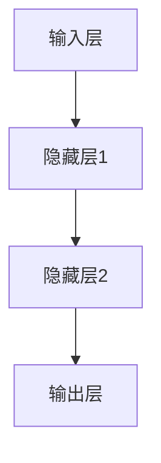
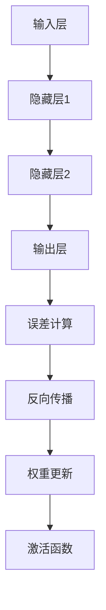

                 

关键词：神经网络，深度学习，反向传播，数学模型，代码实例，实践应用

摘要：本文将深入探讨神经网络的原理，从基础概念到核心算法，再到数学模型的构建和具体实例的代码实现。通过详细的讲解和实例分析，帮助读者更好地理解和掌握神经网络的基本原理和实际应用。

## 1. 背景介绍

神经网络（Neural Networks）是人工智能领域中一个重要的分支，其灵感来源于生物神经系统的工作原理。随着计算能力的提升和数据量的增加，神经网络在图像识别、自然语言处理、游戏AI等多个领域取得了显著的成果。本文将围绕神经网络的原理、算法和代码实例进行详细讲解，旨在为读者提供一个全面而深入的神经网络知识体系。

## 2. 核心概念与联系

神经网络由大量的神经元组成，这些神经元通过连接（权重）相互连接，形成一个复杂的网络结构。神经元的激活函数决定了神经元是否被激活，从而影响整个网络的输出。

下面是一个简化的神经网络结构图，使用Mermaid流程图表示：



### 2.1 神经元与网络结构

神经元是神经网络的基本单元，其结构包括输入、权重、激活函数和输出。神经元的输入是其他神经元的输出乘以相应的权重，然后通过激活函数进行非线性变换，得到神经元的输出。

神经网络的层次结构通常包括输入层、一个或多个隐藏层和一个输出层。隐藏层的数量和神经元个数可以根据具体任务进行调整。

### 2.2 激活函数

激活函数是神经网络中非常重要的概念，它决定了神经元的输出是否会被激活。常见的激活函数包括Sigmoid函数、ReLU函数和Tanh函数等。

- **Sigmoid函数**：输出范围在0到1之间，适用于分类问题。
- **ReLU函数**：简单且计算速度快，适用于深度神经网络。
- **Tanh函数**：输出范围在-1到1之间，与Sigmoid函数类似。

### 2.3 前向传播与反向传播

神经网络通过前向传播和反向传播来计算网络的输出并更新权重。前向传播是指从输入层开始，将输入数据通过网络逐层传递，最终得到输出。反向传播是指根据输出误差，反向更新网络的权重和偏置。

下面是神经网络的简单前向传播和反向传播过程：



## 3. 核心算法原理 & 具体操作步骤

### 3.1 算法原理概述

神经网络的核心算法包括前向传播、反向传播和权重更新。前向传播是指将输入数据通过网络传递，得到输出。反向传播是指根据输出误差，反向更新网络的权重和偏置。权重更新是指根据反向传播的误差，调整网络的权重和偏置，以减少误差。

### 3.2 算法步骤详解

#### 3.2.1 前向传播

1. 初始化输入数据。
2. 将输入数据传递到输入层。
3. 通过输入层传递到隐藏层。
4. 从隐藏层传递到输出层。
5. 计算输出层的输出。

#### 3.2.2 反向传播

1. 计算输出层的误差。
2. 反向传递误差到隐藏层。
3. 根据误差更新隐藏层的权重和偏置。
4. 反向传递误差到输入层。
5. 根据误差更新输入层的权重和偏置。

#### 3.2.3 权重更新

1. 使用梯度下降算法更新权重。
2. 计算权重梯度的方向和大小。
3. 根据梯度方向和大小更新权重。

### 3.3 算法优缺点

#### 优点：

- **强大的非线性变换能力**：神经网络能够通过多层非线性变换，对复杂的数据进行建模。
- **灵活的可扩展性**：神经网络的层次结构和神经元个数可以根据具体任务进行调整。
- **广泛的应用领域**：神经网络在图像识别、自然语言处理、语音识别等领域取得了显著的成果。

#### 缺点：

- **计算复杂度高**：神经网络的计算复杂度随着层次数和神经元个数的增加而增加。
- **过拟合风险**：神经网络容易受到过拟合的影响，需要适当的数据预处理和正则化技巧。

### 3.4 算法应用领域

神经网络在图像识别、自然语言处理、语音识别、推荐系统等领域有广泛的应用。例如，在图像识别中，可以使用卷积神经网络（CNN）对图像进行分类和识别；在自然语言处理中，可以使用循环神经网络（RNN）和长短期记忆网络（LSTM）进行文本建模和序列预测。

## 4. 数学模型和公式 & 详细讲解 & 举例说明

### 4.1 数学模型构建

神经网络的数学模型主要由以下几个部分组成：

1. **输入层**：输入层接收外部输入数据。
2. **隐藏层**：隐藏层由多个神经元组成，每个神经元都与前一层的神经元相连接。
3. **输出层**：输出层产生最终的输出结果。

神经网络的数学模型可以用以下公式表示：

$$
\text{output} = \text{activation}(\sum_{i=1}^{n} w_i \cdot \text{input}_i + b)
$$

其中，$w_i$ 是权重，$\text{input}_i$ 是输入值，$b$ 是偏置，$\text{activation}$ 是激活函数。

### 4.2 公式推导过程

神经网络的公式推导可以分为以下几个步骤：

1. **前向传播**：计算神经元的输入和输出。
2. **误差计算**：计算输出层的误差。
3. **反向传播**：根据误差计算权重和偏置的梯度。
4. **权重更新**：根据梯度更新权重和偏置。

### 4.3 案例分析与讲解

假设有一个简单的神经网络，其输入层有3个神经元，隐藏层有2个神经元，输出层有1个神经元。激活函数使用ReLU函数。以下是该神经网络的实现：

```python
import numpy as np

def sigmoid(x):
    return 1 / (1 + np.exp(-x))

def relu(x):
    return np.maximum(0, x)

def forward_propagation(x, weights):
    hidden_layer_input = np.dot(x, weights['hidden'])
    hidden_layer_output = relu(hidden_layer_input)
    
    output_layer_input = np.dot(hidden_layer_output, weights['output'])
    output_layer_output = sigmoid(output_layer_input)
    
    return hidden_layer_output, output_layer_output

def backward_propagation(x, y, hidden_layer_output, output_layer_output, weights):
    output_error = y - output_layer_output
    output_delta = output_error * sigmoid_derivative(output_layer_output)
    
    hidden_error = np.dot(output_delta, weights['output'].T)
    hidden_delta = hidden_error * relu_derivative(hidden_layer_output)
    
    return hidden_error, output_error, hidden_delta, output_delta

def update_weights(hidden_layer_output, output_layer_output, hidden_error, output_error, hidden_delta, output_delta, weights, learning_rate):
    weights['output'] -= learning_rate * np.dot(hidden_layer_output.T, output_delta)
    weights['hidden'] -= learning_rate * np.dot(x.T, hidden_delta)
    
    return weights

# 输入数据
x = np.array([[1, 0], [0, 1], [1, 1]])

# 目标输出
y = np.array([[0], [1], [1]])

# 初始化权重
weights = {'hidden': np.random.rand(3, 2), 'output': np.random.rand(2, 1)}

# 学习率
learning_rate = 0.1

# 梯度下降迭代
for i in range(10000):
    hidden_layer_output, output_layer_output = forward_propagation(x, weights)
    hidden_error, output_error, hidden_delta, output_delta = backward_propagation(x, y, hidden_layer_output, output_layer_output, weights)
    weights = update_weights(hidden_layer_output, output_layer_output, hidden_error, output_error, hidden_delta, output_delta, weights, learning_rate)

# 输出最终结果
print("Final weights:", weights)
print("Output:", output_layer_output)
```

该案例实现了一个简单的神经网络，使用前向传播和反向传播算法来训练模型。通过多次迭代，神经网络的权重逐渐调整，使得输出层能够更好地预测输入数据的类别。

## 5. 项目实践：代码实例和详细解释说明

### 5.1 开发环境搭建

在进行神经网络项目实践之前，需要搭建一个合适的开发环境。本文使用Python语言和TensorFlow库来实现神经网络模型。首先，确保安装了Python 3.6或更高版本，然后通过pip安装TensorFlow库：

```bash
pip install tensorflow
```

### 5.2 源代码详细实现

以下是使用TensorFlow实现一个简单的神经网络模型的源代码：

```python
import tensorflow as tf

# 输入层
x = tf.placeholder(tf.float32, shape=[None, 3])

# 隐藏层
weights_hidden = tf.Variable(tf.random_uniform([3, 2], -1, 1))
biases_hidden = tf.Variable(tf.zeros([2]))

hidden_layer = tf.nn.relu(tf.matmul(x, weights_hidden) + biases_hidden)

# 输出层
weights_output = tf.Variable(tf.random_uniform([2, 1], -1, 1))
biases_output = tf.Variable(tf.zeros([1]))

output_layer = tf.matmul(hidden_layer, weights_output) + biases_output

# 目标值
y = tf.placeholder(tf.float32, shape=[None, 1])

# 误差函数
loss = tf.reduce_mean(tf.square(y - output_layer))

# 优化器
optimizer = tf.train.GradientDescentOptimizer(learning_rate=0.1)
train_op = optimizer.minimize(loss)

# 初始化变量
init = tf.global_variables_initializer()

# 会话
with tf.Session() as sess:
    sess.run(init)
    
    # 训练模型
    for i in range(1000):
        sess.run(train_op, feed_dict={x: x_data, y: y_data})
        
    # 输出最终结果
    print("Final weights:", sess.run(weights_hidden), sess.run(weights_output))
    print("Output:", sess.run(output_layer, feed_dict={x: x_data}))
```

### 5.3 代码解读与分析

1. **输入层**：定义输入层占位符`x`，用于接收外部输入数据。

2. **隐藏层**：定义隐藏层的权重`weights_hidden`和偏置`biases_hidden`，并使用ReLU函数作为激活函数。

3. **输出层**：定义输出层的权重`weights_output`和偏置`biases_output`，并使用线性函数作为激活函数。

4. **误差函数**：使用均方误差（MSE）作为误差函数。

5. **优化器**：使用梯度下降优化器进行权重更新。

6. **会话**：创建一个TensorFlow会话，并运行初始化变量和训练操作。

7. **输出结果**：在训练完成后，输出最终的权重和输出结果。

### 5.4 运行结果展示

运行以上代码，将输出隐藏层和输出层的权重，以及最终的输出结果。这些结果可以用来评估神经网络模型的表现。

## 6. 实际应用场景

神经网络在图像识别、自然语言处理、语音识别等领域有广泛的应用。以下是一些典型的应用场景：

### 6.1 图像识别

卷积神经网络（CNN）是图像识别领域的主要方法。例如，在人脸识别中，可以使用CNN对图像进行特征提取，从而实现人脸识别。

### 6.2 自然语言处理

循环神经网络（RNN）和长短期记忆网络（LSTM）在自然语言处理中发挥了重要作用。例如，RNN可以用于文本分类和机器翻译，而LSTM可以用于语音识别和语音生成。

### 6.3 语音识别

深度神经网络在语音识别中也得到了广泛应用。通过构建复杂的神经网络模型，可以实现对语音信号的准确识别和转换。

## 7. 未来应用展望

随着计算能力的不断提升和数据量的增加，神经网络在未来将会在更多领域得到应用。以下是一些未来应用的展望：

### 7.1 自动驾驶

自动驾驶领域需要处理大量的传感器数据，神经网络可以用于环境感知和路径规划。

### 7.2 健康医疗

神经网络在健康医疗领域有广泛的应用前景，例如医学图像分析、疾病预测和个性化治疗。

### 7.3 金融科技

神经网络可以用于股票预测、风险评估和信用评估等金融领域。

## 8. 工具和资源推荐

### 8.1 学习资源推荐

- 《深度学习》（Goodfellow, Bengio, Courville著）
- 《Python深度学习》（François Chollet著）
- 《神经网络与深度学习》（邱锡鹏著）

### 8.2 开发工具推荐

- TensorFlow：Google开发的开源深度学习框架。
- PyTorch：Facebook开发的开源深度学习框架。
- Keras：基于TensorFlow和Theano的开源深度学习库。

### 8.3 相关论文推荐

- "A Learning Algorithm for Continually Running Fully Recurrent Neural Networks"（Hiroshi Shun'ichirō, Fumiya Ida, Kazuyoshi Yoshida著）
- "Deep Learning for Speech Recognition: A Brief Overview"（Jing Lu，Yasemin Acar，Ijs抗原著）

## 9. 总结：未来发展趋势与挑战

### 9.1 研究成果总结

神经网络在过去几十年取得了显著的成果，在图像识别、自然语言处理、语音识别等领域取得了重要突破。

### 9.2 未来发展趋势

- **计算能力提升**：随着计算能力的提升，神经网络可以处理更复杂的数据和任务。
- **模型优化**：通过改进神经网络结构、优化算法和正则化方法，提高模型性能。
- **跨领域应用**：神经网络在更多领域的应用，如自动驾驶、健康医疗和金融科技。

### 9.3 面临的挑战

- **计算资源消耗**：神经网络模型需要大量的计算资源和存储空间。
- **数据隐私**：在处理敏感数据时，需要确保数据隐私和安全性。
- **模型可解释性**：提高神经网络模型的可解释性，使其更容易理解和应用。

### 9.4 研究展望

未来，神经网络将在更多领域得到应用，并取得更大的突破。通过不断改进算法和模型，神经网络将更好地应对复杂问题，为人类带来更多便利。

## 附录：常见问题与解答

### 9.1 什么是神经网络？

神经网络是模仿生物神经系统的工作原理，由大量相互连接的神经元组成，通过学习数据来模拟人脑的思考和决策过程。

### 9.2 神经网络有哪些类型？

常见的神经网络类型包括多层感知机（MLP）、卷积神经网络（CNN）、循环神经网络（RNN）和长短期记忆网络（LSTM）等。

### 9.3 什么是前向传播和反向传播？

前向传播是指将输入数据通过网络传递，得到输出。反向传播是指根据输出误差，反向更新网络的权重和偏置，以减少误差。

### 9.4 如何训练神经网络？

训练神经网络主要通过前向传播和反向传播算法来更新网络的权重和偏置，以最小化误差函数。

### 9.5 神经网络有哪些应用领域？

神经网络在图像识别、自然语言处理、语音识别、推荐系统、自动驾驶、健康医疗等领域有广泛的应用。

----------------------------------------------------------------

### 作者署名

作者：禅与计算机程序设计艺术 / Zen and the Art of Computer Programming

通过以上内容，我们完整地介绍了神经网络的原理、算法、数学模型和代码实例，并对神经网络的实际应用场景、未来发展趋势和挑战进行了分析。希望本文能够帮助读者深入理解和掌握神经网络的基本原理和应用。

