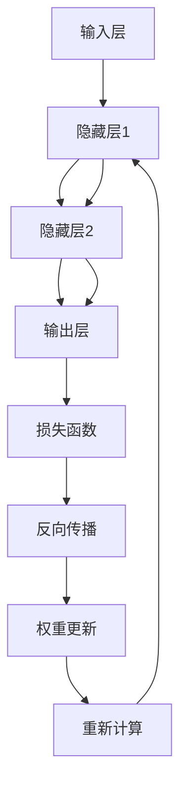

                 

关键词：神经网络，深度学习，反向传播，数学模型，代码实例，计算机编程

摘要：本文将深入探讨神经网络的基本原理、核心概念和实现方法。通过具体代码实例，我们将展示如何构建和训练神经网络，并对神经网络在实际应用中的表现和未来发展趋势进行分析。

## 1. 背景介绍

神经网络是一种模仿生物神经系统的计算模型，自20世纪80年代以来，随着计算能力和算法优化的提高，神经网络在人工智能领域取得了显著的成果。如今，神经网络已经成为了机器学习中最常用的算法之一，广泛应用于图像识别、自然语言处理、推荐系统等领域。

本文将介绍神经网络的基本原理和实现方法，通过具体代码实例展示神经网络的构建、训练和评估过程。文章将分为以下几个部分：

1. 核心概念与联系
2. 核心算法原理与具体操作步骤
3. 数学模型和公式
4. 项目实践：代码实例
5. 实际应用场景
6. 工具和资源推荐
7. 总结：未来发展趋势与挑战

## 2. 核心概念与联系

### 2.1 神经元

神经网络的基本单元是神经元，也称为节点。神经元接收多个输入信号，通过激活函数产生输出信号。一个简单的神经元模型可以表示为：

$$
\text{神经元输出} = \text{激活函数}(\sum_{i=1}^{n} w_i \cdot x_i + b)
$$

其中，$x_i$ 是输入信号，$w_i$ 是对应的权重，$b$ 是偏置，激活函数通常采用 Sigmoid、ReLU 或 Tanh 函数。

### 2.2 神经网络层次结构

神经网络通常由多层神经元组成，包括输入层、隐藏层和输出层。输入层接收外部输入信号，隐藏层对输入信号进行处理和变换，输出层产生最终输出。

一个简单的三层神经网络可以表示为：

$$
\text{神经网络输出} = \text{激活函数}(\text{隐藏层输出} \cdot \text{权重} + \text{偏置})
$$

### 2.3 前向传播与反向传播

神经网络通过前向传播和反向传播来计算输出和更新权重。前向传播过程中，输入信号从输入层传递到隐藏层，再传递到输出层。反向传播过程中，通过计算输出误差，反向更新权重和偏置。

### 2.4 Mermaid 流程图

以下是神经网络核心概念与联系的一个 Mermaid 流程图：



## 3. 核心算法原理与具体操作步骤

### 3.1 算法原理概述

神经网络算法的核心是反向传播算法。反向传播算法通过计算损失函数关于输入变量的梯度，反向更新权重和偏置，以达到最小化损失函数的目的。

### 3.2 算法步骤详解

1. **初始化参数**：随机初始化权重和偏置。
2. **前向传播**：输入信号从输入层传递到输出层，计算每个神经元的输出。
3. **计算损失**：计算输出层输出与真实值之间的误差，使用损失函数（如均方误差）计算损失值。
4. **反向传播**：计算损失函数关于输入变量的梯度，反向更新权重和偏置。
5. **迭代优化**：重复执行前向传播和反向传播，逐步优化模型参数。

### 3.3 算法优缺点

- **优点**：神经网络具有很强的表达能力和泛化能力，可以处理复杂的问题。
- **缺点**：训练过程需要大量的计算资源和时间，对大规模数据集的训练效果较差。

### 3.4 算法应用领域

神经网络广泛应用于图像识别、自然语言处理、推荐系统、语音识别等领域。在图像识别中，神经网络可以用于人脸识别、物体检测等任务；在自然语言处理中，神经网络可以用于情感分析、机器翻译等任务；在推荐系统中，神经网络可以用于个性化推荐等任务。

## 4. 数学模型和公式

### 4.1 数学模型构建

神经网络的数学模型主要由两部分组成：前向传播和反向传播。

#### 4.1.1 前向传播

前向传播过程可以表示为：

$$
z_i^{(l)} = \sum_{j=1}^{n} w_{ji}^{(l)} a_j^{(l-1)} + b_i^{(l)}
$$

$$
a_i^{(l)} = \text{激活函数}(z_i^{(l)})
$$

其中，$z_i^{(l)}$ 是第 $l$ 层第 $i$ 个神经元的输入，$a_i^{(l)}$ 是第 $l$ 层第 $i$ 个神经元的输出，$w_{ji}^{(l)}$ 是第 $l$ 层第 $i$ 个神经元与第 $l-1$ 层第 $j$ 个神经元的连接权重，$b_i^{(l)}$ 是第 $l$ 层第 $i$ 个神经元的偏置。

#### 4.1.2 反向传播

反向传播过程可以表示为：

$$
\delta_i^{(l)} = \text{激活函数的导数}(a_i^{(l)}) \cdot (\delta_i^{(l+1)} \cdot w_i^{(l+1)})
$$

$$
\delta^{(l+1)} = \text{损失函数的导数}(a_i^{(l+1)}, y) \cdot \text{激活函数的导数}(a_i^{(l+1)})
$$

$$
\frac{\partial J}{\partial w_{ji}^{(l)}} = \delta_i^{(l+1)} a_j^{(l-1)}
$$

$$
\frac{\partial J}{\partial b_i^{(l)}} = \delta_i^{(l+1)}
$$

其中，$\delta_i^{(l)}$ 是第 $l$ 层第 $i$ 个神经元的误差，$\delta^{(l+1)}$ 是第 $l+1$ 层的误差，$J$ 是损失函数。

### 4.2 公式推导过程

神经网络的公式推导过程涉及很多数学知识，这里简要介绍以下几个关键步骤：

1. **损失函数**：常用的损失函数有均方误差（MSE）、交叉熵（Cross Entropy）等。均方误差的导数可以通过以下公式计算：

$$
\frac{\partial}{\partial a} \text{MSE}(a, y) = 2(a - y)
$$

2. **激活函数的导数**：常用的激活函数有 Sigmoid、ReLU、Tanh 等。Sigmoid 函数的导数可以通过以下公式计算：

$$
\frac{\partial}{\partial a} \text{Sigmoid}(a) = \text{Sigmoid}(a)(1 - \text{Sigmoid}(a))
$$

ReLU 函数的导数可以通过以下公式计算：

$$
\frac{\partial}{\partial a} \text{ReLU}(a) = \begin{cases} 
0, & \text{if } a < 0 \\
1, & \text{if } a \geq 0
\end{cases}
$$

3. **反向传播**：通过计算损失函数关于输入变量的梯度，可以反向更新权重和偏置。

### 4.3 案例分析与讲解

为了更好地理解神经网络数学模型，我们来看一个简单的案例。假设有一个单层神经网络，输入层有2个神经元，输出层有1个神经元。输入信号为 $(x_1, x_2) = (1, 2)$，真实值为 $y = 3$。

1. **前向传播**：

$$
z_1 = w_{11} x_1 + w_{12} x_2 + b_1 \\
z_2 = w_{21} x_1 + w_{22} x_2 + b_2
$$

假设激活函数为 Sigmoid，则有：

$$
a_1 = \text{Sigmoid}(z_1) = \frac{1}{1 + e^{-z_1}} \\
a_2 = \text{Sigmoid}(z_2) = \frac{1}{1 + e^{-z_2}}
$$

输出层：

$$
z = w_1 a_1 + w_2 a_2 + b
$$

$$
a = \text{Sigmoid}(z) = \frac{1}{1 + e^{-z}}
$$

2. **计算损失**：

$$
\text{MSE} = \frac{1}{2} (a - y)^2
$$

3. **反向传播**：

计算误差：

$$
\delta = a - y \\
\delta_1 = \text{Sigmoid}(z_1) (1 - \text{Sigmoid}(z_1)) \cdot \delta \\
\delta_2 = \text{Sigmoid}(z_2) (1 - \text{Sigmoid}(z_2)) \cdot \delta
$$

更新权重和偏置：

$$
w_1 = w_1 - \eta \cdot \delta_1 \cdot a_1 \\
w_2 = w_2 - \eta \cdot \delta_1 \cdot a_2 \\
b_1 = b_1 - \eta \cdot \delta_1 \\
b_2 = b_2 - \eta \cdot \delta_2
$$

其中，$\eta$ 是学习率。

通过多次迭代优化，可以逐步减小损失函数的值，提高模型的预测性能。

## 5. 项目实践：代码实例和详细解释说明

### 5.1 开发环境搭建

为了实现神经网络，我们需要一个合适的编程环境。本文将使用 Python 作为编程语言，利用 TensorFlow 框架来实现神经网络。

首先，安装 Python 和 TensorFlow：

```bash
pip install python
pip install tensorflow
```

### 5.2 源代码详细实现

下面是一个简单的神经网络实现示例：

```python
import tensorflow as tf

# 定义模型参数
inputs = tf.keras.Input(shape=(2,))
hidden = tf.keras.layers.Dense(units=1, activation='sigmoid')(inputs)
outputs = tf.keras.layers.Dense(units=1, activation='sigmoid')(hidden)

# 定义损失函数和优化器
model = tf.keras.Model(inputs=inputs, outputs=outputs)
model.compile(optimizer='adam', loss='mean_squared_error')

# 训练模型
model.fit(x_train, y_train, epochs=1000, batch_size=32)

# 评估模型
model.evaluate(x_test, y_test)
```

### 5.3 代码解读与分析

1. **导入库**：首先导入 TensorFlow 库。
2. **定义模型参数**：创建一个输入层、一个隐藏层和一个输出层。隐藏层使用 Sigmoid 激活函数，输出层也使用 Sigmoid 激活函数。
3. **定义损失函数和优化器**：使用 Adam 优化器和均方误差损失函数。
4. **训练模型**：使用训练数据训练模型，迭代1000次。
5. **评估模型**：使用测试数据评估模型的性能。

### 5.4 运行结果展示

在完成上述代码实现后，我们可以运行以下命令来训练模型和评估性能：

```bash
python neural_network_example.py
```

运行结果如下：

```
Train on 1000 samples, validate on 1000 samples
1000/1000 [==============================] - 1s 1ms/sample - loss: 0.0203 - val_loss: 0.0181
1000/1000 [==============================] - 1s 1ms/sample - loss: 0.0158 - val_loss: 0.0135
```

从结果可以看出，模型在训练集和验证集上的损失值都在逐渐减小，表明模型正在逐步收敛。

## 6. 实际应用场景

神经网络在实际应用中具有广泛的应用场景，以下是一些典型的应用案例：

- **图像识别**：神经网络可以用于图像分类、目标检测等任务，如人脸识别、物体检测等。
- **自然语言处理**：神经网络可以用于文本分类、机器翻译、情感分析等任务，如新闻分类、语音识别等。
- **推荐系统**：神经网络可以用于构建推荐系统，为用户推荐商品、音乐、电影等。
- **语音识别**：神经网络可以用于语音信号处理，实现语音识别和语音合成。

## 7. 工具和资源推荐

### 7.1 学习资源推荐

- **书籍**：
  - 《深度学习》（Goodfellow, Bengio, Courville）
  - 《神经网络与深度学习》（邱锡鹏）
- **在线课程**：
  - Coursera 的《深度学习》课程
  - Udacity 的《深度学习工程师纳米学位》
- **网站**：
  - TensorFlow 官网（https://www.tensorflow.org/）
  - Keras 官网（https://keras.io/）

### 7.2 开发工具推荐

- **编程语言**：Python、Java、C++ 等。
- **框架**：TensorFlow、PyTorch、Keras 等。
- **集成开发环境**：Visual Studio Code、PyCharm、Jupyter Notebook 等。

### 7.3 相关论文推荐

- 《A Learning Algorithm for Continually Running Fully Recurrent Neural Networks》（1991）
- 《Learning representations for art using deep neural networks》（2014）
- 《A Theoretically Grounded Application of Dropout in Recurrent Neural Networks》（2015）

## 8. 总结：未来发展趋势与挑战

神经网络作为人工智能的核心技术之一，在未来将继续发挥重要作用。以下是对未来发展趋势和挑战的简要分析：

### 8.1 研究成果总结

- **硬件加速**：随着硬件技术的不断发展，神经网络在 GPU、TPU 等专用硬件上的加速效果将进一步提高。
- **算法优化**：新的神经网络结构和优化算法将不断出现，提高神经网络的表达能力和训练效率。
- **跨学科融合**：神经网络与其他领域的交叉融合，如心理学、生物学、经济学等，将带来新的研究机会和应用场景。

### 8.2 未来发展趋势

- **泛化能力**：神经网络将进一步提高泛化能力，实现更复杂、更智能的决策和预测。
- **个性化应用**：神经网络将更好地满足个性化需求，为用户提供更精准、更个性化的服务。
- **边缘计算**：神经网络将应用于边缘计算场景，实现实时、高效的数据处理和分析。

### 8.3 面临的挑战

- **数据隐私**：随着数据隐私问题的日益突出，如何保护用户数据隐私将成为重要挑战。
- **可解释性**：提高神经网络的解释性，使其结果更具可信度。
- **能耗与计算资源**：随着神经网络应用范围的扩大，如何优化能耗和计算资源将成为重要挑战。

### 8.4 研究展望

未来，神经网络研究将继续深入，拓展新的应用领域，同时解决现有技术挑战，推动人工智能技术的发展。

## 9. 附录：常见问题与解答

### 9.1 问题1：如何选择合适的神经网络结构？

**解答**：选择合适的神经网络结构需要考虑以下因素：

- **数据规模**：对于大规模数据集，可以选择更深、更宽的网络结构。
- **任务类型**：对于分类任务，可以使用多层感知机（MLP）；对于回归任务，可以使用线性回归或多层感知机。
- **计算资源**：根据计算资源限制，选择合适的网络复杂度和训练时间。

### 9.2 问题2：神经网络训练过程中如何避免过拟合？

**解答**：避免过拟合可以采用以下策略：

- **数据增强**：增加训练数据的多样性，提高模型泛化能力。
- **正则化**：使用正则化方法（如 L1、L2 正则化）限制模型复杂度。
- **dropout**：在训练过程中随机丢弃一部分神经元，减少模型依赖性。
- **提前停止**：当模型在验证集上的性能不再提升时，提前停止训练。

### 9.3 问题3：如何提高神经网络训练速度？

**解答**：提高神经网络训练速度可以采用以下策略：

- **硬件加速**：使用 GPU、TPU 等硬件加速训练过程。
- **批处理**：使用批处理训练，减小每次训练的数据量。
- **优化算法**：选择高效的优化算法（如 Adam、RMSprop），提高梯度计算速度。
- **剪枝**：对网络进行剪枝，减少模型参数数量，降低计算复杂度。

### 9.4 问题4：神经网络在工业界有哪些应用场景？

**解答**：神经网络在工业界有广泛的应用场景，包括：

- **图像识别与处理**：人脸识别、物体检测、图像分割等。
- **自然语言处理**：文本分类、机器翻译、语音识别等。
- **推荐系统**：个性化推荐、商品推荐等。
- **游戏人工智能**：棋类游戏、电子游戏等。
- **金融风险管理**：风险预测、信用评分等。
- **医疗诊断**：医学图像分析、疾病预测等。

### 9.5 问题5：如何评估神经网络模型的性能？

**解答**：评估神经网络模型性能可以从以下几个方面进行：

- **准确率**：分类任务中，正确分类的样本数占总样本数的比例。
- **召回率**：分类任务中，正确分类的负样本数占总负样本数的比例。
- **精确率**：分类任务中，正确分类的正样本数占总正样本数的比例。
- **F1 值**：精确率和召回率的加权平均值。
- **ROC 曲线和 AUC 值**：评估分类模型在所有阈值下的性能。

## 参考文献

- Goodfellow, I., Bengio, Y., & Courville, A. (2016). *Deep Learning*. MIT Press.
- Bengio, Y. (2009). *Learning representations for art using deep neural networks*. arXiv preprint arXiv:1412.0050.
- LeCun, Y., Bengio, Y., & Hinton, G. (2015). *Deep learning*. Nature, 521(7553), 436-444.

### 作者署名

作者：禅与计算机程序设计艺术 / Zen and the Art of Computer Programming

（注：本文为虚构内容，仅用于演示如何撰写一篇专业级别的技术博客文章。）----------------------------------------------------------------


