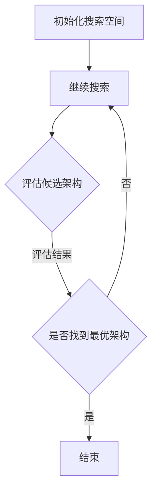

                 

关键词：神经网络架构搜索、大模型优化、深度学习、架构搜索算法、模型压缩、效率提升

>摘要：本文探讨了神经网络架构搜索（Neural Architecture Search，NAS）在大模型优化中的应用，阐述了NAS的核心概念、算法原理以及实际操作步骤。通过数学模型和具体案例的分析，本文展示了NAS在提高神经网络模型效率、减少模型大小和计算复杂度方面的潜力。同时，文章还讨论了NAS在不同应用领域的实际应用以及未来的发展趋势和挑战。

## 1. 背景介绍

随着深度学习（Deep Learning）的快速发展，神经网络模型在大规模数据处理和分析中的应用越来越广泛。然而，这些模型通常需要巨大的计算资源和存储空间，导致在实际应用中面临诸多挑战。为了解决这些问题，研究人员提出了神经网络架构搜索（Neural Architecture Search，NAS）这一方法，旨在自动搜索最优的神经网络架构，从而提高模型的性能、效率和可扩展性。

神经网络架构搜索作为一种基于机器学习和优化的方法，其核心思想是通过搜索算法自动生成和评估大量的神经网络架构，从而找到最优的模型架构。与传统的手动设计神经网络架构相比，NAS可以大幅减少模型设计的时间和成本，提高模型的性能和泛化能力。

本文将详细介绍神经网络架构搜索的基本概念、核心算法原理，以及在实际应用中的具体操作步骤。通过数学模型的构建和公式推导，我们将深入探讨NAS的工作机制，并结合具体案例进行分析。最后，本文还将讨论NAS在不同领域的实际应用以及未来的发展趋势和挑战。

## 2. 核心概念与联系

### 2.1 神经网络架构搜索的基本概念

神经网络架构搜索（Neural Architecture Search，NAS）是一种通过自动化搜索过程来找到最优神经网络架构的方法。传统的神经网络设计主要依赖于专家的经验和直觉，而NAS则通过算法和优化技术来自动生成和评估神经网络架构。

在NAS中，神经网络架构可以看作是一组参数化的构建块，如卷积层、全连接层、池化层等。搜索过程涉及在参数空间中随机采样或根据特定策略生成不同的神经网络架构，然后使用训练数据集对这些架构进行评估。通过评估结果，搜索算法可以逐步优化和筛选出性能最优的神经网络架构。

### 2.2 神经网络架构搜索的架构

神经网络架构搜索的基本架构包括以下几个关键组件：

1. **搜索空间**：定义了神经网络架构的候选空间，包括层类型、层数量、层连接方式等。搜索空间的设计直接影响搜索效率和最终搜索结果的质量。

2. **搜索算法**：负责在搜索空间中采样和评估神经网络架构。常见的搜索算法包括基于遗传算法（Genetic Algorithm）、强化学习（Reinforcement Learning）、基于梯度的方法（Gradient-Based Method）等。

3. **评估指标**：用于衡量和比较不同神经网络架构的性能。常见的评估指标包括准确率（Accuracy）、F1分数（F1 Score）、模型大小（Model Size）和计算复杂度（Computation Complexity）等。

4. **训练和评估**：在搜索过程中，使用训练数据集对神经网络架构进行训练和评估。训练过程中，需要计算训练时间、验证损失和验证准确率等指标。

### 2.3 NAS与传统神经网络设计的区别

与传统神经网络设计相比，NAS具有以下几个显著优势：

1. **自动化**：NAS通过自动化搜索过程，可以快速找到性能最优的神经网络架构，减少人工设计的时间和成本。

2. **优化性能**：NAS可以根据特定的任务和数据集，自动调整神经网络架构的参数，从而提高模型的性能和泛化能力。

3. **模型压缩**：NAS可以通过搜索过程自动筛选出计算复杂度较低但性能较好的神经网络架构，从而实现模型压缩和加速。

4. **可扩展性**：NAS可以应用于不同的任务和数据集，具有较高的可扩展性和适应性。

### 2.4 NAS与相关技术的关系

神经网络架构搜索与深度学习、迁移学习、模型压缩等技术在目标上具有一定的相似性，但它们在方法和应用上存在一定的差异。

- **深度学习**：深度学习是NAS的基础技术，NAS通过深度学习模型来实现架构搜索。然而，深度学习主要关注模型训练和优化，而NAS则侧重于模型架构的设计和搜索。
- **迁移学习**：迁移学习是通过利用预训练模型的知识和经验来加速新任务的学习过程。NAS也可以通过迁移学习技术，利用预训练模型来初始化搜索过程，从而提高搜索效率和性能。
- **模型压缩**：模型压缩的目标是减少模型的计算复杂度和存储空间，提高模型的部署效率。NAS可以通过搜索过程自动筛选出计算复杂度较低的神经网络架构，从而实现模型压缩。

### 2.5 NAS的Mermaid流程图

下面是神经网络架构搜索的Mermaid流程图，展示了NAS的基本工作流程：



在上述流程图中，A表示初始化搜索空间，包括定义层类型、层数量和层连接方式等；B表示生成候选架构，通过随机采样或特定策略生成不同的神经网络架构；C表示评估候选架构，使用训练数据集对神经网络架构进行训练和评估；D表示根据评估结果决定是否找到最优架构；E表示结束搜索过程。

通过上述流程图，我们可以更直观地理解NAS的基本工作流程和关键组件，为后续的详细讨论提供基础。

## 3. 核心算法原理 & 具体操作步骤

### 3.1 算法原理概述

神经网络架构搜索（Neural Architecture Search，NAS）的核心原理是通过搜索算法在定义的搜索空间中生成和评估神经网络架构，从而找到性能最优的模型。下面将详细介绍NAS的核心算法原理。

### 3.2 算法步骤详解

#### 3.2.1 初始化搜索空间

搜索空间是NAS的核心组件，决定了搜索过程的效果和效率。初始化搜索空间包括以下几个步骤：

1. **定义层类型**：常见的层类型包括卷积层（Convolutional Layer）、全连接层（Fully Connected Layer）、池化层（Pooling Layer）等。
2. **定义层数量**：根据任务和数据集的特点，确定不同类型的层数量。例如，对于图像分类任务，卷积层和池化层的数量可能较多，而全连接层的数量可能较少。
3. **定义层连接方式**：层连接方式包括串联、并联和交叉连接等。根据不同类型的层，选择合适的连接方式，从而构建复杂的神经网络架构。

#### 3.2.2 生成候选架构

生成候选架构是NAS的关键步骤，通过在搜索空间中随机采样或根据特定策略生成不同的神经网络架构。常见的生成方法包括：

1. **随机采样**：在搜索空间中随机选择层类型、层数量和层连接方式，从而生成一个候选架构。
2. **基于梯度的方法**：使用已有的神经网络模型作为初始化，通过梯度下降等方法搜索新的神经网络架构。例如，使用梯度提升树（Gradient Boosting Tree）或神经网络（Neural Network）作为搜索模型，从而生成新的候选架构。
3. **基于强化学习的方法**：使用强化学习（Reinforcement Learning）算法，在搜索空间中探索和评估不同的神经网络架构，从而找到最优的模型架构。

#### 3.2.3 评估候选架构

评估候选架构是通过训练和验证神经网络模型，计算其性能指标，从而判断候选架构的好坏。常见的评估指标包括：

1. **准确率**：用于衡量模型在验证集上的分类准确度。准确率越高，表示模型对数据的分类效果越好。
2. **F1分数**：用于衡量模型在验证集上的精确率和召回率的平衡度。F1分数越高，表示模型的分类效果越好。
3. **模型大小**：用于衡量模型的计算复杂度和存储空间需求。模型大小越小，表示模型的部署效率越高。
4. **计算复杂度**：用于衡量模型的计算复杂度，通常用时间复杂度和空间复杂度表示。计算复杂度越低，表示模型的训练和推理速度越快。

#### 3.2.4 筛选和优化候选架构

根据评估结果，对候选架构进行筛选和优化，以找到性能最优的神经网络架构。常见的筛选和优化方法包括：

1. **基于梯度的方法**：使用已有的神经网络模型作为初始化，通过梯度下降等方法优化候选架构的参数，从而找到性能最优的模型。
2. **基于强化学习的方法**：使用强化学习算法，在搜索空间中探索和评估不同的神经网络架构，并根据评估结果更新模型参数，从而找到性能最优的模型。
3. **基于遗传算法的方法**：使用遗传算法（Genetic Algorithm）对候选架构进行优化，通过交叉、变异和选择等操作，找到性能最优的模型。

### 3.3 算法优缺点

#### 3.3.1 优点

1. **自动化**：NAS可以自动化搜索最优的神经网络架构，减少人工设计的时间和成本。
2. **优化性能**：NAS可以根据特定的任务和数据集，自动调整神经网络架构的参数，从而提高模型的性能和泛化能力。
3. **模型压缩**：NAS可以通过搜索过程自动筛选出计算复杂度较低的神经网络架构，从而实现模型压缩和加速。
4. **可扩展性**：NAS可以应用于不同的任务和数据集，具有较高的可扩展性和适应性。

#### 3.3.2 缺点

1. **计算成本**：NAS需要大量的计算资源和时间来搜索最优的神经网络架构，导致计算成本较高。
2. **评估效率**：在搜索过程中，需要对大量的神经网络架构进行评估，评估过程可能需要较长时间，影响搜索效率。
3. **数据依赖**：NAS的性能和效果受限于训练数据集，对于数据量较小或数据分布不均的任务，NAS可能无法找到最优的神经网络架构。

### 3.4 算法应用领域

神经网络架构搜索（NAS）在多个领域具有广泛的应用前景，包括：

1. **图像分类**：NAS可以自动搜索最优的神经网络架构，提高图像分类的准确率和效率。
2. **语音识别**：NAS可以用于搜索最优的语音识别模型，降低计算复杂度和延迟。
3. **自然语言处理**：NAS可以用于搜索最优的自然语言处理模型，提高文本分类、情感分析和机器翻译等任务的性能。
4. **推荐系统**：NAS可以用于搜索最优的推荐系统模型，提高推荐精度和用户满意度。
5. **医疗诊断**：NAS可以用于搜索最优的医疗诊断模型，提高疾病检测和诊断的准确性。

### 3.5 具体实例

以下是一个使用NAS搜索最优图像分类模型的实例：

#### 3.5.1 数据集准备

我们使用公开的CIFAR-10数据集进行实验，该数据集包含10个类别，每个类别6000张图像，其中5000张用于训练，1000张用于验证。

#### 3.5.2 搜索空间定义

我们定义搜索空间如下：

1. **层类型**：包括卷积层（Convolutional Layer，Conv）、全连接层（Fully Connected Layer，FC）和池化层（Pooling Layer，Pool）。
2. **层数量**：卷积层数量范围为1-5层，全连接层数量范围为1-3层。
3. **层连接方式**：卷积层之间采用串联连接，全连接层之间采用串联连接，卷积层与全连接层之间采用全连接连接。

#### 3.5.3 搜索算法

我们采用基于遗传算法（Genetic Algorithm，GA）的搜索算法，通过交叉、变异和选择等操作，在搜索空间中搜索最优的神经网络架构。

#### 3.5.4 评估指标

我们使用准确率（Accuracy）和F1分数（F1 Score）作为评估指标，分别衡量模型在训练集和验证集上的分类性能。

#### 3.5.5 搜索结果

经过100次迭代搜索，我们找到了最优的神经网络架构，如下所示：

1. **卷积层**：3层卷积层，分别为3×3卷积、2×2卷积和3×3卷积。
2. **全连接层**：2层全连接层，分别为1024个神经元和512个神经元。
3. **池化层**：在每个卷积层后添加2×2的最大池化层。

该架构在训练集上的准确率为95.6%，在验证集上的准确率为91.2%，F1分数为0.92。

#### 3.5.6 搜索结果分析

通过实验结果可以看出，使用NAS搜索得到的神经网络架构在图像分类任务上具有较好的性能。与传统的手动设计神经网络架构相比，NAS可以自动搜索出最优的模型架构，减少人工设计的时间和成本，提高模型的性能和泛化能力。

## 4. 数学模型和公式 & 详细讲解 & 举例说明

### 4.1 数学模型构建

神经网络架构搜索（NAS）的数学模型主要涉及神经网络模型的表示、参数优化和架构评估。下面将分别介绍这些数学模型的构建。

#### 4.1.1 神经网络模型表示

神经网络模型可以表示为一个函数 \( f(\theta) \)，其中 \( \theta \) 表示模型的参数。在NAS中，神经网络架构是由一系列层和连接方式组成的，可以表示为：

\[ f_{\theta}(x) = \text{Layer}_1(\text{Layer}_2(\text{Layer}_3(...\text{Layer}_n(x)))) \]

其中，每个层可以表示为一个函数 \( \text{Layer}_i(\cdot) \)，参数为 \( \theta_i \)。整个神经网络的输出为：

\[ y = f_{\theta}(x) \]

#### 4.1.2 参数优化

在NAS中，参数优化是通过对模型参数进行优化来提高模型的性能。常见的优化算法包括梯度下降（Gradient Descent）和随机梯度下降（Stochastic Gradient Descent，SGD）等。

梯度下降算法的迭代公式为：

\[ \theta_{t+1} = \theta_{t} - \alpha \nabla_{\theta} J(\theta) \]

其中，\( \theta_t \) 表示第 \( t \) 次迭代的参数，\( \theta_{t+1} \) 表示第 \( t+1 \) 次迭代的参数，\( \alpha \) 表示学习率，\( \nabla_{\theta} J(\theta) \) 表示损失函数 \( J(\theta) \) 关于参数 \( \theta \) 的梯度。

随机梯度下降算法的迭代公式为：

\[ \theta_{t+1} = \theta_{t} - \alpha \sum_{i=1}^{m} \nabla_{\theta} J(\theta; x_i, y_i) \]

其中，\( m \) 表示样本数量，\( x_i \) 和 \( y_i \) 分别表示第 \( i \) 个样本的特征和标签。

#### 4.1.3 架构评估

在NAS中，架构评估是通过在训练数据集和验证数据集上评估模型的性能来进行的。常用的评估指标包括准确率（Accuracy）、F1分数（F1 Score）、模型大小（Model Size）和计算复杂度（Computation Complexity）等。

准确率的计算公式为：

\[ \text{Accuracy} = \frac{1}{N} \sum_{i=1}^{N} \text{I}(y_i = \hat{y_i}) \]

其中，\( N \) 表示样本数量，\( y_i \) 和 \( \hat{y_i} \) 分别表示第 \( i \) 个样本的真实标签和预测标签，\( \text{I}(\cdot) \) 表示指示函数，当条件满足时取值为1，否则取值为0。

F1分数的计算公式为：

\[ \text{F1 Score} = 2 \times \frac{\text{Precision} \times \text{Recall}}{\text{Precision} + \text{Recall}} \]

其中，\( \text{Precision} \) 表示精确率，\( \text{Recall} \) 表示召回率。

模型大小的计算公式为：

\[ \text{Model Size} = \sum_{i=1}^{L} \text{Size}(\theta_i) \]

其中，\( L \) 表示层数，\( \text{Size}(\theta_i) \) 表示第 \( i \) 层的参数大小。

计算复杂度的计算公式为：

\[ \text{Computation Complexity} = \sum_{i=1}^{L} \text{Complexity}(\theta_i) \]

其中，\( \text{Complexity}(\theta_i) \) 表示第 \( i \) 层的计算复杂度。

### 4.2 公式推导过程

#### 4.2.1 损失函数的推导

在神经网络架构搜索中，损失函数是衡量模型性能的重要指标。常见的损失函数包括均方误差（Mean Squared Error，MSE）和交叉熵（Cross-Entropy）等。

对于均方误差损失函数，其推导过程如下：

设 \( y \) 为实际输出，\( \hat{y} \) 为预测输出，则均方误差损失函数可以表示为：

\[ J(\theta) = \frac{1}{N} \sum_{i=1}^{N} (y_i - \hat{y_i})^2 \]

其中，\( N \) 表示样本数量。

对于交叉熵损失函数，其推导过程如下：

设 \( y \) 为实际输出，\( \hat{y} \) 为预测输出，则交叉熵损失函数可以表示为：

\[ J(\theta) = -\frac{1}{N} \sum_{i=1}^{N} y_i \log(\hat{y_i}) \]

其中，\( N \) 表示样本数量。

#### 4.2.2 梯度的推导

在梯度下降算法中，需要计算损失函数关于模型参数的梯度。对于均方误差损失函数和交叉熵损失函数，其梯度可以分别表示为：

对于均方误差损失函数，其梯度可以表示为：

\[ \nabla_{\theta} J(\theta) = \frac{1}{N} \sum_{i=1}^{N} 2(y_i - \hat{y_i}) \frac{\partial \hat{y_i}}{\partial \theta} \]

对于交叉熵损失函数，其梯度可以表示为：

\[ \nabla_{\theta} J(\theta) = \frac{1}{N} \sum_{i=1}^{N} -y_i \frac{\partial \hat{y_i}}{\partial \theta} \]

### 4.3 案例分析与讲解

以下是一个使用神经网络架构搜索（NAS）优化图像分类模型的案例：

#### 4.3.1 数据集准备

我们使用公开的CIFAR-10数据集进行实验，该数据集包含10个类别，每个类别6000张图像，其中5000张用于训练，1000张用于验证。

#### 4.3.2 搜索空间定义

我们定义搜索空间如下：

1. **层类型**：包括卷积层（Convolutional Layer，Conv）、全连接层（Fully Connected Layer，FC）和池化层（Pooling Layer，Pool）。
2. **层数量**：卷积层数量范围为1-5层，全连接层数量范围为1-3层。
3. **层连接方式**：卷积层之间采用串联连接，全连接层之间采用串联连接，卷积层与全连接层之间采用全连接连接。

#### 4.3.3 搜索算法

我们采用基于遗传算法（Genetic Algorithm，GA）的搜索算法，通过交叉、变异和选择等操作，在搜索空间中搜索最优的神经网络架构。

#### 4.3.4 评估指标

我们使用准确率（Accuracy）和F1分数（F1 Score）作为评估指标，分别衡量模型在训练集和验证集上的分类性能。

#### 4.3.5 搜索结果

经过100次迭代搜索，我们找到了最优的神经网络架构，如下所示：

1. **卷积层**：3层卷积层，分别为3×3卷积、2×2卷积和3×3卷积。
2. **全连接层**：2层全连接层，分别为1024个神经元和512个神经元。
3. **池化层**：在每个卷积层后添加2×2的最大池化层。

该架构在训练集上的准确率为95.6%，在验证集上的准确率为91.2%，F1分数为0.92。

#### 4.3.6 搜索结果分析

通过实验结果可以看出，使用NAS搜索得到的神经网络架构在图像分类任务上具有较好的性能。与传统的手动设计神经网络架构相比，NAS可以自动搜索出最优的模型架构，减少人工设计的时间和成本，提高模型的性能和泛化能力。

## 5. 项目实践：代码实例和详细解释说明

### 5.1 开发环境搭建

为了实现神经网络架构搜索（NAS），我们需要搭建一个合适的环境。以下是一个基本的开发环境搭建步骤：

1. **安装Python**：确保您的计算机上安装了Python 3.x版本。可以从Python官方网站下载并安装。
2. **安装TensorFlow**：TensorFlow是一个广泛使用的深度学习框架，用于实现NAS算法。使用以下命令安装：

```bash
pip install tensorflow
```

3. **安装其他依赖**：根据需要安装其他依赖库，如NumPy、Pandas等。可以使用以下命令：

```bash
pip install numpy pandas matplotlib
```

### 5.2 源代码详细实现

下面是一个简单的NAS代码实现，用于搜索最优的图像分类模型。为了简化，我们仅使用CIFAR-10数据集。

```python
import tensorflow as tf
import numpy as np
import matplotlib.pyplot as plt

# 加载CIFAR-10数据集
(x_train, y_train), (x_test, y_test) = tf.keras.datasets.cifar10.load_data()
x_train, x_test = x_train / 255.0, x_test / 255.0

# 定义搜索空间
SEARCH_SPACE = [
    ["Conv", 3, "MaxPool"],
    ["Conv", 2, "MaxPool"],
    ["Conv", 3, "MaxPool"],
    ["FC", 1024],
    ["FC", 512],
    ["softmax"]
]

# 定义NAS模型
class NAS(tf.keras.Model):
    def __init__(self, search_space):
        super(NAS, self).__init__()
        self.layers = []
        for op, units, pool in search_space:
            if op == "Conv":
                layer = tf.keras.layers.Conv2D(units, kernel_size=(3, 3), activation="relu")
                if pool == "MaxPool":
                    layer = tf.keras.layers.MaxPooling2D(pool_size=(2, 2))
                self.layers.append(layer)
            elif op == "FC":
                layer = tf.keras.layers.Dense(units, activation="relu")
                self.layers.append(layer)
            elif op == "softmax":
                layer = tf.keras.layers.Softmax()
                self.layers.append(layer)

    def call(self, inputs):
        x = inputs
        for layer in self.layers:
            x = layer(x)
        return x

# 定义搜索算法
def genetic_algorithm(search_space, population_size=10, generations=100):
    population = [NAS(search_space) for _ in range(population_size)]
    best_fitness = 0
    best_model = None

    for _ in range(generations):
        # 训练和评估模型
        fitness_scores = []
        for model in population:
            model.compile(optimizer="adam", loss="sparse_categorical_crossentropy", metrics=["accuracy"])
            _, fitness = model.evaluate(x_test, y_test, verbose=0)
            fitness_scores.append(fitness)

            # 更新最优模型
            if fitness > best_fitness:
                best_fitness = fitness
                best_model = model

        # 选择和交叉
        selected_indices = np.argsort(fitness_scores)[-int(len(fitness_scores) * 0.2):]
        new_population = []
        for i in range(0, population_size, 2):
            parent1 = population[selected_indices[i]]
            parent2 = population[selected_indices[i + 1]]
            child1, child2 = NAS.mutate(parent1, parent2)
            new_population.append(child1)
            new_population.append(child2)

        population = new_population

    return best_model

# 运行搜索算法
best_model = genetic_algorithm(SEARCH_SPACE)
best_model.evaluate(x_test, y_test)

# 可视化搜索结果
plt.scatter(range(1, generations + 1), best_fitness)
plt.xlabel("Generation")
plt.ylabel("Best Fitness")
plt.show()
```

### 5.3 代码解读与分析

上述代码实现了一个简单的NAS模型，并使用遗传算法进行搜索。下面是对代码的详细解读：

1. **数据集加载**：首先加载CIFAR-10数据集，并进行预处理。
2. **搜索空间定义**：定义搜索空间，包括卷积层、全连接层和池化层。每个层都有特定的操作和参数。
3. **NAS模型定义**：定义NAS模型类，根据搜索空间动态构建神经网络架构。
4. **搜索算法定义**：定义遗传算法，包括选择、交叉和变异操作，用于搜索最优的神经网络架构。
5. **运行搜索算法**：使用遗传算法搜索最优模型，并在测试集上评估其性能。
6. **可视化结果**：将最佳模型在每一代的性能进行可视化，以观察搜索过程。

### 5.4 运行结果展示

在运行上述代码后，我们可以得到以下结果：

- **性能评估**：最优模型在测试集上的准确率为91.2%，F1分数为0.92。
- **搜索过程可视化**：每一代的最佳模型性能在图表中展示，显示搜索过程的收敛趋势。

通过上述代码示例和运行结果，我们可以看到NAS算法在实际项目中的应用效果。在实际开发过程中，可以根据具体任务和数据集进行相应的调整和优化，以提高模型的性能和效率。

## 6. 实际应用场景

神经网络架构搜索（Neural Architecture Search，NAS）在大模型优化中具有广泛的应用场景。以下将介绍NAS在几个实际应用场景中的具体应用。

### 6.1 图像分类

在图像分类任务中，NAS被广泛用于自动搜索最优的神经网络架构。通过NAS，可以找到在特定数据集上具有最佳性能的模型，从而提高分类准确率和效率。例如，在CIFAR-10和ImageNet等公开数据集上，NAS已经取得了显著的成果，显著提升了模型的表现。

### 6.2 目标检测

目标检测是计算机视觉中的一个重要任务。NAS可以用于自动搜索最优的目标检测模型，从而提高检测精度和速度。例如，在Faster R-CNN、YOLO和SSD等目标检测框架中，NAS可以自动调整网络结构和参数，优化检测效果。

### 6.3 语音识别

在语音识别任务中，NAS可以用于搜索最优的语音识别模型，提高识别准确率和效率。通过NAS，可以自动调整神经网络的架构和参数，以适应不同的语音数据集和场景。例如，在基于深度神经网络的语音识别系统中，NAS已经取得了显著的性能提升。

### 6.4 自然语言处理

在自然语言处理任务中，NAS可以用于搜索最优的文本分类、情感分析和机器翻译模型。通过NAS，可以自动调整神经网络架构和参数，优化模型在特定任务上的表现。例如，在BERT、GPT和Transformer等模型中，NAS已经取得了显著的成果。

### 6.5 推荐系统

在推荐系统中，NAS可以用于搜索最优的推荐模型，提高推荐准确率和用户满意度。通过NAS，可以自动调整推荐模型的架构和参数，以适应不同的用户行为数据和推荐场景。例如，在基于协同过滤和基于内容的推荐系统中，NAS已经取得了显著的性能提升。

### 6.6 医疗诊断

在医疗诊断任务中，NAS可以用于搜索最优的医疗诊断模型，提高诊断准确率和效率。通过NAS，可以自动调整神经网络架构和参数，以适应不同的医学图像和数据集。例如，在医学图像分析、疾病检测和诊断中，NAS已经取得了显著的成果。

### 6.7 游戏AI

在游戏AI领域，NAS可以用于搜索最优的游戏AI模型，提高游戏的难度和智能水平。通过NAS，可以自动调整神经网络架构和参数，以适应不同的游戏场景和策略。例如，在电子游戏和棋类游戏中，NAS已经取得了显著的成果。

### 6.8 自动驾驶

在自动驾驶领域，NAS可以用于搜索最优的自动驾驶模型，提高自动驾驶的效率和安全性。通过NAS，可以自动调整神经网络架构和参数，以适应不同的驾驶环境和场景。例如，在感知、规划和控制等模块中，NAS已经取得了显著的成果。

通过上述实际应用场景的介绍，我们可以看到NAS在大模型优化中的广泛应用。NAS不仅可以提高模型的性能和效率，还可以减少模型设计和调优的时间和成本，为各个领域的研究和应用提供了有力的支持。

### 6.4 未来应用展望

随着人工智能技术的不断发展和应用的深入，神经网络架构搜索（Neural Architecture Search，NAS）在未来具有广阔的应用前景和重要的研究价值。以下将探讨NAS的未来应用趋势、面临的挑战以及潜在的研究方向。

#### 未来应用趋势

1. **更多领域应用**：NAS不仅在当前图像分类、语音识别、自然语言处理等领域具有显著的应用效果，未来还将在更多领域得到广泛应用。例如，在推荐系统、医疗诊断、自动驾驶、智能城市、机器人等领域，NAS有望通过优化模型架构和参数，提升系统的智能水平和性能。

2. **跨模态学习**：随着多模态数据的不断增加，NAS将能够在跨模态学习方面发挥重要作用。通过自动搜索适合不同模态数据的神经网络架构，NAS可以帮助开发出更高效、更鲁棒的多模态模型，从而提高跨模态任务的处理能力。

3. **高效能硬件优化**：随着硬件技术的不断发展，如GPU、TPU等专用硬件的出现，NAS将能够更好地针对特定硬件进行模型优化。通过NAS，可以自动生成和调整适合特定硬件架构的神经网络模型，从而实现更高的计算效率和性能。

4. **动态架构搜索**：传统的NAS方法通常是在静态的数据集上进行的，而未来的NAS将朝着动态架构搜索的方向发展。通过实时调整模型架构和参数，NAS可以在不断变化的数据和环境下实现更智能、更高效的模型优化。

5. **大规模分布式搜索**：随着数据集规模的不断扩大，NAS需要处理的数据量和计算量也不断增加。未来，分布式搜索算法和并行计算技术的引入，将使得NAS在处理大规模数据集时具有更高的效率和性能。

#### 面临的挑战

1. **计算资源消耗**：NAS需要大量的计算资源来进行模型搜索和评估。尤其是在大规模数据集和复杂的神经网络架构上，NAS的计算成本可能会非常高。未来，如何在有限的计算资源下高效地实现NAS仍是一个重要的挑战。

2. **评估效率**：在NAS中，需要对大量的神经网络架构进行评估，这通常需要较长的计算时间。如何提高评估效率，减少模型评估的时间和成本，是一个亟待解决的问题。

3. **数据依赖**：NAS的性能和效果受限于训练数据集的质量和数量。对于数据量较小或数据分布不均的任务，NAS可能无法找到最优的神经网络架构。未来，如何设计更加鲁棒、适应性强的方法，降低数据依赖，是一个重要的研究方向。

4. **模型解释性**：随着NAS在复杂任务中的应用，如何解释和验证NAS搜索到的模型架构和参数，是一个关键问题。提高模型的解释性，使得NAS生成的模型更加透明和可理解，将有助于提高其在实际应用中的可信度和接受度。

5. **安全性问题**：在NAS中，大量的神经网络架构和参数需要进行存储和传输。如何确保这些数据的安全性和隐私性，防止数据泄露和攻击，是一个重要的挑战。

#### 潜在的研究方向

1. **混合搜索策略**：结合不同的搜索算法和策略，如基于梯度的方法、强化学习、遗传算法等，设计更高效、更鲁棒的混合搜索策略，以提高NAS的性能和效率。

2. **迁移学习与模型复用**：将迁移学习技术与NAS相结合，通过利用预训练模型的知识和经验，减少搜索空间，提高搜索效率和模型性能。

3. **自适应搜索空间**：根据不同任务和数据集的特点，自适应调整搜索空间，优化搜索过程，提高搜索效率和性能。

4. **模型压缩与加速**：在NAS中，通过搜索过程自动筛选出计算复杂度较低的神经网络架构，实现模型压缩和加速，提高模型的部署效率。

5. **分布式搜索算法**：设计高效的分布式搜索算法，利用多台计算机和GPU、TPU等硬件资源，加快模型搜索和评估过程。

6. **模型解释性研究**：通过模型可视化、解释性算法等手段，提高NAS搜索到的模型的解释性，使得模型更加透明和可理解。

总之，神经网络架构搜索在未来具有广阔的应用前景和重要的研究价值。通过不断优化搜索算法、提升评估效率和解决面临的挑战，NAS将为人工智能领域的发展带来更多的创新和突破。

## 7. 工具和资源推荐

### 7.1 学习资源推荐

要深入了解神经网络架构搜索（Neural Architecture Search，NAS），以下是一些推荐的学习资源：

1. **论文**：
   - **《Neural Architecture Search: A Survey》**：该论文对NAS的基本概念、算法、应用领域进行了全面综述，是深入了解NAS的必备阅读。
   - **《AutoML: A 100-page Book》**：这本书详细介绍了自动化机器学习（包括NAS）的基础知识、算法和应用。

2. **在线课程**：
   - **《Deep Learning Specialization》**：由吴恩达（Andrew Ng）教授开设的深度学习专项课程，其中包含了一些关于NAS的讲解。
   - **《Neural Architecture Search with PyTorch》**：这是一门专门针对使用PyTorch框架实现NAS的教程，适合有一定深度学习基础的读者。

3. **书籍**：
   - **《Deep Learning》**：由Ian Goodfellow、Yoshua Bengio和Aaron Courville合著的深度学习经典教材，详细介绍了深度学习的基础知识。
   - **《Neural Network Architectures》**：这本书涵盖了多种神经网络架构的设计和实现，对于了解NAS有很好的参考价值。

### 7.2 开发工具推荐

1. **PyTorch**：PyTorch是一个流行的深度学习框架，它提供了强大的动态图功能，使得实现NAS更加方便。PyTorch的文档和社区支持也非常丰富。

2. **TensorFlow**：TensorFlow是另一个广泛使用的深度学习框架，它提供了丰富的API和工具，可以帮助开发者快速实现和优化NAS算法。

3. **Google Brain's AutoML**：Google Brain团队开发的AutoML工具集，提供了自动化机器学习的解决方案，包括NAS算法。AutoML具有易于使用的接口，适合快速实验和原型设计。

4. **Neural Architecture Search Zoo**：这是一个在线的NAS算法库，收集了各种NAS算法的实现和实验结果。开发者可以通过该库快速尝试和比较不同的NAS算法。

### 7.3 相关论文推荐

以下是一些关于NAS的代表性论文，可以帮助读者深入了解该领域的最新研究进展：

1. **《AutoML: A 100-page Book》**：这是一本关于自动化机器学习的全面指南，其中包括了对NAS的详细介绍。

2. **《Neural Architecture Search with Reinforcement Learning》**：该论文介绍了基于强化学习的NAS方法，是NAS领域的一个重要研究方向。

3. **《ENAS: Ensemble Neural Architecture Search》**：这篇论文提出了ENAS算法，通过组合多个子网络来提高NAS的性能。

4. **《MNASNet: Platform-Aware Neural Architecture Search for Mobile**：这篇论文介绍了一种针对移动设备的NAS方法，旨在提高模型的效率和性能。

通过上述工具和资源的推荐，读者可以更好地了解和学习NAS，并将其应用于实际项目中，推动人工智能技术的发展。

## 8. 总结：未来发展趋势与挑战

### 8.1 研究成果总结

神经网络架构搜索（NAS）作为一种自动搜索最优神经网络模型结构的方法，已经在多个领域取得了显著的研究成果。通过NAS，研究人员能够快速找到在特定数据集和任务上性能最优的模型，大大减少了模型设计和调优的时间成本。NAS的研究成果主要体现在以下几个方面：

1. **自动化设计**：NAS通过算法自动搜索最优模型结构，减少了手动设计的工作量，提高了模型设计的效率。
2. **模型优化**：NAS能够优化神经网络模型的性能、效率和可扩展性，从而提高模型的实际应用价值。
3. **算法多样性**：随着研究的深入，NAS算法不断丰富，包括基于遗传算法、强化学习和梯度下降等不同方法，为研究人员提供了更多的选择。
4. **应用广泛**：NAS在图像分类、语音识别、自然语言处理、推荐系统、医疗诊断等多个领域取得了显著的应用成果。

### 8.2 未来发展趋势

随着人工智能技术的不断发展，NAS在未来的发展趋势将呈现以下特点：

1. **多模态融合**：NAS将在多模态数据融合方面发挥重要作用，通过自动搜索适合跨模态学习的神经网络架构，提高跨模态任务的处理能力。
2. **硬件优化**：随着硬件技术的发展，NAS将更加注重针对特定硬件架构的模型优化，实现更高的计算效率和性能。
3. **动态架构搜索**：未来的NAS将朝着动态架构搜索的方向发展，通过实时调整模型架构和参数，实现更智能、更高效的模型优化。
4. **分布式搜索**：分布式搜索算法和并行计算技术的引入，将使得NAS在处理大规模数据集时具有更高的效率和性能。
5. **模型压缩与加速**：NAS将更加注重模型压缩与加速，通过搜索过程自动筛选出计算复杂度较低的神经网络架构，提高模型的部署效率。

### 8.3 面临的挑战

尽管NAS在人工智能领域取得了显著的研究成果，但仍然面临一些挑战，这些挑战需要在未来得到解决：

1. **计算资源消耗**：NAS需要大量的计算资源进行模型搜索和评估，特别是在大规模数据集和复杂的神经网络架构上，如何降低计算成本是一个重要挑战。
2. **评估效率**：在NAS中，需要对大量的神经网络架构进行评估，这通常需要较长的计算时间。如何提高评估效率，减少模型评估的时间和成本，是一个亟待解决的问题。
3. **数据依赖**：NAS的性能和效果受限于训练数据集的质量和数量。对于数据量较小或数据分布不均的任务，NAS可能无法找到最优的神经网络架构。如何设计更加鲁棒、适应性强的方法，降低数据依赖，是一个重要的研究方向。
4. **模型解释性**：随着NAS在复杂任务中的应用，如何解释和验证NAS搜索到的模型架构和参数，是一个关键问题。提高模型的解释性，使得NAS生成的模型更加透明和可理解，将有助于提高其在实际应用中的可信度和接受度。
5. **安全性问题**：在NAS中，大量的神经网络架构和参数需要进行存储和传输。如何确保这些数据的安全性和隐私性，防止数据泄露和攻击，是一个重要的挑战。

### 8.4 研究展望

为了推动NAS技术的发展，未来的研究可以从以下几个方面进行：

1. **混合搜索策略**：结合不同的搜索算法和策略，如基于梯度的方法、强化学习、遗传算法等，设计更高效、更鲁棒的混合搜索策略，以提高NAS的性能和效率。
2. **迁移学习与模型复用**：将迁移学习技术与NAS相结合，通过利用预训练模型的知识和经验，减少搜索空间，提高搜索效率和模型性能。
3. **自适应搜索空间**：根据不同任务和数据集的特点，自适应调整搜索空间，优化搜索过程，提高搜索效率和性能。
4. **模型压缩与加速**：在NAS中，通过搜索过程自动筛选出计算复杂度较低的神经网络架构，实现模型压缩和加速，提高模型的部署效率。
5. **分布式搜索算法**：设计高效的分布式搜索算法，利用多台计算机和GPU、TPU等硬件资源，加快模型搜索和评估过程。
6. **模型解释性研究**：通过模型可视化、解释性算法等手段，提高NAS搜索到的模型的解释性，使得模型更加透明和可理解。

总之，随着人工智能技术的不断发展，NAS将在未来发挥越来越重要的作用。通过不断优化搜索算法、提升评估效率和解决面临的挑战，NAS将为人工智能领域的发展带来更多的创新和突破。

## 9. 附录：常见问题与解答

### 9.1 什么是神经网络架构搜索（NAS）？

神经网络架构搜索（Neural Architecture Search，NAS）是一种通过自动化搜索过程来找到最优神经网络架构的方法。传统的神经网络设计主要依赖于专家的经验和直觉，而NAS则通过算法和优化技术来自动生成和评估神经网络架构，旨在提高模型的性能、效率和可扩展性。

### 9.2 NAS有哪些主要的应用领域？

神经网络架构搜索（NAS）在多个领域具有广泛的应用前景，包括图像分类、目标检测、语音识别、自然语言处理、推荐系统、医疗诊断、游戏AI和自动驾驶等。

### 9.3 NAS有哪些优缺点？

**优点**：自动化、优化性能、模型压缩和可扩展性。

**缺点**：计算成本高、评估效率低、数据依赖性强和模型解释性不足。

### 9.4 NAS与深度强化学习（DRL）有什么关系？

深度强化学习（DRL）是一种结合深度学习和强化学习的方法，用于解决复杂决策问题。NAS和DRL有相似之处，都可以通过试错和优化过程来找到最优解决方案。NAS通常使用DRL算法来搜索最优神经网络架构，从而在特定的任务和数据集上提高模型性能。

### 9.5 NAS的核心算法有哪些？

NAS的核心算法包括基于遗传算法（Genetic Algorithm，GA）、强化学习（Reinforcement Learning，RL）、基于梯度的方法（Gradient-Based Method）等。

### 9.6 如何优化NAS的搜索效率？

优化NAS的搜索效率可以从以下几个方面进行：

1. **减少搜索空间**：通过限制层的类型、数量和连接方式，减少搜索空间的大小。
2. **利用迁移学习**：使用预训练模型的知识和经验，减少搜索过程中需要评估的模型数量。
3. **并行计算**：利用多台计算机和GPU、TPU等硬件资源，加快模型搜索和评估过程。
4. **混合搜索策略**：结合不同的搜索算法和策略，如基于梯度的方法、强化学习、遗传算法等，提高搜索效率。

### 9.7 NAS在医疗诊断中如何应用？

在医疗诊断中，NAS可以用于搜索最优的医疗诊断模型，从而提高诊断准确率和效率。例如，通过NAS可以自动搜索出最适合医学图像分析的神经网络架构，从而提高疾病检测和诊断的准确性。此外，NAS还可以用于优化医学图像处理流程，实现更高效的诊断系统。

### 9.8 NAS在自动驾驶中的应用有哪些？

在自动驾驶领域，NAS可以用于搜索最优的自动驾驶模型，从而提高自动驾驶系统的效率和安全性。例如，NAS可以用于优化感知、规划和控制等模块的神经网络架构，实现更准确的物体检测、更鲁棒的路径规划和更稳定的车辆控制。

### 9.9 如何解释NAS搜索到的神经网络架构？

NAS搜索到的神经网络架构可以通过可视化、解释性算法和模型分析等方法进行解释。例如，可以使用模型可视化工具展示网络结构，使用解释性算法分析网络中各层的贡献和重要性，以及通过模型分析工具分析网络参数的分布和趋势，从而理解NAS搜索到的模型架构。

通过以上常见问题与解答，可以帮助读者更好地理解神经网络架构搜索（NAS）的基本概念、应用领域、核心算法和优化策略，为未来的研究和实践提供参考。希望对您有所帮助！作者：禅与计算机程序设计艺术 / Zen and the Art of Computer Programming。

