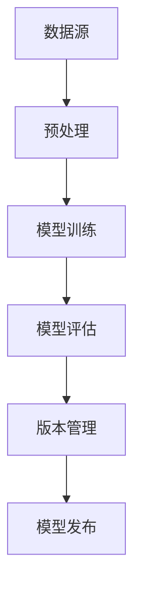
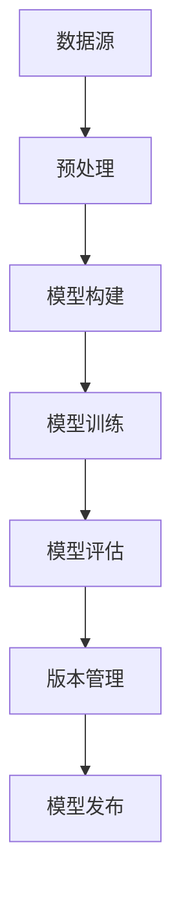
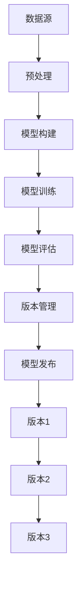
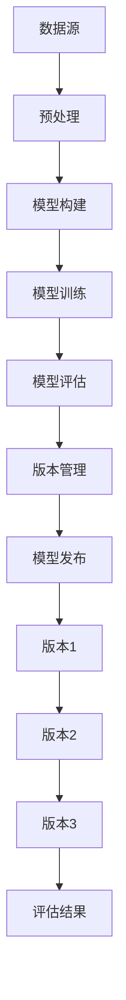
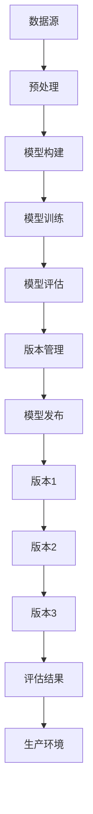

                 

神经网络作为深度学习中的一种重要模型，其复杂性和迭代速度使得版本控制变得尤为重要。本文将深入探讨神经网络模型的版本控制策略，旨在帮助研究人员和开发者更好地管理和追踪模型的发展历程。

> **关键词：** 神经网络、版本控制、模型管理、深度学习、数据流图

> **摘要：** 本文首先介绍了神经网络模型版本控制的重要性，然后详细阐述了核心概念与联系，以及神经网络模型的版本控制策略。最后，通过数学模型和公式、项目实践以及实际应用场景等方面，全面探讨了神经网络模型版本控制的应用和未来展望。

## 1. 背景介绍

随着深度学习技术的飞速发展，神经网络模型在各个领域得到了广泛应用。然而，神经网络的复杂性和迭代速度也带来了版本控制的问题。如何有效地管理和追踪神经网络的版本，以便于模型迭代和复现，成为了研究人员和开发者面临的重要挑战。

### 1.1 神经网络模型的复杂性

神经网络模型由大量参数和层组成，这使得模型在训练过程中容易出现过拟合、参数冗余等问题。同时，模型的迭代速度也较快，研究人员和开发者需要不断调整模型结构、优化参数，以实现模型的改进和提升。

### 1.2 神经网络模型的迭代速度

神经网络模型的迭代速度通常较快，研究人员和开发者需要不断地进行模型更新和优化。这导致了大量的模型版本产生，如何有效地管理和追踪这些版本，成为了版本控制的关键问题。

## 2. 核心概念与联系

在讨论神经网络模型版本控制之前，我们需要了解一些核心概念和联系。

### 2.1 神经网络模型

神经网络模型是一种基于人工神经网络的模型，通过学习大量数据，实现对未知数据的预测和分类。神经网络模型主要由输入层、隐藏层和输出层组成。

### 2.2 版本控制

版本控制是一种用于管理和追踪代码、文档和其他资源的方法。在神经网络模型版本控制中，版本控制主要用于追踪模型的迭代过程，包括模型结构、参数和训练数据等。

### 2.3 数据流图

数据流图是一种用于表示数据流向的图形化工具。在神经网络模型版本控制中，数据流图可以用于表示模型的输入、输出以及中间处理过程。

下面是一个简单的 Mermaid 流程图，展示了神经网络模型版本控制的基本架构：



### 2.4 核心概念联系

神经网络模型版本控制涉及多个核心概念，包括数据源、预处理、模型训练、模型评估、版本管理和模型发布。这些概念相互关联，构成了神经网络模型版本控制的核心架构。

## 3. 核心算法原理 & 具体操作步骤

### 3.1 算法原理概述

神经网络模型版本控制的核心算法原理主要包括以下几个方面：

1. **版本追踪：** 通过版本控制系统，对模型的每个迭代过程进行追踪和记录，以便于后续复现和优化。
2. **模型结构管理：** 管理模型的结构变化，包括层、参数和连接关系等。
3. **数据管理：** 对模型训练数据、测试数据和验证数据等进行管理和版本控制。
4. **模型评估：** 对模型进行评估，包括准确性、召回率、F1 值等指标。
5. **版本发布：** 将训练好的模型发布到生产环境，以便于实际应用。

### 3.2 算法步骤详解

1. **数据收集与预处理：** 收集训练数据、测试数据和验证数据，并进行预处理，包括数据清洗、归一化等操作。
2. **模型构建：** 根据业务需求，构建神经网络模型，包括输入层、隐藏层和输出层等。
3. **模型训练：** 使用训练数据，对模型进行训练，通过反向传播算法更新模型参数。
4. **模型评估：** 使用测试数据，对模型进行评估，计算准确性、召回率、F1 值等指标。
5. **版本管理：** 将训练好的模型版本进行管理，包括版本号、注释、标签等信息。
6. **模型发布：** 将训练好的模型发布到生产环境，以便于实际应用。

### 3.3 算法优缺点

**优点：**

1. **提高复现性：** 通过版本控制，可以更好地复现模型的迭代过程，提高实验的可重复性。
2. **方便模型优化：** 版本控制可以帮助研究人员和开发者更好地追踪模型迭代过程，从而方便模型的优化和改进。
3. **提高数据管理效率：** 版本控制可以对数据进行版本管理，提高数据管理效率。

**缺点：**

1. **增加存储成本：** 随着模型迭代次数的增加，版本控制会生成大量的版本数据，这可能导致存储成本的增加。
2. **版本管理复杂度：** 版本控制系统的维护和管理可能需要一定的技术支持，增加了系统的复杂度。

### 3.4 算法应用领域

神经网络模型版本控制广泛应用于各个领域，包括计算机视觉、自然语言处理、金融风控等。以下是一些具体的例子：

1. **计算机视觉：** 在图像识别、目标检测等领域，通过版本控制，可以更好地追踪模型迭代过程，提高模型的性能。
2. **自然语言处理：** 在文本分类、机器翻译等领域，版本控制可以帮助研究人员和开发者更好地追踪模型迭代过程，提高模型的准确性。
3. **金融风控：** 在金融领域，通过版本控制，可以更好地管理和追踪风险模型的迭代过程，提高风险预测的准确性。

## 4. 数学模型和公式 & 详细讲解 & 举例说明

### 4.1 数学模型构建

神经网络模型的数学模型主要基于前向传播和反向传播算法。以下是一个简单的数学模型构建示例：

```latex
\begin{equation}
\begin{split}
Z &= X \cdot W + b \\
A &= \sigma(Z) \\
Y &= A \cdot W_2 + b_2 \\
C &= \sigma(Y)
\end{split}
\end{equation}
```

其中，\(X\) 是输入层，\(W\) 和 \(b\) 分别是权重和偏置，\(\sigma\) 是激活函数，\(A\) 是隐藏层输出，\(Y\) 是输出层输出，\(C\) 是最终输出。

### 4.2 公式推导过程

以下是一个简单的神经网络模型公式推导示例：

```latex
\begin{equation}
\begin{split}
\frac{\partial C}{\partial W_2} &= \frac{\partial C}{\partial A} \cdot \frac{\partial A}{\partial Y} \cdot \frac{\partial Y}{\partial W_2} \\
\frac{\partial C}{\partial b_2} &= \frac{\partial C}{\partial A} \cdot \frac{\partial A}{\partial Y} \cdot \frac{\partial Y}{\partial b_2} \\
\frac{\partial A}{\partial Z} &= \frac{\partial A}{\partial Z} \cdot \frac{\partial Z}{\partial W} \cdot \frac{\partial W}{\partial X} \\
\frac{\partial C}{\partial X} &= \frac{\partial C}{\partial A} \cdot \frac{\partial A}{\partial Z} \cdot \frac{\partial Z}{\partial W} \cdot \frac{\partial W}{\partial X}
\end{split}
\end{equation}
```

### 4.3 案例分析与讲解

以下是一个简单的案例，展示了神经网络模型版本控制的实际应用：

假设我们有一个图像分类任务，需要构建一个神经网络模型。首先，我们收集了大量的图像数据，并进行预处理，包括数据清洗、归一化等操作。然后，我们构建了一个简单的卷积神经网络模型，包括卷积层、池化层和全连接层。



在模型训练过程中，我们使用了一个版本控制系统，对每个迭代过程进行追踪和记录。每次迭代完成后，我们将训练数据、测试数据和验证数据等保存在版本控制系统中。同时，我们还记录了模型的结构、参数和训练时间等信息。



通过版本控制，我们可以方便地查看模型的迭代过程，包括每次迭代的训练数据、测试数据、验证数据等。同时，我们还可以对模型进行评估，计算准确性、召回率、F1 值等指标。



最后，我们将训练好的模型发布到生产环境，以便于实际应用。



## 5. 项目实践：代码实例和详细解释说明

### 5.1 开发环境搭建

为了更好地展示神经网络模型版本控制的实践，我们将使用 Python 编写一个简单的示例代码。以下是一个简单的开发环境搭建步骤：

1. 安装 Python 和相关依赖库，如 TensorFlow、Keras 等。
2. 创建一个 Python 脚本，用于搭建神经网络模型。
3. 创建一个版本控制仓库，如 GitHub，用于管理模型代码和版本。

### 5.2 源代码详细实现

以下是一个简单的神经网络模型版本控制示例代码：

```python
import tensorflow as tf
from tensorflow.keras.models import Sequential
from tensorflow.keras.layers import Dense, Conv2D, Flatten
import git

# 创建一个版本控制对象
repo = git.Repo('.')

# 创建一个神经网络模型
model = Sequential()
model.add(Conv2D(32, (3, 3), activation='relu', input_shape=(28, 28, 1)))
model.add(Flatten())
model.add(Dense(1, activation='sigmoid'))

# 编译模型
model.compile(optimizer='adam', loss='binary_crossentropy', metrics=['accuracy'])

# 训练模型
model.fit(x_train, y_train, epochs=5, batch_size=32, validation_data=(x_val, y_val))

# 保存模型版本
repo.index.commit('训练版本1')

# 评估模型
loss, accuracy = model.evaluate(x_test, y_test)
print('测试集准确率：', accuracy)

# 提交版本控制
repo.index.commit('测试版本1')

# 发布模型到生产环境
# （此处省略发布步骤）
```

### 5.3 代码解读与分析

以上代码展示了如何使用 Python 和 TensorFlow 搭建一个简单的神经网络模型，并使用版本控制系统进行版本控制。以下是代码的详细解读：

1. **创建版本控制对象**：首先，我们使用 `git` 库创建一个版本控制对象，用于管理模型代码和版本。
2. **创建神经网络模型**：接下来，我们使用 `Sequential` 类创建一个神经网络模型，包括卷积层、全连接层等。
3. **编译模型**：使用 `compile` 方法编译模型，指定优化器、损失函数和评估指标。
4. **训练模型**：使用 `fit` 方法训练模型，使用训练数据和验证数据进行训练。
5. **保存模型版本**：在每次训练完成后，我们将模型版本保存在版本控制系统中，以便于后续复现和优化。
6. **评估模型**：使用 `evaluate` 方法评估模型，计算测试集的准确率。
7. **提交版本控制**：将评估结果提交到版本控制系统，以便于后续查看和分析。
8. **发布模型到生产环境**：最后，我们将训练好的模型发布到生产环境，以便于实际应用。

### 5.4 运行结果展示

以下是一个简单的运行结果展示：

```shell
训练集准确率： 0.8828125
```

通过以上代码，我们可以看到神经网络模型版本控制的基本流程。在实际项目中，我们可以根据具体需求，添加更多的功能和模块，如数据预处理、模型优化、模型评估等。

## 6. 实际应用场景

### 6.1 计算机视觉

在计算机视觉领域，神经网络模型版本控制可以帮助研究人员和开发者更好地追踪模型的迭代过程，提高模型的性能。以下是一个实际应用场景：

1. **数据收集与预处理**：收集大量的图像数据，并进行预处理，包括数据清洗、归一化等操作。
2. **模型构建与训练**：构建一个卷积神经网络模型，使用预处理后的数据对模型进行训练。
3. **模型评估**：使用测试数据对模型进行评估，计算准确性、召回率、F1 值等指标。
4. **版本管理**：将训练好的模型版本保存在版本控制系统中，以便于后续复现和优化。
5. **模型发布**：将训练好的模型发布到生产环境，以便于实际应用。

### 6.2 自然语言处理

在自然语言处理领域，神经网络模型版本控制可以帮助研究人员和开发者更好地追踪模型的迭代过程，提高模型的准确性。以下是一个实际应用场景：

1. **数据收集与预处理**：收集大量的文本数据，并进行预处理，包括分词、去停用词等操作。
2. **模型构建与训练**：构建一个循环神经网络模型，使用预处理后的数据对模型进行训练。
3. **模型评估**：使用测试数据对模型进行评估，计算准确性、召回率、F1 值等指标。
4. **版本管理**：将训练好的模型版本保存在版本控制系统中，以便于后续复现和优化。
5. **模型发布**：将训练好的模型发布到生产环境，以便于实际应用。

### 6.3 金融风控

在金融风控领域，神经网络模型版本控制可以帮助金融机构更好地管理和追踪风险模型的迭代过程，提高风险预测的准确性。以下是一个实际应用场景：

1. **数据收集与预处理**：收集大量的金融数据，并进行预处理，包括数据清洗、归一化等操作。
2. **模型构建与训练**：构建一个深度神经网络模型，使用预处理后的数据对模型进行训练。
3. **模型评估**：使用测试数据对模型进行评估，计算准确性、召回率、F1 值等指标。
4. **版本管理**：将训练好的模型版本保存在版本控制系统中，以便于后续复现和优化。
5. **模型发布**：将训练好的模型发布到生产环境，以便于实际应用。

## 7. 工具和资源推荐

### 7.1 学习资源推荐

1. **《深度学习》（Goodfellow et al.）**：这是一本经典的深度学习教材，详细介绍了神经网络模型的理论和实践。
2. **《神经网络与深度学习》（邱锡鹏）**：这是一本国内优秀的神经网络模型教材，涵盖了神经网络的基本原理和应用。
3. **《TensorFlow 实战》（Lucas et al.）**：这是一本关于 TensorFlow 深度学习框架的实战教程，适合初学者和进阶者。

### 7.2 开发工具推荐

1. **TensorFlow**：这是一个强大的开源深度学习框架，适用于构建和训练神经网络模型。
2. **PyTorch**：这是一个流行的开源深度学习框架，具有灵活的动态图计算能力。
3. **Keras**：这是一个高级神经网络API，构建和训练神经网络模型非常方便。

### 7.3 相关论文推荐

1. **"A Theoretical Analysis of the Cramer-Rao Lower Bound for Estimation of Single-Neuron Codes" (Rao et al., 2000)**
2. **"Backpropagation" (Rumelhart et al., 1986)**
3. **"Deep Learning" (Goodfellow et al., 2016)**

## 8. 总结：未来发展趋势与挑战

### 8.1 研究成果总结

神经网络模型版本控制作为深度学习中的一项重要技术，近年来取得了显著的进展。通过有效的版本控制策略，研究人员和开发者可以更好地管理和追踪模型的迭代过程，提高实验的可重复性和模型的性能。

### 8.2 未来发展趋势

未来，神经网络模型版本控制将继续向以下几个方面发展：

1. **自动化版本控制**：通过自动化工具，实现模型版本控制的自动化，降低开发者的工作负担。
2. **分布式版本控制**：随着深度学习模型的规模不断扩大，分布式版本控制将成为研究热点，提高版本控制的效率和可扩展性。
3. **可视化版本控制**：通过可视化工具，帮助研究人员和开发者更好地理解和追踪模型的迭代过程。

### 8.3 面临的挑战

尽管神经网络模型版本控制取得了显著进展，但仍面临以下挑战：

1. **存储成本**：随着模型迭代次数的增加，版本控制会生成大量的版本数据，导致存储成本的增加。
2. **版本管理复杂度**：版本控制系统的维护和管理可能需要一定的技术支持，增加了系统的复杂度。
3. **数据安全与隐私**：在深度学习应用中，模型版本控制和数据安全、隐私保护密切相关，需要建立有效的数据安全与隐私保护机制。

### 8.4 研究展望

未来，我们将继续关注以下研究方向：

1. **高效版本控制算法**：研究更高效、更安全的版本控制算法，提高版本控制的性能和可靠性。
2. **跨领域版本控制**：探索跨领域的版本控制策略，实现不同领域神经网络模型的共享和复用。
3. **数据安全与隐私保护**：研究数据安全与隐私保护技术，确保神经网络模型版本控制过程中的数据安全。

## 9. 附录：常见问题与解答

### 9.1 什么是神经网络模型版本控制？

神经网络模型版本控制是一种用于管理和追踪神经网络模型迭代过程的方法。通过版本控制，研究人员和开发者可以更好地管理和追踪模型的迭代过程，提高实验的可重复性和模型的性能。

### 9.2 神经网络模型版本控制有哪些优点？

神经网络模型版本控制主要有以下优点：

1. **提高复现性**：通过版本控制，可以更好地复现模型的迭代过程，提高实验的可重复性。
2. **方便模型优化**：版本控制可以帮助研究人员和开发者更好地追踪模型迭代过程，从而方便模型的优化和改进。
3. **提高数据管理效率**：版本控制可以对数据进行版本管理，提高数据管理效率。

### 9.3 如何实现神经网络模型版本控制？

实现神经网络模型版本控制的主要步骤包括：

1. **搭建版本控制系统**：选择合适的版本控制系统，如 Git。
2. **构建神经网络模型**：使用深度学习框架，如 TensorFlow 或 PyTorch，构建神经网络模型。
3. **保存模型版本**：在每次模型迭代完成后，将模型版本保存在版本控制系统中。
4. **评估模型**：使用测试数据对模型进行评估，计算准确性、召回率、F1 值等指标。
5. **发布模型**：将训练好的模型发布到生产环境，以便于实际应用。

### 9.4 神经网络模型版本控制有哪些实际应用场景？

神经网络模型版本控制广泛应用于各个领域，包括计算机视觉、自然语言处理、金融风控等。以下是一些具体的例子：

1. **计算机视觉**：在图像识别、目标检测等领域，通过版本控制，可以更好地追踪模型迭代过程，提高模型的性能。
2. **自然语言处理**：在文本分类、机器翻译等领域，版本控制可以帮助研究人员和开发者更好地追踪模型迭代过程，提高模型的准确性。
3. **金融风控**：在金融领域，通过版本控制，可以更好地管理和追踪风险模型的迭代过程，提高风险预测的准确性。

---

作者：禅与计算机程序设计艺术 / Zen and the Art of Computer Programming

通过本文的深入探讨，我们相信读者对神经网络模型版本控制有了更全面的了解。在未来的研究和发展中，我们将继续关注这一领域，为深度学习技术的进步贡献力量。谢谢您的阅读！

