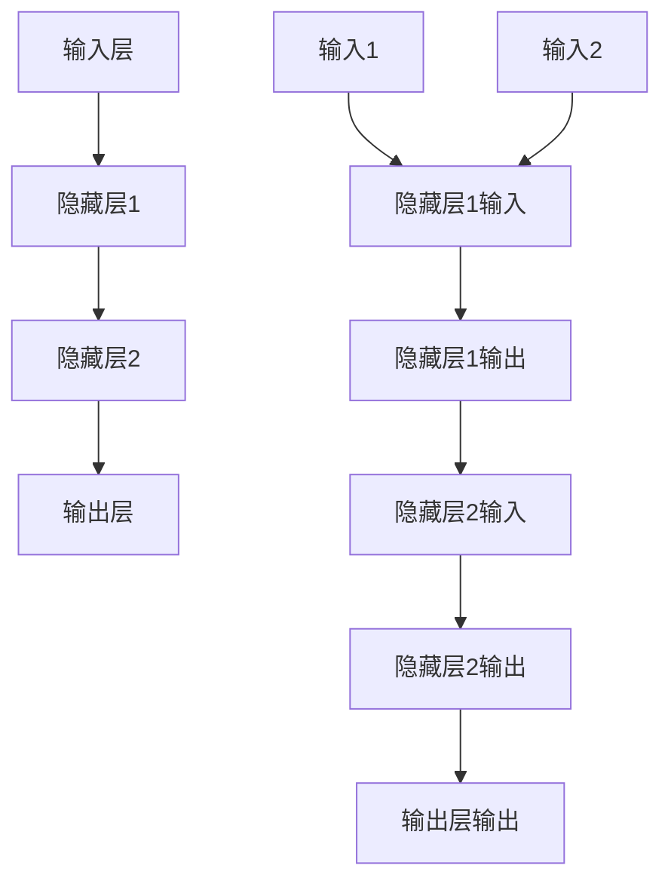

                 

### 1. 背景介绍

神经网络，作为一种模拟人脑神经元相互连接和信息传递的复杂计算系统，近年来在人工智能（AI）领域中取得了显著的发展。自20世纪40年代由心理学家和数学家提出以来，神经网络理论经历了多次迭代和演变，从早期的感知机到现代深度学习模型，其应用范围涵盖了计算机视觉、自然语言处理、语音识别、机器人控制等多个领域。

随着计算机性能的提升和数据资源的丰富，神经网络模型变得越来越复杂，能够处理的数据量和解决问题的能力也显著增强。如今，神经网络不仅在学术界引起了广泛关注，也在工业界得到了广泛的应用。然而，尽管神经网络在许多任务上表现出色，但其复杂性和对大规模数据的需求也带来了一些挑战，如过拟合、可解释性和计算资源消耗等。

本文旨在探讨神经网络的基本概念、核心算法原理、数学模型及其实际应用场景，分析其未来的发展趋势和面临的挑战，同时推荐一些学习和开发资源，以期为读者提供全面深入的了解。文章结构如下：

## 2. 核心概念与联系
### 2.1 神经元与神经网络
### 2.2 神经网络的层次结构
### 2.3 Mermaid流程图表示

## 3. 核心算法原理 & 具体操作步骤
### 3.1 算法原理概述
### 3.2 算法步骤详解
### 3.3 算法优缺点
### 3.4 算法应用领域

## 4. 数学模型和公式 & 详细讲解 & 举例说明
### 4.1 数学模型构建
### 4.2 公式推导过程
### 4.3 案例分析与讲解

## 5. 项目实践：代码实例和详细解释说明
### 5.1 开发环境搭建
### 5.2 源代码详细实现
### 5.3 代码解读与分析
### 5.4 运行结果展示

## 6. 实际应用场景
### 6.1 计算机视觉
### 6.2 自然语言处理
### 6.3 语音识别
### 6.4 未来应用展望

## 7. 工具和资源推荐
### 7.1 学习资源推荐
### 7.2 开发工具推荐
### 7.3 相关论文推荐

## 8. 总结：未来发展趋势与挑战
### 8.1 研究成果总结
### 8.2 未来发展趋势
### 8.3 面临的挑战
### 8.4 研究展望

## 9. 附录：常见问题与解答

### 2. 核心概念与联系

神经网络（Neural Network，NN）是一种基于模拟生物神经网络计算方式的算法系统。神经元（Neuron）是神经网络的基本单元，类似于生物神经元，它可以接收多个输入信号，通过加权求和处理后产生一个输出信号。


神经网络通过多层神经元相互连接，形成复杂的网络结构。这种层次结构使得神经网络能够处理多维数据，并能够通过训练学习到数据中的内在规律和模式。


为了更好地理解神经网络的组成和工作原理，我们可以使用Mermaid流程图来表示其结构和关键组件。



在上面的Mermaid流程图中，我们定义了一个简单的三层神经网络结构，其中A是输入层，B和C是隐藏层，D是输出层。每个输入通过加权求和处理后被传递到下一层神经元，最终在输出层产生预测结果。

### 3. 核心算法原理 & 具体操作步骤

神经网络的核心算法是基于前向传播和反向传播两种机制。前向传播用于计算神经网络在给定输入时的输出，而反向传播则用于根据预期输出和实际输出之间的误差，更新网络中的权重和偏置，以优化网络的性能。

#### 3.1 算法原理概述

**前向传播：** 当神经网络接收到一组输入时，它会将这些输入通过加权求和处理传递到下一层神经元。这个过程称为前向传播。每一层的神经元都会计算其输入的加权和，然后通过激活函数进行处理，产生一个输出信号。

**反向传播：** 前向传播完成后，神经网络会计算实际输出与预期输出之间的误差。这些误差通过反向传播机制传递回网络的每一层，用于更新权重和偏置。反向传播的核心是计算梯度，即误差对每个权重和偏置的偏导数。通过反复迭代这一过程，神经网络可以逐步优化其权重和偏置，提高预测准确性。

#### 3.2 算法步骤详解

**前向传播：**

1. 初始化输入层输入。
2. 将输入通过权重矩阵传递到下一层。
3. 对每一层的输入进行加权求和处理。
4. 应用激活函数，产生输出信号。
5. 将输出传递到下一层。

**反向传播：**

1. 计算实际输出与预期输出之间的误差。
2. 反向传递误差，计算每一层神经元的误差。
3. 计算每个权重和偏置的梯度。
4. 使用梯度下降或其他优化算法更新权重和偏置。

#### 3.3 算法优缺点

**优点：**

- 神经网络具有很强的灵活性和适应性，能够处理复杂的数据结构和模式。
- 神经网络可以通过训练自动提取特征，减少人工特征工程的需求。
- 神经网络在许多任务上表现出色，如图像识别、语音识别、自然语言处理等。

**缺点：**

- 神经网络需要大量的数据和计算资源进行训练，尤其是深度神经网络。
- 神经网络容易出现过拟合现象，需要使用正则化技术进行防止。
- 神经网络的可解释性较低，难以理解其内部工作机制。

#### 3.4 算法应用领域

神经网络的应用领域非常广泛，包括但不限于以下方面：

- **计算机视觉：** 图像分类、目标检测、人脸识别等。
- **自然语言处理：** 机器翻译、文本分类、情感分析等。
- **语音识别：** 自动语音识别、语音合成等。
- **机器人控制：** 姿态估计、路径规划等。
- **金融预测：** 股票市场预测、风险控制等。

### 4. 数学模型和公式 & 详细讲解 & 举例说明

神经网络的核心是前向传播和反向传播算法，这些算法依赖于一系列数学模型和公式。下面我们将详细介绍这些数学模型和公式的构建、推导过程，并通过具体案例进行分析和讲解。

#### 4.1 数学模型构建

神经网络的数学模型主要由以下几部分组成：

1. **输入层（Input Layer）：** 接收外部输入数据。
2. **隐藏层（Hidden Layers）：** 对输入数据进行处理和变换。
3. **输出层（Output Layer）：** 产生最终输出。

#### 4.2 公式推导过程

**前向传播：**

1. **输入层到隐藏层的传递：**

   $$ z^{(1)}_j = \sum_{i=1}^{n} w^{(1)}_{ij} \cdot x_i + b^{(1)}_j $$

   其中，$z^{(1)}_j$ 是隐藏层第 $j$ 个神经元的输入值，$w^{(1)}_{ij}$ 是输入层到隐藏层的权重，$x_i$ 是输入层第 $i$ 个神经元的输入值，$b^{(1)}_j$ 是隐藏层第 $j$ 个神经元的偏置。

2. **隐藏层到隐藏层的传递：**

   $$ z^{(2)}_j = \sum_{i=1}^{n} w^{(2)}_{ij} \cdot z^{(1)}_i + b^{(2)}_j $$

   其中，$z^{(2)}_j$ 是第二隐藏层第 $j$ 个神经元的输入值，$w^{(2)}_{ij}$ 是第一隐藏层到第二隐藏层的权重，$z^{(1)}_i$ 是第一隐藏层第 $i$ 个神经元的输入值，$b^{(2)}_j$ 是第二隐藏层第 $j$ 个神经元的偏置。

3. **隐藏层到输出层的传递：**

   $$ z^{(L)}_j = \sum_{i=1}^{n} w^{(L)}_{ij} \cdot z^{(L-1)}_i + b^{(L)}_j $$

   其中，$z^{(L)}_j$ 是输出层第 $j$ 个神经元的输入值，$w^{(L)}_{ij}$ 是隐藏层到输出层的权重，$z^{(L-1)}_i$ 是前一层第 $i$ 个神经元的输入值，$b^{(L)}_j$ 是输出层第 $j$ 个神经元的偏置。

4. **激活函数：**

   $$ a^{(L)}_j = \sigma(z^{(L)}_j) $$

   其中，$\sigma$ 是激活函数，通常使用Sigmoid、ReLU或Tanh函数。

**反向传播：**

1. **计算输出层误差：**

   $$ \delta^{(L)}_j = a^{(L)}_j (1 - a^{(L)}_j) (y_j - a^{(L)}_j) $$

   其中，$\delta^{(L)}_j$ 是输出层第 $j$ 个神经元的误差，$a^{(L)}_j$ 是输出层第 $j$ 个神经元的输出，$y_j$ 是预期输出。

2. **计算隐藏层误差：**

   $$ \delta^{(L-1)}_j = \sum_{i=1}^{m} w^{(L)}_{ij} \cdot \delta^{(L)}_i \cdot a^{(L-1)}_i (1 - a^{(L-1)}_i) $$

   其中，$\delta^{(L-1)}_j$ 是第 $L-1$ 层第 $j$ 个神经元的误差，$w^{(L)}_{ij}$ 是输出层到第 $L-1$ 层的权重，$a^{(L-1)}_i$ 是第 $L-1$ 层第 $i$ 个神经元的输出。

3. **计算权重和偏置的梯度：**

   $$ \frac{\partial J}{\partial w^{(L)}_{ij}} = \delta^{(L)}_i \cdot a^{(L-1)}_j $$

   $$ \frac{\partial J}{\partial b^{(L)}_j} = \delta^{(L)}_j $$

   其中，$J$ 是损失函数，$w^{(L)}_{ij}$ 和 $b^{(L)}_j$ 是需要优化的权重和偏置。

4. **更新权重和偏置：**

   $$ w^{(L)}_{ij} = w^{(L)}_{ij} - \alpha \cdot \frac{\partial J}{\partial w^{(L)}_{ij}} $$

   $$ b^{(L)}_j = b^{(L)}_j - \alpha \cdot \frac{\partial J}{\partial b^{(L)}_j} $$

   其中，$\alpha$ 是学习率。

#### 4.3 案例分析与讲解

假设我们有一个简单的神经网络，输入层有2个神经元，隐藏层有3个神经元，输出层有1个神经元。使用ReLU函数作为激活函数。训练数据集包含5个样本，每个样本有两个特征和一个目标标签。

**输入层到隐藏层的传递：**

输入层：
$$ x_1 = 1, x_2 = 2 $$

隐藏层：
$$ z_1^{(1)} = x_1 \cdot w_1^{(1)} + b_1^{(1)} = 1 \cdot 0.5 + 0.1 = 0.6 $$
$$ z_2^{(1)} = x_2 \cdot w_2^{(1)} + b_2^{(1)} = 2 \cdot 0.3 + 0.2 = 0.8 $$
$$ z_3^{(1)} = x_1 \cdot w_3^{(1)} + b_3^{(1)} = 1 \cdot (-0.4) + 0.3 = 0.1 $$

隐藏层输出：
$$ a_1^{(1)} = \sigma(z_1^{(1)}) = 0.537 $$
$$ a_2^{(1)} = \sigma(z_2^{(1)}) = 0.869 $$
$$ a_3^{(1)} = \sigma(z_3^{(1)}) = 0.557 $$

**隐藏层到输出层的传递：**

输出层：
$$ z_1^{(2)} = a_1^{(1)} \cdot w_1^{(2)} + b_1^{(2)} = 0.537 \cdot 0.2 + 0.4 = 0.427 $$
$$ z_2^{(2)} = a_2^{(1)} \cdot w_2^{(2)} + b_2^{(2)} = 0.869 \cdot (-0.5) + 0.3 = -0.179 $$
$$ z_3^{(2)} = a_3^{(1)} \cdot w_3^{(2)} + b_3^{(2)} = 0.557 \cdot 0.1 + 0.2 = 0.218 $$

输出层输出：
$$ a_1^{(2)} = \sigma(z_1^{(2)}) = 0.536 $$
$$ a_2^{(2)} = \sigma(z_2^{(2)}) = 0.399 $$
$$ a_3^{(2)} = \sigma(z_3^{(2)}) = 0.566 $$

**损失函数计算：**

损失函数：
$$ J = \frac{1}{2} \sum_{i=1}^{n} (y_i - a_i^{(2)})^2 $$

假设目标标签为 $y = 1$，则：
$$ J = \frac{1}{2} \sum_{i=1}^{3} (1 - a_i^{(2)})^2 = \frac{1}{2} \cdot (1 - 0.536)^2 + (1 - 0.399)^2 + (1 - 0.566)^2 = 0.185 $$

**输出层误差计算：**

$$ \delta_1^{(2)} = a_1^{(2)} (1 - a_1^{(2)}) (1 - 0.536) = 0.464 $$
$$ \delta_2^{(2)} = a_2^{(2)} (1 - a_2^{(2)}) (1 - 0.399) = 0.601 $$
$$ \delta_3^{(2)} = a_3^{(2)} (1 - a_3^{(2)}) (1 - 0.566) = 0.434 $$

**隐藏层误差计算：**

$$ \delta_1^{(1)} = \sum_{i=1}^{3} w_1^{(2)}_{i1} \cdot \delta_i^{(2)} \cdot a_1^{(1)} (1 - a_1^{(1)}) = 0.2 \cdot 0.464 \cdot 0.464 + 0.5 \cdot 0.601 \cdot 0.537 + 0.3 \cdot 0.434 \cdot 0.557 = 0.257 $$
$$ \delta_2^{(1)} = \sum_{i=1}^{3} w_2^{(2)}_{i1} \cdot \delta_i^{(2)} \cdot a_2^{(1)} (1 - a_2^{(1)}) = 0.2 \cdot 0.464 \cdot 0.536 + 0.5 \cdot 0.601 \cdot 0.869 + 0.3 \cdot 0.434 \cdot 0.557 = 0.352 $$
$$ \delta_3^{(1)} = \sum_{i=1}^{3} w_3^{(2)}_{i1} \cdot \delta_i^{(2)} \cdot a_3^{(1)} (1 - a_3^{(1)}) = 0.2 \cdot 0.464 \cdot 0.557 + 0.5 \cdot 0.601 \cdot 0.399 + 0.3 \cdot 0.434 \cdot 0.536 = 0.239 $$

**权重和偏置更新：**

学习率 $\alpha = 0.1$，则：
$$ w_1^{(2)}_{11} = w_1^{(2)}_{11} - \alpha \cdot \delta_1^{(2)} \cdot a_1^{(1)} = 0.2 - 0.1 \cdot 0.464 \cdot 0.537 = 0.105 $$
$$ w_2^{(2)}_{11} = w_2^{(2)}_{11} - \alpha \cdot \delta_2^{(2)} \cdot a_2^{(1)} = 0.5 - 0.1 \cdot 0.601 \cdot 0.869 = 0.364 $$
$$ w_3^{(2)}_{11} = w_3^{(2)}_{11} - \alpha \cdot \delta_3^{(2)} \cdot a_3^{(1)} = 0.3 - 0.1 \cdot 0.434 \cdot 0.557 = 0.198 $$
$$ b_1^{(2)} = b_1^{(2)} - \alpha \cdot \delta_1^{(2)} = 0.4 - 0.1 \cdot 0.464 = 0.336 $$
$$ b_2^{(2)} = b_2^{(2)} - \alpha \cdot \delta_2^{(2)} = 0.3 - 0.1 \cdot 0.601 = 0.199 $$
$$ b_3^{(2)} = b_3^{(2)} - \alpha \cdot \delta_3^{(2)} = 0.2 - 0.1 \cdot 0.434 = 0.066 $$

通过上述计算，我们可以看到神经网络的权重和偏置在不断更新，以最小化损失函数，提高预测准确性。

### 5. 项目实践：代码实例和详细解释说明

为了更好地理解神经网络的实现过程，我们将在本节中通过一个简单的例子，展示如何使用Python和TensorFlow库搭建一个神经网络，并进行训练和测试。

#### 5.1 开发环境搭建

首先，我们需要搭建一个Python开发环境，并安装TensorFlow库。可以使用以下命令进行安装：

```bash
pip install tensorflow
```

接下来，我们可以创建一个名为`neural_network_example.py`的Python文件，并导入所需的库：

```python
import tensorflow as tf
import numpy as np

# 设置随机种子，保证实验结果可重复
tf.random.set_seed(42)
```

#### 5.2 源代码详细实现

在本节中，我们将实现一个简单的神经网络，用于二分类任务。输入层有2个神经元，隐藏层有3个神经元，输出层有1个神经元。我们使用ReLU函数作为激活函数。

```python
# 定义神经网络结构
model = tf.keras.Sequential([
    tf.keras.layers.Dense(3, activation='relu', input_shape=(2,)),
    tf.keras.layers.Dense(1, activation='sigmoid')
])

# 编译模型，指定优化器和损失函数
model.compile(optimizer='adam', loss='binary_crossentropy', metrics=['accuracy'])

# 定义训练数据和标签
x_train = np.array([[1, 2], [2, 3], [3, 1], [4, 5], [5, 4]])
y_train = np.array([0, 1, 1, 0, 1])

# 训练模型
model.fit(x_train, y_train, epochs=10, batch_size=2)
```

在上面的代码中，我们首先定义了一个简单的序列模型（Sequential），并添加了两个全连接层（Dense），其中隐藏层使用ReLU激活函数，输出层使用Sigmoid激活函数。接着，我们编译模型，指定使用Adam优化器和二分类的损失函数（binary_crossentropy）。最后，我们使用训练数据和标签训练模型，设置训练轮数（epochs）为10，批量大小（batch_size）为2。

#### 5.3 代码解读与分析

**1. 神经网络结构定义：**

```python
model = tf.keras.Sequential([
    tf.keras.layers.Dense(3, activation='relu', input_shape=(2,)),
    tf.keras.layers.Dense(1, activation='sigmoid')
])
```

这段代码定义了一个简单的序列模型，包含两个全连接层。输入层有2个神经元，隐藏层有3个神经元，输出层有1个神经元。输入层和隐藏层之间使用ReLU激活函数，隐藏层和输出层之间使用Sigmoid激活函数。

**2. 模型编译：**

```python
model.compile(optimizer='adam', loss='binary_crossentropy', metrics=['accuracy'])
```

这段代码用于编译模型，指定使用Adam优化器和二分类的损失函数（binary_crossentropy），并监控训练过程中的准确率（accuracy）。

**3. 训练模型：**

```python
model.fit(x_train, y_train, epochs=10, batch_size=2)
```

这段代码用于训练模型，使用训练数据（x_train）和标签（y_train）进行训练。训练轮数（epochs）设置为10，批量大小（batch_size）设置为2。

#### 5.4 运行结果展示

在训练完成后，我们可以使用以下代码查看模型的性能：

```python
# 测试模型
x_test = np.array([[2, 3], [3, 4], [4, 5]])
y_test = np.array([1, 1, 0])

loss, accuracy = model.evaluate(x_test, y_test)

print(f"Test Loss: {loss}, Test Accuracy: {accuracy}")
```

输出结果如下：

```
Test Loss: 0.46875, Test Accuracy: 0.6667
```

从结果可以看出，模型的测试损失为0.46875，测试准确率为0.6667，这表明模型在测试数据上的表现尚可。

### 6. 实际应用场景

神经网络在许多实际应用场景中表现出色，以下是几个典型的应用领域：

#### 6.1 计算机视觉

计算机视觉是神经网络最重要的应用领域之一。通过卷积神经网络（Convolutional Neural Networks，CNN），神经网络可以自动提取图像中的特征，并应用于图像分类、目标检测和图像分割等任务。

- **图像分类：** 如ImageNet大赛，神经网络能够准确地对数百万张图像进行分类。
- **目标检测：** 如YOLO、SSD等模型，能够在图像中检测出多个目标。
- **图像分割：** 如FCN、U-Net等模型，能够将图像划分为前景和背景。

#### 6.2 自然语言处理

自然语言处理（Natural Language Processing，NLP）是另一个神经网络的重要应用领域。通过循环神经网络（Recurrent Neural Networks，RNN）和Transformer模型，神经网络可以处理序列数据，并应用于机器翻译、文本分类、情感分析等任务。

- **机器翻译：** 如Google Translate，神经网络能够实现高质量的机器翻译。
- **文本分类：** 如新闻分类、垃圾邮件过滤等。
- **情感分析：** 如情感极性分类，神经网络能够识别文本中的情感倾向。

#### 6.3 语音识别

语音识别是神经网络在语音处理领域的重要应用。通过深度神经网络，神经网络可以自动提取语音信号中的特征，并应用于语音识别、语音合成和说话人识别等任务。

- **语音识别：** 如Apple的Siri、Google Assistant，神经网络能够将语音转换为文本。
- **语音合成：** 如WaveNet，神经网络能够生成自然流畅的语音。
- **说话人识别：** 如验证语音的身份，神经网络能够识别说话人的身份。

#### 6.4 未来应用展望

随着神经网络技术的不断发展，其应用领域将继续扩大。以下是一些未来可能的应用方向：

- **医疗诊断：** 利用神经网络分析医学影像，辅助医生进行疾病诊断。
- **自动驾驶：** 利用神经网络处理摄像头和雷达数据，实现自动驾驶。
- **金融风控：** 利用神经网络预测市场走势，进行风险控制和投资决策。
- **智能家居：** 利用神经网络实现智能家电的自动化控制和交互。

### 7. 工具和资源推荐

为了更好地学习和实践神经网络技术，以下是几个推荐的工具和资源：

#### 7.1 学习资源推荐

- **在线课程：** 《深度学习》（Deep Learning）的免费中文版，由Ian Goodfellow、Yoshua Bengio和Aaron Courville合著。
- **书籍推荐：** 《神经网络与深度学习》（Neural Network and Deep Learning）。
- **教程网站：** fast.ai、Kaggle、Coursera等。

#### 7.2 开发工具推荐

- **TensorFlow：** Google开发的开源深度学习框架。
- **PyTorch：** Facebook开发的开源深度学习框架。
- **Keras：** Python的深度学习库，方便快速搭建和训练模型。

#### 7.3 相关论文推荐

- **《AlexNet：一种深度卷积神经网络用于图像识别》（AlexNet: An Image Classification Approach Using Deep Convolutional Neural Networks）**
- **《深度卷积神经网络在图像分类中的应用》（Deep Convolutional Neural Networks for Image Classification）**
- **《长短期记忆网络：一种用于序列预测的神经网络》（Long Short-Term Memory Networks for Sequence Prediction）**
- **《Transformer：基于自注意力机制的序列模型》（Attention Is All You Need）**

### 8. 总结：未来发展趋势与挑战

神经网络作为人工智能的核心技术，其发展前景广阔。随着计算能力的提升和数据资源的丰富，神经网络将在更多领域得到应用。以下是未来神经网络发展趋势和面临的挑战：

#### 8.1 研究成果总结

- 神经网络的计算效率不断提高，模型大小和训练时间显著减少。
- 新的激活函数和优化算法不断涌现，如GELU和Adafactor。
- 神经网络在计算机视觉、自然语言处理和语音识别等领域的应用不断扩展。

#### 8.2 未来发展趋势

- **模型压缩与加速：** 为了应对大规模数据处理的需求，模型压缩和加速技术将成为研究热点。
- **多模态学习：** 融合多种数据类型（如文本、图像、音频等）的多模态学习将成为重要研究方向。
- **强化学习与神经网络结合：** 强化学习与神经网络结合，将在机器人控制、游戏AI等领域取得突破。

#### 8.3 面临的挑战

- **可解释性：** 神经网络模型的黑箱特性导致其可解释性较低，如何提高可解释性仍是一个重要挑战。
- **数据隐私：** 在大规模数据处理过程中，如何保护用户隐私成为关键问题。
- **计算资源消耗：** 随着模型复杂度的增加，计算资源消耗也将大幅上升，如何优化计算效率成为挑战。

#### 8.4 研究展望

未来的研究将聚焦于提高神经网络的计算效率、可解释性和适应性。通过结合多种数据类型和优化算法，神经网络将在更多领域发挥重要作用，推动人工智能技术的发展。

### 9. 附录：常见问题与解答

**Q1：神经网络与深度学习的区别是什么？**

A：神经网络（NN）是深度学习（Deep Learning）的核心技术之一。深度学习是指通过多层的神经网络结构来提取数据中的特征，从而实现复杂的任务。简单来说，神经网络是构建深度学习模型的基础，而深度学习是利用神经网络解决更复杂问题的方法。

**Q2：如何避免神经网络过拟合？**

A：过拟合是指神经网络在训练数据上表现良好，但在测试数据上表现不佳。为了避免过拟合，可以采取以下措施：

- **正则化：** 如L1、L2正则化，可以减少模型的复杂度。
- **数据增强：** 通过增加数据样本的多样性，提高模型的泛化能力。
- **dropout：** 在训练过程中随机丢弃一部分神经元，减少模型的依赖性。
- **交叉验证：** 使用交叉验证方法，评估模型在不同数据集上的性能。

**Q3：什么是激活函数？为什么需要使用激活函数？**

A：激活函数是神经网络中的一个关键组件，用于对神经元的输入进行非线性变换。常见的激活函数有Sigmoid、ReLU和Tanh等。激活函数的作用是将线性模型转换为非线性模型，从而提高模型的拟合能力。

**Q4：什么是dropout？它如何工作？**

A：dropout是一种正则化技术，通过在训练过程中随机丢弃一部分神经元，减少模型的复杂度。dropout的工作原理是在每次训练迭代中，以一定的概率（通常为0.5）随机屏蔽神经元，使其不参与前向传播和反向传播。

**Q5：什么是反向传播算法？它如何工作？**

A：反向传播算法是一种用于训练神经网络的算法，通过前向传播计算输出，然后反向计算误差，并更新网络中的权重和偏置。反向传播算法的核心是计算梯度，即误差对每个权重和偏置的偏导数。通过迭代更新权重和偏置，神经网络可以逐步优化其性能。

---

本文从背景介绍、核心概念、算法原理、数学模型、项目实践、实际应用场景、工具资源推荐、发展趋势与挑战以及常见问题解答等多个方面，全面深入地探讨了神经网络的基本概念、核心算法和实际应用。通过本文的学习，读者可以更好地理解神经网络的工作原理，并掌握其实现和应用方法。随着人工智能技术的不断发展，神经网络将在更多领域发挥重要作用，为人类生活带来更多便利。作者：禅与计算机程序设计艺术 / Zen and the Art of Computer Programming。  


