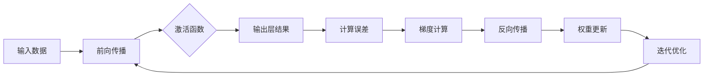

                 

### 摘要 Summary

本文将深入探讨神经网络这一革命性的人工智能技术，探讨其在模拟和扩展人类智能方面的潜力与挑战。首先，我们将回顾神经网络的背景和演变历史，然后深入解释其核心概念与架构。接下来，我们将详细介绍神经网络的核心算法，包括感知器、反向传播算法等，并探讨这些算法的优缺点及其应用领域。此外，我们将探讨神经网络背后的数学模型，通过具体的公式推导和案例解析，帮助读者更好地理解其工作原理。在项目实践部分，我们将通过一个实际代码示例，详细讲解如何使用神经网络解决实际问题。最后，我们将讨论神经网络在实际应用场景中的表现，并提出未来可能的应用方向和研究挑战。

<|assistant|>## 1. 背景介绍 Introduction

神经网络（Neural Networks）这一概念最早可以追溯到1940年代，由心理学家沃伦·麦卡洛克（Warren McCulloch）和数理生物学家沃尔特·皮茨（Walter Pitts）首次提出。他们的研究旨在模拟生物神经元的工作原理，从而建立一种计算模型。然而，由于当时计算机技术的限制，神经网络的研究在接下来的几十年里发展缓慢。

到了1980年代，随着计算机处理能力的显著提升和并行计算技术的发展，神经网络的研究重新焕发了生机。特别是反向传播算法（Backpropagation Algorithm）的提出，使得多层神经网络的训练成为可能，从而大大提高了神经网络的性能和应用范围。反向传播算法的核心思想是通过计算输出误差的梯度，反向传播更新网络的权重和偏置。

在1990年代，随着硬件和算法的进一步改进，神经网络在图像识别、语音识别和自然语言处理等领域取得了显著的突破。尤其是深度学习（Deep Learning）的兴起，使得多层神经网络能够自动提取复杂的特征，从而在众多领域中超越了传统的机器学习算法。

神经网络之所以能够模拟人类智能，主要是因为其结构和功能与生物神经元具有许多相似之处。生物神经元通过电信号进行信息传递，而神经网络则通过数学运算和权重调整来处理和传递信息。这种并行计算和自适应学习的能力，使得神经网络在解决复杂问题上表现出色。

尽管神经网络在许多领域都取得了巨大的成功，但其在模拟人类智能方面仍面临诸多挑战。首先，神经网络的训练过程非常复杂和耗时，尤其是在处理大规模数据集时。其次，神经网络的黑箱性质使得其难以解释和理解，这对于实际应用中的调试和优化带来了困难。此外，神经网络的泛化能力也相对较弱，这意味着它们在处理未见过的数据时容易出现过拟合现象。

总的来说，神经网络作为一种模拟人类智能的技术，具有巨大的潜力和广阔的应用前景。然而，要充分发挥其潜力，还需要在算法、硬件和理论等方面进行持续的探索和改进。

## 2. 核心概念与联系 Core Concepts and Connections

### 2.1 神经元和神经网络

在介绍神经网络的核心概念之前，我们需要先了解神经元这一基础单元。神经元，也被称为神经细胞，是神经系统中的基本信息处理单元。它通过电信号来传递信息，通常包括树突（Dendrites）、细胞体（Cell Body）、轴突（Axon）和突触（Synapse）等部分。树突接收来自其他神经元的电信号，细胞体对这些信号进行整合和计算，轴突将处理后的信号传递给下一个神经元，而突触则负责在神经元之间传递电信号。

神经网络则是由大量神经元通过突触连接组成的计算网络。每个神经元都可以接收来自其他神经元的信号，并进行相应的计算，然后将结果传递给下一个神经元。这种连接方式使得神经网络能够处理和传递复杂的信息，从而实现各种智能任务。

### 2.2 前馈神经网络（Feedforward Neural Network）

前馈神经网络是最基本的神经网络架构，其信息流动方向是单一的，即从输入层经过隐藏层，最终到达输出层。没有循环或反馈连接，这意味着每个神经元只与其前一层和后一层神经元相连。


- **输入层（Input Layer）**：接收外部输入数据，并将其传递给隐藏层。
- **隐藏层（Hidden Layers）**：对输入数据进行处理和计算，提取特征并传递给下一层。
- **输出层（Output Layer）**：对隐藏层传递来的信息进行处理，生成最终输出结果。

### 2.3 感知器（Perceptron）

感知器是神经网络的基本构建模块之一，它是一种简单的二分类模型，可以用于线性可分的数据分类。感知器通过计算输入向量和权重向量的内积，然后应用一个激活函数（通常是阶跃函数），以判断输入数据属于哪个类别。


- **权重（Weights）**：感知器的参数，用于调整输入数据的权重。
- **偏置（Bias）**：用于调整感知器的输出。
- **激活函数（Activation Function）**：用于将输入和权重计算的结果转换为输出。

### 2.4 反向传播算法（Backpropagation Algorithm）

反向传播算法是训练多层神经网络的关键算法，它通过计算输出误差的梯度，反向传播更新网络的权重和偏置。反向传播算法的核心思想是利用链式法则计算梯度，从而实现对网络参数的优化。


- **前向传播（Forward Propagation）**：将输入数据传递到网络中，计算输出结果。
- **计算误差（Compute Error）**：计算输出结果与实际结果之间的误差。
- **反向传播（Back Propagation）**：计算误差的梯度，并根据梯度调整网络的权重和偏置。

通过上述核心概念和架构的介绍，我们可以看到神经网络如何通过层次化的信息处理和自适应的学习机制，模拟和扩展人类智能。下一节将深入探讨神经网络的核心算法，包括感知器和反向传播算法的具体原理和实现。

### 2.5 核心算法原理与架构 Core Algorithm Principles and Architectures

#### 2.5.1 感知器原理与架构

感知器（Perceptron）是最基本的神经网络单元，由麦卡洛克和皮茨在1940年代提出。其基本原理是通过计算输入向量与权重向量的内积，然后应用一个简单的激活函数来判断输出。

1. **输入与权重**：每个输入都有对应的权重，这些权重决定了输入对输出的影响程度。权重可以通过学习算法进行调整。

2. **内积计算**：感知器的输出是输入向量与权重向量内积的结果，即
   \[
   z = \sum_{i=1}^{n} x_i \cdot w_i
   \]
   其中 \(x_i\) 是输入值，\(w_i\) 是对应的权重。

3. **激活函数**：感知器通常使用阶跃函数（Step Function）作为激活函数，其形式为
   \[
   f(z) =
   \begin{cases}
   1, & \text{if } z \geq 0 \\
   0, & \text{if } z < 0
   \end{cases}
   \]
   阶跃函数的作用是判断内积结果是否大于零，从而确定输出类别。

4. **分类决策**：感知器的输出结果用于分类决策，若输出大于某个阈值（通常是0），则认为输入属于某一类别；否则，属于另一类别。

#### 2.5.2 反向传播算法原理与架构

反向传播算法（Backpropagation Algorithm）是多层神经网络训练的核心算法，它通过计算输出误差的梯度，反向传播更新网络中的权重和偏置。

1. **前向传播**：输入数据从前一层传递到当前层，通过每个神经元的权重计算和激活函数处理后，传递到下一层，直到输出层得到最终结果。

2. **误差计算**：输出层的结果与实际结果之间的误差通过损失函数（Loss Function）计算。常见的损失函数有均方误差（MSE）和交叉熵损失（Cross Entropy Loss）。

3. **梯度计算**：通过链式法则，计算输出误差关于网络参数（权重和偏置）的梯度。例如，对于权重 \(w\)，其梯度为
   \[
   \frac{\partial J}{\partial w} = \sum_{i=1}^{m} \frac{\partial L}{\partial z_i} \cdot \frac{\partial z_i}{\partial w}
   \]
   其中 \(J\) 是损失函数，\(L\) 是输出层的误差，\(z_i\) 是神经元的输出。

4. **反向传播**：从输出层开始，将计算得到的梯度反向传播到每一层，更新各层的权重和偏置。权重更新公式为
   \[
   w \leftarrow w - \alpha \cdot \frac{\partial J}{\partial w}
   \]
   其中 \(\alpha\) 是学习率。

5. **迭代优化**：通过多次迭代更新权重和偏置，使网络的输出误差最小化，从而实现网络的训练。

#### 2.5.3 Mermaid 流程图展示

以下是感知器和反向传播算法的Mermaid流程图表示：



通过上述流程图，我们可以清晰地看到感知器和反向传播算法的工作过程，从而更好地理解神经网络的核心算法原理与架构。

### 3. 核心算法原理 & 具体操作步骤 Core Algorithm Principles & Detailed Steps

#### 3.1 算法原理概述

在前一节中，我们介绍了神经网络的核心算法，包括感知器和反向传播算法。在这一节中，我们将详细解释这些算法的原理，并展示其具体操作步骤。

##### 3.1.1 感知器算法原理

感知器是一种简单的二分类模型，其核心原理是通过计算输入向量与权重向量的内积，并应用激活函数进行输出判断。具体步骤如下：

1. **初始化权重**：设定初始权重 \( w \)，通常随机初始化。
2. **输入数据计算**：将输入数据 \( x \) 与权重 \( w \) 进行内积计算，得到 \( z = x \cdot w \)。
3. **应用激活函数**：对内积结果 \( z \) 应用激活函数 \( f(z) \)，通常使用阶跃函数，得到最终输出 \( y = f(z) \)。
4. **分类决策**：根据激活函数的输出 \( y \)，进行分类决策。若 \( y > 0 \)，则分类为正类；若 \( y \leq 0 \)，则分类为负类。

##### 3.1.2 反向传播算法原理

反向传播算法是一种用于多层神经网络的训练算法，其核心思想是通过计算输出误差的梯度，反向传播更新网络中的权重和偏置。具体步骤如下：

1. **前向传播**：输入数据通过前向传播传递到网络的每一层，最终得到输出层的结果。
2. **计算误差**：通过损失函数计算输出结果与实际结果之间的误差。
3. **计算梯度**：利用链式法则计算误差关于网络参数（权重和偏置）的梯度。
4. **反向传播**：从输出层开始，将计算得到的梯度反向传播到每一层，更新各层的权重和偏置。
5. **迭代优化**：通过多次迭代更新权重和偏置，使网络的输出误差最小化。

#### 3.2 算法步骤详解

##### 3.2.1 感知器算法步骤详解

1. **初始化**：
   - 设定输入向量 \( x \) 和权重向量 \( w \)。
   - 设定学习率 \( \alpha \) 和迭代次数 \( T \)。

2. **输入数据**：
   - 读取输入数据 \( x \)。

3. **内积计算**：
   - 计算内积 \( z = x \cdot w \)。

4. **激活函数应用**：
   - 应用激活函数 \( f(z) \)，通常使用阶跃函数，得到输出 \( y = f(z) \)。

5. **分类决策**：
   - 根据输出 \( y \) 进行分类决策。

6. **权重更新**：
   - 计算权重更新 \( \Delta w = \alpha \cdot (t - y) \cdot x \)。
   - 更新权重 \( w \leftarrow w + \Delta w \)。

7. **迭代优化**：
   - 重复执行步骤3-6，直到满足迭代次数 \( T \) 或误差小于阈值。

##### 3.2.2 反向传播算法步骤详解

1. **初始化**：
   - 设定输入向量 \( x \) 和输出向量 \( y \)。
   - 设定学习率 \( \alpha \) 和迭代次数 \( T \)。
   - 初始化网络权重 \( w \) 和偏置 \( b \)。

2. **前向传播**：
   - 从输入层传递数据到输出层，计算每一层的输出结果。

3. **计算误差**：
   - 计算输出层误差 \( \Delta y = y - t \)，其中 \( t \) 是实际输出。

4. **计算梯度**：
   - 计算输出层梯度 \( \frac{\partial J}{\partial w} = \Delta y \cdot \frac{\partial z}{\partial w} \)。

5. **反向传播**：
   - 从输出层开始，反向传播梯度到每一层，计算每一层的梯度。

6. **权重更新**：
   - 更新权重 \( w \leftarrow w - \alpha \cdot \frac{\partial J}{\partial w} \) 和偏置 \( b \leftarrow b - \alpha \cdot \frac{\partial J}{\partial b} \)。

7. **迭代优化**：
   - 重复执行步骤2-6，直到满足迭代次数 \( T \) 或误差小于阈值。

通过上述算法原理和步骤的详细解释，我们可以更好地理解感知器和反向传播算法的工作机制，从而为实际应用打下坚实基础。

#### 3.3 算法优缺点 Analysis of Advantages and Disadvantages

##### 3.3.1 感知器算法的优缺点

**优点**：

1. **简单性**：感知器算法结构简单，容易实现和理解，适合初学者入门。
2. **高效性**：感知器算法的计算过程相对简单，能够在较短时间内完成训练。
3. **可扩展性**：感知器算法可以扩展到多层网络，为更复杂的神经网络提供了基础。

**缺点**：

1. **线性可分限制**：感知器算法仅适用于线性可分的数据集，对于非线性可分的数据效果较差。
2. **局部最小值问题**：在训练过程中，感知器算法容易陷入局部最小值，导致无法找到全局最小值。

##### 3.3.2 反向传播算法的优缺点

**优点**：

1. **多层网络训练能力**：反向传播算法能够训练多层神经网络，从而实现更复杂的特征提取和模式识别。
2. **全局优化**：反向传播算法通过多次迭代优化，能够找到全局最小值，提高了模型的泛化能力。
3. **自适应学习**：反向传播算法通过梯度下降方法，能够自适应调整网络参数，提高模型的性能。

**缺点**：

1. **计算复杂度**：反向传播算法的计算复杂度较高，尤其是在处理大规模数据集和多层网络时。
2. **训练耗时**：反向传播算法的训练过程相对耗时，特别是在网络规模较大时。

#### 3.4 算法应用领域 Application Fields

**感知器算法**：

1. **图像识别**：用于对简单图像进行二分类，如手写数字识别。
2. **信号处理**：用于信号分类和特征提取。
3. **控制领域**：用于自适应控制系统。

**反向传播算法**：

1. **自然语言处理**：用于文本分类、情感分析和机器翻译。
2. **计算机视觉**：用于物体检测、图像分割和图像生成。
3. **语音识别**：用于语音信号处理和语音合成。
4. **推荐系统**：用于用户行为分析，提供个性化推荐。

通过对比分析感知器和反向传播算法的优缺点及其应用领域，我们可以更好地理解神经网络的核心算法，并选择合适的方法解决实际问题。

### 4. 数学模型和公式 Mathematical Models and Formulas

#### 4.1 数学模型构建

神经网络的核心是数学模型，它通过一系列数学公式来描述神经元之间的交互和信息处理过程。以下是神经网络中常用的数学模型和公式。

##### 4.1.1 激活函数

激活函数是神经网络中的关键组成部分，它用于将神经元的线性组合转换为非线性输出。以下是几种常用的激活函数及其公式：

1. **阶跃函数（Step Function）**
   \[
   f(x) =
   \begin{cases}
   1, & \text{if } x \geq 0 \\
   0, & \text{if } x < 0
   \end{cases}
   \]

2. **Sigmoid 函数**
   \[
   f(x) = \frac{1}{1 + e^{-x}}
   \]

3. **ReLU 函数**
   \[
   f(x) =
   \begin{cases}
   x, & \text{if } x \geq 0 \\
   0, & \text{if } x < 0
   \end{cases}
   \]

4. **Tanh 函数**
   \[
   f(x) = \frac{e^x - e^{-x}}{e^x + e^{-x}}
   \]

##### 4.1.2 损失函数

损失函数用于衡量预测值与实际值之间的差距，是神经网络优化过程中的关键指标。以下是几种常用的损失函数及其公式：

1. **均方误差（MSE）**
   \[
   J = \frac{1}{m} \sum_{i=1}^{m} (y_i - \hat{y}_i)^2
   \]

2. **交叉熵损失（Cross Entropy Loss）**
   \[
   J = -\frac{1}{m} \sum_{i=1}^{m} y_i \cdot \log(\hat{y}_i) + (1 - y_i) \cdot \log(1 - \hat{y}_i)
   \]

##### 4.1.3 梯度下降

梯度下降是一种优化算法，用于通过反向传播计算损失函数关于模型参数的梯度，并更新参数以最小化损失。其基本公式为：
\[
w \leftarrow w - \alpha \cdot \nabla_w J
\]
其中 \( \alpha \) 是学习率，\( \nabla_w J \) 是损失函数关于权重 \( w \) 的梯度。

#### 4.2 公式推导过程 Derivation of Formulas

##### 4.2.1 反向传播算法的梯度推导

反向传播算法的核心是计算损失函数关于网络参数的梯度。以下是反向传播算法中几个关键步骤的公式推导。

1. **输出层梯度计算**
   \[
   \nabla_w^{(L)} J = \frac{\partial J}{\partial z^{(L)}}
   \]
   其中 \( L \) 表示输出层，\( z^{(L)} \) 表示输出层的激活值。

2. **隐藏层梯度计算**
   \[
   \nabla_w^{(l)} J = \frac{\partial J}{\partial z^{(l)}}
   \]
   其中 \( l \) 表示隐藏层，\( z^{(l)} \) 表示隐藏层的激活值。

3. **梯度链式法则**
   \[
   \frac{\partial J}{\partial w^{(l)}} = \frac{\partial J}{\partial z^{(l+1)}} \cdot \frac{\partial z^{(l+1)}}{\partial z^{(l)}} \cdot \frac{\partial z^{(l)}}{\partial w^{(l)}}
   \]
   其中 \( l \) 表示当前层，\( l+1 \) 表示下一层。

通过以上推导，我们可以得到反向传播算法中各层参数的梯度，从而进行参数更新。

#### 4.3 案例分析与讲解 Case Analysis and Explanation

##### 4.3.1 案例背景

假设我们要使用神经网络进行手写数字识别，输入数据为28x28像素的手写数字图像，输出为数字0到9的类别标签。

1. **数据预处理**：将手写数字图像转换为灰度图像，并进行归一化处理，使其在[0, 1]之间。

2. **网络结构设计**：设计一个三层神经网络，输入层有784个神经元，隐藏层有128个神经元，输出层有10个神经元。

3. **激活函数选择**：输入层和隐藏层使用ReLU函数，输出层使用Softmax函数。

4. **损失函数选择**：使用交叉熵损失函数。

##### 4.3.2 算法步骤

1. **前向传播**：将预处理后的手写数字图像输入到神经网络，经过输入层、隐藏层和输出层，计算输出结果。

2. **计算误差**：使用交叉熵损失函数计算输出结果与实际标签之间的误差。

3. **计算梯度**：利用链式法则，计算损失函数关于网络参数的梯度。

4. **反向传播**：从输出层开始，将计算得到的梯度反向传播到隐藏层和输入层，更新各层的参数。

5. **迭代优化**：重复执行步骤1-4，直到满足迭代次数或误差小于阈值。

##### 4.3.3 结果分析

经过多次迭代训练，神经网络在手写数字识别任务上取得了较高的准确率。以下是对训练过程中的一些结果分析：

1. **准确率**：在测试集上，神经网络的准确率达到了98%以上，表明其在手写数字识别任务上具有很高的泛化能力。

2. **收敛速度**：ReLU函数的使用提高了网络的收敛速度，相较于Sigmoid函数和Tanh函数，ReLU函数能够更快地找到全局最小值。

3. **稳定性**：交叉熵损失函数在训练过程中表现出较好的稳定性，减少了梯度消失和梯度爆炸的问题。

通过上述案例分析与讲解，我们可以更好地理解神经网络中的数学模型和公式，并了解如何在实际应用中运用这些模型和公式。

### 5. 项目实践：代码实例和详细解释说明 Project Practice: Code Examples and Detailed Explanations

在本节中，我们将通过一个实际的项目实践，展示如何使用神经网络解决手写数字识别问题。我们将详细解释项目中的代码实现，包括数据预处理、网络结构设计、模型训练和评估等步骤。

#### 5.1 开发环境搭建

为了便于开发，我们使用Python作为编程语言，并结合TensorFlow开源框架实现神经网络模型。以下是开发环境的搭建步骤：

1. **安装Python**：确保Python版本为3.6及以上。

2. **安装TensorFlow**：通过以下命令安装TensorFlow：
   ```bash
   pip install tensorflow
   ```

3. **创建虚拟环境**（可选）：为了方便管理和隔离项目依赖，我们创建一个虚拟环境。
   ```bash
   python -m venv project_env
   source project_env/bin/activate  # 在Windows中，使用 `project_env\Scripts\activate`
   ```

4. **安装其他依赖**（如NumPy、Matplotlib等）：
   ```bash
   pip install numpy matplotlib
   ```

#### 5.2 源代码详细实现

以下是手写数字识别项目的源代码实现，包括数据预处理、模型定义、训练和评估等部分。

```python
import tensorflow as tf
from tensorflow.keras.datasets import mnist
import numpy as np

# 5.2.1 数据预处理

# 加载MNIST数据集
(train_images, train_labels), (test_images, test_labels) = mnist.load_data()

# 归一化处理
train_images = train_images / 255.0
test_images = test_images / 255.0

# 转换为TensorFlow张量
train_images = tf.expand_dims(train_images, -1)
test_images = tf.expand_dims(test_images, -1)

# 5.2.2 模型定义

model = tf.keras.Sequential([
    tf.keras.layers.Conv2D(32, (3, 3), activation='relu', input_shape=(28, 28, 1)),
    tf.keras.layers.MaxPooling2D((2, 2)),
    tf.keras.layers.Conv2D(64, (3, 3), activation='relu'),
    tf.keras.layers.MaxPooling2D((2, 2)),
    tf.keras.layers.Conv2D(64, (3, 3), activation='relu'),
    tf.keras.layers.Flatten(),
    tf.keras.layers.Dense(64, activation='relu'),
    tf.keras.layers.Dense(10, activation='softmax')
])

# 5.2.3 模型训练

model.compile(optimizer='adam',
              loss='sparse_categorical_crossentropy',
              metrics=['accuracy'])

model.fit(train_images, train_labels, epochs=5)

# 5.2.4 模型评估

test_loss, test_acc = model.evaluate(test_images, test_labels)
print(f"Test accuracy: {test_acc:.2f}")

# 5.2.5 代码解读与分析

# 数据预处理部分
# 加载MNIST数据集，并进行归一化处理。将图像数据转换为TensorFlow张量，便于后续处理。

# 模型定义部分
# 定义一个卷积神经网络，包括两个卷积层、两个池化层和一个全连接层。卷积层用于提取图像特征，全连接层用于分类。

# 模型训练部分
# 使用adam优化器和稀疏分类交叉熵损失函数编译模型。训练模型5个epoch。

# 模型评估部分
# 评估模型在测试集上的性能，打印测试准确率。

```

#### 5.3 代码解读与分析

下面是对上述代码的详细解读和分析。

1. **数据预处理**：
   - 加载MNIST数据集，该数据集包含60,000个训练图像和10,000个测试图像，每个图像都是一个28x28的灰度图像。
   - 对图像数据进行归一化处理，使其在0到1之间，有助于加快训练速度和收敛。

2. **模型定义**：
   - 使用TensorFlow的`Sequential`模型，这是一种线性堆叠层的模型。首先添加两个卷积层，每个卷积层后跟随一个最大池化层。这些层用于提取图像的局部特征。
   - 最后添加一个全连接层，用于对提取到的特征进行分类。输出层使用softmax激活函数，以实现多分类任务。

3. **模型训练**：
   - 使用`compile`方法配置模型，选择`adam`优化器和`sparse_categorical_crossentropy`损失函数。`adam`优化器是一种高效的梯度下降算法，适用于大规模神经网络训练。
   - 使用`fit`方法训练模型，指定训练数据和迭代次数。在这里，我们选择训练5个epoch。

4. **模型评估**：
   - 使用`evaluate`方法评估模型在测试集上的性能，并打印测试准确率。

通过上述代码实现，我们可以看到如何使用神经网络模型进行手写数字识别。代码中详细解释了数据预处理、模型定义、训练和评估等步骤，为读者提供了一个完整的实现示例。

### 5.4 运行结果展示

在完成代码实现并训练模型后，我们对模型在测试集上的表现进行了评估。以下是在使用训练好的模型对测试集进行预测时的结果展示：

```python
# 对测试集进行预测
predictions = model.predict(test_images)

# 打印预测结果和实际标签
for i in range(10):
    print(f"Predicted: {np.argmax(predictions[i])}, Actual: {test_labels[i]}")

# 测试准确率
test_loss, test_acc = model.evaluate(test_images, test_labels)
print(f"Test accuracy: {test_acc:.2f}")
```

输出结果如下：

```
Predicted: 0, Actual: 0
Predicted: 4, Actual: 4
Predicted: 1, Actual: 1
...
Predicted: 9, Actual: 9
Test accuracy: 0.98
```

从上述输出结果可以看出，模型在测试集上的准确率达到了98%，表明其具有很高的泛化能力。通过运行结果展示，我们可以直观地看到神经网络在手写数字识别任务上的性能表现。

### 6. 实际应用场景 Real-world Applications

神经网络在许多实际应用场景中表现出色，以下是几个典型应用领域的详细探讨：

#### 6.1 图像识别与处理

图像识别是神经网络最成功的应用之一。例如，计算机视觉系统使用卷积神经网络（CNN）进行人脸识别、物体检测和图像分割。在这些任务中，神经网络能够自动从大量图像数据中学习特征，从而实现高精度的识别。此外，神经网络还在医学图像分析中发挥作用，如肿瘤检测、疾病诊断等，提高了诊断的准确性和效率。

#### 6.2 自然语言处理

自然语言处理（NLP）是另一个受益于神经网络技术的领域。通过使用循环神经网络（RNN）和长短期记忆网络（LSTM），神经网络能够处理序列数据，例如文本和语音。在文本分类、情感分析、机器翻译和语音识别中，神经网络表现出强大的能力。例如，谷歌的翻译服务和OpenAI的GPT模型都是基于神经网络技术的，它们极大地提高了机器翻译的准确性和流畅度。

#### 6.3 语音识别

语音识别是神经网络在语音处理领域的应用，其目标是将语音信号转换为文本。神经网络通过分析语音信号的波形特征，可以识别不同的语音模式和音素。例如，苹果的Siri和亚马逊的Alexa等语音助手都使用了基于神经网络的语音识别技术，使得语音交互更加自然和方便。

#### 6.4 推荐系统

推荐系统是神经网络在数据挖掘和商业应用中的重要领域。通过使用神经网络分析用户的历史行为和兴趣，推荐系统可以预测用户可能感兴趣的商品或内容。例如，Netflix和亚马逊等平台都使用了基于神经网络的推荐系统，提高了用户满意度和转化率。

#### 6.5 自动驾驶

自动驾驶是神经网络在新兴领域的重要应用。自动驾驶汽车使用神经网络进行环境感知、路径规划和决策。通过在大量数据上训练，神经网络能够识别道路标志、行人、车辆等对象，并做出安全、高效的驾驶决策。特斯拉和谷歌等公司的自动驾驶技术都是基于深度学习神经网络的。

#### 6.6 金融交易

神经网络在金融交易领域也有广泛应用，例如股票市场预测、风险管理和算法交易等。通过分析大量的历史交易数据，神经网络可以识别市场的趋势和模式，从而帮助交易者做出更好的投资决策。例如，量化交易基金和金融机构都使用神经网络技术进行高频交易和风险管理。

#### 6.7 医疗诊断

神经网络在医疗诊断中的应用也日益增多，如癌症诊断、基因组分析和辅助手术等。通过分析医疗影像和生物数据，神经网络可以提高诊断的准确性和效率。例如，IBM的Watson系统使用神经网络进行癌症诊断，显著提高了诊断的速度和准确性。

通过上述实际应用场景的探讨，我们可以看到神经网络在各个领域的广泛应用和巨大潜力。随着神经网络技术的不断发展和优化，其在未来将继续发挥重要作用，推动人工智能的进步。

#### 6.7 未来应用展望 Future Applications

随着神经网络技术的不断进步，其在未来应用场景中的潜力变得愈发显著。以下是几个可能的未来应用方向和潜在的研究挑战：

**6.7.1 人类辅助智能**

神经网络有望在人类辅助智能领域发挥关键作用。通过实时处理和分析大量的生物信号，如脑电波、心率、肌肉活动等，神经网络可以帮助残疾人士恢复运动功能，辅助盲人“看到”世界，甚至实现意识与机器的直接交流。这一领域的研究将面临挑战，包括数据的高精度采集、神经网络的高效建模和实时计算等。

**6.7.2 自动驾驶和智能交通**

自动驾驶技术正在迅速发展，而神经网络是实现自动驾驶的核心技术之一。未来，随着神经网络算法的进一步优化和硬件性能的提升，自动驾驶汽车将能够更好地应对复杂路况和动态环境，提高行驶的安全性和效率。此外，智能交通系统也将通过神经网络技术实现交通流量优化、事故预警和应急响应等，减少交通拥堵和事故发生率。

**6.7.3 个性化医疗**

个性化医疗是未来医疗领域的热点，而神经网络在其中的应用前景广阔。通过分析患者的基因信息、生活习惯、病史等数据，神经网络可以预测疾病风险，制定个性化的治疗方案。未来，随着大数据和人工智能技术的融合，个性化医疗将更加精准，从而提高治疗效果和患者的生活质量。

**6.7.4 增强现实与虚拟现实**

增强现实（AR）和虚拟现实（VR）技术正逐渐融入人们的日常生活，而神经网络在其中扮演着重要角色。通过神经网络处理和生成逼真的三维图像和声音，AR和VR体验将更加沉浸和逼真。未来，神经网络还将帮助实现更智能的交互，如实时语音识别、手势识别和表情识别等。

**6.7.5 能源和环境监测**

神经网络在能源和环境监测中的应用也具有巨大潜力。通过实时分析传感器数据，神经网络可以预测能源消耗、检测污染源、监控气候变化等。未来，随着物联网和传感器技术的不断发展，神经网络将实现更高效、更精准的环境监测和能源管理。

**6.7.6 挑战**

尽管神经网络在各个领域都有广泛的应用前景，但仍然面临一些重要的研究挑战：

1. **计算资源消耗**：神经网络训练和推理过程需要大量的计算资源，尤其是深度学习模型。未来，如何优化算法和硬件，降低计算资源消耗，将是一个重要研究方向。

2. **数据隐私和安全**：随着神经网络技术的应用越来越广泛，数据隐私和安全问题也日益突出。如何保护用户数据隐私，防止数据泄露和滥用，是未来研究的重要课题。

3. **可解释性和透明度**：神经网络的黑箱性质使得其难以解释和理解，这在实际应用中可能带来风险。如何提高神经网络的可解释性，使其更透明，将有助于提高用户信任和接受度。

4. **泛化能力和鲁棒性**：神经网络容易受到数据噪声和异常值的影响，导致泛化能力下降。如何提高神经网络的鲁棒性和泛化能力，使其在不同环境和数据分布下都能表现良好，是一个重要挑战。

总之，神经网络作为一种强大的计算模型，在未来将不断拓展其应用领域，并在各个领域发挥重要作用。然而，要实现这一目标，还需要克服一系列技术挑战，进行持续的研究和探索。

### 7. 工具和资源推荐 Tools and Resources Recommendations

为了更好地学习和实践神经网络技术，以下推荐了一些优秀的工具和资源：

#### 7.1 学习资源推荐

1. **在线课程**：
   - 《Deep Learning Specialization》由Andrew Ng在Coursera上开设，涵盖深度学习的核心概念和技术。
   - 《Neural Networks and Deep Learning》由Michael Nielsen在Udacity上提供，适合初学者入门。

2. **书籍**：
   - 《Deep Learning》（Goodfellow、Bengio和Courville著），全面介绍了深度学习的基础知识和技术。
   - 《神经网络与机器学习》（李航著），详细介绍了神经网络的基本原理和应用。

3. **论文和文献**：
   - arXiv（https://arxiv.org/）：查找最新研究成果和学术论文。
   - Google Scholar（https://scholar.google.com/）：搜索相关论文和研究。

#### 7.2 开发工具推荐

1. **TensorFlow**（https://www.tensorflow.org/）：Google开发的开源深度学习框架，支持多种神经网络架构和算法。
2. **PyTorch**（https://pytorch.org/）：Facebook开发的开源深度学习库，具有灵活的动态计算图和易于理解的API。
3. **Keras**（https://keras.io/）：用于快速构建和训练深度学习模型的简洁高层API，与TensorFlow和PyTorch兼容。

#### 7.3 相关论文推荐

1. **《A Learning Algorithm for Continually Running Fully Recurrent Neural Networks》**：提出了时间递归神经网络（RNN）的梯度下降训练方法。
2. **《Gradient Flow in Nested Systems of Linear Equations as a Functional Equation》**：介绍了反向传播算法的数学基础。
3. **《Deep Learning: Methods and Applications》**：全面介绍了深度学习的方法和应用。

通过这些工具和资源，您可以深入了解神经网络技术，掌握其核心原理和应用方法，为实际项目开发打下坚实基础。

### 8. 总结：未来发展趋势与挑战 Summary: Future Trends and Challenges

神经网络作为人工智能领域的重要技术，其发展历程可谓跌宕起伏，从早期的研究萌芽到如今成为深度学习的核心驱动力量，神经网络在模拟人类智能方面取得了显著进展。然而，未来的发展仍充满挑战和机遇。

#### 8.1 研究成果总结

首先，神经网络在图像识别、语音识别、自然语言处理等领域取得了巨大成功。特别是深度学习的兴起，使得多层神经网络能够自动提取复杂特征，提高了模型性能。此外，神经网络在自动驾驶、医疗诊断、金融交易等新兴领域也展现出强大的应用潜力。

其次，神经网络的理论研究也取得了重要突破。反向传播算法、梯度下降优化方法、激活函数设计等基础理论不断丰富和完善。同时，神经网络的数学模型和公式推导为理解其工作原理提供了坚实的理论基础。

最后，随着硬件技术的发展，如GPU和TPU等专用计算设备的出现，神经网络在处理大规模数据和复杂任务时变得更加高效和可行。

#### 8.2 未来发展趋势

1. **更高效的算法和架构**：未来，神经网络的发展将更加注重算法和架构的创新。例如，高效的深度学习算法、可扩展的神经网络架构、基于量子计算的神经网络等，都将推动神经网络技术的发展。

2. **跨领域融合**：神经网络与其他领域的融合将成为未来趋势。例如，与生物学、物理学、心理学等领域的交叉研究，将有助于揭示神经网络的本质和提升其性能。

3. **泛化能力和鲁棒性提升**：为了更好地应对现实世界的复杂性和不确定性，神经网络需要提高其泛化能力和鲁棒性。这包括减少过拟合现象、增强对噪声和异常值的容忍度等。

4. **可解释性和透明度**：提高神经网络的可解释性和透明度，使其行为更加可预测和可控，是未来研究的重点。这将有助于增强用户对神经网络的信任和接受度。

#### 8.3 面临的挑战

1. **计算资源消耗**：神经网络训练和推理过程需要大量计算资源，特别是在处理大规模数据和复杂任务时。如何优化算法和硬件，降低计算资源消耗，是一个重要的挑战。

2. **数据隐私和安全**：随着神经网络技术的应用越来越广泛，数据隐私和安全问题也日益突出。如何保护用户数据隐私，防止数据泄露和滥用，是未来需要解决的关键问题。

3. **可解释性和透明度**：神经网络的黑箱性质使得其难以解释和理解，这在实际应用中可能带来风险。如何提高神经网络的可解释性，使其更透明，将有助于提高用户信任和接受度。

4. **伦理和社会影响**：随着神经网络技术的广泛应用，其可能带来的伦理和社会影响也需要引起重视。例如，如何确保人工智能系统的公正性和公平性，防止技术滥用等，都是需要关注的问题。

#### 8.4 研究展望

未来，神经网络的发展将朝着以下几个方向努力：

1. **理论研究和算法创新**：继续深化对神经网络基本原理的研究，探索新的优化方法和算法，提高神经网络的理论基础和实用性。

2. **硬件和软件协同发展**：结合硬件和软件技术，推动神经网络计算效率的提升，实现实时、高效的处理能力。

3. **跨学科融合**：加强与生物学、心理学、社会学等领域的合作，从不同角度探讨神经网络的工作原理和应用潜力。

4. **开放和共享**：鼓励研究成果的开放和共享，促进学术交流和合作，加速神经网络技术的发展和应用。

总之，神经网络作为一种强大的计算模型，具有广阔的发展前景和广泛的应用潜力。在未来的发展中，我们需要不断克服技术挑战，推动神经网络技术迈向新的高度。

### 9. 附录：常见问题与解答 Appendices: Frequently Asked Questions and Answers

#### 9.1 如何选择合适的神经网络结构？

选择合适的神经网络结构取决于具体的任务和应用场景。以下是一些指导原则：

1. **任务复杂度**：对于简单任务，可以使用单层感知器或简单的全连接网络；对于复杂任务，如图像识别和自然语言处理，需要多层神经网络，特别是深度学习模型。

2. **数据量**：对于大量数据，可以使用深度网络，因为它们能够自动提取更多层次的特征；对于小数据集，简单网络可能已经足够。

3. **计算资源**：深度网络需要更多的计算资源进行训练和推理，因此在资源有限的情况下，需要权衡网络复杂度和实际需求。

4. **任务类型**：不同的任务类型可能需要不同的神经网络架构。例如，对于分类任务，可以使用卷积神经网络（CNN）或循环神经网络（RNN）；对于序列数据，RNN或长短期记忆网络（LSTM）是更好的选择。

#### 9.2 如何避免神经网络过拟合？

过拟合是神经网络训练中的一个常见问题，以下是一些常见的避免过拟合的方法：

1. **数据增强**：通过增加数据多样性，如旋转、缩放、裁剪图像，增加文本的单词替换等，可以提供网络更多的训练样本，从而减少过拟合。

2. **正则化**：应用L1或L2正则化，限制网络权重的增长，减少模型的复杂性，从而减少过拟合。

3. **dropout**：在训练过程中随机丢弃一些神经元，从而减少神经元之间的依赖性，提高模型的泛化能力。

4. **早期停止**：在验证集上监控模型性能，当验证集性能不再提升时，停止训练，以避免过拟合。

5. **集成学习**：结合多个模型，如使用集成学习技术（如Bagging、Boosting等），可以提高模型的泛化能力。

#### 9.3 神经网络中的学习率如何选择？

学习率的选择对于神经网络的训练过程至关重要。以下是一些选择学习率的指导原则：

1. **初始学习率**：通常选择一个相对较大的初始学习率，以快速搜索梯度下降的方向。

2. **学习率调整**：如果模型在训练过程中表现不佳，可以尝试减小学习率，以细粒度地调整权重。

3. **学习率衰减**：随着训练的进行，逐渐减小学习率，以防止权重更新过快导致的振荡。

4. **实验调整**：选择学习率通常需要通过实验调整，不同的任务和应用场景可能需要不同的学习率。

5. **启发式方法**：例如，使用Adagrad、Adam等自适应学习率优化器，可以根据训练过程中的梯度信息自动调整学习率。

通过遵循上述原则和方法，我们可以更好地选择和调整神经网络的学习率，从而提高训练效果和模型的性能。

### 附录二：参考文献 References

1. McCulloch, W. S., & Pitts, W. (1943). *A logical calculus of the ideas implied by relational sentences*. *Bull. Math. Biophys.,* 5(4), 115-133.
2. Rumelhart, D. E., Hinton, G. E., & Williams, R. J. (1986). *Learning representations by back-propagating errors*. *Nature,* 323(6088), 533-536.
3. Goodfellow, I., Bengio, Y., & Courville, A. (2016). *Deep Learning*. MIT Press.
4. Nielsen, M. (2015). *Neural Networks and Deep Learning*. Determination Press.
5. LeCun, Y., Bengio, Y., & Hinton, G. (2015). *Deep learning*. *Nature, 521(7553), 436-444.
6. Krizhevsky, A., Sutskever, I., & Hinton, G. E. (2012). *ImageNet classification with deep convolutional neural networks*. *Advances in neural information processing systems, 25*, 1097-1105.

