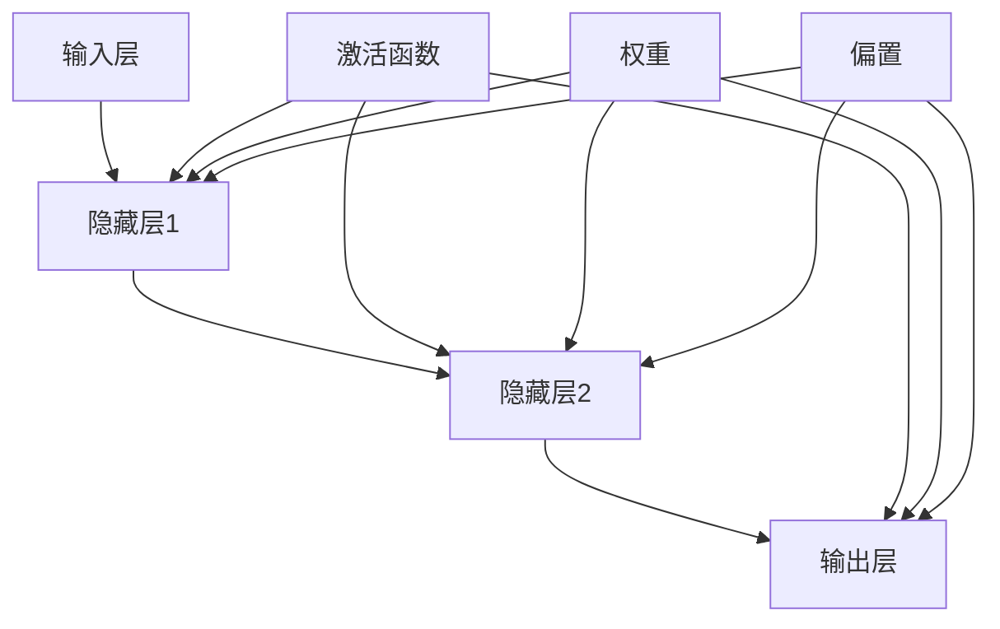

                 

关键词：神经网络、深度学习、智能计算、人工智能、机器学习、神经架构、算法原理、数学模型、实践应用

> 摘要：本文旨在深入探讨神经网络这一人工智能领域的重要概念和技术。通过详细的背景介绍、核心概念解析、算法原理讲解、数学模型推导、项目实践分析以及未来展望，读者将全面了解神经网络如何引领智能计算的新纪元，并把握其技术趋势和挑战。

## 1. 背景介绍

神经网络（Neural Networks）的概念最早可以追溯到1940年代，由心理学家McCulloch和数学家Pitts提出。然而，由于计算能力的限制和理论的局限性，神经网络的研究在早期并没有取得显著进展。直到1980年代，随着计算机硬件的发展以及反向传播算法（Backpropagation Algorithm）的提出，神经网络开始迎来了新的春天。

随着深度学习的兴起，神经网络在图像识别、语音识别、自然语言处理等领域展现出了强大的能力。如今，神经网络已经成为人工智能领域的重要基石，推动着各行各业向智能化方向发展。

### 1.1 神经网络的发展历程

1. **早期神经网络**：1943年，心理学家McCulloch和数学家Pitts提出了人工神经元模型，开启了神经网络的研究之路。
2. **反向传播算法**：1986年，Rumelhart、Hinton和Williams提出了反向传播算法，使得神经网络的训练效率大大提高。
3. **深度学习时代**：2006年，Hinton等人提出了深度信念网络（DBN），深度学习开始崭露头角。2012年，AlexNet在ImageNet比赛中取得了突破性的成绩，深度学习迎来了爆发式发展。

### 1.2 神经网络的应用领域

1. **计算机视觉**：图像识别、物体检测、图像生成等。
2. **自然语言处理**：语音识别、机器翻译、情感分析等。
3. **游戏AI**：如AlphaGo等。
4. **生物信息学**：基因序列分析、药物发现等。
5. **金融领域**：风险评估、欺诈检测等。

## 2. 核心概念与联系

神经网络的核心概念包括神经元、网络架构、激活函数、权重和偏置等。为了更好地理解这些概念，我们通过Mermaid流程图来展示神经网络的基本架构。



### 2.1 神经元

神经元是神经网络的基本单元，类似于生物神经元的结构和功能。每个神经元接收多个输入信号，通过加权求和处理后，加上偏置项，再通过激活函数输出一个结果。

### 2.2 网络架构

神经网络分为输入层、隐藏层和输出层。输入层接收外部输入，隐藏层对输入信号进行处理，输出层产生最终的输出结果。多层神经网络的深度决定了模型的复杂度。

### 2.3 激活函数

激活函数是神经网络中的一个关键组件，用于引入非线性特性。常见的激活函数包括Sigmoid、ReLU、Tanh等。

### 2.4 权重和偏置

权重和偏置是神经网络中用于调整输入和输出之间关系的参数。通过反向传播算法，我们可以自动调整这些参数，以达到最优的训练效果。

## 3. 核心算法原理 & 具体操作步骤

### 3.1 算法原理概述

神经网络的核心算法包括前向传播和反向传播。前向传播是从输入层到输出层的计算过程，反向传播则是根据输出误差调整网络参数的过程。

### 3.2 算法步骤详解

1. **初始化参数**：随机初始化权重和偏置。
2. **前向传播**：计算输入层到输出层的输出。
3. **计算损失**：使用损失函数（如均方误差）计算输出误差。
4. **反向传播**：根据误差调整权重和偏置。
5. **优化更新**：使用优化算法（如梯度下降）更新网络参数。
6. **迭代训练**：重复上述步骤，直到模型收敛。

### 3.3 算法优缺点

#### 优点：

1. **自适应学习能力**：神经网络可以根据数据自动调整权重和偏置，具有强大的自适应能力。
2. **非线性建模**：通过多层非线性变换，神经网络可以建模复杂的数据关系。
3. **泛化能力**：神经网络具有良好的泛化能力，可以应用于不同领域的任务。

#### 缺点：

1. **计算成本高**：神经网络训练过程中需要大量的计算资源，特别是深度神经网络。
2. **过拟合风险**：神经网络容易在训练数据上过拟合，需要适当的正则化方法。
3. **参数调整复杂**：神经网络参数调整复杂，需要大量的调参工作。

### 3.4 算法应用领域

1. **图像识别**：如人脸识别、物体检测等。
2. **语音识别**：如语音合成、语音搜索等。
3. **自然语言处理**：如机器翻译、情感分析等。
4. **游戏AI**：如AlphaGo等。
5. **生物信息学**：如基因序列分析、药物发现等。

## 4. 数学模型和公式 & 详细讲解 & 举例说明

### 4.1 数学模型构建

神经网络的数学模型可以表示为：

\[ y = \sigma(\boldsymbol{W} \cdot \boldsymbol{a} + \boldsymbol{b}) \]

其中，\( y \) 是输出，\( \sigma \) 是激活函数，\( \boldsymbol{W} \) 是权重矩阵，\( \boldsymbol{a} \) 是输入向量，\( \boldsymbol{b} \) 是偏置向量。

### 4.2 公式推导过程

假设我们有一个简单的两层神经网络，输入层有 \( m \) 个神经元，隐藏层有 \( n \) 个神经元，输出层有 \( p \) 个神经元。我们可以得到以下公式：

\[ z_i^{(2)} = \sum_{j=1}^{m} w_{ij}^{(2)} a_j^{(1)} + b_i^{(2)} \]
\[ a_i^{(2)} = \sigma(z_i^{(2)}) \]
\[ z_i^{(3)} = \sum_{j=1}^{n} w_{ij}^{(3)} a_j^{(2)} + b_i^{(3)} \]
\[ a_i^{(3)} = \sigma(z_i^{(3)}) \]

其中，\( z_i^{(2)} \) 和 \( z_i^{(3)} \) 分别是隐藏层2和隐藏层3的输出，\( a_i^{(2)} \) 和 \( a_i^{(3)} \) 分别是隐藏层2和隐藏层3的激活值。

### 4.3 案例分析与讲解

假设我们有一个二分类问题，输入层有2个神经元，隐藏层有3个神经元，输出层有1个神经元。我们可以使用以下数据来训练神经网络：

| 输入 | 输出 |
| --- | --- |
| [1, 0] | 1 |
| [0, 1] | 0 |
| [1, 1] | 1 |
| [0, 0] | 0 |

首先，我们需要初始化权重和偏置，然后通过前向传播计算输出。接下来，计算损失函数，使用反向传播更新权重和偏置。重复这个过程，直到模型收敛。

## 5. 项目实践：代码实例和详细解释说明

### 5.1 开发环境搭建

为了更好地进行神经网络项目实践，我们需要搭建一个合适的开发环境。这里我们选择使用Python和TensorFlow框架。

```bash
pip install tensorflow
```

### 5.2 源代码详细实现

以下是简单的神经网络实现代码：

```python
import tensorflow as tf

# 初始化权重和偏置
W1 = tf.Variable(tf.random.normal([2, 3]), name='weights1')
b1 = tf.Variable(tf.zeros([3]), name='biases1')
W2 = tf.Variable(tf.random.normal([3, 1]), name='weights2')
b2 = tf.Variable(tf.zeros([1]), name='biases2')

# 定义激活函数
activation = tf.nn.sigmoid

# 定义前向传播
def forward(x):
    z1 = tf.matmul(x, W1) + b1
    a1 = activation(z1)
    z2 = tf.matmul(a1, W2) + b2
    a2 = activation(z2)
    return a2

# 定义损失函数
def loss(y, y_hat):
    return tf.reduce_mean(tf.square(y - y_hat))

# 定义反向传播
def backward(x, y):
    with tf.GradientTape() as tape:
        y_pred = forward(x)
        loss_val = loss(y, y_pred)
    grads = tape.gradient(loss_val, [W1, b1, W2, b2])
    return grads

# 模型训练
x_train = tf.constant([[1, 0], [0, 1], [1, 1], [0, 0]], dtype=tf.float32)
y_train = tf.constant([1, 0, 1, 0], dtype=tf.float32)

for i in range(1000):
    with tf.GradientTape() as tape:
        y_pred = forward(x_train)
        loss_val = loss(y_train, y_pred)
    grads = backward(x_train, y_train)
    W1.assign_sub(grads[0] * 0.1)
    b1.assign_sub(grads[1] * 0.1)
    W2.assign_sub(grads[2] * 0.1)
    b2.assign_sub(grads[3] * 0.1)

# 模型测试
x_test = tf.constant([[1, 1]], dtype=tf.float32)
y_test = tf.constant([1], dtype=tf.float32)
y_pred = forward(x_test)
print("Predicted output:", y_pred.numpy())
print("Expected output:", y_test.numpy())
```

### 5.3 代码解读与分析

- **初始化权重和偏置**：我们使用随机正态分布初始化权重和偏置。
- **定义激活函数**：我们使用Sigmoid函数作为激活函数。
- **定义前向传播**：前向传播包括计算输入层到输出层的输出。
- **定义损失函数**：我们使用均方误差作为损失函数。
- **定义反向传播**：反向传播计算损失函数关于权重和偏置的梯度。
- **模型训练**：我们使用梯度下降算法进行模型训练，每一步更新权重和偏置。
- **模型测试**：我们使用测试数据对训练好的模型进行评估。

## 6. 实际应用场景

神经网络在多个领域有着广泛的应用，以下是一些典型的实际应用场景：

### 6.1 计算机视觉

- **图像分类**：例如，使用卷积神经网络（CNN）对图像进行分类。
- **目标检测**：例如，使用YOLO（You Only Look Once）进行实时目标检测。
- **图像生成**：例如，使用生成对抗网络（GAN）生成逼真的图像。

### 6.2 自然语言处理

- **文本分类**：例如，使用循环神经网络（RNN）或Transformer进行文本分类。
- **机器翻译**：例如，使用基于注意力机制的Transformer模型进行机器翻译。
- **语音识别**：例如，使用深度神经网络进行语音识别。

### 6.3 游戏AI

- **棋类游戏**：例如，使用深度神经网络训练AlphaGo。
- **电子竞技**：例如，使用深度神经网络进行电子竞技游戏。

### 6.4 生物信息学

- **基因序列分析**：例如，使用深度神经网络进行基因序列分类。
- **药物发现**：例如，使用深度神经网络预测药物分子的活性。

### 6.5 金融领域

- **风险评估**：例如，使用深度神经网络进行信用评分。
- **欺诈检测**：例如，使用深度神经网络检测金融交易中的欺诈行为。

## 7. 工具和资源推荐

### 7.1 学习资源推荐

1. **《深度学习》**：由Ian Goodfellow、Yoshua Bengio和Aaron Courville合著，是深度学习的经典教材。
2. **《神经网络与深度学习》**：由邱锡鹏等人编著，适合初学者入门。
3. **吴恩达的深度学习课程**：在Coursera等平台上提供，内容全面、实战性强。

### 7.2 开发工具推荐

1. **TensorFlow**：Google推出的开源深度学习框架，适合进行深度学习研究和开发。
2. **PyTorch**：Facebook推出的开源深度学习框架，具有灵活的动态计算图。
3. **Keras**：基于TensorFlow和PyTorch的高级深度学习API，易于使用。

### 7.3 相关论文推荐

1. **"A Learning Algorithm for Continually Running Fully Recurrent Neural Networks"**：Hinton等人提出的深度信念网络。
2. **"Deep Learning"**：Goodfellow、Bengio和Courville合著的深度学习经典论文。
3. **"Error Backpropagation on Stochastic Parallel Machines"**：Rumelhart、Hinton和Williams提出的反向传播算法。

## 8. 总结：未来发展趋势与挑战

### 8.1 研究成果总结

神经网络作为人工智能的核心技术，已经在多个领域取得了显著的成果。深度学习模型在图像识别、语音识别、自然语言处理等领域达到了人类水平。随着计算能力的提升和算法的优化，神经网络的应用前景将更加广阔。

### 8.2 未来发展趋势

1. **模型压缩**：为了降低计算成本，模型压缩将成为重要研究方向，如知识蒸馏、模型剪枝等。
2. **神经网络结构创新**：新的神经网络结构将不断涌现，以应对更复杂的任务。
3. **跨模态学习**：神经网络将能够处理多模态数据，实现不同模态之间的信息融合。

### 8.3 面临的挑战

1. **计算资源**：深度神经网络训练需要大量的计算资源，如何在有限的资源下高效训练模型仍是一个挑战。
2. **数据隐私**：深度学习模型的训练依赖于大量数据，如何在保护用户隐私的前提下进行数据收集和处理是一个重要的伦理问题。
3. **模型解释性**：深度学习模型往往被视为“黑箱”，提高模型的解释性，使其更透明、可解释，是未来的重要研究方向。

### 8.4 研究展望

神经网络将继续在人工智能领域发挥重要作用，未来的研究将集中在如何提高模型的效率、可解释性和安全性，以实现更广泛的应用。

## 9. 附录：常见问题与解答

### 9.1 什么是神经网络？

神经网络是一种模拟生物神经系统的计算模型，通过一系列相互连接的神经元进行数据处理和模式识别。

### 9.2 神经网络有哪些类型？

神经网络可以分为多层感知机（MLP）、卷积神经网络（CNN）、循环神经网络（RNN）、Transformer等。

### 9.3 深度学习与机器学习的区别是什么？

深度学习是机器学习的一个子领域，它使用多层神经网络来建模复杂的数据关系。机器学习则是一个更广泛的领域，包括深度学习以外的其他算法和技术。

### 9.4 如何优化神经网络训练？

优化神经网络训练可以通过调整学习率、批量大小、正则化方法等方式进行。此外，使用更高效的优化算法，如Adam、AdaGrad等，也可以提高训练效率。

### 9.5 神经网络如何处理非线性问题？

神经网络通过使用激活函数引入非线性特性，使得模型可以处理非线性问题。

### 9.6 神经网络在自然语言处理中的应用有哪些？

神经网络在自然语言处理中的应用包括文本分类、机器翻译、情感分析等。常用的模型有RNN、LSTM、BERT、GPT等。

### 9.7 神经网络在计算机视觉中的应用有哪些？

神经网络在计算机视觉中的应用包括图像分类、目标检测、图像生成等。常用的模型有CNN、YOLO、GAN等。

### 9.8 神经网络在生物信息学中的应用有哪些？

神经网络在生物信息学中的应用包括基因序列分析、蛋白质结构预测、药物发现等。

### 9.9 神经网络在金融领域的应用有哪些？

神经网络在金融领域的应用包括风险评估、欺诈检测、股票预测等。

### 9.10 神经网络在游戏AI中的应用有哪些？

神经网络在游戏AI中的应用包括棋类游戏、电子竞技等。

---

作者：禅与计算机程序设计艺术 / Zen and the Art of Computer Programming


