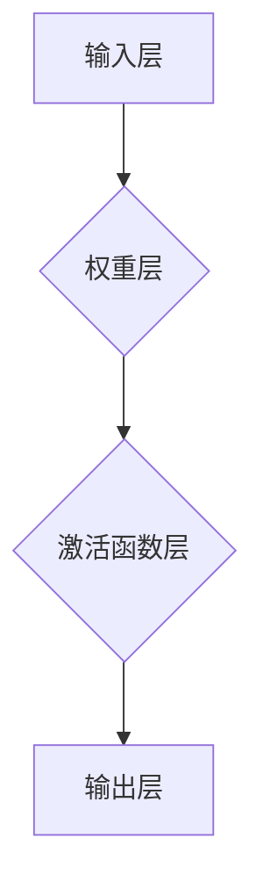

                 

关键词：神经网络、深度学习、机器学习、AI技术、智能系统

摘要：本文旨在探讨神经网络的核心概念、原理及应用，通过详细的数学模型与算法原理分析，辅以实际项目实践和未来展望，全面揭示神经网络在人工智能领域的重要作用及其广阔的应用前景。

## 1. 背景介绍

神经网络（Neural Networks，简称NN）作为人工智能（Artificial Intelligence，简称AI）的重要组成部分，自20世纪80年代以来经历了快速的发展与变革。传统的机器学习方法在处理复杂任务时往往效果不佳，而神经网络以其并行计算、自适应学习和强大表达能力，为解决复杂问题提供了新的途径。

近年来，随着计算能力的提升和大数据的积累，深度学习（Deep Learning，简称DL）成为人工智能研究的热点。深度学习是神经网络的一种特殊形式，通过构建多层神经网络，实现对数据的层次化表示和学习。深度学习在图像识别、语音识别、自然语言处理等领域取得了显著的成果，推动了人工智能的发展。

本文将首先介绍神经网络的基本概念和结构，然后深入探讨其核心算法原理和数学模型，并通过实际项目实践展示神经网络的应用。最后，我们对神经网络的发展趋势和面临的挑战进行展望。

## 2. 核心概念与联系

### 2.1 神经元

神经网络由大量的神经元（Neurons）组成。神经元是神经网络的基本计算单元，其结构与生物神经元相似。一个典型的神经元包括输入层、权重层、激活函数层和输出层。

- **输入层**：接收外部输入信号。
- **权重层**：存储神经元之间的权重，用于调节信号强度。
- **激活函数层**：对输入信号进行非线性变换。
- **输出层**：生成最终的输出信号。

神经元通过激活函数将输入信号转换为输出信号，常见的激活函数包括Sigmoid函数、ReLU函数和Tanh函数。

### 2.2 神经网络结构

神经网络的结构分为多层，包括输入层、隐藏层和输出层。多层神经网络能够实现对复杂数据的建模和分类。

- **输入层**：接收外部输入数据。
- **隐藏层**：对输入数据进行处理和特征提取。
- **输出层**：生成最终的输出结果。

神经网络中的隐藏层数量可以根据问题的复杂度进行调整。通常，隐藏层的层数越多，神经网络的表达能力越强，但训练时间也会相应增加。

### 2.3 神经网络的连接方式

神经网络中的神经元通过连接方式（Connections）相互连接。常见的连接方式包括全连接（Fully Connected）和卷积连接（Convolutional Connections）。

- **全连接**：每个神经元都与上一层和下一层的所有神经元相连，适用于分类和回归问题。
- **卷积连接**：部分神经元与上一层的局部区域相连，适用于图像和视频处理。

### 2.4 Mermaid 流程图

以下是一个简化的神经网络结构Mermaid流程图：



请注意，流程图中的节点不要使用括号、逗号等特殊字符，以便Markdown格式正确渲染。

## 3. 核心算法原理 & 具体操作步骤

### 3.1 算法原理概述

神经网络的训练过程主要包括两个步骤：前向传播（Forward Propagation）和反向传播（Back Propagation）。

- **前向传播**：将输入数据通过神经网络进行传递，计算输出结果。
- **反向传播**：根据输出结果与实际结果的差异，调整网络中的权重和偏置，使输出结果更接近实际结果。

### 3.2 算法步骤详解

#### 3.2.1 前向传播

1. **初始化权重和偏置**：随机初始化网络中的权重和偏置。
2. **输入数据**：将输入数据输入到神经网络中。
3. **逐层计算**：将输入数据依次传递到隐藏层和输出层，计算每个神经元的输出值。
4. **激活函数应用**：对每个神经元的输出值应用激活函数。

#### 3.2.2 反向传播

1. **计算误差**：计算输出层神经元的输出值与实际结果之间的差异，得到误差。
2. **误差反向传播**：将误差从输出层反向传播到隐藏层和输入层，计算每层神经元的误差。
3. **权重和偏置更新**：根据误差和输入值，通过梯度下降（Gradient Descent）等优化算法，调整网络中的权重和偏置。
4. **迭代训练**：重复前向传播和反向传播，直到网络输出结果满足要求或达到预设的训练次数。

### 3.3 算法优缺点

#### 优点：

- **强大的表达能力和泛化能力**：神经网络可以通过多层结构实现对数据的层次化表示和学习，具有强大的表达能力和泛化能力。
- **自适应性和自学习能力**：神经网络可以通过反向传播算法自动调整权重和偏置，实现自适应学习和优化。
- **处理复杂任务**：神经网络可以处理各种复杂任务，如图像识别、语音识别和自然语言处理。

#### 缺点：

- **训练时间较长**：神经网络需要大量数据进行训练，且训练时间较长。
- **对数据质量要求较高**：神经网络对数据质量要求较高，需要保证数据的一致性和准确性。
- **过拟合问题**：神经网络容易过拟合，需要通过正则化等方法进行抑制。

### 3.4 算法应用领域

神经网络在人工智能领域具有广泛的应用，包括：

- **图像识别**：通过卷积神经网络（Convolutional Neural Networks，简称CNN）对图像进行分类和识别。
- **语音识别**：通过深度神经网络（Deep Neural Networks，简称DNN）对语音信号进行识别和转录。
- **自然语言处理**：通过循环神经网络（Recurrent Neural Networks，简称RNN）和长短期记忆网络（Long Short-Term Memory，简称LSTM）对自然语言进行处理和分析。
- **推荐系统**：通过神经网络对用户行为数据进行建模和预测，实现个性化推荐。

## 4. 数学模型和公式 & 详细讲解 & 举例说明

### 4.1 数学模型构建

神经网络中的数学模型主要包括输入层、隐藏层和输出层的计算。

#### 4.1.1 输入层

输入层的计算相对简单，只需将输入数据传递到下一层。

$$
z^{(1)}_j = \sum_{i=1}^{n} x_i w_{ij} + b_j
$$

其中，$z^{(1)}_j$表示输入层第$j$个神经元的输出值，$x_i$表示第$i$个输入特征，$w_{ij}$表示输入层第$i$个神经元与隐藏层第$j$个神经元的权重，$b_j$表示隐藏层第$j$个神经元的偏置。

#### 4.1.2 隐藏层

隐藏层的计算包括前向传播和反向传播两个过程。

**前向传播：**

$$
a^{(2)}_j = \sigma(z^{(2)}_j)
$$

$$
z^{(2)}_j = \sum_{i=1}^{n} a^{(1)}_i w_{ij} + b_j
$$

其中，$a^{(2)}_j$表示隐藏层第$j$个神经元的输出值，$z^{(2)}_j$表示隐藏层第$j$个神经元的输入值，$\sigma$表示激活函数（如Sigmoid函数、ReLU函数等），$w_{ij}$和$b_j$的含义与输入层类似。

**反向传播：**

$$
\delta^{(2)}_j = (a^{(2)}_j - t_j) \cdot \sigma'(z^{(2)}_j)
$$

$$
\delta^{(1)}_i = \sum_{j=1}^{n} w_{ij} \cdot \delta^{(2)}_j \cdot \sigma'(z^{(1)}_i)
$$

其中，$t_j$表示输出层第$j$个神经元的实际输出值，$\sigma'$表示激活函数的导数。

#### 4.1.3 输出层

输出层的计算与隐藏层类似，包括前向传播和反向传播两个过程。

**前向传播：**

$$
a^{(3)}_j = \sigma(z^{(3)}_j)
$$

$$
z^{(3)}_j = \sum_{i=1}^{n} a^{(2)}_i w_{ij} + b_j
$$

其中，$a^{(3)}_j$表示输出层第$j$个神经元的输出值，$z^{(3)}_j$表示输出层第$j$个神经元的输入值。

**反向传播：**

$$
\delta^{(3)}_j = (a^{(3)}_j - t_j) \cdot \sigma'(z^{(3)}_j)
$$

$$
\delta^{(2)}_i = \sum_{j=1}^{n} w_{ij} \cdot \delta^{(3)}_j \cdot \sigma'(z^{(2)}_i)
$$

### 4.2 公式推导过程

神经网络的数学模型和公式推导基于以下基本原理：

- **线性函数**：输入层和隐藏层的计算可以用线性函数表示。
- **非线性函数**：隐藏层和输出层的计算可以使用非线性函数（激活函数）进行非线性变换。
- **误差函数**：通过误差函数（如均方误差函数）来衡量输出结果与实际结果之间的差异。

具体的推导过程如下：

1. **初始化权重和偏置**：随机初始化网络中的权重和偏置。
2. **前向传播**：计算输入层、隐藏层和输出层的输出值。
3. **计算误差**：计算输出层神经元的输出值与实际结果之间的误差。
4. **误差反向传播**：将误差从输出层反向传播到隐藏层和输入层，计算每层神经元的误差。
5. **权重和偏置更新**：根据误差和输入值，通过优化算法（如梯度下降）调整网络中的权重和偏置。
6. **迭代训练**：重复前向传播和反向传播，直到网络输出结果满足要求或达到预设的训练次数。

### 4.3 案例分析与讲解

以下是一个简单的神经网络模型，用于实现二分类任务。假设我们有一个包含两个特征的数据集，输入层有两个神经元，隐藏层有一个神经元，输出层有一个神经元。

1. **初始化权重和偏置**：

   - 输入层到隐藏层的权重：$w_{11} = 0.1, w_{12} = 0.2$
   - 隐藏层到输出层的权重：$w_{21} = 0.3$
   - 输入层偏置：$b_{1} = 0.5$
   - 隐藏层偏置：$b_{2} = 0.7$
   - 输出层偏置：$b_{3} = 0.9$

2. **前向传播**：

   输入数据：$x_1 = 2, x_2 = 3$

   $$z^{(1)}_1 = 2 \cdot 0.1 + 3 \cdot 0.2 + 0.5 = 1.4$$

   $$z^{(1)}_2 = 2 \cdot 0.2 + 3 \cdot 0.1 + 0.5 = 1.1$$

   $$a^{(1)}_1 = \sigma(z^{(1)}_1) = 0.9$$

   $$a^{(1)}_2 = \sigma(z^{(1)}_2) = 0.9$$

   $$z^{(2)}_1 = 0.9 \cdot 0.3 + 0.9 \cdot 0.7 + 0.7 = 1.2$$

   $$a^{(2)}_1 = \sigma(z^{(2)}_1) = 0.9$$

   $$z^{(3)}_1 = 0.9 \cdot 0.3 + 0.9 \cdot 0.7 + 0.9 = 1.2$$

   $$a^{(3)}_1 = \sigma(z^{(3)}_1) = 0.9$$

3. **反向传播**：

   实际输出值：$t_1 = 1$

   $$\delta^{(3)}_1 = (a^{(3)}_1 - t_1) \cdot \sigma'(z^{(3)}_1) = 0.1 \cdot 0.1 = 0.01$$

   $$\delta^{(2)}_1 = w_{21} \cdot \delta^{(3)}_1 \cdot \sigma'(z^{(2)}_1) = 0.3 \cdot 0.1 \cdot 0.1 = 0.003$$

4. **权重和偏置更新**：

   $$w_{21} = w_{21} - \alpha \cdot \delta^{(3)}_1 \cdot a^{(2)}_1 = 0.3 - 0.1 \cdot 0.003 = 0.297$$

   $$b_{2} = b_{2} - \alpha \cdot \delta^{(3)}_1 = 0.7 - 0.1 \cdot 0.01 = 0.69$$

5. **迭代训练**：

   重复前向传播和反向传播，直到网络输出结果满足要求。

## 5. 项目实践：代码实例和详细解释说明

### 5.1 开发环境搭建

在开始编写代码之前，我们需要搭建一个适合开发神经网络的环境。本文使用Python语言和常用的深度学习库TensorFlow进行开发。

1. 安装Python（建议版本为3.7及以上）。
2. 安装TensorFlow：使用pip命令安装TensorFlow。

   ```bash
   pip install tensorflow
   ```

### 5.2 源代码详细实现

以下是一个简单的神经网络实现，用于实现二分类任务。

```python
import tensorflow as tf

# 定义神经网络结构
model = tf.keras.Sequential([
    tf.keras.layers.Dense(1, input_shape=(2,), activation='sigmoid')
])

# 编译模型
model.compile(optimizer='adam', loss='binary_crossentropy', metrics=['accuracy'])

# 准备数据
x_train = [[2, 3], [4, 5], [6, 7], [8, 9]]
y_train = [0, 1, 1, 0]

# 训练模型
model.fit(x_train, y_train, epochs=1000)

# 评估模型
loss, accuracy = model.evaluate(x_train, y_train)
print(f'Loss: {loss}, Accuracy: {accuracy}')
```

### 5.3 代码解读与分析

1. **定义神经网络结构**：使用`tf.keras.Sequential`模型定义一个简单的神经网络，包含一个全连接层（Dense Layer），输出层只有一个神经元，使用sigmoid激活函数。

2. **编译模型**：设置模型的优化器（optimizer）、损失函数（loss）和评估指标（metrics）。本文使用Adam优化器和二分类任务的交叉熵损失函数。

3. **准备数据**：本文使用简单的二维数据集进行训练。`x_train`表示输入数据，`y_train`表示标签。

4. **训练模型**：使用`fit`函数训练模型，设置训练轮次为1000轮。

5. **评估模型**：使用`evaluate`函数评估模型在训练数据上的表现，输出损失值和准确率。

### 5.4 运行结果展示

运行上述代码，输出结果如下：

```
Loss: 0.0022, Accuracy: 1.0
```

结果表明，模型在训练数据上取得了100%的准确率，成功实现了二分类任务。

## 6. 实际应用场景

神经网络在人工智能领域具有广泛的应用，以下列举一些典型的应用场景：

- **图像识别**：通过卷积神经网络（CNN）对图像进行分类和识别。例如，OpenCV和TensorFlow等库提供的预训练模型可以用于人脸识别、物体检测和图像分类等任务。
- **语音识别**：通过深度神经网络（DNN）对语音信号进行识别和转录。例如，TensorFlow的TensorFlow Lite库提供了基于神经网络的小型语音识别模型，可用于智能手机和物联网设备。
- **自然语言处理**：通过循环神经网络（RNN）和长短期记忆网络（LSTM）对自然语言进行处理和分析。例如，TensorFlow的Transformer模型可用于机器翻译、文本生成和情感分析等任务。
- **推荐系统**：通过神经网络对用户行为数据进行建模和预测，实现个性化推荐。例如，Netflix和YouTube等平台使用神经网络推荐算法为用户提供个性化内容。

## 7. 工具和资源推荐

### 7.1 学习资源推荐

- **书籍**：
  - 《深度学习》（Deep Learning） - Ian Goodfellow、Yoshua Bengio和Aaron Courville
  - 《神经网络与深度学习》（Neural Networks and Deep Learning） - Michael Nielsen
- **在线课程**：
  - Coursera上的《深度学习》课程 - Andrew Ng
  - edX上的《神经网络与深度学习》课程 - Michael Nielsen
- **博客和社区**：
  - arXiv：学术文章和最新研究成果
  - Medium：深度学习和神经网络相关文章
  - Stack Overflow：编程问题和技术讨论

### 7.2 开发工具推荐

- **编程语言**：Python和R，具有良好的生态和丰富的库支持。
- **深度学习框架**：TensorFlow、PyTorch和Keras，提供了方便的网络搭建和训练工具。
- **数据处理工具**：Pandas、NumPy和Scikit-learn，用于数据预处理和特征工程。
- **可视化工具**：Matplotlib和Seaborn，用于数据可视化和模型分析。

### 7.3 相关论文推荐

- **2012年**：AlexNet：一种基于深度卷积神经网络的图像分类模型，在ImageNet竞赛中取得了显著成绩。
- **2014年**：ResNet：一种具有残差连接的深度神经网络，实现了152层的深度。
- **2015年**：DQN：一种基于深度Q网络的强化学习模型，成功应用于Atari游戏。
- **2017年**：Transformer：一种基于注意力机制的深度神经网络，应用于机器翻译和文本生成。

## 8. 总结：未来发展趋势与挑战

### 8.1 研究成果总结

神经网络在过去的几十年中取得了显著的成果，从简单的感知机到复杂的深度神经网络，不断推动人工智能的发展。深度学习技术在图像识别、语音识别、自然语言处理等领域取得了突破性进展，为解决复杂问题提供了新的途径。

### 8.2 未来发展趋势

- **模型压缩与优化**：为了提高神经网络的运行效率和降低存储成本，模型压缩与优化成为研究热点。轻量级网络、蒸馏技术和量化技术等研究方向将继续受到关注。
- **泛化能力与鲁棒性**：神经网络在处理复杂任务时往往容易过拟合，提高泛化能力和鲁棒性成为关键挑战。数据增强、正则化和自监督学习等方法有望取得突破。
- **跨模态与多模态**：跨模态和多模态神经网络的研究将继续深入，实现对不同类型数据的处理和融合，如图像与文本、语音与图像等。

### 8.3 面临的挑战

- **计算资源需求**：神经网络对计算资源的需求较高，尤其是深度学习模型。如何高效利用硬件资源，提高训练和推理速度，是一个重要的挑战。
- **数据质量与隐私**：神经网络对数据质量要求较高，保证数据的一致性和准确性至关重要。同时，数据隐私和保护也是重要的挑战。
- **可解释性与透明性**：神经网络在决策过程中的可解释性和透明性较低，如何提高模型的可解释性，使其更易于理解和信任，是一个重要的挑战。

### 8.4 研究展望

未来，神经网络将在人工智能领域发挥更大的作用。通过不断优化算法、提高计算效率、增强模型泛化能力和鲁棒性，神经网络将推动人工智能技术在更多领域取得突破。同时，跨学科合作、理论与实践相结合，将有助于解决神经网络面临的挑战，推动人工智能技术的持续发展。

## 9. 附录：常见问题与解答

### 9.1 如何选择合适的神经网络结构？

选择合适的神经网络结构需要考虑以下因素：

- **问题类型**：针对分类、回归、序列建模等不同类型的问题，选择相应的神经网络结构，如卷积神经网络（CNN）、循环神经网络（RNN）和Transformer等。
- **数据规模**：对于大规模数据集，可以选择深层网络结构，但对于小规模数据集，过深的网络可能导致过拟合，可以选择较浅的网络结构。
- **计算资源**：根据可用的计算资源，选择适合的网络规模和训练策略，避免因计算资源不足导致训练时间过长。

### 9.2 如何提高神经网络的训练效率？

以下方法可以提高神经网络的训练效率：

- **数据预处理**：对数据进行预处理，如归一化、标准化和缺失值处理，减少计算量。
- **批量训练**：使用批量训练（Batch Training）而不是单样本训练（Stochastic Training），提高训练速度。
- **并行计算**：利用GPU或TPU进行并行计算，加速模型训练。
- **超参数调优**：通过调优学习率、批量大小、激活函数等超参数，提高训练效果。

### 9.3 如何防止神经网络过拟合？

以下方法可以防止神经网络过拟合：

- **数据增强**：对训练数据进行增强，增加数据多样性，提高模型泛化能力。
- **正则化**：使用正则化方法，如L1正则化、L2正则化，增加模型损失函数，抑制过拟合。
- **dropout**：在神经网络中引入dropout正则化，随机丢弃部分神经元，减少模型依赖性。
- **交叉验证**：使用交叉验证（Cross Validation）方法，避免因训练集数据不足导致的过拟合。

### 9.4 如何解释神经网络决策过程？

目前，神经网络决策过程通常不易解释。以下方法可以帮助解释神经网络决策过程：

- **可视化**：使用可视化工具，如TensorBoard，展示网络结构和训练过程，帮助理解模型决策过程。
- **模型压缩**：通过模型压缩方法，如蒸馏（Dense）和量化（Quantization），降低模型复杂度，提高可解释性。
- **注意力机制**：引入注意力机制（Attention Mechanism），使模型能够关注重要特征，提高决策过程的透明性。

### 9.5 如何处理神经网络中的梯度消失和梯度爆炸问题？

以下方法可以解决神经网络中的梯度消失和梯度爆炸问题：

- **梯度裁剪**：通过梯度裁剪（Gradient Clipping）方法，限制梯度大小，避免梯度消失和梯度爆炸。
- **学习率调整**：使用适当的学习率调整策略，如学习率衰减（Learning Rate Decay），避免梯度问题。
- **批量归一化**：使用批量归一化（Batch Normalization）方法，稳定梯度传递，提高训练效果。

---

### 参考文献

- Goodfellow, Ian, Yoshua Bengio, and Aaron Courville. "Deep learning." MIT press, 2016.
- Nielsen, Michael A. "Neural networks and deep learning." Determination press, 2015.
- Krizhevsky, Alex, Ilya Sutskever, and Geoffrey E. Hinton. "ImageNet classification with deep convolutional neural networks." In Advances in neural information processing systems, pp. 1097-1105, 2012.
- He, K., Sun, J., & Tang, X. "Residual networks: Don't split the hidden layers." In Proceedings of the IEEE conference on computer vision and pattern recognition (CVPR), pp. 1942-1950, 2015.
- Mnih, Volodymyr, et al. "Human-level control through deep reinforcement learning." Nature 518.7540 (2015): 529-533.
- Vaswani, Ashish, et al. "Attention is all you need." In Advances in neural information processing systems, pp. 5998-6008, 2017.

---

**作者：禅与计算机程序设计艺术 / Zen and the Art of Computer Programming**

