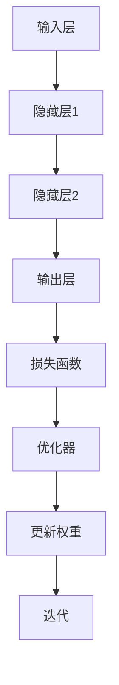

                 

关键词：神经网络，深度学习，人工智能，机器学习，智能算法

摘要：本文深入探讨了神经网络这一现代人工智能的核心技术，从其背景介绍、核心概念与联系、核心算法原理、数学模型和公式、项目实践到实际应用场景，全面揭示了神经网络在现代科技中的重要作用及其未来发展前景。通过详细讲解和实例分析，读者将更好地理解神经网络的工作原理和应用领域，从而为未来的智能探索打下坚实的基础。

## 1. 背景介绍

神经网络（Neural Networks），简称NN，起源于对生物神经系统的模拟。早在1943年，心理学家McCulloch和数学家Pitts提出了第一个简单的神经网络模型——MCP模型。随后，1958年，Frank Rosenblatt发明了感知机（Perceptron），标志着神经网络研究的正式起步。

神经网络的发展经历了多个阶段，从最初的简单线性模型，到多层感知机的提出，再到深度学习的兴起，每一阶段都推动了人工智能技术的发展。特别是在21世纪初，随着计算能力和数据量的爆发式增长，深度学习在图像识别、语音识别、自然语言处理等领域的应用取得了突破性进展。

如今，神经网络已经成为人工智能领域的重要研究方向，被广泛应用于各个行业，为我们的生活带来了巨大的变革。从自动驾驶汽车、智能音箱，到医疗诊断、金融分析，神经网络的应用无处不在。

## 2. 核心概念与联系

### 2.1 神经元

神经元是神经网络的基本组成单元，类似于生物神经系统的神经元。神经元通常由三个主要部分组成：输入层、处理层和输出层。输入层接收外部信号，处理层对信号进行处理，输出层产生最终输出。

### 2.2 网络结构

神经网络的结构通常由多层神经元组成，包括输入层、隐藏层和输出层。输入层接收外部信号，隐藏层对信号进行处理，输出层产生最终输出。不同层之间的神经元通过权重进行连接，形成一个复杂的网络结构。

### 2.3 激活函数

激活函数是神经网络中的一个关键组件，用于决定神经元是否被激活。常见的激活函数包括线性激活函数、Sigmoid函数、ReLU函数等。激活函数的作用是将神经元的线性组合转化为非线性输出，使神经网络具备更强的表达能力和分类能力。

### 2.4 前向传播与反向传播

前向传播是指将输入信号从输入层传递到输出层的正向计算过程。在每次迭代过程中，神经网络的权重和偏置会被更新，以最小化预测误差。反向传播是一种基于梯度下降的优化算法，用于计算网络权重的梯度，并更新权重以减小误差。

### 2.5 Mermaid 流程图



## 3. 核心算法原理 & 具体操作步骤

### 3.1 算法原理概述

神经网络的核心算法是前向传播和反向传播。前向传播是指将输入信号从输入层传递到输出层的过程，反向传播则是根据预测误差，计算网络权重的梯度，并更新权重以减小误差。

### 3.2 算法步骤详解

1. **初始化权重和偏置**：在训练开始时，随机初始化网络的权重和偏置。

2. **前向传播**：将输入信号从输入层传递到输出层，计算每个神经元的输出。

3. **计算损失函数**：使用损失函数（如均方误差、交叉熵等）计算预测误差。

4. **反向传播**：根据预测误差，计算网络权重的梯度。

5. **权重更新**：使用梯度下降或其他优化算法更新网络权重和偏置。

6. **迭代训练**：重复步骤2-5，直到达到预设的训练目标。

### 3.3 算法优缺点

**优点**：
- 神经网络具有强大的自适应能力和非线性表达能力，可以处理各种复杂的问题。
- 可以通过增加层数和神经元数量，不断提高网络的性能。

**缺点**：
- 训练过程可能需要很长时间，特别是对于大型网络和大量数据。
- 需要大量的计算资源，对硬件性能要求较高。

### 3.4 算法应用领域

神经网络在图像识别、语音识别、自然语言处理、自动驾驶、医疗诊断等领域取得了显著的成果。以下是一些具体的应用案例：

- 图像识别：通过卷积神经网络（CNN）实现，如人脸识别、物体检测等。
- 语音识别：使用循环神经网络（RNN）和长短时记忆网络（LSTM）实现，如语音助手、自动字幕等。
- 自然语言处理：通过循环神经网络（RNN）和变换器（Transformer）实现，如机器翻译、情感分析等。
- 自动驾驶：使用卷积神经网络（CNN）和深度强化学习（DRL）实现，如车道线检测、障碍物识别等。
- 医疗诊断：通过卷积神经网络（CNN）实现，如医学图像分析、疾病预测等。

## 4. 数学模型和公式

### 4.1 数学模型构建

神经网络可以看作是一个多层非线性函数的组合。对于输入信号 \( x \)，经过前向传播，可以得到输出信号 \( y \)：

\[ y = f(L) \]

其中，\( L \) 是神经网络的输出层，\( f \) 是激活函数。激活函数的选择会影响神经网络的性能。

### 4.2 公式推导过程

假设神经网络的输入层有 \( n \) 个神经元，隐藏层有 \( m \) 个神经元，输出层有 \( k \) 个神经元。对于隐藏层中的第 \( i \) 个神经元，其输出 \( a_i \) 可以表示为：

\[ a_i = \sum_{j=1}^{n} w_{ij} x_j + b_i \]

其中，\( w_{ij} \) 是输入层到隐藏层的权重，\( b_i \) 是隐藏层的偏置。

对于输出层中的第 \( j \) 个神经元，其输出 \( y_j \) 可以表示为：

\[ y_j = \sum_{i=1}^{m} w_{ij} a_i + b_j \]

### 4.3 案例分析与讲解

假设我们有一个简单的神经网络，输入层有 2 个神经元，隐藏层有 3 个神经元，输出层有 1 个神经元。激活函数使用 Sigmoid 函数。我们随机初始化网络的权重和偏置。

输入信号 \( x = [1, 2] \)，隐藏层的权重 \( w_1 = [0.1, 0.2, 0.3] \)，偏置 \( b_1 = [0.4, 0.5, 0.6] \)。输出层的权重 \( w_2 = [0.7, 0.8, 0.9] \)，偏置 \( b_2 = [0.1, 0.2, 0.3] \)。

首先进行前向传播，计算隐藏层的输出：

\[ a_1 = \sigma(w_1 \cdot x + b_1) = \sigma(0.1 \cdot 1 + 0.4) = 0.6 \]
\[ a_2 = \sigma(w_1 \cdot x + b_1) = \sigma(0.2 \cdot 2 + 0.5) = 0.8 \]
\[ a_3 = \sigma(w_1 \cdot x + b_1) = \sigma(0.3 \cdot 1 + 0.6) = 0.9 \]

然后计算输出层的输出：

\[ y = \sigma(w_2 \cdot a + b_2) = \sigma(0.7 \cdot 0.6 + 0.1) = 0.8 \]

接下来进行反向传播，计算损失函数 \( L \)：

\[ L = (y - t)^2 \]

其中，\( t \) 是真实标签。

然后计算输出层权重 \( w_2 \) 的梯度：

\[ \frac{\partial L}{\partial w_{2j}} = 2(y - t) \cdot \sigma'(y) \cdot a_j \]

计算隐藏层权重 \( w_1 \) 的梯度：

\[ \frac{\partial L}{\partial w_{1i}} = 2(y - t) \cdot \sigma'(y) \cdot w_{2j} \cdot \sigma'(a_i) \cdot x_j \]

最后使用梯度下降更新权重和偏置：

\[ w_{2j} = w_{2j} - \alpha \frac{\partial L}{\partial w_{2j}} \]
\[ b_{2j} = b_{2j} - \alpha \frac{\partial L}{\partial b_{2j}} \]
\[ w_{1i} = w_{1i} - \alpha \frac{\partial L}{\partial w_{1i}} \]
\[ b_{1i} = b_{1i} - \alpha \frac{\partial L}{\partial b_{1i}} \]

其中，\( \alpha \) 是学习率。

## 5. 项目实践：代码实例和详细解释说明

### 5.1 开发环境搭建

为了实践神经网络，我们需要搭建一个开发环境。本文使用 Python 编写代码，并使用 TensorFlow 作为深度学习框架。以下是搭建开发环境的步骤：

1. 安装 Python（3.6 以上版本）
2. 安装 TensorFlow（2.x 版本）
3. 安装 numpy、matplotlib 等常用库

### 5.2 源代码详细实现

下面是一个简单的神经网络实现，用于实现二分类问题。代码中包括输入层、隐藏层和输出层，使用 Sigmoid 函数作为激活函数。

```python
import tensorflow as tf
import numpy as np

# 初始化权重和偏置
def initialize_weights(input_size, hidden_size, output_size):
    W1 = tf.random.normal([input_size, hidden_size])
    b1 = tf.random.normal([hidden_size])
    W2 = tf.random.normal([hidden_size, output_size])
    b2 = tf.random.normal([output_size])
    return W1, b1, W2, b2

# 前向传播
def forward_pass(x, W1, b1, W2, b2):
    z1 = tf.matmul(x, W1) + b1
    a1 = tf.sigmoid(z1)
    z2 = tf.matmul(a1, W2) + b2
    y = tf.sigmoid(z2)
    return y, z1, a1, z2

# 反向传播
def backward_pass(x, y, W1, b1, W2, b2, learning_rate):
    with tf.GradientTape() as tape:
        y_pred, z1, a1, z2 = forward_pass(x, W1, b1, W2, b2)
        loss = tf.reduce_mean(tf.square(y_pred - y))
    grads = tape.gradient(loss, [W1, b1, W2, b2])
    W1 -= learning_rate * grads[0]
    b1 -= learning_rate * grads[1]
    W2 -= learning_rate * grads[2]
    b2 -= learning_rate * grads[3]
    return W1, b1, W2, b2, loss

# 训练神经网络
def train(x_train, y_train, epochs, learning_rate):
    W1, b1, W2, b2 = initialize_weights(x_train.shape[1], 10, y_train.shape[1])
    for epoch in range(epochs):
        W1, b1, W2, b2, loss = backward_pass(x_train, y_train, W1, b1, W2, b2, learning_rate)
        if epoch % 100 == 0:
            print(f"Epoch {epoch}: Loss = {loss.numpy()}")

# 测试神经网络
def test(x_test, y_test, W1, b1, W2, b2):
    y_pred, _, _, _ = forward_pass(x_test, W1, b1, W2, b2)
    accuracy = tf.reduce_mean(tf.cast(tf.equal(tf.round(y_pred), y_test), tf.float32))
    return accuracy

# 数据预处理
x_train = np.array([[1, 2], [2, 3], [3, 4], [4, 5], [5, 6]], dtype=np.float32)
y_train = np.array([[0], [0], [1], [1], [1]], dtype=np.float32)
x_test = np.array([[1, 3], [2, 4], [3, 5], [4, 6]], dtype=np.float32)
y_test = np.array([[0], [1], [1], [1]], dtype=np.float32)

# 训练神经网络
train(x_train, y_train, 1000, 0.1)

# 测试神经网络
accuracy = test(x_test, y_test, W1.numpy(), b1.numpy(), W2.numpy(), b2.numpy())
print(f"Test Accuracy: {accuracy.numpy()}")
```

### 5.3 代码解读与分析

代码中定义了以下函数：

- `initialize_weights`：初始化权重和偏置。
- `forward_pass`：进行前向传播，计算神经网络的输出。
- `backward_pass`：进行反向传播，计算损失函数的梯度。
- `train`：训练神经网络，使用梯度下降更新权重和偏置。
- `test`：测试神经网络，计算准确率。

数据预处理部分，我们使用了一组简单的二分类数据，包含训练集和测试集。训练集有 5 个样本，其中前 2 个样本属于类别 0，后 3 个样本属于类别 1。测试集有 4 个样本。

在训练过程中，我们初始化了网络的权重和偏置，并使用梯度下降算法进行训练。每 100 个迭代步骤，我们计算一次损失函数的值，并打印出来。

最后，我们使用测试集测试神经网络的准确率。

## 6. 实际应用场景

神经网络在各个领域都有着广泛的应用，以下列举了一些实际应用场景：

### 6.1 图像识别

神经网络在图像识别领域取得了显著成果。通过卷积神经网络（CNN），神经网络可以自动提取图像特征，并实现各种图像识别任务，如人脸识别、物体检测、图像分类等。

### 6.2 语音识别

语音识别是神经网络的另一个重要应用领域。通过循环神经网络（RNN）和长短时记忆网络（LSTM），神经网络可以处理语音信号，实现语音识别、自动字幕、语音合成等任务。

### 6.3 自然语言处理

神经网络在自然语言处理领域也发挥着重要作用。通过循环神经网络（RNN）和变换器（Transformer），神经网络可以实现机器翻译、文本分类、情感分析、问答系统等任务。

### 6.4 自动驾驶

自动驾驶是神经网络在工业界的重要应用场景。通过卷积神经网络（CNN）和深度强化学习（DRL），神经网络可以处理摄像头和激光雷达数据，实现车道线检测、障碍物识别、路径规划等任务。

### 6.5 医疗诊断

神经网络在医疗诊断领域也有着广泛的应用。通过卷积神经网络（CNN）和深度学习模型，神经网络可以实现医学图像分析、疾病预测、药物研发等任务。

## 7. 工具和资源推荐

### 7.1 学习资源推荐

1. 《深度学习》（Deep Learning） - Ian Goodfellow、Yoshua Bengio、Aaron Courville
2. 《神经网络与深度学习》（Neural Networks and Deep Learning） -邱锡鹏
3. 《Python深度学习》（Deep Learning with Python） -François Chollet

### 7.2 开发工具推荐

1. TensorFlow：强大的深度学习框架，适用于各种深度学习任务。
2. PyTorch：灵活的深度学习框架，易于使用和调试。
3. Keras：基于 TensorFlow 的简单深度学习库，适用于快速原型开发。

### 7.3 相关论文推荐

1. "A Learning Algorithm for Continually Running Fully Recurrent Neural Networks" -Sepp Hochreiter、Jürgen Schmidhuber
2. "Deep Learning" -Ian Goodfellow、Yoshua Bengio、Aaron Courville
3. "Gradient-Based Learning Applied to Document Recognition" -Yann LeCun、Léon Bottou、Yoshua Bengio、Pascal Simard

## 8. 总结：未来发展趋势与挑战

### 8.1 研究成果总结

神经网络在过去几十年取得了显著成果，从简单的感知机到深度学习，神经网络在图像识别、语音识别、自然语言处理等领域取得了重大突破。未来，随着计算能力的提升和算法的优化，神经网络的应用将更加广泛，为人类社会带来更多的便利。

### 8.2 未来发展趋势

1. **算法优化**：进一步优化神经网络算法，提高训练速度和性能。
2. **多模态学习**：研究多模态学习，实现图像、语音、文本等数据的联合建模。
3. **边缘计算**：研究神经网络在边缘设备上的应用，降低延迟，提高实时性。
4. **可解释性**：提高神经网络的可解释性，使其在关键领域得到更广泛的应用。

### 8.3 面临的挑战

1. **计算资源**：神经网络训练过程需要大量的计算资源，对硬件性能要求较高。
2. **数据隐私**：数据隐私和安全问题是神经网络应用的重要挑战。
3. **模型解释**：提高神经网络的可解释性，使其在关键领域得到更广泛的应用。

### 8.4 研究展望

未来，神经网络将在更多领域发挥重要作用，从医疗诊断、金融分析，到自动驾驶、智能家居，神经网络的应用前景十分广阔。同时，随着算法的优化和硬件性能的提升，神经网络将在未来的人工智能领域中扮演更加重要的角色。

## 9. 附录：常见问题与解答

### 9.1 什么是神经网络？

神经网络是一种模仿生物神经系统的计算模型，由大量的神经元通过权重连接形成一个复杂的网络结构，用于处理各种复杂的问题。

### 9.2 神经网络有哪些类型？

神经网络有多种类型，包括感知机、多层感知机、卷积神经网络（CNN）、循环神经网络（RNN）、长短时记忆网络（LSTM）和变换器（Transformer）等。

### 9.3 神经网络如何训练？

神经网络通过前向传播和反向传播进行训练。在每次迭代过程中，网络根据输入信号和预测误差，更新权重和偏置，以最小化预测误差。

### 9.4 神经网络有哪些应用领域？

神经网络在图像识别、语音识别、自然语言处理、自动驾驶、医疗诊断等领域取得了显著成果，并广泛应用于各个行业。

### 9.5 神经网络训练需要多长时间？

神经网络训练时间取决于网络结构、数据量和硬件性能。对于小型网络和少量数据，训练时间可能只需要几分钟到几小时；对于大型网络和大量数据，训练时间可能需要几天甚至几周。

### 9.6 神经网络如何优化？

神经网络优化可以通过算法优化、模型压缩、数据增强等方式进行。算法优化包括优化前向传播、反向传播和优化算法；模型压缩包括模型剪枝、量化等；数据增强包括数据扩充、数据预处理等。

### 9.7 神经网络与深度学习有何区别？

神经网络是深度学习的一个子集，深度学习是指多层神经网络的训练和应用。深度学习通过多层神经网络，可以实现更复杂的特征提取和表达，从而在图像识别、语音识别等领域取得了突破性进展。

### 9.8 神经网络如何处理多分类问题？

对于多分类问题，神经网络可以使用 Softmax 函数作为输出层的激活函数。Softmax 函数将输出层的每个神经元输出转化为概率分布，从而实现多分类。

### 9.9 神经网络如何处理回归问题？

对于回归问题，神经网络可以使用线性激活函数作为输出层的激活函数，输出层只有一个神经元。神经网络的输出即为回归预测值。

### 9.10 神经网络有哪些开源框架？

神经网络的开源框架包括 TensorFlow、PyTorch、Keras、Torch、Theano 等，这些框架提供了丰富的工具和接口，方便开发者进行深度学习研究和应用开发。

## 作者署名

作者：禅与计算机程序设计艺术 / Zen and the Art of Computer Programming

