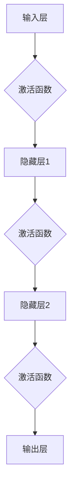

                 

 关键词：神经网络，机器学习，深度学习，算法原理，应用实践，未来发展

> 摘要：本文深入探讨了神经网络这一机器学习核心技术，从历史背景、核心概念、算法原理、数学模型到实际应用，全方位剖析了神经网络如何开启智能新纪元。通过详细讲解，读者将了解到神经网络的核心原理和应用前景，为未来的智能发展打下基础。

## 1. 背景介绍

神经网络作为人工智能领域的一个重要分支，其发展历程可以追溯到20世纪40年代。最初的灵感来源于人脑的神经元结构和功能，目的是模拟人类思维过程，实现机器智能。随着计算技术的进步和算法研究的深入，神经网络逐渐成为机器学习和人工智能的核心工具。

### 历史发展

- **1943年**：McCulloch和Pitts提出了神经网络的第一个数学模型，即MCP模型。
- **1958年**：Rosenblatt发明了感知机（Perceptron）模型，这是一种二分类线性分类器。
- **1986年**：Rumelhart、Hinton和Williams提出了反向传播算法（Backpropagation），使多层神经网络的训练成为可能。
- **2006年**：Hinton等人提出了深度学习的概念，并提出了深度信念网络（Deep Belief Network）。
- **2012年**：AlexNet在ImageNet大赛中取得突破性成绩，标志着深度学习在图像识别领域的崛起。

### 当前状态

当前，神经网络已经成为人工智能领域的主要研究方向之一，广泛应用于图像识别、自然语言处理、语音识别、推荐系统等多个领域。随着硬件性能的提升和算法的创新，神经网络在处理大规模数据和复杂任务方面展现出强大的能力。

## 2. 核心概念与联系

神经网络的核心理念在于模拟人脑神经元的工作方式，通过多层神经元之间的连接和激活函数来实现对输入数据的处理和分类。以下是神经网络的核心概念和架构的Mermaid流程图：



### 核心概念

- **神经元（Neuron）**：神经网络的组成单元，接收输入信号，通过加权求和和激活函数输出结果。
- **层（Layer）**：神经网络按照功能分为输入层、隐藏层和输出层。隐藏层可以有多个。
- **连接（Connection）**：神经元之间的连接，通过权重（Weight）来传递信号。
- **激活函数（Activation Function）**：用于引入非线性，使神经网络能够处理复杂问题。

### 算法架构

神经网络通过以下步骤实现数据的处理和分类：

1. **输入**：输入数据通过输入层传递到第一个隐藏层。
2. **传递**：每个神经元接收输入信号，通过权重进行加权求和。
3. **激活**：经过激活函数处理后，信号传递到下一层。
4. **输出**：最终在输出层产生结果，实现对数据的分类或预测。

## 3. 核心算法原理 & 具体操作步骤

### 3.1 算法原理概述

神经网络的核心算法是反向传播算法（Backpropagation），它通过迭代优化网络中的权重和偏置，使网络能够正确处理输入数据。以下是反向传播算法的基本步骤：

1. **初始化**：随机初始化网络中的权重和偏置。
2. **前向传播**：将输入数据传递到网络，计算输出层的预测结果。
3. **计算误差**：通过比较预测结果和实际结果，计算损失函数的值。
4. **反向传播**：计算损失函数关于网络权重的梯度，并更新网络参数。
5. **迭代优化**：重复前向传播和反向传播过程，直至损失函数收敛。

### 3.2 算法步骤详解

#### 初始化

在反向传播算法开始之前，需要对网络进行初始化。通常，权重和偏置初始化为较小的随机数，以避免梯度消失和梯度爆炸问题。

#### 前向传播

前向传播是神经网络处理输入数据的过程。输入数据通过输入层传递到隐藏层，然后逐层传递到输出层。在每个隐藏层，神经元通过加权求和和激活函数计算出输出值。

$$
z^{(l)} = \sum_{j} w^{(l)}_{ji} x^{(j)} + b^{(l)} \\
a^{(l)} = \sigma(z^{(l)})
$$

其中，$z^{(l)}$表示第$l$层的加权求和结果，$a^{(l)}$表示第$l$层的输出值，$w^{(l)}_{ji}$表示从第$l-1$层到第$l$层的权重，$b^{(l)}$表示第$l$层的偏置，$\sigma$表示激活函数。

#### 计算误差

误差是神经网络性能的重要指标。通常使用均方误差（Mean Squared Error, MSE）作为损失函数：

$$
J = \frac{1}{2} \sum_{i} (y^{(i)} - a^{(L)})^2
$$

其中，$y^{(i)}$表示实际输出，$a^{(L)}$表示预测输出。

#### 反向传播

反向传播是计算损失函数关于网络参数的梯度，并更新网络参数的过程。以下是反向传播的具体步骤：

1. **计算输出层的误差**：
$$
\delta^{(L)} = \frac{\partial J}{\partial a^{(L)}} = (y^{(i)} - a^{(L)}) \odot \sigma'(z^{(L)})
$$
其中，$\odot$表示元素-wise 相乘，$\sigma'(z^{(L)}$表示激活函数的导数。

2. **计算隐藏层的误差**：
$$
\delta^{(l)} = \frac{\partial J}{\partial a^{(l)}} = \delta^{(l+1)} \odot w^{(l+1)} \odot \sigma'(z^{(l)})
$$

3. **更新网络参数**：
$$
w^{(l)} \leftarrow w^{(l)} - \alpha \frac{\partial J}{\partial w^{(l)}} \\
b^{(l)} \leftarrow b^{(l)} - \alpha \frac{\partial J}{\partial b^{(l)}}
$$

其中，$\alpha$表示学习率。

#### 迭代优化

通过不断重复前向传播和反向传播，逐步优化网络参数，使损失函数不断减小，直到满足收敛条件。

### 3.3 算法优缺点

#### 优点

- **强大的非线性建模能力**：通过激活函数引入非线性，神经网络可以处理复杂的问题。
- **自适应特征学习**：神经网络可以根据训练数据自动学习特征表示，无需人工设计特征。
- **适用于大规模数据处理**：随着计算能力的提升，神经网络可以处理大规模的数据集。

#### 缺点

- **参数数量庞大**：神经网络需要大量的参数，导致计算复杂度高。
- **梯度消失和梯度爆炸**：在深度网络中，梯度可能会变得非常小或非常大，导致训练困难。
- **对数据质量要求高**：神经网络对训练数据的质量要求较高，否则容易过拟合。

### 3.4 算法应用领域

神经网络在多个领域取得了显著的成果：

- **图像识别**：如卷积神经网络（CNN）在ImageNet大赛中的表现。
- **自然语言处理**：如循环神经网络（RNN）和长短期记忆网络（LSTM）在机器翻译和情感分析中的应用。
- **语音识别**：如深度神经网络在语音信号处理和语音合成中的应用。
- **推荐系统**：如基于神经网络的协同过滤算法在推荐系统中的应用。

## 4. 数学模型和公式 & 详细讲解 & 举例说明

### 4.1 数学模型构建

神经网络的数学模型主要包括以下几个部分：

1. **输入层**：输入数据$x^{(i)}$，其中$i=1,2,...,n$表示数据的维度。
2. **隐藏层**：每个隐藏层由多个神经元组成，假设有$l$个隐藏层，每层有$m_l$个神经元。
3. **输出层**：输出层由一个或多个神经元组成，表示预测结果$y^{(i)}$。

### 4.2 公式推导过程

#### 前向传播

前向传播过程中，每个神经元通过加权求和和激活函数计算输出。具体公式如下：

$$
z^{(l)}_{ji} = \sum_{k=1}^{m_{l-1}} w^{(l)}_{jk} x^{(k)} + b^{(l)}_j \\
a^{(l)}_{ji} = \sigma(z^{(l)}_{ji})
$$

其中，$z^{(l)}_{ji}$表示第$l$层第$i$个神经元的加权求和结果，$a^{(l)}_{ji}$表示第$l$层第$i$个神经元的输出值，$w^{(l)}_{jk}$表示从第$l-1$层第$k$个神经元到第$l$层第$j$个神经元的权重，$b^{(l)}_j$表示第$l$层第$j$个神经元的偏置，$\sigma$表示激活函数。

#### 计算误差

计算误差是神经网络训练的核心步骤。具体公式如下：

$$
\delta^{(l)}_{ji} = (y^{(i)} - a^{(L)}_{ji}) \odot \sigma'(z^{(L)}_{ji}) \\
J = \frac{1}{2} \sum_{i=1}^{n} (y^{(i)} - a^{(L)}_{ji})^2
$$

其中，$\delta^{(l)}_{ji}$表示第$l$层第$i$个神经元的误差，$y^{(i)}$表示实际输出，$a^{(L)}_{ji}$表示预测输出，$\sigma'(z^{(L)}_{ji})$表示激活函数的导数。

#### 反向传播

反向传播过程中，需要计算损失函数关于网络参数的梯度。具体公式如下：

$$
\frac{\partial J}{\partial w^{(l)}_{jk}} = \delta^{(l+1)}_{ji} a^{(l)}_{ji} (1 - a^{(l)}_{ji}) \\
\frac{\partial J}{\partial b^{(l)}_j} = \delta^{(l+1)}_{ji}
$$

其中，$\delta^{(l+1)}_{ji}$表示第$l+1$层第$i$个神经元的误差，$a^{(l)}_{ji}$表示第$l$层第$i$个神经元的输出值。

#### 更新参数

根据梯度信息，更新网络参数：

$$
w^{(l)}_{jk} \leftarrow w^{(l)}_{jk} - \alpha \frac{\partial J}{\partial w^{(l)}_{jk}} \\
b^{(l)}_j \leftarrow b^{(l)}_j - \alpha \frac{\partial J}{\partial b^{(l)}_j}
$$

其中，$\alpha$表示学习率。

### 4.3 案例分析与讲解

#### 数据集准备

假设我们有一个包含100个样本的二元分类问题，每个样本有10个特征。数据集分为训练集和测试集。

#### 模型构建

构建一个具有两个隐藏层的前馈神经网络，输入层有10个神经元，第一隐藏层有20个神经元，第二隐藏层有10个神经元，输出层有2个神经元。

#### 训练过程

使用反向传播算法对模型进行训练，迭代1000次。每次迭代过程中，计算损失函数的值，并更新网络参数。

#### 结果分析

在训练完成后，对测试集进行预测，计算准确率。同时，绘制损失函数的曲线，观察训练过程。

$$
\text{准确率} = \frac{\text{预测正确数量}}{\text{测试集样本数量}}
$$

## 5. 项目实践：代码实例和详细解释说明

### 5.1 开发环境搭建

在开发神经网络项目时，我们需要搭建一个合适的环境。以下是一个基于Python和TensorFlow的示例：

1. 安装Python：确保安装了Python 3.x版本。
2. 安装TensorFlow：使用pip命令安装TensorFlow库。

```bash
pip install tensorflow
```

### 5.2 源代码详细实现

以下是一个简单的神经网络实现，用于二元分类问题：

```python
import tensorflow as tf
from tensorflow.keras import layers

# 定义模型
model = tf.keras.Sequential([
    layers.Dense(20, activation='relu', input_shape=(10,)),
    layers.Dense(10, activation='relu'),
    layers.Dense(2, activation='sigmoid')
])

# 编译模型
model.compile(optimizer='adam',
              loss='binary_crossentropy',
              metrics=['accuracy'])

# 加载数据
# ...

# 训练模型
model.fit(x_train, y_train, epochs=1000, batch_size=32, validation_data=(x_test, y_test))

# 评估模型
model.evaluate(x_test, y_test)
```

### 5.3 代码解读与分析

- **模型定义**：使用`tf.keras.Sequential`定义一个简单的神经网络，包括两个隐藏层和一个输出层。隐藏层使用ReLU激活函数，输出层使用sigmoid激活函数。
- **模型编译**：编译模型，指定优化器、损失函数和评价指标。
- **数据加载**：加载数据集，通常使用`tf.data.Dataset`进行数据预处理和批量处理。
- **模型训练**：使用`fit`函数训练模型，指定迭代次数、批量大小和验证集。
- **模型评估**：使用`evaluate`函数评估模型在测试集上的性能。

### 5.4 运行结果展示

在训练完成后，我们可以查看模型的准确率和损失函数曲线。以下是一个简单的示例：

```python
import matplotlib.pyplot as plt

# 获取训练过程中的损失函数值
history = model.fit(x_train, y_train, epochs=1000, batch_size=32, validation_data=(x_test, y_test))

# 绘制损失函数曲线
plt.plot(history.history['loss'], label='Training loss')
plt.plot(history.history['val_loss'], label='Validation loss')
plt.xlabel('Epochs')
plt.ylabel('Loss')
plt.legend()
plt.show()

# 计算测试集准确率
accuracy = model.evaluate(x_test, y_test)[1]
print(f"Test set accuracy: {accuracy:.4f}")
```

## 6. 实际应用场景

神经网络在众多领域展现出了强大的应用价值：

### 6.1 图像识别

- **人脸识别**：神经网络被广泛用于人脸识别系统，如Face++、商汤科技等。
- **物体检测**：卷积神经网络（如YOLO、SSD）在物体检测领域取得了显著成果。
- **图像生成**：生成对抗网络（GAN）在图像生成方面表现出色。

### 6.2 自然语言处理

- **机器翻译**：循环神经网络（RNN）和长短期记忆网络（LSTM）在机器翻译领域取得了突破性进展。
- **文本分类**：神经网络被用于对大量文本进行分类，如情感分析、新闻分类等。
- **语音识别**：深度神经网络在语音信号处理和语音合成方面取得了显著成果。

### 6.3 推荐系统

- **协同过滤**：基于矩阵分解的协同过滤算法结合神经网络，提高了推荐系统的准确性和实时性。
- **用户行为预测**：神经网络被用于预测用户行为，如点击、购买等。

### 6.4 未来应用展望

随着神经网络技术的不断进步，未来将在更多领域发挥作用：

- **自动驾驶**：神经网络在自动驾驶系统中用于感知环境和决策。
- **医疗诊断**：神经网络在医学图像分析和疾病诊断中具有广泛应用。
- **金融风控**：神经网络在金融领域的风险评估和欺诈检测中表现出色。

## 7. 工具和资源推荐

### 7.1 学习资源推荐

- **书籍**：
  - 《深度学习》（Ian Goodfellow、Yoshua Bengio、Aaron Courville 著）
  - 《神经网络与深度学习》（邱锡鹏 著）
- **在线课程**：
  - Coursera上的《Deep Learning Specialization》
  - Udacity的《Deep Learning Nanodegree Program》
- **博客和网站**：
  - Medium上的深度学习和神经网络相关文章
  - ArXiv上的最新论文和研究成果

### 7.2 开发工具推荐

- **框架**：
  - TensorFlow：Google推出的开源深度学习框架
  - PyTorch：Facebook AI Research推出的开源深度学习框架
  - Keras：基于TensorFlow和Theano的高层API
- **编程语言**：
  - Python：广泛应用于人工智能和深度学习的编程语言
  - R：专注于统计分析和数据可视化的编程语言

### 7.3 相关论文推荐

- **经典论文**：
  - "A Learning Algorithm for Continually Running Fully Recurrent Neural Networks"（Hiroshi Sakoe 和 Fumitada Chibbur）
  - "A Simple Weight Decay Can Improve Generalization"（Quoc V. Le 等人）
  - "Deep Learning for Speech Recognition"（Geoffrey Hinton 等人）
- **最新论文**：
  - "Bert: Pre-training of Deep Bidirectional Transformers for Language Understanding"（Jacob Devlin 等人）
  - "Gpt-3: Language Models are Few-shot Learners"（Tom B. Brown 等人）

## 8. 总结：未来发展趋势与挑战

### 8.1 研究成果总结

神经网络在过去几十年取得了显著的研究成果，广泛应用于图像识别、自然语言处理、语音识别等领域。随着深度学习技术的发展，神经网络在处理大规模数据和复杂任务方面表现出强大的能力。

### 8.2 未来发展趋势

- **硬件加速**：随着硬件技术的进步，如GPU、TPU等专用硬件的广泛应用，将进一步提高神经网络的计算效率。
- **模型压缩**：研究如何降低神经网络的参数数量和计算复杂度，以提高模型的可解释性和部署效率。
- **泛化能力提升**：研究如何提高神经网络在未知数据上的泛化能力，减少过拟合现象。

### 8.3 面临的挑战

- **数据隐私**：如何在保障数据隐私的前提下进行大规模数据训练。
- **计算资源**：神经网络训练需要大量计算资源，如何在有限的资源下进行高效训练。
- **模型解释性**：提高神经网络的可解释性，使人们能够理解模型的决策过程。

### 8.4 研究展望

随着人工智能技术的不断发展，神经网络将在更多领域发挥作用。未来研究将继续探索神经网络的理论基础、算法优化和实际应用，为智能时代的到来奠定基础。

## 9. 附录：常见问题与解答

### 9.1 什么是神经网络？

神经网络是一种模拟人脑神经元结构和功能的计算模型，通过多层神经元之间的连接和激活函数实现数据的处理和分类。

### 9.2 反向传播算法是什么？

反向传播算法是一种用于训练神经网络的优化算法，通过计算损失函数关于网络参数的梯度，并更新网络参数，使网络能够正确处理输入数据。

### 9.3 神经网络如何处理非线性问题？

神经网络通过引入激活函数（如ReLU、Sigmoid、Tanh）引入非线性，使网络能够处理复杂的问题。

### 9.4 神经网络训练过程中可能出现哪些问题？

神经网络训练过程中可能出现过拟合、梯度消失、梯度爆炸等问题。过拟合是指模型在训练数据上表现良好，但在测试数据上表现较差。梯度消失和梯度爆炸是指在深度网络中，梯度可能会变得非常小或非常大，导致训练困难。

### 9.5 神经网络在图像识别中的应用有哪些？

神经网络在图像识别中广泛应用于人脸识别、物体检测、图像生成等领域。经典的模型如卷积神经网络（CNN）在ImageNet大赛中取得了突破性成绩。

----------------------------------------------------------------

作者：禅与计算机程序设计艺术 / Zen and the Art of Computer Programming
---
本文旨在深入剖析神经网络这一机器学习核心技术，从历史背景、核心概念、算法原理、数学模型到实际应用，全方位展示神经网络如何开启智能新纪元。随着计算技术的进步和算法的创新，神经网络在处理大规模数据和复杂任务方面展现出强大的能力。本文通过详细的讲解和实例分析，帮助读者全面了解神经网络的核心原理和应用前景。在未来，神经网络将继续在人工智能领域发挥重要作用，为智能时代的到来奠定基础。

