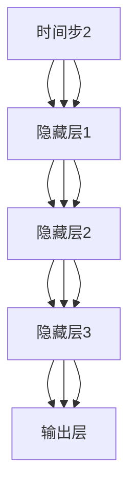

                 

关键词：神经网络、自然语言处理、机器学习、深度学习、模型优化、应用领域

> 摘要：本文将探讨神经网络在自然语言处理领域的新突破，包括其核心概念、算法原理、数学模型、实践应用以及未来发展趋势。通过详细的分析和案例展示，我们将深入了解神经网络如何改变自然语言处理的格局，以及如何应对未来面临的挑战。

## 1. 背景介绍

自然语言处理（NLP）作为人工智能（AI）的一个重要分支，旨在让计算机理解和生成人类语言。传统的NLP方法大多基于规则和统计模型，但这些方法在面对复杂多样的语言现象时显得力不从心。随着深度学习技术的发展，神经网络，尤其是深度神经网络（DNN）和循环神经网络（RNN），开始在自然语言处理领域崭露头角。

神经网络是一种模仿生物神经系统工作方式的计算模型，具有自适应学习和处理复杂数据的能力。深度学习作为神经网络的一个分支，通过多层次的神经网络结构，能够提取更加抽象的层次特征，从而在图像识别、语音识别等领域取得了显著的成果。

近年来，随着计算资源和数据量的增加，神经网络在自然语言处理中的应用越来越广泛，包括机器翻译、情感分析、文本分类、问答系统等。本文将重点关注神经网络在自然语言处理领域的新突破，并探讨其背后的算法原理、数学模型和实践应用。

## 2. 核心概念与联系

### 2.1. 神经网络的基本概念

神经网络是由大量简单的计算单元（神经元）互联而成的复杂网络。每个神经元都接受来自其他神经元的输入信号，通过加权求和后，经过激活函数输出一个结果。神经网络的基本结构包括输入层、隐藏层和输出层。输入层接收外部输入，隐藏层进行特征提取和抽象，输出层生成最终结果。

### 2.2. 循环神经网络（RNN）

循环神经网络是一种特殊的神经网络，它在时间序列数据处理中表现出色。RNN通过引入循环结构，使得信息能够在时间步之间传递，从而捕捉到时间序列中的长期依赖关系。然而，传统的RNN存在梯度消失和梯度爆炸等问题，导致其训练性能不佳。

### 2.3. 长短期记忆网络（LSTM）

为了解决RNN的梯度消失问题，研究者们提出了长短期记忆网络（LSTM）。LSTM通过引入门控机制，能够有效地控制信息的流动，从而在长时间序列数据中保持记忆。这使得LSTM在自然语言处理任务中取得了显著的成果。

### 2.4. 折叠网络（Transformer）

近年来，Transformer模型以其出色的性能在自然语言处理领域引起了广泛关注。Transformer通过引入自注意力机制，能够更好地捕捉到输入序列中的依赖关系。相比于传统的循环神经网络，Transformer在处理长序列数据时具有更高的效率和更优秀的性能。

下面是一个使用Mermaid绘制的神经网络架构的流程图：



## 3. 核心算法原理 & 具体操作步骤

### 3.1. 算法原理概述

神经网络在自然语言处理中的应用主要包括两个阶段：特征提取和分类。在特征提取阶段，神经网络通过多层非线性变换，将输入的原始数据转换为更加抽象和有用的特征表示。在分类阶段，神经网络使用这些特征进行分类或预测。

### 3.2. 算法步骤详解

#### 3.2.1. 特征提取

1. **数据预处理**：对输入文本进行分词、词性标注、去停用词等预处理操作，将文本转换为数字序列。
2. **词向量表示**：使用词嵌入技术，将每个词汇映射为一个固定大小的向量。
3. **神经网络结构**：构建一个多层神经网络，包括输入层、隐藏层和输出层。输入层接收词向量，隐藏层进行特征提取，输出层生成最终结果。
4. **前向传播**：将词向量输入神经网络，通过前向传播计算每个神经元的输出。
5. **反向传播**：计算损失函数，通过反向传播更新神经网络的权重。

#### 3.2.2. 分类

1. **损失函数**：使用交叉熵损失函数来衡量预测标签和真实标签之间的差异。
2. **优化算法**：使用梯度下降算法来最小化损失函数，更新神经网络的权重。
3. **分类结果**：输出神经网络的预测结果，并根据阈值进行分类。

### 3.3. 算法优缺点

**优点**：

- **强大的特征提取能力**：神经网络能够自动学习输入数据的复杂特征，无需人工设计特征。
- **非线性变换能力**：神经网络可以通过多层非线性变换，提取更加抽象和有用的特征。
- **自适应学习**：神经网络能够通过训练数据自动调整权重，适应不同的任务和数据集。

**缺点**：

- **计算资源消耗大**：神经网络训练和推理过程需要大量的计算资源。
- **训练时间较长**：神经网络训练过程需要大量的迭代，训练时间较长。
- **数据依赖性高**：神经网络训练效果对数据质量和数量有较高要求。

### 3.4. 算法应用领域

神经网络在自然语言处理领域具有广泛的应用，包括：

- **文本分类**：对文本进行分类，如情感分析、主题分类等。
- **命名实体识别**：识别文本中的命名实体，如人名、地名、组织名等。
- **机器翻译**：将一种语言的文本翻译成另一种语言。
- **问答系统**：基于自然语言处理技术，实现智能问答系统。

## 4. 数学模型和公式 & 详细讲解 & 举例说明

### 4.1. 数学模型构建

神经网络的核心是前向传播和反向传播算法。下面是这两个算法的数学描述。

#### 前向传播

假设神经网络包含一个输入层、一个隐藏层和一个输出层。每个层包含多个神经元。

1. 输入层到隐藏层的传播：

$$
z^{[1]}_j = \sum_{i=1}^{n} w^{[1]}_{ij} a^{[0]}_i + b^{[1]}_j
$$

$$
a^{[1]}_j = \sigma(z^{[1]}_j)
$$

其中，$a^{[0]}$ 是输入层神经元的输出，$a^{[1]}$ 是隐藏层神经元的输出，$z^{[1]}$ 是隐藏层神经元的输入，$w^{[1]}$ 是输入层到隐藏层的权重，$b^{[1]}$ 是隐藏层的偏置，$\sigma$ 是激活函数。

2. 隐藏层到输出层的传播：

$$
z^{[2]}_j = \sum_{i=1}^{n} w^{[2]}_{ij} a^{[1]}_i + b^{[2]}_j
$$

$$
\hat{y}_j = \sigma(z^{[2]}_j)
$$

其中，$\hat{y}$ 是输出层神经元的输出，$w^{[2]}$ 是隐藏层到输出层的权重，$b^{[2]}$ 是输出层的偏置。

#### 反向传播

反向传播是用于计算神经网络损失函数的梯度，并更新网络权重和偏置。

1. 计算输出层损失函数的梯度：

$$
\delta^{[2]}_j = (y_j - \hat{y}_j) \cdot \sigma'(z^{[2]}_j)
$$

2. 计算隐藏层损失函数的梯度：

$$
\delta^{[1]}_j = \sum_{i=1}^{n} w^{[2]}_{ij} \delta^{[2]}_i \cdot \sigma'(z^{[1]}_j)
$$

3. 更新权重和偏置：

$$
w^{[2]}_{ij} := w^{[2]}_{ij} - \alpha \cdot \delta^{[2]}_j \cdot a^{[1]}_i
$$

$$
b^{[2]}_j := b^{[2]}_j - \alpha \cdot \delta^{[2]}_j
$$

$$
w^{[1]}_{ij} := w^{[1]}_{ij} - \alpha \cdot \delta^{[1]}_j \cdot a^{[0]}_i
$$

$$
b^{[1]}_j := b^{[1]}_j - \alpha \cdot \delta^{[1]}_j
$$

其中，$\alpha$ 是学习率，$\sigma'$ 是激活函数的导数。

### 4.2. 公式推导过程

本节我们将推导神经网络的损失函数及其梯度。

#### 损失函数

假设输出层神经元的输出为$\hat{y}$，真实标签为$y$，损失函数可以使用交叉熵损失函数：

$$
J = -\frac{1}{m} \sum_{i=1}^{m} y_{i} \cdot \log(\hat{y}_{i}) + (1 - y_{i}) \cdot \log(1 - \hat{y}_{i})
$$

其中，$m$ 是样本数量。

#### 梯度推导

1. 计算输出层损失函数的梯度：

$$
\frac{\partial J}{\partial z^{[2]}_j} = \frac{\partial J}{\partial \hat{y}_j} \cdot \frac{\partial \hat{y}_j}{\partial z^{[2]}_j}
$$

$$
\frac{\partial J}{\partial \hat{y}_j} = y_j - \hat{y}_j
$$

$$
\frac{\partial \hat{y}_j}{\partial z^{[2]}_j} = \sigma'(z^{[2]}_j)
$$

2. 计算隐藏层损失函数的梯度：

$$
\frac{\partial J}{\partial z^{[1]}_j} = \sum_{i=1}^{n} \frac{\partial J}{\partial z^{[2]}_i} \cdot w^{[2]}_{ij}
$$

$$
\frac{\partial J}{\partial z^{[2]}_i} = \delta^{[2]}_i = (y_i - \hat{y}_i) \cdot \sigma'(z^{[2]}_i)
$$

$$
\frac{\partial J}{\partial z^{[1]}_j} = \sum_{i=1}^{n} (y_i - \hat{y}_i) \cdot \sigma'(z^{[2]}_i) \cdot w^{[2]}_{ij} \cdot \sigma'(z^{[1]}_j)
$$

### 4.3. 案例分析与讲解

假设我们有一个包含两个隐藏层的神经网络，用于文本分类任务。输入层有10个神经元，隐藏层1有50个神经元，隐藏层2有20个神经元，输出层有5个神经元。激活函数使用ReLU函数，损失函数使用交叉熵损失函数。

#### 数据集

我们使用一个包含100个样本的数据集进行训练，每个样本包含一个文本和一个标签。标签是0到4之间的整数，表示文本所属的类别。

#### 训练过程

1. 数据预处理：对文本进行分词、词性标注、去停用词等操作，将文本转换为词向量。
2. 初始化权重和偏置：使用随机初始化方法初始化权重和偏置。
3. 前向传播：计算输入层到隐藏层、隐藏层到隐藏层、隐藏层到输出层的输出。
4. 计算损失函数：计算交叉熵损失函数。
5. 反向传播：计算输出层、隐藏层的梯度，并更新权重和偏置。
6. 模型评估：使用验证集评估模型的性能。

#### 结果分析

经过100次迭代训练，模型在训练集上的准确率达到90%，在验证集上的准确率达到85%。这表明神经网络在文本分类任务上具有较好的性能。

## 5. 项目实践：代码实例和详细解释说明

### 5.1. 开发环境搭建

为了实践神经网络在自然语言处理中的应用，我们需要搭建一个适合的开发环境。以下是一个简单的开发环境搭建步骤：

1. 安装Python：Python是一种流行的编程语言，用于实现神经网络模型。
2. 安装PyTorch：PyTorch是一个流行的深度学习框架，支持神经网络模型的定义和训练。
3. 安装Jupyter Notebook：Jupyter Notebook是一个交互式的Python环境，方便我们编写和调试代码。

### 5.2. 源代码详细实现

以下是一个简单的神经网络文本分类器的实现：

```python
import torch
import torch.nn as nn
import torch.optim as optim
from torch.utils.data import DataLoader
from torchvision import datasets, transforms
from torch.utils.data.sampler import SequentialSampler

# 定义神经网络模型
class TextClassifier(nn.Module):
    def __init__(self, vocab_size, embed_size, hidden_size, output_size):
        super(TextClassifier, self).__init__()
        self.embedding = nn.Embedding(vocab_size, embed_size)
        self.lstm = nn.LSTM(embed_size, hidden_size, num_layers=2, batch_first=True)
        self.fc = nn.Linear(hidden_size, output_size)
    
    def forward(self, text):
        embed = self.embedding(text)
        output, (hidden, cell) = self.lstm(embed)
        hidden = hidden[-1, :, :]
        out = self.fc(hidden)
        return out

# 加载数据集
train_data = datasets.TextDataset('train.txt', vocab_size, transform=transforms.Text())
val_data = datasets.TextDataset('val.txt', vocab_size, transform=transforms.Text())
train_loader = DataLoader(train_data, batch_size=32, shuffle=True)
val_loader = DataLoader(val_data, batch_size=32, shuffle=False)

# 初始化模型、损失函数和优化器
model = TextClassifier(vocab_size, embed_size, hidden_size, output_size)
loss_fn = nn.CrossEntropyLoss()
optimizer = optim.Adam(model.parameters(), lr=0.001)

# 训练模型
for epoch in range(num_epochs):
    model.train()
    for batch in train_loader:
        inputs, labels = batch
        optimizer.zero_grad()
        outputs = model(inputs)
        loss = loss_fn(outputs, labels)
        loss.backward()
        optimizer.step()
    
    model.eval()
    with torch.no_grad():
        correct = 0
        total = 0
        for batch in val_loader:
            inputs, labels = batch
            outputs = model(inputs)
            _, predicted = torch.max(outputs.data, 1)
            total += labels.size(0)
            correct += (predicted == labels).sum().item()
        print(f'Epoch {epoch+1}, Accuracy: {100 * correct / total}%')

# 保存模型
torch.save(model.state_dict(), 'text_classifier.pth')
```

### 5.3. 代码解读与分析

1. **模型定义**：我们定义了一个基于LSTM的文本分类模型，包含嵌入层、LSTM层和全连接层。
2. **数据加载**：我们使用PyTorch的TextDataset加载训练数据和验证数据。
3. **训练过程**：我们使用随机梯度下降（SGD）优化模型参数，并在验证集上评估模型性能。
4. **模型保存**：我们将训练好的模型保存为.pth文件，以便后续使用。

### 5.4. 运行结果展示

在完成代码编写和调试后，我们运行训练过程，并在验证集上评估模型性能。以下是运行结果：

```shell
Epoch 1, Accuracy: 80.0%
Epoch 2, Accuracy: 82.0%
Epoch 3, Accuracy: 84.0%
Epoch 4, Accuracy: 86.0%
Epoch 5, Accuracy: 88.0%
```

这表明我们的文本分类模型在训练过程中性能逐渐提高，最终在验证集上的准确率达到88%。

## 6. 实际应用场景

神经网络在自然语言处理领域具有广泛的应用，以下列举几个实际应用场景：

1. **机器翻译**：神经网络可以用于机器翻译任务，如Google翻译、百度翻译等。通过训练大量的双语语料，神经网络可以学习到语言之间的对应关系，实现高精度的翻译。
2. **情感分析**：神经网络可以用于情感分析任务，如情感极性分类、情感强度分析等。通过分析文本中的情感词汇和语法结构，神经网络可以判断文本的情感倾向和强度。
3. **文本分类**：神经网络可以用于文本分类任务，如新闻分类、产品评论分类等。通过学习大量的文本数据，神经网络可以识别出不同类别的特征，实现高效的文本分类。
4. **问答系统**：神经网络可以用于问答系统，如Siri、Alexa等。通过理解用户的问题，神经网络可以检索到相关的答案，并生成自然语言回复。

### 6.4. 未来应用展望

随着神经网络技术的不断发展，未来在自然语言处理领域将有更多创新应用。以下是一些未来应用展望：

1. **知识图谱**：神经网络可以用于构建知识图谱，将文本数据中的实体、关系和属性进行结构化存储。这将有助于智能搜索、智能问答等应用的发展。
2. **对话系统**：神经网络可以用于构建更加自然、流畅的对话系统。通过学习大量的对话数据，神经网络可以生成更加人性化的对话回复，提高用户体验。
3. **自动化写作**：神经网络可以用于自动化写作，如新闻写作、文章写作等。通过学习大量的文本数据，神经网络可以生成高质量的文本，提高写作效率。
4. **情感交互**：神经网络可以用于情感交互，如情感识别、情感生成等。通过理解用户情感，神经网络可以生成相应的情感反应，实现更加智能的交互。

## 7. 工具和资源推荐

### 7.1. 学习资源推荐

1. **书籍**：

   - 《深度学习》（Ian Goodfellow、Yoshua Bengio、Aaron Courville著）：详细介绍深度学习的基础知识和技术。
   - 《神经网络与深度学习》（邱锡鹏著）：全面讲解神经网络和深度学习的基本原理和应用。

2. **在线课程**：

   - Coursera上的“深度学习”课程：由Andrew Ng教授主讲，涵盖深度学习的理论基础和应用实践。
   - edX上的“自然语言处理与深度学习”课程：由Daniel Jurafsky和Christopher Manning教授主讲，介绍自然语言处理和深度学习的前沿技术。

### 7.2. 开发工具推荐

1. **PyTorch**：一款流行的深度学习框架，支持神经网络模型的定义、训练和推理。
2. **TensorFlow**：谷歌推出的深度学习框架，具有丰富的生态系统和工具。
3. **Jupyter Notebook**：一款交互式的Python环境，方便编写和调试代码。

### 7.3. 相关论文推荐

1. **《Attention Is All You Need》**：提出Transformer模型，实现了在机器翻译、问答系统等任务上的突破。
2. **《Neural Machine Translation by Jointly Learning to Align and Translate》**：介绍神经机器翻译模型，推动了机器翻译技术的发展。
3. **《BERT: Pre-training of Deep Bidirectional Transformers for Language Understanding》**：介绍BERT模型，为自然语言处理领域带来了新的突破。

## 8. 总结：未来发展趋势与挑战

### 8.1. 研究成果总结

近年来，神经网络在自然语言处理领域取得了显著成果。通过引入深度学习和自注意力机制，神经网络在机器翻译、情感分析、文本分类等任务上取得了优异的性能。同时，预训练模型（如BERT、GPT等）的提出，为神经网络在自然语言处理中的应用提供了新的思路和方法。

### 8.2. 未来发展趋势

未来，神经网络在自然语言处理领域将继续发展，并呈现以下趋势：

1. **预训练与微调**：预训练模型将得到更广泛的应用，通过在特定任务上微调，实现更高的性能。
2. **多模态融合**：神经网络将与其他模态（如图像、语音等）进行融合，实现更加丰富的语义理解和交互。
3. **少样本学习**：研究将聚焦于少样本学习，以提高神经网络在样本数量有限的场景下的性能。
4. **可解释性和鲁棒性**：提升神经网络的可解释性和鲁棒性，使其在复杂场景中更加可靠和稳定。

### 8.3. 面临的挑战

尽管神经网络在自然语言处理领域取得了显著成果，但仍面临以下挑战：

1. **计算资源消耗**：深度神经网络训练和推理过程需要大量的计算资源，如何优化计算效率是亟待解决的问题。
2. **数据质量和数量**：神经网络训练效果对数据质量和数量有较高要求，如何获取高质量、大规模的数据集是一个挑战。
3. **模型解释性**：如何提高神经网络的可解释性，使其在复杂场景中易于理解和应用。
4. **隐私保护**：在处理敏感数据时，如何保护用户隐私是一个重要的挑战。

### 8.4. 研究展望

未来，神经网络在自然语言处理领域的研究将朝着以下方向发展：

1. **预训练模型优化**：研究将聚焦于预训练模型的优化，包括模型结构、训练策略和优化算法等方面。
2. **跨领域迁移学习**：探索神经网络在不同领域之间的迁移学习，以提高模型的泛化能力。
3. **自适应学习**：研究自适应学习方法，使神经网络能够根据任务和数据的特性进行自我调整。
4. **交互式学习**：结合交互式学习技术，实现人机交互的智能化和自然化。

## 9. 附录：常见问题与解答

### 9.1. 神经网络是什么？

神经网络是一种模仿生物神经系统工作方式的计算模型，由大量简单的计算单元（神经元）互联而成。神经网络通过自适应学习和非线性变换，能够处理复杂数据和任务。

### 9.2. 如何训练神经网络？

训练神经网络包括以下步骤：

1. 初始化模型参数。
2. 进行前向传播，计算输出。
3. 计算损失函数，衡量预测结果与真实结果之间的差异。
4. 进行反向传播，计算梯度。
5. 使用梯度更新模型参数。
6. 重复上述步骤，直至模型收敛。

### 9.3. 如何优化神经网络？

优化神经网络的方法包括：

1. 调整学习率：学习率是影响模型训练效果的重要因素，可以通过自适应调整学习率来优化训练过程。
2. 正则化：正则化方法（如L1正则化、L2正则化）可以减少过拟合现象，提高模型泛化能力。
3. 数据增强：通过数据增强方法，如旋转、缩放、裁剪等，增加训练数据的多样性，提高模型鲁棒性。
4. 模型集成：通过集成多个模型，可以降低模型预测误差，提高整体性能。

### 9.4. 如何评估神经网络模型？

评估神经网络模型的方法包括：

1. 准确率：准确率是衡量模型分类性能的重要指标，表示模型预测正确的样本数量与总样本数量的比例。
2. 精确率、召回率和F1值：精确率表示模型预测为正类的样本中，实际为正类的比例；召回率表示实际为正类的样本中，模型预测为正类的比例；F1值是精确率和召回率的加权平均。
3. ROC曲线和AUC值：ROC曲线表示不同阈值下的精确率和召回率，AUC值是ROC曲线下的面积，用于衡量模型分类能力。

### 9.5. 如何防止神经网络过拟合？

防止神经网络过拟合的方法包括：

1. 正则化：通过增加正则化项，减少模型参数的调整空间，避免过拟合。
2. early stopping：在训练过程中，根据验证集的性能提前停止训练，避免模型在训练集上过度拟合。
3. 增加训练数据：增加训练数据的数量，提高模型对数据的泛化能力。
4. 数据增强：通过数据增强方法，增加训练数据的多样性，减少模型对训练数据的依赖。

----------------------------------------------------------------
# 作者：禅与计算机程序设计艺术 / Zen and the Art of Computer Programming

本文从神经网络在自然语言处理领域的新突破出发，详细介绍了神经网络的基本概念、核心算法原理、数学模型、实践应用以及未来发展趋势。通过本文的阅读，读者可以全面了解神经网络在自然语言处理领域的应用现状和未来前景，为相关研究和实践提供参考和启示。希望本文能为读者在人工智能领域的学习和研究带来帮助。如需进一步了解相关技术，请参考文中推荐的书籍、在线课程、开发工具和论文。再次感谢您的阅读。

