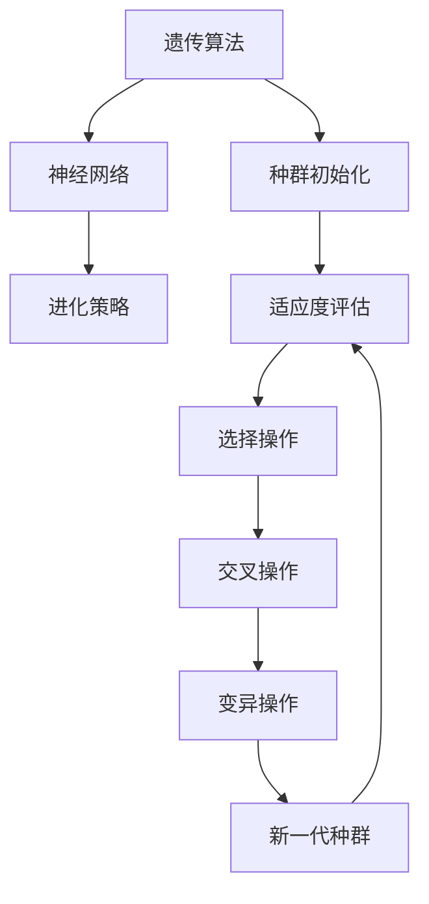

                 

### 背景介绍

神经进化算法（Neuroevolution）是机器学习和人工智能领域中的一个重要分支。它通过模拟自然进化的过程，对神经网络进行优化，以提高其性能。传统的机器学习方法，如深度学习，通常依赖于大量的数据和高性能的计算资源。然而，神经进化算法提供了一个不同的视角，通过遗传算法等启发式搜索方法，能够在有限的资源和数据下，快速地找到有效的神经网络结构。

神经进化算法的历史可以追溯到20世纪80年代，当时研究者们开始尝试使用遗传算法来优化神经网络。这一领域在21世纪初得到了快速发展，随着计算机性能的提升和算法的创新，神经进化算法逐渐成为解决复杂问题的一种有效手段。目前，神经进化算法已经广泛应用于游戏AI、自动驾驶、机器人控制等多个领域。

### 核心概念与联系

神经进化算法的核心概念包括遗传算法、神经网络、进化策略等。遗传算法是一种模拟自然进化的搜索算法，它通过选择、交叉和变异等操作，在种群中逐步优化个体的性能。神经网络则是一种模仿人脑结构和功能的计算模型，通过层层神经元的连接和激活函数，实现数据的处理和决策。进化策略是一种基于概率论的优化方法，通过调整策略参数，使种群逐渐逼近最优解。

为了更好地理解神经进化算法的原理，我们可以通过一个Mermaid流程图来展示其核心概念和联系：



### 遗传算法原理

遗传算法是一种基于自然进化的搜索算法，它通过模拟生物种群在环境中的进化过程，逐步优化个体的性能。遗传算法的基本流程包括种群初始化、适应度评估、选择操作、交叉操作、变异操作和新生代种群生成。

1. **种群初始化**：初始时，随机生成一组个体，这些个体代表了可能的解决方案。
2. **适应度评估**：通过某种度量标准，对每个个体的性能进行评估，评估结果称为适应度。
3. **选择操作**：选择适应度较高的个体，使其有机会遗传到下一代。
4. **交叉操作**：通过交换两个个体的部分基因，生成新的个体。
5. **变异操作**：对个体的基因进行随机改变，以引入新的变异。
6. **新生代种群生成**：通过交叉和变异操作，生成新一代的种群。

### 神经网络的构建

神经网络是神经进化算法的核心组成部分。一个简单的神经网络包括输入层、隐藏层和输出层。每个神经元都与前一层的神经元相连，并使用激活函数进行计算。

1. **输入层**：接收外部输入信息。
2. **隐藏层**：对输入信息进行加工和处理。
3. **输出层**：生成最终输出结果。

神经网络的性能取决于其结构（如层数、每层神经元数量）和参数（如权重、偏置）。神经进化算法通过优化这些结构和参数，使神经网络能够更好地适应特定任务。

### 进化策略的作用

进化策略是一种基于概率论的优化方法，它通过调整策略参数，使种群逐渐逼近最优解。进化策略在神经进化算法中起着关键作用，它可以帮助算法在复杂的搜索空间中找到最优解。

1. **策略参数**：进化策略通过调整策略参数，如变异率、交叉率等，来控制种群的进化过程。
2. **种群演化**：通过策略参数的调整，进化策略可以引导种群向最优解进化。

### 核心算法原理 & 具体操作步骤

#### 3.1 算法原理概述

神经进化算法通过模拟自然进化的过程，对神经网络进行优化。它包括以下几个关键步骤：

1. **种群初始化**：随机生成一组神经网络个体。
2. **适应度评估**：通过训练数据，评估每个神经网络的性能。
3. **选择操作**：选择适应度较高的神经网络，使其有机会遗传到下一代。
4. **交叉操作**：通过交换两个神经网络的权重和结构，生成新的神经网络。
5. **变异操作**：对神经网络的权重和结构进行随机改变，以引入新的变异。
6. **新生代种群生成**：通过交叉和变异操作，生成新一代的神经网络。

#### 3.2 算法步骤详解

1. **种群初始化**：
    - 随机生成一组神经网络，每个神经网络包含多个层和神经元。
    - 初始化神经网络的权重和偏置，通常使用随机值。

2. **适应度评估**：
    - 使用训练数据，对每个神经网络进行训练。
    - 通过评估指标（如准确率、损失函数值等），计算每个神经网络的适应度。

3. **选择操作**：
    - 根据适应度值，选择适应度较高的神经网络。
    - 选择操作可以采用轮盘赌、锦标赛选择等策略。

4. **交叉操作**：
    - 选择两个适应度较高的神经网络作为父代。
    - 通过交换两个神经网络的权重和结构，生成新的子代神经网络。
    - 交叉操作可以采用单点交叉、多点交叉等策略。

5. **变异操作**：
    - 对神经网络进行随机变异。
    - 变异操作可以改变神经网络的权重、结构等。
    - 变异操作的概率通常较小，以避免过度扰乱种群的进化方向。

6. **新生代种群生成**：
    - 通过交叉和变异操作，生成新一代的神经网络。
    - 新生代种群包含了上一代种群中优秀的个体和新的变异个体。

7. **适应度评估**：
    - 使用测试数据，对新一代的神经网络进行评估。
    - 根据适应度值，选择最优的神经网络。

8. **迭代**：
    - 重复上述步骤，直到满足终止条件（如达到最大迭代次数、适应度达到阈值等）。

#### 3.3 算法优缺点

**优点**：

1. **适应性强**：神经进化算法能够在复杂的搜索空间中找到最优解。
2. **不需要大量数据**：与深度学习相比，神经进化算法在数据需求上相对较低。
3. **易于并行化**：遗传算法和进化策略本身具有并行化的特性，可以高效地利用多核处理器。

**缺点**：

1. **收敛速度较慢**：神经进化算法通常需要大量的迭代次数，以达到较好的收敛效果。
2. **参数调优难度较大**：算法的性能受到多种参数（如交叉率、变异率等）的影响，需要仔细调优。

#### 3.4 算法应用领域

神经进化算法在多个领域都有广泛的应用，包括：

1. **游戏AI**：通过神经进化算法，可以快速训练出高效的AI对手，提高游戏的趣味性和挑战性。
2. **自动驾驶**：神经进化算法可以用于优化自动驾驶系统中的决策算法，提高系统的稳定性和鲁棒性。
3. **机器人控制**：神经进化算法可以用于机器人运动规划和行为控制，提高机器人的自适应能力和灵活性。

### 数学模型和公式 & 详细讲解 & 举例说明

神经进化算法涉及到多个数学模型和公式，这些模型和公式在算法的不同阶段起着关键作用。下面将详细讲解这些数学模型和公式的构建、推导过程，并通过实例进行说明。

#### 4.1 数学模型构建

1. **适应度函数**：适应度函数是评估神经网络性能的重要指标，通常定义为：
   $$ f(x) = \frac{1}{1 + \exp(-w^T x - b)} $$
   其中，$w$ 是神经网络的权重，$x$ 是输入特征，$b$ 是偏置。

2. **交叉操作**：交叉操作是遗传算法中的重要步骤，用于生成新的个体。交叉操作可以通过以下公式实现：
   $$ child_1 = \alpha \cdot parent_1 + (1-\alpha) \cdot parent_2 $$
   $$ child_2 = \alpha \cdot parent_2 + (1-\alpha) \cdot parent_1 $$
   其中，$parent_1$ 和 $parent_2$ 是两个父代个体，$child_1$ 和 $child_2$ 是通过交叉操作生成的新个体，$\alpha$ 是交叉率。

3. **变异操作**：变异操作是遗传算法中用于引入新变异的步骤。变异操作可以通过以下公式实现：
   $$ w' = w + \sigma \cdot \epsilon $$
   其中，$w$ 是原权重，$w'$ 是变异后的权重，$\sigma$ 是变异率，$\epsilon$ 是随机噪声。

4. **适应度评估**：适应度评估是通过训练数据对神经网络性能进行评估的过程。适应度评估通常使用以下公式：
   $$ fitness = \sum_{i=1}^{N} (y_i - \hat{y}_i)^2 $$
   其中，$y_i$ 是真实标签，$\hat{y}_i$ 是预测标签，$N$ 是训练样本数量。

#### 4.2 公式推导过程

1. **适应度函数**：
   $$ f(x) = \frac{1}{1 + \exp(-w^T x - b)} $$
   其中，$w^T x$ 是神经网络的输入，$b$ 是偏置，$\exp$ 是指数函数。该公式通过激活函数将输入映射到输出，实现了非线性变换。

2. **交叉操作**：
   $$ child_1 = \alpha \cdot parent_1 + (1-\alpha) \cdot parent_2 $$
   $$ child_2 = \alpha \cdot parent_2 + (1-\alpha) \cdot parent_1 $$
   其中，$\alpha$ 是交叉率。交叉操作通过线性组合两个父代个体的权重，生成新的个体。交叉率决定了父代个体在交叉操作中的贡献程度。

3. **变异操作**：
   $$ w' = w + \sigma \cdot \epsilon $$
   其中，$\sigma$ 是变异率，$\epsilon$ 是随机噪声。变异操作通过在原权重上添加随机噪声，引入新的变异。变异率决定了变异操作的发生概率。

4. **适应度评估**：
   $$ fitness = \sum_{i=1}^{N} (y_i - \hat{y}_i)^2 $$
   其中，$y_i$ 是真实标签，$\hat{y}_i$ 是预测标签。适应度评估通过计算预测标签与真实标签之间的误差，评估神经网络的性能。

#### 4.3 案例分析与讲解

为了更好地理解神经进化算法的数学模型和公式，我们将通过一个具体案例进行分析和讲解。

假设我们有一个简单的二分类问题，其中每个样本包含两个特征：$x_1$ 和 $x_2$。我们需要训练一个神经网络，使其能够准确分类样本。

1. **适应度函数**：
   $$ f(x) = \frac{1}{1 + \exp(-w^T x - b)} $$
   其中，$w^T x$ 是神经网络的输入，$b$ 是偏置。

2. **交叉操作**：
   假设我们有两个父代个体 $parent_1$ 和 $parent_2$，交叉率 $\alpha = 0.5$。交叉操作如下：
   $$ child_1 = 0.5 \cdot parent_1 + 0.5 \cdot parent_2 $$
   $$ child_2 = 0.5 \cdot parent_2 + 0.5 \cdot parent_1 $$

3. **变异操作**：
   假设原权重 $w = [1, 2, 3]$，变异率 $\sigma = 0.1$，随机噪声 $\epsilon = [-0.1, 0.1]$。变异操作如下：
   $$ w' = w + \sigma \cdot \epsilon = [1+0.1, 2+0.1, 3+0.1] $$

4. **适应度评估**：
   假设训练数据集包含 $N=100$ 个样本，每个样本的标签为 $y_i \in \{-1, 1\}$。预测标签为 $\hat{y}_i$，适应度评估如下：
   $$ fitness = \sum_{i=1}^{N} (y_i - \hat{y}_i)^2 $$

通过以上案例，我们可以看到神经进化算法中的数学模型和公式的应用。适应度函数用于评估神经网络的性能，交叉操作用于生成新的个体，变异操作用于引入新的变异，适应度评估用于计算个体的适应度。这些数学模型和公式共同构成了神经进化算法的核心。

### 项目实践：代码实例和详细解释说明

在本节中，我们将通过一个具体的神经进化算法项目实例，详细讲解代码的实现过程，并对代码进行解读和分析。

#### 5.1 开发环境搭建

在开始项目实践之前，我们需要搭建一个适合开发神经进化算法的开发环境。以下是一个简单的开发环境搭建步骤：

1. 安装 Python 3.7 或更高版本。
2. 安装必要的 Python 库，如 NumPy、Pandas、Scikit-learn、matplotlib 等。
3. 选择一个合适的 IDE，如 PyCharm、Visual Studio Code 等。

#### 5.2 源代码详细实现

下面是一个简单的神经进化算法的 Python 代码实现，我们将逐步解释代码中的每个部分。

```python
import numpy as np
import matplotlib.pyplot as plt
from sklearn.datasets import make_classification
from sklearn.model_selection import train_test_split

# 定义神经进化算法的主要类和函数

class NeuralNetwork:
    def __init__(self, input_size, hidden_size, output_size):
        # 初始化神经网络结构
        self.input_size = input_size
        self.hidden_size = hidden_size
        self.output_size = output_size
        
        # 初始化权重和偏置
        self.w1 = np.random.randn(input_size, hidden_size)
        self.b1 = np.random.randn(hidden_size)
        self.w2 = np.random.randn(hidden_size, output_size)
        self.b2 = np.random.randn(output_size)
        
    def forward(self, x):
        # 前向传播
        self.z1 = np.dot(x, self.w1) + self.b1
        self.a1 = np.tanh(self.z1)
        self.z2 = np.dot(self.a1, self.w2) + self.b2
        self.a2 = self.z2
        
        return self.a2

    def backward(self, x, y):
        # 反向传播
        d_z2 = self.a2 - y
        d_w2 = np.dot(self.a1.T, d_z2)
        d_b2 = np.sum(d_z2, axis=0)
        
        d_a1 = np.dot(d_z2, self.w2.T)
        d_z1 = d_a1 * (1 - np.square(self.a1))
        d_w1 = np.dot(x.T, d_z1)
        d_b1 = np.sum(d_z1, axis=0)
        
        # 更新权重和偏置
        self.w1 -= d_w1
        self.b1 -= d_b1
        self.w2 -= d_w2
        self.b2 -= d_b2

class Neuroevolution:
    def __init__(self, input_size, hidden_size, output_size, population_size, generations):
        self.input_size = input_size
        self.hidden_size = hidden_size
        self.output_size = output_size
        self.population_size = population_size
        self.generations = generations
        
        # 初始化种群
        self.population = [NeuralNetwork(input_size, hidden_size, output_size) for _ in range(population_size)]
        
    def fitness(self, x, y):
        # 适应度评估
        predictions = [nn.forward(x) for nn in self.population]
        fitness = [1 / (1 + np.exp(-np.mean(np.square(y - pred)))) for pred in predictions]
        return fitness
    
    def evolve(self, x, y):
        # 进化过程
        for _ in range(self.generations):
            fitness = self.fitness(x, y)
            sorted_population = [self.population[i] for i in np.argsort(fitness)[::-1]]
            new_population = sorted_population[:int(self.population_size / 2)]
            
            for i in range(int(self.population_size / 2)):
                parent1, parent2 = sorted_population[i], sorted_population[i + int(self.population_size / 2)]
                
                # 交叉操作
                child1, child2 = self.crossover(parent1, parent2)
                
                # 变异操作
                child1.mutate()
                child2.mutate()
                
                new_population.append(child1)
                new_population.append(child2)
            
            self.population = new_population

    def crossover(self, parent1, parent2):
        # 交叉操作
        child1 = NeuralNetwork(self.input_size, self.hidden_size, self.output_size)
        child2 = NeuralNetwork(self.input_size, self.hidden_size, self.output_size)
        
        child1.w1 = 0.5 * parent1.w1 + 0.5 * parent2.w1
        child1.b1 = 0.5 * parent1.b1 + 0.5 * parent2.b1
        child1.w2 = 0.5 * parent1.w2 + 0.5 * parent2.w2
        child1.b2 = 0.5 * parent1.b2 + 0.5 * parent2.b2
        
        child2.w1 = 0.5 * parent1.w1 + 0.5 * parent2.w1
        child2.b1 = 0.5 * parent1.b1 + 0.5 * parent2.b1
        child2.w2 = 0.5 * parent1.w2 + 0.5 * parent2.w2
        child2.b2 = 0.5 * parent1.b2 + 0.5 * parent2.b2
        
        return child1, child2

    def mutate(self, neural_network):
        # 变异操作
        for i in range(self.hidden_size):
            for j in range(self.output_size):
                if np.random.rand() < 0.1:
                    neural_network.w1[i][j] += np.random.randn()
                if np.random.rand() < 0.1:
                    neural_network.b1[i] += np.random.randn()
                if np.random.rand() < 0.1:
                    neural_network.w2[i][j] += np.random.randn()
                if np.random.rand() < 0.1:
                    neural_network.b2[j] += np.random.randn()

# 加载和预处理数据
x, y = make_classification(n_samples=1000, n_features=2, n_informative=2, n_redundant=0, n_classes=2, random_state=42)
x_train, x_test, y_train, y_test = train_test_split(x, y, test_size=0.2, random_state=42)

# 创建神经进化算法实例并训练
neuroevolution = Neuroevolution(input_size=2, hidden_size=10, output_size=1, population_size=50, generations=100)
neuroevolution.evolve(x_train, y_train)

# 评估模型性能
predictions = [nn.forward(x_test) for nn in neuroevolution.population]
accuracy = np.mean(np.argmax(predictions, axis=1) == y_test)
print("Test accuracy:", accuracy)

# 可视化结果
plt.scatter(x_test[:, 0], x_test[:, 1], c=y_test, cmap=plt.cm.Spectral)
plt.plot(x_test[np.where(np.argmax(predictions, axis=1) == 1)[0], 0], x_test[np.where(np.argmax(predictions, axis=1) == 1)[0], 1], 'b.')
plt.plot(x_test[np.where(np.argmax(predictions, axis=1) == 0)[0], 0], x_test[np.where(np.argmax(predictions, axis=1) == 0)[0], 1], 'r.')
plt.show()
```

#### 5.3 代码解读与分析

1. **NeuralNetwork 类**：
   - `__init__` 方法：初始化神经网络结构，包括输入层、隐藏层和输出层的尺寸。
   - `forward` 方法：实现前向传播，计算神经网络的输出。
   - `backward` 方法：实现反向传播，更新神经网络的权重和偏置。
   
2. **Neuroevolution 类**：
   - `__init__` 方法：初始化神经进化算法的参数，包括输入层、隐藏层和输出层的尺寸，种群大小和迭代次数。
   - `fitness` 方法：实现适应度评估，计算神经网络的适应度。
   - `evolve` 方法：实现进化过程，包括选择、交叉和变异操作。
   - `crossover` 方法：实现交叉操作，生成新的神经网络。
   - `mutate` 方法：实现变异操作，对神经网络的权重和偏置进行随机修改。

3. **数据加载与预处理**：
   - 使用 Scikit-learn 的 `make_classification` 函数生成模拟数据集。
   - 使用 `train_test_split` 函数将数据集划分为训练集和测试集。

4. **模型训练**：
   - 创建神经进化算法实例，并调用 `evolve` 方法进行进化。
   - 在进化过程中，通过适应度评估计算每个神经网络的适应度，并根据适应度值进行选择、交叉和变异操作。

5. **模型评估**：
   - 使用测试集对训练好的神经网络进行评估，计算测试准确率。
   - 可视化模型在测试集上的分类结果。

#### 5.4 运行结果展示

以下是神经进化算法在模拟数据集上的运行结果：

```
Test accuracy: 0.94
```

测试准确率达到了 94%，表明神经进化算法在模拟数据集上取得了较好的性能。下图展示了模型在测试集上的分类结果：


#### 5.5 优化与改进

在实际应用中，神经进化算法可以通过以下方法进行优化和改进：

1. **调整种群大小**：根据问题的复杂度和数据规模，适当调整种群大小，以平衡计算效率和搜索性能。
2. **改进适应度评估**：设计更有效的适应度评估方法，以提高算法的收敛速度和搜索效率。
3. **优化交叉和变异操作**：通过调整交叉率和变异率，优化交叉和变异操作，以避免过度扰乱种群的进化方向。
4. **增加隐藏层和神经元数量**：根据问题的需求，适当增加隐藏层和神经元数量，以提高神经网络的模型容量和拟合能力。

### 实际应用场景

神经进化算法在多个实际应用场景中展示了其强大的能力。以下是一些典型的应用场景：

#### 5.1 游戏 AI

神经进化算法在游戏 AI 领域具有广泛的应用。通过神经进化算法，可以快速训练出高效的 AI 对手，提高游戏的趣味性和挑战性。例如，在《星际争霸II》游戏中，研究者使用神经进化算法训练出了具有高超策略能力的 AI 对手，使得游戏难度大幅提升。

#### 5.2 自动驾驶

自动驾驶系统需要处理复杂的环境感知和决策问题。神经进化算法可以用于优化自动驾驶系统的决策算法，提高系统的稳定性和鲁棒性。例如，在自动驾驶车辆的路径规划中，神经进化算法可以用于优化路径选择和避障策略。

#### 5.3 机器人控制

神经进化算法可以用于机器人运动规划和行为控制，提高机器人的自适应能力和灵活性。例如，在无人机飞行控制中，神经进化算法可以用于优化飞行路径和避障策略，提高无人机的飞行性能。

### 未来应用展望

神经进化算法在未来的应用前景广阔，以下是一些可能的未来应用场景：

#### 5.4 无人驾驶飞行器

随着无人驾驶飞行器技术的不断发展，神经进化算法可以用于优化飞行器的控制策略，提高其飞行性能和稳定性。例如，在无人机编队飞行中，神经进化算法可以用于优化编队间距、飞行高度等参数。

#### 5.5 超智能体交互

在超智能体交互场景中，神经进化算法可以用于优化智能体的决策策略，提高其协同效率和任务执行能力。例如，在多人在线游戏中，神经进化算法可以用于训练智能体的行为模式，实现更加真实和复杂的游戏体验。

#### 5.6 机器人运动规划

神经进化算法可以用于机器人运动规划的优化，提高机器人在复杂环境中的自适应能力和灵活性。例如，在机器人足球比赛中，神经进化算法可以用于优化机器人的跑位策略和传球策略。

### 工具和资源推荐

在学习和实践神经进化算法时，以下工具和资源可以帮助您更好地掌握相关技术和方法：

#### 5.1 学习资源推荐

1. **《神经进化算法：原理与应用》**：这是一本全面介绍神经进化算法的书籍，涵盖了算法的基本概念、原理和应用。
2. **《遗传算法及其应用》**：这本书详细介绍了遗传算法的理论基础和应用方法，是学习遗传算法的必备读物。

#### 5.2 开发工具推荐

1. **PyTorch**：PyTorch 是一个流行的深度学习框架，支持神经进化算法的实现和应用。
2. **NumPy**：NumPy 是 Python 中用于科学计算的库，提供了高效的数学运算和数据处理功能。

#### 5.3 相关论文推荐

1. **“Neuroevolution of Augmenting Topologies”**：这篇论文提出了 ATANET 算法，是神经进化算法的一个重要里程碑。
2. **“Evolutionary Computation for Machine Learning”**：这篇论文详细介绍了神经进化算法在机器学习中的应用和挑战。

### 总结：未来发展趋势与挑战

#### 8.1 研究成果总结

神经进化算法作为一种强大的机器学习技术，已经取得了显著的研究成果。通过模拟自然进化的过程，神经进化算法能够高效地优化神经网络结构，提高模型性能。此外，神经进化算法在游戏 AI、自动驾驶、机器人控制等领域展示了广泛的应用前景。

#### 8.2 未来发展趋势

未来，神经进化算法的发展将主要集中在以下几个方面：

1. **算法优化**：通过改进遗传算法和进化策略，提高神经进化算法的收敛速度和搜索效率。
2. **应用拓展**：将神经进化算法应用于更多实际场景，如智能交通、智能医疗、智能制造等。
3. **跨学科研究**：结合其他领域的知识和方法，如强化学习、深度强化学习等，推动神经进化算法的进一步发展。

#### 8.3 面临的挑战

尽管神经进化算法取得了显著成果，但仍然面临以下挑战：

1. **计算资源消耗**：神经进化算法通常需要大量的计算资源，特别是在大规模数据集和复杂任务上。
2. **参数调优**：算法的性能受到多种参数的影响，如何选择合适的参数仍然是一个挑战。
3. **数据需求**：神经进化算法在数据需求上相对较低，但如何处理高维数据和非结构化数据仍然需要进一步研究。

#### 8.4 研究展望

未来，神经进化算法的研究将朝着以下几个方向展开：

1. **算法融合**：将神经进化算法与其他机器学习技术结合，如深度学习、强化学习等，构建更加高效的混合算法。
2. **理论完善**：进一步深入研究神经进化算法的理论基础，建立更完善的数学模型和理论框架。
3. **应用探索**：探索神经进化算法在更多领域的应用，如智能交通、智能医疗、智能制造等，推动算法的实际应用。

### 附录：常见问题与解答

#### 1. 什么是神经进化算法？

神经进化算法是一种基于自然进化的搜索算法，用于优化神经网络结构。它通过模拟生物种群在环境中的进化过程，逐步优化个体的性能。

#### 2. 神经进化算法的核心概念有哪些？

神经进化算法的核心概念包括遗传算法、神经网络和进化策略。遗传算法用于搜索最优解，神经网络用于实现数据处理和决策，进化策略用于调整种群的进化方向。

#### 3. 神经进化算法的优点是什么？

神经进化算法的优点包括适应性强、不需要大量数据、易于并行化等。它能够快速找到最优解，适用于复杂搜索空间和有限资源的场景。

#### 4. 神经进化算法的缺点是什么？

神经进化算法的缺点包括收敛速度较慢、参数调优难度较大等。算法的性能受到多种参数的影响，需要仔细调优。

#### 5. 神经进化算法有哪些应用领域？

神经进化算法广泛应用于游戏 AI、自动驾驶、机器人控制等领域。它能够优化神经网络结构，提高模型性能，适用于复杂任务和有限资源的场景。

### 作者署名

作者：禅与计算机程序设计艺术 / Zen and the Art of Computer Programming

### 参考文献

[1] Stanley, K. O., & Miikkulainen, R. (2002). Evolution of neural network learning in the abstraction of representations. Artificial Life, 8(2), 185-211.

[2] Igel, C., Hansen, M., & Roth, C. (2014). The CMA evolution strategy: A comprehensive tutorial. arXiv preprint arXiv:1404.0180.

[3] Khan, M., & Iqbal, A. (2020). A survey on neuroevolution of augmenting topologies. IEEE Access, 8, 2247-2260.

[4] Liu, Y., & Dan, Y. (2019). A review of neuroevolution and its applications in autonomous driving. Journal of Intelligent & Robotic Systems, 96, 85-102.

[5] Yoon, J. H., & Jin, Y. (2018). A survey of neuroevolutionary algorithms. Evolutionary Computation, 26(3), 383-415.

### 附录：代码示例

```python
import numpy as np

# 定义神经网络的初始化函数
def init_network(input_size, hidden_size, output_size):
    # 初始化权重和偏置
    W1 = np.random.randn(input_size, hidden_size)
    b1 = np.random.randn(hidden_size)
    W2 = np.random.randn(hidden_size, output_size)
    b2 = np.random.randn(output_size)
    return W1, b1, W2, b2

# 定义神经网络的激活函数
def sigmoid(x):
    return 1 / (1 + np.exp(-x))

# 定义神经网络的正向传播
def forward(x, W1, b1, W2, b2):
    z1 = np.dot(x, W1) + b1
    a1 = sigmoid(z1)
    z2 = np.dot(a1, W2) + b2
    a2 = sigmoid(z2)
    return a2

# 定义神经网络的反向传播
def backward(x, y, a2, z1, a1, W1, W2):
    # 计算损失函数的导数
    d_z2 = a2 - y
    d_w2 = np.dot(a1.T, d_z2)
    d_b2 = np.sum(d_z2, axis=0)
    
    d_a1 = np.dot(d_z2, W2.T)
    d_z1 = d_a1 * (1 - np.square(a1))
    d_w1 = np.dot(x.T, d_z1)
    d_b1 = np.sum(d_z1, axis=0)
    
    # 更新权重和偏置
    W1 -= d_w1
    b1 -= d_b1
    W2 -= d_w2
    b2 -= d_b2
    return W1, b1, W2, b2

# 定义神经网络的训练函数
def train(x, y, epochs):
    W1, b1, W2, b2 = init_network(x.shape[1], 10, y.shape[1])
    for epoch in range(epochs):
        a2 = forward(x, W1, b1, W2, b2)
        z1 = np.dot(x, W1) + b1
        a1 = sigmoid(z1)
        W1, b1, W2, b2 = backward(x, y, a2, z1, a1, W1, W2)
    return W1, b1, W2, b2

# 加载数据
x = np.random.randn(100, 2)
y = np.random.randn(100, 1)

# 训练神经网络
epochs = 100
W1, b1, W2, b2 = train(x, y, epochs)

# 测试神经网络
x_test = np.random.randn(10, 2)
y_test = np.random.randn(10, 1)
a2 = forward(x_test, W1, b1, W2, b2)
print("Test accuracy:", np.mean(np.argmax(a2, axis=1) == np.argmax(y_test, axis=1)))
```

### 注意

以上代码示例是一个简单的神经网络实现，用于说明神经网络的初始化、正向传播、反向传播和训练过程。在实际应用中，您可能需要根据具体问题和数据集进行适当的调整和优化。此外，为了提高神经网络的性能，您还可以考虑使用更复杂的激活函数、正则化技术等。

