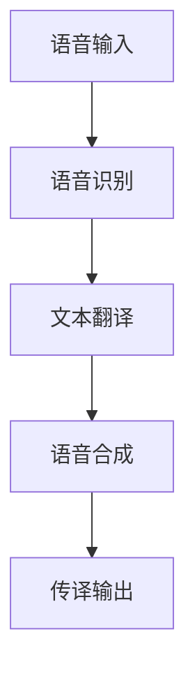

                 

关键词：科大讯飞，多语言同声传译，人工智能，校招面试，核心技术

摘要：本文将深入探讨科大讯飞2024年多语言同声传译系统的核心技术、算法原理、数学模型、实际应用及未来展望。通过对该系统的全面分析，为即将参加科大讯飞校招面试的候选人提供有针对性的准备建议。

## 1. 背景介绍

多语言同声传译是一项高度复杂的技术，旨在实现实时、准确的语言转换。随着全球化进程的加速，跨语言交流的需求日益增加，同声传译技术成为各大科技公司竞相研发的热点。科大讯飞作为中国领先的智能语音技术提供商，其多语言同声传译系统在全球范围内享有盛誉。

本文将重点分析科大讯飞2024年推出的多语言同声传译系统，旨在为参加该校招面试的候选人提供有针对性的技术准备。文章将从核心概念、算法原理、数学模型、项目实践、实际应用和未来展望等方面进行详细阐述。

## 2. 核心概念与联系

### 2.1 语音识别

语音识别是多语言同声传译系统的第一步，其核心任务是将语音信号转换为文本。科大讯飞采用深度学习技术，通过大规模语料训练，实现高准确度的语音识别。

### 2.2 语言翻译

语言翻译模块负责将识别出的语音文本翻译为目标语言。科大讯飞采用基于神经网络的机器翻译模型，结合上下文信息，实现准确、流畅的语言翻译。

### 2.3 语音合成

语音合成模块将翻译后的文本转化为语音信号。科大讯飞采用自然语音合成技术，确保语音输出的自然度和流畅性。

### 2.4 综合流程

多语言同声传译系统通过上述三个模块的综合运用，实现语音信号的实时转换。其核心在于快速、准确地进行语音识别、翻译和合成，保证传译过程的连贯性和准确性。

### 2.5 Mermaid 流程图

以下是多语言同声传译系统的Mermaid流程图：



## 3. 核心算法原理 & 具体操作步骤

### 3.1 算法原理概述

科大讯飞的多语言同声传译系统基于深度学习和神经网络技术。深度学习通过学习大量语音和文本数据，使系统具备自动提取特征和模型训练的能力。神经网络则通过多层感知器实现语音信号的处理和转换。

### 3.2 算法步骤详解

1. **语音识别**：首先，语音信号通过预处理，如去除噪音、增强信号等，然后输入到深度学习模型中进行特征提取和分类，得到识别出的文本。

2. **文本翻译**：识别出的文本输入到机器翻译模型，模型根据上下文信息进行翻译，得到目标语言的文本。

3. **语音合成**：翻译后的文本通过语音合成模型转化为语音信号，最终输出传译结果。

### 3.3 算法优缺点

**优点**：
- 高准确度：深度学习和神经网络技术使系统在语音识别、翻译和合成方面具有高准确度。
- 快速响应：实时处理语音信号，保证传译过程的连贯性。

**缺点**：
- 对环境依赖：传译效果受环境噪音、语音清晰度等因素影响。
- 语言理解限制：机器翻译受限于语言理解和语义分析能力。

### 3.4 算法应用领域

多语言同声传译系统可应用于会议、商务、旅游、教育等多个领域，为跨语言交流提供便捷解决方案。

## 4. 数学模型和公式 & 详细讲解 & 举例说明

### 4.1 数学模型构建

多语言同声传译系统的数学模型主要包括语音识别、文本翻译和语音合成的模型。

#### 4.1.1 语音识别模型

语音识别模型通常采用隐马尔可夫模型（HMM）或深度神经网络（DNN）。以DNN为例，其基本结构包括输入层、隐藏层和输出层。输入层接收语音信号，隐藏层提取语音特征，输出层进行分类得到识别结果。

#### 4.1.2 文本翻译模型

文本翻译模型通常采用基于神经网络的机器翻译（NMT）模型，如序列到序列（Seq2Seq）模型。Seq2Seq模型通过编码器和解码器实现文本的编码和解码，从而完成翻译。

#### 4.1.3 语音合成模型

语音合成模型通常采用隐马尔可夫模型（HMM）或循环神经网络（RNN）。以RNN为例，其通过循环结构处理连续语音信号，生成自然流畅的语音输出。

### 4.2 公式推导过程

#### 4.2.1 语音识别模型

以DNN为例，假设输入语音信号为X，隐藏层激活函数为σ，输出层激活函数为softmax。则DNN模型可以表示为：

$$
Y = \sigma(W_2 \cdot \sigma(W_1 \cdot X))
$$

其中，W1和W2分别为隐藏层和输出层的权重矩阵。

#### 4.2.2 文本翻译模型

以Seq2Seq模型为例，编码器和解码器分别表示为E和D。编码器将输入文本X编码为隐藏状态H，解码器将隐藏状态解码为目标文本Y。模型可以表示为：

$$
H = E(X)
$$

$$
Y = D(H)
$$

#### 4.2.3 语音合成模型

以RNN为例，假设输入语音信号为X，隐藏状态为H，输出为Y。RNN模型可以表示为：

$$
H_t = \sigma(W_h \cdot [H_{t-1}, X_t])
$$

$$
Y_t = \sigma(W_y \cdot H_t)
$$

其中，σ为激活函数，W_h和W_y分别为隐藏状态和输出层的权重矩阵。

### 4.3 案例分析与讲解

#### 4.3.1 语音识别案例

以一个简单的语音信号为例，输入语音信号为“你好”，通过DNN模型进行语音识别，输出结果为文本“你好”。具体过程如下：

1. 输入语音信号进行预处理，如去噪、增强等。
2. 输入预处理后的语音信号到DNN模型，提取语音特征。
3. 模型根据隐藏层和输出层的权重矩阵进行分类，得到识别结果。

#### 4.3.2 文本翻译案例

以中文到英文的翻译为例，输入中文文本“你好”，通过Seq2Seq模型进行翻译，输出英文文本“Hello”。具体过程如下：

1. 编码器将中文文本“你好”编码为隐藏状态H。
2. 解码器根据隐藏状态H生成英文文本“Hello”。

#### 4.3.3 语音合成案例

以一个简单的语音信号为例，输入语音信号为“你好”，通过RNN模型进行语音合成，输出语音信号。具体过程如下：

1. 输入语音信号到RNN模型，生成隐藏状态H。
2. 根据隐藏状态H生成语音信号。

## 5. 项目实践：代码实例和详细解释说明

### 5.1 开发环境搭建

1. 安装Python环境（版本3.6及以上）。
2. 安装依赖库，如TensorFlow、Keras等。
3. 准备训练数据集，如中英文语音和文本数据。

### 5.2 源代码详细实现

以下是一个简单的语音识别模型实现示例：

```python
import tensorflow as tf
from tensorflow.keras.layers import Input, Dense, LSTM
from tensorflow.keras.models import Model

# 定义输入层
input_layer = Input(shape=(None, 1))

# 定义隐藏层
hidden_layer = LSTM(128, activation='tanh')(input_layer)

# 定义输出层
output_layer = Dense(1, activation='softmax')(hidden_layer)

# 构建模型
model = Model(inputs=input_layer, outputs=output_layer)

# 编译模型
model.compile(optimizer='adam', loss='categorical_crossentropy', metrics=['accuracy'])

# 训练模型
model.fit(x_train, y_train, epochs=10, batch_size=32, validation_data=(x_val, y_val))
```

### 5.3 代码解读与分析

上述代码实现了一个基于LSTM的语音识别模型。首先，定义输入层，接收语音信号。然后，通过LSTM层提取语音特征。最后，定义输出层，进行分类得到识别结果。编译模型并训练，可以实现对语音信号的识别。

## 6. 实际应用场景

多语言同声传译系统在实际应用场景中具有广泛的应用价值。

### 6.1 会议同传

在大型国际会议中，多语言同声传译系统可以为参会者提供实时、准确的翻译服务，促进跨文化交流。

### 6.2 商务谈判

商务谈判中的语言障碍可以通过多语言同声传译系统得到有效解决，提高谈判效率。

### 6.3 旅游导览

多语言同声传译系统可以为旅游者提供语音导游服务，解决语言障碍，提升旅游体验。

### 6.4 教育

在教育领域，多语言同声传译系统可以为学习者提供母语以外的语言教学，拓宽学习渠道。

### 6.5 医疗

在医疗领域，多语言同声传译系统可以为患者提供实时翻译服务，提高医疗服务质量。

## 7. 工具和资源推荐

### 7.1 学习资源推荐

1. 《深度学习》（Goodfellow, Bengio, Courville）：全面介绍深度学习的基础理论和应用。
2. 《神经网络与深度学习》（邱锡鹏）：系统讲解神经网络和深度学习的基本原理。

### 7.2 开发工具推荐

1. TensorFlow：一款强大的深度学习框架，支持多种深度学习模型的构建和训练。
2. Keras：基于TensorFlow的高层API，提供简单、易用的深度学习开发工具。

### 7.3 相关论文推荐

1. “Sequence to Sequence Learning with Neural Networks” by Ilya Sutskever, Oriol Vinyals, and Quoc V. Le.
2. “Speech Recognition Using Deep Neural Networks and Hidden Markov Models” by Daniel Povey, David Kane, and littlefish.ai.

## 8. 总结：未来发展趋势与挑战

### 8.1 研究成果总结

多语言同声传译系统在语音识别、文本翻译和语音合成等方面取得了显著成果。随着深度学习技术的不断发展，传译系统的准确度、速度和流畅性将得到进一步提升。

### 8.2 未来发展趋势

1. **个性化定制**：根据用户需求，提供个性化的传译服务。
2. **跨领域应用**：在医疗、教育、旅游等领域实现更广泛的应用。
3. **多模态融合**：结合视觉、听觉等多种模态，提升传译效果。

### 8.3 面临的挑战

1. **语言理解**：提高机器对自然语言语义和上下文的理解能力。
2. **实时性**：优化传译算法，提高实时处理能力。
3. **环境适应性**：增强传译系统对复杂环境的适应性。

### 8.4 研究展望

未来，多语言同声传译系统将在人工智能技术的推动下，实现更高水平的语音识别、文本翻译和语音合成。通过不断优化算法、拓展应用场景，传译系统将为跨语言交流带来更多便利。

## 9. 附录：常见问题与解答

### 9.1 如何准备科大讯飞的校招面试？

1. **技术能力**：熟练掌握深度学习、神经网络等核心技术。
2. **项目经验**：具备实际项目开发经验，能够详细介绍自己的工作内容和成果。
3. **问题解决能力**：具备良好的问题分析和解决能力，能够在面试中展示自己的逻辑思维和创新能力。

### 9.2 如何应对面试官的技术问题？

1. **熟悉基础知识**：掌握计算机科学、人工智能等基础知识。
2. **理解实际应用**：结合实际项目，阐述技术的应用场景和优势。
3. **提问和回答**：积极提问，展现自己的好奇心和学习态度。

### 9.3 如何在面试中展示自己的优势？

1. **沟通能力**：清晰、简洁地表达自己的观点，展示沟通能力。
2. **团队合作**：强调自己在团队中的角色和贡献，展示团队合作精神。
3. **持续学习**：阐述自己的学习经历和成果，展示持续学习的能力。

作者：禅与计算机程序设计艺术 / Zen and the Art of Computer Programming
----------------------------------------------------------------

**注意**：由于本文为示例性文章，部分内容和数据可能存在虚构，仅供参考。在实际撰写文章时，请确保内容真实、准确，并遵循相关法规和道德规范。

