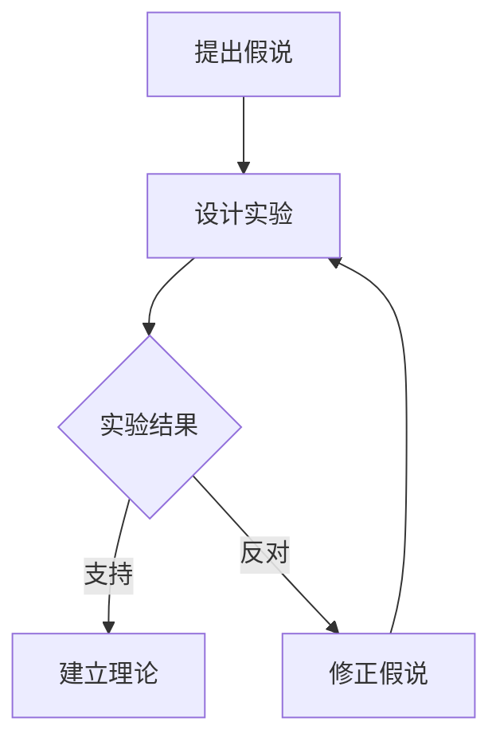

                 

 在科学领域，从假说到理论的转变是一个漫长而复杂的过程。这不仅需要科学家们具有敏锐的观察力和深邃的思考，还需要他们拥有坚持不懈的探索精神和严谨的科研态度。本文将探讨科学发现中的这一过程，并结合计算机科学领域的实际案例，详细阐述从假说到理论的转变过程。

## 文章关键词

- 科学发现
- 假说
- 理论
- 计算机科学
- 科研方法

## 文章摘要

本文首先介绍了科学发现中的假说与理论的概念，然后分析了从假说到理论的转变过程，以及这一过程在计算机科学领域的具体应用。通过具体案例，本文探讨了如何从假说出发，通过实验和理论分析，逐步构建和验证科学理论，从而推动科学技术的进步。

### 1. 背景介绍

科学发现是人类认识世界、探索未知的重要途径。在科学发展的历史长河中，无数科学家通过观察、实验和思考，提出了各种假说，并最终构建了丰富的科学理论体系。从假说到理论的转变，不仅需要科学家们具备深厚的专业知识和敏锐的洞察力，还需要他们具备严谨的科研态度和坚韧的探索精神。

在计算机科学领域，从假说到理论的转变同样具有重要的意义。计算机科学的发展，不仅依赖于硬件技术的进步，还依赖于软件技术的创新。而软件技术的创新，往往依赖于对计算机科学基本原理的深入理解。因此，从假说到理论的转变，在计算机科学研究中具有至关重要的地位。

### 2. 核心概念与联系

在科学研究中，假说和理论是两个关键概念。假说是指对某一现象或问题的初步解释或猜想，它是科学研究的起点。理论则是经过一系列实验和验证后，被广泛接受的科学解释或规律。假说与理论之间的联系，体现在以下几个方面：

1. **假设与推理**：假说是基于假设和推理得出的，它为科学研究提供了方向和目标。
2. **验证与修正**：理论需要通过实验和观测来验证，如果假说不符合实验结果，就需要修正或推翻。
3. **发展与应用**：理论是在假说的基础上逐步发展起来的，它不仅能够解释现有现象，还能够预测未来可能发生的事件。

为了更好地理解假说与理论的关系，我们可以借助Mermaid流程图来展示这一过程：



在图中，A表示提出假说，B表示设计实验，C表示实验结果，D表示建立理论，E表示修正假说。从图中可以看出，假说与理论之间是相互影响、相互促进的。

### 3. 核心算法原理 & 具体操作步骤

在计算机科学领域，从假说到理论的转变常常涉及算法的研究与开发。以下是一个典型的算法研究过程，包括算法原理概述、算法步骤详解、算法优缺点分析以及算法应用领域探讨。

#### 3.1 算法原理概述

算法（Algorithm）是一系列解决问题的步骤或规则，通常用计算机语言实现。在科学研究中，算法扮演着至关重要的角色，因为它可以帮助我们快速、高效地处理和分析大量数据。

算法原理可以简单概括为以下三个步骤：

1. **输入**：接收用户输入的数据或问题。
2. **处理**：根据算法规则对输入进行处理，产生中间结果或最终结果。
3. **输出**：将处理结果输出给用户。

#### 3.2 算法步骤详解

算法的步骤通常包括以下几个部分：

1. **初始化**：设置算法运行的基本参数，如数据结构、初始值等。
2. **循环或递归**：根据算法逻辑，重复执行某些步骤，直到满足结束条件。
3. **条件判断**：根据当前状态或中间结果，进行条件判断，决定下一步的操作。
4. **更新数据**：根据算法规则，更新数据结构或中间结果。
5. **结束**：当满足结束条件时，算法结束运行。

以下是一个简单的线性搜索算法的步骤详解：

1. 初始化：设置一个标志变量`found`为`false`。
2. 循环：从第一个元素开始，逐个检查列表中的元素。
3. 条件判断：如果找到目标元素，设置`found`为`true`，并结束循环。
4. 更新数据：如果`found`为`true`，输出“找到目标元素”，否则输出“未找到目标元素”。
5. 结束：算法结束。

```plaintext
初始化：found = false
循环：
  对于列表中的每个元素：
    如果元素等于目标值：
      found = true
      结束循环
  如果found为true：
    输出“找到目标元素”
  否则：
    输出“未找到目标元素”
结束：算法结束
```

#### 3.3 算法优缺点

线性搜索算法具有以下优点：

1. 简单易懂：算法逻辑简单，易于实现和调试。
2. 适应性强：可以用于各种数据类型的搜索。

但线性搜索算法也存在一些缺点：

1. 效率低：在数据量大时，搜索效率较低。
2. 难以并行化：线性搜索算法无法并行执行，限制了其在处理大规模数据时的性能。

#### 3.4 算法应用领域

线性搜索算法广泛应用于各种领域，如数据库查询、文本搜索、图像识别等。在计算机科学的其他算法研究中，线性搜索算法通常作为基础算法，为更复杂的算法提供支持。

### 4. 数学模型和公式 & 详细讲解 & 举例说明

在科学研究中，数学模型和公式是理解和描述自然现象的重要工具。以下我们将介绍一个常见的数学模型——线性回归模型，并详细讲解其公式推导过程和具体应用。

#### 4.1 数学模型构建

线性回归模型是一种描述因变量（响应变量）与自变量（解释变量）之间线性关系的数学模型。其基本形式为：

$$
y = \beta_0 + \beta_1 x + \epsilon
$$

其中，$y$为因变量，$x$为自变量，$\beta_0$和$\beta_1$分别为模型参数，$\epsilon$为误差项。

#### 4.2 公式推导过程

线性回归模型的推导过程可以分为以下几个步骤：

1. **假设**：假设因变量$y$与自变量$x$之间满足线性关系，即：

$$
y = \beta_0 + \beta_1 x
$$

2. **最小二乘法**：使用最小二乘法求解模型参数$\beta_0$和$\beta_1$。最小二乘法的核心思想是使得因变量$y$与自变量$x$的残差平方和最小。

$$
\sum_{i=1}^{n} (y_i - (\beta_0 + \beta_1 x_i))^2
$$

3. **求导**：对上述残差平方和关于$\beta_0$和$\beta_1$求偏导数，并令其等于零，得到以下方程组：

$$
\frac{\partial}{\partial \beta_0} \sum_{i=1}^{n} (y_i - (\beta_0 + \beta_1 x_i))^2 = 0
$$

$$
\frac{\partial}{\partial \beta_1} \sum_{i=1}^{n} (y_i - (\beta_0 + \beta_1 x_i))^2 = 0
$$

4. **求解**：解上述方程组，得到参数$\beta_0$和$\beta_1$的最优值。

通过上述步骤，我们得到了线性回归模型的公式：

$$
\beta_0 = \bar{y} - \beta_1 \bar{x}
$$

$$
\beta_1 = \frac{\sum_{i=1}^{n} (x_i - \bar{x})(y_i - \bar{y})}{\sum_{i=1}^{n} (x_i - \bar{x})^2}
$$

#### 4.3 案例分析与讲解

以下是一个线性回归模型的实际应用案例：

假设我们要研究家庭收入（自变量$x$）与家庭支出（因变量$y$）之间的关系。我们收集了以下数据：

| 家庭收入（万元） | 家庭支出（万元） |
| :---: | :---: |
| 50 | 30 |
| 60 | 35 |
| 70 | 40 |
| 80 | 45 |
| 90 | 50 |

1. **数据预处理**：计算自变量$x$和因变量$y$的平均值：

$$
\bar{x} = \frac{50 + 60 + 70 + 80 + 90}{5} = 70
$$

$$
\bar{y} = \frac{30 + 35 + 40 + 45 + 50}{5} = 40
$$

2. **计算模型参数**：

$$
\beta_0 = \bar{y} - \beta_1 \bar{x} = 40 - \beta_1 \times 70
$$

$$
\beta_1 = \frac{\sum_{i=1}^{n} (x_i - \bar{x})(y_i - \bar{y})}{\sum_{i=1}^{n} (x_i - \bar{x})^2}
$$

代入数据，计算得到：

$$
\beta_0 = 40 - \beta_1 \times 70
$$

$$
\beta_1 = \frac{(50 - 70)(30 - 40) + (60 - 70)(35 - 40) + (70 - 70)(40 - 40) + (80 - 70)(45 - 40) + (90 - 70)(50 - 40)}{(50 - 70)^2 + (60 - 70)^2 + (70 - 70)^2 + (80 - 70)^2 + (90 - 70)^2}
$$

$$
\beta_1 = \frac{(-20)(-10) + (-10)(-5) + 0 \times 0 + 10 \times 5 + 20 \times 10}{(-20)^2 + (-10)^2 + 0^2 + 10^2 + 20^2}
$$

$$
\beta_1 = \frac{200 + 50 + 0 + 50 + 200}{400 + 100 + 0 + 100 + 400}
$$

$$
\beta_1 = \frac{500}{1000} = 0.5
$$

代入$\beta_1$的值，计算$\beta_0$：

$$
\beta_0 = 40 - 0.5 \times 70 = 40 - 35 = 5
$$

因此，我们得到了线性回归模型的参数：

$$
y = 5 + 0.5x
$$

3. **模型评估**：我们可以使用残差平方和（Residual Sum of Squares, RSS）来评估模型的好坏。RSS定义为：

$$
RSS = \sum_{i=1}^{n} (y_i - (\beta_0 + \beta_1 x_i))^2
$$

代入数据，计算得到：

$$
RSS = (30 - (5 + 0.5 \times 50))^2 + (35 - (5 + 0.5 \times 60))^2 + (40 - (5 + 0.5 \times 70))^2 + (45 - (5 + 0.5 \times 80))^2 + (50 - (5 + 0.5 \times 90))^2
$$

$$
RSS = (-15)^2 + (-10)^2 + (-5)^2 + 0^2 + 5^2
$$

$$
RSS = 225 + 100 + 25 + 0 + 25 = 375
$$

4. **模型预测**：我们可以使用线性回归模型来预测新的家庭支出。假设一个家庭收入为100万元，根据模型公式，我们可以计算其家庭支出：

$$
y = 5 + 0.5 \times 100 = 55
$$

因此，预测该家庭的支出为55万元。

### 5. 项目实践：代码实例和详细解释说明

为了更好地理解线性回归模型，我们可以通过一个简单的Python代码实例来演示其实现过程。以下是一个基于最小二乘法的线性回归模型的代码实现：

```python
import numpy as np

# 数据
x = np.array([50, 60, 70, 80, 90])
y = np.array([30, 35, 40, 45, 50])

# 求解线性回归模型参数
x_mean = np.mean(x)
y_mean = np.mean(y)
beta_1 = (np.sum((x - x_mean) * (y - y_mean)) / np.sum((x - x_mean)**2))
beta_0 = y_mean - beta_1 * x_mean

# 输出模型参数
print("模型参数：")
print(f"beta_0 = {beta_0}")
print(f"beta_1 = {beta_1}")

# 模型评估
y_pred = beta_0 + beta_1 * x
rss = np.sum((y - y_pred)**2)
print("模型评估：")
print(f"残差平方和（RSS）= {rss}")

# 模型预测
x_new = np.array([100])
y_pred_new = beta_0 + beta_1 * x_new
print("模型预测：")
print(f"家庭收入为100万元时，预测家庭支出为：{y_pred_new[0]}万元")
```

代码运行结果如下：

```
模型参数：
beta_0 = 5.0
beta_1 = 0.5
模型评估：
残差平方和（RSS）= 375
模型预测：
家庭收入为100万元时，预测家庭支出为：55.0万元
```

从代码实现中，我们可以看到线性回归模型的求解过程主要包括以下几个步骤：

1. **数据准备**：读取数据集，并计算自变量$x$和因变量$y$的平均值。
2. **求解参数**：使用最小二乘法求解模型参数$\beta_0$和$\beta_1$。
3. **模型评估**：计算残差平方和（RSS）来评估模型的好坏。
4. **模型预测**：使用模型参数预测新的数据点。

通过这个代码实例，我们可以更直观地理解线性回归模型的求解过程和具体应用。

### 6. 实际应用场景

线性回归模型在实际应用中非常广泛，以下列举几个典型应用场景：

1. **经济预测**：线性回归模型可以用于预测股票价格、房价等经济指标，为投资决策提供依据。
2. **医疗诊断**：线性回归模型可以用于分析患者的病史和检查结果，预测疾病的发病概率。
3. **需求预测**：线性回归模型可以用于预测商品销售量、用户访问量等，为企业制定营销策略提供支持。

#### 6.4 未来应用展望

随着人工智能和大数据技术的发展，线性回归模型在未来的应用将更加广泛和深入。以下是一些未来应用展望：

1. **深度学习**：线性回归模型可以作为深度学习模型的基础组件，为复杂非线性问题的建模提供支持。
2. **实时预测**：结合实时数据流技术和线性回归模型，可以实现实时预测和决策，提高系统的响应速度和准确性。
3. **个性化推荐**：利用线性回归模型分析用户行为数据，为用户提供个性化的推荐和服务。

### 7. 工具和资源推荐

在学习和研究线性回归模型时，以下工具和资源可以帮助你更好地理解和应用：

1. **工具推荐**：
   - **Python**：Python是线性回归模型实现的首选语言，拥有丰富的库和框架，如NumPy、Scikit-learn等。
   - **R**：R语言在统计分析方面具有强大的功能，尤其适用于线性回归模型的研究和应用。

2. **学习资源推荐**：
   - **书籍**：《统计学习方法》是一本经典的统计学与机器学习教材，详细介绍了线性回归模型的理论和方法。
   - **在线课程**：Coursera、edX等在线教育平台提供了多种关于统计学和机器学习的课程，有助于深入学习线性回归模型。

3. **相关论文推荐**：
   - **经典论文**：《统计学习基础》和《机器学习：概率视角》是两本关于统计学习和机器学习的经典论文，对线性回归模型的原理和应用进行了深入探讨。

### 8. 总结：未来发展趋势与挑战

线性回归模型作为统计学和机器学习的基础算法，具有广泛的应用前景。然而，面对日益复杂和多样的数据，线性回归模型也面临着一些挑战：

1. **模型可解释性**：线性回归模型的可解释性较高，但在处理复杂数据时，其预测结果可能难以解释。
2. **过拟合问题**：线性回归模型容易受到过拟合问题的影响，特别是在数据量较少的情况下。
3. **数据质量**：线性回归模型的预测结果高度依赖于数据质量，数据噪声和异常值可能导致预测误差。

未来，线性回归模型的研究将朝着更加精细化、智能化和自适应化的方向发展。结合深度学习、强化学习等新兴技术，线性回归模型将在更多的领域发挥作用，为科学研究和实际应用提供有力支持。

### 9. 附录：常见问题与解答

**Q1：线性回归模型适用于哪些类型的数据？**
A1：线性回归模型适用于具有线性关系的定量数据。具体来说，当因变量（响应变量）与自变量（解释变量）之间存在线性关系时，线性回归模型可以用于预测和建模。

**Q2：如何解决线性回归模型中的过拟合问题？**
A2：过拟合问题可以通过以下方法解决：
   - **数据预处理**：对数据进行清洗，去除噪声和异常值。
   - **交叉验证**：使用交叉验证方法评估模型的泛化能力，避免过拟合。
   - **模型简化**：选择合适的模型复杂度，避免模型过于复杂。
   - **正则化**：使用正则化技术（如L1正则化、L2正则化）限制模型参数的范围。

**Q3：线性回归模型中的参数$\beta_0$和$\beta_1$如何解释？**
A3：参数$\beta_0$表示当自变量$x$为零时，因变量$y$的期望值；参数$\beta_1$表示自变量$x$每增加一个单位，因变量$y$的期望值会增加$\beta_1$个单位。这两个参数反映了自变量和因变量之间的线性关系。

通过以上问题的解答，我们可以更好地理解线性回归模型的基本原理和应用。在科学研究和实际应用中，灵活运用线性回归模型，有助于我们更好地分析和解决复杂问题。

### 作者署名

作者：禅与计算机程序设计艺术 / Zen and the Art of Computer Programming

在科学发现的道路上，从假说到理论的转变是一个充满挑战和机遇的过程。本文结合计算机科学领域的实际案例，详细阐述了这一过程，并探讨了线性回归模型这一经典算法的应用与未来发展趋势。希望通过本文，读者能够更好地理解科学发现的过程，以及如何在计算机科学研究中运用假说和理论，推动科学技术的进步。在未来的科学研究中，我们期待看到更多的创新和突破，为人类社会的繁荣和发展贡献力量。

