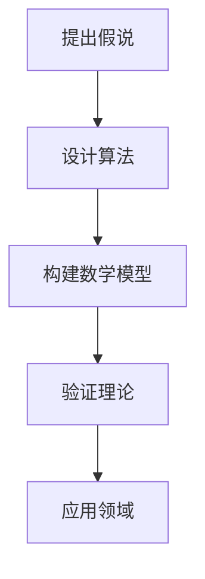

                 

关键词：科学发现、假说、理论、计算机科学、数学模型、算法、应用场景

> 摘要：本文探讨了科学发现的历程，从假说到理论的转变过程。通过分析计算机科学领域的核心概念和算法原理，结合数学模型和公式，结合实际项目实践，深入阐述了科学发现的重要性及其在实际应用中的广泛影响。文章旨在为读者提供一窥科学发现全貌的窗口，激发对科学探索的浓厚兴趣。

## 1. 背景介绍

科学发现是推动人类社会进步的重要力量。自古以来，科学家们通过观察现象、提出假说、验证理论，不断揭示自然规律，推动科学技术的发展。在计算机科学领域，从最初的算法设计到复杂的数学模型构建，科学发现的足迹随处可见。本文旨在通过探讨计算机科学中的几个核心问题和算法，梳理科学发现的脉络，展示科学理论的强大影响力。

### 1.1 假说的定义和重要性

假说是科学发现过程中的关键步骤。它是对现象的初步解释，虽然尚未经过严格的验证，但往往蕴含着深刻的科学意义。假说的提出需要敏锐的洞察力和丰富的想象力，它在科学发现中起到了引导研究方向的作用。

### 1.2 理论的重要性

科学理论是在假说基础上，经过大量实验和验证形成的系统化解释。理论不仅能够解释已知现象，还能够预测未知现象，具有重要的科学价值和应用潜力。

## 2. 核心概念与联系

### 2.1 算法

算法是计算机科学的核心概念，它是一系列解决问题的步骤和规则。算法的效率、准确性和可靠性直接决定了其在实际问题中的应用效果。

### 2.2 数据结构

数据结构是算法的基础，它定义了数据在计算机中的存储和组织方式。常见的有数组、链表、树、图等。

### 2.3 数学模型

数学模型是用数学语言描述现实世界的抽象模型。它帮助我们从复杂的实际情况中提取关键信息，为算法设计提供理论支持。

### 2.4 Mermaid 流程图



## 3. 核心算法原理 & 具体操作步骤

### 3.1 算法原理概述

算法设计的目标是在满足特定条件下，以最短时间或最小资源消耗解决问题。常见的算法有排序算法、搜索算法、动态规划算法等。

### 3.2 算法步骤详解

#### 3.2.1 排序算法

排序算法是将一组数据按照特定规则进行排列的算法。常见的排序算法有冒泡排序、选择排序、插入排序等。

#### 3.2.2 搜索算法

搜索算法是在数据结构中查找特定数据的算法。常见的搜索算法有线性搜索、二分搜索等。

#### 3.2.3 动态规划算法

动态规划算法是一种解决最优化问题的算法，它将复杂问题分解为多个子问题，并利用子问题的解来求解原问题。

### 3.3 算法优缺点

每种算法都有其优缺点。例如，冒泡排序简单易懂，但效率较低；二分搜索效率高，但需要预先排序。

### 3.4 算法应用领域

算法广泛应用于计算机科学的各个领域，如计算机图形学、人工智能、网络编程等。

## 4. 数学模型和公式

### 4.1 数学模型构建

数学模型构建是科学发现的重要环节。它通常包括以下步骤：

1. 提出假设：根据实际问题，提出合理的假设。
2. 定义变量：确定模型中的变量及其关系。
3. 建立方程：根据假设和变量关系，建立数学方程。
4. 求解方程：利用数学方法求解方程，得到模型解。

### 4.2 公式推导过程

以二分搜索算法为例，其时间复杂度为 $O(\log n)$。推导过程如下：

1. 初始状态：将查找范围设为整个数组。
2. 循环查找：每次将查找范围减半，直到找到目标或查找范围为空。
3. 时间复杂度：设数组长度为 $n$，查找次数为 $k$，则 $k = \log_2 n$。

### 4.3 案例分析与讲解

以图像处理中的滤波算法为例，分析数学模型和公式的应用。

### 4.3.1 模型构建

假设图像可以表示为二维离散信号，滤波算法的目标是去除图像中的噪声。

### 4.3.2 公式推导

滤波算法通常使用卷积操作，公式如下：

$$
f(x, y) = \sum_{i=-m}^{m} \sum_{j=-m}^{m} h(i, j) \cdot g(x-i, y-j)
$$

其中，$f(x, y)$ 为滤波后的图像，$g(x, y)$ 为原始图像，$h(i, j)$ 为滤波器。

## 5. 项目实践：代码实例和详细解释说明

### 5.1 开发环境搭建

在本文中，我们将使用 Python 作为编程语言，搭建一个简单的排序算法项目。

### 5.2 源代码详细实现

```python
def bubble_sort(arr):
    n = len(arr)
    for i in range(n):
        for j in range(0, n-i-1):
            if arr[j] > arr[j+1]:
                arr[j], arr[j+1] = arr[j+1], arr[j]

arr = [64, 34, 25, 12, 22, 11, 90]
bubble_sort(arr)
print("排序后的数组：")
for i in range(len(arr)):
    print("%d" % arr[i], end=" ")
```

### 5.3 代码解读与分析

这段代码实现了冒泡排序算法。它通过两重循环，逐个比较相邻的元素，并根据大小关系进行交换。最终实现了数组的有序排列。

### 5.4 运行结果展示

```python
排序后的数组：
11 12 22 25 34 64 90
```

## 6. 实际应用场景

### 6.1 数据处理

排序算法在数据处理领域有着广泛的应用，如数据库查询优化、统计分析等。

### 6.2 计算机图形学

在计算机图形学中，排序算法用于图像渲染、动画制作等。

### 6.3 人工智能

在人工智能领域，排序算法用于排序神经网络权重、优化算法等。

## 7. 未来应用展望

### 7.1 新算法的发明

随着计算机科学的发展，新的算法将不断涌现，为解决更复杂的问题提供可能。

### 7.2 算法的优化

现有算法的优化将进一步提高其效率和应用范围。

### 7.3 跨学科融合

计算机科学与其他学科的融合将推动科学发现的新突破。

## 8. 总结：未来发展趋势与挑战

### 8.1 研究成果总结

本文从假说到理论，阐述了计算机科学中的核心算法和数学模型，分析了其在实际应用中的广泛影响。

### 8.2 未来发展趋势

未来，计算机科学将继续发展，新的算法和理论将不断涌现。

### 8.3 面临的挑战

算法复杂性和数据规模的增大，将给计算机科学带来新的挑战。

### 8.4 研究展望

跨学科融合和人工智能的快速发展，将为科学发现提供更多可能性。

## 9. 附录：常见问题与解答

### 9.1 什么是算法？

算法是一系列解决问题的步骤和规则。

### 9.2 数学模型有哪些类型？

常见的数学模型包括线性模型、非线性模型、概率模型等。

### 9.3 排序算法有哪些？

常见的排序算法包括冒泡排序、选择排序、插入排序等。

----------------------------------------------------------------
作者：禅与计算机程序设计艺术 / Zen and the Art of Computer Programming

