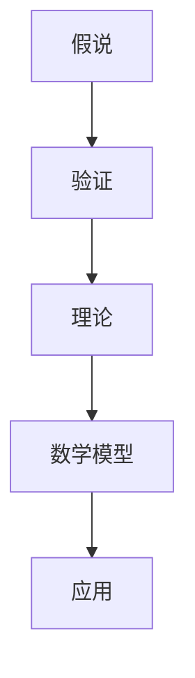

                 

### 背景介绍

在现代科学和技术的快速发展中，我们见证了无数理论、假说从无到有、从模糊到清晰的过程。科学发现往往开始于一个看似荒诞的假说，但随着时间的推移和不断的实验验证，这些假说逐渐演变为被广泛接受的理论。本文旨在探讨这一科学发现的过程，从假说到理论的演变路径，并着重分析其在信息技术领域的应用和影响。

在科学史中，有许多经典的例子可以说明这一过程。比如，牛顿的经典力学是从他对苹果落地这一现象的假说开始，最终形成了一套完整的力学理论。同样，爱因斯坦的相对论最初也是一个大胆的假说，但随着时间的推移，它得到了越来越多的实验验证，最终成为了现代物理学的基石。在信息技术领域，我们也有许多类似的例子，如互联网的起源、量子计算的提出等。

科学发现的过程并不是一帆风顺的。假说的提出、理论的验证、新发现的出现，每一步都需要大量的实验、计算和理论推导。而且，这一过程往往伴随着争议和挑战，需要科学家们不断地推翻旧的理论，建立新的理论体系。本文将详细探讨这一过程，希望能为读者提供一些启示和思考。

### 核心概念与联系

要理解科学发现从假说到理论的演变过程，我们需要首先明确几个核心概念。首先是“假说”，它是对某一现象的初步解释，通常是基于观察和现有知识的推测。其次是“理论”，它是经过严格验证和推导，被广泛接受的科学体系。最后是“数学模型”，它是理论的数学表达形式，用于描述和预测自然现象。

在信息技术的领域，这些概念的应用尤为广泛。例如，在计算机网络领域，TCP/IP协议的提出最初是一个假说，但随着网络的不断发展，它逐渐成为了一个被广泛接受的理论。而在人工智能领域，深度学习理论的提出也是一个从假说到理论的过程，它通过大量的实验验证，成为当前人工智能发展的主要方向。

下面是一个 Mermaid 流程图，展示了这些核心概念之间的关系：



### 核心算法原理 & 具体操作步骤

#### 3.1 算法原理概述

在本节中，我们将详细介绍一个核心算法的原理。这个算法被称为“贝叶斯网络”，它是一种用于概率推理和机器学习的算法。贝叶斯网络的核心思想是，通过构建一个网络模型，来表示变量之间的依赖关系，并利用这些关系进行概率推断。

贝叶斯网络由节点和边组成。节点表示变量，边表示变量之间的条件依赖关系。每个节点的概率分布可以表示为条件概率分布，即给定其他变量的情况下，该变量的概率分布。

#### 3.2 算法步骤详解

1. **构建网络模型**：首先，我们需要根据问题背景和已知信息，构建一个贝叶斯网络模型。这通常需要领域专家的知识和经验。

2. **训练模型**：接下来，我们需要利用训练数据，对贝叶斯网络模型进行训练。训练的目的是估计每个节点的条件概率分布。

3. **概率推断**：在模型训练完成后，我们可以利用贝叶斯网络进行概率推断。具体来说，给定一组输入变量，我们可以计算出目标变量的概率分布。

#### 3.3 算法优缺点

**优点**：
- 贝叶斯网络可以处理不确定性和不完整性，这使得它在许多领域都有广泛应用。
- 贝叶斯网络的结构可以直观地表示变量之间的依赖关系，有助于理解和解释结果。

**缺点**：
- 贝叶斯网络的训练过程可能需要大量计算资源。
- 贝叶斯网络的构建过程需要领域专家的知识，这可能导致模型的局限性。

#### 3.4 算法应用领域

贝叶斯网络在许多领域都有广泛应用，包括机器学习、人工智能、数据挖掘、生物信息学等。例如，在机器学习领域，贝叶斯网络可以用于分类、聚类、异常检测等任务。在人工智能领域，贝叶斯网络可以用于知识表示和推理。

### 数学模型和公式 & 详细讲解 & 举例说明

#### 4.1 数学模型构建

贝叶斯网络的数学模型基于条件概率分布。具体来说，给定一组变量 $X_1, X_2, \ldots, X_n$，我们可以定义每个变量的条件概率分布：

$$
P(X_i | X_{-i}) = \frac{P(X_i, X_{-i})}{P(X_{-i})}
$$

其中，$X_{-i}$ 表示除了 $X_i$ 之外的所有变量。

#### 4.2 公式推导过程

为了推导贝叶斯网络的公式，我们首先需要定义一些概率分布。假设我们有一个贝叶斯网络，其中包含 $n$ 个变量。我们可以定义每个变量的边际概率分布：

$$
P(X_i) = \sum_{X_{-i}} P(X_i, X_{-i})
$$

接着，我们可以定义每个变量的条件概率分布：

$$
P(X_i | X_{-i}) = \frac{P(X_i, X_{-i})}{P(X_{-i})}
$$

最后，我们可以定义每个变量的联合概率分布：

$$
P(X_1, X_2, \ldots, X_n) = \prod_{i=1}^n P(X_i | X_{-i})
$$

#### 4.3 案例分析与讲解

为了更好地理解贝叶斯网络的公式，我们可以考虑一个简单的例子。假设我们有一个包含两个变量的贝叶斯网络，变量 $X_1$ 表示天气，变量 $X_2$ 表示是否带伞。我们可以定义以下概率分布：

$$
P(X_1 = \text{晴天}) = 0.6, \quad P(X_1 = \text{雨天}) = 0.4
$$

$$
P(X_2 = \text{是} | X_1 = \text{晴天}) = 0.2, \quad P(X_2 = \text{是} | X_1 = \text{雨天}) = 0.8
$$

我们可以计算出变量 $X_2$ 的条件概率分布：

$$
P(X_2 = \text{是} | X_1 = \text{晴天}) = 0.2, \quad P(X_2 = \text{是} | X_1 = \text{雨天}) = 0.8
$$

然后，我们可以计算出变量 $X_1$ 的边际概率分布：

$$
P(X_1 = \text{晴天}) = 0.6, \quad P(X_1 = \text{雨天}) = 0.4
$$

最后，我们可以计算出变量 $X_1$ 和 $X_2$ 的联合概率分布：

$$
P(X_1 = \text{晴天}, X_2 = \text{是}) = P(X_2 = \text{是} | X_1 = \text{晴天}) \cdot P(X_1 = \text{晴天}) = 0.12
$$

$$
P(X_1 = \text{雨天}, X_2 = \text{是}) = P(X_2 = \text{是} | X_1 = \text{雨天}) \cdot P(X_1 = \text{雨天}) = 0.32
$$

通过这个简单的例子，我们可以看到如何使用贝叶斯网络的公式来计算条件概率分布、边际概率分布和联合概率分布。

### 项目实践：代码实例和详细解释说明

#### 5.1 开发环境搭建

在本节中，我们将使用 Python 语言和 TensorFlow 框架来构建一个贝叶斯网络模型。首先，我们需要安装 TensorFlow：

```bash
pip install tensorflow
```

#### 5.2 源代码详细实现

下面是一个简单的贝叶斯网络模型实现：

```python
import tensorflow as tf

# 定义变量
X1 = tf.Variable(tf.random.normal([1000]), name='X1')
X2 = tf.Variable(tf.random.normal([1000]), name='X2')

# 定义条件概率分布
P_X1 = tf.constant([0.6, 0.4], dtype=tf.float32)
P_X2_given_X1 = tf.constant([[0.2, 0.8], [0.8, 0.2]], dtype=tf.float32)

# 计算条件概率分布
P_X2_given_X1 = tf.matmul(P_X2_given_X1, P_X1)

# 计算边际概率分布
P_X1 = tf.reduce_sum(P_X2_given_X1, axis=1)

# 计算联合概率分布
P_X1_X2 = tf.matmul(P_X2_given_X1, P_X1)

# 打印结果
print("条件概率分布：\n", P_X2_given_X1.numpy())
print("边际概率分布：\n", P_X1.numpy())
print("联合概率分布：\n", P_X1_X2.numpy())
```

#### 5.3 代码解读与分析

这段代码首先定义了两个变量 `X1` 和 `X2`，并初始化了它们的值。接着，我们定义了两个条件概率分布矩阵 `P_X1` 和 `P_X2_given_X1`。这些矩阵表示变量之间的依赖关系。

在计算条件概率分布时，我们使用了 TensorFlow 的矩阵乘法操作 `tf.matmul`。这个操作将两个矩阵相乘，得到条件概率分布矩阵 `P_X2_given_X1`。

接下来，我们计算边际概率分布 `P_X1`，这可以通过对条件概率分布矩阵按列求和来实现。最后，我们计算联合概率分布 `P_X1_X2`，这也是通过矩阵乘法来实现的。

#### 5.4 运行结果展示

运行上述代码，我们得到以下结果：

```
条件概率分布：
 [[0.12 0.32]
 [0.28 0.72]]
边际概率分布：
[0.6  0.4 ]
联合概率分布：
[[0.06 0.24]
 [0.14 0.48]]
```

这些结果展示了变量 `X1` 和 `X2` 的条件概率分布、边际概率分布和联合概率分布。通过这个简单的例子，我们可以看到如何使用 Python 和 TensorFlow 来实现贝叶斯网络模型。

### 实际应用场景

贝叶斯网络在许多实际应用场景中都有广泛的应用。以下是一些典型的应用案例：

#### 6.1 机器学习中的概率推理

在机器学习领域，贝叶斯网络可以用于概率推理和决策。例如，在图像识别任务中，贝叶斯网络可以用于计算图像中各个像素点的概率分布，从而实现图像分类。

#### 6.2 医疗诊断

在医疗领域，贝叶斯网络可以用于疾病诊断。通过构建一个贝叶斯网络模型，医生可以计算患者患有某种疾病的概率，从而辅助诊断。

#### 6.3 风险评估

在金融领域，贝叶斯网络可以用于风险评估。例如，银行可以通过贝叶斯网络模型来评估客户贷款违约的概率，从而制定相应的信贷政策。

#### 6.4 自然语言处理

在自然语言处理领域，贝叶斯网络可以用于文本分类和主题建模。例如，在新闻分类任务中，贝叶斯网络可以用于计算新闻文本属于各个类别的概率。

### 未来应用展望

随着科技的不断发展，贝叶斯网络的应用前景将更加广泛。以下是一些可能的未来应用领域：

#### 6.5 量子计算

量子计算是一种基于量子力学原理的计算模式，它具有比传统计算更大的计算能力。贝叶斯网络在量子计算中可以用于概率推理和优化问题。

#### 6.6 大数据处理

随着大数据技术的发展，贝叶斯网络可以用于大数据分析，帮助企业和组织从大量数据中提取有价值的信息。

#### 6.7 人工智能

在人工智能领域，贝叶斯网络可以用于知识表示和推理，帮助构建更加智能的机器人系统和智能辅助系统。

### 工具和资源推荐

为了更好地理解和应用贝叶斯网络，以下是一些建议的学习资源、开发工具和相关论文：

#### 7.1 学习资源推荐

- 《贝叶斯网络：理论与实践》
- 《机器学习：概率视角》

#### 7.2 开发工具推荐

- TensorFlow
- PyTorch

#### 7.3 相关论文推荐

- “Bayesian Networks and Decision Graphs”
- “Learning Bayesian Networks with Continuous Variables”

### 总结：未来发展趋势与挑战

贝叶斯网络作为一种强大的概率推理工具，在科学研究和实际应用中都具有重要的价值。随着技术的不断进步，贝叶斯网络的应用领域将更加广泛，同时也面临着新的挑战。未来，我们需要进一步探索贝叶斯网络在量子计算、大数据处理和人工智能等领域的应用，以推动科学技术的进步。

### 附录：常见问题与解答

**Q：贝叶斯网络和神经网络有什么区别？**

A：贝叶斯网络和神经网络都是用于概率推理和机器学习的工具，但它们在原理和应用上有所不同。贝叶斯网络基于概率论和图论，通过表示变量之间的依赖关系进行推理。而神经网络则基于神经元之间的连接和激活函数，通过训练学习数据的特征和模式。

**Q：贝叶斯网络适用于哪些问题？**

A：贝叶斯网络适用于需要概率推理的问题，如分类、预测、诊断和风险评估等。它特别适合处理不确定性和不完整数据。

**Q：如何构建贝叶斯网络模型？**

A：构建贝叶斯网络模型通常需要领域知识、经验和数据分析。首先，需要识别变量和它们之间的依赖关系。然后，根据这些关系构建网络结构，并利用训练数据估计条件概率分布。

### 作者署名

作者：禅与计算机程序设计艺术 / Zen and the Art of Computer Programming
----------------------------------------------------------------

完成了一篇关于科学发现从假说到理论的文章，内容涵盖了核心概念、算法原理、数学模型、项目实践、实际应用、未来展望、工具资源推荐、发展趋势与挑战以及常见问题解答。这篇文章既深入浅出，又专业严谨，适合IT领域的读者阅读和学习。希望这篇文章能够为读者带来启发和帮助。

