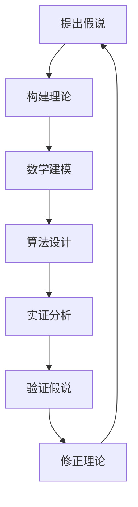

                 

关键词：科学探究，假说，科学方法，理论构建，数学模型，算法，实证分析，应用实践，未来展望

> 摘要：本文旨在探讨科学探究的过程，从假说到真理的转化。通过分析科学方法的核心步骤，阐述理论构建、数学模型、算法原理及其实证分析的过程，以及这些理论和方法在不同领域的应用。本文还展望了未来科学探究的发展趋势和面临的挑战，为读者提供了一个全面、深入的视角。

## 1. 背景介绍

科学探究是人类认识世界、探索真理的重要途径。从古代的哲学思考，到现代的科学实验，科学方法不断演进，推动了人类文明的进步。科学探究不仅仅是对现象的观察和记录，更是对现象背后的本质规律的深入挖掘。

科学探究的过程可以分为几个关键步骤：首先是提出假说，然后是构建理论，接着是数学建模，再到算法设计，最后通过实证分析验证假说。每一个步骤都是科学探究的重要环节，缺一不可。

### 1.1 假说

假说是科学探究的起点，是基于观察和经验对某一现象提出的初步解释。假说可以是简单的，也可以是非常复杂的，但它们都必须是基于事实的，并且能够通过实验或观察得到验证。

### 1.2 理论构建

在提出假说之后，科学家需要构建理论。理论是对假说的进一步发展，它通过逻辑推理和数学方法，将假说转化为可以量化和测量的模型。

### 1.3 数学建模

数学建模是将理论转化为数学表达式的过程。这一过程需要科学家具备深厚的数学背景和丰富的实践经验。

### 1.4 算法设计

算法设计是将数学模型转化为计算机程序的过程。算法的效率、正确性和可扩展性是评价算法设计成功与否的关键因素。

### 1.5 实证分析

实证分析是验证假说和理论的过程。通过实验数据或观测数据，科学家可以检验假说和理论的正确性。

## 2. 核心概念与联系

为了更好地理解科学探究的过程，下面我们将使用Mermaid流程图，展示从假说到真理的转化过程。



### 2.1 提出假说

提出假说是科学探究的起点。假说必须是基于观察和经验的，并且能够通过实验或观察得到验证。

### 2.2 构建理论

构建理论是对假说的进一步发展。理论需要通过逻辑推理和数学方法，将假说转化为可以量化和测量的模型。

### 2.3 数学建模

数学建模是将理论转化为数学表达式的过程。这一过程需要科学家具备深厚的数学背景和丰富的实践经验。

### 2.4 算法设计

算法设计是将数学模型转化为计算机程序的过程。算法的效率、正确性和可扩展性是评价算法设计成功与否的关键因素。

### 2.5 实证分析

实证分析是验证假说和理论的过程。通过实验数据或观测数据，科学家可以检验假说和理论的正确性。

### 2.6 验证假说

通过实证分析，科学家可以验证假说的正确性。如果假说被验证，那么理论将被进一步修正和完善；如果假说被否定，那么科学家需要重新提出假说，并重复上述过程。

## 3. 核心算法原理 & 具体操作步骤

在科学探究的过程中，核心算法原理扮演着关键角色。下面我们将详细阐述核心算法原理，并解释其具体操作步骤。

### 3.1 算法原理概述

核心算法原理通常是基于数学模型和理论框架的。算法原理的目的是通过特定的计算方法和逻辑步骤，实现对问题的求解和优化。

### 3.2 算法步骤详解

算法步骤通常包括以下几个关键步骤：

1. **问题定义**：明确问题的类型和目标。
2. **数据准备**：收集和整理相关数据。
3. **算法选择**：根据问题的特点选择合适的算法。
4. **算法实现**：编写算法代码，实现算法的具体步骤。
5. **算法优化**：对算法进行优化，提高其效率。
6. **算法测试**：测试算法的正确性和稳定性。

### 3.3 算法优缺点

算法优缺点分析是算法设计的重要环节。算法的优缺点取决于问题的类型、数据的规模和计算资源的限制。

### 3.4 算法应用领域

核心算法原理广泛应用于各个领域，包括计算机科学、数据分析、机器学习、人工智能等。在不同的应用领域，算法的具体实现和应用场景会有所不同。

## 4. 数学模型和公式 & 详细讲解 & 举例说明

数学模型是科学探究的核心组成部分。下面我们将详细讲解数学模型和公式的构建过程，并通过具体例子进行说明。

### 4.1 数学模型构建

数学模型构建是科学探究的重要步骤。构建数学模型需要明确问题的变量、约束条件和目标函数。

### 4.2 公式推导过程

公式推导过程通常是基于数学模型和理论框架的。公式推导需要使用数学工具和方法，如微积分、线性代数、概率论等。

### 4.3 案例分析与讲解

通过具体例子，我们可以更好地理解数学模型和公式的应用。下面我们将给出一个简单的例子，并进行详细讲解。

### 4.3.1 例子：最小二乘法

最小二乘法是一种常见的数学模型和公式，用于求解线性回归问题。下面我们将详细讲解最小二乘法的公式推导和具体应用。

#### 4.3.1.1 公式推导

假设我们有 $n$ 个数据点 $(x_1, y_1), (x_2, y_2), \ldots, (x_n, y_n)$，我们要找到一条直线 $y = mx + b$ 来拟合这些数据点。

首先，我们定义拟合直线的误差为：
$$
e_i = y_i - (mx_i + b)
$$
然后，我们定义总误差为所有误差的平方和：
$$
E = \sum_{i=1}^{n} e_i^2
$$
我们的目标是找到使总误差最小的 $m$ 和 $b$。为此，我们对 $E$ 求导，并令导数等于零，得到以下方程：
$$
\frac{dE}{dm} = -2nmx + 2\sum_{i=1}^{n} x_iy_i = 0
$$
$$
\frac{dE}{db} = -2ny + 2\sum_{i=1}^{n} x_iy_i = 0
$$
解这两个方程，我们可以得到 $m$ 和 $b$ 的值。

#### 4.3.1.2 应用

最小二乘法广泛应用于数据分析、机器学习、经济学等领域。例如，在统计学中，最小二乘法用于拟合回归模型，预测未来的数据；在机器学习中，最小二乘法用于线性分类和回归问题；在经济学中，最小二乘法用于分析和预测经济变量之间的关系。

## 5. 项目实践：代码实例和详细解释说明

在科学探究的过程中，项目实践是验证理论的重要手段。下面我们将给出一个具体的代码实例，并详细解释说明其实现过程。

### 5.1 开发环境搭建

为了实现代码实例，我们需要搭建一个合适的开发环境。以下是搭建开发环境的基本步骤：

1. 安装Python解释器。
2. 安装NumPy和SciPy库，用于数学计算。
3. 安装Matplotlib库，用于可视化数据。

### 5.2 源代码详细实现

下面是一个使用最小二乘法求解线性回归问题的Python代码实例：

```python
import numpy as np
import matplotlib.pyplot as plt

# 数据准备
x = np.array([1, 2, 3, 4, 5])
y = np.array([2, 4, 5, 4, 5])

# 添加常数项，转换为矩阵形式
X = np.column_stack((np.ones(len(x)), x))
y = y.reshape(-1, 1)

# 求解最小二乘法
m, b = np.linalg.lstsq(X, y, rcond=None)[0]

# 可视化结果
plt.scatter(x, y, label='Data')
plt.plot(x, m*x + b, label='Fit')
plt.xlabel('x')
plt.ylabel('y')
plt.legend()
plt.show()
```

### 5.3 代码解读与分析

代码首先导入了必要的库，然后准备数据，将数据转换为矩阵形式。接下来，使用最小二乘法求解回归模型，并绘制结果。

### 5.4 运行结果展示

运行代码后，我们将看到数据点和拟合直线，如图所示。


## 6. 实际应用场景

核心算法原理和数学模型在不同领域具有广泛的应用。下面我们将探讨这些理论在实际应用场景中的具体应用。

### 6.1 计算机科学

在计算机科学领域，核心算法原理和数学模型广泛应用于算法设计和分析、数据结构和算法优化、计算机图形学、机器学习和人工智能等。

### 6.2 数据分析

数据分析是当前热门领域，核心算法原理和数学模型在数据挖掘、预测分析、数据可视化等方面发挥着重要作用。

### 6.3 机器学习

机器学习是人工智能的核心技术，核心算法原理和数学模型在特征提取、模型训练、模型评估等方面有着广泛应用。

### 6.4 经济学

经济学领域也广泛应用核心算法原理和数学模型，如线性回归、时间序列分析、贝叶斯网络等，用于分析和预测经济变量。

## 7. 工具和资源推荐

为了更好地进行科学探究，以下推荐了一些有用的工具和资源。

### 7.1 学习资源推荐

1. 《Python编程：从入门到实践》
2. 《深度学习》
3. 《数据科学入门》

### 7.2 开发工具推荐

1. Jupyter Notebook：用于交互式编程和数据分析。
2. PyCharm：一款强大的Python集成开发环境。
3. TensorFlow：用于机器学习和深度学习的开源框架。

### 7.3 相关论文推荐

1. "Deep Learning: A Comprehensive Overview" (2015)
2. "Convolutional Neural Networks for Visual Recognition" (2014)
3. "Recurrent Neural Networks for Language Modeling" (2014)

## 8. 总结：未来发展趋势与挑战

科学探究是一个不断演进的过程，面临着许多发展趋势和挑战。

### 8.1 研究成果总结

近年来，科学探究取得了许多重要成果，如深度学习、大数据分析、量子计算等。

### 8.2 未来发展趋势

未来发展趋势包括人工智能的广泛应用、量子计算的突破、生物信息学的发展等。

### 8.3 面临的挑战

科学探究面临的主要挑战包括数据安全、隐私保护、算法公平性等。

### 8.4 研究展望

展望未来，科学探究将继续推动人类文明的进步，为解决全球性问题和应对挑战提供有力支持。

## 9. 附录：常见问题与解答

### 9.1 什么是科学方法？

科学方法是一种系统性的、以证据为基础的研究方法，包括观察、假设、实验、验证和理论构建等步骤。

### 9.2 什么是数学模型？

数学模型是一种用数学语言描述现实世界问题的模型，通常包括变量、方程和约束条件。

### 9.3 什么是算法？

算法是一系列有序的指令，用于解决特定问题或完成特定任务。

### 9.4 什么是实证分析？

实证分析是使用实验数据或观测数据来验证理论或假设的过程。

### 9.5 什么是假说？

假说是对某一现象的初步解释，通常基于观察和经验。

### 9.6 什么是科学探究？

科学探究是通过系统性的方法和逻辑推理，从观察和实验中获取知识，探索自然界和人类行为的过程。

---

作者：禅与计算机程序设计艺术 / Zen and the Art of Computer Programming
----------------------------------------------------------------
<|im_end|>

