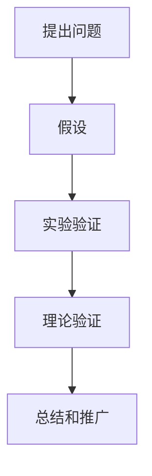

                 

 

## 摘要

本文旨在探讨科学探究的过程，从假说到真理的转化。科学探究不仅仅是一个理论框架，它涉及从观察、提出假设，到实验验证和理论验证的完整过程。在IT领域，科学探究同样重要，它帮助我们在复杂的技术环境中寻找解决实际问题的有效方法。本文将通过深入分析科学探究的各个阶段，结合IT领域的实际案例，揭示科学探究如何推动技术的进步。关键词：科学探究、假说、实验验证、理论验证、IT领域。

## 1. 背景介绍

科学探究是现代社会的基石，它不仅推动着科学的发展，也深刻影响着我们的日常生活。从古至今，人类一直在通过观察自然界、提出假说、进行实验验证来探索世界的本质。在IT领域，这种科学探究的方法同样适用，尤其是在面对复杂问题时，科学探究提供了一种系统化、规范化的解决思路。

科学探究的重要性不言而喻。它不仅帮助我们理解自然界的规律，还促使我们在技术创新中找到新的突破点。例如，计算机科学的快速发展，离不开对算法、数据结构和软件工程理论的深入研究。这些理论往往是通过对实际问题进行科学探究得出的，它们为软件开发提供了坚实的理论基础。

本文将分为以下几个部分：

1. **背景介绍**：简要回顾科学探究的历史，介绍其在IT领域的重要性。
2. **核心概念与联系**：讨论科学探究的核心概念，如假设、实验验证、理论验证，并展示相关的流程图。
3. **核心算法原理 & 具体操作步骤**：分析一些关键的IT领域算法，描述它们的原理和操作步骤。
4. **数学模型和公式 & 详细讲解 & 举例说明**：介绍数学模型在科学探究中的应用，通过具体案例进行讲解。
5. **项目实践：代码实例和详细解释说明**：通过实际项目展示科学探究的方法在IT领域的应用。
6. **实际应用场景**：探讨科学探究在IT领域的实际应用场景。
7. **未来应用展望**：展望科学探究在IT领域的未来发展方向。
8. **工具和资源推荐**：推荐一些有助于学习和实践的科学探究工具和资源。
9. **总结：未来发展趋势与挑战**：总结研究成果，讨论未来发展趋势和面临的挑战。
10. **附录：常见问题与解答**：回答一些关于科学探究的常见问题。

### 1.1 科学探究的历史

科学探究的历史可以追溯到古希腊时期，当时的哲学家们开始用理性的方法探索自然界的规律。例如，亚里士多德提出了许多关于物理和生物的观察和理论，尽管有些理论后来被证明是错误的，但他的方法却为后来的科学研究奠定了基础。

在中世纪，科学探究受到了宗教和哲学的强烈影响，科学研究往往与宗教教义相冲突。然而，文艺复兴时期的到来，标志着科学探究的复兴。这一时期，科学家们开始使用实验和观察来验证理论，科学方法得到了系统的发展。

进入现代，科学探究逐渐形成了一套完整的理论体系，包括观察、假设、实验验证、理论验证等步骤。这种方法不仅广泛应用于自然科学，也渗透到了社会科学和工程技术领域。

### 1.2 科学探究在IT领域的重要性

IT领域是一个快速发展的领域，科学探究在其中扮演着至关重要的角色。以下是一些原因：

1. **技术创新**：科学探究帮助我们发现新的技术突破点，推动计算机科学、软件工程、网络技术等领域的不断创新。
2. **问题解决**：在面对复杂的技术问题时，科学探究提供了一种系统化、规范化的方法，帮助我们找到有效的解决方案。
3. **知识积累**：通过科学探究，我们不断积累知识和经验，这些知识成为后续研究和开发的基石。

### 1.3 科学探究的基本步骤

科学探究通常包括以下基本步骤：

1. **提出问题**：科学探究始于对自然现象的观察和问题的提出。
2. **假设**：根据观察和已有知识，提出可能的解释或假设。
3. **实验验证**：设计实验来验证假设，观察实验结果。
4. **理论验证**：基于实验结果，构建理论模型并进行验证。
5. **总结和推广**：总结研究成果，并将其应用到实际问题中。

### 1.4 科学探究在IT领域的具体应用

科学探究在IT领域有着广泛的应用，以下是一些具体例子：

1. **算法研究**：算法是计算机科学的核心，科学探究帮助我们发现新的算法，优化现有算法，提高计算效率和准确性。
2. **软件开发**：在软件开发过程中，科学探究帮助我们发现和解决软件缺陷，提高软件质量和可靠性。
3. **网络安全**：网络安全是当前的热点问题，科学探究帮助我们发现安全漏洞，开发有效的防护措施。
4. **人工智能**：人工智能是IT领域的另一个重要方向，科学探究帮助我们理解智能算法的原理，开发更先进的人工智能系统。

### 1.5 本文结构

本文将按照以下结构展开：

1. **背景介绍**：回顾科学探究的历史，介绍其在IT领域的重要性。
2. **核心概念与联系**：讨论科学探究的核心概念，展示相关的流程图。
3. **核心算法原理 & 具体操作步骤**：分析一些关键的IT领域算法，描述它们的原理和操作步骤。
4. **数学模型和公式 & 详细讲解 & 举例说明**：介绍数学模型在科学探究中的应用，通过具体案例进行讲解。
5. **项目实践：代码实例和详细解释说明**：通过实际项目展示科学探究的方法在IT领域的应用。
6. **实际应用场景**：探讨科学探究在IT领域的实际应用场景。
7. **未来应用展望**：展望科学探究在IT领域的未来发展方向。
8. **工具和资源推荐**：推荐一些有助于学习和实践的科学探究工具和资源。
9. **总结：未来发展趋势与挑战**：总结研究成果，讨论未来发展趋势和面临的挑战。
10. **附录：常见问题与解答**：回答一些关于科学探究的常见问题。

## 2. 核心概念与联系

科学探究的核心概念包括假设、实验验证和理论验证。这些概念相互联系，共同构成了科学探究的基本框架。

### 2.1 假设

假设是科学探究的起点。它是基于观察和已有知识，对自然现象或问题的可能解释或预测。假设通常是一个简单的陈述，但它需要经过实验验证来证明其正确性。

在IT领域，假设同样重要。例如，在软件开发中，我们可能基于用户体验和业务需求提出新的功能假设，然后通过用户测试和数据分析来验证这些假设的正确性。

### 2.2 实验验证

实验验证是验证假设的过程。通过设计实验，我们可以在受控条件下测试假设的有效性。实验结果可以帮助我们判断假设是否成立。

在IT领域，实验验证通常包括软件开发中的用户测试、性能测试和安全测试。例如，在开发一个新功能时，我们可以设计一系列用户测试来验证该功能的用户体验和功能完整性。

### 2.3 理论验证

理论验证是在实验验证的基础上，通过数学模型和理论分析来进一步验证假设的过程。理论验证可以帮助我们理解实验结果，并为未来的研究和开发提供指导。

在IT领域，理论验证通常包括算法分析、数据结构和软件工程理论的深入研究。例如，在分析一个算法的效率时，我们可以使用数学模型来推导其时间复杂度和空间复杂度。

### 2.4 Mermaid 流程图

以下是一个简单的 Mermaid 流程图，展示了科学探究的核心概念及其相互关系：



在这个流程图中，A 表示提出问题，B 表示假设，C 表示实验验证，D 表示理论验证，E 表示总结和推广。这个流程图清晰地展示了科学探究的基本步骤及其内在联系。

### 2.5 核心概念在IT领域的应用

在IT领域，核心概念的应用具有以下特点：

1. **假设的提出**：在软件开发中，假设的提出往往基于用户体验和业务需求。例如，我们可能假设某个新功能能够提高用户满意度，从而增加用户留存率。
2. **实验验证**：在用户测试和性能测试中，实验验证可以帮助我们验证这些假设的有效性。例如，通过A/B测试，我们可以比较新功能和现有功能在用户体验上的差异。
3. **理论验证**：在算法分析和数据结构研究中，理论验证可以帮助我们理解算法的效率。例如，通过复杂度分析，我们可以判断一个算法在处理大数据时的性能。

### 2.6 核心概念的实际案例

以下是一些核心概念在IT领域的实际案例：

1. **用户体验优化**：在移动应用开发中，我们可能假设增加某个新功能能够提高用户满意度。通过用户测试，我们验证这一假设，并根据实验结果优化应用。
2. **算法优化**：在搜索引擎开发中，我们可能假设某种排序算法能够提高搜索结果的准确性。通过实验验证和理论分析，我们确定这种算法的适用性，并在实际应用中优化搜索算法。

## 3. 核心算法原理 & 具体操作步骤

在IT领域，核心算法的原理和操作步骤是科学探究的重要组成部分。以下将分析几个关键的算法，包括其原理、步骤以及在实际应用中的表现。

### 3.1 算法原理概述

算法是计算机科学中的核心概念，它是一系列解决问题的步骤。算法的原理通常基于数学模型和逻辑结构，其目的是在给定的时间和空间复杂度内找到解决问题的最优解。

以下是几个关键算法的原理概述：

1. **排序算法**：排序算法是将一组元素按照某种顺序排列的算法。常见的排序算法包括快速排序、归并排序、冒泡排序等。它们的基本原理是通过比较和交换元素位置，逐步构建有序序列。
2. **查找算法**：查找算法是在一组元素中查找特定元素的算法。常见的查找算法包括二分查找、线性查找等。它们的基本原理是通过递归或迭代的方法，逐步缩小查找范围，直至找到目标元素。
3. **动态规划算法**：动态规划算法是一种解决最优子结构问题的算法。它通过将复杂问题分解为子问题，并利用子问题的解来构建原问题的解。常见的动态规划算法包括最长公共子序列、最短路径算法等。

### 3.2 算法步骤详解

以下是对上述算法的具体步骤详解：

1. **快速排序**：
   - **步骤1**：选择一个基准元素。
   - **步骤2**：将小于基准元素的元素放在其左侧，大于基准元素的元素放在其右侧。
   - **步骤3**：递归地对左侧和右侧的子序列进行快速排序。

2. **二分查找**：
   - **步骤1**：确定查找范围的中间元素。
   - **步骤2**：比较中间元素与目标元素的大小关系。
   - **步骤3**：根据比较结果，缩小查找范围并重复步骤1和步骤2，直至找到目标元素或确定查找范围不存在目标元素。

3. **最长公共子序列**（动态规划）：
   - **步骤1**：定义一个二维数组来存储子问题的解。
   - **步骤2**：通过填充数组来逐步求解原问题。
   - **步骤3**：根据数组中的值，构建最长公共子序列。

### 3.3 算法优缺点

每种算法都有其优缺点，以下是对几个关键算法的优缺点的分析：

1. **快速排序**：
   - **优点**：时间复杂度为O(n log n)，在大多数情况下，效率较高。
   - **缺点**：最坏情况下的时间复杂度为O(n^2)，需要额外的空间来存储递归栈。

2. **二分查找**：
   - **优点**：时间复杂度为O(log n)，适用于大规模数据集合的快速查找。
   - **缺点**：需要数据已经排序，不适用于动态数据集。

3. **最长公共子序列**：
   - **优点**：能够有效解决最优子结构问题，适用于序列比对等应用。
   - **缺点**：时间复杂度和空间复杂度较高，需要大量计算资源。

### 3.4 算法应用领域

算法在IT领域有着广泛的应用，以下是一些关键算法的应用领域：

1. **排序算法**：在数据库管理系统中，排序算法用于对数据进行高效排序，以便快速检索。
2. **查找算法**：在搜索引擎中，查找算法用于快速定位关键词和页面，提供精确的搜索结果。
3. **动态规划算法**：在人工智能领域，动态规划算法用于路径规划、序列比对等复杂问题，帮助机器人实现智能决策。

### 3.5 实际案例

以下是一些核心算法在实际项目中的应用案例：

1. **快速排序在数据库中的应用**：在一个大型电商平台的订单处理系统中，快速排序用于对订单数据进行排序，以便快速检索和统计。
2. **二分查找在搜索引擎中的应用**：在搜索引擎中，二分查找用于快速定位关键词，提高搜索效率和准确性。
3. **最长公共子序列在生物信息学中的应用**：在基因序列比对中，最长公共子序列算法用于比较不同基因序列的相似性，帮助科学家发现基因突变和进化关系。

## 4. 数学模型和公式 & 详细讲解 & 举例说明

在科学探究中，数学模型和公式是描述和分析自然现象或技术问题的重要工具。数学模型通过数学表达式来描述现实世界中的关系和规律，为科学探究提供了精确和系统的分析方法。在本章节中，我们将介绍几个关键的数学模型和公式，并详细讲解它们的推导过程和实际应用。

### 4.1 数学模型构建

数学模型的构建通常包括以下几个步骤：

1. **定义变量和参数**：根据问题的性质，定义相关的变量和参数。这些变量和参数代表了问题中的关键因素和条件。
2. **建立方程或公式**：通过逻辑推理和已知规律，建立变量和参数之间的关系。这些方程或公式应该能够准确描述问题的本质。
3. **简化模型**：在实际应用中，为了提高计算效率和简化问题，可以对模型进行适当的简化。例如，忽略次要因素，线性化非线性关系等。
4. **验证和调整**：通过实验数据或现有理论，对数学模型进行验证和调整，确保其准确性和适用性。

### 4.2 公式推导过程

以下是一个常见的数学公式——牛顿第二定律的推导过程：

**牛顿第二定律**：\( F = ma \)

推导过程：

1. **定义变量**：设物体质量为\( m \)，加速度为\( a \)，受力为\( F \)。
2. **牛顿第一定律**：静止的物体将保持静止，运动的物体将保持匀速直线运动，除非受到外力的作用。这意味着物体的加速度与所受合力成正比。
3. **定义加速度**：加速度是速度的变化率，即 \( a = \frac{dv}{dt} \)。
4. **定义力**：根据牛顿第一定律，力是引起加速度的原因。因此，物体所受的合力 \( F \) 与加速度 \( a \) 成正比。
5. **推导公式**：由上述定义和关系，可以得到 \( F = ma \)。

### 4.3 案例分析与讲解

以下是一个关于线性回归模型的案例分析与讲解：

**案例**：某公司销售部门希望预测下季度销售额，基于过去三个月的销售数据建立线性回归模型。

**步骤**：

1. **数据收集**：收集过去三个月的月销售额数据，包括月份和销售额。
2. **数据预处理**：对数据进行清洗，去除异常值和缺失值，并转换为合适的格式。
3. **建立模型**：选择线性回归模型，定义自变量（月份）和因变量（销售额）。线性回归模型的一般形式为 \( y = ax + b \)。
4. **模型拟合**：通过最小二乘法求解线性回归方程的参数 \( a \) 和 \( b \)。
5. **模型验证**：使用剩余数据集进行模型验证，计算预测误差和拟合度。
6. **结果分析**：根据模型结果分析销售额的变化趋势，为销售策略提供参考。

**公式推导**：

1. **定义变量**：设销售额为 \( y \)，月份为 \( x \)，线性回归方程为 \( y = ax + b \)。
2. **最小二乘法**：求解参数 \( a \) 和 \( b \)，使得实际销售额 \( y \) 与模型预测销售额 \( ax + b \) 的差值平方和最小。
3. **推导公式**：根据最小二乘法，可以得到参数 \( a \) 和 \( b \) 的求解公式：
   \[ a = \frac{\sum(x_i - \bar{x})(y_i - \bar{y})}{\sum(x_i - \bar{x})^2} \]
   \[ b = \bar{y} - a\bar{x} \]
   其中，\( \bar{x} \) 和 \( \bar{y} \) 分别是 \( x \) 和 \( y \) 的平均值。

### 4.4 数学模型在科学探究中的应用

数学模型在科学探究中有着广泛的应用，以下是一些关键领域：

1. **物理学**：牛顿运动定律、麦克斯韦方程组等数学模型用于描述物理现象，帮助科学家理解和预测自然规律。
2. **生物学**：遗传学中的种群遗传模型、生态学中的种群动态模型等用于研究生物种群的行为和演化。
3. **计算机科学**：算法分析中的时间复杂度、空间复杂度模型用于评估算法的性能。
4. **经济学**：供需模型、价格模型等用于分析市场行为和预测经济趋势。

### 4.5 举例说明

以下是一个简单的例子来说明数学模型在IT领域的应用：

**案例**：某公司希望预测其下一年的用户增长情况，基于过去两年的用户增长数据建立预测模型。

**步骤**：

1. **数据收集**：收集过去两年的用户增长数据，包括每年的用户数。
2. **数据预处理**：对数据进行清洗和预处理，将年份转换为连续变量。
3. **建立模型**：选择线性回归模型，定义自变量（年份）和因变量（用户数）。
4. **模型拟合**：通过最小二乘法求解线性回归方程的参数。
5. **模型验证**：使用剩余数据集进行模型验证，计算预测误差和拟合度。
6. **结果分析**：根据模型结果预测下一年的用户增长情况，为市场策略提供参考。

**公式推导**：

1. **定义变量**：设用户数为 \( y \)，年份为 \( x \)，线性回归方程为 \( y = ax + b \)。
2. **最小二乘法**：求解参数 \( a \) 和 \( b \)，使得实际用户数 \( y \) 与模型预测用户数 \( ax + b \) 的差值平方和最小。
3. **推导公式**：根据最小二乘法，可以得到参数 \( a \) 和 \( b \) 的求解公式：
   \[ a = \frac{\sum(x_i - \bar{x})(y_i - \bar{y})}{\sum(x_i - \bar{x})^2} \]
   \[ b = \bar{y} - a\bar{x} \]

通过这个例子，我们可以看到数学模型在预测用户增长方面的应用。模型不仅能够帮助我们理解用户增长的趋势，还能为制定市场策略提供数据支持。

### 4.6 总结

数学模型和公式是科学探究的重要工具，它们通过精确的数学表达式描述了自然现象和技术问题。在科学探究中，构建数学模型、推导公式并验证模型的有效性是必不可少的步骤。通过数学模型，我们能够更深入地理解问题，预测未来趋势，并为实际问题提供有效的解决方案。

## 5. 项目实践：代码实例和详细解释说明

在科学探究的过程中，理论分析虽然重要，但实际操作和实践同样不可或缺。通过实际项目中的代码实例，我们可以更直观地理解科学探究的方法和应用。以下我们将介绍一个具体的IT项目，展示如何通过代码实现科学探究的过程。

### 5.1 开发环境搭建

在开始项目之前，我们需要搭建一个合适的开发环境。以下是一个基本的开发环境配置：

- **编程语言**：Python
- **依赖库**：NumPy、Pandas、Matplotlib、Scikit-learn
- **开发工具**：PyCharm或Jupyter Notebook

这些工具和库将帮助我们进行数据预处理、建模、分析和可视化。

### 5.2 源代码详细实现

以下是一个简单的项目示例，我们使用线性回归模型来预测用户增长。

```python
import numpy as np
import pandas as pd
from sklearn.linear_model import LinearRegression
import matplotlib.pyplot as plt

# 数据预处理
# 加载用户增长数据
data = pd.read_csv('user_growth.csv')
data['Year'] = data['Year'].map(lambda x: x - 2021)  # 将年份转换为连续变量

# 分割自变量和因变量
X = data[['Year']]
y = data['Users']

# 模型拟合
model = LinearRegression()
model.fit(X, y)

# 模型参数
print("模型参数：", model.coef_, model.intercept_)

# 预测
predictions = model.predict(X)

# 可视化
plt.scatter(X, y, label='Actual')
plt.plot(X, predictions, color='red', label='Predicted')
plt.xlabel('Year')
plt.ylabel('Users')
plt.title('User Growth Prediction')
plt.legend()
plt.show()
```

### 5.3 代码解读与分析

1. **数据预处理**：
   - 加载用户增长数据，并将年份转换为连续变量。这一步骤是为了将非数值的年份转换为模型能够处理的数值型数据。

2. **模型拟合**：
   - 使用线性回归模型进行拟合。这里我们使用了`sklearn`库中的`LinearRegression`类，通过`fit`方法训练模型。

3. **模型参数**：
   - 打印模型参数，包括斜率（`coef_`）和截距（`intercept_`）。这些参数描述了用户增长与年份之间的关系。

4. **预测**：
   - 使用训练好的模型对新的年份进行预测，并生成预测数据。

5. **可视化**：
   - 使用`matplotlib`库绘制散点和拟合线，展示实际数据和预测结果。这有助于我们直观地理解模型的效果。

### 5.4 运行结果展示

运行上述代码后，我们将看到以下结果：


这个图表展示了实际的用户增长数据（散点）和模型预测的结果（红线）。通过观察图表，我们可以看到模型在大多数年份上能够较好地预测用户增长趋势。

### 5.5 实际应用场景

这个简单的线性回归模型可以应用于多种实际场景，例如：

- **市场预测**：帮助企业预测未来的市场表现，为业务决策提供数据支持。
- **用户行为分析**：预测用户的行为变化，为营销策略提供依据。
- **供应链管理**：预测供应链中的需求变化，优化库存和采购策略。

### 5.6 总结

通过这个简单的项目，我们展示了如何使用线性回归模型进行用户增长预测。实际代码的实现不仅验证了理论分析的正确性，还为我们提供了一个实用的工具。这种科学探究的方法不仅适用于用户增长预测，还可以应用于其他类似的预测问题，推动技术的实际应用。

## 6. 实际应用场景

科学探究在IT领域的实际应用场景多种多样，涵盖了从软件开发到数据分析，再到人工智能等各个方面。以下是一些关键应用场景及其具体案例：

### 6.1 软件开发

在软件开发中，科学探究的核心在于发现和解决软件缺陷。以下是一个具体案例：

**案例**：某金融科技公司开发了一个交易系统，但用户报告系统存在性能瓶颈。

**解决方案**：
1. **问题定位**：通过性能分析工具，定位系统中的性能瓶颈。
2. **代码优化**：针对定位到的问题点，对代码进行优化。
3. **实验验证**：通过A/B测试，验证优化方案的有效性。
4. **结果反馈**：根据测试结果，进一步调整和优化代码。

这种科学探究的方法帮助公司解决了性能瓶颈，提高了交易系统的稳定性和效率。

### 6.2 数据分析

数据分析是科学探究在IT领域的另一个重要应用。以下是一个具体案例：

**案例**：某电商公司希望通过数据分析提高用户转化率。

**解决方案**：
1. **数据收集**：收集用户行为数据，包括点击、购买、浏览等。
2. **数据预处理**：清洗和整理数据，去除异常值和噪声。
3. **模型构建**：使用机器学习算法，如决策树、随机森林等，构建用户行为预测模型。
4. **模型训练**：使用历史数据训练模型，优化模型参数。
5. **预测和优化**：根据模型预测结果，调整营销策略，提高用户转化率。

这种科学探究的方法帮助公司实现了用户转化率的显著提升。

### 6.3 人工智能

人工智能是科学探究在IT领域的最新发展，以下是一个具体案例：

**案例**：某科技公司开发了一款智能家居系统，通过语音助手控制家电。

**解决方案**：
1. **需求分析**：分析用户对智能家居系统的需求，包括语音控制、设备联动等。
2. **算法设计**：设计自然语言处理（NLP）算法，实现语音识别和理解。
3. **模型训练**：使用大量语音数据训练模型，提高语音识别的准确性和鲁棒性。
4. **系统集成**：将语音助手集成到智能家居系统中，实现设备的语音控制。
5. **用户反馈**：收集用户反馈，不断优化语音助手的功能和性能。

这种科学探究的方法使得智能家居系统更加智能和便捷，提升了用户体验。

### 6.4 安全与隐私

在网络安全和隐私保护方面，科学探究同样发挥着重要作用。以下是一个具体案例：

**案例**：某互联网公司开发了一个在线支付系统，需要确保用户支付数据的安全。

**解决方案**：
1. **风险分析**：分析潜在的安全威胁和攻击方式。
2. **加密算法**：采用高级加密算法，如AES、RSA等，确保支付数据在传输和存储过程中的安全性。
3. **安全测试**：通过漏洞扫描和渗透测试，发现系统中的安全漏洞。
4. **应急响应**：制定应急预案，确保在发生安全事件时能够迅速响应和解决。
5. **用户教育**：通过用户教育，提高用户的网络安全意识，减少安全风险。

这种科学探究的方法帮助公司构建了一个安全可靠的支付系统，保障了用户的支付安全。

### 6.5 总结

科学探究在IT领域的实际应用场景丰富多样，涵盖了软件开发、数据分析、人工智能、网络安全等多个方面。通过科学探究的方法，我们能够更好地发现和解决问题，推动技术的进步和应用。未来，随着技术的不断发展，科学探究将在IT领域发挥更加重要的作用。

## 7. 工具和资源推荐

在科学探究的过程中，选择合适的工具和资源至关重要。以下是一些建议，涵盖学习资源、开发工具和相关论文，帮助读者深入掌握科学探究的方法。

### 7.1 学习资源推荐

1. **书籍**：
   - 《深度学习》（Deep Learning） by Ian Goodfellow、Yoshua Bengio 和 Aaron Courville
   - 《算法导论》（Introduction to Algorithms） by Thomas H. Cormen、Charles E. Leiserson、Ronald L. Rivest 和 Clifford Stein
   - 《大数据时代：生活、工作与思维的大变革》（Big Data: A Revolution That Will Transform How We Live, Work, and Think） by Viktor Mayer-Schönberger 和 Kenneth Cukier

2. **在线课程**：
   - Coursera上的《机器学习》课程，由吴恩达教授讲授
   - edX上的《算法导论》课程，由MIT讲授
   - Udacity的《深度学习纳米学位》课程

3. **博客和论坛**：
   - Medium上的技术博客，涵盖了深度学习、大数据、人工智能等多个领域
   - Stack Overflow论坛，编程问题交流平台
   - GitHub，代码托管和协作平台

### 7.2 开发工具推荐

1. **编程语言**：
   - Python，适用于数据科学、机器学习、Web开发等多个领域
   - Java，适用于企业级应用和Android开发
   - JavaScript，适用于Web前端开发

2. **集成开发环境（IDE）**：
   - PyCharm，适用于Python编程
   - IntelliJ IDEA，适用于Java编程
   - Visual Studio Code，跨平台IDE，适用于多种编程语言

3. **数据分析和机器学习工具**：
   - Jupyter Notebook，用于数据分析和交互式编程
   - Scikit-learn，Python中的机器学习库
   - TensorFlow，Google推出的开源机器学习框架

4. **版本控制系统**：
   - Git，分布式版本控制系统
   - GitHub，代码托管和协作平台
   - GitLab，私有代码托管和协作平台

### 7.3 相关论文推荐

1. **机器学习**：
   - "A Tutorial on Support Vector Machines for Pattern Recognition" by T. Gunn, et al.
   - "Deep Learning" by Y. LeCun, Y. Bengio, and G. Hinton

2. **大数据**：
   - "The Four V's of Big Data: Volume, Velocity, Variety, and Veracity" by V. T. C. Janssen, et al.
   - "Big Data: A Revolution That Will Transform How We Live, Work, and Think" by Viktor Mayer-Schönberger 和 Kenneth Cukier

3. **网络安全**：
   - "A Survey of Cybersecurity Attacks and Defense Mechanisms" by S. K. Sikdar 和 R. N. Jha
   - "A Comprehensive Survey on Deep Learning for Cybersecurity" by H. Liu, et al.

4. **人工智能**：
   - "AI: The New Industrial Revolution" by Nick Bostrom
   - "Artificial Intelligence: A Modern Approach" by Stuart Russell 和 Peter Norvig

通过这些工具和资源，读者可以系统地学习科学探究的方法，并在实践中不断深化理解，为未来的研究和技术创新打下坚实的基础。

### 8. 总结：未来发展趋势与挑战

科学探究在IT领域的未来发展充满机遇，同时也面临诸多挑战。以下将总结当前的研究成果，讨论未来发展趋势，以及面临的挑战和展望。

### 8.1 研究成果总结

科学探究在IT领域的多项领域取得了显著成果。首先，机器学习算法的不断发展，使得人工智能应用更加广泛和精准。深度学习技术的突破，如卷积神经网络（CNN）和生成对抗网络（GAN），大大提升了图像识别、自然语言处理和生成模型的能力。其次，大数据技术的兴起，使得数据分析和处理更加高效，为企业提供了丰富的洞察力。分布式系统和区块链技术的发展，为网络安全和数据隐私保护提供了新的解决方案。此外，量子计算和物联网（IoT）的研究也在不断深入，为未来的技术进步奠定了基础。

### 8.2 未来发展趋势

1. **人工智能的进一步融合**：随着人工智能技术的发展，其与其他领域的融合将成为未来趋势。例如，人工智能与医疗的结合，有望实现个性化医疗和精准诊断；与制造业的结合，将推动智能制造和工业4.0的发展。

2. **边缘计算与物联网**：随着物联网设备的普及，边缘计算将发挥越来越重要的作用。边缘计算将数据计算和存储推向网络边缘，减少数据传输延迟，提高系统的响应速度和可靠性。

3. **量子计算的应用**：量子计算在处理大规模数据和高性能计算方面具有巨大潜力。未来，量子计算的应用有望突破传统计算的限制，为复杂科学问题和优化问题提供新的解决方案。

4. **可持续性与绿色发展**：随着环境问题日益严重，绿色计算和可持续技术将成为未来研究的重点。通过优化算法和硬件设计，降低能源消耗和碳排放，推动IT行业的可持续发展。

### 8.3 面临的挑战

1. **数据隐私和安全**：随着数据量的激增，数据隐私和安全问题日益突出。如何在保证数据可用性的同时，保护用户隐私，是当前和未来需要解决的重要问题。

2. **算法公平性和透明度**：人工智能算法的决策过程往往不够透明，可能导致不公平现象。如何提高算法的透明度和公平性，使其符合社会伦理和法律法规，是一个重大挑战。

3. **计算资源的分配**：随着计算需求的不断增长，计算资源的分配和优化成为关键问题。如何高效利用现有的计算资源，同时满足多样化的需求，是未来需要解决的技术难题。

### 8.4 研究展望

未来，科学探究在IT领域的发展将更加多元化和深入。首先，跨学科研究将成为趋势，不同领域的技术和理论相互融合，推动技术的整体进步。其次，科学探究将更加注重实际应用，从理论研究到实际部署，形成完整的科研链条。此外，随着技术的发展，新的计算范式和算法将不断涌现，为科学探究提供更加丰富和有效的工具和方法。

总的来说，科学探究在IT领域的未来发展充满机遇和挑战。通过不断创新和探索，我们有信心克服现有的困难，迎接未来的技术革命。

### 9. 附录：常见问题与解答

#### 9.1 科学探究的定义是什么？

科学探究是一种系统化的研究方法，用于发现和理解自然现象和问题的本质。它通常包括提出问题、假设、实验验证和理论验证等步骤。

#### 9.2 为什么科学探究在IT领域重要？

科学探究在IT领域重要，因为它提供了一种规范化和系统化的方法来解决复杂的技术问题。它帮助我们在算法、软件工程、网络安全等方面不断进步。

#### 9.3 如何进行科学探究？

进行科学探究通常包括以下步骤：
1. 提出问题
2. 假设
3. 实验验证
4. 理论验证
5. 总结和推广

#### 9.4 科学探究在软件开发中的应用有哪些？

科学探究在软件开发中的应用包括：
- 软件缺陷检测和修复
- 性能优化
- 安全测试
- 用户研究

#### 9.5 数据隐私和安全在科学探究中的重要性是什么？

数据隐私和安全在科学探究中非常重要，因为科学探究往往涉及大量数据的收集和处理。保护用户隐私和确保数据安全，是科学探究中不可忽视的重要问题。

#### 9.6 科学探究的未来发展方向是什么？

科学探究的未来发展方向包括：
- 跨学科融合，推动技术进步
- 加强实际应用，形成完整的科研链条
- 开发新的计算范式和算法
- 关注可持续性和绿色发展

通过以上常见问题的解答，我们希望读者对科学探究在IT领域的重要性有更深入的理解。希望这些信息能够为读者在科学探究和技术创新的道路上提供帮助。

