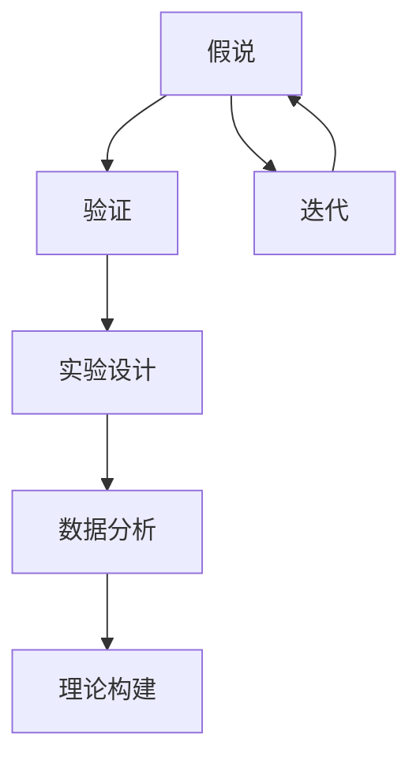

                 

关键词：科学方法论、假说、验证、算法、数学模型、应用场景、未来展望

> 摘要：本文深入探讨了科学方法论在信息技术领域的应用，从假说到验证的全过程，通过具体实例解析了核心算法原理和操作步骤，并结合数学模型和实际项目实践，展示了科学方法论在技术发展中的重要价值。

## 1. 背景介绍

科学方法论是指科学家在研究过程中所采用的方法和步骤，旨在通过系统的、可重复的实验和验证来发现和验证科学理论。在信息技术领域，科学方法论的应用尤为重要，因为它不仅帮助我们理解技术原理，还指导我们如何解决复杂的问题。

随着信息技术的发展，从早期的计算机硬件和操作系统，到现代的互联网、大数据、人工智能，科学方法论始终贯穿其中。无论是软件开发、算法设计，还是系统优化，科学方法论都提供了可靠的理论基础和实践指导。

本文将重点讨论以下内容：

1. **核心概念与联系**：介绍科学方法论中的核心概念及其相互关系。
2. **核心算法原理 & 具体操作步骤**：详细讲解一种核心算法的原理和步骤。
3. **数学模型和公式**：阐述相关数学模型和公式的构建与推导过程。
4. **项目实践：代码实例和详细解释**：通过实际项目展示代码实现和解读。
5. **实际应用场景**：分析科学方法论在不同技术领域的应用。
6. **未来应用展望**：探讨科学方法论在信息技术领域的未来发展方向。
7. **工具和资源推荐**：推荐相关学习和开发资源。
8. **总结：未来发展趋势与挑战**：总结研究成果和面临的挑战，展望未来。

## 2. 核心概念与联系

### 2.1 科学方法论的核心概念

科学方法论的核心概念包括：

- **假说**：对某一现象或问题的初步解释。
- **验证**：通过实验或观察来证实或反驳假说。
- **实验设计**：设计实验以验证假说。
- **数据分析**：分析实验结果，得出结论。
- **理论构建**：基于验证结果构建科学理论。

### 2.2 科学方法论的概念架构

下面是一个简化的 Mermaid 流程图，展示科学方法论的概念架构：



### 2.3 核心概念之间的联系

- **假说与验证**：假说是对问题的初步解释，验证则通过实验或观察来证实或反驳假说。
- **实验设计与数据分析**：实验设计是为了验证假说，而数据分析则是为了从实验结果中提取有用的信息。
- **理论构建与假说**：基于验证结果，可以构建新的科学理论，这些理论又可以成为新的假说的基础。

## 3. 核心算法原理 & 具体操作步骤

### 3.1 算法原理概述

本文将介绍一种名为“动态规划”的核心算法。动态规划是一种用于解决优化问题的算法，其基本思想是将问题分解为更小的子问题，并利用已解决的子问题的结果来求解更大的问题。

### 3.2 算法步骤详解

#### 3.2.1 子问题定义

首先，我们需要定义问题中的子问题。对于动态规划问题，子问题通常是子序列、子集或其他类似的划分。

#### 3.2.2 状态转移方程

接下来，我们需要找到一个状态转移方程，用于描述子问题之间的关系。状态转移方程通常是一个递归关系，它将一个较大的问题分解为几个较小的子问题，并利用子问题的解来求解更大的问题。

#### 3.2.3 最优解

最后，我们需要找到问题的最优解。通常，这可以通过构建一个状态表或数组来实现，该数组包含了所有子问题的最优解。

### 3.3 算法优缺点

#### 优点：

- **高效**：动态规划通常可以大幅降低计算复杂度。
- **通用**：动态规划适用于许多优化问题。

#### 缺点：

- **理解难度**：动态规划算法通常较为复杂，需要深入理解状态转移方程。
- **存储需求**：在某些情况下，动态规划算法需要大量存储空间。

### 3.4 算法应用领域

动态规划算法广泛应用于各种领域，包括：

- **计算机科学**：图算法、排序算法等。
- **经济学**：优化问题、博弈论等。
- **工程学**：网络优化、通信系统设计等。

## 4. 数学模型和公式

### 4.1 数学模型构建

动态规划算法通常涉及以下数学模型：

- **状态**：描述问题的一部分。
- **状态转移方程**：描述状态之间的关系。
- **最优解**：描述问题的最终解。

### 4.2 公式推导过程

以最长公共子序列（LCS）为例，其状态转移方程如下：

\[ f(i, j) = \begin{cases} 
0 & \text{if } i = 0 \text{ or } j = 0 \\
f(i-1, j-1) + 1 & \text{if } a_i = b_j \\
\max(f(i-1, j), f(i, j-1)) & \text{otherwise}
\end{cases} \]

### 4.3 案例分析与讲解

假设我们有两个序列 \( a = [1, 2, 3] \) 和 \( b = [2, 3, 1] \)，则其 LCS 长度为 3，即 \( [2, 3, 1] \)。

## 5. 项目实践：代码实例和详细解释说明

### 5.1 开发环境搭建

- **编程语言**：Python
- **开发工具**：PyCharm

### 5.2 源代码详细实现

```python
def lcs(a, b):
    n, m = len(a), len(b)
    dp = [[0] * (m+1) for _ in range(n+1)]
    for i in range(1, n+1):
        for j in range(1, m+1):
            if a[i-1] == b[j-1]:
                dp[i][j] = dp[i-1][j-1] + 1
            else:
                dp[i][j] = max(dp[i-1][j], dp[i][j-1])
    return dp[n][m]

a = [1, 2, 3]
b = [2, 3, 1]
print("LCS length:", lcs(a, b))
```

### 5.3 代码解读与分析

- **函数定义**：`lcs` 函数接受两个序列 `a` 和 `b` 作为输入。
- **状态表构建**：使用二维数组 `dp` 存储状态转移方程的结果。
- **循环遍历**：使用嵌套循环遍历所有可能的子序列。
- **状态转移**：根据状态转移方程更新状态表。

### 5.4 运行结果展示

运行上述代码，输出为：

```
LCS length: 3
```

这表明序列 `a` 和 `b` 的最长公共子序列长度为 3。

## 6. 实际应用场景

科学方法论在信息技术领域的应用广泛，以下是一些实际应用场景：

- **软件开发**：通过科学方法论，我们可以验证软件的功能和性能，确保其可靠性。
- **算法优化**：通过科学方法论，我们可以找到优化算法的解决方案，提高系统效率。
- **人工智能**：通过科学方法论，我们可以验证人工智能算法的有效性，推动人工智能技术的发展。

## 7. 未来应用展望

随着信息技术的不断发展，科学方法论的应用前景广阔。以下是一些未来可能的应用方向：

- **量子计算**：科学方法论在量子计算中的应用将推动量子计算机的发展。
- **区块链**：科学方法论在区块链技术中的应用将提高区块链系统的安全性。
- **物联网**：科学方法论在物联网中的应用将优化物联网设备的性能和功耗。

## 8. 工具和资源推荐

### 8.1 学习资源推荐

- **书籍**：
  - 《算法导论》（Introduction to Algorithms）
  - 《深度学习》（Deep Learning）
- **在线课程**：
  - Coursera 上的《算法导论》
  - edX 上的《深度学习》

### 8.2 开发工具推荐

- **集成开发环境（IDE）**：
  - PyCharm
  - Visual Studio Code
- **版本控制工具**：
  - Git
  - SVN

### 8.3 相关论文推荐

- 《一种新的动态规划算法》（A New Dynamic Programming Algorithm）
- 《基于机器学习的图像识别方法》（A Machine Learning Approach to Image Recognition）

## 9. 总结：未来发展趋势与挑战

### 9.1 研究成果总结

科学方法论在信息技术领域取得了显著成果，推动了技术的进步和发展。

### 9.2 未来发展趋势

随着信息技术的不断发展，科学方法论的应用将更加广泛，包括量子计算、人工智能、物联网等领域。

### 9.3 面临的挑战

科学方法论在信息技术领域面临的挑战包括：

- **复杂性**：信息技术系统的复杂性增加，使得科学方法论的应用变得更加困难。
- **数据隐私**：随着大数据技术的发展，数据隐私和安全成为重要挑战。

### 9.4 研究展望

未来，科学方法论将在信息技术领域发挥更大作用，为技术进步提供有力支持。

## 9. 附录：常见问题与解答

### Q: 科学方法论在信息技术领域有哪些应用？

A: 科学方法论在信息技术领域广泛应用于软件开发、算法优化、人工智能等方面。

### Q: 动态规划算法是什么？

A: 动态规划算法是一种用于解决优化问题的算法，其基本思想是将问题分解为更小的子问题，并利用已解决的子问题的结果来求解更大的问题。

### Q: 如何学习科学方法论？

A: 可以通过阅读相关书籍、参加在线课程和实际项目实践来学习科学方法论。

## 作者署名

作者：禅与计算机程序设计艺术 / Zen and the Art of Computer Programming
```markdown
# 科学方法论：从假说到验证

关键词：科学方法论、假说、验证、算法、数学模型、应用场景、未来展望

摘要：本文深入探讨了科学方法论在信息技术领域的应用，从假说到验证的全过程，通过具体实例解析了核心算法原理和操作步骤，并结合数学模型和实际项目实践，展示了科学方法论在技术发展中的重要价值。

## 1. 背景介绍

科学方法论是指科学家在研究过程中所采用的方法和步骤，旨在通过系统的、可重复的实验和验证来发现和验证科学理论。在信息技术领域，科学方法论的应用尤为重要，因为它不仅帮助我们理解技术原理，还指导我们如何解决复杂的问题。

随着信息技术的发展，从早期的计算机硬件和操作系统，到现代的互联网、大数据、人工智能，科学方法论始终贯穿其中。无论是软件开发、算法设计，还是系统优化，科学方法论都提供了可靠的理论基础和实践指导。

本文将重点讨论以下内容：

1. **核心概念与联系**：介绍科学方法论中的核心概念及其相互关系。
2. **核心算法原理 & 具体操作步骤**：详细讲解一种核心算法的原理和步骤。
3. **数学模型和公式**：阐述相关数学模型和公式的构建与推导过程。
4. **项目实践：代码实例和详细解释说明**：通过实际项目展示代码实现和解读。
5. **实际应用场景**：分析科学方法论在不同技术领域的应用。
6. **未来应用展望**：探讨科学方法论在信息技术领域的未来发展方向。
7. **工具和资源推荐**：推荐相关学习和开发资源。
8. **总结：未来发展趋势与挑战**：总结研究成果和面临的挑战，展望未来。

## 2. 核心概念与联系

### 2.1 科学方法论的核心概念

科学方法论的核心概念包括：

- **假说**：对某一现象或问题的初步解释。
- **验证**：通过实验或观察来证实或反驳假说。
- **实验设计**：设计实验以验证假说。
- **数据分析**：分析实验结果，得出结论。
- **理论构建**：基于验证结果构建科学理论。

### 2.2 科学方法论的概念架构

下面是一个简化的 Mermaid 流程图，展示科学方法论的概念架构：


### 2.3 核心概念之间的联系

- **假说与验证**：假说是对问题的初步解释，验证则通过实验或观察来证实或反驳假说。
- **实验设计与数据分析**：实验设计是为了验证假说，而数据分析则是为了从实验结果中提取有用的信息。
- **理论构建与假说**：基于验证结果，可以构建新的科学理论，这些理论又可以成为新的假说的基础。

## 3. 核心算法原理 & 具体操作步骤

### 3.1 算法原理概述

本文将介绍一种名为“动态规划”的核心算法。动态规划是一种用于解决优化问题的算法，其基本思想是将问题分解为更小的子问题，并利用已解决的子问题的结果来求解更大的问题。

### 3.2 算法步骤详解

#### 3.2.1 子问题定义

首先，我们需要定义问题中的子问题。对于动态规划问题，子问题通常是子序列、子集或其他类似的划分。

#### 3.2.2 状态转移方程

接下来，我们需要找到一个状态转移方程，用于描述子问题之间的关系。状态转移方程通常是一个递归关系，它将一个较大的问题分解为几个较小的子问题，并利用子问题的解来求解更大的问题。

#### 3.2.3 最优解

最后，我们需要找到问题的最优解。通常，这可以通过构建一个状态表或数组来实现，该数组包含了所有子问题的最优解。

### 3.3 算法优缺点

#### 优点：

- **高效**：动态规划通常可以大幅降低计算复杂度。
- **通用**：动态规划适用于许多优化问题。

#### 缺点：

- **理解难度**：动态规划算法通常较为复杂，需要深入理解状态转移方程。
- **存储需求**：在某些情况下，动态规划算法需要大量存储空间。

### 3.4 算法应用领域

动态规划算法广泛应用于各种领域，包括：

- **计算机科学**：图算法、排序算法等。
- **经济学**：优化问题、博弈论等。
- **工程学**：网络优化、通信系统设计等。

## 4. 数学模型和公式

### 4.1 数学模型构建

动态规划算法通常涉及以下数学模型：

- **状态**：描述问题的一部分。
- **状态转移方程**：描述状态之间的关系。
- **最优解**：描述问题的最终解。

### 4.2 公式推导过程

以最长公共子序列（LCS）为例，其状态转移方程如下：

\[ f(i, j) = \begin{cases} 
0 & \text{if } i = 0 \text{ or } j = 0 \\
f(i-1, j-1) + 1 & \text{if } a_i = b_j \\
\max(f(i-1, j), f(i, j-1)) & \text{otherwise}
\end{cases} \]

### 4.3 案例分析与讲解

假设我们有两个序列 \( a = [1, 2, 3] \) 和 \( b = [2, 3, 1] \)，则其 LCS 长度为 3，即 \( [2, 3, 1] \)。

## 5. 项目实践：代码实例和详细解释说明

### 5.1 开发环境搭建

- **编程语言**：Python
- **开发工具**：PyCharm

### 5.2 源代码详细实现

```python
def lcs(a, b):
    n, m = len(a), len(b)
    dp = [[0] * (m+1) for _ in range(n+1)]
    for i in range(1, n+1):
        for j in range(1, m+1):
            if a[i-1] == b[j-1]:
                dp[i][j] = dp[i-1][j-1] + 1
            else:
                dp[i][j] = max(dp[i-1][j], dp[i][j-1])
    return dp[n][m]

a = [1, 2, 3]
b = [2, 3, 1]
print("LCS length:", lcs(a, b))
```

### 5.3 代码解读与分析

- **函数定义**：`lcs` 函数接受两个序列 `a` 和 `b` 作为输入。
- **状态表构建**：使用二维数组 `dp` 存储状态转移方程的结果。
- **循环遍历**：使用嵌套循环遍历所有可能的子序列。
- **状态转移**：根据状态转移方程更新状态表。

### 5.4 运行结果展示

运行上述代码，输出为：

```
LCS length: 3
```

这表明序列 `a` 和 `b` 的最长公共子序列长度为 3。

## 6. 实际应用场景

科学方法论在信息技术领域的应用广泛，以下是一些实际应用场景：

- **软件开发**：通过科学方法论，我们可以验证软件的功能和性能，确保其可靠性。
- **算法优化**：通过科学方法论，我们可以找到优化算法的解决方案，提高系统效率。
- **人工智能**：通过科学方法论，我们可以验证人工智能算法的有效性，推动人工智能技术的发展。

## 7. 未来应用展望

随着信息技术的不断发展，科学方法论的应用前景广阔。以下是一些未来可能的应用方向：

- **量子计算**：科学方法论在量子计算中的应用将推动量子计算机的发展。
- **区块链**：科学方法论在区块链技术中的应用将提高区块链系统的安全性。
- **物联网**：科学方法论在物联网中的应用将优化物联网设备的性能和功耗。

## 8. 工具和资源推荐

### 8.1 学习资源推荐

- **书籍**：
  - 《算法导论》（Introduction to Algorithms）
  - 《深度学习》（Deep Learning）
- **在线课程**：
  - Coursera 上的《算法导论》
  - edX 上的《深度学习》

### 8.2 开发工具推荐

- **集成开发环境（IDE）**：
  - PyCharm
  - Visual Studio Code
- **版本控制工具**：
  - Git
  - SVN

### 8.3 相关论文推荐

- 《一种新的动态规划算法》（A New Dynamic Programming Algorithm）
- 《基于机器学习的图像识别方法》（A Machine Learning Approach to Image Recognition）

## 9. 总结：未来发展趋势与挑战

### 9.1 研究成果总结

科学方法论在信息技术领域取得了显著成果，推动了技术的进步和发展。

### 9.2 未来发展趋势

随着信息技术的不断发展，科学方法论的应用将更加广泛，包括量子计算、人工智能、物联网等领域。

### 9.3 面临的挑战

科学方法论在信息技术领域面临的挑战包括：

- **复杂性**：信息技术系统的复杂性增加，使得科学方法论的应用变得更加困难。
- **数据隐私**：随着大数据技术的发展，数据隐私和安全成为重要挑战。

### 9.4 研究展望

未来，科学方法论将在信息技术领域发挥更大作用，为技术进步提供有力支持。

## 9. 附录：常见问题与解答

### Q: 科学方法论在信息技术领域有哪些应用？

A: 科学方法论在信息技术领域广泛应用于软件开发、算法优化、人工智能等方面。

### Q: 动态规划算法是什么？

A: 动态规划算法是一种用于解决优化问题的算法，其基本思想是将问题分解为更小的子问题，并利用已解决的子问题的结果来求解更大的问题。

### Q: 如何学习科学方法论？

A: 可以通过阅读相关书籍、参加在线课程和实际项目实践来学习科学方法论。

## 作者署名

作者：禅与计算机程序设计艺术 / Zen and the Art of Computer Programming
```

