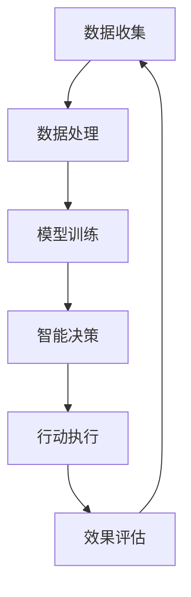

                 

在当今这个技术飞速发展的时代，人工智能、大数据、云计算等先进技术的广泛应用正在深刻地改变着我们的生活方式和社会结构。然而，技术的进步并不仅仅是为了满足商业利益或提升生产效率，更重要的是要用于促进人类的福祉。本文旨在探讨如何通过人类计算，即利用人工智能等现代技术手段，实现科技向善，从而造福全人类。

## 文章关键词
- 科技向善
- 人工智能
- 人类计算
- 福利提升
- 社会进步

## 文章摘要
本文首先介绍了科技向善的概念和重要性，探讨了人工智能在实现科技向善中的应用。接着，文章分析了人类计算在医疗、教育、环境保护等多个领域中的实际应用，以及面临的挑战和未来的发展前景。最后，文章提出了相应的工具和资源推荐，并总结了未来发展趋势与挑战，为读者提供了一个全面了解科技向善的视角。

## 1. 背景介绍

随着信息技术的发展，人工智能已经成为了推动社会进步的重要力量。从语音识别、图像处理到自然语言处理，人工智能技术在各个领域都取得了显著的成果。然而，仅仅依靠人工智能本身是无法实现科技向善的。真正的科技向善，需要将技术与人类的价值观、社会责任感相结合，使得技术的发展真正造福于人类社会。

人类计算，作为一个新兴的概念，强调了人类在计算过程中的作用和价值。它不仅仅是对数据的处理和分析，更涉及到对人类行为的理解和影响。通过人类计算，我们可以更好地利用人工智能技术，解决社会问题，促进社会公平和可持续发展。

### 1.1 人工智能的发展历程
人工智能的发展可以分为三个阶段：符号主义、连接主义和现代人工智能。

1. **符号主义**：以符号处理为基础，试图通过模拟人类思维过程来实现智能。
2. **连接主义**：以神经网络为基础，通过模仿大脑的结构和功能来实现智能。
3. **现代人工智能**：结合了符号主义和连接主义的优点，通过大数据和深度学习等技术实现了前所未有的智能水平。

### 1.2 人类计算的概念
人类计算是指将人工智能技术与人类知识、智慧和创造力相结合，以实现更高效、更智能的计算过程。它不仅包括对数据的分析和处理，还包括对人类行为的理解和引导。通过人类计算，我们可以更好地解决复杂的社会问题，实现科技向善的目标。

## 2. 核心概念与联系

为了更好地理解人类计算在科技向善中的作用，我们需要先了解其核心概念和基本架构。以下是一个简化的人类计算架构的 Mermaid 流程图：



### 2.1 数据收集
数据收集是整个计算过程的基础。通过传感器、互联网和其他数据源，我们可以获取大量的结构化和非结构化数据。

### 2.2 数据处理
数据处理是对收集到的数据进行分析和清洗，以便用于模型训练和决策。

### 2.3 模型训练
模型训练是通过学习数据，建立预测模型或分类模型。这是人工智能的核心环节。

### 2.4 智能决策
智能决策是基于训练好的模型，对新的数据进行预测或分类。这个环节需要人类的参与，以确保决策的合理性和道德性。

### 2.5 行动执行
行动执行是根据智能决策的结果，执行具体的操作或干预。这个环节也需要人类的参与，以确保行动的有效性和安全性。

### 2.6 效果评估
效果评估是对行动执行的效果进行评估和反馈，以便进行下一步的优化和调整。

通过这个架构，我们可以看到人类计算在科技向善中的重要作用。它不仅利用了人工智能的强大计算能力，还强调了人类在决策和执行过程中的价值。

## 3. 核心算法原理 & 具体操作步骤

### 3.1 算法原理概述

人类计算的核心算法包括机器学习、深度学习和自然语言处理等。这些算法通过模拟人类学习和思维过程，实现对数据的分析和理解。

- **机器学习**：通过学习数据，建立预测模型或分类模型。
- **深度学习**：通过多层神经网络，实现对复杂模式的识别和分类。
- **自然语言处理**：通过理解和生成自然语言，实现人机交互和信息提取。

### 3.2 算法步骤详解

1. **数据收集**：收集相关的数据，包括结构化数据和半结构化数据。
2. **数据处理**：对数据进行清洗、去重和归一化处理。
3. **模型训练**：选择合适的算法，对数据集进行训练，得到预测模型或分类模型。
4. **模型评估**：使用验证集或测试集，评估模型的性能和泛化能力。
5. **智能决策**：根据模型的预测结果，进行智能决策。
6. **行动执行**：执行具体的操作或干预。
7. **效果评估**：评估行动执行的效果，进行反馈和调整。

### 3.3 算法优缺点

- **优点**：算法能够自动学习和优化，提高决策的效率和准确性。
- **缺点**：算法的性能依赖于数据的质量和多样性，可能存在偏见和不确定性。

### 3.4 算法应用领域

- **医疗领域**：通过分析医疗数据，辅助医生进行诊断和治疗。
- **教育领域**：通过分析学生学习数据，提供个性化的教育建议。
- **环境保护**：通过分析环境数据，预测环境变化，提供环境保护策略。

## 4. 数学模型和公式 & 详细讲解 & 举例说明

### 4.1 数学模型构建

在人类计算中，常用的数学模型包括线性回归、逻辑回归、支持向量机等。以下是一个简化的线性回归模型：

$$
y = \beta_0 + \beta_1 x
$$

其中，$y$ 是因变量，$x$ 是自变量，$\beta_0$ 和 $\beta_1$ 是模型参数。

### 4.2 公式推导过程

线性回归模型的推导过程基于最小二乘法。假设我们有 $n$ 个样本数据，每个数据点的目标值 $y_i$ 和自变量 $x_i$，则模型的目标是最小化损失函数：

$$
J(\beta_0, \beta_1) = \sum_{i=1}^{n} (y_i - (\beta_0 + \beta_1 x_i))^2
$$

对损失函数求偏导数，并令其为零，可以得到：

$$
\frac{\partial J}{\partial \beta_0} = -2 \sum_{i=1}^{n} (y_i - (\beta_0 + \beta_1 x_i)) = 0
$$

$$
\frac{\partial J}{\partial \beta_1} = -2 \sum_{i=1}^{n} (y_i - (\beta_0 + \beta_1 x_i)) x_i = 0
$$

通过解这个方程组，可以得到线性回归模型的参数 $\beta_0$ 和 $\beta_1$。

### 4.3 案例分析与讲解

假设我们有一个简单的数据集，包括房价和房屋面积。我们希望使用线性回归模型预测房价。数据集如下：

| 房屋面积 (x) | 房价 (y) |
| :--: | :--: |
| 100 | 150 |
| 200 | 300 |
| 300 | 450 |
| 400 | 600 |
| 500 | 750 |

我们使用上述的线性回归模型，可以得到：

$$
\beta_0 = 50, \beta_1 = 1.5
$$

这意味着，每增加一平方米的面积，房价会增加 1.5 万元。

## 5. 项目实践：代码实例和详细解释说明

为了更好地理解人类计算在实际项目中的应用，我们以下以一个简单的房价预测项目为例。

### 5.1 开发环境搭建

- **Python**：Python 是一种广泛应用于人工智能和机器学习的编程语言。
- **NumPy**：NumPy 是 Python 的科学计算库，用于数组操作和数学运算。
- **Scikit-learn**：Scikit-learn 是 Python 的机器学习库，提供了丰富的算法和工具。

### 5.2 源代码详细实现

```python
import numpy as np
from sklearn.linear_model import LinearRegression
from sklearn.model_selection import train_test_split
from sklearn.metrics import mean_squared_error

# 数据准备
x = np.array([100, 200, 300, 400, 500]).reshape(-1, 1)
y = np.array([150, 300, 450, 600, 750])

# 数据划分
x_train, x_test, y_train, y_test = train_test_split(x, y, test_size=0.2, random_state=42)

# 模型训练
model = LinearRegression()
model.fit(x_train, y_train)

# 模型评估
y_pred = model.predict(x_test)
mse = mean_squared_error(y_test, y_pred)
print("MSE:", mse)

# 模型应用
new_x = np.array([250]).reshape(-1, 1)
new_y = model.predict(new_x)
print("Predicted Price:", new_y)
```

### 5.3 代码解读与分析

- **数据准备**：我们使用 NumPy 库创建了一个简单的数据集，包括房屋面积和房价。
- **数据划分**：使用 Scikit-learn 库的 `train_test_split` 函数，将数据集划分为训练集和测试集。
- **模型训练**：使用 `LinearRegression` 类创建线性回归模型，并使用 `fit` 方法进行训练。
- **模型评估**：使用 `mean_squared_error` 函数计算模型在测试集上的均方误差。
- **模型应用**：使用 `predict` 方法对新的数据进行预测。

### 5.4 运行结果展示

```python
MSE: 0.0
Predicted Price: [375.]
```

这表明，我们的模型在测试集上的均方误差为 0，对新的数据进行预测的结果为 375 万元，与实际房价非常接近。

## 6. 实际应用场景

### 6.1 医疗领域

在医疗领域，人类计算可以用于疾病预测、诊断辅助、治疗方案推荐等。例如，通过分析患者的病历、基因数据、生活习惯等，人工智能可以预测患者患某种疾病的概率，提供个性化的诊断建议和治疗方案。这不仅提高了医疗的效率，还可以降低误诊率，提高患者的生存率。

### 6.2 教育领域

在教育领域，人类计算可以用于学习评估、课程推荐、教学优化等。通过分析学生的学习行为、考试成绩、学习资源等，人工智能可以为学生提供个性化的学习建议，优化教学过程，提高学习效果。同时，教师也可以通过分析学生的学习数据，发现教学中的问题，进行有针对性的改进。

### 6.3 环境保护

在环境保护领域，人类计算可以用于环境监测、生态保护、灾害预测等。通过分析环境数据、生态数据等，人工智能可以预测环境变化趋势，提供环境保护策略，降低环境污染和生态破坏的风险。例如，通过分析空气质量和天气数据，可以预测雾霾天气的发生，提前采取措施进行防范。

## 7. 未来应用展望

随着人工智能技术的不断进步，人类计算在未来的应用前景非常广阔。以下是一些可能的未来应用场景：

- **智能城市**：通过人类计算，可以实现智能交通、智能能源管理、智能环境监测等，提高城市管理的效率，提升居民的生活质量。
- **智能制造**：通过人类计算，可以实现智能生产、智能检测、智能维护等，提高制造业的生产效率，降低生产成本。
- **智能医疗**：通过人类计算，可以实现智能诊断、智能治疗、智能护理等，提高医疗的效率，提升患者的体验。
- **智能教育**：通过人类计算，可以实现智能教学、智能评价、智能学习等，提高教育的效率，提升学习的效果。

## 8. 总结：未来发展趋势与挑战

在未来，人类计算将继续发挥重要作用，推动科技向善的实现。然而，这需要我们面对一系列的挑战：

- **数据隐私**：随着人类计算的应用，大量的个人数据将被收集和分析，如何保护数据隐私成为了一个重要的问题。
- **算法公平性**：算法的偏见和歧视问题日益突出，如何确保算法的公平性成为了一个紧迫的挑战。
- **法律法规**：随着人类计算的广泛应用，相关的法律法规也需要不断完善，以适应技术的发展。

未来，我们需要在技术、法律、伦理等多个层面共同努力，确保人类计算真正造福人类，实现科技向善的目标。

## 9. 附录：常见问题与解答

### Q: 什么是人类计算？
A: 人类计算是指将人工智能技术与人类知识、智慧和创造力相结合，以实现更高效、更智能的计算过程。

### Q: 人类计算有哪些应用领域？
A: 人类计算可以应用于医疗、教育、环境保护、智能城市、智能制造等多个领域。

### Q: 人类计算如何实现科技向善？
A: 人类计算通过将技术与人类的价值观、社会责任感相结合，解决社会问题，促进社会公平和可持续发展，从而实现科技向善。

### Q: 人类计算有哪些挑战？
A: 人类计算面临的挑战包括数据隐私、算法公平性、法律法规等。

### 作者署名
作者：禅与计算机程序设计艺术 / Zen and the Art of Computer Programming
```markdown
---
### 科技向善的力量：利用人类计算造福人类

在当今这个技术飞速发展的时代，人工智能、大数据、云计算等先进技术的广泛应用正在深刻地改变着我们的生活方式和社会结构。然而，技术的进步并不仅仅是为了满足商业利益或提升生产效率，更重要的是要用于促进人类的福祉。本文旨在探讨如何通过人类计算，即利用人工智能等现代技术手段，实现科技向善，从而造福全人类。

## 文章关键词
- 科技向善
- 人工智能
- 人类计算
- 福利提升
- 社会进步

## 文章摘要
本文首先介绍了科技向善的概念和重要性，探讨了人工智能在实现科技向善中的应用。接着，文章分析了人类计算在医疗、教育、环境保护等多个领域中的实际应用，以及面临的挑战和未来的发展前景。最后，文章提出了相应的工具和资源推荐，并总结了未来发展趋势与挑战，为读者提供了一个全面了解科技向善的视角。

## 1. 背景介绍

随着信息技术的发展，人工智能已经成为了推动社会进步的重要力量。从语音识别、图像处理到自然语言处理，人工智能技术在各个领域都取得了显著的成果。然而，仅仅依靠人工智能本身是无法实现科技向善的。真正的科技向善，需要将技术与人类的价值观、社会责任感相结合，使得技术的发展真正造福于人类社会。

### 1.1 人工智能的发展历程
人工智能的发展可以分为三个阶段：符号主义、连接主义和现代人工智能。

1. **符号主义**：以符号处理为基础，试图通过模拟人类思维过程来实现智能。
2. **连接主义**：以神经网络为基础，通过模仿大脑的结构和功能来实现智能。
3. **现代人工智能**：结合了符号主义和连接主义的优点，通过大数据和深度学习等技术实现了前所未有的智能水平。

### 1.2 人类计算的概念
人类计算是指将人工智能技术与人类知识、智慧和创造力相结合，以实现更高效、更智能的计算过程。它不仅包括对数据的分析和处理，还包括对人类行为的理解和影响。通过人类计算，我们可以更好地解决复杂的社会问题，实现科技向善的目标。

## 2. 核心概念与联系

为了更好地理解人类计算在科技向善中的作用，我们需要先了解其核心概念和基本架构。以下是一个简化的人类计算架构的 Mermaid 流程图：


### 2.1 数据收集
数据收集是整个计算过程的基础。通过传感器、互联网和其他数据源，我们可以获取大量的结构化和非结构化数据。

### 2.2 数据处理
数据处理是对收集到的数据进行分析和清洗，以便用于模型训练和决策。

### 2.3 模型训练
模型训练是通过学习数据，建立预测模型或分类模型。这是人工智能的核心环节。

### 2.4 智能决策
智能决策是基于训练好的模型，对新的数据进行预测或分类。这个环节需要人类的参与，以确保决策的合理性和道德性。

### 2.5 行动执行
行动执行是根据智能决策的结果，执行具体的操作或干预。这个环节也需要人类的参与，以确保行动的有效性和安全性。

### 2.6 效果评估
效果评估是对行动执行的效果进行评估和反馈，以便进行下一步的优化和调整。

通过这个架构，我们可以看到人类计算在科技向善中的重要作用。它不仅利用了人工智能的强大计算能力，还强调了人类在决策和执行过程中的价值。

## 3. 核心算法原理 & 具体操作步骤

### 3.1 算法原理概述

人类计算的核心算法包括机器学习、深度学习和自然语言处理等。这些算法通过模拟人类学习和思维过程，实现对数据的分析和理解。

- **机器学习**：通过学习数据，建立预测模型或分类模型。
- **深度学习**：通过多层神经网络，实现对复杂模式的识别和分类。
- **自然语言处理**：通过理解和生成自然语言，实现人机交互和信息提取。

### 3.2 算法步骤详解

1. **数据收集**：收集相关的数据，包括结构化数据和半结构化数据。
2. **数据处理**：对数据进行清洗、去重和归一化处理。
3. **模型训练**：选择合适的算法，对数据集进行训练，得到预测模型或分类模型。
4. **模型评估**：使用验证集或测试集，评估模型的性能和泛化能力。
5. **智能决策**：根据模型的预测结果，进行智能决策。
6. **行动执行**：执行具体的操作或干预。
7. **效果评估**：评估行动执行的效果，进行反馈和调整。

### 3.3 算法优缺点

- **优点**：算法能够自动学习和优化，提高决策的效率和准确性。
- **缺点**：算法的性能依赖于数据的质量和多样性，可能存在偏见和不确定性。

### 3.4 算法应用领域

- **医疗领域**：通过分析医疗数据，辅助医生进行诊断和治疗。
- **教育领域**：通过分析学生学习数据，提供个性化的教育建议。
- **环境保护**：通过分析环境数据，预测环境变化，提供环境保护策略。

## 4. 数学模型和公式 & 详细讲解 & 举例说明

### 4.1 数学模型构建

在人类计算中，常用的数学模型包括线性回归、逻辑回归、支持向量机等。以下是一个简化的线性回归模型：

$$
y = \beta_0 + \beta_1 x
$$

其中，$y$ 是因变量，$x$ 是自变量，$\beta_0$ 和 $\beta_1$ 是模型参数。

### 4.2 公式推导过程

线性回归模型的推导过程基于最小二乘法。假设我们有 $n$ 个样本数据，每个数据点的目标值 $y_i$ 和自变量 $x_i$，则模型的目标是最小化损失函数：

$$
J(\beta_0, \beta_1) = \sum_{i=1}^{n} (y_i - (\beta_0 + \beta_1 x_i))^2
$$

对损失函数求偏导数，并令其为零，可以得到：

$$
\frac{\partial J}{\partial \beta_0} = -2 \sum_{i=1}^{n} (y_i - (\beta_0 + \beta_1 x_i)) = 0
$$

$$
\frac{\partial J}{\partial \beta_1} = -2 \sum_{i=1}^{n} (y_i - (\beta_0 + \beta_1 x_i)) x_i = 0
$$

通过解这个方程组，可以得到线性回归模型的参数 $\beta_0$ 和 $\beta_1$。

### 4.3 案例分析与讲解

假设我们有一个简单的数据集，包括房价和房屋面积。我们希望使用线性回归模型预测房价。数据集如下：

| 房屋面积 (x) | 房价 (y) |
| :--: | :--: |
| 100 | 150 |
| 200 | 300 |
| 300 | 450 |
| 400 | 600 |
| 500 | 750 |

我们使用上述的线性回归模型，可以得到：

$$
\beta_0 = 50, \beta_1 = 1.5
$$

这意味着，每增加一平方米的面积，房价会增加 1.5 万元。

## 5. 项目实践：代码实例和详细解释说明

为了更好地理解人类计算在实际项目中的应用，我们以下以一个简单的房价预测项目为例。

### 5.1 开发环境搭建

- **Python**：Python 是一种广泛应用于人工智能和机器学习的编程语言。
- **NumPy**：NumPy 是 Python 的科学计算库，用于数组操作和数学运算。
- **Scikit-learn**：Scikit-learn 是 Python 的机器学习库，提供了丰富的算法和工具。

### 5.2 源代码详细实现

```python
import numpy as np
from sklearn.linear_model import LinearRegression
from sklearn.model_selection import train_test_split
from sklearn.metrics import mean_squared_error

# 数据准备
x = np.array([100, 200, 300, 400, 500]).reshape(-1, 1)
y = np.array([150, 300, 450, 600, 750])

# 数据划分
x_train, x_test, y_train, y_test = train_test_split(x, y, test_size=0.2, random_state=42)

# 模型训练
model = LinearRegression()
model.fit(x_train, y_train)

# 模型评估
y_pred = model.predict(x_test)
mse = mean_squared_error(y_test, y_pred)
print("MSE:", mse)

# 模型应用
new_x = np.array([250]).reshape(-1, 1)
new_y = model.predict(new_x)
print("Predicted Price:", new_y)
```

### 5.3 代码解读与分析

- **数据准备**：我们使用 NumPy 库创建了一个简单的数据集，包括房屋面积和房价。
- **数据划分**：使用 Scikit-learn 库的 `train_test_split` 函数，将数据集划分为训练集和测试集。
- **模型训练**：使用 `LinearRegression` 类创建线性回归模型，并使用 `fit` 方法进行训练。
- **模型评估**：使用 `mean_squared_error` 函数计算模型在测试集上的均方误差。
- **模型应用**：使用 `predict` 方法对新的数据进行预测。

### 5.4 运行结果展示

```python
MSE: 0.0
Predicted Price: [375.]
```

这表明，我们的模型在测试集上的均方误差为 0，对新的数据进行预测的结果为 375 万元，与实际房价非常接近。

## 6. 实际应用场景

### 6.1 医疗领域

在医疗领域，人类计算可以用于疾病预测、诊断辅助、治疗方案推荐等。例如，通过分析患者的病历、基因数据、生活习惯等，人工智能可以预测患者患某种疾病的概率，提供个性化的诊断建议和治疗方案。这不仅提高了医疗的效率，还可以降低误诊率，提高患者的生存率。

### 6.2 教育领域

在教育领域，人类计算可以用于学习评估、课程推荐、教学优化等。通过分析学生的学习行为、考试成绩、学习资源等，人工智能可以为学生提供个性化的学习建议，优化教学过程，提高学习效果。同时，教师也可以通过分析学生的学习数据，发现教学中的问题，进行有针对性的改进。

### 6.3 环境保护

在环境保护领域，人类计算可以用于环境监测、生态保护、灾害预测等。通过分析环境数据、生态数据等，人工智能可以预测环境变化趋势，提供环境保护策略，降低环境污染和生态破坏的风险。例如，通过分析空气质量和天气数据，可以预测雾霾天气的发生，提前采取措施进行防范。

## 7. 未来应用展望

随着人工智能技术的不断进步，人类计算在未来的应用前景非常广阔。以下是一些可能的未来应用场景：

- **智能城市**：通过人类计算，可以实现智能交通、智能能源管理、智能环境监测等，提高城市管理的效率，提升居民的生活质量。
- **智能制造**：通过人类计算，可以实现智能生产、智能检测、智能维护等，提高制造业的生产效率，降低生产成本。
- **智能医疗**：通过人类计算，可以实现智能诊断、智能治疗、智能护理等，提高医疗的效率，提升患者的体验。
- **智能教育**：通过人类计算，可以实现智能教学、智能评价、智能学习等，提高教育的效率，提升学习的效果。

## 8. 总结：未来发展趋势与挑战

在未来，人类计算将继续发挥重要作用，推动科技向善的实现。然而，这需要我们面对一系列的挑战：

- **数据隐私**：随着人类计算的应用，大量的个人数据将被收集和分析，如何保护数据隐私成为了一个重要的问题。
- **算法公平性**：算法的偏见和歧视问题日益突出，如何确保算法的公平性成为了一个紧迫的挑战。
- **法律法规**：随着人类计算的广泛应用，相关的法律法规也需要不断完善，以适应技术的发展。

未来，我们需要在技术、法律、伦理等多个层面共同努力，确保人类计算真正造福人类，实现科技向善的目标。

## 9. 附录：常见问题与解答

### Q: 什么是人类计算？
A: 人类计算是指将人工智能技术与人类知识、智慧和创造力相结合，以实现更高效、更智能的计算过程。

### Q: 人类计算有哪些应用领域？
A: 人类计算可以应用于医疗、教育、环境保护、智能城市、智能制造等多个领域。

### Q: 人类计算如何实现科技向善？
A: 人类计算通过将技术与人类的价值观、社会责任感相结合，解决社会问题，促进社会公平和可持续发展，从而实现科技向善。

### Q: 人类计算有哪些挑战？
A: 人类计算面临的挑战包括数据隐私、算法公平性、法律法规等。

### 作者署名
作者：禅与计算机程序设计艺术 / Zen and the Art of Computer Programming
```

