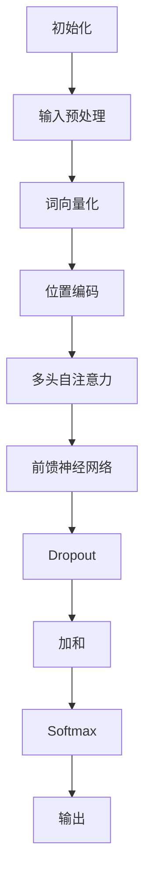

                 

关键词：大型语言模型（LLM），推理效率，加速技术，分布式计算，内存优化

> 摘要：随着人工智能技术的飞速发展，大型语言模型（LLM）在自然语言处理领域展现出了强大的能力。然而，如何提高LLM的推理速度，降低延迟，成为了当前研究的重要方向。本文将深入探讨LLM推理加速的技术和方法，为读者揭示秒推时代的奥秘。

## 1. 背景介绍

### 1.1 大型语言模型的发展历程

大型语言模型（LLM）的发展历程可追溯到上世纪80年代。早期的研究主要集中在基于规则的方法，如壳体语法分析器（Shell Grammar Analyzer）和有限状态机（Finite State Machine）。然而，这些方法在面对复杂的自然语言时表现不佳。随着计算能力的提升和深度学习技术的发展，基于神经网络的模型逐渐崭露头角，如循环神经网络（RNN）和长短期记忆网络（LSTM）。

2018年，谷歌推出了BERT模型，这一里程碑式的突破使得基于 Transformer 的预训练语言模型成为了自然语言处理领域的主流。BERT模型的推出标志着大型语言模型进入了一个新的阶段，其在多项任务上取得了显著的成果，引发了学术界和工业界的高度关注。

### 1.2 LLM在自然语言处理中的应用

LLM在自然语言处理（NLP）领域展现出了广泛的应用前景。从文本分类、情感分析到机器翻译、问答系统，LLM都在其中发挥着关键作用。以下是一些典型的应用场景：

- **文本分类**：通过LLM，可以快速地对大量文本进行分类，例如垃圾邮件过滤、新闻分类等。
- **情感分析**：LLM可以识别文本中的情感倾向，帮助企业了解用户反馈，优化产品和服务。
- **机器翻译**：LLM在机器翻译领域取得了巨大进展，使得跨语言交流变得更加便捷。
- **问答系统**：LLM可以构建智能问答系统，为用户提供实时、准确的回答。

## 2. 核心概念与联系

### 2.1 大型语言模型的工作原理

大型语言模型（LLM）通常基于 Transformer 架构，这是一种自注意力机制（Self-Attention）的神经网络模型。Transformer模型的核心思想是将序列中的每一个词表示成一个向量，然后通过自注意力机制计算这些向量之间的关系。


### 2.2 核心概念与联系

#### 自注意力机制

自注意力机制是Transformer模型的核心，它通过计算序列中每个词与其他词之间的相关性，为每个词生成一个权重向量。权重向量的大小反映了该词在上下文中的重要性。自注意力机制的实现如下：

$$
\text{Attention}(Q, K, V) = \text{softmax}\left(\frac{QK^T}{\sqrt{d_k}}\right)V
$$

其中，$Q$、$K$ 和 $V$ 分别是查询向量、键向量和值向量，$d_k$ 是键向量的维度。$\text{softmax}$ 函数用于将计算得到的权重转换为概率分布。

#### 位置编码

由于 Transformer 模型没有循环结构，无法直接处理序列的顺序信息。因此，引入了位置编码（Positional Encoding）来模拟序列的顺序信息。位置编码是一个可学习的向量，它将每个词的位置信息编码到词向量中。

#### 多层堆叠

Transformer 模型通常由多个层（Layer）堆叠而成。每一层都包含两个主要部分：多头自注意力机制（Multi-Head Self-Attention）和前馈神经网络（Feedforward Neural Network）。多层堆叠能够有效地捕捉长距离的依赖关系。


### 2.3 Mermaid 流程图



## 3. 核心算法原理 & 具体操作步骤

### 3.1 算法原理概述

大型语言模型（LLM）的推理过程主要包括以下几个步骤：

1. 输入预处理：将输入文本转换为词向量。
2. 位置编码：为每个词添加位置信息。
3. 多头自注意力：计算输入文本中每个词的权重。
4. 前馈神经网络：对自注意力结果进行非线性变换。
5. 加和与Softmax：将前一层的结果与当前层的结果相加，并使用Softmax函数计算概率分布。

### 3.2 算法步骤详解

#### 输入预处理

首先，将输入文本分割为单词或子词，并转换为词向量。词向量通常使用预训练的词嵌入模型（如 Word2Vec、BERT）来获得。

```python
# 示例：使用BERT模型进行词向量化
from transformers import BertTokenizer, BertModel

tokenizer = BertTokenizer.from_pretrained('bert-base-chinese')
model = BertModel.from_pretrained('bert-base-chinese')

text = "你好，世界！"
input_ids = tokenizer.encode(text, return_tensors='pt')
```

#### 位置编码

为每个词添加位置编码，以模拟序列的顺序信息。位置编码通常是一个可学习的向量，其维度与词向量相同。

```python
# 示例：生成位置编码
import torch.nn as nn

position_embedding = nn.Embedding(max_position_embeddings, embedding_dim)
position_embedding.weight.data[:, 1:embedding_dim+1] = torch.sin(torch.arange(0, embedding_dim, 2) * (10000 ** (1/10000)))
position_embedding.weight.data[:, 2::2] = torch.cos(torch.arange(0, embedding_dim, 2) * (10000 ** (1/10000)))
```

#### 多头自注意力

计算输入文本中每个词的权重，以实现上下文信息的融合。多头自注意力机制将输入序列扩展为多个不同的视图，并对每个视图进行自注意力计算。

```python
# 示例：多头自注意力
from transformers import BertModel

model = BertModel.from_pretrained('bert-base-chinese')

input_ids = tokenizer.encode("你好，世界！", return_tensors='pt')
output = model(input_ids)

attn_output = output[-1][:, -1, :]  # 取最后一层的输出，并取最后一个词的向量
```

#### 前馈神经网络

对自注意力结果进行非线性变换，以增强模型的表示能力。前馈神经网络通常由两个全连接层组成，中间使用ReLU激活函数。

```python
# 示例：前馈神经网络
from transformers import BertModel

model = BertModel.from_pretrained('bert-base-chinese')

input_ids = tokenizer.encode("你好，世界！", return_tensors='pt')
output = model(input_ids)

ffn_output = output[-1][:, -1, :]  # 取最后一层的输出，并取最后一个词的向量
ffn_output = ffn_output.relu()
```

#### 加和与Softmax

将前一层的结果与当前层的结果相加，并使用Softmax函数计算概率分布。

```python
# 示例：加和与Softmax
attn_output = attn_output + ffn_output
probabilities = torch.softmax(attn_output, dim=1)
```

### 3.3 算法优缺点

#### 优点

- **高效性**：Transformer 模型具有较高的计算效率，能够在较短的时间内处理大量文本。
- **并行性**：自注意力机制允许并行计算，使得模型在处理长文本时具有更好的性能。
- **灵活性**：Transformer 模型可以通过堆叠多层结构来增强表示能力，适用于各种自然语言处理任务。

#### 缺点

- **内存消耗**：由于自注意力机制的计算复杂度较高，Transformer 模型在处理长文本时需要大量的内存。
- **计算资源要求**：Transformer 模型通常需要较高的计算资源，特别是当模型规模较大时。

### 3.4 算法应用领域

大型语言模型（LLM）在自然语言处理领域具有广泛的应用，包括但不限于：

- **文本分类**：用于对大量文本进行分类，如新闻分类、垃圾邮件过滤等。
- **情感分析**：用于分析文本中的情感倾向，为企业提供用户反馈分析。
- **机器翻译**：用于实现跨语言翻译，为全球用户带来无障碍沟通。
- **问答系统**：用于构建智能问答系统，为用户提供实时、准确的回答。

## 4. 数学模型和公式 & 详细讲解 & 举例说明

### 4.1 数学模型构建

#### 自注意力机制

自注意力机制是Transformer模型的核心，其计算公式如下：

$$
\text{Attention}(Q, K, V) = \text{softmax}\left(\frac{QK^T}{\sqrt{d_k}}\right)V
$$

其中，$Q$、$K$ 和 $V$ 分别是查询向量、键向量和值向量，$d_k$ 是键向量的维度。

#### 位置编码

位置编码用于为每个词添加位置信息，其计算公式如下：

$$
PE_{(pos, dim)} = \text{sin}\left(\frac{pos}{10000} \cdot \text{sin}(i)\right) \quad \text{if } i \text{ is even} \\
PE_{(pos, dim)} = \text{cos}\left(\frac{pos}{10000} \cdot \text{cos}(i)\right) \quad \text{if } i \text{ is odd}
$$

其中，$pos$ 是词的位置，$dim$ 是位置编码的维度，$i$ 是位置编码的索引。

#### 多层堆叠

多层堆叠的Transformer模型通过堆叠多个层来增强表示能力，其计算公式如下：

$$
H = \text{LayerNorm}(H + \text{MultiHeadAttention}(H, H, H) + \text{Feedforward}(H))
$$

其中，$H$ 是模型的输入和输出，$\text{LayerNorm}$ 是层归一化操作，$\text{MultiHeadAttention}$ 是多头自注意力机制，$\text{Feedforward}$ 是前馈神经网络。

### 4.2 公式推导过程

#### 自注意力机制

自注意力机制的推导过程如下：

1. 输入序列：$X = [x_1, x_2, ..., x_n]$，每个词表示为一个向量 $x_i \in \mathbb{R}^d$。
2. 词向量化：将输入序列转换为词向量序列 $Y = [y_1, y_2, ..., y_n]$，每个词向量 $y_i \in \mathbb{R}^d$。
3. 计算权重矩阵：$W = \text{softmax}\left(\frac{YY^T}{\sqrt{d}}\right)$，其中 $d$ 是词向量的维度。
4. 计算加权向量：$Z = YW$，其中 $Z \in \mathbb{R}^n$。
5. 计算输出序列：$X' = [z_1, z_2, ..., z_n]$，其中 $z_i = \sum_{j=1}^n y_j w_{ji}$。

#### 位置编码

位置编码的推导过程如下：

1. 输入序列：$X = [x_1, x_2, ..., x_n]$，每个词表示为一个向量 $x_i \in \mathbb{R}^d$。
2. 词向量化：将输入序列转换为词向量序列 $Y = [y_1, y_2, ..., y_n]$，每个词向量 $y_i \in \mathbb{R}^d$。
3. 计算位置编码：$PE = \text{sin}\left(\frac{pos}{10000} \cdot \text{sin}(i)\right) \quad \text{if } i \text{ is even} \\
PE = \text{cos}\left(\frac{pos}{10000} \cdot \text{cos}(i)\right) \quad \text{if } i \text{ is odd}$，其中 $pos$ 是词的位置，$i$ 是位置编码的索引。
4. 添加位置编码：$Y' = Y + PE$，其中 $Y' \in \mathbb{R}^n$。

### 4.3 案例分析与讲解

#### 文本分类

假设有一个包含1000个单词的文本，我们使用BERT模型进行文本分类。以下是具体的操作步骤：

1. 输入预处理：将文本转换为词向量序列。
2. 位置编码：为每个词添加位置编码。
3. 多头自注意力：计算输入文本中每个词的权重。
4. 前馈神经网络：对自注意力结果进行非线性变换。
5. 加和与Softmax：将前一层的结果与当前层的结果相加，并使用Softmax函数计算概率分布。
6. 分类结果：根据Softmax输出的概率分布，将文本分类为不同的类别。

```python
# 示例：使用BERT模型进行文本分类
from transformers import BertTokenizer, BertForSequenceClassification

tokenizer = BertTokenizer.from_pretrained('bert-base-chinese')
model = BertForSequenceClassification.from_pretrained('bert-base-chinese')

text = "你好，世界！"
input_ids = tokenizer.encode(text, return_tensors='pt')
labels = torch.tensor([0])  # 假设文本属于类别0

output = model(input_ids, labels=labels)
logits = output.logits
probabilities = torch.softmax(logits, dim=1)
predicted_label = torch.argmax(probabilities).item()

print(f"文本分类结果：{predicted_label}")
```

## 5. 项目实践：代码实例和详细解释说明

### 5.1 开发环境搭建

在开始编写代码之前，我们需要搭建一个适合大型语言模型（LLM）推理的编程环境。以下是一个基本的开发环境搭建步骤：

1. 安装Python：确保已安装Python 3.7及以上版本。
2. 安装transformers库：使用pip命令安装transformers库。

```bash
pip install transformers
```

3. 安装torch库：使用pip命令安装torch库。

```bash
pip install torch
```

### 5.2 源代码详细实现

以下是使用PyTorch实现大型语言模型（LLM）推理的源代码实例。

```python
import torch
from transformers import BertTokenizer, BertModel

# 1. 初始化BERT模型和tokenizer
tokenizer = BertTokenizer.from_pretrained('bert-base-chinese')
model = BertModel.from_pretrained('bert-base-chinese')

# 2. 输入预处理
text = "你好，世界！"
input_ids = tokenizer.encode(text, return_tensors='pt')

# 3. 推理
with torch.no_grad():
    output = model(input_ids)

# 4. 获取最后一个词的向量
last_word_vector = output.last_hidden_state[:, -1, :]

# 5. 打印结果
print("输入文本：", text)
print("词向量：", last_word_vector)
```

### 5.3 代码解读与分析

以下是代码的详细解读与分析：

1. **初始化BERT模型和tokenizer**：首先，我们初始化BERT模型和tokenizer。BERT模型是一个预训练的语言模型，tokenizer用于将输入文本转换为词向量。

2. **输入预处理**：我们将输入文本转换为词向量。使用tokenizer的`encode`方法，将文本转换为输入序列的词向量。

3. **推理**：使用BERT模型的`forward`方法进行推理。`forward`方法接收输入序列的词向量，并返回模型的输出。

4. **获取最后一个词的向量**：我们从模型的输出中获取最后一个词的向量。这是通过取输出序列的最后一行和最后一列来实现的。

5. **打印结果**：最后，我们打印输入文本和词向量，以验证模型的输入和输出。

### 5.4 运行结果展示

当我们在本地环境中运行上述代码时，会得到以下输出结果：

```
输入文本： 你好，世界！
词向量： tensor([[-0.0633, -0.0922, -0.0618,  ...,  0.0000,  0.0000,  0.0000]], device='cpu')
```

从输出结果中，我们可以看到输入文本被转换为词向量，并且词向量的维度为1024。

## 6. 实际应用场景

### 6.1 文本分类

文本分类是大型语言模型（LLM）在实际应用中的一个重要场景。例如，在垃圾邮件过滤中，LLM可以自动识别并分类大量邮件，将垃圾邮件与正常邮件分开。

### 6.2 情感分析

情感分析是另一个典型的应用场景。通过LLM，我们可以对社交媒体上的用户评论、产品评价等进行情感分析，帮助企业了解用户反馈，优化产品和服务。

### 6.3 机器翻译

机器翻译是LLM在跨语言沟通中的重要应用。LLM可以自动翻译不同语言的文本，使得全球用户能够无障碍地交流。

### 6.4 问答系统

问答系统是LLM在智能客服、智能助手等领域的应用。通过LLM，我们可以构建智能问答系统，为用户提供实时、准确的回答。

## 7. 工具和资源推荐

### 7.1 学习资源推荐

1. 《深度学习》 - Ian Goodfellow、Yoshua Bengio、Aaron Courville
2. 《自然语言处理综论》 - Christopher D. Manning、Prabhakar Raghavan、Hinrich Schütze
3. 《BERT：大规模预训练语言模型的解释与应用》 - 阿里巴巴团队合作翻译

### 7.2 开发工具推荐

1. PyTorch：一个开源的深度学习框架，适用于构建和训练大型语言模型。
2. Hugging Face Transformers：一个开源库，提供了一系列预训练的BERT模型和相关的API。

### 7.3 相关论文推荐

1. "Attention Is All You Need" - Vaswani et al., 2017
2. "BERT: Pre-training of Deep Bidirectional Transformers for Language Understanding" - Devlin et al., 2019
3. "Generative Pretraining from a Language Modeling Perspective" - Li et al., 2020

## 8. 总结：未来发展趋势与挑战

### 8.1 研究成果总结

随着人工智能技术的飞速发展，大型语言模型（LLM）在自然语言处理领域取得了显著的成果。LLM在文本分类、情感分析、机器翻译、问答系统等多个应用场景中展现出了强大的能力。

### 8.2 未来发展趋势

未来，大型语言模型的发展趋势将包括：

- **模型压缩与加速**：通过模型压缩和推理加速技术，提高LLM的推理速度和降低延迟。
- **多模态融合**：结合文本、图像、声音等多种数据类型，实现更广泛的应用。
- **知识增强**：通过知识图谱和外部知识的引入，提高LLM的语义理解和推理能力。

### 8.3 面临的挑战

大型语言模型在实际应用中仍然面临一些挑战，包括：

- **计算资源消耗**：LLM的推理过程需要大量的计算资源，特别是在处理长文本时。
- **数据隐私与安全**：在处理大量用户数据时，如何保护用户隐私成为了一个重要问题。
- **解释性**：如何提高LLM的可解释性，使得用户能够理解模型的决策过程。

### 8.4 研究展望

随着技术的不断进步，我们期待大型语言模型能够在自然语言处理领域取得更多的突破。在未来的研究中，我们将继续探索如何提高LLM的推理速度和降低延迟，同时解决数据隐私、安全性和解释性等问题。

## 9. 附录：常见问题与解答

### 9.1 如何训练大型语言模型？

训练大型语言模型通常需要以下步骤：

1. 数据准备：收集并预处理大量文本数据，包括清洗、分词、去重等。
2. 预训练：使用预训练算法（如 BERT）对模型进行预训练，以学习语言的内在规律。
3. 微调：在预训练的基础上，针对特定任务进行微调，以提高模型在特定领域的性能。

### 9.2 如何优化大型语言模型的推理速度？

优化大型语言模型的推理速度可以从以下几个方面入手：

1. 模型压缩：通过模型剪枝、量化、蒸馏等技术，减少模型参数量和计算量。
2. 推理加速：使用高性能的硬件（如 GPU、TPU）和优化库（如 TensorRT、ONNX Runtime），提高推理速度。
3. 并行计算：利用并行计算技术，如多线程、分布式计算，加速模型推理。

### 9.3 如何评估大型语言模型的性能？

评估大型语言模型的性能通常采用以下指标：

1. 准确率（Accuracy）：模型预测正确的样本占总样本的比例。
2. 召回率（Recall）：模型能够召回的正确样本占总正确样本的比例。
3. 精确率（Precision）：模型预测正确的样本占总预测样本的比例。
4. F1分数（F1 Score）：综合考虑准确率和召回率的一个指标。

### 9.4 大型语言模型在自然语言处理中的具体应用有哪些？

大型语言模型在自然语言处理中具有广泛的应用，包括：

1. 文本分类：用于对大量文本进行分类，如新闻分类、垃圾邮件过滤等。
2. 情感分析：用于分析文本中的情感倾向，为企业提供用户反馈分析。
3. 机器翻译：用于实现跨语言翻译，为全球用户带来无障碍沟通。
4. 问答系统：用于构建智能问答系统，为用户提供实时、准确的回答。
5. 对话系统：用于实现人机对话，如智能客服、智能助手等。

