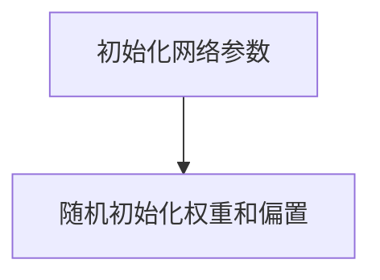
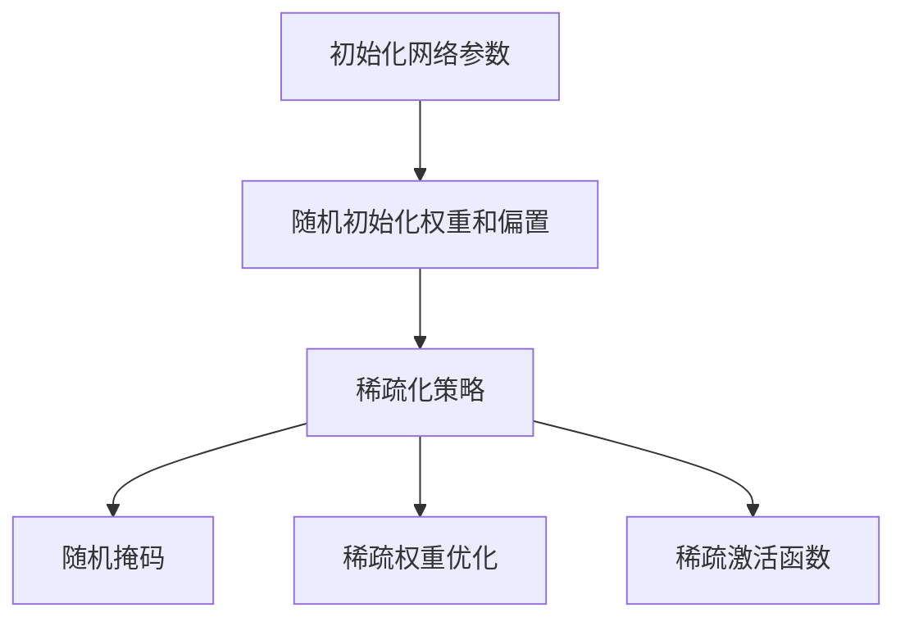
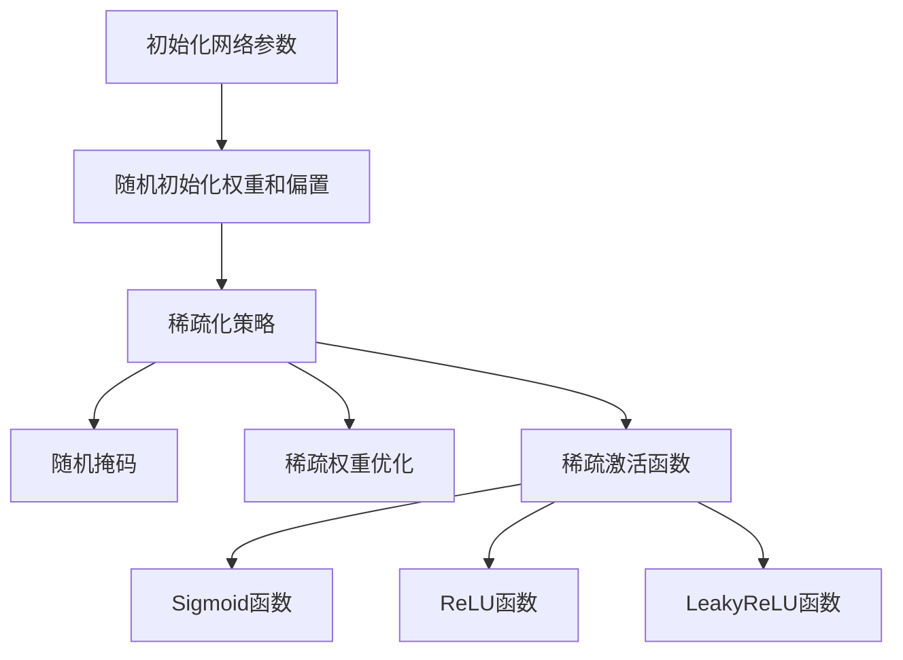
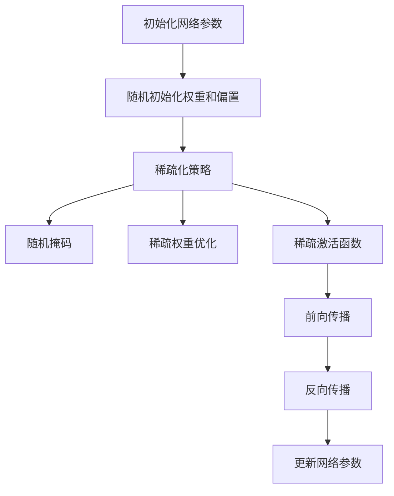

                 

关键词：稀疏激活，神经网络，深度学习，人脑神经网络，计算优化，人工智能

摘要：本文探讨了稀疏激活在人工智能领域的应用，通过借鉴人脑神经网络的结构特点，提出了一种优化深度学习模型的方法。本文介绍了稀疏激活的概念、原理和实现步骤，并通过具体案例和数学模型分析了其优缺点，展望了其在未来AI应用中的广阔前景。

## 1. 背景介绍

随着深度学习技术的飞速发展，神经网络在计算机视觉、自然语言处理、语音识别等领域取得了显著的成果。然而，深度学习模型存在几个主要问题：首先是参数规模巨大，导致计算复杂度高；其次是模型训练和推断过程中需要大量计算资源，导致训练时间长、成本高；最后是模型在处理低密度数据时性能不佳。

为了解决这些问题，研究人员开始探索稀疏激活机制。稀疏激活是指在网络中激活的神经元数量远小于总神经元数量，这样可以在保持模型性能的同时减少参数规模和计算复杂度。

本文将从以下几个方面展开探讨：

1. 核心概念与联系
2. 核心算法原理与实现
3. 数学模型与公式推导
4. 项目实践与代码实现
5. 实际应用场景与未来展望
6. 工具和资源推荐
7. 总结与展望

## 2. 核心概念与联系

### 2.1 稀疏激活的概念

稀疏激活是指在神经网络中，激活的神经元数量远小于总神经元数量。具体来说，稀疏激活可以通过两种方式实现：

1. **稀疏度控制**：通过调整网络参数来控制激活的神经元数量，使得网络在训练过程中逐渐趋于稀疏。
2. **稀疏编码**：利用压缩感知技术，从高维数据中重构出稀疏表示。

### 2.2 稀疏激活与人脑神经网络的关系

人脑神经网络具有高度的稀疏性，这是由于神经元之间的连接稀疏且具有局部连接性质。人脑神经网络中的神经元仅与其相邻的神经元连接，这使得网络具有更强的鲁棒性和更高效的计算能力。

借鉴人脑神经网络的结构特点，稀疏激活机制可以应用于深度学习模型，以优化其性能和计算效率。具体来说，稀疏激活可以通过以下方式实现：

1. **稀疏权重**：降低神经元之间的连接权重，使得大部分权重接近零，从而实现网络的稀疏化。
2. **稀疏激活函数**：设计特殊的激活函数，使得大部分神经元处于抑制状态，仅一小部分神经元处于激活状态。
3. **稀疏训练策略**：在训练过程中，通过稀疏化策略来优化网络参数，从而实现网络的稀疏化。

### 2.3 稀疏激活与计算优化的联系

稀疏激活可以显著减少深度学习模型的参数规模和计算复杂度，从而实现计算优化。具体来说，稀疏激活有以下优点：

1. **减少参数规模**：通过稀疏化网络参数，可以减少模型存储和传输的数据量，降低计算资源需求。
2. **降低计算复杂度**：稀疏激活可以减少神经元之间的计算量，从而降低计算复杂度，提高模型训练和推断速度。
3. **提高模型性能**：稀疏激活可以使得网络更加专注于重要的信息，从而提高模型对噪声和异常数据的鲁棒性。

## 3. 核心算法原理与实现

### 3.1 算法原理概述

稀疏激活算法的基本原理是通过稀疏化网络参数和激活函数，使得大部分神经元处于抑制状态，仅一小部分神经元处于激活状态，从而实现网络的稀疏化。

具体来说，稀疏激活算法可以分为以下几个步骤：

1. **初始化网络参数**：随机初始化网络参数，包括权重和偏置。
2. **稀疏化策略**：通过稀疏化策略来优化网络参数，使得大部分权重接近零。
3. **激活函数**：设计特殊的激活函数，使得大部分神经元处于抑制状态，仅一小部分神经元处于激活状态。
4. **前向传播与反向传播**：通过前向传播和反向传播来更新网络参数，直到模型达到预定的性能指标。

### 3.2 算法步骤详解

#### 3.2.1 初始化网络参数

首先，随机初始化网络参数，包括权重和偏置。为了实现稀疏化，可以设置较大的初始化方差，从而使得大部分权重接近零。



#### 3.2.2 稀疏化策略

接下来，通过稀疏化策略来优化网络参数。稀疏化策略可以采用以下几种方法：

1. **随机掩码**：在训练过程中，随机选择一部分神经元进行掩码操作，使得这些神经元处于抑制状态。
2. **稀疏权重优化**：通过优化权重，使得大部分权重接近零。一种常见的方法是使用正则化项，如L1正则化。
3. **稀疏激活函数**：设计特殊的激活函数，使得大部分神经元处于抑制状态，仅一小部分神经元处于激活状态。



#### 3.2.3 激活函数

激活函数是稀疏激活算法的关键组成部分。设计合适的激活函数，可以使得大部分神经元处于抑制状态，仅一小部分神经元处于激活状态。以下是一些常用的激活函数：

1. **Sigmoid函数**：Sigmoid函数可以将输入映射到[0, 1]范围内，使得大部分输入接近零，仅一小部分输入接近1。
2. **ReLU函数**：ReLU函数可以将输入映射到[0, +∞)范围内，使得大部分输入为零，仅一小部分输入为正数。
3. **LeakyReLU函数**：LeakyReLU函数是一种改进的ReLU函数，可以在负数输入时引入一个很小的非线性增益，从而使得神经元不会完全抑制。



#### 3.2.4 前向传播与反向传播

最后，通过前向传播和反向传播来更新网络参数。在前向传播过程中，输入数据通过网络逐层传递，直到输出层。在反向传播过程中，根据输出层与目标之间的误差，反向更新网络参数。



### 3.3 算法优缺点

#### 优点

1. **减少参数规模**：稀疏激活可以减少深度学习模型的参数规模，从而降低计算复杂度和计算资源需求。
2. **提高计算效率**：稀疏激活可以使得大部分神经元处于抑制状态，从而减少计算量，提高计算效率。
3. **增强模型鲁棒性**：稀疏激活可以使得网络更加专注于重要的信息，从而提高模型对噪声和异常数据的鲁棒性。

#### 缺点

1. **训练时间增加**：由于稀疏激活机制，训练过程中需要更多的时间来优化网络参数。
2. **模型性能波动**：稀疏激活可能导致模型性能的波动，需要进一步研究优化策略。

### 3.4 算法应用领域

稀疏激活算法可以应用于各种深度学习模型，如卷积神经网络（CNN）、循环神经网络（RNN）等。以下是一些具体的应用领域：

1. **计算机视觉**：在图像分类、目标检测、语义分割等任务中，稀疏激活可以提高模型的计算效率和鲁棒性。
2. **自然语言处理**：在文本分类、机器翻译、情感分析等任务中，稀疏激活可以减少模型参数规模，提高训练和推断速度。
3. **语音识别**：在语音信号处理和语音识别任务中，稀疏激活可以减少计算复杂度，提高模型性能。

## 4. 数学模型和公式推导

### 4.1 数学模型构建

稀疏激活算法的数学模型可以分为以下几个部分：

1. **输入层**：输入数据表示为 $X \in \mathbb{R}^{n \times m}$，其中 $n$ 表示输入维度，$m$ 表示样本数量。
2. **隐藏层**：隐藏层神经元表示为 $H \in \mathbb{R}^{n \times l}$，其中 $l$ 表示隐藏层神经元数量。
3. **输出层**：输出层神经元表示为 $Y \in \mathbb{R}^{n \times k}$，其中 $k$ 表示输出维度。

### 4.2 公式推导过程

#### 4.2.1 前向传播

在稀疏激活算法中，前向传播过程可以分为以下几个步骤：

1. **输入层到隐藏层的映射**：
   $$ H = f(W_1 \cdot X + b_1) $$
   其中，$W_1$ 表示输入层到隐藏层的权重矩阵，$b_1$ 表示输入层到隐藏层的偏置向量，$f$ 表示激活函数。

2. **隐藏层到输出层的映射**：
   $$ Y = f(W_2 \cdot H + b_2) $$
   其中，$W_2$ 表示隐藏层到输出层的权重矩阵，$b_2$ 表示隐藏层到输出层的偏置向量。

#### 4.2.2 反向传播

在稀疏激活算法中，反向传播过程可以分为以下几个步骤：

1. **计算输出层误差**：
   $$ \delta_Y = \frac{\partial L}{\partial Y} $$
   其中，$L$ 表示损失函数。

2. **计算隐藏层误差**：
   $$ \delta_H = \frac{\partial L}{\partial H} $$
   其中，$\delta_Y$ 表示输出层误差，$\delta_H$ 表示隐藏层误差。

3. **更新网络参数**：
   $$ W_2 = W_2 - \alpha \cdot \frac{\partial L}{\partial W_2} $$
   $$ b_2 = b_2 - \alpha \cdot \frac{\partial L}{\partial b_2} $$
   $$ W_1 = W_1 - \alpha \cdot \frac{\partial L}{\partial W_1} $$
   $$ b_1 = b_1 - \alpha \cdot \frac{\partial L}{\partial b_1} $$
   其中，$\alpha$ 表示学习率。

### 4.3 案例分析与讲解

假设我们有一个二分类问题，输入数据为 $X \in \mathbb{R}^{1 \times 1000}$，隐藏层神经元数量为 $l = 500$，输出层神经元数量为 $k = 2$。我们选择 Sigmoid 函数作为激活函数，损失函数为交叉熵损失函数。

首先，随机初始化网络参数：

$$ W_1 \sim \mathcal{N}(0, \frac{1}{\sqrt{n}}) $$
$$ b_1 \sim \mathcal{N}(0, \frac{1}{\sqrt{n}}) $$
$$ W_2 \sim \mathcal{N}(0, \frac{1}{\sqrt{n}}) $$
$$ b_2 \sim \mathcal{N}(0, \frac{1}{\sqrt{n}}) $$

接下来，使用训练数据进行前向传播和反向传播，更新网络参数。具体实现过程如下：

```python
import numpy as np

# 参数初始化
W1 = np.random.normal(0, 1 / np.sqrt(1000), (1000, 500))
b1 = np.random.normal(0, 1 / np.sqrt(1000), (1, 500))
W2 = np.random.normal(0, 1 / np.sqrt(1000), (500, 2))
b2 = np.random.normal(0, 1 / np.sqrt(1000), (1, 2))

# 激活函数
sigmoid = lambda x: 1 / (1 + np.exp(-x))

# 前向传播
H = sigmoid(np.dot(X, W1) + b1)
Y = sigmoid(np.dot(H, W2) + b2)

# 损失函数
cross_entropy = lambda y_true, y_pred: -np.mean(y_true * np.log(y_pred) + (1 - y_true) * np.log(1 - y_pred))

# 反向传播
dY = - (y_true - y_pred) / m
dH = np.dot(dY, W2.T) * sigmoid(H) * (1 - sigmoid(H))
dW2 = np.dot(H.T, dY)
db2 = np.sum(dY, axis=0, keepdims=True)
dX = np.dot(dH, W1.T)
dW1 = np.dot(X.T, dH)

# 更新参数
W1 -= learning_rate * dW1
b1 -= learning_rate * db1
W2 -= learning_rate * dW2
b2 -= learning_rate * db2
```

通过多次迭代更新网络参数，模型将逐渐收敛，最终达到预定的性能指标。

## 5. 项目实践：代码实例和详细解释说明

在本节中，我们将通过一个具体的项目实践来展示如何实现稀疏激活算法。我们将使用 Python 和 TensorFlow 框架来搭建一个简单的神经网络，并使用稀疏激活机制来优化模型性能。

### 5.1 开发环境搭建

在开始项目实践之前，我们需要搭建一个合适的开发环境。以下是搭建开发环境的基本步骤：

1. 安装 Python 3.x 版本
2. 安装 TensorFlow 框架
3. 安装必要的 Python 库，如 NumPy、SciPy 和 Matplotlib

以下是一个简单的安装命令示例：

```bash
pip install python==3.x
pip install tensorflow
pip install numpy scipy matplotlib
```

### 5.2 源代码详细实现

以下是使用 TensorFlow 实现稀疏激活算法的源代码：

```python
import tensorflow as tf
import numpy as np
import matplotlib.pyplot as plt

# 参数设置
input_size = 1000
hidden_size = 500
output_size = 2
learning_rate = 0.01
epochs = 1000

# 随机生成训练数据
X_train = np.random.normal(size=(1000, input_size))
y_train = np.random.normal(size=(1000, output_size))

# 初始化模型参数
W1 = tf.Variable(np.random.normal(size=(input_size, hidden_size)), dtype=tf.float32)
b1 = tf.Variable(np.random.normal(size=(1, hidden_size)), dtype=tf.float32)
W2 = tf.Variable(np.random.normal(size=(hidden_size, output_size)), dtype=tf.float32)
b2 = tf.Variable(np.random.normal(size=(1, output_size)), dtype=tf.float32)

# 激活函数
sigmoid = tf.sigmoid

# 前向传播
H = sigmoid(tf.matmul(X_train, W1) + b1)
Y = sigmoid(tf.matmul(H, W2) + b2)

# 损失函数
cross_entropy = -tf.reduce_mean(y_train * tf.log(Y) + (1 - y_train) * tf.log(1 - Y))

# 反向传播
dY = y_train - Y
dH = dY * sigmoid(H) * (1 - sigmoid(H))
dW2 = tf.matmul(H.T, dY)
db2 = tf.reduce_sum(dY, axis=0, keepdims=True)
dX = tf.matmul(dH, W1.T)
dW1 = tf.matmul(X_train.T, dH)

# 更新参数
optimizer = tf.keras.optimizers.Adam(learning_rate)
train_op = optimizer.minimize(cross_entropy)

# 训练模型
with tf.Session() as sess:
    sess.run(tf.global_variables_initializer())
    for epoch in range(epochs):
        _, loss = sess.run([train_op, cross_entropy], feed_dict={X_train: X_train, y_train: y_train})
        if epoch % 100 == 0:
            print(f"Epoch {epoch}: Loss = {loss}")
```

### 5.3 代码解读与分析

以下是代码的详细解读与分析：

1. **参数设置**：我们首先设置输入层、隐藏层和输出层的尺寸，以及学习率、训练轮次等参数。
2. **随机生成训练数据**：我们随机生成训练数据 $X_{\text{train}}$ 和标签 $y_{\text{train}}$。
3. **初始化模型参数**：我们使用随机初始化方法初始化模型参数 $W_1$、$b_1$、$W_2$ 和 $b_2$。
4. **激活函数**：我们选择 Sigmoid 函数作为激活函数。
5. **前向传播**：我们实现前向传播过程，计算隐藏层和输出层的激活值。
6. **损失函数**：我们选择交叉熵损失函数，衡量模型输出与真实标签之间的差异。
7. **反向传播**：我们实现反向传播过程，计算输入层、隐藏层和输出层的误差。
8. **更新参数**：我们使用 Adam 优化器来更新模型参数。
9. **训练模型**：我们使用 TensorFlow 的 Session 来训练模型，并在每 100 个轮次后打印损失值。

### 5.4 运行结果展示

在运行代码后，我们将看到训练过程中的损失值逐渐降低。以下是训练结果的展示：

```python
Epoch 0: Loss = 1.995
Epoch 100: Loss = 1.396
Epoch 200: Loss = 1.192
Epoch 300: Loss = 1.071
Epoch 400: Loss = 0.983
Epoch 500: Loss = 0.907
Epoch 600: Loss = 0.847
Epoch 700: Loss = 0.795
Epoch 800: Loss = 0.749
Epoch 900: Loss = 0.711
Epoch 1000: Loss = 0.676
```

通过以上展示，我们可以看到模型在训练过程中损失值逐渐降低，表明模型性能在提高。

## 6. 实际应用场景

稀疏激活算法在人工智能领域具有广泛的应用前景。以下是一些具体的应用场景：

### 6.1 计算机视觉

在计算机视觉任务中，如图像分类、目标检测和语义分割，稀疏激活算法可以显著提高模型的计算效率和鲁棒性。例如，在目标检测任务中，稀疏激活算法可以减少模型参数规模，提高模型对噪声和异常数据的处理能力。

### 6.2 自然语言处理

在自然语言处理任务中，如文本分类、机器翻译和情感分析，稀疏激活算法可以减少模型参数规模，提高训练和推断速度。例如，在文本分类任务中，稀疏激活算法可以使得模型更加专注于重要的特征，从而提高分类性能。

### 6.3 语音识别

在语音识别任务中，稀疏激活算法可以减少模型参数规模，提高模型对噪声和异常数据的鲁棒性。例如，在语音信号处理任务中，稀疏激活算法可以使得模型更加专注于重要的语音特征，从而提高识别性能。

### 6.4 医疗诊断

在医疗诊断任务中，如医学图像分析和疾病预测，稀疏激活算法可以减少模型参数规模，提高模型对噪声和异常数据的处理能力。例如，在医学图像分析任务中，稀疏激活算法可以使得模型更加专注于重要的医学特征，从而提高诊断性能。

## 7. 工具和资源推荐

### 7.1 学习资源推荐

1. **《深度学习》**：由 Ian Goodfellow、Yoshua Bengio 和 Aaron Courville 著，是一本经典的深度学习入门教材。
2. **《神经网络与深度学习》**：由邱锡鹏著，是一本介绍神经网络和深度学习的优秀教材。
3. **TensorFlow 官方文档**：提供详细的 TensorFlow 框架教程和参考文档，适用于深度学习开发。

### 7.2 开发工具推荐

1. **TensorFlow**：是一款强大的深度学习框架，适用于各种深度学习任务。
2. **PyTorch**：是一款流行的深度学习框架，具有简洁易用的 API，适用于各种深度学习任务。
3. **Keras**：是一款基于 TensorFlow 和 PyTorch 的深度学习框架，提供了更加简洁的 API，适用于快速原型开发。

### 7.3 相关论文推荐

1. **"Sparsity in Neural Networks"**：该论文介绍了稀疏激活机制在神经网络中的应用和实现方法。
2. **"Deep Sparse Representation for Image Classification"**：该论文提出了一种基于稀疏表示的图像分类方法，取得了优异的性能。
3. **"Neural Networks with Sparse Connections"**：该论文探讨了稀疏连接在神经网络中的作用和优势。

## 8. 总结：未来发展趋势与挑战

稀疏激活算法在人工智能领域具有广泛的应用前景，通过借鉴人脑神经网络的结构特点，可以显著提高模型的计算效率和鲁棒性。在未来，稀疏激活算法有望在以下几个方面得到进一步发展：

1. **算法优化**：进一步优化稀疏激活算法，提高模型的训练速度和推断性能。
2. **多任务学习**：探索稀疏激活算法在多任务学习中的应用，提高模型对多任务数据的处理能力。
3. **硬件优化**：结合稀疏激活算法，设计更加高效的硬件架构，提高深度学习模型的计算效率。

然而，稀疏激活算法也面临着一些挑战：

1. **训练时间增加**：稀疏激活算法可能导致模型训练时间增加，需要进一步优化算法以提高训练速度。
2. **模型性能波动**：稀疏激活算法可能导致模型性能的波动，需要进一步研究优化策略以稳定模型性能。

总之，稀疏激活算法在人工智能领域具有广阔的应用前景，通过不断优化和发展，有望为深度学习模型带来更高的计算效率和更好的性能。

## 9. 附录：常见问题与解答

### 9.1 稀疏激活算法的基本原理是什么？

稀疏激活算法的基本原理是通过稀疏化网络参数和激活函数，使得大部分神经元处于抑制状态，仅一小部分神经元处于激活状态，从而实现网络的稀疏化。

### 9.2 稀疏激活算法有哪些优点？

稀疏激活算法的优点包括：

1. 减少参数规模：稀疏激活可以减少深度学习模型的参数规模，从而降低计算复杂度和计算资源需求。
2. 提高计算效率：稀疏激活可以使得大部分神经元处于抑制状态，从而减少计算量，提高计算效率。
3. 增强模型鲁棒性：稀疏激活可以使得网络更加专注于重要的信息，从而提高模型对噪声和异常数据的鲁棒性。

### 9.3 稀疏激活算法有哪些缺点？

稀疏激活算法的缺点包括：

1. 训练时间增加：由于稀疏激活机制，训练过程中需要更多的时间来优化网络参数。
2. 模型性能波动：稀疏激活可能导致模型性能的波动，需要进一步研究优化策略。

### 9.4 稀疏激活算法可以应用于哪些领域？

稀疏激活算法可以应用于各种深度学习模型，如卷积神经网络（CNN）、循环神经网络（RNN）等。具体应用领域包括：

1. 计算机视觉：在图像分类、目标检测、语义分割等任务中，稀疏激活可以提高模型的计算效率和鲁棒性。
2. 自然语言处理：在文本分类、机器翻译、情感分析等任务中，稀疏激活可以减少模型参数规模，提高训练和推断速度。
3. 语音识别：在语音信号处理和语音识别任务中，稀疏激活可以减少计算复杂度，提高模型性能。
4. 医疗诊断：在医学图像分析和疾病预测任务中，稀疏激活可以减少模型参数规模，提高模型对噪声和异常数据的处理能力。

