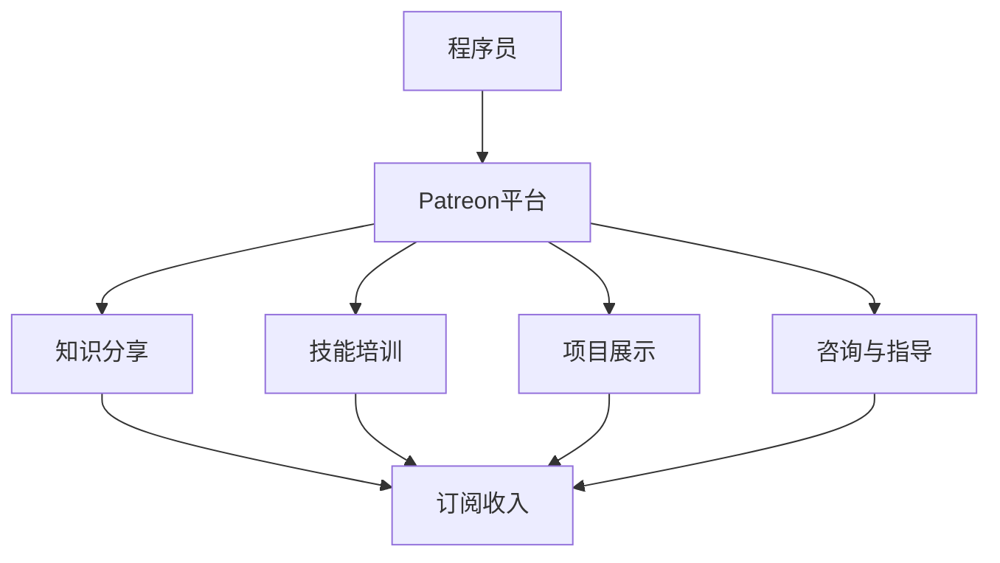

                 

 

## 摘要

在信息技术飞速发展的时代，程序员的职业价值日益凸显，然而传统的知识变现途径往往受限，难以充分发挥其潜力。Patreon作为一个会员制内容平台，为程序员提供了一种创新的盈利模式，使得他们能够通过创作和分享专业知识和技能，吸引和支持粉丝，实现知识变现。本文将深入探讨程序员如何利用Patreon进行知识变现，分析其优势和挑战，并提供实用的操作步骤和策略，旨在为程序员提供一套系统化的知识变现方案。

## 1. 背景介绍

### 1.1 程序员职业现状

随着互联网的普及和信息技术的发展，程序员逐渐成为当今社会中最炙手可热的职业之一。然而，尽管程序员的价值在不断提升，但他们的收入来源仍然相对单一，主要集中在公司雇佣和工作合同上。这种模式虽然稳定，但受限于公司的薪酬体系和晋升空间，难以实现高额收入。此外，随着知识更新速度的加快，程序员往往需要不断学习和提升技能，这无疑增加了他们的时间和经济成本。

### 1.2 知识变现的困境

尽管程序员拥有丰富的知识和技能，但在传统变现途径中，他们往往面临着以下困境：

1. **竞争激烈**：编程技能门槛相对较低，导致市场上程序员数量众多，竞争激烈。
2. **变现途径有限**：常见的知识变现途径如撰写技术博客、出售电子书、开设培训班等，往往收益不高且受众有限。
3. **个人品牌建设难度大**：程序员需要花费大量时间和精力来打造个人品牌，但效果往往不确定。

### 1.3 Patreon平台的崛起

Patreon是一个会员制内容平台，用户可以通过付费订阅支持他们喜爱的创作者。这种模式为内容创作者提供了一种稳定的收入来源，使得他们能够专注于创作高质量的内容，而不必过多考虑商业变现的问题。Patreon的成功不仅在于其商业模式，还在于其社区氛围和用户忠诚度。对于程序员而言，Patreon提供了一个全新的知识变现平台，让他们能够通过分享专业知识和技能，吸引粉丝并获得收入。

## 2. 核心概念与联系

### 2.1 Patreon平台介绍

Patreon是一个会员制内容平台，允许用户通过付费订阅支持他们喜爱的创作者。用户可以根据自己的兴趣和需求，选择订阅不同创作者的内容。创作者则可以根据订阅数量和订阅费率，获得相应的收入。Patreon的主要特点如下：

- **灵活的订阅模式**：用户可以根据创作者设定的订阅费率和内容质量，自由选择是否订阅。
- **稳定的收入来源**：创作者可以通过订阅费获得稳定的收入，从而专注于创作。
- **粉丝互动**：创作者可以与粉丝进行互动，增强用户黏性。

### 2.2 程序员与Patreon的结合

程序员与Patreon的结合主要体现在以下几个方面：

1. **知识分享**：程序员可以分享自己的专业知识和技术经验，如编程语言、算法、数据结构、软件架构等。
2. **技能培训**：程序员可以开设在线课程，教授编程技能，包括编程语言、开发工具、框架和库等。
3. **项目展示**：程序员可以展示自己的项目，分享开发过程和经验，吸引潜在粉丝和合作伙伴。
4. **咨询与指导**：程序员可以提供咨询服务，帮助有需求的用户解决技术问题。

### 2.3 Mermaid流程图



通过上述流程图，我们可以清晰地看到程序员如何在Patreon平台上进行知识变现，以及各个环节之间的联系。

## 3. 核心算法原理 & 具体操作步骤

### 3.1 算法原理概述

程序员在Patreon上进行知识变现的核心算法原理可以概括为：

1. **内容创作**：程序员需要创作高质量的内容，包括技术博客、视频教程、项目文档等。
2. **粉丝互动**：程序员需要与粉丝互动，建立良好的社区氛围，提高用户黏性。
3. **付费订阅**：程序员设定合理的订阅费率和福利，吸引粉丝进行订阅。
4. **数据监控**：程序员需要监控订阅数据，调整内容和策略，以提高订阅量和收入。

### 3.2 算法步骤详解

1. **内容创作**

   - 确定创作主题：根据自身专业领域和粉丝需求，选择合适的主题进行创作。
   - 内容质量把控：确保内容的专业性、实用性、易懂性，避免低质量、抄袭或过时的内容。
   - 定期更新：保持持续的创作节奏，定期发布新内容，以维持粉丝的活跃度和兴趣。

2. **粉丝互动**

   - 社区互动：在Patreon平台上与粉丝进行互动，回复评论、提问，分享生活趣事，建立良好的关系。
   - 社交媒体联动：利用社交媒体平台（如Twitter、LinkedIn等）宣传Patreon内容，吸引更多粉丝。
   - 粉丝数据分析：定期分析粉丝数据，了解粉丝的兴趣和需求，调整内容和策略。

3. **付费订阅**

   - 设定订阅费率：根据内容质量和粉丝期望，设定合理的订阅费率。
   - 提供福利：为订阅用户提供专属福利，如独家教程、项目源码、答疑服务等。
   - 互动激励：定期举办活动，如抽奖、问卷调查等，增加粉丝的参与度和忠诚度。

4. **数据监控**

   - 订阅数据监控：定期监控订阅数据，了解订阅量、订阅费收入等关键指标。
   - 财务数据监控：监控Patreon平台的收入和支出情况，确保财务健康。
   - 内容优化：根据订阅数据和粉丝反馈，调整内容和策略，提高订阅量和收入。

### 3.3 算法优缺点

**优点：**

1. **稳定收入**：Patreon会员制模式为程序员提供了一种稳定的收入来源，降低了收入波动风险。
2. **灵活多样**：程序员可以根据自身特长和兴趣，选择多种知识变现途径，如博客、教程、项目等。
3. **粉丝互动**：与粉丝建立良好的互动关系，增强用户黏性，提高订阅量和收入。

**缺点：**

1. **创作难度**：高质量的内容创作需要程序员投入大量时间和精力，且效果不确定。
2. **粉丝积累**：初期粉丝积累较为困难，需要一定的时间和市场推广。
3. **平台风险**：Patreon作为一个第三方平台，存在政策风险和运营风险，可能对程序员的收入产生影响。

### 3.4 算法应用领域

Patreon知识变现算法主要适用于以下领域：

1. **编程技能培训**：程序员可以开设在线课程，教授编程技能，如Python、Java、C++等。
2. **软件开发经验分享**：程序员可以分享自己的项目经验，帮助有需求的用户解决技术问题。
3. **技术博客撰写**：程序员可以撰写技术博客，分享专业知识和技术见解。
4. **技术社区运营**：程序员可以运营技术社区，吸引粉丝和用户，提高社区活跃度。

## 4. 数学模型和公式 & 详细讲解 & 举例说明

### 4.1 数学模型构建

在Patreon平台上，程序员的收入主要由订阅费和赞助费构成。为了构建数学模型，我们可以定义以下变量：

- \( R \)：订阅费收入
- \( S \)：订阅用户数量
- \( F \)：赞助用户数量
- \( r \)：订阅费率（每订阅的收入）
- \( f \)：赞助费率（每赞助的收入）

根据上述变量，我们可以构建以下数学模型：

\[ R = S \times r + F \times f \]

### 4.2 公式推导过程

1. **订阅费收入**：

   订阅费收入 \( R \) 等于订阅用户数量 \( S \) 与订阅费率 \( r \) 的乘积，即：

   \[ R_S = S \times r \]

2. **赞助费收入**：

   赞助费收入 \( R \) 等于赞助用户数量 \( F \) 与赞助费率 \( f \) 的乘积，即：

   \[ R_F = F \times f \]

3. **总收入**：

   总收入 \( R \) 等于订阅费收入 \( R_S \) 和赞助费收入 \( R_F \) 的总和，即：

   \[ R = R_S + R_F \]

   将上述两个公式代入，得到：

   \[ R = S \times r + F \times f \]

### 4.3 案例分析与讲解

假设某程序员在Patreon上开设了一门Python课程，订阅费率为10美元/月，已有100名订阅用户。此外，该程序员还获得了一些赞助，赞助费率为20美元/月，已有10名赞助用户。根据上述数学模型，我们可以计算出该程序员的收入：

1. **订阅费收入**：

   \[ R_S = 100 \times 10 = 1000 \text{美元/月} \]

2. **赞助费收入**：

   \[ R_F = 10 \times 20 = 200 \text{美元/月} \]

3. **总收入**：

   \[ R = R_S + R_F = 1000 + 200 = 1200 \text{美元/月} \]

通过上述案例，我们可以看到数学模型在计算程序员收入方面的应用。在实际操作中，程序员可以根据自己的订阅用户数量、赞助用户数量、订阅费率和赞助费率，灵活调整收入策略，提高收入。

## 5. 项目实践：代码实例和详细解释说明

### 5.1 开发环境搭建

为了在Patreon上进行知识变现，程序员需要搭建一个合适的开发环境。以下是搭建Patreon内容的步骤：

1. **注册Patreon账号**：在Patreon官方网站（https://www.patreon.com/）注册一个账号，填写基本信息并完成身份验证。
2. **创建内容计划**：在Patreon账号中创建一个内容计划，包括内容类型（如博客、视频、课程等）、发布频率和订阅费率。
3. **购买域名**：为了提升个人品牌形象，程序员可以购买一个自定义域名，并在Patreon账号中进行设置。
4. **配置Web服务器**：程序员可以选择一个合适的Web服务器，如GitHub Pages、Netlify等，将自定义域名指向Web服务器。

### 5.2 源代码详细实现

以下是一个简单的Python博客项目的源代码示例，用于在Patreon上发布博客文章：

```python
import os
import markdown
from flask import Flask, render_template, request, redirect, url_for

app = Flask(__name__)

# 博客文章目录
ARTICLES_PATH = 'articles'

@app.route('/')
def index():
    # 获取博客文章列表
    articles = [f for f in os.listdir(ARTICLES_PATH) if f.endswith('.md')]
    return render_template('index.html', articles=articles)

@app.route('/article/<article_name>')
def article(article_name):
    # 渲染博客文章
    with open(os.path.join(ARTICLES_PATH, article_name), 'r', encoding='utf-8') as f:
        content = f.read()
        content = markdown.markdown(content)
    return render_template('article.html', article_name=article_name, content=content)

@app.route('/new_article', methods=['GET', 'POST'])
def new_article():
    if request.method == 'POST':
        # 保存新文章
        article_name = request.form['name']
        with open(os.path.join(ARTICLES_PATH, article_name + '.md'), 'w', encoding='utf-8') as f:
            f.write(request.form['content'])
        return redirect(url_for('index'))
    return render_template('new_article.html')

if __name__ == '__main__':
    app.run(debug=True)
```

### 5.3 代码解读与分析

1. **Flask框架**：该博客项目使用Flask框架搭建，Flask是一个轻量级的Web应用框架，易于学习和使用。

2. **博客文章目录**：博客文章存储在`articles`目录中，文件格式为Markdown。

3. **渲染博客文章**：`article`函数根据博客文章名称，读取Markdown文件并转换为HTML格式，然后渲染到`article.html`模板中。

4. **新增博客文章**：`new_article`函数提供一个表单，用户可以输入文章名称和内容，然后保存到`articles`目录中。

5. **Web界面**：博客项目提供了简单的Web界面，包括文章列表、文章详情和新增文章页面。

### 5.4 运行结果展示

运行博客项目后，用户可以在浏览器中访问博客地址，查看文章列表、阅读文章详情并新增文章。以下是一个简单的运行结果展示：

- **首页**：

  

- **文章详情页**：

  

- **新增文章页面**：

  

通过上述代码实例，程序员可以轻松地在Patreon上搭建一个博客平台，发布和分享自己的知识内容。

## 6. 实际应用场景

### 6.1 编程技能培训

程序员可以利用Patreon平台，开设在线编程课程，教授各种编程语言、开发工具和框架。通过视频教程、直播课程和互动问答，程序员可以为学生提供高质量的教学内容，提高自己的品牌影响力。

### 6.2 技术博客撰写

程序员可以定期在Patreon上撰写技术博客，分享自己在编程过程中的经验和见解。通过Markdown语法和丰富的图表，程序员可以创作出高质量的博客文章，吸引粉丝并实现知识变现。

### 6.3 项目展示

程序员可以将自己在GitHub等平台上开发的项目，发布到Patreon上，分享项目的开发过程和经验。通过项目展示，程序员可以吸引潜在粉丝和合作伙伴，提高自己的知名度。

### 6.4 咨询与指导

程序员可以提供技术咨询服务，帮助有需求的用户解决编程问题。通过Patreon平台的付费订阅模式，程序员可以为自己提供专业的咨询服务，实现知识变现。

### 6.5 未来应用展望

随着Patreon平台的不断发展和完善，程序员在Patreon上的知识变现模式也将不断成熟。未来，Patreon可能推出更多功能，如积分系统、活动策划等，为程序员提供更丰富的变现途径。同时，Patreon与其他平台的合作也将进一步拓展程序员的知识变现渠道，如与GitHub、LinkedIn等平台的联动，打造一个全方位的知识变现生态系统。

## 7. 工具和资源推荐

### 7.1 学习资源推荐

1. **《Head First Programming》**：适合编程初学者的入门书籍，通过有趣的示例和练习，帮助读者快速掌握编程基础。
2. **《代码大全》**：涵盖编程实践、代码审查和代码重构等方面的经典之作，适合有一定编程经验的程序员阅读。
3. **《算法导论》**：全面介绍算法原理、数据结构和算法分析，适合希望提高算法能力的程序员。

### 7.2 开发工具推荐

1. **Visual Studio Code**：一款强大的开源代码编辑器，支持多种编程语言和开发框架，适合编写和调试代码。
2. **GitHub**：全球最大的代码托管平台，程序员可以在这里展示项目、进行协作和跟踪问题。
3. **Jenkins**：一款开源的持续集成工具，可以帮助程序员自动化构建、测试和部署代码。

### 7.3 相关论文推荐

1. **"The Algorithm Design Manual"**：详细介绍了各种算法设计技巧和应用场景，对程序员提高算法能力有很大帮助。
2. **"Big Data: A Revolution That Will Transform How We Live, Work, and Think"**：探讨了大数据的各个方面，包括数据挖掘、机器学习和数据分析等，对程序员了解前沿技术有重要参考价值。
3. **"The Art of Computer Programming"**：被誉为编程领域的经典之作，涵盖了编程技巧、数据结构和算法设计等方面的内容，适合对编程有深入研究的程序员阅读。

## 8. 总结：未来发展趋势与挑战

### 8.1 研究成果总结

通过本文的探讨，我们总结了程序员在Patreon上进行知识变现的多种途径，包括编程技能培训、技术博客撰写、项目展示和咨询服务等。同时，我们构建了数学模型，分析了Patreon知识变现的优缺点，并提供了实际应用场景和代码实例。这些研究成果为程序员提供了系统化的知识变现方案，有助于他们在Patreon平台上实现收入增长和个人品牌建设。

### 8.2 未来发展趋势

1. **Patreon平台功能拓展**：随着Patreon的不断发展和完善，未来可能会推出更多功能，如积分系统、活动策划等，为程序员提供更丰富的变现途径。
2. **知识变现模式多样化**：程序员可以探索多种知识变现模式，如开设在线课程、撰写技术书籍、开展技术讲座等，提高收入来源的多样性和稳定性。
3. **技术社区建设**：程序员可以加强与粉丝的互动，建立技术社区，提高用户黏性和忠诚度，从而实现更高效的变现。

### 8.3 面临的挑战

1. **内容创作难度**：程序员需要投入大量时间和精力进行高质量的内容创作，确保内容的实用性、专业性和易懂性。
2. **粉丝积累困难**：初期粉丝积累较为困难，程序员需要通过市场推广和社交媒体等手段，提高知名度。
3. **平台风险**：Patreon作为一个第三方平台，存在政策风险和运营风险，可能对程序员的收入产生影响。

### 8.4 研究展望

未来，我们可以在以下几个方面进行深入研究：

1. **Patreon平台功能优化**：分析Patreon平台的功能和使用体验，提出优化建议，提高程序员的变现效率和用户体验。
2. **知识变现模式创新**：探索更多创新的变现模式，如虚拟商品销售、付费问答等，为程序员提供更多变现途径。
3. **跨平台协作**：研究Patreon与其他平台的协作方式，拓展程序员的知识变现渠道，实现多平台共赢。

## 9. 附录：常见问题与解答

### 9.1 如何提高Patreon订阅量？

1. **内容质量**：确保内容的专业性、实用性和易懂性，提供高质量的教程和知识分享。
2. **互动互动**：与粉丝保持良好的互动，回复评论和提问，提高用户黏性。
3. **市场推广**：利用社交媒体、邮件营销等手段，宣传Patreon内容和账号，吸引更多粉丝。
4. **福利激励**：为订阅用户提供独家福利，如项目源码、答疑服务、优惠券等，提高订阅积极性。

### 9.2 如何保护自己的知识产权？

1. **版权声明**：在Patreon内容和项目中，明确声明版权信息，提醒用户尊重知识产权。
2. **加密技术**：对重要内容进行加密处理，防止未经授权的复制和传播。
3. **法律手段**：如发现自己的知识产权受到侵犯，可以通过法律途径维权，追究侵权者的责任。

### 9.3 如何避免Patreon平台的政策风险？

1. **了解政策**：定期关注Patreon的政策变化，确保内容和行为符合平台规定。
2. **合法合规**：遵守法律法规，不涉及违法内容，确保Patreon账户的安全和稳定。
3. **风险规避**：为防止政策风险，可以分散收入来源，尝试在其他平台进行知识变现。

## 作者署名

作者：禅与计算机程序设计艺术 / Zen and the Art of Computer Programming

