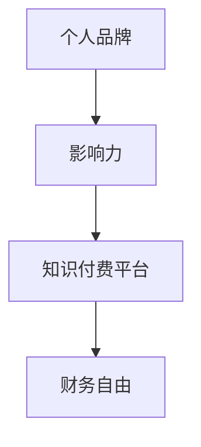

                 

关键词：知识付费、财务自由、程序员、在线教育、个人品牌、影响力

> 摘要：本文将探讨程序员如何通过知识付费平台，利用自己的专业技能和经验，打造个人品牌，实现财务自由。我们将详细分析知识付费的市场现状，分享成功案例，并提供实用的策略和建议。

## 1. 背景介绍

在数字化时代，知识付费已经成为一个热门的领域。随着在线教育的兴起，越来越多的程序员开始将自己的专业技能和经验通过知识付费平台分享给大众。这不仅为他们提供了额外的收入来源，也有助于提升个人品牌和影响力。

### 1.1 知识付费市场现状

近年来，知识付费市场呈现快速增长态势。据相关数据显示，2019 年中国知识付费市场规模已达到 319 亿元，预计未来几年还将保持高速增长。其中，程序员作为高技能人才，对知识付费的需求尤为强烈。

### 1.2 程序员的优势

程序员具有以下几个方面的优势：

1. **专业技能**：程序员具备编程、算法、数据结构等方面的专业知识，能够为学习者提供高质量的教学内容。
2. **实践经验**：程序员在工作中积累了丰富的实践经验，能够为学习者提供实用的案例和解决方案。
3. **学习能力强**：程序员本身具有较强的学习能力，能够快速掌握新知识和技能，并有效传授给他人。

## 2. 核心概念与联系

### 2.1 个人品牌

个人品牌是指个人在公众心中的形象和认知。一个强大的个人品牌能够为程序员带来更多的机会和收益。

### 2.2 影响力

影响力是指个人在某一领域内的权威性和号召力。程序员通过分享专业知识和经验，积累影响力，进而实现财务自由。

### 2.3 知识付费平台

知识付费平台是指为学习者提供在线学习资源和服务的平台，如知乎、得到、网易云课堂等。程序员可以通过这些平台发布自己的课程、文章和问答，获得收益。

### 2.4 Mermaid 流程图



## 3. 核心算法原理 & 具体操作步骤

### 3.1 算法原理概述

知识付费的核心算法原理是“价值交换”。程序员通过分享自己的专业知识和经验，为学习者提供有价值的内容，从而获得收益。

### 3.2 算法步骤详解

1. **确定主题和目标受众**：程序员需要根据自己的专业领域和经验，选择合适的主题和目标受众。
2. **制作课程或内容**：程序员可以利用自己的专业知识，制作高质量的课程或内容，如教程、文章、视频等。
3. **选择知识付费平台**：程序员需要选择一个合适的知识付费平台，发布自己的课程或内容。
4. **营销推广**：程序员可以通过各种渠道，如社交媒体、个人网站等，宣传自己的课程或内容，吸引学习者。
5. **持续迭代优化**：程序员需要不断收集学习者的反馈，优化课程或内容，提升用户体验。

### 3.3 算法优缺点

**优点**：

1. **收益稳定**：知识付费能够为程序员提供稳定的额外收入。
2. **灵活性高**：程序员可以根据自己的时间安排，灵活选择课程或内容的发布时间和频率。
3. **提高个人品牌**：通过分享专业知识和经验，程序员能够提高个人品牌和影响力。

**缺点**：

1. **竞争激烈**：知识付费市场存在大量的竞争者，程序员需要不断提高自己的专业水平和教学质量。
2. **创作成本高**：制作高质量的课程或内容需要投入大量的时间和精力。

### 3.4 算法应用领域

知识付费算法可以应用于多个领域，如编程、数据科学、人工智能等。程序员可以根据自己的专业领域，选择合适的应用方向。

## 4. 数学模型和公式 & 详细讲解 & 举例说明

### 4.1 数学模型构建

知识付费的数学模型可以简单表示为：

收益 = 课程或内容数量 × 单价 × 购买率

其中，课程或内容数量、单价和购买率是影响收益的关键因素。

### 4.2 公式推导过程

假设程序员发布 n 门课程，每门课程的单价为 p，购买率为 r。则程序员的收益 R 可以表示为：

R = n × p × r

为了提高收益，程序员需要从以下几个方面进行优化：

1. **增加课程数量**：发布更多课程，提高收益。
2. **提高单价**：通过提升课程质量，提高单价。
3. **提高购买率**：通过营销推广，吸引更多学习者。

### 4.3 案例分析与讲解

假设程序员发布 5 门编程课程，每门课程的单价为 100 元，购买率为 10%。则程序员的收益为：

R = 5 × 100 × 10% = 50 元

如果程序员能够提高购买率到 20%，则收益将提高为：

R = 5 × 100 × 20% = 100 元

由此可见，提高购买率对提升收益具有显著影响。

## 5. 项目实践：代码实例和详细解释说明

### 5.1 开发环境搭建

为了发布知识付费课程，程序员需要搭建一个在线教育平台。以下是一个简单的开发环境搭建步骤：

1. **选择技术栈**：选择合适的编程语言和框架，如 Python、Node.js 等。
2. **搭建服务器**：购买服务器，并配置域名和 SSL 证书。
3. **开发课程管理系统**：开发课程发布、管理、销售等功能。
4. **搭建支付系统**：集成支付接口，实现课程购买和支付。

### 5.2 源代码详细实现

以下是一个简单的 Python 课程管理系统示例：

```python
class Course:
    def __init__(self, name, price):
        self.name = name
        self.price = price

    def display(self):
        print(f"课程名称：{self.name}\n课程价格：{self.price}元")

class ShoppingCart:
    def __init__(self):
        self.courses = []

    def add_course(self, course):
        self.courses.append(course)

    def display_courses(self):
        for course in self.courses:
            course.display()

    def calculate_total(self):
        total = 0
        for course in self.courses:
            total += course.price
        return total

if __name__ == "__main__":
    course1 = Course("Python基础", 200)
    course2 = Course("Web开发", 300)

    cart = ShoppingCart()
    cart.add_course(course1)
    cart.add_course(course2)

    cart.display_courses()
    print(f"总计：{cart.calculate_total()}元")
```

### 5.3 代码解读与分析

以上代码实现了一个简单的课程管理系统，包括课程类（`Course`）和购物车类（`ShoppingCart`）。课程类用于表示课程信息，购物车类用于管理购物车中的课程，并提供显示课程和计算总价的函数。

### 5.4 运行结果展示

运行以上代码，将显示以下结果：

```
课程名称：Python基础
课程价格：200元

课程名称：Web开发
课程价格：300元

总计：500元
```

这表明购物车中包含了两门课程，总价格为 500 元。

## 6. 实际应用场景

### 6.1 编程技能提升

程序员可以通过知识付费平台，分享编程技能和经验，帮助学习者提升编程能力。

### 6.2 项目实战

程序员可以发布项目实战课程，引导学习者参与实际项目开发，提升项目经验和实战能力。

### 6.3 技术趋势分析

程序员可以分享技术趋势分析，帮助学习者把握行业发展动态，提前布局。

### 6.4 未来应用展望

随着在线教育的不断普及，知识付费将为程序员提供更广阔的发展空间。未来，程序员可以通过知识付费，实现更高的收入和更大的影响力。

## 7. 工具和资源推荐

### 7.1 学习资源推荐

1. 《算法导论》
2. 《深度学习》
3. 《大话数据结构》

### 7.2 开发工具推荐

1. PyCharm
2. VSCode
3. GitHub

### 7.3 相关论文推荐

1. "Deep Learning for Computer Vision: A Comprehensive Overview"
2. "A Survey on Reinforcement Learning"
3. "EfficientNet: Rethinking Model Scaling for Convolutional Neural Networks"

## 8. 总结：未来发展趋势与挑战

### 8.1 研究成果总结

本文探讨了程序员如何通过知识付费实现财务自由，分析了知识付费市场现状和程序员的优势，并提供了实用的策略和建议。

### 8.2 未来发展趋势

随着在线教育的普及和技术的不断发展，知识付费将为程序员提供更广阔的发展空间。

### 8.3 面临的挑战

1. **竞争激烈**：知识付费市场存在大量的竞争者，程序员需要不断提高自己的专业水平和教学质量。
2. **创作成本高**：制作高质量的课程或内容需要投入大量的时间和精力。

### 8.4 研究展望

未来，程序员可以通过知识付费，实现更高的收入和更大的影响力。同时，技术发展也将为知识付费带来更多可能性。

## 9. 附录：常见问题与解答

### 9.1 如何选择知识付费平台？

选择知识付费平台时，可以从以下几个方面进行考虑：

1. **用户量**：选择用户量较大的平台，有利于课程曝光和销售。
2. **平台规则**：了解平台对课程的要求和分成比例，确保自己能够获得合理的收益。
3. **课程质量**：选择对课程质量有较高要求的平台，有助于提升个人品牌。

### 9.2 如何提高课程销量？

提高课程销量可以从以下几个方面入手：

1. **课程质量**：制作高质量的课程，提高学习者的满意度。
2. **营销推广**：通过社交媒体、个人网站等渠道，宣传自己的课程。
3. **优惠活动**：定期举办优惠活动，吸引学习者购买。

### 9.3 如何处理学员反馈？

处理学员反馈时，可以采取以下措施：

1. **积极回复**：及时回复学员的问题和反馈，提高学员满意度。
2. **改进课程**：根据学员反馈，优化课程内容和教学方法。
3. **建立社区**：建立学员社区，促进学员之间的交流和学习。

---

作者：禅与计算机程序设计艺术 / Zen and the Art of Computer Programming
------------------------------------------------------------------

