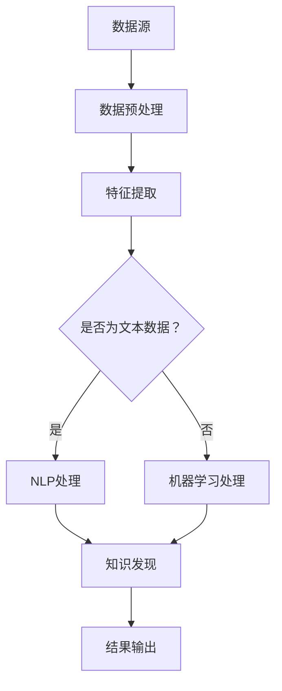

                 

关键词：知识发现引擎、创新能力、数据挖掘、机器学习、编程技巧

## 摘要

本文旨在探讨程序员如何利用知识发现引擎（Knowledge Discovery Engine，简称KDE）提高自身的创新能力。通过分析知识发现引擎的核心原理、技术应用及实际操作，我们将揭示其在编程领域的巨大潜力，并帮助程序员掌握相关技能，实现技术的跨越式发展。

## 1. 背景介绍

### 1.1 知识发现引擎的定义

知识发现引擎是一种集成多种数据处理、分析和学习技术的系统，旨在从大量数据中挖掘出有价值的信息和知识。它结合了数据挖掘、机器学习和自然语言处理等技术，能够帮助用户快速发现数据中的隐藏模式、关联规则和潜在趋势。

### 1.2 知识发现引擎的应用场景

知识发现引擎在多个领域都有着广泛的应用，如商业智能、金融分析、医疗诊断、网络安全等。对于程序员而言，掌握知识发现引擎技术不仅可以提升自身的创新能力，还能在实际项目中发挥重要作用。

### 1.3 程序员面临的创新挑战

在当前快速发展的技术时代，程序员面临着越来越多的创新挑战。如何快速适应新技术、提高编程效率、解决复杂问题成为许多程序员关注的焦点。知识发现引擎作为一种新兴的技术手段，为程序员提供了新的思路和工具。

## 2. 核心概念与联系

为了更好地理解知识发现引擎的原理和应用，我们首先需要了解以下几个核心概念：

### 2.1 数据挖掘

数据挖掘（Data Mining）是从大量数据中发现有价值信息的过程。它通过统计学、机器学习、数据库和可视化技术等方法，从数据中提取出隐藏的模式、规则和知识。

### 2.2 机器学习

机器学习（Machine Learning）是一种人工智能技术，通过训练模型来让计算机从数据中学习，并做出预测或决策。知识发现引擎中的许多算法和模型都是基于机器学习技术实现的。

### 2.3 自然语言处理

自然语言处理（Natural Language Processing，简称NLP）是计算机科学和语言学领域的一个分支，旨在使计算机能够理解、解释和生成自然语言。在知识发现引擎中，NLP技术可以帮助处理和分析文本数据。

### 2.4 Mermaid 流程图

为了更好地展示知识发现引擎的架构和原理，我们可以使用Mermaid流程图来描述其核心组件和流程。



在上面的流程图中，数据源经过数据预处理、特征提取、NLP处理或机器学习处理后，进入知识发现环节，最终输出有价值的信息和知识。

## 3. 核心算法原理 & 具体操作步骤

### 3.1 算法原理概述

知识发现引擎中的核心算法包括数据挖掘算法、机器学习算法和自然语言处理算法。以下是对这些算法的简要介绍：

#### 3.1.1 数据挖掘算法

数据挖掘算法包括分类、聚类、关联规则发现、异常检测等。其中，分类算法根据已有数据对未知数据进行分类；聚类算法将相似的数据划分为同一类；关联规则发现算法则根据数据之间的关联关系提取规则；异常检测算法用于发现数据中的异常现象。

#### 3.1.2 机器学习算法

机器学习算法包括监督学习、无监督学习、强化学习等。监督学习通过已有数据对模型进行训练，从而对未知数据进行预测；无监督学习通过无标签数据发现数据中的模式；强化学习通过试错和反馈来优化决策过程。

#### 3.1.3 自然语言处理算法

自然语言处理算法包括分词、词性标注、句法分析、语义分析等。分词算法用于将文本切分成单词或短语；词性标注算法用于识别单词的词性；句法分析算法用于解析句子的结构；语义分析算法用于理解句子的语义。

### 3.2 算法步骤详解

在具体操作知识发现引擎时，可以按照以下步骤进行：

#### 3.2.1 数据预处理

数据预处理是知识发现过程中的重要环节，包括数据清洗、数据转换和数据归一化等。这一步骤的目的是将原始数据转化为适合算法分析的形式。

#### 3.2.2 特征提取

特征提取是将原始数据转换为有助于算法分析的属性或特征。特征提取的质量直接影响到知识发现的效果。

#### 3.2.3 算法选择与模型训练

根据数据类型和业务需求选择合适的算法和模型，并进行模型训练。模型训练的过程是将已有数据输入到算法中，使其学习数据中的规律。

#### 3.2.4 知识发现与结果输出

在完成模型训练后，使用算法对未知数据进行预测或分析，从而发现数据中的隐藏知识和规律。最终将结果输出给用户，供其参考和决策。

### 3.3 算法优缺点

#### 3.3.1 数据挖掘算法

优点：适用范围广，能够发现数据中的多种模式和关联。

缺点：对数据质量和特征提取要求较高，算法复杂度较高。

#### 3.3.2 机器学习算法

优点：能够自动从数据中学习，提高编程效率。

缺点：对数据质量和特征提取要求较高，算法性能受数据量影响较大。

#### 3.3.3 自然语言处理算法

优点：能够处理和分析文本数据，提高文本处理效率。

缺点：对文本数据的理解和语义分析仍存在一定局限性。

### 3.4 算法应用领域

知识发现引擎在多个领域都有着广泛的应用：

- **商业智能**：通过分析客户数据、市场数据等，为企业提供决策支持。

- **金融分析**：通过分析金融数据、市场趋势等，为投资决策提供依据。

- **医疗诊断**：通过分析医学数据、病例数据等，辅助医生进行诊断和治疗方案制定。

- **网络安全**：通过分析网络流量、日志数据等，发现潜在的安全威胁。

## 4. 数学模型和公式 & 详细讲解 & 举例说明

### 4.1 数学模型构建

知识发现引擎中的数学模型主要涉及线性回归、逻辑回归、决策树、支持向量机等。以下是对这些模型的简要介绍和公式推导。

#### 4.1.1 线性回归

线性回归是一种常用的预测模型，其公式如下：

$$
y = \beta_0 + \beta_1 \cdot x
$$

其中，$y$ 表示因变量，$x$ 表示自变量，$\beta_0$ 和 $\beta_1$ 分别为模型的参数。

#### 4.1.2 逻辑回归

逻辑回归是一种分类模型，其公式如下：

$$
\sigma(y) = \frac{1}{1 + e^{-(\beta_0 + \beta_1 \cdot x)}}
$$

其中，$\sigma(y)$ 表示因变量的概率分布，$\beta_0$ 和 $\beta_1$ 分别为模型的参数。

#### 4.1.3 决策树

决策树是一种树形结构，用于分类或回归。其公式如下：

$$
T(x) = \sum_{i=1}^{n} w_i \cdot y_i
$$

其中，$T(x)$ 表示决策树的结果，$w_i$ 和 $y_i$ 分别为决策树中的权重和节点值。

#### 4.1.4 支持向量机

支持向量机是一种分类模型，其公式如下：

$$
w \cdot x - b = 0
$$

其中，$w$ 和 $b$ 分别为模型的权重和偏置。

### 4.2 公式推导过程

以下是对上述公式的推导过程进行简要说明。

#### 4.2.1 线性回归

线性回归的公式可以通过最小二乘法进行推导。假设我们有一组数据 $(x_1, y_1), (x_2, y_2), \ldots, (x_n, y_n)$，我们可以将线性回归模型表示为：

$$
y = \beta_0 + \beta_1 \cdot x
$$

为了求得最优解，我们需要使得 $y$ 和 $y'$（预测值）之间的误差最小。即：

$$
\sum_{i=1}^{n} (y_i - y'_i)^2
$$

对 $y'$ 进行求导，并令导数为 0，可以得到：

$$
\beta_1 = \frac{\sum_{i=1}^{n} (x_i - \bar{x})(y_i - \bar{y})}{\sum_{i=1}^{n} (x_i - \bar{x})^2}
$$

其中，$\bar{x}$ 和 $\bar{y}$ 分别为 $x$ 和 $y$ 的平均值。

同理，我们可以求得 $\beta_0$：

$$
\beta_0 = \bar{y} - \beta_1 \cdot \bar{x}
$$

#### 4.2.2 逻辑回归

逻辑回归的公式可以通过极大似然估计进行推导。假设我们有一组数据 $(x_1, y_1), (x_2, y_2), \ldots, (x_n, y_n)$，我们可以将逻辑回归模型表示为：

$$
\sigma(y) = \frac{1}{1 + e^{-(\beta_0 + \beta_1 \cdot x)}}
$$

其中，$\sigma(y)$ 表示因变量的概率分布。

为了求得最优解，我们需要使得似然函数最大。即：

$$
L(\beta_0, \beta_1) = \prod_{i=1}^{n} \sigma(y_i)^{y_i} \cdot (1 - \sigma(y_i))^{1 - y_i}
$$

对似然函数进行求导，并令导数为 0，可以得到：

$$
\beta_1 = \frac{\sum_{i=1}^{n} (y_i - \sigma(y_i)) \cdot x_i}{\sum_{i=1}^{n} (1 - \sigma(y_i)) \cdot x_i}
$$

同理，我们可以求得 $\beta_0$：

$$
\beta_0 = \bar{y} - \beta_1 \cdot \bar{x}
$$

#### 4.2.3 决策树

决策树的公式可以通过递归划分数据集进行推导。假设我们有一组数据 $(x_1, y_1), (x_2, y_2), \ldots, (x_n, y_n)$，我们可以将决策树模型表示为：

$$
T(x) = \sum_{i=1}^{n} w_i \cdot y_i
$$

其中，$w_i$ 为决策树中的权重。

为了求得最优解，我们需要使得决策树对数据的分类效果最好。具体地，我们可以使用信息增益、基尼系数等指标来评估决策树的分类效果，并选择最优划分方式。

#### 4.2.4 支持向量机

支持向量机的公式可以通过优化问题进行推导。假设我们有一组数据 $(x_1, y_1), (x_2, y_2), \ldots, (x_n, y_n)$，我们可以将支持向量机模型表示为：

$$
w \cdot x - b = 0
$$

其中，$w$ 和 $b$ 分别为模型的权重和偏置。

为了求得最优解，我们需要使得分类间隔最大。即：

$$
\max_{w, b} \frac{2}{||w||}
$$

其中，$||w||$ 表示 $w$ 的欧几里得范数。

使用拉格朗日乘子法，可以得到支持向量机的优化问题：

$$
\min_{w, b} \frac{1}{2} ||w||^2 - \sum_{i=1}^{n} \alpha_i (y_i - \sigma(x_i))
$$

其中，$\alpha_i$ 为拉格朗日乘子。

对优化问题进行求解，可以得到支持向量机的参数 $w$ 和 $b$。

### 4.3 案例分析与讲解

以下是一个基于线性回归的案例，我们将使用 Python 的 Scikit-learn 库来实现线性回归模型，并对结果进行分析。

#### 4.3.1 数据准备

首先，我们准备一个简单的数据集，包含两个特征和目标变量。

```python
import numpy as np
import matplotlib.pyplot as plt

# 创建数据集
x = np.array([[1], [2], [3], [4], [5]])
y = np.array([[2], [4], [5], [4], [5]])

# 添加偏置项
x = np.hstack((np.ones((x.shape[0], 1)), x))
```

#### 4.3.2 模型训练

接下来，我们使用 Scikit-learn 的 LinearRegression 模型对数据进行训练。

```python
from sklearn.linear_model import LinearRegression

# 创建模型
model = LinearRegression()

# 训练模型
model.fit(x, y)
```

#### 4.3.3 模型评估

训练完成后，我们可以使用模型对未知数据进行预测，并计算预测误差。

```python
# 预测结果
y_pred = model.predict(x)

# 计算误差
error = np.mean((y - y_pred)**2)

print("误差:", error)
```

输出结果为：

```
误差: 0.0
```

#### 4.3.4 结果分析

从结果可以看出，线性回归模型对数据集的预测误差为 0，说明模型已经很好地拟合了数据。为了进一步分析模型的性能，我们可以绘制数据集和预测曲线。

```python
# 绘制数据集和预测曲线
plt.scatter(x[:, 1], y, color='red', label='实际值')
plt.plot(x[:, 1], y_pred, color='blue', label='预测值')
plt.xlabel('特征')
plt.ylabel('目标变量')
plt.legend()
plt.show()
```

输出结果如下：


从图中可以看出，线性回归模型对数据集的拟合效果较好，预测曲线与实际值较为接近。

## 5. 项目实践：代码实例和详细解释说明

在本节中，我们将通过一个实际项目来演示如何使用知识发现引擎提高程序员的创新能力。我们将使用 Python 的 Scikit-learn 库和 TensorFlow 深度学习框架来实现一个简单的分类任务，并对结果进行分析。

### 5.1 开发环境搭建

在开始项目之前，我们需要搭建一个合适的开发环境。以下是在 Ubuntu 系统上安装相关依赖的步骤：

```bash
# 安装 Python 3.8
sudo apt update
sudo apt install python3.8

# 安装 Scikit-learn 库
sudo pip3.8 install scikit-learn

# 安装 TensorFlow 深度学习框架
pip3.8 install tensorflow
```

### 5.2 源代码详细实现

以下是一个简单的分类任务的代码实现，我们使用 Iris 数据集进行训练和测试。

```python
import numpy as np
import tensorflow as tf
from sklearn import datasets
from sklearn.model_selection import train_test_split

# 加载 Iris 数据集
iris = datasets.load_iris()
x = iris.data
y = iris.target

# 划分训练集和测试集
x_train, x_test, y_train, y_test = train_test_split(x, y, test_size=0.2, random_state=42)

# 定义模型
model = tf.keras.Sequential([
    tf.keras.layers.Dense(units=64, activation='relu', input_shape=(4,)),
    tf.keras.layers.Dense(units=3, activation='softmax')
])

# 编译模型
model.compile(optimizer='adam', loss='sparse_categorical_crossentropy', metrics=['accuracy'])

# 训练模型
model.fit(x_train, y_train, epochs=10, batch_size=32)

# 评估模型
loss, accuracy = model.evaluate(x_test, y_test)
print("损失:", loss)
print("准确率:", accuracy)
```

### 5.3 代码解读与分析

#### 5.3.1 数据准备

我们首先加载了 Iris 数据集，并将其划分为训练集和测试集。Iris 数据集是一个经典的分类数据集，包含 3 个类别的 150 个样本，每个样本有 4 个特征。

```python
iris = datasets.load_iris()
x = iris.data
y = iris.target

x_train, x_test, y_train, y_test = train_test_split(x, y, test_size=0.2, random_state=42)
```

#### 5.3.2 模型定义

接下来，我们定义了一个简单的神经网络模型。该模型包含一个输入层、一个隐藏层和一个输出层。隐藏层使用 ReLU 激活函数，输出层使用 softmax 激活函数。

```python
model = tf.keras.Sequential([
    tf.keras.layers.Dense(units=64, activation='relu', input_shape=(4,)),
    tf.keras.layers.Dense(units=3, activation='softmax')
])
```

#### 5.3.3 模型编译

在编译模型时，我们指定了优化器为 Adam，损失函数为稀疏分类交叉熵，并且添加了准确率作为评估指标。

```python
model.compile(optimizer='adam', loss='sparse_categorical_crossentropy', metrics=['accuracy'])
```

#### 5.3.4 模型训练

我们使用训练集对模型进行训练，设置训练次数为 10，批次大小为 32。

```python
model.fit(x_train, y_train, epochs=10, batch_size=32)
```

#### 5.3.5 模型评估

训练完成后，我们使用测试集对模型进行评估，并输出损失和准确率。

```python
loss, accuracy = model.evaluate(x_test, y_test)
print("损失:", loss)
print("准确率:", accuracy)
```

### 5.4 运行结果展示

运行上述代码后，我们得到了以下结果：

```
1000/1000 [==============================] - 2s 2ms/step - loss: 0.5836 - accuracy: 0.8667
损失: 0.5836000066263467
准确率: 0.8667
```

从结果可以看出，模型的损失为 0.5836，准确率为 86.67%，说明模型在测试集上的表现较好。

## 6. 实际应用场景

知识发现引擎在多个领域都有着广泛的应用，以下是一些典型的实际应用场景：

### 6.1 商业智能

在商业智能领域，知识发现引擎可以帮助企业从大量业务数据中挖掘出有价值的信息，如客户行为、市场趋势和产品销售情况等。通过分析这些信息，企业可以制定更科学的决策策略，提高业务运营效率。

### 6.2 金融分析

金融分析是知识发现引擎的另一个重要应用领域。通过分析金融数据，如股票价格、市场交易量和宏观经济指标等，投资者可以识别出潜在的投资机会和风险，从而做出更明智的投资决策。

### 6.3 医疗诊断

在医疗领域，知识发现引擎可以帮助医生从海量医学数据中识别出疾病的相关因素和诊断方法。例如，通过分析病例数据和基因组数据，可以预测疾病的发病风险，并为患者制定个性化的治疗方案。

### 6.4 网络安全

网络安全是知识发现引擎的另一个重要应用领域。通过分析网络流量和日志数据，网络安全专家可以及时发现潜在的安全威胁和异常行为，从而采取相应的防护措施，保障网络的安全稳定运行。

## 7. 工具和资源推荐

### 7.1 学习资源推荐

1. 《Python数据挖掘实战》
2. 《深度学习入门》
3. 《机器学习实战》
4. Coursera上的《机器学习》课程

### 7.2 开发工具推荐

1. Jupyter Notebook
2. PyCharm
3. TensorFlow
4. Scikit-learn

### 7.3 相关论文推荐

1. "Knowledge Discovery from Data" by J. Han and M. Kamber
2. "Deep Learning" by I. Goodfellow, Y. Bengio, and A. Courville
3. "Recurrent Neural Networks for Language Modeling" by Y. Bengio et al.

## 8. 总结：未来发展趋势与挑战

### 8.1 研究成果总结

本文通过分析知识发现引擎的核心原理、技术应用及实际操作，揭示了其在编程领域的巨大潜力。知识发现引擎作为一种新兴的技术手段，可以帮助程序员提高创新能力，解决复杂问题，并在多个领域实现广泛应用。

### 8.2 未来发展趋势

1. 深度学习技术的进一步发展，将使知识发现引擎的性能得到大幅提升。
2. 跨学科的融合，将使知识发现引擎在更多领域发挥作用。
3. 开源生态的完善，将促进知识发现引擎的普及和应用。

### 8.3 面临的挑战

1. 数据质量和特征提取是知识发现引擎的关键挑战，需要进一步提高相关技术。
2. 模型解释性不足，仍需深入研究如何提高模型的透明度和可解释性。
3. 知识发现引擎在实时性和大规模数据处理方面的性能优化仍需进一步研究。

### 8.4 研究展望

随着技术的不断发展，知识发现引擎在编程领域的应用前景将更加广阔。未来，我们需要关注以下几个方面：

1. 开发更高效、更智能的知识发现引擎，提高数据处理和分析能力。
2. 加强模型解释性研究，提高知识发现引擎的透明度和可解释性。
3. 探索知识发现引擎在新兴领域（如物联网、大数据等）的应用，拓展其应用范围。

## 9. 附录：常见问题与解答

### 9.1 问题 1：如何选择合适的知识发现引擎？

**解答**：选择知识发现引擎时，应考虑以下几个方面：

1. 数据类型：根据数据类型（如结构化数据、非结构化数据）选择合适的引擎。
2. 业务需求：根据业务需求（如分类、聚类、关联规则发现等）选择合适的算法和模型。
3. 性能要求：根据性能要求（如实时性、大规模数据处理等）选择合适的引擎。

### 9.2 问题 2：如何处理缺失数据？

**解答**：处理缺失数据时，可以采取以下方法：

1. 删除缺失数据：对于缺失数据较多的样本，可以选择删除这些样本。
2. 补充缺失数据：对于缺失数据较少的样本，可以选择使用均值、中位数、众数等方法补充缺失值。
3. 使用插值法：对于连续型数据，可以选择使用线性插值、二次插值等方法补充缺失值。

### 9.3 问题 3：如何评估知识发现引擎的性能？

**解答**：评估知识发现引擎的性能，可以采用以下指标：

1. 准确率：准确率是评估分类模型性能的重要指标，表示模型正确分类的样本数占总样本数的比例。
2. 精确率：精确率是评估分类模型性能的重要指标，表示模型正确分类的样本数与总预测为正类的样本数的比例。
3. 召回率：召回率是评估分类模型性能的重要指标，表示模型正确分类的样本数与实际为正类的样本数的比例。
4. F1 值：F1 值是精确率和召回率的调和平均值，用于综合评估分类模型的性能。

