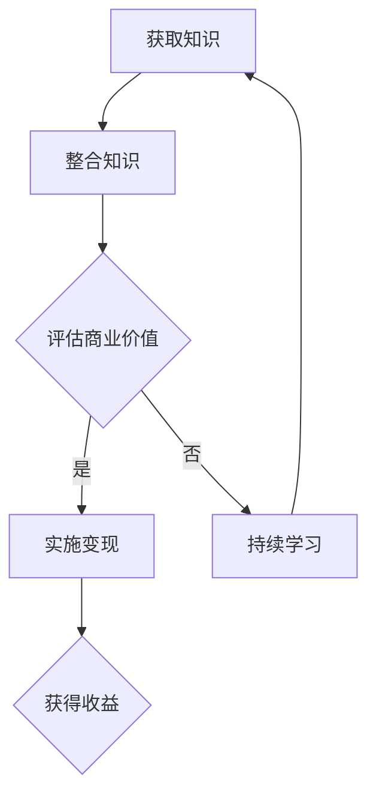

                 

关键词：跨界知识、知识变现、程序员、能力培养、技术博客

> 摘要：本文将探讨程序员如何通过培养跨界知识变现能力，实现个人职业发展及财富增长。本文将从背景介绍、核心概念与联系、核心算法原理、数学模型与公式、项目实践、实际应用场景、工具和资源推荐以及总结与展望等八个方面进行详细阐述。

## 1. 背景介绍

在当今信息爆炸的时代，知识更新速度不断加快，程序员作为IT行业的主力军，如何提高自己的竞争力，实现知识变现，已经成为一个热门话题。跨界知识变现能力，即程序员在掌握专业技术的同时，能够灵活运用其他领域的知识，创造出具有商业价值的产品或服务，从而实现个人价值最大化。

## 2. 核心概念与联系

为了更好地理解跨界知识变现能力，我们首先需要了解以下几个核心概念：

### 2.1 知识变现

知识变现是指将个人或组织的知识、技能和经验转化为商业价值的过程。在程序员的世界里，知识变现可以表现为编写畅销技术书籍、开设线上课程、开发开源项目、提供技术咨询服务等多种形式。

### 2.2 跨界知识

跨界知识是指不同领域之间的交叉和融合，例如程序员可以掌握心理学、设计、商业管理等领域的知识，从而拓宽自己的视野和技能。

### 2.3 知识变现能力

知识变现能力是指个人或组织将知识变现为商业价值的能力。这需要具备较强的学习、沟通、创造和创新等能力。

下面是一个用Mermaid绘制的流程图，展示了跨界知识变现的流程：



## 3. 核心算法原理 & 具体操作步骤

### 3.1 算法原理概述

跨界知识变现的核心算法原理主要包括以下几个方面：

1. **知识积累**：通过不断学习和实践，积累跨领域的知识和技能。
2. **能力提升**：通过实战项目、团队合作等途径，提升自己的跨界能力。
3. **市场调研**：了解市场需求，找到知识变现的切入点。
4. **产品/服务开发**：将跨界知识转化为具有商业价值的产品或服务。
5. **推广与营销**：通过合适的渠道和方式，将产品或服务推广给目标用户。

### 3.2 算法步骤详解

1. **明确目标**：首先，确定自己要实现的知识变现目标，例如编写技术书籍、开设线上课程等。
2. **知识积累**：根据目标，有针对性地学习相关领域的知识，如心理学、设计、商业管理等。
3. **能力提升**：通过实际项目或团队合作，提升自己的跨界能力，例如编写高质量的技术书籍、设计优秀的UI界面等。
4. **市场调研**：了解市场需求，找到自己的知识变现切入点，例如在某个技术领域有独到的见解，可以编写畅销技术书籍。
5. **产品/服务开发**：根据市场调研结果，开发具有商业价值的产品或服务，如编写技术书籍、开设线上课程等。
6. **推广与营销**：利用社交媒体、个人网站、线下活动等渠道，推广自己的产品或服务，吸引目标用户。

### 3.3 算法优缺点

**优点**：

- 可以提高个人的竞争力，实现职业发展。
- 有利于实现个人价值最大化，提高收入水平。
- 可以拓宽视野，增强跨领域沟通和协作能力。

**缺点**：

- 需要投入大量时间和精力进行学习和实践。
- 需要具备较强的学习、沟通、创造和创新等能力。
- 市场竞争激烈，需要不断调整自己的知识结构和变现策略。

### 3.4 算法应用领域

跨界知识变现能力在程序员中的广泛应用领域包括：

- **技术博客**：编写高质量的技术博客，分享自己的经验和见解，吸引读者，实现广告收入、赞助等变现方式。
- **开源项目**：开发开源项目，吸引社区关注，通过捐赠、赞助等方式实现变现。
- **线上课程**：开设线上课程，通过课程收费、会员订阅等方式实现变现。
- **技术咨询服务**：提供技术咨询服务，为企业解决实际问题，实现收入增长。

## 4. 数学模型和公式 & 详细讲解 & 举例说明

### 4.1 数学模型构建

跨界知识变现的数学模型可以表示为：

\[ 收益 = 收入 \times 成功率 \times 转化率 \]

其中：

- **收入**：指通过知识变现获得的总收入，如课程收费、技术咨询费等。
- **成功率**：指知识变现项目成功的机会，与项目质量、市场需求等因素有关。
- **转化率**：指潜在客户转化为实际购买者的比例，与营销策略、产品品质等因素有关。

### 4.2 公式推导过程

\[ 收益 = 收入 \times 成功率 \times 转化率 \]

其中：

- **收入**：收入与市场需求、项目质量等因素相关。假设收入与市场需求成正比，可以表示为：

\[ 收入 = 市场需求 \times 项目质量 \]

- **成功率**：成功率与项目质量、市场需求、竞争环境等因素相关。假设成功率与项目质量、市场需求成正比，与竞争环境成反比，可以表示为：

\[ 成功率 = \frac{项目质量 \times 市场需求}{竞争环境} \]

- **转化率**：转化率与营销策略、产品品质等因素相关。假设转化率与营销策略、产品品质成正比，可以表示为：

\[ 转化率 = 营销策略 \times 产品品质 \]

将上述三个公式代入收益公式，得到：

\[ 收益 = 市场需求 \times 项目质量 \times \frac{项目质量 \times 市场需求}{竞争环境} \times 营销策略 \times 产品品质 \]

化简得：

\[ 收益 = \frac{市场需求 \times 项目质量^2 \times 营销策略 \times 产品品质}{竞争环境} \]

### 4.3 案例分析与讲解

假设某程序员想通过编写技术博客实现知识变现，其市场需求为100人，项目质量为90%，竞争环境为1，营销策略为80%，产品品质为85%。代入公式计算收益：

\[ 收益 = \frac{100 \times 90\% \times 90\% \times 80\% \times 85\%}{1} \]

\[ 收益 = 63.6 \]

因此，该程序员通过技术博客实现知识变现的收益为63.6元。

## 5. 项目实践：代码实例和详细解释说明

### 5.1 开发环境搭建

为了实现跨界知识变现，我们首先需要搭建一个适合自己的开发环境。以下是一个简单的步骤：

1. 安装操作系统：如Windows、MacOS或Linux。
2. 安装编程工具：如Visual Studio Code、Eclipse、IntelliJ IDEA等。
3. 安装数据库：如MySQL、PostgreSQL等。
4. 安装版本控制工具：如Git。

### 5.2 源代码详细实现

以下是一个简单的Python代码实例，用于实现技术博客的搭建：

```python
# 导入必要的库
import os
import git

# 搭建博客目录
def setup_blog_directory():
    blog_directory = "my_blog"
    if not os.path.exists(blog_directory):
        os.makedirs(blog_directory)
    print(f"博客目录已创建：{blog_directory}")

# 初始化博客仓库
def initialize_blog_repository():
    repo = git.Repo.init(blog_directory)
    print("博客仓库已初始化。")

# 添加文章
def add_article(title, content):
    with open(os.path.join(blog_directory, f"{title}.md"), "w") as file:
        file.write(content)
    print(f"文章 '{title}' 已添加。")

# 主函数
def main():
    setup_blog_directory()
    initialize_blog_repository()
    add_article("我的第一篇文章", "# 标题\n\n这是一个简单的技术博客。")

# 运行主函数
if __name__ == "__main__":
    main()
```

### 5.3 代码解读与分析

1. **导入必要的库**：导入os库用于文件和目录操作，导入git库用于版本控制。
2. **搭建博客目录**：判断是否存在博客目录，如果不存在则创建。
3. **初始化博客仓库**：使用git库初始化博客目录作为仓库。
4. **添加文章**：将文章内容写入.md文件，实现文章的添加。
5. **主函数**：执行搭建博客目录、初始化博客仓库和添加文章等操作。

通过这个简单的Python代码实例，我们可以搭建一个基本的技术博客，为后续的知识变现打下基础。

### 5.4 运行结果展示

运行上述代码后，将创建一个名为"my_blog"的博客目录，初始化为Git仓库，并在目录下添加一个标题为"我的第一篇文章"的Markdown文件，内容为"这是一个简单的技术博客。"

## 6. 实际应用场景

跨界知识变现能力在实际应用中具有广泛的前景，以下是一些典型的应用场景：

- **技术博客**：程序员可以基于自己的技术积累，编写高质量的技术博客，通过广告、赞助等方式实现知识变现。
- **开源项目**：程序员可以开发开源项目，通过社区捐赠、赞助等方式实现知识变现。
- **线上课程**：程序员可以开设线上课程，通过课程收费、会员订阅等方式实现知识变现。
- **技术咨询服务**：程序员可以提供技术咨询服务，为企业解决实际问题，通过咨询费实现知识变现。

## 7. 工具和资源推荐

为了更好地培养跨界知识变现能力，以下是一些推荐的工具和资源：

### 7.1 学习资源推荐

- **在线课程**：网易云课堂、慕课网、Coursera、Udemy等。
- **电子书**：Kindle、京东读书、亚马逊等。
- **技术博客**：CSDN、博客园、GitHub等。

### 7.2 开发工具推荐

- **编程环境**：Visual Studio Code、Eclipse、IntelliJ IDEA等。
- **数据库**：MySQL、PostgreSQL、MongoDB等。
- **版本控制**：Git、SVN等。

### 7.3 相关论文推荐

- **人工智能**：《深度学习》（Goodfellow et al.）
- **机器学习**：《统计学习方法》（李航）
- **计算机体系结构**：《计算机组成与设计》（David A. Patterson et al.）

## 8. 总结：未来发展趋势与挑战

随着科技的不断发展，跨界知识变现能力在未来将具有更大的发展空间。然而，也面临着一些挑战：

- **技术更新速度快**：程序员需要不断学习新知识，以保持竞争力。
- **市场竞争激烈**：跨界知识变现领域的竞争将越来越激烈。
- **知识产权保护**：如何保护自己的知识产权，避免侵权和抄袭。

在未来，程序员需要不断拓展自己的知识领域，提高跨界能力，同时关注市场需求，调整自己的知识变现策略。只有这样，才能在跨界知识变现的道路上走得更远。

## 9. 附录：常见问题与解答

### 9.1 如何提高跨界知识变现能力？

**解答**：提高跨界知识变现能力的关键在于：

1. **持续学习**：不断学习新知识，扩大自己的知识面。
2. **实战经验**：通过实际项目或合作，提升自己的跨界能力。
3. **市场调研**：了解市场需求，找到自己的知识变现切入点。
4. **产品/服务开发**：开发具有商业价值的产品或服务。
5. **推广与营销**：利用合适的渠道和方式，推广自己的产品或服务。

### 9.2 如何保护自己的知识产权？

**解答**：保护自己的知识产权可以从以下几个方面入手：

1. **版权登记**：将作品进行版权登记，取得法律保护。
2. **合同约定**：在与他人合作时，明确约定知识产权归属和授权使用范围。
3. **保密协议**：在与他人交流时，签订保密协议，防止信息泄露。
4. **法律援助**：在遇到侵权行为时，寻求法律援助，维护自己的权益。

## 参考文献

- Goodfellow, I., Bengio, Y., & Courville, A. (2016). Deep learning. MIT press.
- 李航. (2012). 统计学习方法. 清华大学出版社.
- Patterson, D. A., & Hennessy, J. L. (2017). Computer organization and design: The hardware/software interface. Morgan Kaufmann.

### 作者署名

作者：禅与计算机程序设计艺术 / Zen and the Art of Computer Programming

