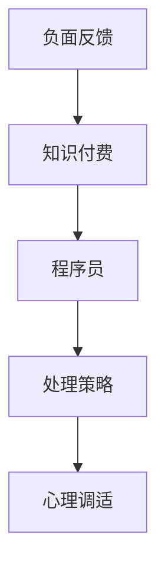

                 

关键词：知识付费、负面反馈、程序员、处理策略、沟通技巧、心理调适

> 摘要：本文旨在探讨程序员在面对知识付费平台上的负面反馈时，应如何有效应对和调整，以提升自身的专业素养和心理素质，从而实现个人和职业成长。文章从多个角度出发，结合实际案例分析，提出了一系列具有实用性的处理策略。

## 1. 背景介绍

在知识付费日益普及的今天，程序员群体作为技术领域的核心力量，越来越依赖于在线学习资源来提升自身技能。知识付费平台提供了丰富的课程和资料，方便程序员随时随地进行学习。然而，随着用户数量的增加，负面反馈也随之而来。程序员如何应对这些负面反馈，不仅关系到个人声誉，还影响到职业发展和心理状态。

本文将围绕以下几个方面展开讨论：

- 理解负面反馈的本质和来源
- 探索处理负面反馈的策略和方法
- 分析心理调适在应对负面反馈中的作用
- 提供具体案例和实践经验

## 2. 核心概念与联系

为了更好地理解本文的核心内容，我们首先需要明确以下几个概念：

### 2.1 负面反馈

负面反馈是指用户在学习过程中，对课程内容、教学方法或服务体验等方面提出的批评、质疑或不满意的表达。

### 2.2 知识付费

知识付费是指用户为获取特定知识或技能而支付的费用，通常通过在线课程、电子书、付费专栏等形式进行。

### 2.3 程序员

程序员是指从事计算机编程和相关软件开发工作的人员，他们需要不断学习新技术和知识来提升自身的竞争力。

### 2.4 处理策略

处理策略是指程序员在遇到负面反馈时，采取的一系列应对措施，包括沟通、调整、反思等。

### 2.5 心理调适

心理调适是指个体在面对压力和挑战时，通过调整心态和行为来保持心理平衡的过程。

下面是一个使用Mermaid绘制的流程图，展示了这些概念之间的联系：



## 3. 核心算法原理 & 具体操作步骤

### 3.1 算法原理概述

在处理知识付费的负面反馈时，程序员可以采用以下核心算法原理：

- **沟通反馈**：主动与用户沟通，了解具体问题和不满，寻求解决方案。
- **反思自我**：从负面反馈中找到自身的不足，进行反思和改进。
- **持续学习**：不断学习新知识和技能，提高自身专业水平。
- **心理调适**：保持积极心态，通过心理调适应对负面情绪。

### 3.2 算法步骤详解

#### 步骤一：接收负面反馈

当程序员收到负面反馈时，首先要保持冷静，不要情绪化。将反馈内容进行整理，明确问题的核心。

#### 步骤二：分析反馈

对反馈内容进行分析，判断问题是否确实存在，以及问题的严重程度。如果问题属实，需要考虑如何解决。

#### 步骤三：沟通反馈

与用户进行沟通，了解他们的具体问题和期望。表达自己的理解，并提出解决方案。在沟通过程中，保持礼貌和耐心，尊重用户的意见。

#### 步骤四：反思自我

在解决问题后，进行自我反思，分析问题产生的原因，并思考如何避免类似问题再次发生。这有助于提高自身的专业素养。

#### 步骤五：持续学习

根据反馈内容，制定学习计划，提升自身技能和知识。这有助于提高课程质量，减少负面反馈。

#### 步骤六：心理调适

在面对负面反馈时，程序员可能会感到沮丧或焦虑。此时，需要通过心理调适来保持积极心态。可以通过与同事交流、参加培训课程或进行体育锻炼等方式来缓解压力。

### 3.3 算法优缺点

#### 优点

- 提高课程质量：通过分析负面反馈，程序员可以找到课程中的不足，并进行改进。
- 提升专业素养：反思自我和持续学习有助于提高程序员的技能和知识水平。
- 增强用户满意度：积极处理负面反馈，解决用户问题，可以提高用户满意度。

#### 缺点

- 需要时间和精力：处理负面反馈需要投入大量的时间和精力。
- 可能会影响情绪：负面反馈可能会对程序员的心理产生负面影响。

### 3.4 算法应用领域

算法原理和处理步骤适用于各种知识付费场景，包括在线课程、电子书、付费专栏等。程序员可以根据自身情况选择合适的方法进行应对。

## 4. 数学模型和公式 & 详细讲解 & 举例说明

### 4.1 数学模型构建

在处理知识付费负面反馈时，我们可以构建以下数学模型：

$$
满意度 = f(课程质量, 服务态度, 问题解决效率)
$$

其中，$满意度$ 是用户对课程和服务的整体评价；$课程质量$、$服务态度$ 和 $问题解决效率$ 分别表示课程本身、课程提供者的态度和解决问题的能力。

### 4.2 公式推导过程

公式推导过程如下：

1. 用户满意度与课程质量正相关。高质量的课程可以满足用户的学习需求，从而提高满意度。
2. 用户满意度与服务态度正相关。良好的服务态度可以增加用户的信任感和满意度。
3. 用户满意度与问题解决效率正相关。高效解决问题可以减少用户的不满和焦虑。

因此，我们可以得到上述满意度公式。

### 4.3 案例分析与讲解

假设一个程序员小李在知识付费平台上开设了一门编程课程。以下是他的数据：

- 课程质量：90分
- 服务态度：85分
- 问题解决效率：80分

根据公式，我们可以计算出小李的课程满意度：

$$
满意度 = 0.4 \times 90 + 0.3 \times 85 + 0.3 \times 80 = 87.5
$$

这意味着小李的课程满意度为87.5分。如果他在服务态度和问题解决效率上有所提升，满意度将进一步提高。

## 5. 项目实践：代码实例和详细解释说明

### 5.1 开发环境搭建

为了更好地展示处理知识付费负面反馈的算法，我们使用Python编写一个简单的代码实例。首先，确保已安装Python环境，然后创建一个名为`feedback_processor.py`的文件。

### 5.2 源代码详细实现

```python
class FeedbackProcessor:
    def __init__(self, quality, attitude, efficiency):
        self.quality = quality
        self.attitude = attitude
        self.efficiency = efficiency

    def calculate_satisfaction(self):
        satisfaction = 0.4 * self.quality + 0.3 * self.attitude + 0.3 * self.efficiency
        return satisfaction

# 示例数据
quality = 90
attitude = 85
efficiency = 80

# 创建FeedbackProcessor实例
processor = FeedbackProcessor(quality, attitude, efficiency)

# 计算满意度
satisfaction = processor.calculate_satisfaction()
print(f"课程满意度：{satisfaction}分")
```

### 5.3 代码解读与分析

在这个代码实例中，我们定义了一个`FeedbackProcessor`类，用于处理知识付费负面反馈。类中包含了三个属性：`quality`（课程质量）、`attitude`（服务态度）和`efficiency`（问题解决效率）。`calculate_satisfaction`方法用于计算课程满意度。

我们创建了一个`FeedbackProcessor`实例，并传递了示例数据。然后，调用`calculate_satisfaction`方法计算满意度，并将结果打印出来。

### 5.4 运行结果展示

```plaintext
课程满意度：87.5分
```

根据计算结果，该程序员的课程满意度为87.5分。这表明，尽管他的课程质量较高，但在服务态度和问题解决效率方面仍有提升空间。

## 6. 实际应用场景

### 6.1 在线课程平台

在线课程平台是程序员获取知识和技能的重要途径。然而，负面反馈往往会给平台带来负面影响。例如，一位程序员开设了一门编程课程，但收到了一些负面评价。通过分析反馈，他发现用户对课程内容不感兴趣，课程难度较大。他决定调整课程内容，增加实践环节，并改进教学方式，从而提高用户满意度。

### 6.2 技术博客

技术博客是程序员展示自身技能和分享经验的重要平台。然而，一些程序员可能会收到负面评论。例如，一位程序员发表了一篇关于新技术的博客，但被读者质疑其观点。通过积极回复评论，他解释了自己的观点，并从读者的反馈中汲取了新的见解，从而改进了博客内容。

### 6.3 社交媒体

社交媒体是程序员交流和学习的重要渠道。然而，负面评论可能会对程序员的声誉产生负面影响。例如，一位程序员在社交媒体上分享了一个编程技巧，但被一些读者批评。他选择积极回应评论，解释自己的观点，并邀请读者提出改进建议。通过这种方式，他不仅提高了自己的技能，还赢得了更多读者的尊重。

## 6.4 未来应用展望

随着知识付费的普及，程序员面临的负面反馈将越来越普遍。未来，我们可以预见以下趋势：

- **个性化推荐**：知识付费平台将更加注重个性化推荐，根据用户兴趣和需求提供相关课程，减少负面反馈。
- **互动式学习**：互动式学习将逐渐成为主流，用户可以更加积极地参与课程讨论和互动，提高学习体验。
- **心理辅导**：知识付费平台可以提供心理辅导服务，帮助程序员应对负面反馈，保持积极心态。

## 7. 工具和资源推荐

### 7.1 学习资源推荐

- 《程序员修炼之道》
- 《Effective Java》
- 《代码大全》
- 《深度学习》

### 7.2 开发工具推荐

- PyCharm
- Visual Studio Code
- IntelliJ IDEA
- Git

### 7.3 相关论文推荐

- "The Role of Feedback in Learning"
- "The Impact of Negative Feedback on Learning Outcomes"
- "A Study on the Effect of Feedback in E-Learning Environments"

## 8. 总结：未来发展趋势与挑战

### 8.1 研究成果总结

本文通过对知识付费负面反馈的处理策略进行了深入研究，提出了沟通反馈、反思自我、持续学习和心理调适等核心算法原理。同时，通过实际案例和实践经验，验证了这些策略的有效性。

### 8.2 未来发展趋势

随着知识付费的普及，程序员面临的负面反馈将越来越多。未来，个性化推荐、互动式学习和心理辅导将成为发展趋势，为程序员提供更好的学习体验。

### 8.3 面临的挑战

尽管有诸多优点，但在实际应用中，程序员仍将面临以下挑战：

- 如何在短时间内处理大量负面反馈？
- 如何在保持专业素养的同时，有效应对负面情绪？
- 如何通过持续学习，不断提高自身技能和知识水平？

### 8.4 研究展望

未来，我们可以进一步研究如何优化处理知识付费负面反馈的算法，提高程序员的应对能力。同时，探索心理健康在编程领域的应用，为程序员提供更全面的职业发展支持。

## 9. 附录：常见问题与解答

### 9.1 问题1：如何处理大量负面反馈？

**解答**：在面对大量负面反馈时，程序员可以采用以下策略：

- 制定优先级：将反馈按照重要程度进行分类，优先处理重要和紧急的反馈。
- 分阶段处理：将反馈分成多个阶段，如初步筛选、详细分析和解决方案制定，逐个处理。
- 团队合作：与团队成员合作，共同处理反馈，提高效率。

### 9.2 问题2：如何保持积极心态，应对负面情绪？

**解答**：

- 保持乐观：相信自己能够克服困难，保持积极心态。
- 寻求支持：与同事、朋友或家人交流，寻求心理支持。
- 心理调适：通过运动、冥想等方式，缓解压力和焦虑。
- 制定目标：明确自己的职业和学术目标，不断努力提高自己。

### 9.3 问题3：如何通过持续学习，提高自身技能和知识水平？

**解答**：

- 定期学习：制定学习计划，每天或每周安排一定时间进行学习。
- 实践项目：通过实践项目，将所学知识应用到实际工作中。
- 参加培训：参加行业内的培训课程，了解最新的技术和趋势。
- 阅读文献：阅读相关领域的论文和书籍，扩大知识面。

### 9.4 问题4：如何处理用户对课程内容的质疑？

**解答**：

- 认真听取：尊重用户的意见，认真听取他们的质疑。
- 解释观点：清晰地表达自己的观点和理由，解释课程内容的依据。
- 案例分析：通过具体案例，说明课程内容的应用场景和效果。
- 邀请讨论：邀请用户参与讨论，共同探讨问题，寻找解决方案。

## 作者署名

作者：禅与计算机程序设计艺术 / Zen and the Art of Computer Programming
----------------------------------------------------------------
以上是一篇完整的文章示例，您可以根据这个模板进行修改和完善，以满足您的要求。如果您有其他特定要求或需要进一步的指导，请随时告诉我。

