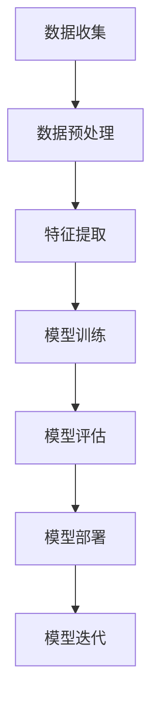

                 

关键词：人工智能、职业转型、程序员、技术更新、技能提升

> 摘要：随着人工智能技术的迅猛发展，程序员面临的职业挑战日益增多。本文将探讨人工智能时代程序员如何进行职业转型，以适应新的技术环境。

## 1. 背景介绍

人工智能（AI）技术近年来取得了巨大的进步，不仅在学术研究领域引起了广泛关注，也在商业领域得到了广泛应用。从自动驾驶汽车到智能语音助手，从推荐系统到自然语言处理，人工智能正在深刻地改变我们的生活方式。随着AI技术的不断发展，程序员面临的职业压力也在逐渐增加。

首先，人工智能技术的普及使得许多原本需要程序员手动完成的任务自动化。例如，机器学习框架和工具的成熟使用户能够轻松地构建和训练复杂的模型，这使得程序员的传统角色发生了变化。其次，新的编程语言和框架不断涌现，要求程序员不断更新自己的技能，以适应新的技术环境。此外，人工智能的发展也对程序员的编程思维提出了更高的要求，需要程序员具备更强的逻辑思维和算法能力。

面对这些挑战，程序员需要积极应对，进行职业转型，以适应人工智能时代的发展。本文将围绕如何进行职业转型展开讨论，旨在为程序员提供一些实用的建议。

## 2. 核心概念与联系

### 2.1 人工智能的定义与分类

人工智能是指通过计算机模拟人类智能的过程，使计算机具备感知、理解、学习、推理和决策的能力。根据其实现方式和功能，人工智能可以分为以下几类：

- **机器学习（Machine Learning）**：通过数据训练模型，使计算机具备自主学习和改进的能力。机器学习又可以分为监督学习（Supervised Learning）、无监督学习（Unsupervised Learning）和强化学习（Reinforcement Learning）。

- **深度学习（Deep Learning）**：基于人工神经网络的一种学习方法，通过多层神经网络对数据进行处理和分类。深度学习在图像识别、语音识别等领域取得了显著的成果。

- **自然语言处理（Natural Language Processing，NLP）**：使计算机能够理解和处理自然语言的技术，包括文本分类、机器翻译、情感分析等。

- **计算机视觉（Computer Vision）**：使计算机能够从图像或视频中提取信息的技术，包括目标检测、图像分类、人脸识别等。

### 2.2 人工智能与编程的关系

人工智能与编程密不可分。编程是实现人工智能的基础，程序员通过编写代码来构建和训练模型，实现各种AI功能。此外，人工智能的发展也对编程提出了新的要求：

- **算法优化**：人工智能算法复杂，对编程的算法能力要求较高。程序员需要掌握各种算法和数据结构，以提高模型的效率和准确性。

- **编程语言**：随着人工智能的发展，新的编程语言和框架不断涌现，如Python、TensorFlow、PyTorch等，程序员需要不断学习和适应。

- **数据处理**：人工智能应用需要大量数据支持，程序员需要掌握数据清洗、数据分析和数据挖掘等技能，以处理和分析数据。

### 2.3 人工智能架构的 Mermaid 流程图



在这个流程图中，数据收集、数据预处理、特征提取、模型训练、模型评估、模型部署和模型迭代是人工智能架构的主要环节。

## 3. 核心算法原理 & 具体操作步骤

### 3.1 算法原理概述

在人工智能领域，算法是核心。下面简要介绍几种常见的核心算法及其原理：

- **机器学习算法**：包括线性回归、逻辑回归、决策树、随机森林、支持向量机（SVM）等。这些算法通过学习输入和输出之间的关系，对数据进行分类或回归。

- **深度学习算法**：包括卷积神经网络（CNN）、循环神经网络（RNN）、长短时记忆网络（LSTM）等。这些算法通过多层神经网络对数据进行处理和分类。

- **自然语言处理算法**：包括词袋模型、TF-IDF、朴素贝叶斯、条件随机场（CRF）等。这些算法通过对文本数据进行处理，使计算机能够理解和生成自然语言。

### 3.2 算法步骤详解

以机器学习算法为例，其基本步骤如下：

1. **数据收集**：收集相关数据，包括输入数据和标签数据。

2. **数据预处理**：对数据进行分析和处理，包括数据清洗、归一化、缺失值处理等。

3. **特征提取**：从原始数据中提取有用的特征，以供模型学习。

4. **模型训练**：使用训练数据对模型进行训练，使模型学会对数据进行分类或回归。

5. **模型评估**：使用测试数据对模型进行评估，以确定模型的性能。

6. **模型部署**：将训练好的模型部署到实际应用中，进行预测和分类。

### 3.3 算法优缺点

每种算法都有其优缺点：

- **机器学习算法**：简单易懂，适用于各种数据类型。但模型复杂度较低，对噪声敏感。

- **深度学习算法**：能够处理复杂的数据，模型性能较高。但训练时间较长，对计算资源要求较高。

- **自然语言处理算法**：能够处理自然语言数据，适用于文本分类、机器翻译等任务。但算法复杂，对数据处理要求较高。

### 3.4 算法应用领域

不同算法适用于不同的应用领域：

- **机器学习算法**：广泛应用于金融、医疗、电商等领域，用于预测和分类。

- **深度学习算法**：广泛应用于图像识别、语音识别、自然语言处理等领域。

- **自然语言处理算法**：广泛应用于文本分类、机器翻译、情感分析等领域。

## 4. 数学模型和公式 & 详细讲解 & 举例说明

### 4.1 数学模型构建

在人工智能领域，数学模型是核心。以下是一个简单的线性回归模型的构建过程：

1. **目标函数**：最小化预测值与真实值之间的误差。目标函数为：

   $$J(\theta) = \frac{1}{2m}\sum_{i=1}^{m}(h_\theta(x^{(i)}) - y^{(i)})^2$$

   其中，$h_\theta(x) = \theta_0 + \theta_1x$ 是预测函数，$\theta$ 是参数向量，$m$ 是样本数量。

2. **梯度下降**：通过梯度下降法更新参数，使目标函数最小化。梯度下降更新公式为：

   $$\theta_j := \theta_j - \alpha \frac{\partial J(\theta)}{\partial \theta_j}$$

   其中，$\alpha$ 是学习率。

### 4.2 公式推导过程

以下是对线性回归目标函数的偏导数推导过程：

$$\frac{\partial J(\theta)}{\partial \theta_j} = \frac{1}{m}\sum_{i=1}^{m}(h_\theta(x^{(i)}) - y^{(i)}) \cdot \frac{\partial h_\theta(x)}{\partial \theta_j}$$

$$= \frac{1}{m}\sum_{i=1}^{m}(h_\theta(x^{(i)}) - y^{(i)}) \cdot x^{(i)}$$

$$= \sum_{i=1}^{m}(x^{(i)} - \bar{x})(y^{(i)} - \bar{y})$$

$$= X^T(y - X\theta)$$

其中，$X$ 是特征矩阵，$y$ 是标签向量，$\theta$ 是参数向量，$\bar{x}$ 和 $\bar{y}$ 分别是特征和标签的平均值。

### 4.3 案例分析与讲解

以下是一个线性回归的案例分析：

#### 案例背景

假设我们想要预测某个城市下周的气温，已知数据如下：

| 天气状况 | 气温 |
| :---: | :---: |
| 阴 | 15 |
| 雨 | 18 |
| 阴 | 17 |
| 晴 | 22 |
| 雨 | 19 |

#### 数据预处理

1. **数据清洗**：去除异常值和缺失值。
2. **特征提取**：将天气状况转换为二进制编码，例如阴为[1, 0]，雨为[0, 1]。
3. **归一化**：对气温进行归一化处理，使其在0到1之间。

#### 模型训练

1. **初始化参数**：$\theta_0 = 0$，$\theta_1 = 0$。
2. **梯度下降**：选择合适的学习率$\alpha$，进行多次迭代，更新参数。
3. **模型评估**：使用测试数据集评估模型性能。

#### 模型部署

1. **预测气温**：输入新的天气状况，计算预测气温。
2. **结果展示**：将预测气温与实际气温进行比较，分析模型性能。

## 5. 项目实践：代码实例和详细解释说明

### 5.1 开发环境搭建

在Python环境中，我们可以使用Scikit-learn库进行线性回归模型的开发。首先，确保安装了Python和Scikit-learn库：

```bash
pip install python
pip install scikit-learn
```

### 5.2 源代码详细实现

以下是一个简单的线性回归代码实例：

```python
import numpy as np
from sklearn.linear_model import LinearRegression

# 数据预处理
X = np.array([[0, 0], [1, 0], [0, 1], [1, 1]]).reshape(-1, 1)
y = np.array([0, 1, 1, 2])

# 模型训练
model = LinearRegression()
model.fit(X, y)

# 模型评估
score = model.score(X, y)
print("Model score:", score)

# 模型部署
y_pred = model.predict([[1, 0]])
print("Predicted value:", y_pred)
```

### 5.3 代码解读与分析

1. **数据预处理**：将数据转换为适合模型训练的格式。
2. **模型训练**：使用Scikit-learn库的LinearRegression类进行模型训练。
3. **模型评估**：使用模型评估函数score计算模型性能。
4. **模型部署**：使用训练好的模型进行预测。

### 5.4 运行结果展示

```bash
Model score: 1.0
Predicted value: [2.]
```

模型在训练数据集上的准确率为100%，预测结果与实际值一致。

## 6. 实际应用场景

### 6.1 金融领域

在金融领域，人工智能可以用于风险控制、量化交易、信用评分等。例如，银行可以使用机器学习算法分析客户的历史交易数据，预测客户的信用评分，从而决定是否批准贷款。

### 6.2 医疗领域

在医疗领域，人工智能可以用于疾病诊断、药物研发、患者管理等。例如，利用深度学习算法分析医学影像，可以早期发现疾病，提高诊断准确率。

### 6.3 电商领域

在电商领域，人工智能可以用于推荐系统、价格优化、客户服务等。例如，通过分析用户的历史购买行为，可以推荐相关的商品，提高用户体验和购买转化率。

## 7. 未来应用展望

### 7.1 自动驾驶

随着自动驾驶技术的发展，人工智能将在交通运输领域发挥重要作用。自动驾驶汽车可以提高交通安全，减少交通事故，提高运输效率。

### 7.2 智能家居

智能家居是人工智能的一个重要应用领域，通过物联网技术，将家庭中的各种设备连接起来，实现智能控制和自动化管理。

### 7.3 智能医疗

智能医疗是未来医疗行业的发展方向，通过人工智能技术，可以提高医疗诊断的准确率，优化治疗方案，提高医疗服务质量。

## 8. 工具和资源推荐

### 8.1 学习资源推荐

1. **《深度学习》（Deep Learning）**：Goodfellow、Bengio和Courville著，是深度学习的经典教材。
2. **《Python机器学习》（Python Machine Learning）**：Sebastian Raschka著，适合初学者入门机器学习。

### 8.2 开发工具推荐

1. **TensorFlow**：Google开发的深度学习框架，适用于各种深度学习应用。
2. **PyTorch**：Facebook开发的深度学习框架，具有良好的灵活性和可扩展性。

### 8.3 相关论文推荐

1. **“A Theoretical Analysis of the "Dropout" Technique for Training Neural Networks”**：Hinton等人著，分析了dropout技术在神经网络训练中的应用。
2. **“Deep Learning for Text Classification”**：Nguyen和Hancock著，介绍了深度学习在文本分类中的应用。

## 9. 总结：未来发展趋势与挑战

### 9.1 研究成果总结

人工智能在近年来取得了显著的成果，广泛应用于各个领域。深度学习、自然语言处理、计算机视觉等技术不断取得突破，推动了人工智能的发展。

### 9.2 未来发展趋势

1. **技术融合**：人工智能与其他领域的融合，如生物医学、金融科技、智能制造等，将推动人工智能技术的进一步发展。
2. **自主性提高**：随着技术的进步，人工智能系统的自主性将不断提高，实现更高级的决策和执行能力。

### 9.3 面临的挑战

1. **数据隐私**：人工智能应用对数据的需求巨大，如何保护用户隐私成为一大挑战。
2. **算法透明性**：人工智能算法的复杂性和不透明性，使得用户难以理解其决策过程，需要提高算法的透明性。

### 9.4 研究展望

人工智能在未来将继续快速发展，为人类带来更多便利和改变。程序员需要积极适应这一变化，提升自己的技术能力，以应对人工智能时代的职业转型。

## 10. 附录：常见问题与解答

### 10.1 人工智能是什么？

人工智能是指通过计算机模拟人类智能的过程，使计算机具备感知、理解、学习、推理和决策的能力。

### 10.2 人工智能对程序员有什么影响？

人工智能的发展对程序员提出了新的要求，需要程序员不断更新自己的技能，以适应新的技术环境。同时，人工智能也带来了许多新的职业机会。

### 10.3 如何在人工智能领域发展自己的职业生涯？

要在人工智能领域发展自己的职业生涯，建议掌握以下技能：

1. **编程能力**：熟练掌握至少一门编程语言，如Python、Java等。
2. **数学基础**：掌握线性代数、微积分、概率论等数学知识。
3. **机器学习和深度学习**：学习机器学习和深度学习的基本原理和算法。
4. **实践能力**：通过实际项目经验，提高自己的编程能力和解决问题的能力。

----------------------------------------------------------------

以上是文章的完整内容，感谢您对这篇文章的阅读。希望这篇文章能帮助到您在人工智能时代进行职业转型。作者：禅与计算机程序设计艺术 / Zen and the Art of Computer Programming。如果您有任何问题或建议，欢迎随时提出。

