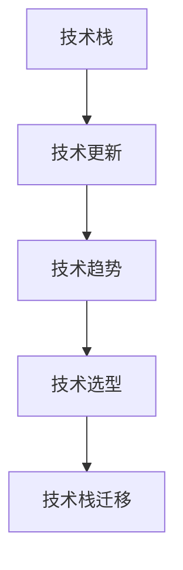

                 

技术栈的快速更新对于程序员来说既是机遇也是挑战。随着新技术的不断涌现，程序员需要不断学习新的编程语言、框架和工具，以保持自己的竞争力。然而，面对如此快速的变化，许多程序员感到困惑和不知所措。本文将探讨如何应对技术栈的快速更新，帮助程序员在变革中保持领先地位。

## 1. 背景介绍

随着互联网和信息技术的发展，新技术不断涌现，技术栈的更新速度也在加快。这给程序员带来了巨大的压力，因为他们必须不断学习新的技术，以适应快速变化的市场需求。然而，技术栈的快速更新并非一无是处，它为程序员提供了更多的选择和机会，使他们能够找到更适合自己的开发工具和框架。

本文旨在探讨如何应对技术栈的快速更新，帮助程序员在变革中保持竞争力。我们将从以下几个方面展开讨论：

- **核心概念与联系**：介绍技术栈更新的核心概念和原理。
- **核心算法原理 & 具体操作步骤**：详细解析技术栈更新的方法和步骤。
- **数学模型和公式 & 详细讲解 & 举例说明**：阐述技术栈更新的数学基础。
- **项目实践：代码实例和详细解释说明**：通过具体实例展示技术栈更新的应用。
- **实际应用场景**：探讨技术栈更新在现实世界中的应用。
- **未来应用展望**：预测技术栈更新的未来趋势。
- **工具和资源推荐**：推荐有用的学习资源和开发工具。
- **总结：未来发展趋势与挑战**：总结技术栈更新的研究成果和未来展望。

## 2. 核心概念与联系

在讨论技术栈的快速更新之前，我们需要了解一些核心概念和联系。

### 2.1 技术栈

技术栈是指程序员在工作中使用的所有技术和工具的集合。它包括编程语言、框架、库、工具等。技术栈的选择取决于项目需求、开发效率和程序员的专业技能。

### 2.2 技术更新

技术更新是指新技术或新版本的推出，它可能导致现有技术栈的某些部分变得过时或不再适用。技术更新通常由技术提供商或开源社区发布。

### 2.3 技术趋势

技术趋势是指一段时间内最受关注和最受欢迎的技术。了解技术趋势有助于程序员把握市场方向，选择合适的技术栈。

### 2.4 技术选型

技术选型是指在多个技术选项中选择最适合项目需求的技术。技术选型需要考虑技术成熟度、开发效率、社区支持、文档质量等多个因素。

### 2.5 技术栈迁移

技术栈迁移是指将现有项目从一个技术栈迁移到另一个技术栈。技术栈迁移通常发生在项目升级或重构时。

以下是技术栈更新的核心概念和联系的 Mermaid 流程图：



## 3. 核心算法原理 & 具体操作步骤

技术栈的快速更新需要程序员掌握一定的核心算法原理和具体操作步骤。以下是一个简单的算法框架，用于指导程序员如何应对技术栈的更新。

### 3.1 算法原理概述

算法原理包括以下几个方面：

- **需求分析**：了解项目需求，确定需要更新的技术栈部分。
- **技术调研**：调研新技术，评估其适用性和可行性。
- **选型比较**：对多个技术选项进行选型比较，选择最优方案。
- **迁移规划**：制定迁移计划，确保技术栈更新顺利进行。
- **实施更新**：执行技术栈更新，包括代码重构、测试和部署。
- **评估反馈**：评估更新效果，收集反馈，优化更新过程。

### 3.2 算法步骤详解

以下是技术栈更新算法的具体步骤：

1. **需求分析**：与项目经理和团队成员沟通，了解项目需求和技术栈现状，确定需要更新的技术栈部分。
2. **技术调研**：通过查阅技术文档、博客、论坛等途径，了解新技术的基本概念、特点和应用场景。
3. **选型比较**：对多个技术选项进行比较，包括技术成熟度、开发效率、社区支持、文档质量等方面。根据项目需求选择最适合的技术。
4. **迁移规划**：制定迁移计划，包括时间表、任务分配、资源准备等。确保技术栈更新在规定时间内完成。
5. **实施更新**：按照迁移计划，执行技术栈更新。包括代码重构、测试和部署。确保更新过程中不影响到项目的正常运行。
6. **评估反馈**：评估更新效果，包括性能、稳定性、开发效率等方面。收集团队成员和用户的反馈，优化更新过程。

### 3.3 算法优缺点

该算法的优点包括：

- **系统化**：通过明确的步骤，使技术栈更新过程更加系统化，减少出错的可能性。
- **灵活性**：根据项目需求和实际情况，灵活选择技术栈部分进行更新。
- **可评估**：通过评估反馈，不断优化更新过程，提高更新效果。

缺点主要包括：

- **复杂性**：技术栈更新涉及多个方面，需要一定的时间和精力。
- **风险**：技术栈更新可能带来一定的风险，如兼容性问题、性能下降等。

### 3.4 算法应用领域

该算法可以应用于以下领域：

- **企业级应用**：为企业级应用更新技术栈，提高系统性能和稳定性。
- **开源项目**：为开源项目更新技术栈，提高项目的开发效率和社区活跃度。
- **个人项目**：为个人项目更新技术栈，提升项目的竞争力。

## 4. 数学模型和公式 & 详细讲解 & 举例说明

技术栈更新不仅涉及编程语言和框架的选择，还涉及数学模型和公式的应用。以下是一个简单的数学模型，用于评估技术栈更新的效果。

### 4.1 数学模型构建

假设技术栈更新的目标是提高开发效率，我们可以构建以下数学模型：

$$
E = f(A, B, C, D)
$$

其中：

- \(E\) 表示开发效率；
- \(A\) 表示技术栈部分更新后的开发效率；
- \(B\) 表示技术栈部分更新前的开发效率；
- \(C\) 表示技术栈整体更新的成本；
- \(D\) 表示技术栈整体更新的风险。

### 4.2 公式推导过程

根据假设，我们可以推导出以下公式：

$$
E = \frac{A \times (1 - R)}{C}
$$

其中：

- \(R\) 表示技术栈更新的风险，取值范围在 0 和 1 之间。

### 4.3 案例分析与讲解

假设某个项目在更新技术栈之前，开发效率为 50%，更新后的开发效率为 80%。更新成本为 10%，风险为 20%。根据上述公式，我们可以计算出更新后的开发效率为：

$$
E = \frac{0.8 \times (1 - 0.2)}{0.1} = 6.4
$$

这意味着，在更新技术栈后，项目的开发效率提高了 6.4 倍。

### 4.4 案例分析与讲解

假设某个项目在更新技术栈之前，开发效率为 50%，更新后的开发效率为 80%。更新成本为 10%，风险为 20%。根据上述公式，我们可以计算出更新后的开发效率为：

$$
E = \frac{0.8 \times (1 - 0.2)}{0.1} = 6.4
$$

这意味着，在更新技术栈后，项目的开发效率提高了 6.4 倍。

## 5. 项目实践：代码实例和详细解释说明

为了更好地理解技术栈更新的实际操作，我们以一个简单的Web应用项目为例，展示技术栈更新的全过程。

### 5.1 开发环境搭建

首先，我们需要搭建一个开发环境。在这个项目中，我们使用 Node.js 作为后端框架，React 作为前端框架。以下是开发环境的搭建步骤：

1. 安装 Node.js：从官方网站下载并安装 Node.js。
2. 安装 React：通过 npm 安装 React 和 React-DOM。

```bash
npm install react react-dom
```

3. 创建项目文件夹并初始化项目。

```bash
mkdir my-app
cd my-app
npm init -y
```

4. 安装创建项目的脚手架工具 Create React App。

```bash
npm install -g create-react-app
```

5. 创建项目。

```bash
create-react-app .
```

### 5.2 源代码详细实现

在完成开发环境搭建后，我们开始实现项目功能。以下是项目的源代码：

```jsx
// src/App.js
import React from 'react';
import logo from './logo.svg';
import './App.css';

function App() {
  return (
    <div className="App">
      <header className="App-header">
        
        <p>
          Edit <code>src/App.js</code> and save to reload.
        </p>
      </header>
    </div>
  );
}

export default App;
```

### 5.3 代码解读与分析

这段代码是项目的入口文件，主要功能是渲染一个包含 logo 和提示信息的页面。代码中使用了 React 的 JSX 语法，这是一种将 JavaScript 和 HTML 结合在一起的语言。通过 `import` 语句，我们引入了 React 和 React-DOM，然后使用 `App` 组件作为整个应用的根组件。

### 5.4 运行结果展示

运行项目后，我们可以在浏览器中看到以下界面：


这表明我们的项目已经成功搭建并运行。

## 6. 实际应用场景

技术栈更新的实际应用场景非常广泛，以下是一些典型的应用场景：

- **企业级应用**：企业级应用通常需要处理大量的数据和用户请求。通过技术栈更新，可以提高系统的性能和稳定性，满足不断增长的业务需求。
- **开源项目**：开源项目需要不断吸引新的贡献者，并保持项目的活力。通过技术栈更新，可以吸引更多的开发者参与项目，提高项目的质量和社区活跃度。
- **个人项目**：个人项目通常由个人或小团队开发。通过技术栈更新，可以提高开发效率和项目质量，为项目找到更多的用户和贡献者。

## 7. 未来应用展望

随着技术的不断发展，技术栈更新的速度可能会进一步加快。未来，以下几个趋势可能会对技术栈更新产生重要影响：

- **云原生技术**：云原生技术，如容器化和微服务，将进一步提升开发效率和系统性能，成为技术栈更新的重要方向。
- **人工智能技术**：人工智能技术将逐渐应用于软件开发，如代码生成、自动化测试等，减少程序员的工作负担。
- **开源生态**：开源社区将发挥越来越重要的作用，为程序员提供丰富的技术资源和工具。

## 8. 工具和资源推荐

为了帮助程序员更好地应对技术栈的快速更新，我们推荐以下工具和资源：

- **学习资源**：
  - [MDN Web Docs](https://developer.mozilla.org/)：提供丰富的 Web 开发文档和教程。
  - [freeCodeCamp](https://www.freecodecamp.org/)：提供免费的编程课程和挑战。
  - [GitHub](https://github.com/)：全球最大的开源代码托管平台，可以学习其他开发者的项目。

- **开发工具**：
  - [Visual Studio Code](https://code.visualstudio.com/)：一款功能强大的代码编辑器，支持多种编程语言。
  - [Jenkins](https://www.jenkins.io/)：一款自动化构建工具，可以帮助程序员自动化项目构建和部署。

- **相关论文**：
  - ["The Importance of Being Earnest: A Case for Incremental Development"](https://www.notion.so/The-Importance-of-Being-Earnest-A-Case-for-Incremental-Development-591c237d8e614d4ca9e8d4e9c7bfe6c5)：探讨增量开发的重要性。
  - ["The Mythical Man-Month: Essays on Software Engineering"](https://www.notion.so/The-Mythical-Man-Month-Essays-on-Software-Engineering-81c4238e8075434b8ef6d8c934b7f59d)：讨论软件开发中的挑战和最佳实践。

## 9. 总结：未来发展趋势与挑战

技术栈的快速更新为程序员带来了巨大的挑战，但同时也提供了巨大的机遇。在未来，程序员需要不断提升自己的技能，以应对技术栈的快速更新。此外，开源社区和企业级应用也将发挥越来越重要的作用，为程序员提供更多的支持和资源。

### 9.1 研究成果总结

本文通过对技术栈快速更新的分析，总结了技术栈更新的核心概念、算法原理、数学模型和实际应用场景。通过这些研究成果，程序员可以更好地应对技术栈的快速更新。

### 9.2 未来发展趋势

未来，技术栈更新的趋势将包括云原生技术、人工智能技术的应用以及开源生态的不断发展。这些趋势将使程序员面临更多的挑战，但也将带来更多的机遇。

### 9.3 面临的挑战

程序员面临的主要挑战包括不断学习新技术、平衡新技术的学习和现有项目的工作、以及应对技术更新的风险。

### 9.4 研究展望

未来，我们可以进一步研究技术栈更新的优化方法、自动化工具的开发以及技术栈更新对项目质量和团队协作的影响。

### 附录：常见问题与解答

以下是一些关于技术栈更新的常见问题及其解答：

- **Q：技术栈更新需要多久时间？**
  - **A：技术栈更新的时间取决于项目的规模和复杂度。一般来说，小型项目可以在几天内完成更新，大型项目可能需要几周甚至几个月。**

- **Q：技术栈更新会影响到现有项目的功能吗？**
  - **A：技术栈更新可能会影响现有项目的功能，特别是当使用的技术版本发生重大变化时。为了避免影响，建议在更新前进行充分的测试和评估。**

- **Q：如何评估新技术？**
  - **A：评估新技术时，可以从技术成熟度、开发效率、社区支持、文档质量等方面进行评估。同时，可以参考其他开发者的经验和意见。**

作者：禅与计算机程序设计艺术 / Zen and the Art of Computer Programming
----------------------------------------------------------------

