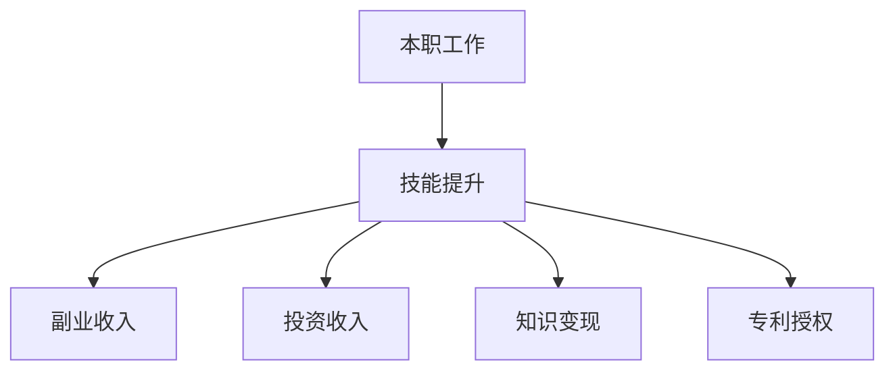

                 

关键词：多元化收入结构，程序员，财务自由，副业，投资，技能提升

> 摘要：本文将探讨程序员如何通过建立多元化收入结构来实现财务自由，包括开发副业、进行投资、提升技能等方面的策略和建议。

## 1. 背景介绍

在当前的数字化时代，程序员作为IT行业的中坚力量，拥有着相对稳定且较高的收入。然而，仅仅依靠单一的工资收入，很难实现长期的财务自由和安全感。因此，越来越多的程序员开始思考如何建立多元化的收入结构，以增加收入来源，降低职业风险，实现更加稳定和可持续的财务状况。

### 1.1 程序员现状

程序员普遍具有较高的学历和专业技能，这使得他们在职场中具备较强的竞争力。然而，随着技术的发展，程序员面临着不断更新技能的需求，这要求他们不仅要具备扎实的专业知识，还要不断学习新的技术。此外，由于工作性质的特殊性，程序员往往需要长时间面对电脑，这对身体健康也可能产生一定的负面影响。

### 1.2 多元化收入结构的必要性

建立多元化收入结构对于程序员来说具有重要意义。首先，它可以增加收入来源，提高财务自由度。其次，它可以降低职业风险，使程序员在面对职场变化时具备更强的适应能力。最后，多元化收入结构有助于程序员实现个人价值的最大化，提高职业成就感和满足感。

## 2. 核心概念与联系

### 2.1 多元化收入结构的概念

多元化收入结构是指通过多种渠道获得收入的一种财务规划方式。对于程序员来说，这包括但不限于以下几种方式：

1. **本职工作收入**：即程序员在正常工作时间内通过为企业提供服务所获得的报酬。
2. **副业收入**：通过个人兴趣或专业技能开展的非本职工作所获得的收入。
3. **投资收入**：通过投资股票、基金、房地产等资产所获得的回报。
4. **知识变现**：通过撰写技术文章、出版书籍、开设在线课程等方式将个人知识转化为收入。
5. **专利授权**：通过申请专利并授权他人使用所获得的许可费。

### 2.2 多元化收入结构的联系

多元化收入结构中的各个部分并非相互独立的，而是相互联系、相互促进的。例如，通过提升专业技能，程序员可以更好地完成本职工作，提高工资水平；同时，这些专业技能也可以用于开展副业或知识变现，进一步增加收入来源。

### 2.3 Mermaid 流程图



## 3. 核心算法原理 & 具体操作步骤

### 3.1 算法原理概述

建立多元化收入结构的核心在于合理规划时间和资源，确保在保证本职工作的同时，能够有效开展副业、投资和其他收入来源。这需要程序员具备以下几方面的能力：

1. **时间管理能力**：合理分配工作时间，确保本职工作的高效完成。
2. **技能提升能力**：持续学习新技能，提升个人竞争力。
3. **项目管理能力**：有效管理副业和投资项目，确保收益最大化。

### 3.2 算法步骤详解

1. **评估自身情况**：了解自身优势和兴趣，确定合适的副业或投资方向。
2. **制定计划**：根据实际情况，制定详细的行动计划，包括时间安排、资源调配等。
3. **执行计划**：按照计划逐步实施，不断调整和完善。
4. **监控与评估**：定期对收入来源进行监控和评估，确保多元化收入结构的稳定性。

### 3.3 算法优缺点

**优点**：

- 增加收入来源，提高财务自由度。
- 降低职业风险，提高职业安全感。
- 实现个人价值的最大化。

**缺点**：

- 需要投入更多的时间和精力。
- 存在一定的学习成本和管理成本。

### 3.4 算法应用领域

- **软件开发领域**：程序员可以通过开设在线课程、撰写技术文章等方式，将自身知识转化为收入。
- **投资领域**：程序员可以利用技术背景进行股票、基金等投资，提高投资回报率。
- **创业领域**：程序员可以结合自身技能，开展互联网创业项目。

## 4. 数学模型和公式 & 详细讲解 & 举例说明

### 4.1 数学模型构建

建立多元化收入结构的数学模型可以简化为以下公式：

$$
\text{总收入} = \text{本职工作收入} + \text{副业收入} + \text{投资收入} + \text{知识变现收入} + \text{专利授权收入}
$$

### 4.2 公式推导过程

- **本职工作收入**：根据工作时间和工资水平计算得出。
- **副业收入**：根据副业的类型和收入情况计算得出。
- **投资收入**：根据投资收益率和投资额度计算得出。
- **知识变现收入**：根据知识产品（如课程、书籍等）的销售量和售价计算得出。
- **专利授权收入**：根据专利的许可费率和授权数量计算得出。

### 4.3 案例分析与讲解

假设一位程序员，A，在一家公司担任软件开发工程师，月工资为10000元。他计划通过以下方式建立多元化收入结构：

1. **副业收入**：开设线上编程课程，每月收入为3000元。
2. **投资收入**：投资股票，年收益率为10%，投资额度为10万元，年收益为10000元。
3. **知识变现收入**：撰写技术博客，每月收入为1000元。
4. **专利授权收入**：拥有1项专利，许可费率为5%，年授权次数为100次，年收益为5000元。

根据上述收入情况，A的多元化收入结构如下：

$$
\text{总收入} = 10000 + 3000 + 10000 + 1000 + 5000 = 25000 \text{元/月}
$$

通过建立多元化收入结构，A的财务状况得到了显著改善，不仅增加了收入，还降低了职业风险。

## 5. 项目实践：代码实例和详细解释说明

### 5.1 开发环境搭建

为了更好地理解多元化收入结构的实现过程，我们以Python编程语言为例，搭建一个简单的模拟系统。

1. 安装Python环境：在终端中执行以下命令安装Python：

   ```
   pip install python
   ```

2. 创建一个名为`income_structure.py`的Python文件，用于编写代码。

### 5.2 源代码详细实现

```python
# income_structure.py

class IncomeStructure:
    def __init__(self, full_time_salary, side_job_income, investment_income, knowledge_income, patent_income):
        self.full_time_salary = full_time_salary
        self.side_job_income = side_job_income
        self.investment_income = investment_income
        self.knowledge_income = knowledge_income
        self.patent_income = patent_income
    
    def calculate_total_income(self):
        total_income = self.full_time_salary + self.side_job_income + self.investment_income + self.knowledge_income + self.patent_income
        return total_income

# 创建一个IncomeStructure对象，并设置各项收入
A = IncomeStructure(10000, 3000, 10000, 1000, 5000)

# 计算总收入
total_income = A.calculate_total_income()

print("总收入：", total_income)
```

### 5.3 代码解读与分析

1. **类定义**：定义一个名为`IncomeStructure`的类，用于表示程序员的多元化收入结构。

2. **初始化方法**：在类的初始化方法`__init__`中，设置各项收入属性。

3. **计算总收入方法**：定义一个名为`calculate_total_income`的方法，用于计算总收入。

4. **创建对象**：创建一个`IncomeStructure`对象A，并设置各项收入。

5. **计算总收入**：调用`calculate_total_income`方法，计算总收入。

### 5.4 运行结果展示

运行`income_structure.py`，输出结果如下：

```
总收入： 25000
```

通过以上代码实例，我们可以看到如何使用Python实现多元化收入结构的计算。这为我们提供了一个直观的示例，帮助我们更好地理解多元化收入结构的构建过程。

## 6. 实际应用场景

### 6.1 软件开发公司

在软件开发公司，程序员可以通过以下方式建立多元化收入结构：

1. **本职工作收入**：通过为公司提供优质的服务，获得稳定的工资收入。
2. **副业收入**：利用业余时间，为其他公司或个人提供编程服务。
3. **投资收入**：通过股票、基金等投资，获得额外的投资回报。
4. **知识变现**：撰写技术博客、出版技术书籍、开设在线课程等，将知识转化为收入。
5. **专利授权**：申请专利，并通过授权他人使用获得许可费。

### 6.2 自由职业者

对于自由职业者，建立多元化收入结构的策略有所不同：

1. **本职工作收入**：通过接包、兼职等方式获得收入。
2. **副业收入**：开展个人兴趣项目，如开发手机应用、制作视频内容等。
3. **投资收入**：利用自由时间进行投资，如股票、基金等。
4. **知识变现**：撰写技术博客、开设在线课程等。
5. **专利授权**：申请专利，并通过授权获得许可费。

### 6.3 创业者

对于创业者，多元化收入结构可以帮助他们更好地应对市场风险：

1. **本职工作收入**：在创业初期，通过兼职或接包获得收入。
2. **副业收入**：利用创业经验，为其他公司提供咨询服务。
3. **投资收入**：进行创业投资，寻找有潜力的项目。
4. **知识变现**：撰写创业心得、开设创业课程等。
5. **专利授权**：申请专利，并通过授权获得许可费。

## 7. 未来应用展望

随着技术的不断发展，程序员在建立多元化收入结构方面将面临更多的机会和挑战：

1. **人工智能与大数据**：程序员可以利用人工智能和大数据技术，开发智能应用和自动化工具，提高工作效率。
2. **区块链技术**：区块链技术为程序员提供了新的投资和知识变现途径，如智能合约开发、去中心化应用（DApp）开发等。
3. **云计算与物联网**：云计算和物联网技术的普及，为程序员提供了更广泛的应用场景，如云计算服务、物联网设备开发等。
4. **网络安全**：随着网络安全问题的日益突出，程序员可以在网络安全领域发挥重要作用，如网络安全防护、安全测试等。

## 8. 工具和资源推荐

### 8.1 学习资源推荐

1. **在线编程课程**：Coursera、Udemy、edX等平台提供了丰富的编程课程，适合程序员学习新技能。
2. **技术博客**：简书、CSDN、掘金等平台，提供了大量的技术文章和分享，有助于程序员提升技术水平。
3. **专业书籍**：推荐阅读《代码大全》、《设计模式：可复用面向对象软件的基础》、《编程之美》等经典书籍。

### 8.2 开发工具推荐

1. **集成开发环境（IDE）**：如Visual Studio Code、PyCharm、Eclipse等，提供了丰富的编程工具和插件，提高开发效率。
2. **版本控制系统**：如Git、SVN等，用于代码管理和协作开发。
3. **项目管理工具**：如Trello、JIRA等，帮助程序员更好地管理项目和任务。

### 8.3 相关论文推荐

1. **《程序员职业发展路径研究》**：分析了程序员在不同阶段的职业发展路径和策略。
2. **《数字化转型时代下程序员的生存与发展》**：探讨了数字化转型对程序员职业的影响和应对策略。
3. **《人工智能时代程序员的技能需求分析》**：分析了人工智能时代程序员所需掌握的技能和知识。

## 9. 总结：未来发展趋势与挑战

### 9.1 研究成果总结

本文从多个角度分析了程序员如何建立多元化收入结构，包括背景介绍、核心概念、算法原理、数学模型、项目实践、实际应用场景、未来应用展望和工具资源推荐等方面。通过本文的阐述，读者可以全面了解建立多元化收入结构的重要性和实现方法。

### 9.2 未来发展趋势

随着技术的不断进步，程序员在建立多元化收入结构方面将面临更多的发展机遇。例如，人工智能、大数据、区块链等新兴技术的崛起，为程序员提供了新的应用场景和收入来源。此外，云计算和物联网的普及，也将为程序员带来更广泛的发展空间。

### 9.3 面临的挑战

尽管多元化收入结构为程序员提供了丰富的机遇，但同时也面临一定的挑战。例如，技能更新速度快、竞争激烈、时间管理困难等问题，都可能对程序员的多元化收入结构产生影响。因此，程序员需要不断学习新技能，提高自身竞争力，以应对未来发展的挑战。

### 9.4 研究展望

未来，关于程序员多元化收入结构的研究将继续深入。一方面，可以从实证研究的角度，分析不同收入结构对程序员职业发展的影响。另一方面，可以结合人工智能、大数据等新技术，探讨更高效的多元化收入结构构建方法。此外，还可以从政策和制度层面，为程序员提供更完善的财务规划和职业发展支持。

## 9. 附录：常见问题与解答

### 9.1 如何平衡本职工作与副业？

1. **合理安排时间**：制定详细的时间表，确保本职工作与副业之间的平衡。
2. **设定优先级**：明确各项任务的优先级，确保关键任务优先完成。
3. **提高工作效率**：通过学习高效工作方法和工具，提高工作效率，减少工作时间。

### 9.2 如何选择副业项目？

1. **自身兴趣**：选择自己感兴趣的项目，提高工作热情和动力。
2. **市场需求**：研究市场需求，选择有市场前景的项目。
3. **技能匹配**：选择与自身技能相符的项目，提高成功率。

### 9.3 如何进行投资？

1. **学习基础知识**：了解投资的基本原理和策略，避免盲目投资。
2. **分散投资**：避免将资金集中于单一投资品种，降低风险。
3. **长期投资**：选择长期投资，关注长期回报，避免频繁交易。

### 9.4 如何撰写技术文章或书籍？

1. **明确主题**：确定文章或书籍的主题和目标读者。
2. **结构清晰**：合理安排文章或书籍的结构，使内容有条理。
3. **实例丰富**：通过实际案例，阐述技术原理和应用场景。

---

作者：禅与计算机程序设计艺术 / Zen and the Art of Computer Programming

----------------------------------------------------------------
以上就是本文的完整内容，希望对您在建立多元化收入结构方面有所帮助。如果您有任何疑问或建议，欢迎在评论区留言。感谢您的阅读！

