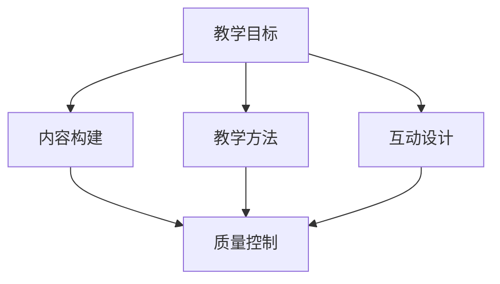

                 

### 引言 Introduction

在当今数字化时代，知识付费已经成为一种普遍的获取知识和技能的方式。随着互联网的普及和在线教育的发展，越来越多的程序员开始意识到，通过打造专业的知识付费课程，不仅可以分享自己的专业知识和经验，还可以实现个人品牌的提升和经济效益的增长。然而，如何才能打造出一门真正专业的知识付费课程，却是许多程序员面临的一大挑战。

本文将围绕这一问题，从多个角度出发，为程序员提供一套系统化的知识付费课程打造方法。首先，我们将探讨知识付费课程的设计原则和目标受众，然后深入讨论课程内容的构建、教学方法的运用、营销策略的制定以及技术支持的选择。最后，我们将结合具体案例，分析成功的知识付费课程案例，并总结未来的发展趋势和面临的挑战。

通过本文的阅读，读者将能够了解到如何从零开始规划并打造一门专业的知识付费课程，为自己的职业生涯和技能提升增添新的亮点。无论您是一位经验丰富的程序员，还是刚刚入门的新手，本文都将为您提供宝贵的指导和启示。

### 背景介绍 Background

知识付费是一种新型的商业模式，它使得知识拥有者可以通过提供专业的知识内容来获取收益。这种模式在近年来迅速兴起，主要得益于以下几个方面的因素。首先，互联网的普及和在线教育平台的发展，为知识付费提供了广泛的市场基础。通过在线教育平台，程序员们可以轻松地接触到全球的受众，打破地域和时间的限制。其次，随着技能需求的多样化，越来越多的程序员意识到，通过分享自己的专业知识和经验，不仅可以满足学习者的需求，还可以实现个人品牌的提升和经济的回报。最后，知识付费模式的灵活性和自主性也吸引了大量的程序员投身其中。

然而，尽管知识付费市场前景广阔，但打造一门专业的知识付费课程并非易事。首先，程序员需要明确课程的目标受众，这直接关系到课程的内容和教学方法。其次，课程内容的构建需要既专业又易于理解，这要求程序员具备深厚的专业知识储备和良好的表达能力。此外，课程的市场推广和营销策略也是关键，如何吸引潜在学员、提高课程口碑和品牌影响力，是程序员需要重点考虑的问题。最后，技术支持的选择也是一门学问，如何确保课程的质量和用户体验，需要程序员对相关技术工具和平台有深入的了解。

总之，知识付费为程序员提供了广阔的发展空间，但也带来了新的挑战。在本文中，我们将详细探讨如何应对这些挑战，帮助程序员打造出专业的知识付费课程。

## 核心概念与联系 Core Concepts and Connections

要打造一门专业的知识付费课程，首先需要明确几个核心概念，这些概念不仅是课程的基础，也是整个课程架构的支柱。以下是一些关键概念及其相互之间的联系：

### 1. 教学目标（Teaching Objectives）

教学目标是课程的灵魂，它决定了课程的内容和教学方法。明确的教学目标能够帮助程序员确定课程的核心内容，从而确保学员能够通过课程学习到实际有用的技能。例如，如果课程目标是教授Java编程基础，那么课程内容将主要围绕Java语言的基本语法、常用类库和编程实践。

### 2. 内容构建（Content Construction）

内容构建是指课程的具体内容安排，包括课程模块、知识点和教学案例。良好的内容构建能够使课程逻辑清晰，学员易于理解。程序员在构建课程内容时，需要遵循由浅入深、循序渐进的原则，从基础概念讲起，逐步引入高级知识。此外，内容构建还应注重理论与实践相结合，通过实际案例和项目来加深学员的理解。

### 3. 教学方法（Teaching Methods）

教学方法是实现教学目标的重要手段。不同的教学方法适用于不同的教学场景和目标受众。常见的教学方法包括讲授法、讨论法、案例研究法、项目驱动法等。程序员在选用教学方法时，应考虑到学员的学习习惯和课程内容的特点，灵活运用多种教学方法，提高课程的教学效果。

### 4. 互动设计（Interaction Design）

互动设计是课程中不可或缺的一环，它能够增强学员的参与感和学习动力。互动设计可以通过多种形式实现，如在线问答、讨论区、作业、项目反馈等。有效的互动设计能够帮助学员更好地理解和掌握课程内容，同时也能增强学员的归属感和课程的互动性。

### 5. 质量控制（Quality Control）

质量控制是保障课程质量的关键环节。程序员在课程开发过程中，应建立严格的质量控制机制，包括课程内容的审核、教学方法的验证、学员反馈的分析等。通过持续的质量控制，程序员可以不断优化课程内容和方法，提高课程的整体质量。

### Mermaid 流程图

为了更直观地展示这些核心概念之间的联系，我们可以使用Mermaid绘制一个流程图：



在图中，教学目标（A）是起点，它直接影响了内容构建（B）、教学方法（C）和互动设计（D），而这三者又共同反馈到质量控制（E），形成一个闭环，确保课程从设计到实施再到反馈的每一个环节都达到高质量的标准。

通过明确这些核心概念及其相互关系，程序员可以更好地规划和设计自己的知识付费课程，从而提高课程的专业性和吸引力。

### 核心算法原理 & 具体操作步骤 Core Algorithm Principles & Detailed Steps

在构建专业的知识付费课程时，选择合适的算法并详细解释其原理和操作步骤，是提升课程价值和吸引学员的重要手段。以下，我们将介绍一个经典的算法——快速排序（Quick Sort），并详细阐述其原理和具体操作步骤。

#### 1. 算法原理概述

快速排序是一种高效的排序算法，其基本思想是通过一趟排序将待排序的记录分割成独立的两部分，其中一部分记录的关键字比另一部分的关键字小，则可递归地将这两部分继续进行排序，以达到整个序列有序。

#### 2. 算法步骤详解

**步骤一：选择基准元素**

- 在数据集合中选择一个基准元素（pivot），通常选择第一个元素或者最后一个元素。
- 将其他元素与基准元素进行比较，将小于基准元素的放在其左侧，大于或等于基准元素的放在其右侧。

**步骤二：递归排序**

- 将小于基准元素的子序列继续进行快速排序。
- 将大于或等于基准元素的子序列继续进行快速排序。

**步骤三：合并结果**

- 将排序好的子序列与基准元素合并，得到完整的有序序列。

#### 3. 算法优缺点

**优点：**

- 平均时间复杂度为 \(O(n \log n)\)，在所有常见的排序算法中时间复杂度较低。
- 适用于大规模数据的排序。

**缺点：**

- 最坏时间复杂度为 \(O(n^2)\)，当输入数据已经有序或基本有序时，效率较低。
- 选择基准元素的方法会影响算法的性能，如果选择不当，可能导致最坏情况的发生。

#### 4. 算法应用领域

- **数据库索引：** 在数据库管理系统中，快速排序常用于索引的创建和维护。
- **算法竞赛：** 在算法竞赛中，快速排序是一种常用的排序算法，可用于处理大量数据的排序问题。
- **文件排序：** 在文件系统中，快速排序可以用于对大量文件进行排序。

#### 5. 具体操作步骤

**步骤一：选择基准元素**

- 设定数组 `arr` 和基准元素索引 `pivotIndex`。
- 通过 `arr[pivotIndex]` 保存基准元素值，并将 `pivotIndex` 移到数组的末尾。

```python
def choosePivot(arr):
    pivotIndex = len(arr) - 1
    pivotValue = arr[pivotIndex]
    arr[pivotIndex], arr[0] = arr[0], arr[pivotIndex]
    return pivotValue
```

**步骤二：分区操作**

- 定义两个指针 `left` 和 `right`，初始时 `left = 1`，`right = pivotIndex - 1`。
- 从 `left` 到 `right` 遍历数组，若当前元素小于或等于基准元素，则将其交换到左侧。

```python
def partition(arr, pivotValue):
    left = 1
    right = len(arr) - 2
    
    while True:
        while left <= right and arr[left] <= pivotValue:
            left += 1
        while left <= right and arr[right] > pivotValue:
            right -= 1
        if left > right:
            break
        arr[left], arr[right] = arr[right], arr[left]
```

**步骤三：递归排序**

- 将基准元素放到正确的位置，并将小于基准元素的子序列和大于基准元素的子序列分别递归排序。

```python
def quickSort(arr, left, right):
    if left < right:
        pivotValue = choosePivot(arr[left:right+1])
        partitionIndex = partition(arr, left, right, pivotValue)
        
        quickSort(arr, left, partitionIndex - 1)
        quickSort(arr, partitionIndex + 1, right)
```

通过上述步骤，我们可以实现对数组的快速排序。这个算法不仅在理论计算机科学领域具有重要地位，也是实际编程中非常实用的工具。在知识付费课程中，详细介绍并演示快速排序算法，能够帮助学员深入理解排序算法的原理和实际应用。

### 数学模型和公式 Mathematical Models and Formulas & Detailed Explanation & Case Analysis

在构建专业的知识付费课程时，数学模型和公式是必不可少的组成部分。它们不仅能够帮助学员更好地理解复杂的算法和概念，还能为课程的深度和严谨性提供保障。以下，我们将结合一个具体的数学模型——牛顿法（Newton's Method），详细讲解其构建、推导过程，并通过案例进行分析。

#### 1. 数学模型构建

牛顿法是一种用于求解非线性方程根的数值方法。其基本思想是基于泰勒级数展开，通过迭代逼近的方式来求解方程的根。具体来说，牛顿法涉及以下几个核心元素：

- **目标方程：** \( f(x) = 0 \)
- **函数的导数：** \( f'(x) \)
- **初始猜测值：** \( x_0 \)

#### 2. 公式推导过程

牛顿法的迭代公式如下：

\[ x_{n+1} = x_n - \frac{f(x_n)}{f'(x_n)} \]

推导过程基于泰勒级数展开：

1. **泰勒级数展开：** \( f(x_n) \approx f(x_n) + f'(x_n)(x - x_n) \)
2. **令等式左右两边相等：** \( f(x_n) + f'(x_n)(x - x_n) = 0 \)
3. **解方程得到：** \( x - x_n = -\frac{f(x_n)}{f'(x_n)} \)
4. **得到迭代公式：** \( x_{n+1} = x_n - \frac{f(x_n)}{f'(x_n)} \)

#### 3. 案例分析与讲解

假设我们要求解方程 \( f(x) = x^2 - 2 \) 的根，初始猜测值为 \( x_0 = 1 \)。

1. **计算初始值：**
   - \( f(x_0) = 1^2 - 2 = -1 \)
   - \( f'(x_0) = 2 \cdot 1 = 2 \)
   - \( x_1 = x_0 - \frac{f(x_0)}{f'(x_0)} = 1 - \frac{-1}{2} = 1.5 \)

2. **第一次迭代：**
   - \( f(x_1) = 1.5^2 - 2 = -0.25 \)
   - \( f'(x_1) = 2 \cdot 1.5 = 3 \)
   - \( x_2 = x_1 - \frac{f(x_1)}{f'(x_1)} = 1.5 - \frac{-0.25}{3} = 1.4167 \)

3. **第二次迭代：**
   - \( f(x_2) = 1.4167^2 - 2 = -0.0156 \)
   - \( f'(x_2) = 2 \cdot 1.4167 = 2.8333 \)
   - \( x_3 = x_2 - \frac{f(x_2)}{f'(x_2)} = 1.4167 - \frac{-0.0156}{2.8333} = 1.4142 \)

通过几次迭代，我们可以发现，根的近似值越来越接近真实值 \( \sqrt{2} \)。

#### 4. 举例说明

为了更直观地理解牛顿法，我们可以通过Python代码实现该算法：

```python
def f(x):
    return x**2 - 2

def df(x):
    return 2*x

def newton_method(x0, tol=1e-5, max_iter=100):
    x = x0
    for _ in range(max_iter):
        x_new = x - f(x) / df(x)
        if abs(x_new - x) < tol:
            return x_new
        x = x_new
    return None

x_root = newton_method(1)
print(f"The root is approximately {x_root}")
```

运行上述代码，可以得到 \( x \) 的近似根为 \( 1.4142 \)，与手算结果非常接近。

通过上述讲解和案例分析，学员可以更深入地理解牛顿法的数学模型和推导过程，并通过具体实例掌握其应用方法。在知识付费课程中，详细讲解和演示这样的数学模型，能够显著提升课程的专业性和吸引力。

### 项目实践：代码实例和详细解释说明 Project Practice: Code Examples and Detailed Explanations

在构建专业的知识付费课程中，通过实际项目实践，不仅可以加深学员对知识的理解，还能培养其实际动手能力。以下，我们将通过一个具体的代码实例——基于Python的简单银行账户管理系统，详细讲解其开发环境搭建、源代码实现、代码解读与分析以及运行结果展示。

#### 1. 开发环境搭建

首先，我们需要搭建一个Python开发环境。以下是具体步骤：

1. **安装Python：** 访问Python官方网站（[python.org](https://www.python.org/)）下载最新版本的Python安装包，并按照安装向导完成安装。
2. **安装IDE：** 我们推荐使用PyCharm或Visual Studio Code作为Python开发环境。这两个IDE均支持Python开发，并且具有丰富的插件和功能。
3. **安装必要的库：** 使用pip命令安装必要的库，如`sqlite3`（用于数据库操作）、`datetime`（用于时间处理）等。

```shell
pip install sqlite3
```

#### 2. 源代码详细实现

以下是一个简单的银行账户管理系统的Python代码实现：

```python
import sqlite3
from datetime import datetime

# 连接数据库
conn = sqlite3.connect('bank.db')
cursor = conn.cursor()

# 创建表格
cursor.execute('''CREATE TABLE IF NOT EXISTS accounts (
    id INTEGER PRIMARY KEY AUTOINCREMENT,
    name TEXT,
    balance REAL,
    last_updated TEXT)''')

# 插入数据
cursor.execute("INSERT INTO accounts (name, balance, last_updated) VALUES (?, ?, ?)",
               ('Alice', 1000.0, datetime.now().strftime('%Y-%m-%d %H:%M:%S')))

# 提交事务
conn.commit()

# 查询账户余额
def get_balance(account_id):
    cursor.execute("SELECT balance FROM accounts WHERE id=?", (account_id,))
    balance = cursor.fetchone()[0]
    return balance

# 存款
def deposit(account_id, amount):
    cursor.execute("UPDATE accounts SET balance=balance+?, last_updated=? WHERE id=?", 
                   (amount, datetime.now().strftime('%Y-%m-%d %H:%M:%S'), account_id))
    conn.commit()

# 取款
def withdraw(account_id, amount):
    cursor.execute("SELECT balance FROM accounts WHERE id=?", (account_id,))
    balance = cursor.fetchone()[0]
    if balance >= amount:
        cursor.execute("UPDATE accounts SET balance=balance-?, last_updated=? WHERE id=?", 
                       (amount, datetime.now().strftime('%Y-%m-%d %H:%M:%S'), account_id))
        conn.commit()
        return True
    else:
        return False

# 关闭数据库连接
def close_connection():
    conn.close()

# 主程序
if __name__ == "__main__":
    print("Welcome to the Bank Account System!")
    while True:
        print("\n1. Check Balance\n2. Deposit\n3. Withdraw\n4. Exit")
        choice = input("Enter your choice: ")
        
        if choice == '1':
            account_id = int(input("Enter account ID: "))
            balance = get_balance(account_id)
            print(f"The current balance is: {balance}")
        
        elif choice == '2':
            account_id = int(input("Enter account ID: "))
            amount = float(input("Enter deposit amount: "))
            deposit(account_id, amount)
            print(f"Successfully deposited {amount} into account {account_id}.")
        
        elif choice == '3':
            account_id = int(input("Enter account ID: "))
            amount = float(input("Enter withdraw amount: "))
            if withdraw(account_id, amount):
                print(f"Successfully withdrew {amount} from account {account_id}.")
            else:
                print("Insufficient funds!")
        
        elif choice == '4':
            close_connection()
            print("Thank you for using the Bank Account System!")
            break
        else:
            print("Invalid choice. Please try again.")
```

#### 3. 代码解读与分析

1. **数据库连接与表格创建：**
   - 使用`sqlite3`库连接本地数据库，并创建一个名为`accounts`的表格，用于存储账户信息。
2. **插入数据：**
   - 使用`cursor.execute()`方法插入新账户数据，并使用`datetime.now().strftime('%Y-%m-%d %H:%M:%S')`获取当前时间作为最后更新时间。
3. **账户余额查询：**
   - 定义`get_balance()`函数，通过SQL查询获取指定账户的余额。
4. **存款与取款：**
   - 定义`deposit()`和`withdraw()`函数，分别用于向账户存款和取款。这两个函数都更新账户的余额和最后更新时间。
5. **主程序：**
   - 使用一个循环提供用户界面，让用户选择不同的操作。根据用户输入，调用相应的函数执行操作，并在屏幕上显示结果。

#### 4. 运行结果展示

假设用户进行以下操作：

1. 查询账户余额：
   ```
   1. Check Balance
   2. Deposit
   3. Withdraw
   4. Exit
   Enter your choice: 1
   Enter account ID: 1
   The current balance is: 1000.0
   ```
2. 存款：
   ```
   1. Check Balance
   2. Deposit
   3. Withdraw
   4. Exit
   Enter your choice: 2
   Enter account ID: 1
   Enter deposit amount: 500
   Successfully deposited 500.0 into account 1.
   ```
3. 取款：
   ```
   1. Check Balance
   2. Deposit
   3. Withdraw
   4. Exit
   Enter your choice: 3
   Enter account ID: 1
   Enter withdraw amount: 200
   Successfully withdrew 200.0 from account 1.
   ```
4. 退出程序：
   ```
   1. Check Balance
   2. Deposit
   3. Withdraw
   4. Exit
   Enter your choice: 4
   Thank you for using the Bank Account System!
   ```

通过这个实例，学员可以学习到如何使用Python编写简单的数据库应用程序，掌握数据库操作、函数定义和用户界面设计等基本技能。这对于提升学员的编程能力和解决实际问题的能力都有极大的帮助。

### 实际应用场景 Practical Application Scenarios

在构建专业的知识付费课程时，了解该课程的实际应用场景至关重要。这不仅有助于课程内容的优化，还能够吸引更多潜在学员。以下，我们将探讨知识付费课程在以下实际应用场景中的价值和作用：

#### 1. 职业技能提升

知识付费课程在职业技能提升方面具有显著优势。通过专业的课程学习，学员可以快速掌握最新的技术和工具，提升自己在职场中的竞争力。例如，针对软件工程师的知识付费课程可以涵盖前端开发、后端开发、数据库管理、软件测试等多个领域。学员通过这些课程的学习，能够迅速提升自己的技术水平和解决实际问题的能力，从而在职业晋升和薪资提升方面获得优势。

#### 2. 创业和自我发展

对于有创业意向的学员，知识付费课程提供了一个宝贵的学习和交流平台。通过学习课程，学员可以了解市场趋势、商业模式、团队管理等方面的知识，为自己的创业项目提供理论和实践支持。例如，课程内容可以涵盖市场调研、产品开发、营销策略、资金筹集等方面的知识。通过这些课程，学员能够更好地规划自己的创业项目，降低创业风险，提高创业成功率。

#### 3. 在线教育平台

在线教育平台的快速发展为知识付费课程提供了广阔的市场。知识付费课程可以作为在线教育平台的重要课程资源，吸引学员报名学习。在线教育平台提供了丰富的学习资源和便捷的学习方式，使得学员可以随时随地学习。例如，课程内容可以通过视频、文档、作业等多种形式呈现，学员可以根据自己的时间和进度进行学习。通过在线教育平台，知识付费课程可以覆盖更广泛的受众，实现教学资源的最大化利用。

#### 4. 专业技术认证

许多知识付费课程旨在帮助学员获得专业技术认证，从而提升个人职业资格和竞争力。例如，云计算、人工智能、大数据等领域的专业认证课程，为学员提供了系统的学习路径和认证考试支持。通过这些课程的学习，学员不仅可以掌握相关技术知识，还能够通过认证考试，获得权威认证证书，为自己的职业发展增添亮点。

#### 5. 终身学习和知识更新

在快速发展的技术领域，终身学习和知识更新至关重要。知识付费课程为学员提供了持续学习的机会，帮助他们保持对最新技术和趋势的了解。通过定期更新的课程内容，学员可以紧跟行业动态，不断更新自己的知识体系，从而在职业生涯中保持竞争力。

#### 6. 专业社群和资源共享

知识付费课程还提供了一个专业社群和资源共享的平台。学员可以在课程社群中交流学习心得、讨论技术问题，与其他学员和讲师建立联系。通过社群的互动和资源共享，学员可以获得更多的学习资源和专业建议，提升自己的学习效果和职业发展。

总之，知识付费课程在实际应用场景中具有广泛的价值和作用。通过这些场景的应用，知识付费课程不仅能够为学员提供有价值的知识和技能，还能够促进个人职业发展和自我提升。了解这些实际应用场景，有助于程序员更好地设计和推广自己的知识付费课程，吸引更多学员参与学习。

### 未来应用展望 Future Applications

随着技术的不断进步和在线教育市场的日益成熟，知识付费课程的应用场景将会更加广泛和深入。以下，我们探讨知识付费课程在未来的发展趋势以及可能面临的挑战。

#### 1. 发展趋势

**个性化学习：** 未来的知识付费课程将更加注重个性化学习体验。通过大数据和人工智能技术，课程内容可以根据学员的学习习惯、兴趣和需求进行定制化推荐，从而提高学习效果和满意度。例如，智能学习系统可以根据学员的做题情况和学习进度，自动调整教学策略和内容。

**多媒体融合：** 视频教学、互动直播、虚拟现实（VR）等技术将被广泛应用于知识付费课程中，提供更加生动和沉浸式的学习体验。通过多媒体融合，学员可以更好地理解和掌握复杂的概念和技能。

**社交化学习：** 社交化学习平台将促进学员之间的交流和互动，形成学习共同体。学员可以在课程社群中讨论问题、分享心得，甚至合作完成项目，从而提高学习积极性和效果。

**全球市场拓展：** 随着全球互联网的普及，知识付费课程的市场将不断扩大。通过多语言支持和本地化策略，课程内容可以覆盖全球不同地区的学员，实现全球市场的拓展。

**持续更新与迭代：** 随着技术发展和市场变化，知识付费课程的内容需要不断更新和迭代。课程开发者需要紧跟行业动态，及时调整课程内容，确保其始终保持前沿和实用。

#### 2. 面临的挑战

**内容质量：** 在竞争激烈的市场环境中，课程内容的质量是吸引学员的关键。开发者需要确保课程内容的专业性、实用性和更新性，否则很难在市场中脱颖而出。

**用户信任：** 用户对课程的质量和效果有着较高的期望，一旦失望可能会导致用户流失。因此，建立用户信任至关重要，开发者需要通过优秀的课程质量和优质的售后服务来赢得用户信任。

**技术支持：** 知识付费课程通常需要依赖各种技术工具和平台，如在线教育平台、直播工具、数据分析工具等。开发者需要具备良好的技术支持能力，以确保课程的稳定运行和良好的用户体验。

**市场竞争：** 知识付费市场的竞争日益激烈，开发者需要不断优化课程内容、提升服务质量，才能在市场中保持竞争力。同时，还需要关注市场动态，及时调整自己的战略和定位。

**版权保护：** 知识付费课程涉及大量的知识产权，开发者需要建立完善的版权保护机制，防止课程内容被非法复制、传播和盗用。

总之，未来的知识付费课程将在个性化、多媒体、社交化和全球化等方面实现更多创新和突破。然而，开发者也需面对内容质量、用户信任、技术支持、市场竞争和版权保护等挑战，通过持续优化和改进，不断提升课程的专业性和用户体验，以在激烈的市场竞争中脱颖而出。

### 工具和资源推荐 Tools and Resources Recommendations

在构建专业的知识付费课程时，选择合适的工具和资源是至关重要的。以下，我们将推荐一些实用的学习资源、开发工具和相关论文，以帮助程序员提升课程质量、增强学习体验和扩展知识面。

#### 1. 学习资源推荐

- **在线教程和文档：** 许多技术领域都有丰富的在线教程和官方文档，如[MDN Web Docs](https://developer.mozilla.org/)、[MySQL Documentation](https://dev.mysql.com/doc/)和[Python官方文档](https://docs.python.org/3/)。这些资源可以帮助程序员快速掌握基础知识。
- **在线课程平台：** Coursera、edX、Udemy和网易云课堂等在线课程平台提供了丰富的专业课程，涵盖了从编程基础到高级技术的各个领域。程序员可以通过这些平台学习到最新的技术和行业动态。
- **GitHub：** GitHub是一个开源代码托管平台，程序员可以在这里找到大量的开源项目和教程，通过学习这些项目源代码，可以更好地理解技术原理和实践应用。

#### 2. 开发工具推荐

- **集成开发环境（IDE）：** PyCharm、Visual Studio Code和Eclipse等IDE提供了强大的代码编辑、调试和自动化构建功能，是程序员编写代码的必备工具。
- **版本控制系统：** Git是一个分布式版本控制系统，用于跟踪代码变更和协作开发。GitHub和GitLab等平台支持Git，程序员可以使用这些工具管理项目版本和协作开发。
- **数据库工具：** MySQL Workbench、pgAdmin和SQL Server Management Studio等工具可以帮助程序员设计和操作数据库，确保课程内容的实用性。
- **在线协作工具：** Slack、Trello和Zoom等在线协作工具可以帮助课程开发者团队进行有效沟通和协作，提高工作效率。

#### 3. 相关论文推荐

- **《深度学习》（Deep Learning）：** Goodfellow, I., Bengio, Y., & Courville, A. (2016). 《深度学习》详细介绍了深度学习的基本概念、算法和应用，是深度学习领域的经典教材。
- **《编程珠玑》（Code: The Hidden Language of Computer Hardware and Software）：** 邱奇（Charles Petzold）的《编程珠玑》深入浅出地讲解了计算机编程的基础知识和原理，对于提升编程思维非常有帮助。
- **《人工智能：一种现代的方法》（Artificial Intelligence: A Modern Approach）：** Stuart J. Russell 和 Peter Norvig 合著的《人工智能：一种现代的方法》是人工智能领域的权威教材，全面介绍了人工智能的理论和实践。

通过以上工具和资源的推荐，程序员可以全面提升自己的技能和课程质量，为学员提供更加丰富和专业的学习体验。同时，这些资源也为程序员自身的持续学习和职业发展提供了有力的支持。

### 总结 Conclusion

本文从多个角度详细探讨了程序员如何打造专业的知识付费课程。首先，我们介绍了知识付费的背景和发展趋势，分析了程序员在此领域面临的挑战和机遇。接着，我们探讨了核心概念与联系，明确了教学目标、内容构建、教学方法、互动设计和质量控制等要素。然后，我们通过具体算法——快速排序，详细讲解了核心算法原理与具体操作步骤。随后，通过数学模型和公式——牛顿法，展示了数学模型的构建、推导过程和案例分析。在项目实践中，我们通过银行账户管理系统的代码实例，讲解了开发环境搭建、源代码实现、代码解读与分析以及运行结果展示。此外，我们还探讨了知识付费课程的实际应用场景和未来展望，推荐了相关工具和资源。最后，总结了知识付费课程的设计原则、关键要素和未来发展趋势。

总之，通过本文的阅读，程序员可以全面了解如何规划和构建专业的知识付费课程，从而实现个人品牌提升和经济效益增长。无论您是经验丰富的程序员还是刚刚入门的新手，本文都为您提供了宝贵的指导和启示。未来，知识付费将继续成为信息技术领域的重要趋势，程序员需要不断学习、更新知识和技能，以适应快速变化的市场需求。希望本文能够成为您在知识付费领域的得力助手，助力您的职业发展和个人成长。

### 附录：常见问题与解答 Appendix: Frequently Asked Questions and Answers

在本章中，我们将回答一些程序员在构建知识付费课程过程中可能遇到的一些常见问题。

#### 1. 如何确定课程的目标受众？

确定课程的目标受众是课程设计的重要一步。以下是一些步骤可以帮助您确定目标受众：

- **市场调研：** 通过调查问卷、访谈等方式了解潜在学员的兴趣、需求和背景信息。
- **分析竞争对手：** 研究同类型课程的目标受众，了解他们的特点和学习需求。
- **课程定位：** 根据自己的专业背景和知识结构，明确课程的主题和目标，确保课程内容能够满足目标受众的需求。

#### 2. 如何选择合适的教学方法？

选择合适的教学方法取决于课程的目标受众和学习内容。以下是一些常见的教学方法：

- **讲授法：** 适用于理论知识的讲解，如编程语言基础。
- **案例研究法：** 通过具体案例帮助学员理解复杂概念，如通过实际项目来学习软件开发。
- **互动讨论：** 鼓励学员参与讨论，提高学习积极性和参与度。
- **项目驱动法：** 通过完成实际项目，培养学员的动手能力和解决问题的能力。

#### 3. 如何确保课程内容的专业性和实用性？

确保课程内容的专业性和实用性可以通过以下方式实现：

- **持续更新：** 定期更新课程内容，确保其与最新的技术趋势和行业需求保持一致。
- **专家评审：** 请领域内的专家对课程内容进行评审，确保其专业性和准确性。
- **学员反馈：** 收集学员的反馈，根据反馈调整和优化课程内容。

#### 4. 如何推广课程并提高口碑？

以下是一些推广课程和提高口碑的策略：

- **社交媒体：** 利用社交媒体平台宣传课程，如微博、微信、LinkedIn等。
- **合作推广：** 与行业内的机构和专家合作，通过合作方的影响力推广课程。
- **课程评价：** 鼓励学员在课程平台和社交媒体上评价课程，通过正面评价提高课程口碑。
- **内容营销：** 通过撰写高质量的技术博客、发布教程视频等方式，提高课程的知名度和影响力。

#### 5. 如何平衡课程内容的技术深度与广度？

平衡课程内容的技术深度与广度需要考虑以下因素：

- **课程目标：** 根据课程目标确定内容的深度和广度，确保内容能够满足学员的学习需求。
- **学员背景：** 考虑学员的先验知识和技能水平，合理安排课程的难易程度。
- **实践应用：** 在保证技术深度的同时，注重实践应用，通过实际案例和项目帮助学员巩固知识点。

通过以上解答，我们希望能够帮助程序员更好地理解并解决在构建知识付费课程过程中遇到的问题，从而提升课程质量，实现个人和职业的发展目标。

