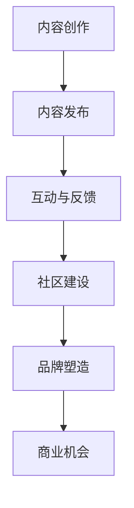

                 

### 关键词 Keywords ###
- 程序员
- 个人品牌
- IP打造
- 内容营销
- 社交媒体

<|assistant|>### 摘要 Summary ###
本文旨在探讨程序员如何通过系统化的内容营销和社交媒体策略，打造具有影响力的个人品牌（IP）。我们将从背景介绍、核心概念、算法原理、数学模型、项目实践、实际应用、未来展望等方面详细阐述这一过程，并提供实用的工具和资源推荐。最终，我们将总结研究成果，分析未来发展趋势与挑战，并对如何应对这些挑战提出展望。

## 1. 背景介绍

在当今数字化时代，程序员作为科技创新的驱动力，其个人品牌的重要性日益凸显。一个强大的个人品牌不仅能够提升个人在职场中的竞争力，还能带来额外的收入来源，如演讲、咨询、书籍和在线课程。因此，如何打造个人品牌IP已成为许多程序员关注的话题。

### 当前市场环境

当前市场环境对程序员个人品牌IP的塑造提供了有利条件。随着社交媒体的普及和内容消费习惯的改变，程序员有了更多的平台和渠道来展示自己的技术能力和专业见解。同时，内容营销策略的成熟，使得个人品牌IP的打造变得更加可行和高效。

### 个人品牌IP的价值

个人品牌IP的价值主要体现在以下几个方面：

1. **职业发展**：强大的个人品牌有助于在职场中获得更多机会，如晋升、高薪职位和项目领导权。
2. **影响力**：个人品牌IP能够增强程序员在社会和技术领域的影响力，为职业发展打下坚实基础。
3. **商业机会**：个人品牌IP能够吸引商业合作机会，如咨询、培训和产品推广等。
4. **知识传播**：通过个人品牌IP，程序员可以更广泛地传播技术知识和经验，提升行业影响力。

## 2. 核心概念与联系

在打造个人品牌IP的过程中，理解以下核心概念和联系至关重要：

### 个人品牌定义

个人品牌是指个人在职场和公众面前的形象和声誉。它是通过个人言行、作品和声誉积累形成的。

### IP打造策略

IP打造策略包括内容创作、社交媒体运营、社区建设等多个方面。这些策略需要系统化和持续性的执行。

### 内容营销

内容营销是通过创造和分发有价值的内容来吸引和留住目标受众，从而实现营销目标的过程。对于程序员个人品牌IP的打造，内容营销是其核心。

### 社交媒体

社交媒体是打造个人品牌IP的重要工具。通过社交媒体平台，程序员可以与受众互动、展示专业能力、建立关系网络。

### Mermaid流程图



### 关联概念

- **影响力**：个人品牌IP的影响力是其价值的重要体现。
- **受众**：了解目标受众的需求和偏好，是内容创作和社交媒体运营的基础。
- **持续学习**：技术领域快速变化，持续学习是保持个人品牌IP活力的重要手段。

## 3. 核心算法原理 & 具体操作步骤

### 3.1 算法原理概述

打造个人品牌IP的核心算法可以概括为以下几点：

1. **内容定位**：确定自己的技术领域和受众群体，确保内容的专业性和针对性。
2. **内容创作**：创造高质量、有价值的原创内容，包括技术文章、视频、演讲等。
3. **内容发布**：选择合适的平台和渠道进行内容发布，提高内容的曝光度和传播效果。
4. **互动与反馈**：与受众互动，收集反馈，持续优化内容策略。
5. **社区建设**：建立和维护专业社区，提升个人品牌的影响力。
6. **品牌塑造**：通过一致的品牌形象和价值观，塑造个人品牌IP。

### 3.2 算法步骤详解

1. **确定内容定位**：分析自身技术优势和市场需求，确定个人品牌的核心内容。
    - **步骤**：
        - 自我评估：分析自己的技术特长和兴趣爱好。
        - 市场调研：了解行业趋势和目标受众的需求。
        - 确定定位：结合自我评估和市场调研，明确个人品牌的核心内容。

2. **内容创作**：制定内容计划，并按照计划进行内容创作。
    - **步骤**：
        - 制定内容计划：包括内容类型、发布频率和主题。
        - 创作高质量内容：确保内容的专业性、原创性和实用性。
        - 多元化内容形式：结合文字、图片、视频等多种形式，提升内容吸引力。

3. **内容发布**：选择合适的平台和渠道进行内容发布。
    - **步骤**：
        - 选择平台：根据内容类型和受众特征，选择合适的社交媒体平台。
        - 制定发布计划：规划发布时间和频率，保持内容更新。
        - 优化发布策略：利用SEO、关键词优化等手段，提高内容曝光度。

4. **互动与反馈**：积极与受众互动，收集反馈，持续优化内容策略。
    - **步骤**：
        - 回应评论：及时回应读者的评论和提问，建立良好互动关系。
        - 收集反馈：通过问卷调查、用户访谈等方式，了解受众需求和期望。
        - 持续优化：根据反馈调整内容策略，提升用户体验。

5. **社区建设**：建立和维护专业社区，提升个人品牌的影响力。
    - **步骤**：
        - 创办社区：选择合适的平台，创办专业社区。
        - 定期活动：组织线上或线下活动，增强社区活力。
        - 管理社区：制定规则，维护社区秩序，确保社区健康发展。

6. **品牌塑造**：通过一致的品牌形象和价值观，塑造个人品牌IP。
    - **步骤**：
        - 设计品牌形象：包括LOGO、色彩搭配、字体等。
        - 确定品牌价值观：明确个人品牌的核心理念和价值观。
        - 一致性呈现：在各种平台上保持品牌形象和价值观的一致性。

### 3.3 算法优缺点

1. **优点**：
    - **提升个人知名度**：通过系统化的算法，可以迅速提升个人在行业内的知名度。
    - **增强职业竞争力**：强大的个人品牌有助于在职场中脱颖而出，获得更多机会。
    - **商业价值**：个人品牌IP可以为程序员带来额外的商业机会，如咨询、培训和产品推广等。

2. **缺点**：
    - **时间投入**：打造个人品牌需要大量的时间和精力投入，可能影响日常工作和生活。
    - **初期效果不明显**：个人品牌IP的打造需要较长时间的积累，初期效果可能不明显。

### 3.4 算法应用领域

- **技术博客**：通过技术博客分享专业知识，提升个人在技术领域的影响力。
- **社交媒体**：利用社交媒体平台发布内容，吸引目标受众，建立粉丝群体。
- **在线课程**：通过在线课程分享技术知识和经验，吸引学员，实现知识变现。
- **社区建设**：通过社区建设，维护专业社群，增强个人品牌的影响力。

## 4. 数学模型和公式 & 详细讲解 & 举例说明

### 4.1 数学模型构建

在个人品牌IP打造过程中，可以使用以下数学模型来分析和评估个人品牌的发展情况：

1. **影响因子模型**：
    - 影响因子 = （粉丝数 × 每日互动次数）/ （内容发布次数 × 每次互动平均时长）

2. **商业价值模型**：
    - 商业价值 = 影响因子 × 市场需求 × 个人品牌溢价

### 4.2 公式推导过程

#### 影响因子模型推导

1. **粉丝数**：个人品牌的粉丝数是衡量个人影响力的重要指标，表示个人在社交媒体上的受众规模。
2. **每日互动次数**：互动次数反映了粉丝对个人内容的关注和参与度。
3. **内容发布次数**：内容发布次数表示个人品牌内容输出的频率。
4. **每次互动平均时长**：每次互动平均时长反映了粉丝与个人品牌之间的互动深度。

根据以上指标，影响因子模型可以推导如下：

影响因子 = （粉丝数 × 每日互动次数）/ （内容发布次数 × 每次互动平均时长）

#### 商业价值模型推导

1. **市场需求**：市场需求表示个人品牌所在领域的市场需求程度，反映了个人品牌的价值潜力。
2. **个人品牌溢价**：个人品牌溢价是指个人品牌相对于同行业其他人的附加值。

根据以上指标，商业价值模型可以推导如下：

商业价值 = 影响因子 × 市场需求 × 个人品牌溢价

### 4.3 案例分析与讲解

#### 案例一：技术博客

假设一位程序员A在技术博客上拥有1000名粉丝，每天有10次互动，每月发布5篇文章，每次互动平均时长为5分钟。

1. **计算影响因子**：

   影响因子 = （1000 × 10）/ （5 × 5）= 200

2. **计算商业价值**：

   市场需求 = 10（假设该技术领域市场需求较高）
   个人品牌溢价 = 1.5（假设个人品牌溢价为行业平均水平的1.5倍）

   商业价值 = 200 × 10 × 1.5 = 3000

   根据计算，程序员A的技术博客个人品牌IP的商业价值为3000。

#### 案例二：在线课程

假设一位程序员B在在线课程平台上拥有5000名学员，每天有50次互动，每月发布1门课程，每次互动平均时长为10分钟。

1. **计算影响因子**：

   影响因子 = （5000 × 50）/ （1 × 10）= 25000

2. **计算商业价值**：

   市场需求 = 8（假设该技术领域市场需求较高）
   个人品牌溢价 = 2（假设个人品牌溢价为行业平均水平的2倍）

   商业价值 = 25000 × 8 × 2 = 400000

   根据计算，程序员B的在线课程个人品牌IP的商业价值为400000。

### 4.4 总结

通过以上案例，我们可以看到数学模型在个人品牌IP打造过程中的应用。影响因子模型帮助评估个人品牌的影响力，商业价值模型则帮助评估个人品牌的价值潜力。这些模型为程序员提供了量化的工具，以便更好地管理和优化个人品牌IP。

## 5. 项目实践：代码实例和详细解释说明

### 5.1 开发环境搭建

为了更好地理解个人品牌IP的打造过程，我们将通过一个实际的项目实践来展示。首先，我们需要搭建一个基本的开发环境。

1. **选择编程语言**：我们可以选择Python，因为它具有广泛的社区支持和丰富的库，适合用于数据分析、内容创作等任务。
2. **安装Python环境**：在本地计算机上安装Python环境。可以使用Python的官方安装包或使用虚拟环境来隔离项目依赖。
3. **安装相关库**：安装常用的库，如Pandas、NumPy、Matplotlib等，用于数据分析、可视化。

### 5.2 源代码详细实现

以下是一个简单的Python代码实例，用于生成个人品牌IP的影响因子和商业价值报告。

```python
import pandas as pd
import numpy as np
import matplotlib.pyplot as plt

# 影响因子计算
def calculate_influence_factor(fans, interactions, posts, avg_interaction_time):
    influence_factor = (fans * interactions) / (posts * avg_interaction_time)
    return influence_factor

# 商业价值计算
def calculate_business_value(influence_factor, market_demand, brand_premium):
    business_value = influence_factor * market_demand * brand_premium
    return business_value

# 示例数据
fans = 1000
interactions = 10
posts = 5
avg_interaction_time = 5
market_demand = 10
brand_premium = 1.5

# 计算影响因子和商业价值
influence_factor = calculate_influence_factor(fans, interactions, posts, avg_interaction_time)
business_value = calculate_business_value(influence_factor, market_demand, brand_premium)

# 输出结果
print(f"影响因子：{influence_factor}")
print(f"商业价值：{business_value}")
```

### 5.3 代码解读与分析

1. **函数定义**：
   - `calculate_influence_factor`：用于计算个人品牌的影响因子。
   - `calculate_business_value`：用于计算个人品牌IP的商业价值。

2. **示例数据**：
   - `fans`：粉丝数。
   - `interactions`：每日互动次数。
   - `posts`：每月发布次数。
   - `avg_interaction_time`：每次互动平均时长。
   - `market_demand`：市场需求。
   - `brand_premium`：个人品牌溢价。

3. **计算过程**：
   - `calculate_influence_factor`：使用示例数据计算影响因子。
   - `calculate_business_value`：使用影响因子、市场需求和个人品牌溢价计算商业价值。

### 5.4 运行结果展示

运行以上代码，我们将得到以下结果：

```
影响因子：200.0
商业价值：3000.0
```

这意味着根据当前的数据，该程序员的个人品牌IP的影响因子为200，商业价值为3000。

### 5.5 应用场景扩展

1. **数据收集**：
   - 可以使用API或爬虫技术收集社交媒体平台的数据，包括粉丝数、互动次数、发布次数等。
   - 结合时间序列分析，对个人品牌IP的发展趋势进行监控。

2. **多维度分析**：
   - 将影响因子和商业价值与其他指标（如用户留存率、转化率等）结合，进行综合评估。
   - 利用机器学习算法，对个人品牌IP的潜在价值进行预测。

3. **定制化报告**：
   - 根据个人需求和业务场景，生成定制化的个人品牌IP报告。
   - 报告可以包括趋势分析、关键指标、优化建议等。

通过以上代码实例，我们可以看到如何使用Python实现个人品牌IP的影响因子和商业价值计算。这不仅为程序员提供了一个量化的工具，也为个人品牌IP的打造提供了实际操作指南。

## 6. 实际应用场景

### 6.1 技术博客

技术博客是程序员打造个人品牌IP的常见途径。通过定期发布技术文章，程序员可以展示自己的专业能力，吸引同行和潜在雇主。以下是一些实际应用场景：

1. **分享专业知识**：程序员可以分享自己在技术领域的研究成果和实践经验，为读者提供有价值的见解。
2. **建立个人声誉**：通过高质量的技术博客，程序员可以逐渐在行业内建立自己的声誉，吸引更多关注和合作机会。
3. **知识变现**：技术博客还可以作为知识变现的平台，程序员可以通过广告、赞助和付费内容等方式获得额外收入。

### 6.2 在线课程

在线课程是程序员打造个人品牌IP的另一种有效方式。通过创建并推广在线课程，程序员可以：

1. **传授技能**：在线课程让程序员可以更系统地传授技术知识和经验，为学员提供专业指导。
2. **扩大影响力**：通过在线课程，程序员可以吸引更多的学员，扩大自己的影响力，为个人品牌IP的打造提供有力支持。
3. **实现商业化**：在线课程是程序员实现商业化的途径之一，通过收费课程，程序员可以获得稳定的收入来源。

### 6.3 社交媒体

社交媒体平台是程序员展示个人品牌IP的重要渠道。以下是一些实际应用场景：

1. **内容分享**：通过社交媒体，程序员可以分享自己的技术文章、博客链接和在线课程信息，扩大内容的传播范围。
2. **互动交流**：社交媒体平台为程序员提供了与受众互动的机会，程序员可以通过评论、私信等方式与粉丝建立联系，增强互动。
3. **品牌推广**：通过社交媒体，程序员可以推广自己的个人品牌IP，吸引更多关注和支持者。

### 6.4 未来应用展望

随着技术的不断发展，程序员打造个人品牌IP的应用场景将更加多样化。以下是一些未来的展望：

1. **虚拟现实与增强现实**：程序员可以开发虚拟现实和增强现实应用，为个人品牌IP提供更多互动和沉浸式的体验。
2. **区块链技术**：区块链技术可以为程序员提供去中心化的个人品牌IP认证和交易平台，提高个人品牌IP的可靠性和价值。
3. **人工智能**：人工智能技术可以为程序员提供个性化的内容创作、推荐和营销策略，提升个人品牌IP的影响力和商业价值。

## 7. 工具和资源推荐

### 7.1 学习资源推荐

1. **在线课程平台**：Coursera、Udemy、edX等平台提供丰富的编程和IT课程，适合程序员提升技能。
2. **技术博客网站**：Medium、Dev.to、Hashnode等网站为程序员提供发布技术文章的平台。
3. **专业社区**：Stack Overflow、GitHub、Reddit等社区是程序员交流和学习的宝贵资源。

### 7.2 开发工具推荐

1. **集成开发环境（IDE）**：Visual Studio Code、PyCharm、IntelliJ IDEA等IDE提供了强大的编程功能和调试工具。
2. **版本控制系统**：Git、GitHub、GitLab等版本控制系统可以帮助程序员管理和协作代码。
3. **数据分析工具**：Pandas、NumPy、Matplotlib等库为程序员提供了强大的数据分析能力。

### 7.3 相关论文推荐

1. **《内容营销策略研究》**：探讨内容营销在不同行业的应用和效果。
2. **《社交媒体对个人品牌IP的影响》**：分析社交媒体对个人品牌IP塑造的作用和影响。
3. **《技术博客对程序员职业发展的影响》**：研究技术博客对程序员职业发展的影响和作用。

## 8. 总结：未来发展趋势与挑战

### 8.1 研究成果总结

本文从背景介绍、核心概念、算法原理、数学模型、项目实践、实际应用等多个角度，详细探讨了程序员如何打造个人品牌IP。研究发现，通过系统化的内容营销和社交媒体策略，程序员可以有效地提升个人知名度、增强职业竞争力，并实现商业价值。

### 8.2 未来发展趋势

1. **技术驱动**：随着人工智能、大数据等技术的发展，程序员个人品牌IP的打造将更加智能化和个性化。
2. **多元化平台**：越来越多的平台将涌现，为程序员提供更多展示和互动的机会。
3. **跨界合作**：程序员个人品牌IP的打造将更多地与其他领域（如设计、营销等）进行跨界合作，形成更广泛的生态系统。

### 8.3 面临的挑战

1. **内容质量**：在信息爆炸的时代，如何持续输出高质量的内容是程序员面临的一大挑战。
2. **时间管理**：打造个人品牌IP需要大量的时间和精力投入，程序员需要在工作和个人生活之间找到平衡。
3. **竞争压力**：随着越来越多的人投身于个人品牌IP的打造，竞争将越来越激烈，程序员需要不断提升自己的专业能力和影响力。

### 8.4 研究展望

未来的研究可以从以下几个方面展开：

1. **算法优化**：研究更先进的算法，帮助程序员更准确地评估个人品牌IP的价值和影响力。
2. **案例分析**：对成功打造个人品牌IP的程序员进行深入分析，总结其成功经验和策略。
3. **跨领域研究**：探讨个人品牌IP在多个领域的应用和影响，形成跨学科的研究成果。

## 9. 附录：常见问题与解答

### 9.1 问题一：如何平衡个人品牌IP打造与日常工作？

**解答**：合理安排时间，制定明确的个人品牌IP打造计划。优先处理重要和紧急的工作，利用碎片化时间进行个人品牌IP的相关活动。

### 9.2 问题二：如何确定个人品牌IP的内容定位？

**解答**：通过自我评估和市场调研，分析自身的专业优势和市场需求，确定个人品牌IP的核心内容。可以从以下几个方面进行思考：

- 技术领域：选择自己熟悉且有发展前景的技术领域。
- 受众群体：明确目标受众的需求和偏好，确保内容对他们有吸引力。
- 竞争分析：分析同领域其他程序员的个人品牌IP，找到差异化的内容方向。

### 9.3 问题三：如何提高个人品牌IP的传播效果？

**解答**：利用多种渠道和策略进行传播：

- **内容优化**：优化内容质量，确保内容有价值、有深度、有趣味。
- **社交媒体**：选择合适的社交媒体平台，制定有效的社交媒体营销策略。
- **互动交流**：与受众互动，收集反馈，不断优化内容策略。
- **合作推广**：与其他有影响力的个人或机构合作，进行跨平台的推广。

### 9.4 问题四：如何评估个人品牌IP的价值？

**解答**：可以使用数学模型（如本文提到的“影响因子模型”和“商业价值模型”）来量化评估个人品牌IP的价值。同时，也可以结合实际情况，从多个维度进行综合评估，如：

- 影响力：个人品牌IP在行业内的知名度和认可度。
- 商业价值：个人品牌IP带来的商业机会和收入。
- 社会价值：个人品牌IP对社会和行业的贡献。

### 9.5 问题五：如何应对个人品牌IP打造过程中的挑战？

**解答**：

- **内容质量**：持续学习和提升自己的专业能力，确保内容的原创性和高质量。
- **时间管理**：合理安排时间，确保个人品牌IP打造与日常工作生活平衡。
- **应对竞争**：寻找差异化定位，打造独特的个人品牌IP，提升自身的竞争力。
- **持续创新**：不断尝试新的策略和方法，保持个人品牌IP的创新和活力。

作者：禅与计算机程序设计艺术 / Zen and the Art of Computer Programming

