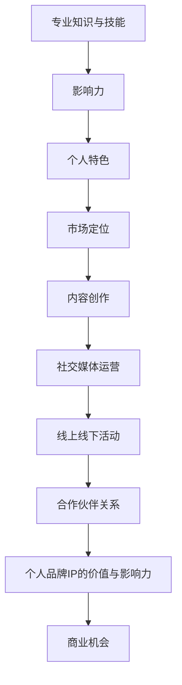

                 

关键词：个人品牌，IP，程序员，影响力，市场营销

> 摘要：在信息技术飞速发展的今天，个人品牌IP的打造已经成为程序员职业发展的重要途径。本文旨在探讨程序员如何利用自己的专业技能和影响力，打造个人品牌IP，提升职业价值，实现个人成长。

## 1. 背景介绍

随着互联网的普及和信息技术的快速发展，程序员这个职业逐渐受到了越来越多的关注。然而，竞争日益激烈的市场环境下，程序员如何提升自己的竞争力，实现职业价值的最大化，成为了一个值得探讨的话题。个人品牌IP的打造，成为了程序员们在这个时代提升个人竞争力的有效手段。

个人品牌IP，即个人知识产权，是指个人在某个领域内形成的独特影响力、专业知识和技能的集合。对于程序员而言，个人品牌IP不仅可以帮助他们树立专业形象，提升个人知名度，还可以为他们带来更多的职业机会和商业价值。

本文将围绕以下主题展开：

- 个人品牌IP的价值与意义
- 程序员如何定位个人品牌
- 如何创建和维护个人品牌
- 个人品牌IP的商业化路径
- 未来趋势与挑战

## 2. 核心概念与联系

### 2.1 个人品牌IP的核心概念

个人品牌IP的核心概念主要包括以下几个方面：

- **专业知识与技能**：这是个人品牌IP的基础，包括编程语言、开发框架、算法和数据结构等。
- **影响力**：个人品牌IP的价值在于其影响力，即个人在行业内的影响力、知名度和社会认可度。
- **个人特色**：个人品牌IP的打造需要具备一定的个性和特色，以便在众多竞争者中脱颖而出。
- **市场定位**：个人品牌IP的定位明确，有助于目标受众的精准识别和吸引。

### 2.2 个人品牌IP的架构

个人品牌IP的架构可以分为以下几个方面：

- **内容创作**：包括博客、技术文章、视频教程、演讲等。
- **社交媒体运营**：利用Twitter、LinkedIn、GitHub等平台进行个人品牌宣传和推广。
- **线上线下活动**：参加技术会议、讲座、线上直播等，增加个人曝光度。
- **合作伙伴关系**：与业内专家、企业、开源社区等建立合作关系，扩大影响力。

### 2.3 个人品牌IP的Mermaid流程图



## 3. 核心算法原理 & 具体操作步骤

### 3.1 算法原理概述

个人品牌IP的打造，可以类比于搜索引擎优化（SEO）的一种形式，即个人搜索引擎优化（PESEO）。其核心原理在于：

- **内容优化**：通过高质量的内容创作，提高个人品牌在搜索引擎中的排名。
- **社交媒体推广**：利用社交媒体平台进行宣传，扩大个人品牌的知名度。
- **用户互动**：与读者、粉丝进行互动，建立良好的口碑和用户关系。
- **合作伙伴关系**：与业内专家、企业等建立合作关系，共同提升个人品牌的影响力。

### 3.2 算法步骤详解

#### 3.2.1 内容创作

1. **确定内容方向**：根据个人专业技能和兴趣爱好，确定内容创作的主攻方向。
2. **持续输出**：定期发布高质量的技术文章、博客、视频教程等，保持内容的新鲜度和连续性。
3. **优化内容**：针对搜索引擎进行内容优化，包括关键词选择、内容结构、图片和视频等。

#### 3.2.2 社交媒体运营

1. **选择平台**：根据目标受众的特点，选择合适的社交媒体平台，如Twitter、LinkedIn、GitHub等。
2. **内容推广**：发布内容的同时，利用平台推广功能，扩大内容的曝光度。
3. **互动管理**：及时回复评论、私信，与粉丝保持良好的互动关系。

#### 3.2.3 用户互动

1. **建立社群**：通过技术论坛、微信群、QQ群等，建立自己的粉丝社群。
2. **举办活动**：组织线上或线下的技术分享、研讨会、讲座等活动，与粉丝建立深度联系。
3. **个性化服务**：针对粉丝的反馈和需求，提供个性化的技术支持和咨询服务。

#### 3.2.4 合作伙伴关系

1. **建立联系**：与业内专家、企业、开源社区等建立联系，寻求合作机会。
2. **合作内容**：共同开发项目、举办活动、撰写文章等，扩大个人品牌的影响力。
3. **资源共享**：与合作伙伴共享资源，实现互利共赢。

### 3.3 算法优缺点

#### 优点

- **提升个人知名度**：通过内容创作和社交媒体运营，提高个人品牌在行业内的知名度。
- **增加职业机会**：良好的个人品牌IP可以为程序员带来更多的职业机会，包括职位晋升、项目合作等。
- **实现商业价值**：通过个人品牌IP的商业化运作，实现个人收入的增加。

#### 缺点

- **时间成本**：个人品牌IP的打造需要投入大量的时间和精力，对程序员的工作和生活可能造成一定影响。
- **竞争激烈**：随着越来越多程序员认识到个人品牌IP的重要性，竞争日益激烈，打造个人品牌IP的难度增加。

### 3.4 算法应用领域

个人品牌IP的算法原理和应用步骤，可以广泛应用于以下领域：

- **技术博客**：通过内容创作和社交媒体运营，提升个人在技术领域的知名度。
- **开源社区**：通过参与开源项目，提升个人在开源社区的影响力。
- **在线教育**：通过创作视频教程和撰写技术文章，成为在线教育领域的专家。
- **企业合作**：通过合作伙伴关系，为企业提供技术支持和咨询服务。

## 4. 数学模型和公式 & 详细讲解 & 举例说明

### 4.1 数学模型构建

个人品牌IP的构建可以看作是一个动态的过程，其数学模型可以表示为：

\[ \text{IP} = f(\text{知识积累}, \text{影响力}, \text{个人特色}, \text{市场定位}) \]

其中，知识积累、影响力、个人特色和市场定位是影响个人品牌IP的关键因素。

### 4.2 公式推导过程

1. **知识积累**：表示个人在某个领域内的知识储备和技能水平，可以用 \( K \) 表示。
2. **影响力**：表示个人在行业内的知名度和认可度，可以用 \( I \) 表示。
3. **个人特色**：表示个人的独特魅力和个性特点，可以用 \( P \) 表示。
4. **市场定位**：表示个人在市场中的定位和目标受众，可以用 \( M \) 表示。

根据上述定义，个人品牌IP可以表示为：

\[ \text{IP} = f(K, I, P, M) \]

### 4.3 案例分析与讲解

假设一个程序员小明，他在编程领域具有丰富的知识积累，拥有大量的粉丝和良好的口碑，同时他的个人特色是幽默风趣，市场定位是面向初学者。我们可以根据上述公式，计算小明的个人品牌IP：

\[ \text{IP}_{\text{小明}} = f(K_{\text{小明}}, I_{\text{小明}}, P_{\text{小明}}, M_{\text{小明}}) \]

由于小明的知识积累 \( K_{\text{小明}} \) 非常高，影响力 \( I_{\text{小明}} \) 也很大，个人特色 \( P_{\text{小明}} \) 明显，市场定位 \( M_{\text{小明}} \) 清晰，因此他的个人品牌IP \( \text{IP}_{\text{小明}} \) 很可能会非常高。

## 5. 项目实践：代码实例和详细解释说明

### 5.1 开发环境搭建

1. **安装Node.js**：从 [Node.js官网](https://nodejs.org/) 下载并安装Node.js。
2. **安装npm**：Node.js自带npm，确保其版本不低于5.0。

### 5.2 源代码详细实现

以下是一个简单的Node.js项目，用于发布博客文章：

```javascript
const express = require('express');
const app = express();

app.use(express.json());

app.post('/post', (req, res) => {
  const { title, content } = req.body;
  
  if (!title || !content) {
    return res.status(400).send('请提供完整的标题和内容。');
  }

  // 发布博客文章
  console.log(`文章发布：标题 - ${title}，内容 - ${content}`);
  
  res.status(200).send('博客文章发布成功。');
});

const port = process.env.PORT || 3000;
app.listen(port, () => {
  console.log(`服务器启动，监听端口：${port}`);
});
```

### 5.3 代码解读与分析

1. **引入模块**：首先引入Express框架，用于搭建Web服务器。
2. **创建服务器**：使用Express创建一个Web服务器实例。
3. **解析请求**：使用`express.json()`中间件解析JSON格式的请求体。
4. **处理请求**：定义一个`/post`路由，用于接收和响应发布博客文章的请求。
5. **启动服务器**：监听指定端口，启动Web服务器。

### 5.4 运行结果展示

1. **本地运行**：在命令行中执行`node app.js`启动服务器。
2. **访问测试**：在浏览器或Postman中发送POST请求到`http://localhost:3000/post`，携带博客文章的标题和内容。

```json
{
  "title": "Node.js入门指南",
  "content": "本文介绍了Node.js的基本概念、安装方法和使用技巧。"
}
```

响应结果：

```json
{
  "status": 200,
  "message": "博客文章发布成功。"
}
```

## 6. 实际应用场景

### 6.1 技术博客

程序员可以通过技术博客，分享自己的技术见解和实战经验，吸引关注者，提升个人品牌。

### 6.2 在线教育

通过在线教育平台，程序员可以开设自己的课程，教授编程技能，实现个人品牌的商业化。

### 6.3 开源社区

参与开源项目，贡献代码和文档，可以提升个人在开源社区的影响力，扩大个人品牌的影响范围。

### 6.4 企业合作

与企业的技术团队合作，为企业提供技术咨询和服务，通过实际项目提升个人品牌的价值。

### 6.5 社交媒体

利用社交媒体平台，发布技术内容，与粉丝互动，建立个人品牌的粉丝基础。

## 7. 工具和资源推荐

### 7.1 学习资源推荐

- [《算法导论》](https://book.douban.com/subject/26708254/)
- [《深入理解计算机系统》](https://book.douban.com/subject/26899550/)
- [《代码大全》](https://book.douban.com/subject/1012624/)

### 7.2 开发工具推荐

- Node.js：用于构建Web应用程序。
- Python：适用于数据分析和Web开发。
- GitHub：用于版本控制和开源项目协作。

### 7.3 相关论文推荐

- ["Building Your Personal Brand as a Developer"](https://www.toptal.com/developers/building-your-personal-brand-as-a-developer)
- ["The Importance of Personal Branding for Software Developers"](https://www.developerdrive.com/the-importance-of-personal-branding-for-software-developers/)

## 8. 总结：未来发展趋势与挑战

### 8.1 研究成果总结

本文从多个角度探讨了程序员如何打造个人品牌IP，包括核心概念、算法原理、实践案例和实际应用场景等。通过内容创作、社交媒体运营、用户互动和合作伙伴关系等手段，程序员可以提升个人品牌的价值和影响力。

### 8.2 未来发展趋势

- **个性化**：随着技术的进步，个人品牌IP将更加注重个性化，满足不同受众的需求。
- **多元化**：个人品牌IP的打造将不再局限于技术领域，可能涉及到更多领域，如设计、产品管理等。
- **商业化**：个人品牌IP的商业化运作将更加成熟，为程序员带来更多的商业机会和收入来源。

### 8.3 面临的挑战

- **时间成本**：个人品牌IP的打造需要投入大量的时间和精力，对程序员的工作和生活可能造成一定影响。
- **竞争激烈**：随着越来越多程序员认识到个人品牌IP的重要性，竞争将变得更加激烈。
- **内容质量**：高质量的内容是个人品牌IP的核心，如何持续输出高质量的内容将是一个挑战。

### 8.4 研究展望

未来，个人品牌IP的打造将成为程序员职业发展的重要趋势。通过不断学习和实践，程序员可以不断提升自己的个人品牌价值，实现个人成长和职业价值的最大化。

## 9. 附录：常见问题与解答

### 9.1 如何确定个人品牌IP的方向？

**回答**：首先，要了解自己的兴趣和优势。其次，分析市场需求和行业趋势，找到自己的定位。最后，尝试不同的内容创作形式，找到最适合自己的方向。

### 9.2 如何衡量个人品牌IP的价值？

**回答**：可以从以下几个方面进行衡量：粉丝数量、内容质量、互动率、商业化能力等。

### 9.3 个人品牌IP的维护需要哪些注意事项？

**回答**：保持内容的持续更新和高质量，与粉丝保持良好的互动关系，关注行业动态，不断学习和提升自己的技能。

---

**作者：禅与计算机程序设计艺术 / Zen and the Art of Computer Programming**

