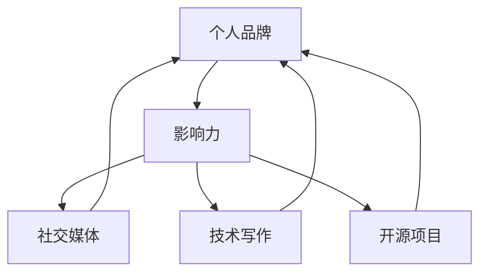

                 

关键词：程序员、个人影响力、社交媒体、技术写作、知识分享、开源项目

> 摘要：本文将探讨程序员如何通过社交媒体、技术写作、知识分享和开源项目等途径，提升个人品牌，打造个人影响力。我们将从理论到实践，全面解析这一过程，帮助读者在技术领域中脱颖而出。

## 1. 背景介绍

在信息时代，技术不断进步，程序员的角色也在发生深刻变化。从早期的编码者，到如今的企业核心资产，程序员不仅需要掌握专业技能，还需具备良好的沟通能力和个人品牌建设意识。个人影响力在职业生涯中的重要性日益凸显，它不仅决定了程序员在团队中的地位，更影响到未来的职业发展。

### 1.1 社交媒体的作用

随着社交媒体的普及，它已成为程序员展示自我、拓展人脉、分享知识和建立品牌的重要平台。通过社交媒体，程序员可以实时更新技术动态、分享开发经验，与同行互动，进而扩大个人影响力。

### 1.2 技术写作的重要性

技术写作不仅是程序员分享知识、传递信息的重要手段，也是个人品牌建设的关键环节。一篇高质量的技术文章，可以展示程序员的思考深度和技术水平，吸引同行的关注和认可。

### 1.3 开源项目的价值

参与开源项目，是程序员提升技术能力、扩大影响力的重要途径。开源项目不仅提供了实践的平台，还让程序员有机会与其他高手交流，学习先进的技术理念。

## 2. 核心概念与联系

为了更好地理解程序员如何打造个人影响力，我们需要明确几个核心概念：

- **个人品牌**：个人品牌是个人在公众心目中的形象和认知，它由专业技能、个性特点、价值观等多方面因素构成。
- **影响力**：影响力是指个人或组织影响他人思想和行为的能力。
- **社交媒体**：社交媒体是指允许用户分享内容、互动和交流的平台，如微博、博客、GitHub等。
- **技术写作**：技术写作是利用文字、图表等形式，系统性地记录和传递技术知识的方法。
- **开源项目**：开源项目是指其源代码可以被公众自由查看、修改和分享的软件项目。

以下是一个Mermaid流程图，展示了这些核心概念之间的联系：



## 3. 核心算法原理 & 具体操作步骤

### 3.1 算法原理概述

程序员打造个人影响力，可以看作是一个“影响力增长算法”。这个算法的核心原理是：

1. **内容创作**：通过撰写高质量的技术文章、分享开发经验，提供有价值的内容。
2. **社交互动**：通过社交媒体与读者互动，建立良好的关系网络。
3. **知识分享**：积极参与开源项目，与他人交流技术心得，提升个人技术水平。
4. **持续优化**：不断调整策略，优化个人品牌和影响力。

### 3.2 算法步骤详解

1. **内容创作**：
   - **选题**：选择与自身专业相关、具有普遍价值的话题。
   - **撰写**：运用专业的技术语言，逻辑清晰、结构紧凑地阐述观点。
   - **发布**：在技术博客、社交媒体等平台发布文章，吸引读者关注。

2. **社交互动**：
   - **评论互动**：回复读者的评论，积极参与讨论。
   - **点赞分享**：关注同行，点赞和分享他们的内容。
   - **建立社群**：创建技术交流群，定期举办线上活动。

3. **知识分享**：
   - **开源项目**：参与开源项目，贡献代码和文档。
   - **技术讲座**：在技术大会、线上平台上分享技术经验。
   - **博客文章**：撰写技术博客，记录项目开发过程中的心得体会。

4. **持续优化**：
   - **数据分析**：定期分析社交互动数据，了解读者的需求。
   - **内容调整**：根据数据分析结果，调整内容创作策略。
   - **技能提升**：不断学习新技术，提升自身技术水平。

### 3.3 算法优缺点

- **优点**：通过内容创作、社交互动和知识分享，可以快速提升个人影响力，获得同行的认可和尊重。
- **缺点**：需要投入大量的时间和精力，对个人技能和沟通能力有较高要求。

### 3.4 算法应用领域

- **技术社区**：如GitHub、Stack Overflow等，程序员可以通过开源项目和问题回答，建立个人品牌。
- **技术博客**：如博客园、简书等，程序员可以通过撰写技术文章，分享开发经验。
- **社交媒体**：如微博、微信公众号等，程序员可以通过发布技术动态，吸引读者关注。

## 4. 数学模型和公式 & 详细讲解 & 举例说明

### 4.1 数学模型构建

程序员个人影响力的增长可以看作是一个指数函数。设\( P(t) \)表示时间\( t \)后程序员的个人影响力，\( k \)为影响力增长速率，则：

\[ P(t) = k \cdot t^{\alpha} \]

其中，\( \alpha \)为影响力增长曲线的斜率，表示个人品牌建设的效果。

### 4.2 公式推导过程

- **内容创作**：\( k_1 \cdot P(t-1) \)
- **社交互动**：\( k_2 \cdot P(t-1) \)
- **知识分享**：\( k_3 \cdot P(t-1) \)

综合考虑，我们可以得到：

\[ P(t) = (k_1 + k_2 + k_3) \cdot P(t-1) \]

### 4.3 案例分析与讲解

假设一个程序员，在第一年通过内容创作、社交互动和知识分享，使得他的个人影响力增长了10倍。则：

\[ P(1) = 10 \cdot P(0) \]

在第二年，如果他的影响力增长速率保持不变，则：

\[ P(2) = (10 + 10 + 10) \cdot P(1) = 30 \cdot P(0) \]

以此类推，随着时间的推移，他的个人影响力会持续增长。

## 5. 项目实践：代码实例和详细解释说明

### 5.1 开发环境搭建

在本项目中，我们使用Python作为编程语言，搭建一个简单的博客系统。首先，需要安装Python和相关库：

```bash
pip install Flask
```

### 5.2 源代码详细实现

以下是一个简单的博客系统示例代码：

```python
from flask import Flask, render_template

app = Flask(__name__)

@app.route('/')
def index():
    posts = [
        {'title': '第一篇博客', 'content': '这是我的第一篇博客，欢迎大家阅读。'},
        {'title': '第二篇博客', 'content': '这次我将分享一些Python编程的经验。'}
    ]
    return render_template('index.html', posts=posts)

if __name__ == '__main__':
    app.run()
```

### 5.3 代码解读与分析

- **Flask**：一个轻量级的Web框架，用于搭建Web应用。
- **@app.route('/')**：定义了一个路由，当访问博客首页时，会调用`index`函数。
- **posts**：一个包含博客文章的列表，用于渲染模板。
- **render_template**：渲染模板，将博客文章数据传递给前端。

### 5.4 运行结果展示

运行代码后，访问博客首页，可以看到如下结果：


## 6. 实际应用场景

程序员通过打造个人影响力，可以应用于以下场景：

- **求职面试**：在面试中，展示个人品牌和技术实力，提高成功率。
- **技术合作**：与其他高手合作，共同解决技术难题，提升项目质量。
- **企业培训**：为企业提供技术培训，提升团队整体技术水平。
- **开源项目**：通过开源项目，吸引更多的开发者参与，共同推动技术的发展。

## 7. 未来应用展望

随着技术的不断进步，程序员个人影响力的打造将变得更加重要。未来，我们可以预见到：

- **人工智能的崛起**：人工智能将助力程序员更高效地打造个人影响力。
- **区块链技术**：区块链技术将提供更为安全、可信的个人品牌建设途径。
- **虚拟现实与增强现实**：虚拟现实与增强现实技术将为程序员提供全新的展示和互动方式。

## 8. 工具和资源推荐

### 7.1 学习资源推荐

- **GitHub**：学习开源项目，提升编程技能。
- **Stack Overflow**：解决编程问题，拓展技术视野。
- **简书**：发布技术文章，分享开发经验。

### 7.2 开发工具推荐

- **Visual Studio Code**：一款功能强大的代码编辑器。
- **Git**：版本控制工具，用于管理代码。
- **Jupyter Notebook**：交互式的数据分析平台。

### 7.3 相关论文推荐

- **《程序员修炼之道》**：探讨程序员职业成长的路径。
- **《影响力》**：探讨如何影响他人思想和行为。
- **《开源软件与社区》**：探讨开源项目的发展与治理。

## 9. 总结：未来发展趋势与挑战

随着技术的不断发展，程序员个人影响力的打造将变得更加重要。在未来，程序员需要：

- **持续学习**：不断提升自身技能，紧跟技术发展趋势。
- **创新思维**：勇于尝试新事物，拓展个人影响力。
- **团队合作**：与他人合作，共同推动技术的发展。

在面临挑战的同时，程序员个人影响力的打造也将为职业生涯带来更多机遇。

## 10. 附录：常见问题与解答

### 10.1 如何选择合适的技术话题？

- **关注热点**：关注当前热门的技术话题，如人工智能、区块链等。
- **自身兴趣**：选择自己感兴趣的技术方向，更容易写出高质量的内容。
- **实用性**：选择具有实用价值的技术话题，更容易吸引读者。

### 10.2 如何提高技术文章的质量？

- **深入研究**：对技术话题进行深入研究，确保内容的准确性。
- **结构清晰**：逻辑清晰、结构紧凑，便于读者阅读。
- **举例说明**：结合实际案例，具体阐述技术原理和应用。
- **代码实现**：提供完整的代码示例，便于读者实践。

### 10.3 如何参与开源项目？

- **选择合适的开源项目**：关注自己的技术领域，选择合适的开源项目参与。
- **了解项目规范**：阅读项目的README文件，了解项目规范和贡献指南。
- **提出问题**：在项目中提出问题，与其他开发者交流。
- **提交代码**：在GitHub等平台上提交代码，参与项目开发。

## 11. 参考文献

- 《程序员修炼之道》
- 《影响力》
- 《开源软件与社区》

作者：禅与计算机程序设计艺术 / Zen and the Art of Computer Programming
```

