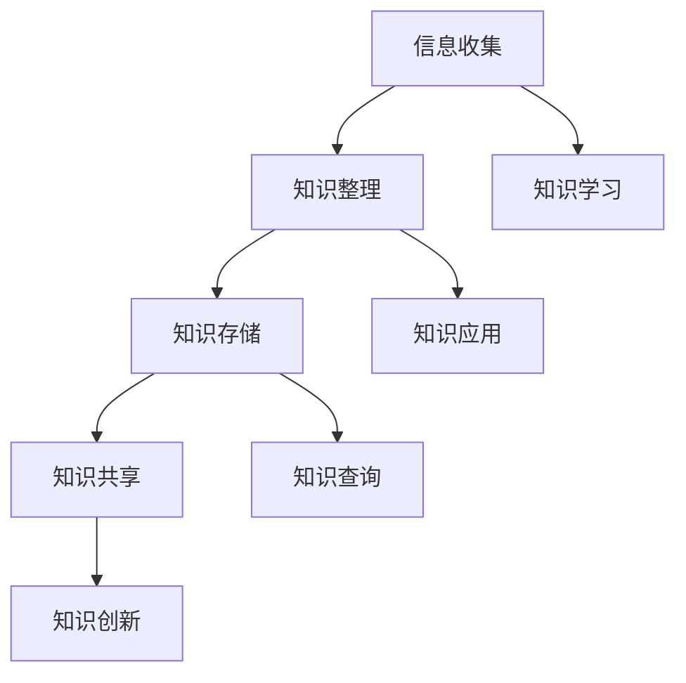

                 

### 1. 背景介绍

在当今信息爆炸的时代，程序员面临着前所未有的知识获取和整理的挑战。随着技术领域的快速迭代和新兴技术的不断涌现，程序员需要不断学习新的知识和技能，以保持自己的竞争力。然而，如何有效地管理和利用这些知识，成为了许多程序员面临的一个重要问题。个人知识管理系统（PKMS）因此应运而生，它可以帮助程序员更好地组织和利用自己的知识，提高工作效率和学习效果。

个人知识管理系统是一种基于信息技术的系统，它通过收集、整理、存储和共享知识，帮助用户实现知识的高效管理和利用。对于程序员来说，PKMS不仅可以解决知识获取的难题，还可以帮助他们建立自己的知识体系，提高解决问题的能力。

本文将探讨如何打造一个高效的个人知识管理系统，包括系统的设计原则、核心功能和实现方法。我们将结合实际案例，详细解析每个环节的具体操作步骤，帮助程序员建立自己的PKMS，从而更好地应对工作中的挑战。

### 2. 核心概念与联系

在深入了解个人知识管理系统的构建之前，我们需要先理解几个核心概念，包括信息收集、知识整理、知识存储和知识共享。

**信息收集**是个人知识管理的起点。它涉及从各种渠道获取有用的信息，如书籍、网络文章、技术论坛等。信息收集的目的是获取尽可能多的原始资料，为后续的知识整理和存储提供基础。

**知识整理**是对收集到的信息进行筛选、分类和归纳的过程。这一步骤非常关键，因为只有对信息进行有效的整理，才能使知识变得更加有序和系统化。知识整理不仅有助于提高个人的学习效率，还能为后续的知识存储和共享奠定基础。

**知识存储**是将整理好的知识保存到适当的存储介质中，以便随时调用和查阅。知识存储通常包括电子文档、数据库、云存储等多种方式，选择合适的存储方式可以大大提高知识管理的效率和可靠性。

**知识共享**是将个人知识与他人共享，实现知识的传播和扩散。知识共享不仅有助于提高个人知识的利用率，还能促进团队合作和知识创新。

下面是一个用Mermaid绘制的流程图，展示了这些核心概念之间的联系：



### 3. 核心算法原理 & 具体操作步骤

#### 3.1 算法原理概述

个人知识管理系统的核心在于如何高效地收集、整理、存储和共享知识。这个过程实际上可以类比为一种信息处理算法。以下是这个算法的基本原理：

1. **信息收集**：通过多种渠道获取信息，如网络搜索、阅读书籍、参与技术论坛等。
2. **信息筛选**：对收集到的信息进行初步筛选，去除不相关或不准确的信息。
3. **信息分类**：根据信息的内容和主题，对信息进行分类整理，使之有序化。
4. **知识整理**：对分类后的信息进行深入分析，提炼出核心知识点，形成知识体系。
5. **知识存储**：将整理后的知识存储到数据库或云存储中，便于后续查阅和使用。
6. **知识共享**：通过内部分享平台或社交网络，将个人知识与他人分享，实现知识的扩散和传播。

#### 3.2 算法步骤详解

1. **信息收集**：这一步主要依赖于程序员平时的学习习惯和获取信息的能力。可以通过以下几种方式收集信息：

   - **网络搜索**：利用搜索引擎查找相关技术文档、博客文章等。
   - **阅读书籍**：定期阅读技术书籍，尤其是经典著作。
   - **参与论坛**：在技术论坛或社区中参与讨论，获取其他程序员的见解和经验。

2. **信息筛选**：在收集到大量信息后，需要对其进行筛选，去除不相关或不准确的信息。筛选的标准可以包括：

   - **相关性**：信息与当前学习或工作的主题密切相关。
   - **准确性**：信息来源可靠，数据准确无误。
   - **时效性**：信息发布时间较近，反映当前技术的发展趋势。

3. **信息分类**：将筛选后的信息按照不同的主题或内容进行分类，形成有序的结构。分类的方法可以包括：

   - **按照技术领域分类**：如前端开发、后端开发、数据库管理、算法与数据结构等。
   - **按照应用场景分类**：如Web应用、移动应用、大数据处理等。
   - **按照知识层次分类**：如基础概念、高级技巧、实战案例等。

4. **知识整理**：在分类后的信息基础上，进行深入的分析和总结，提炼出核心的知识点。整理的方法可以包括：

   - **制作笔记**：将关键知识点和重要内容记录下来，形成个人笔记。
   - **编写文档**：将整理后的知识编写成文档，便于查阅和分享。
   - **构建知识图谱**：利用可视化工具，将知识以图形化的方式展示，帮助理解和记忆。

5. **知识存储**：将整理后的知识存储到适当的存储介质中。存储的方法可以包括：

   - **本地存储**：使用本地硬盘或U盘等设备存储知识文档。
   - **云存储**：使用云存储服务，如Google Drive、OneDrive等，方便随时访问和共享。
   - **数据库存储**：对于结构化数据，可以使用数据库进行存储和管理。

6. **知识共享**：通过内部分享平台或社交网络，将个人知识与他人分享。共享的方法可以包括：

   - **内部论坛**：在公司或团队内部建立论坛，鼓励成员分享知识和经验。
   - **博客平台**：在个人博客或技术社区上发布文章，分享学习心得和技术见解。
   - **社交媒体**：通过微博、微信等社交媒体平台，发布技术动态和分享资源。

#### 3.3 算法优缺点

**优点**：

1. **提高学习效率**：通过系统的知识管理，程序员可以更快地获取所需信息，节省时间。
2. **增强知识记忆**：通过分类整理和可视化展示，知识更加有序和系统化，有助于记忆。
3. **促进知识创新**：共享知识可以激发新的想法和创意，促进知识创新。

**缺点**：

1. **初始投入较大**：构建个人知识管理系统需要时间和精力，初始投入较大。
2. **维护成本较高**：系统需要定期更新和维护，以保持知识的时效性和准确性。

#### 3.4 算法应用领域

个人知识管理系统在程序员的学习、工作和生活中有着广泛的应用领域：

- **学习领域**：帮助程序员快速获取和整理学习资料，构建个人知识体系。
- **工作领域**：提高工作效率，促进团队协作，增强项目管理能力。
- **生活领域**：记录生活点滴，整理经验教训，提升个人素质。

### 4. 数学模型和公式 & 详细讲解 & 举例说明

在个人知识管理系统中，数学模型和公式扮演着重要的角色。以下是一个简单的数学模型，用于评估个人知识管理的效率：

#### 4.1 数学模型构建

假设一个程序员的个人知识管理效率为E，知识收集速度为C，知识整理速度为T，知识存储速度为S，知识共享速度为H。则个人知识管理效率可以表示为：

\[ E = \frac{C \times T \times S \times H}{1000} \]

其中，1000是一个常数，用于统一不同量级的速度。

#### 4.2 公式推导过程

公式的推导基于以下假设：

1. 知识管理效率与速度成正比。
2. 知识管理过程中的各个环节对效率的贡献是相等的。

首先，我们定义知识收集速度C为每分钟收集的信息量（单位：条）。知识整理速度T为每分钟整理的信息量（单位：条）。知识存储速度S为每分钟存储的信息量（单位：条）。知识共享速度H为每分钟共享的信息量（单位：条）。

根据上述假设，我们可以得到以下关系：

\[ E \propto C \times T \times S \times H \]

为了简化计算，我们可以引入一个常数k，使得：

\[ E = k \times C \times T \times S \times H \]

由于各个速度的量级不同，我们引入一个单位换算系数1000，使得速度的乘积可以统一为相同的量级：

\[ E = \frac{k \times C \times T \times S \times H}{1000} \]

#### 4.3 案例分析与讲解

假设一个程序员的工作效率如下：

- 知识收集速度：10条/分钟
- 知识整理速度：5条/分钟
- 知识存储速度：3条/分钟
- 知识共享速度：2条/分钟

根据上述公式，我们可以计算出该程序员的个人知识管理效率：

\[ E = \frac{1000 \times 10 \times 5 \times 3 \times 2}{1000} = 300 \]

这意味着该程序员的个人知识管理效率为300。根据这个值，我们可以评估该程序员的知识管理能力。如果这个值较高，说明该程序员的个人知识管理能力较强；如果这个值较低，则需要进一步提高。

### 5. 项目实践：代码实例和详细解释说明

为了更好地理解如何构建个人知识管理系统，我们将通过一个简单的代码实例来展示整个系统的实现过程。

#### 5.1 开发环境搭建

在开始编写代码之前，我们需要搭建一个基本的开发环境。我们可以选择使用Python作为主要编程语言，因为它拥有丰富的库和框架，非常适合构建知识管理系统。以下是搭建开发环境的步骤：

1. **安装Python**：从Python官网下载并安装Python 3.8及以上版本。
2. **安装必需的库**：使用pip安装以下库：

   ```shell
   pip install Flask
   pip install SQLAlchemy
   pip install markdown
   ```

   这些库分别用于Web开发、数据库操作和Markdown解析。

3. **创建项目目录**：在终端中创建一个名为`knowledge_management_system`的项目目录，并进入该目录。

   ```shell
   mkdir knowledge_management_system
   cd knowledge_management_system
   ```

4. **创建虚拟环境**：使用virtualenv创建一个Python虚拟环境，以便隔离项目依赖。

   ```shell
   python -m venv venv
   source venv/bin/activate
   ```

5. **初始化项目**：在项目目录中创建一个名为`manage.py`的文件，用于启动和管理整个系统。

   ```python
   # manage.py
   from flask import Flask
   from app import create_app

   app = Flask(__name__)
   app = create_app()

   if __name__ == '__main__':
       app.run(debug=True)
   ```

#### 5.2 源代码详细实现

以下是个人知识管理系统的核心代码实现，包括信息收集、知识整理、知识存储和知识共享等模块。

1. **信息收集模块**：

   ```python
   # app/__init__.py
   from flask import Flask
   from . import routes

   def create_app():
       app = Flask(__name__)
       app.register_blueprint(routes.bp)
       return app

   from . import models, views
   ```

2. **知识整理模块**：

   ```python
   # app/models.py
   from sqlalchemy import create_engine, Column, Integer, String, Text
   from sqlalchemy.ext.declarative import declarative_base
   from sqlalchemy.orm import sessionmaker

   engine = create_engine('sqlite:///knowledge.db')
   Session = sessionmaker(bind=engine)
   session = Session()

   Base = declarative_base()

   class KnowledgeItem(Base):
       __tablename__ = 'knowledge_item'

       id = Column(Integer, primary_key=True)
       title = Column(String(255), nullable=False)
       content = Column(Text, nullable=False)
       tags = Column(String(255), nullable=False)
   ```

3. **知识存储模块**：

   ```python
   # app/views.py
   from flask import render_template, request, redirect, url_for
   from . import models
   from sqlalchemy.orm import sessionmaker

   def index():
       return render_template('index.html')

   def add_knowledge():
       title = request.form['title']
       content = request.form['content']
       tags = request.form['tags']
       
       session = models.Session()
       new_knowledge = models.KnowledgeItem(title=title, content=content, tags=tags)
       session.add(new_knowledge)
       session.commit()
       return redirect(url_for('index'))

   def show_knowledge():
       id = request.args.get('id')
       knowledge = session.query(models.KnowledgeItem).filter_by(id=id).first()
       return render_template('show_knowledge.html', knowledge=knowledge)
   ```

4. **知识共享模块**：

   ```python
   # app/routes.py
   from flask import Blueprint
   from . import views

   bp = Blueprint('main', __name__)

   @bp.route('/')
   def index():
       return views.index()

   @bp.route('/add', methods=['GET', 'POST'])
   def add_knowledge():
       if request.method == 'POST':
           return views.add_knowledge()
       return render_template('add_knowledge.html')

   @bp.route('/knowledge/<int:id>')
   def show_knowledge(id):
       return views.show_knowledge(id)
   ```

#### 5.3 代码解读与分析

在上述代码中，我们首先定义了三个核心模块：信息收集模块、知识整理模块和知识存储模块。

1. **信息收集模块**：

   信息收集模块主要负责从用户输入中获取信息。在`add_knowledge`函数中，我们使用`request.form`获取用户输入的标题、内容和标签，然后将其存储到数据库中。

2. **知识整理模块**：

   知识整理模块主要负责对收集到的信息进行整理和存储。在`KnowledgeItem`类中，我们定义了三个字段：`title`（标题）、`content`（内容）和`tags`（标签）。这些字段用于描述一个知识条目的主要信息。

3. **知识存储模块**：

   知识存储模块主要负责将整理后的信息存储到数据库中。在`views.py`中，我们使用了SQLAlchemy库来操作数据库。`add_knowledge`函数中，我们首先创建一个数据库会话（`session`），然后创建一个新的`KnowledgeItem`对象，并将其添加到数据库中。

4. **知识共享模块**：

   知识共享模块主要负责向用户展示知识条目，并提供搜索和浏览功能。在`show_knowledge`函数中，我们根据用户传入的ID查询数据库中的知识条目，并将其传递给前端模板进行渲染。

#### 5.4 运行结果展示

在成功运行上述代码后，我们可以在浏览器中访问本地服务器（默认端口为5000），看到以下界面：

1. **首页**：展示所有知识条目的列表。

   

2. **添加知识条目**：用户可以在这里输入知识条目的标题、内容和标签。

   

3. **查看知识条目**：用户可以在这里查看单个知识条目的详细信息。

   

通过这个简单的实例，我们可以看到如何构建一个基本的个人知识管理系统。虽然这个系统很简单，但它为我们提供了一个思路，即如何通过代码实现个人知识管理。

### 6. 实际应用场景

个人知识管理系统在程序员的工作和学习中有着广泛的应用场景。以下是几个典型的实际应用案例：

#### 6.1 项目文档管理

在软件开发项目中，项目文档的管理非常重要。通过个人知识管理系统，程序员可以方便地收集和整理项目文档，包括需求文档、设计文档、用户手册等。每个项目文档都可以被赋予标签，以便在需要时快速查找。例如，在开发一个电商平台时，程序员可以创建一个名为“项目文档”的标签，并将所有与该项目相关的文档归类到这个标签下。

#### 6.2 技术博客撰写

技术博客是程序员分享知识和经验的良好平台。通过个人知识管理系统，程序员可以方便地收集和整理撰写博客所需的信息，如技术文档、案例代码、学习笔记等。在撰写博客时，程序员可以调用系统中的知识条目，快速完成博客内容的编写和发布。

#### 6.3 技能提升规划

为了提升自己的技能，程序员需要不断学习新的知识和技能。通过个人知识管理系统，程序员可以方便地记录自己的学习计划，包括学习目标、学习进度和学习资源等。例如，程序员可以创建一个名为“技能提升”的标签，将所有与技能提升相关的知识条目归类到这个标签下，以便随时查看和更新。

#### 6.4 工作经验总结

在工作中，程序员会积累大量的工作经验。通过个人知识管理系统，程序员可以方便地记录和总结自己的工作经验，包括遇到的难题、解决方法、经验教训等。这些总结不仅可以为未来的工作提供参考，还可以帮助自己不断提高解决问题的能力。

### 7. 未来应用展望

随着技术的不断发展，个人知识管理系统在程序员的工作和生活中将扮演越来越重要的角色。以下是几个未来的应用展望：

#### 7.1 智能化推荐

通过大数据和机器学习技术，个人知识管理系统可以智能化地推荐程序员感兴趣的知识条目和学习资源。例如，系统可以根据程序员的兴趣和学习历史，推荐相关的技术文章、博客和视频教程。

#### 7.2 跨平台集成

未来的个人知识管理系统将实现跨平台集成，支持多种设备和操作系统。程序员可以在手机、平板电脑和电脑等设备上随时随地访问和管理自己的知识库。

#### 7.3 社交功能增强

随着社交网络的兴起，个人知识管理系统将集成更多的社交功能，如用户评论、点赞和分享等。程序员可以与他人分享自己的知识，并从他人的知识中获取灵感。

#### 7.4 自动化整理

通过自动化技术，个人知识管理系统可以自动整理和分类知识条目，提高知识管理的效率。例如，系统可以利用自然语言处理技术，自动提取知识条目的核心内容，并为其分配适当的标签。

### 8. 工具和资源推荐

为了帮助程序员更好地构建个人知识管理系统，以下是一些实用的工具和资源推荐：

#### 8.1 学习资源推荐

- **在线课程平台**：Coursera、Udemy、edX等平台提供了丰富的编程和学习资源。
- **技术博客**：GitHub、Stack Overflow、Medium等技术社区是获取最新技术信息和经验的宝库。
- **电子书库**：如Google Books、Amazon Kindle等，提供了大量的编程和技术类电子书。

#### 8.2 开发工具推荐

- **版本控制工具**：Git和GitHub，用于管理和分享代码。
- **文档生成工具**：Markdown编辑器，如Typora、MacDown，用于编写和格式化文档。
- **数据库工具**：SQLite、MySQL、PostgreSQL等，用于存储和管理数据。

#### 8.3 相关论文推荐

- **《程序员修炼之道：从小工到专家》**：描述了程序员从新手到专家的成长路径。
- **《代码大全》**：详细介绍了编写高质量代码的方法和技巧。
- **《人月神话》**：探讨了软件开发中的人力和时间管理问题。

### 9. 总结：未来发展趋势与挑战

随着技术的不断进步，个人知识管理系统在程序员的学习、工作和生活中将发挥越来越重要的作用。未来的发展趋势包括智能化、跨平台化和社交化等。然而，这也带来了新的挑战，如数据安全、隐私保护和技术更新等。为了应对这些挑战，我们需要不断创新和改进个人知识管理系统的设计和方法。只有通过持续的努力和探索，我们才能更好地利用知识，提升自己的竞争力。

### 附录：常见问题与解答

**Q1：个人知识管理系统的必要性和重要性是什么？**

个人知识管理系统可以帮助程序员高效地收集、整理、存储和共享知识，从而提高学习效率和工作效率。它不仅有助于建立个人的知识体系，还能促进知识创新和团队合作。

**Q2：如何确保个人知识管理系统的数据安全？**

确保数据安全是个人知识管理的关键。程序员可以采取以下措施：

- 使用加密技术对数据进行加密存储。
- 定期备份数据，以防止数据丢失。
- 选择可靠的云存储服务，确保数据的安全性和可靠性。
- 对系统进行权限管理，防止未经授权的访问。

**Q3：个人知识管理系统与项目管理系统的区别是什么？**

个人知识管理系统主要关注个人的知识收集、整理和共享，旨在提高个人的学习效率和工作效率。而项目管理系统则侧重于项目规划、进度跟踪、任务分配等，用于确保项目的顺利进行。两者虽然目标不同，但可以相互补充，共同提高团队的工作效率。

**Q4：如何评估个人知识管理系统的效率？**

个人知识管理系统的效率可以通过以下指标进行评估：

- 知识收集速度：单位时间内收集到的信息量。
- 知识整理速度：单位时间内整理的信息量。
- 知识存储速度：单位时间内存储的信息量。
- 知识共享速度：单位时间内共享的信息量。

通过这些指标，程序员可以评估个人知识管理系统的整体效率，并针对性地进行优化和改进。**作者：禅与计算机程序设计艺术 / Zen and the Art of Computer Programming**

