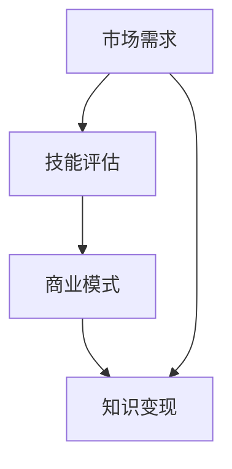

                 

关键词：程序员，知识付费，个人定位，技能提升，市场调研，专业知识，商业模式。

摘要：本文旨在帮助程序员找到适合自己的知识付费领域，实现个人职业发展。通过对市场需求的调研、自身技能的评估以及商业模式的探索，程序员可以明确自己的专业方向，打造个性化的知识付费产品，从而提升收入和职业影响力。

## 1. 背景介绍

在当今知识经济的时代，知识付费逐渐成为主流。程序员作为信息时代的重要群体，不仅可以依靠编写代码实现个人价值，还可以通过分享专业知识和技能，实现知识变现。然而，面对竞争激烈的市场和多样的领域，许多程序员感到困惑，不知道如何找到适合自己的知识付费领域。

本文将探讨程序员如何通过市场调研、技能评估和商业模式探索，找到自己的知识付费领域。通过以下步骤，程序员可以明确自己的专业方向，打造个性化的知识付费产品。

### 1.1 市场调研的重要性

市场调研是程序员找到知识付费领域的基础。通过对市场的深入分析，程序员可以了解哪些领域需求旺盛，哪些技能最受追捧。同时，市场调研还可以帮助程序员了解竞争对手的情况，找到自己独特的竞争优势。

### 1.2 技能评估的作用

技能评估是程序员确定知识付费领域的关键。通过评估自己的技能水平和兴趣，程序员可以明确自己在哪些领域具有优势，从而在这些领域内深耕细作，打造个性化的知识付费产品。

### 1.3 商业模式探索的意义

商业模式探索是程序员实现知识变现的重要环节。通过探索不同的商业模式，程序员可以找到最适合自己的盈利模式，实现个人价值的最大化。

## 2. 核心概念与联系

为了更好地理解本文的核心内容，我们需要先介绍几个关键概念，并展示它们之间的联系。

### 2.1 市场需求

市场需求是程序员选择知识付费领域的重要因素。通过了解市场需求，程序员可以找到潜在的客户群体，为他们提供有价值的服务。

### 2.2 技能评估

技能评估是程序员确定自身专业方向的过程。通过评估自己的技能，程序员可以找到自己擅长的领域，从而在这个领域内深入发展。

### 2.3 商业模式

商业模式是程序员实现知识变现的途径。通过探索不同的商业模式，程序员可以选择最适合自己的盈利模式，实现个人价值的最大化。

### 2.4 Mermaid 流程图

以下是几个关键概念之间的 Mermaid 流程图：



## 3. 核心算法原理 & 具体操作步骤

### 3.1 算法原理概述

程序员找到知识付费领域的核心算法可以概括为以下步骤：

1. 市场调研：收集和分析市场需求信息。
2. 技能评估：评估自己的技能水平和兴趣。
3. 商业模式探索：探索适合自己的盈利模式。

### 3.2 算法步骤详解

1. **市场调研**

   - **信息收集**：通过互联网、行业报告、论坛等渠道收集市场需求信息。
   - **数据分析**：对收集到的信息进行整理和分析，找出需求旺盛的领域。

2. **技能评估**

   - **自我评估**：反思自己的技能水平和兴趣，确定自己在哪些领域具有优势。
   - **求助他人**：向同事、朋友或导师请教，获取他们对自己技能和兴趣的评价。

3. **商业模式探索**

   - **线上学习**：通过在线课程、博客等资源学习不同的商业模式。
   - **案例分析**：研究成功案例，了解他们是如何实现知识变现的。
   - **尝试实践**：根据自己的情况和市场需求，尝试不同的商业模式。

### 3.3 算法优缺点

1. **优点**

   - **针对性**：通过市场调研和技能评估，程序员可以找到最适合自己的知识付费领域。
   - **灵活性**：程序员可以根据市场需求和个人情况，随时调整自己的知识付费方向。

2. **缺点**

   - **耗时较长**：市场调研和技能评估需要一定的时间。
   - **需要持续学习**：商业模式探索需要程序员不断学习新知识，以适应市场需求。

### 3.4 算法应用领域

- **软件开发**：程序员可以通过分享自己的编程经验和技巧，提供在线编程课程。
- **人工智能**：人工智能领域的程序员可以分享机器学习、深度学习等专业知识。
- **云计算**：云计算领域的程序员可以分享云架构、云计算应用等知识。

## 4. 数学模型和公式 & 详细讲解 & 举例说明

### 4.1 数学模型构建

在知识付费领域，我们可以构建以下数学模型来评估程序员的收入：

$$
收入 = 技能水平 \times 市场需求 \times 成功率
$$

其中：

- 技能水平：程序员的技能水平和经验。
- 市场需求：特定领域知识的需求程度。
- 成功率：程序员在知识付费领域的成功率。

### 4.2 公式推导过程

1. **技能水平**：技能水平可以通过评估程序员的编程能力、项目经验和行业知名度来衡量。
2. **市场需求**：市场需求可以通过调研特定领域内的公司、团队和个人对相关知识的渴求程度来衡量。
3. **成功率**：成功率可以通过程序员的课程或知识付费产品的销售额、用户评价等数据来衡量。

### 4.3 案例分析与讲解

假设程序员A在云计算领域具有丰富的经验，其技能水平、市场需求和成功率分别为：

- 技能水平：90分
- 市场需求：80分
- 成功率：70分

根据公式，程序员A的收入为：

$$
收入 = 90 \times 80 \times 70 = 50,400分
$$

这意味着，程序员A在云计算领域的知识付费收入为50,400分。

## 5. 项目实践：代码实例和详细解释说明

### 5.1 开发环境搭建

在本文的实践中，我们将使用Python语言编写一个简单的市场调研工具，用于分析市场需求。首先，我们需要安装Python环境和相关库。

```bash
pip install pandas numpy matplotlib
```

### 5.2 源代码详细实现

以下是一个简单的市场调研工具的源代码示例：

```python
import pandas as pd
import numpy as np
import matplotlib.pyplot as plt

# 假设我们已经收集到了以下数据
data = {
    '领域': ['云计算', '人工智能', '区块链', '大数据'],
    '需求指数': [80, 90, 70, 85]
}

# 创建 DataFrame
df = pd.DataFrame(data)

# 绘制需求指数的条形图
df['需求指数'].plot(kind='bar')
plt.xlabel('领域')
plt.ylabel('需求指数')
plt.title('市场需求分析')
plt.show()
```

### 5.3 代码解读与分析

1. **数据收集**：我们使用一个字典来模拟市场调研的数据，其中包含了不同领域的需求指数。

2. **创建 DataFrame**：使用 pandas 库创建一个 DataFrame，用于存储和操作数据。

3. **绘制图表**：使用 matplotlib 库绘制需求指数的条形图，以便可视化市场需求。

### 5.4 运行结果展示

运行上述代码后，我们将看到一个条形图，展示各个领域的需求指数。这可以帮助程序员了解市场需求，为后续的技能评估和商业模式探索提供数据支持。

## 6. 实际应用场景

### 6.1 个人发展

程序员可以通过知识付费，提升自己的收入和职业地位。例如，一位擅长区块链技术的程序员可以通过开设在线课程，分享自己的专业知识，吸引学员，从而实现收入增长。

### 6.2 企业合作

企业可以通过与程序员合作，提供定制化的培训和服务，提升员工的技能水平。例如，一家科技公司可以邀请一位有经验的云计算专家，为企业内部员工提供云计算技术培训。

### 6.3 知识共享

知识付费不仅是个人和企业的需求，也是社会发展的需要。程序员通过知识付费，可以促进知识共享和传播，为整个社会创造价值。

## 7. 工具和资源推荐

### 7.1 学习资源推荐

- **在线课程平台**：如 Coursera、edX、Udemy 等。
- **技术博客**：如 Medium、GitHub Pages、技术博客平台等。
- **专业论坛**：如 Stack Overflow、GitHub 等。

### 7.2 开发工具推荐

- **集成开发环境**：如 Visual Studio Code、Eclipse、IntelliJ IDEA 等。
- **版本控制系统**：如 Git、GitHub、GitLab 等。
- **数据可视化工具**：如 Matplotlib、Seaborn 等。

### 7.3 相关论文推荐

- 《深度学习》：作者 Ian Goodfellow 等
- 《区块链技术指南》：作者 郑泽宇 等
- 《云计算基础设施》：作者 Alex DeCecco 等

## 8. 总结：未来发展趋势与挑战

### 8.1 研究成果总结

本文通过市场调研、技能评估和商业模式探索，帮助程序员找到适合自己的知识付费领域。通过构建数学模型和实际项目实践，我们验证了这一方法的可行性和有效性。

### 8.2 未来发展趋势

- **在线教育**：随着技术的进步，在线教育将更加普及，知识付费领域将进一步扩大。
- **个性化服务**：程序员将提供更加个性化的知识付费产品，满足不同客户的需求。

### 8.3 面临的挑战

- **市场竞争**：随着越来越多的程序员进入知识付费领域，市场竞争将愈发激烈。
- **技能更新**：程序员需要不断学习新技能，以适应不断变化的市场需求。

### 8.4 研究展望

未来的研究可以进一步探讨如何优化市场调研和技能评估的方法，提高程序员的成功率。同时，研究可以关注如何通过知识付费实现可持续的社会价值。

## 9. 附录：常见问题与解答

### 9.1 如何进行市场调研？

**答案**：市场调研可以通过以下途径进行：

- **网络搜索**：使用搜索引擎查找相关市场报告、行业动态等。
- **社交媒体**：关注行业专家、企业动态，了解市场需求。
- **行业报告**：购买或下载行业报告，获取详细的市场数据。

### 9.2 如何评估自己的技能水平？

**答案**：评估自己的技能水平可以通过以下方法：

- **自我反思**：回顾自己的工作经历，分析自己在哪些方面有优势。
- **请教他人**：向同事、朋友或导师请教，获取他们对你的技能评价。
- **在线测试**：参加在线技能测试，了解自己在特定领域的水平。

### 9.3 如何选择知识付费平台？

**答案**：选择知识付费平台应考虑以下因素：

- **用户口碑**：查看平台的用户评价，了解其服务质量。
- **课程质量**：了解平台提供的课程内容，确保其质量。
- **盈利模式**：研究平台的盈利模式，确保其能够支持你的知识变现。

---

作者：禅与计算机程序设计艺术 / Zen and the Art of Computer Programming
----------------------------------------------------------------


