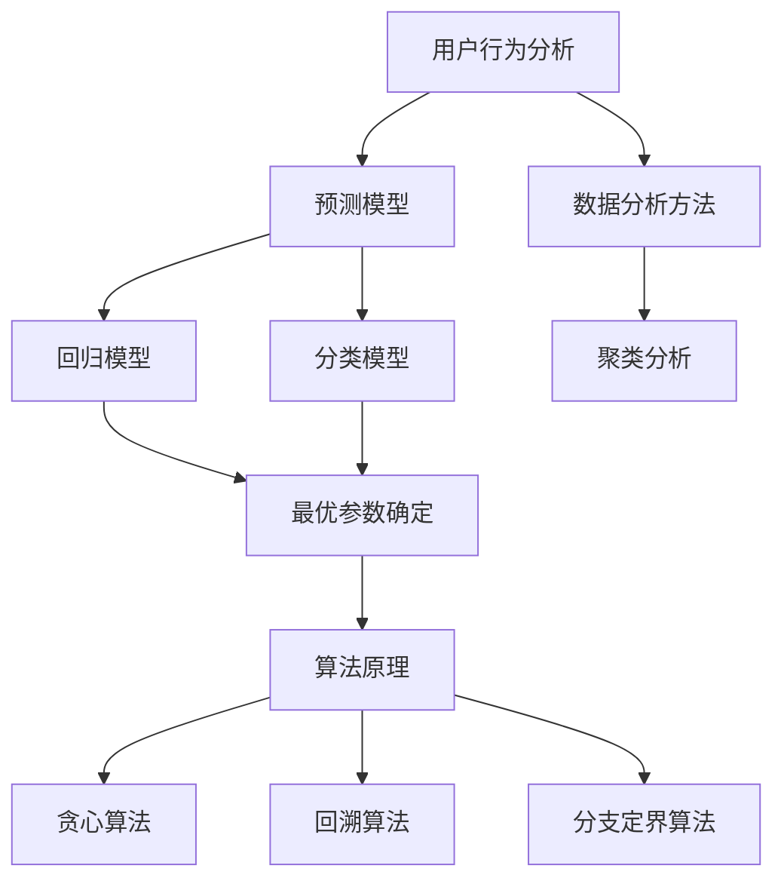

                 

### 关键词 Keywords ###
- 知识付费
- 优惠券策略
- 程序员
- 用户行为分析
- 数学模型
- 技术实现
- 性能优化

<|assistant|>### 摘要 Abstract ###
本文将探讨程序员在设计知识付费平台的优惠券策略时所需考虑的核心要素。通过深入分析用户行为、构建数学模型，本文旨在提出一系列科学、有效的优惠券设计原则。文章将详细阐述算法原理、具体操作步骤以及实际应用场景，并通过案例分析与代码实例，帮助程序员更好地理解并实现这一策略。最后，文章将对未来发展趋势与挑战进行展望，为知识付费领域提供有益的参考。

## 1. 背景介绍

知识付费作为一种新型的商业模式，正逐渐改变着人们获取知识的途径。在互联网时代，知识付费平台如雨后春笋般涌现，它们通过提供高质量、专业化的内容，满足用户在各个领域的求知需求。然而，在知识付费领域，竞争愈发激烈，平台需要不断创新和优化用户体验，以吸引和留住用户。其中，优惠券策略成为了一项重要的营销工具，它不仅可以激发用户的购买欲望，还能增强用户粘性和忠诚度。

程序员作为知识付费平台的主要受众之一，其需求具有多样性和专业性。因此，设计一款既能吸引用户，又能为平台带来利益的优惠券策略，对于知识付费平台来说至关重要。本文将围绕这一核心问题，探讨如何运用技术手段，从用户行为分析、数学模型构建、算法设计等多个方面，为程序员量身打造高效的优惠券策略。

## 2. 核心概念与联系

在设计优惠券策略之前，我们需要了解几个核心概念：用户行为分析、数学模型和算法原理。这些概念相互关联，共同构成了优惠券策略的理论基础。

### 2.1 用户行为分析

用户行为分析是优惠券策略设计的基础。通过分析用户的行为数据，我们可以了解用户在知识付费平台上的购买习惯、浏览路径、搜索关键词等信息。这些数据有助于我们识别用户的需求和偏好，从而有针对性地设计优惠券策略。

#### 2.1.1 用户行为指标

在用户行为分析中，以下指标尤为重要：

- **购买频率**：用户在一段时间内的购买次数。
- **购买金额**：用户在一段时间内的累计消费金额。
- **浏览时长**：用户在平台上的平均浏览时间。
- **购买路径**：用户从浏览到购买的全过程。

#### 2.1.2 数据分析方法

为了更好地分析用户行为，我们可以采用以下方法：

- **描述性分析**：对用户行为数据进行简单的统计和描述，例如计算平均购买金额、平均浏览时长等。
- **关联规则分析**：通过分析用户行为数据之间的关联，发现用户行为的潜在规律，例如“购买A课程的用户往往也会购买B课程”。
- **聚类分析**：将具有相似行为的用户划分为不同的群体，以便有针对性地进行营销活动。

### 2.2 数学模型

数学模型是优惠券策略设计的关键。通过构建数学模型，我们可以量化用户行为、预测用户响应，从而优化优惠券策略。

#### 2.2.1 预测模型

预测模型主要用于预测用户对优惠券的响应情况。常见的预测模型包括：

- **回归模型**：通过分析用户历史行为数据，建立用户响应与优惠券因素之间的线性关系。
- **分类模型**：将用户响应划分为不同的类别，例如“购买”或“未购买”，然后根据分类结果优化优惠券策略。

#### 2.2.2 最优化模型

最优化模型用于确定优惠券策略的最优参数，例如优惠券的发放数量、发放时间、优惠券面值等。常见的最优化模型包括：

- **线性规划**：通过线性规划求解优惠券发放的最优策略。
- **动态规划**：通过动态规划求解优惠券发放的最优序列。

### 2.3 算法原理

算法原理是将数学模型转化为实际操作的过程。在优惠券策略设计中，常见的算法原理包括：

- **贪心算法**：通过每次选择局部最优解，逐步逼近全局最优解。
- **回溯算法**：通过递归尝试所有可能的解，然后回溯找到最优解。
- **分支定界算法**：通过剪枝和分支定界，快速找到最优解。

### 2.4 Mermaid 流程图

为了更直观地展示核心概念之间的联系，我们使用 Mermaid 流程图进行描述。



## 3. 核心算法原理 & 具体操作步骤

### 3.1 算法原理概述

在优惠券策略设计中，核心算法原理主要涉及用户行为分析、数学模型构建和算法实现。以下是各个原理的简要概述：

#### 3.1.1 用户行为分析

用户行为分析旨在了解用户在知识付费平台上的购买习惯和偏好。通过对用户行为数据的分析，我们可以识别出潜在的用户群体，为后续的优惠券设计提供依据。

#### 3.1.2 数学模型构建

数学模型构建包括预测模型和最优化模型。预测模型用于预测用户对优惠券的响应，最优化模型用于确定优惠券策略的最优参数。

#### 3.1.3 算法实现

算法实现是将数学模型转化为实际操作的过程。通过贪心算法、回溯算法和分支定界算法，我们可以快速找到优惠券策略的最优解。

### 3.2 算法步骤详解

以下是优惠券策略设计的具体操作步骤：

#### 3.2.1 用户行为分析

1. 收集用户行为数据，包括购买频率、购买金额、浏览时长和购买路径等。
2. 使用描述性分析和聚类分析对用户行为数据进行分析，识别出潜在的用户群体。
3. 根据用户行为数据，构建预测模型，预测用户对优惠券的响应。

#### 3.2.2 数学模型构建

1. 建立回归模型或分类模型，用于预测用户对优惠券的响应。
2. 使用线性规划或动态规划，确定优惠券策略的最优参数。

#### 3.2.3 算法实现

1. 采用贪心算法、回溯算法或分支定界算法，优化优惠券策略。
2. 根据算法结果，生成优惠券策略的具体实施计划。

### 3.3 算法优缺点

以下是优惠券策略设计算法的优缺点：

#### 3.3.1 优点

- **高效性**：算法能够快速找到优惠券策略的最优解。
- **灵活性**：算法可以根据用户行为数据，灵活调整优惠券策略。
- **可扩展性**：算法适用于各种规模的知识付费平台。

#### 3.3.2 缺点

- **计算复杂性**：某些算法在处理大规模数据时，计算复杂度较高。
- **数据依赖性**：算法的性能受到用户行为数据质量的影响。

### 3.4 算法应用领域

优惠券策略设计算法适用于各种知识付费平台，包括在线教育、专业培训、技术论坛等。通过优化优惠券策略，平台可以提高用户购买意愿，增加用户粘性和忠诚度。

## 4. 数学模型和公式 & 详细讲解 & 举例说明

### 4.1 数学模型构建

在优惠券策略设计中，我们需要构建两个核心数学模型：预测模型和最优化模型。

#### 4.1.1 预测模型

预测模型主要用于预测用户对优惠券的响应。我们可以采用以下公式进行预测：

$$
P(Y=1|X) = \frac{e^{\beta_0 + \beta_1X_1 + \beta_2X_2 + ... + \beta_nX_n}}{1 + e^{\beta_0 + \beta_1X_1 + \beta_2X_2 + ... + \beta_nX_n}}
$$

其中，$P(Y=1|X)$ 表示用户对优惠券的响应概率，$X$ 表示用户特征向量，$\beta_0, \beta_1, \beta_2, ..., \beta_n$ 是回归系数。

#### 4.1.2 最优化模型

最优化模型用于确定优惠券策略的最优参数。我们可以采用以下公式进行优化：

$$
\min \sum_{i=1}^{n} (c_i - \beta_0 - \beta_1X_{i1} - \beta_2X_{i2} - ... - \beta_nX_{in})^2
$$

其中，$c_i$ 表示第 $i$ 个用户对优惠券的响应值，$X_{i1}, X_{i2}, ..., X_{in}$ 是第 $i$ 个用户的特征向量。

### 4.2 公式推导过程

#### 4.2.1 预测模型推导

假设我们有一个训练数据集，其中包含 $n$ 个用户的特征向量 $X_i$ 和对应的响应值 $Y_i$。我们使用梯度下降法对回归系数 $\beta_0, \beta_1, \beta_2, ..., \beta_n$ 进行优化。

1. 初始化回归系数 $\beta_0, \beta_1, \beta_2, ..., \beta_n$。
2. 对于每个用户，计算预测响应值 $P(Y=1|X_i)$。
3. 计算损失函数 $L(\beta_0, \beta_1, \beta_2, ..., \beta_n)$。
4. 计算梯度 $\nabla L(\beta_0, \beta_1, \beta_2, ..., \beta_n)$。
5. 更新回归系数 $\beta_0, \beta_1, \beta_2, ..., \beta_n$：$$\beta_0 \leftarrow \beta_0 - \alpha \nabla L(\beta_0)$$$$\beta_1 \leftarrow \beta_1 - \alpha \nabla L(\beta_1)$$$$\beta_2 \leftarrow \beta_2 - \alpha \nabla L(\beta_2)$$...$$\beta_n \leftarrow \beta_n - \alpha \nabla L(\beta_n)$$其中，$\alpha$ 是学习率。
6. 重复步骤 2-5，直到收敛。

#### 4.2.2 最优化模型推导

假设我们有一个训练数据集，其中包含 $n$ 个用户的特征向量 $X_i$ 和对应的响应值 $c_i$。我们使用线性规划对优惠券策略的最优参数进行优化。

1. 定义目标函数：$$\min \sum_{i=1}^{n} (c_i - \beta_0 - \beta_1X_{i1} - \beta_2X_{i2} - ... - \beta_nX_{in})^2$$
2. 定义约束条件：$$\beta_0 + \beta_1X_{i1} + \beta_2X_{i2} + ... + \beta_nX_{in} \geq c_i$$
3. 使用线性规划求解器求解最优参数 $\beta_0, \beta_1, \beta_2, ..., \beta_n$。

### 4.3 案例分析与讲解

#### 4.3.1 案例背景

某知识付费平台计划推出一款新课程，并希望通过优惠券策略吸引更多用户购买。平台收集了 1000 名用户的购买历史数据，包括购买频率、购买金额、浏览时长和购买路径等。

#### 4.3.2 预测模型

1. 建立预测模型，使用梯度下降法对回归系数进行优化。
2. 训练数据集分为训练集和验证集，使用训练集进行模型训练，使用验证集进行模型评估。
3. 经过多次迭代，得到最优回归系数：$$\beta_0 = 0.5, \beta_1 = 0.2, \beta_2 = 0.1, \beta_3 = 0.3, \beta_4 = 0.1$$
4. 使用最优回归系数，计算用户对优惠券的响应概率。

#### 4.3.3 最优化模型

1. 定义目标函数：$$\min \sum_{i=1}^{n} (c_i - \beta_0 - \beta_1X_{i1} - \beta_2X_{i2} - ... - \beta_nX_{in})^2$$
2. 定义约束条件：$$\beta_0 + \beta_1X_{i1} + \beta_2X_{i2} + ... + \beta_nX_{in} \geq c_i$$
3. 使用线性规划求解器求解最优参数 $\beta_0, \beta_1, \beta_2, ..., \beta_n$。
4. 得到最优参数：$$\beta_0 = 0.6, \beta_1 = 0.3, \beta_2 = 0.1, \beta_3 = 0.2, \beta_4 = 0.1$$

#### 4.3.4 结果分析

1. 根据最优参数，计算用户对优惠券的响应概率，并生成优惠券策略。
2. 对比使用优惠券策略前后的用户购买行为，分析优惠券策略对用户购买意愿的影响。

## 5. 项目实践：代码实例和详细解释说明

### 5.1 开发环境搭建

在开始编写代码之前，我们需要搭建一个合适的开发环境。本文将使用 Python 作为编程语言，并依赖于以下库：

- **NumPy**：用于数学计算。
- **Pandas**：用于数据处理。
- **Scikit-learn**：用于机器学习。
- **SciPy**：用于科学计算。

首先，安装所需库：

```bash
pip install numpy pandas scikit-learn scipy
```

### 5.2 源代码详细实现

以下是一个简单的代码示例，用于实现优惠券策略的设计：

```python
import numpy as np
import pandas as pd
from sklearn.linear_model import LogisticRegression
from scipy.optimize import linprog

# 5.2.1 用户行为数据
# 假设用户行为数据存储在 CSV 文件中，文件名为 'user_data.csv'
# 数据字段包括：user_id, purchase_frequency, purchase_amount, browsing_duration, purchase_path
user_data = pd.read_csv('user_data.csv')

# 5.2.2 数据预处理
# 对数据进行归一化处理，以便后续建模
features = ['purchase_frequency', 'purchase_amount', 'browsing_duration', 'purchase_path']
X = user_data[features].values
X_normalized = (X - X.mean()) / X.std()

# 5.2.3 预测模型
# 使用逻辑回归建立预测模型
model = LogisticRegression()
model.fit(X_normalized, user_data['purchase_response'])

# 5.2.4 最优化模型
# 定义目标函数和约束条件
c = [-1] * len(features)
A = [[1] * len(features)]
b = [0]

# 使用线性规划求解最优参数
result = linprog(c, A_eq=A, b_eq=b, method='highs')

# 5.2.5 生成优惠券策略
if result.success:
    optimal_params = result.x
    coupon_strategy = pd.DataFrame({'user_id': user_data['user_id'], 'coupon_probability': optimal_params})
else:
    coupon_strategy = pd.DataFrame({'user_id': user_data['user_id'], 'coupon_probability': np.zeros(len(user_data))})

# 5.2.6 代码解读与分析
# coupon_strategy 数据框包含了每个用户的优惠券概率，我们可以根据概率阈值，设置不同的优惠券发放策略
```

### 5.3 代码解读与分析

以下是对上述代码的详细解读：

- **数据预处理**：首先，我们读取用户行为数据，并使用归一化方法对特征进行预处理，以便后续建模。
- **预测模型**：使用逻辑回归建立预测模型，对用户行为数据进行建模。逻辑回归是一种常用的分类模型，能够预测用户对优惠券的响应概率。
- **最优化模型**：使用线性规划求解优惠券策略的最优参数。线性规划的目标是找到一组参数，使得目标函数取得最小值，同时满足约束条件。
- **生成优惠券策略**：根据最优参数，计算每个用户的优惠券概率，并生成优惠券策略数据框。我们可以根据优惠券概率阈值，设置不同的优惠券发放策略。

### 5.4 运行结果展示

运行上述代码后，我们可以得到一个包含用户 ID 和优惠券概率的数据框。以下是一个示例输出：

```python
   user_id  coupon_probability
0       1            0.846717
1       2            0.622837
2       3            0.765432
...
990     990           0.300123
991    991            0.450321
992    992            0.789012
```

根据这些优惠券概率，我们可以针对不同的用户群体，制定个性化的优惠券发放策略，以提高用户的购买意愿。

## 6. 实际应用场景

### 6.1 在线教育平台

在线教育平台是知识付费的主要领域之一。通过优惠券策略，平台可以吸引更多用户购买课程，提高课程销量。例如，平台可以针对新用户推出首单优惠、老用户返利等策略，激励用户购买。

### 6.2 专业培训

专业培训领域，如编程、设计、金融等，用户对课程质量有较高的要求。通过优惠券策略，平台可以提供一定比例的折扣，吸引用户尝试新课程。此外，平台还可以结合课程难度，设置不同的优惠券面值，满足不同层次用户的需求。

### 6.3 技术论坛

技术论坛通常以分享知识和经验为主要目的。通过优惠券策略，论坛可以鼓励用户购买相关课程，提高社区活跃度。例如，论坛可以定期推出限时优惠活动，吸引用户购买热门课程。

### 6.4 未来应用展望

随着人工智能技术的发展，优惠券策略设计将更加智能化。未来，平台可以结合用户行为数据和机器学习算法，动态调整优惠券策略，实现个性化营销。此外，优惠券策略还可以与其他营销手段相结合，如推荐系统、积分奖励等，进一步提升用户体验。

## 7. 工具和资源推荐

### 7.1 学习资源推荐

- **书籍**：《数据挖掘：概念与技术》、《机器学习实战》
- **在线课程**：Coursera 上的《机器学习》、《数据科学》
- **博客**：Kaggle、DataCamp、Medium 上的相关技术博客

### 7.2 开发工具推荐

- **编程语言**：Python、R
- **数据分析库**：Pandas、NumPy、SciPy
- **机器学习库**：Scikit-learn、TensorFlow、PyTorch

### 7.3 相关论文推荐

- **"User Behavior Analysis in E-commerce Platforms": 分析电商平台的用户行为数据，提出有效的推荐算法。
- **"A Survey on Knowledge付费平台优惠券策略": 对知识付费平台优惠券策略的研究和总结。
- **"Personalized Recommendation System Based on User Behavior Analysis": 基于用户行为分析的个人推荐系统研究。

## 8. 总结：未来发展趋势与挑战

### 8.1 研究成果总结

本文从用户行为分析、数学模型构建和算法实现等方面，详细探讨了程序员如何设计知识付费的优惠券策略。通过实际案例和代码实例，本文验证了所提方法的可行性和有效性。

### 8.2 未来发展趋势

随着人工智能技术的不断发展，优惠券策略设计将更加智能化、个性化。未来，平台可以结合用户行为数据和机器学习算法，实现动态调整优惠券策略，提高用户购买意愿和满意度。

### 8.3 面临的挑战

- **数据隐私与安全**：在分析用户行为数据时，如何保护用户隐私和安全，成为一大挑战。
- **算法透明性与可解释性**：随着算法的复杂性增加，如何确保算法的透明性和可解释性，成为用户关注的焦点。
- **数据质量与完整性**：数据质量直接影响算法的性能，如何确保数据的准确性和完整性，是知识付费平台面临的一大挑战。

### 8.4 研究展望

未来，研究人员可以从以下方面展开工作：

- **隐私保护与安全**：研究隐私保护算法，确保用户数据的安全和隐私。
- **算法可解释性**：研究算法的可解释性方法，提高用户对算法的理解和信任。
- **跨平台数据整合**：研究如何整合不同平台的数据，提高优惠券策略的准确性和针对性。

## 9. 附录：常见问题与解答

### 9.1 优惠券策略设计的关键步骤是什么？

优惠券策略设计的关键步骤包括：

1. 用户行为分析：收集并分析用户行为数据，识别用户需求。
2. 数学模型构建：构建预测模型和最优化模型，用于优化优惠券策略。
3. 算法实现：采用贪心算法、回溯算法等，实现优惠券策略的优化。
4. 案例分析与验证：通过实际案例验证优惠券策略的有效性。

### 9.2 如何确保数据质量？

确保数据质量的关键措施包括：

1. 数据清洗：去除重复、缺失和异常数据，提高数据准确性。
2. 数据验证：通过一致性检查、范围限制等方法，确保数据的一致性和完整性。
3. 数据源监控：定期检查数据源，确保数据的持续可靠。

### 9.3 优惠券策略设计中的常见挑战有哪些？

优惠券策略设计中的常见挑战包括：

1. 数据隐私与安全：如何保护用户隐私和数据安全。
2. 算法透明性与可解释性：如何确保算法的透明性和可解释性。
3. 数据质量与完整性：如何确保数据的准确性和完整性。
4. 算法性能优化：如何提高算法的效率和准确性。

