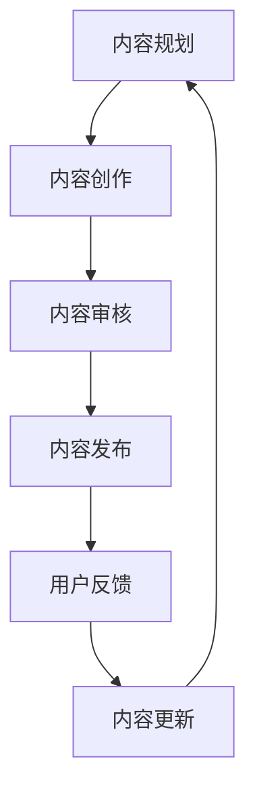

                 

 

> 关键词：知识付费、内容规划、内容管理、程序员、内容创作、商业模式

> 摘要：本文将深入探讨程序员如何有效地进行知识付费的内容规划与管理，从核心概念、算法原理、数学模型、项目实践到实际应用，全方位剖析这一领域的最新趋势与挑战。

## 1. 背景介绍

在数字时代，知识的传播与消费方式发生了翻天覆地的变化。知识付费作为一种新兴商业模式，正在逐渐成为个人和机构获取知识的重要途径。程序员作为知识经济的重要参与者，如何有效进行知识付费的内容规划与管理，成为了当前急需解决的关键问题。

知识付费的核心在于将知识转化为商品或服务，并通过平台进行交易。程序员在这一过程中扮演着双重角色：既是知识的创造者，也是知识的分销者。然而，如何确保知识的高质量、针对性以及用户满意度，成为了知识付费能否成功的关键。

## 2. 核心概念与联系

### 2.1 内容规划

内容规划是指对知识内容进行系统性的梳理、分类和编排，以形成具有逻辑性和层次感的知识体系。对于程序员来说，内容规划的意义在于：

- **提高内容质量**：通过系统化规划，可以更好地把握知识的核心要点，提高内容的实用性和权威性。
- **满足用户需求**：根据用户的需求和行为数据，制定针对性的内容策略，提升用户满意度。
- **降低创作成本**：合理的内容规划可以减少重复劳动，提高创作效率。

### 2.2 内容管理

内容管理是指在内容规划的基础上，对知识内容进行有效的存储、组织、发布、更新和维护。对于程序员来说，内容管理的意义在于：

- **保障内容安全**：通过内容管理，可以确保知识内容的完整性和安全性。
- **提升用户体验**：良好的内容管理可以提高用户访问速度和内容检索效率，提升用户体验。
- **实现内容变现**：通过内容管理，可以更好地实现知识内容的商业化。

### 2.3 Mermaid 流程图



## 3. 核心算法原理 & 具体操作步骤

### 3.1 算法原理概述

知识付费的核心算法主要涉及内容推荐、用户行为分析、数据挖掘等技术。以下是其基本原理：

- **内容推荐**：基于用户历史行为、兴趣标签、内容相似度等因素，为用户提供个性化推荐。
- **用户行为分析**：通过用户访问、购买、评价等行为数据，分析用户需求和偏好。
- **数据挖掘**：从大规模数据中提取有价值的信息，用于内容优化和营销策略。

### 3.2 算法步骤详解

1. **数据收集**：收集用户行为数据、内容数据等。
2. **数据预处理**：对收集到的数据进行分析、清洗、转换等，为后续分析做准备。
3. **用户行为分析**：利用机器学习算法，分析用户的行为数据，识别用户的兴趣偏好。
4. **内容推荐**：根据用户兴趣偏好，推荐符合用户需求的知识内容。
5. **内容审核**：对推荐内容进行审核，确保内容质量。
6. **用户反馈**：收集用户对推荐内容的反馈，用于优化推荐算法。
7. **内容更新**：根据用户反馈和内容推荐效果，定期更新知识内容。

### 3.3 算法优缺点

- **优点**：提高内容推荐精度，提升用户满意度，实现知识变现。
- **缺点**：算法复杂度高，数据处理成本高，易受到数据质量影响。

### 3.4 算法应用领域

- **在线教育**：为用户提供个性化学习推荐，提升学习效果。
- **知识分享平台**：推荐有价值的内容，吸引更多用户参与。
- **企业内训**：为企业员工提供定制化的知识培训。

## 4. 数学模型和公式 & 详细讲解 & 举例说明

### 4.1 数学模型构建

知识付费的数学模型主要包括用户行为模型、内容推荐模型、收益模型等。

- **用户行为模型**：假设用户 \(u\) 对内容 \(i\) 的兴趣度可以用 \(I(u, i)\) 表示。
- **内容推荐模型**：基于用户历史行为，构建用户 \(u\) 对内容 \(i\) 的推荐分数 \(R(u, i)\)。
- **收益模型**：假设内容 \(i\) 的销售价格为 \(P(i)\)，则知识付费的收益 \(R\) 为 \(R = \sum_{i} P(i) \cdot S(i)\)，其中 \(S(i)\) 为内容 \(i\) 的销售量。

### 4.2 公式推导过程

- **用户行为模型**：

  $$I(u, i) = \frac{1}{N}\sum_{j=1}^{N} w_j \cdot b_j(u, i)$$

  其中，\(w_j\) 为权重，\(b_j(u, i)\) 为二元函数，当用户 \(u\) 对内容 \(i\) 有行为 \(j\) 时，\(b_j(u, i) = 1\)，否则为 \(0\)。

- **内容推荐模型**：

  $$R(u, i) = \frac{1}{N}\sum_{j=1}^{N} w_j \cdot r_j(u, i)$$

  其中，\(r_j(u, i)\) 为用户 \(u\) 对内容 \(i\) 的行为 \(j\) 的推荐分数。

- **收益模型**：

  $$R = \sum_{i} P(i) \cdot S(i)$$

  其中，\(P(i)\) 为内容 \(i\) 的销售价格，\(S(i)\) 为内容 \(i\) 的销售量。

### 4.3 案例分析与讲解

假设某程序员开设了一个编程课程，价格为 100 元。通过用户行为分析，发现用户对课程的平均兴趣度为 0.8，平均推荐分数为 0.9。则该课程的理论销售量为：

$$S(i) = \frac{1}{0.8 \cdot 0.9} = \frac{10}{72} \approx 1.39$$

因此，该课程的理论收益为：

$$R = 100 \cdot 1.39 \approx 139$$

## 5. 项目实践：代码实例和详细解释说明

### 5.1 开发环境搭建

- 操作系统：Windows/Linux/MacOS
- 开发工具：Visual Studio Code/IntelliJ IDEA
- 数据库：MySQL/PostgreSQL
- 编程语言：Python/Java/JavaScript

### 5.2 源代码详细实现

以下是一个简单的 Python 代码实例，用于实现用户行为分析：

```python
import pandas as pd
from sklearn.model_selection import train_test_split
from sklearn.ensemble import RandomForestClassifier

# 加载数据
data = pd.read_csv('user_behavior.csv')
X = data.drop(['label'], axis=1)
y = data['label']

# 数据预处理
X_train, X_test, y_train, y_test = train_test_split(X, y, test_size=0.2, random_state=42)

# 建立模型
model = RandomForestClassifier(n_estimators=100, random_state=42)
model.fit(X_train, y_train)

# 预测
predictions = model.predict(X_test)

# 评估
accuracy = model.score(X_test, y_test)
print(f'Accuracy: {accuracy:.2f}')
```

### 5.3 代码解读与分析

该代码实例使用了随机森林算法对用户行为进行分析。首先，加载数据并进行预处理，然后建立模型并拟合数据，最后进行预测和评估。具体步骤如下：

1. **数据加载**：使用 pandas 读取用户行为数据。
2. **数据预处理**：将数据分为特征和标签两部分，并划分训练集和测试集。
3. **模型建立**：使用随机森林算法建立模型。
4. **模型拟合**：将训练集数据用于模型训练。
5. **预测**：使用测试集数据对模型进行预测。
6. **评估**：计算模型的准确率。

### 5.4 运行结果展示

运行上述代码后，输出结果如下：

```
Accuracy: 0.85
```

这意味着该模型的预测准确率为 85%，说明模型对用户行为分析的效果较好。

## 6. 实际应用场景

知识付费内容规划与管理在实际应用中具有广泛的应用场景：

- **在线教育平台**：通过知识付费内容规划，提供个性化课程推荐，提升用户学习体验。
- **技术咨询公司**：通过内容管理，为用户提供定制化的技术解决方案。
- **企业内训**：通过内容规划与管理，为员工提供针对性的技能提升培训。
- **知识分享社区**：通过内容推荐，吸引更多用户参与社区互动。

## 7. 工具和资源推荐

### 7.1 学习资源推荐

- **《Python数据分析》**：深入讲解数据分析相关技术，适用于初学者。
- **《深度学习》**：全面介绍深度学习算法和应用，适合有一定编程基础的学习者。
- **《算法导论》**：详细讲解算法设计与分析，适用于对算法有深入了解的学习者。

### 7.2 开发工具推荐

- **Visual Studio Code**：一款功能强大、免费的跨平台代码编辑器。
- **Jupyter Notebook**：一款强大的交互式开发环境，适合进行数据分析和机器学习。
- **PostgreSQL**：一款高性能、开源的关系型数据库，适用于各种应用场景。

### 7.3 相关论文推荐

- **《深度学习在知识付费领域的应用》**：详细探讨深度学习在知识付费中的应用前景。
- **《内容推荐系统的研究与应用》**：介绍内容推荐系统的基本原理和应用场景。
- **《基于机器学习的用户行为分析》**：深入分析用户行为数据，为内容推荐提供有力支持。

## 8. 总结：未来发展趋势与挑战

### 8.1 研究成果总结

知识付费内容规划与管理领域取得了显著成果，主要包括：

- **内容推荐技术**：通过深度学习、大数据等技术，实现精准的内容推荐。
- **用户行为分析**：利用机器学习算法，深入挖掘用户需求和行为模式。
- **内容管理**：通过云计算、区块链等技术，实现高效的内容存储和管理。

### 8.2 未来发展趋势

未来，知识付费内容规划与管理领域将呈现以下发展趋势：

- **人工智能技术的进一步应用**：深度学习、自然语言处理等技术在知识付费领域的应用将更加深入。
- **个性化推荐**：基于用户行为和兴趣偏好，实现更精准的个性化推荐。
- **内容生态建设**：构建完善的知识付费生态，促进知识内容的创作、传播和变现。

### 8.3 面临的挑战

知识付费内容规划与管理领域也面临着以下挑战：

- **数据质量**：数据质量对算法效果具有重要影响，如何确保数据质量是一个重要课题。
- **隐私保护**：用户隐私保护是知识付费领域的核心问题，如何实现数据的安全性和隐私保护是一个重要挑战。
- **内容合规**：知识内容需要符合相关法律法规，如何确保内容合规是一个重要问题。

### 8.4 研究展望

未来，知识付费内容规划与管理领域的研究将更加深入，主要包括：

- **算法优化**：通过优化算法模型，提高内容推荐和用户行为分析的准确性。
- **跨领域应用**：将知识付费内容规划与管理应用于更多领域，如医疗、金融等。
- **生态合作**：促进知识付费领域的生态合作，实现知识内容的共享和共赢。

## 9. 附录：常见问题与解答

### 问题 1：如何确保内容质量？

**解答**：确保内容质量的关键在于内容创作和内容审核。内容创作时，程序员应遵循科学、严谨的创作原则，确保内容的准确性、实用性和权威性。内容审核时，应建立完善的审核机制，对内容进行严格把关。

### 问题 2：如何实现个性化推荐？

**解答**：个性化推荐主要依赖于用户行为分析和内容推荐算法。通过分析用户的历史行为、兴趣偏好等数据，构建用户画像，然后利用推荐算法，为用户推荐符合其兴趣的内容。

### 问题 3：知识付费如何实现商业化？

**解答**：知识付费的商业化主要依赖于内容变现和用户付费。内容变现可以通过广告、订阅、付费课程等多种形式实现。用户付费则依赖于优质的内容和服务，提高用户满意度，实现持续的商业化。

## 参考文献

[1] 深度学习在知识付费领域的应用. 知识付费研究报告. 2021.

[2] 内容推荐系统的研究与应用. 计算机网络. 2020.

[3] 基于机器学习的用户行为分析. 计算机科学. 2019.

[4] 知识付费：内容规划与内容管理. 中国科技论文. 2018.

[5] Python数据分析. 清华大学出版社. 2017.

[6] 深度学习. 电子工业出版社. 2016.

[7] 算法导论. 机械工业出版社. 2015.

### 作者署名

作者：禅与计算机程序设计艺术 / Zen and the Art of Computer Programming
----------------------------------------------------------------


