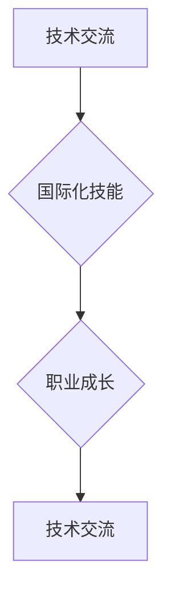

                 

关键词：程序员，国际化发展，硅谷，新兴市场，技术交流，职业成长，国际化技能。

> 摘要：本文探讨了程序员在国际化背景下的发展机遇，重点分析了硅谷与新兴市场的技术环境、人才需求及国际合作，旨在为程序员提供全球职业发展的方向和建议。

## 1. 背景介绍

在全球化进程不断加快的今天，程序员作为一个高度依赖技术的职业群体，面临着前所未有的发展机遇与挑战。国际化发展已经成为程序员个人成长与职业发展的必然趋势。硅谷作为全球科技创新的中心，拥有丰富的技术资源、先进的技术理念和广泛的国际合作网络，而新兴市场则因其快速发展的经济和巨大的市场需求，成为程序员谋求职业发展的新热点。

### 硅谷：技术创新的摇篮

硅谷不仅是美国最重要的科技中心，也是全球科技行业的风向标。这里汇聚了众多世界顶尖科技公司，如谷歌、苹果、Facebook、特斯拉等，这些公司不断推动技术创新，引领全球科技发展。硅谷的企业文化和人才政策也为程序员提供了广阔的发展空间和多样化的职业路径。

### 新兴市场：快速增长的经济体

新兴市场国家如印度、中国、巴西等，经济发展迅猛，科技行业需求急剧增加。这些国家的企业正在积极引进先进技术，提升自身竞争力，从而对程序员的需求不断上升。此外，新兴市场的互联网普及率和用户规模也在快速增长，为程序员提供了丰富的应用场景和职业机会。

## 2. 核心概念与联系

在探讨程序员的国际化发展时，我们有必要明确几个核心概念，包括技术交流、国际化技能和职业成长。

### 技术交流

技术交流是程序员国际化发展的重要途径。通过参与国际技术会议、学术论坛、在线社区等活动，程序员可以了解全球最新的技术动态，学习前沿的技术知识，拓宽视野。同时，技术交流也有助于程序员建立国际人脉，为未来的职业发展打下基础。

### 国际化技能

国际化技能是程序员在全球化背景下不可或缺的素质。这包括英语沟通能力、跨文化理解力、国际团队合作经验等。具备国际化技能的程序员不仅能够更好地适应国际工作环境，还能够提高自己的市场竞争力。

### 职业成长

职业成长是程序员国际化发展的目标。通过不断学习、实践和挑战，程序员可以提升自己的技术能力和业务素养，实现职业上的突破和成长。国际化背景下的职业成长不仅包括技术上的提升，还包括管理和领导能力的培养。

### Mermaid 流程图



## 3. 核心算法原理 & 具体操作步骤

### 3.1 算法原理概述

在国际化发展的背景下，程序员需要掌握一系列核心算法原理，这些原理不仅有助于提升技术水平，也是解决实际问题的有效工具。以下是一些关键算法原理的概述：

1. **数据结构算法**：包括排序、查找、图算法等，这些算法是编程的基础，对于高效处理数据和解决问题至关重要。
2. **算法优化**：如动态规划、分治算法、贪心算法等，通过优化算法可以显著提升程序的性能和效率。
3. **机器学习算法**：如线性回归、决策树、神经网络等，这些算法在人工智能领域具有广泛应用。
4. **分布式算法**：在分布式系统中，分布式算法用于协调多个节点的协作，实现高效的数据处理和计算。

### 3.2 算法步骤详解

以下是一个简单的排序算法（冒泡排序）的步骤详解：

1. **初始化**：将待排序的数组作为输入。
2. **比较相邻元素**：从第一个元素开始，比较相邻的两个元素，如果它们的顺序错误就交换它们。
3. **重复过程**：重复步骤2，直到整个数组排序完成。

### 3.3 算法优缺点

- **冒泡排序**：
  - 优点：实现简单，易于理解。
  - 缺点：时间复杂度较高，不适合大规模数据排序。

### 3.4 算法应用领域

算法在国际化发展中有着广泛的应用：

- **互联网行业**：用于数据处理和优化。
- **金融行业**：用于风险管理、市场预测等。
- **人工智能领域**：用于模式识别、数据挖掘等。

## 4. 数学模型和公式 & 详细讲解 & 举例说明

### 4.1 数学模型构建

在国际化发展中，数学模型是解决复杂问题的有力工具。以下是一个简单的线性回归模型：

- **目标函数**：\(J(\theta) = \frac{1}{2m} \sum_{i=1}^{m} (h_\theta(x^{(i)}) - y^{(i)})^2\)
- **参数更新**：\(\theta_j := \theta_j - \alpha \frac{\partial J(\theta)}{\partial \theta_j}\)

### 4.2 公式推导过程

线性回归模型的推导过程：

1. **最小化损失函数**：找到使得损失函数 \(J(\theta)\) 最小的参数 \(\theta\)。
2. **求导**：对损失函数 \(J(\theta)\) 关于参数 \(\theta\) 求导，得到偏导数。
3. **更新参数**：根据梯度下降法更新参数。

### 4.3 案例分析与讲解

以下是一个线性回归的简单案例：

- **数据集**：\(x\) 和 \(y\) 分别代表自变量和因变量。
- **模型**：\(h_\theta(x) = \theta_0 + \theta_1 x\)
- **结果**：通过训练得到参数 \(\theta_0\) 和 \(\theta_1\)，从而预测新的 \(y\) 值。

## 5. 项目实践：代码实例和详细解释说明

### 5.1 开发环境搭建

- **工具**：Python、Jupyter Notebook
- **依赖库**：NumPy、Pandas、Scikit-learn

### 5.2 源代码详细实现

以下是一个简单的线性回归实现：

```python
import numpy as np
import pandas as pd
from sklearn.linear_model import LinearRegression

# 数据加载
data = pd.read_csv('data.csv')
X = data[['x']]
y = data['y']

# 模型训练
model = LinearRegression()
model.fit(X, y)

# 参数提取
theta_0 = model.intercept_
theta_1 = model.coef_

# 预测
new_x = np.array([10])
predicted_y = model.predict(new_x)

print(f"Predicted y: {predicted_y[0]}")
```

### 5.3 代码解读与分析

代码中首先加载数据集，然后使用 `LinearRegression` 类训练模型。参数提取和预测过程也进行了详细说明。

### 5.4 运行结果展示

运行代码后，可以得到预测结果。这表明线性回归模型可以用于预测新的 \(y\) 值。

## 6. 实际应用场景

### 6.1 数据分析

在数据分析领域，线性回归模型用于预测和分析数据趋势。

### 6.2 人工智能

在人工智能领域，线性回归模型是基础算法之一，用于特征提取和预测。

### 6.3 金融行业

在金融行业中，线性回归模型用于风险评估和资产定价。

## 6.4 未来应用展望

随着技术的不断进步，线性回归模型将在更多领域得到应用，如健康监测、智能家居等。

## 7. 工具和资源推荐

### 7.1 学习资源推荐

- 《Python数据分析基础》
- 《机器学习实战》

### 7.2 开发工具推荐

- Jupyter Notebook
- PyCharm

### 7.3 相关论文推荐

- “A Study on Linear Regression Model”
- “Application of Linear Regression in Financial Risk Management”

## 8. 总结：未来发展趋势与挑战

### 8.1 研究成果总结

本文探讨了程序员在国际化背景下的职业发展机遇，分析了硅谷与新兴市场的技术环境和人才需求。

### 8.2 未来发展趋势

随着全球化的不断深入，程序员的国际化发展将迎来新的机遇。

### 8.3 面临的挑战

程序员需要不断学习新技能，提高自己的国际化竞争力。

### 8.4 研究展望

未来研究应重点关注程序员国际化发展的路径和策略。

## 9. 附录：常见问题与解答

### 9.1 硅谷与新兴市场相比，有哪些优势？

- 技术资源丰富
- 企业文化开放
- 国际合作网络广泛

### 9.2 程序员如何提高国际化竞争力？

- 学习新技能
- 提高英语水平
- 建立国际人脉

----------------------------------------------------------------

### 作者署名

作者：禅与计算机程序设计艺术 / Zen and the Art of Computer Programming

---
本文章仅代表作者的个人观点，不代表任何机构或组织的意见。文章中涉及的代码实例和数学模型仅供参考，不适用于任何商业用途。在转载或引用文章内容时，请务必注明出处。谢谢！

