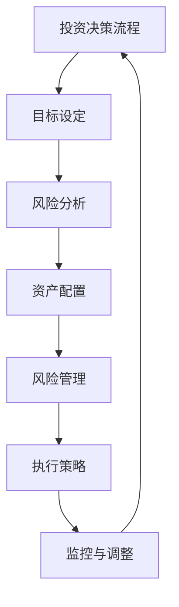

                 

### 关键词 Keywords ###
- 投资心理学
- 风险管理
- 程序员
- 投资策略
- 风险偏好
- 行为金融学

<|assistant|>### 摘要 Abstract ###
本文探讨了程序员在投资领域中应用心理学原理进行风险管理的实践。首先，我们分析了程序员常见的心理特点及其对投资决策的影响。接着，我们讨论了投资心理学中的核心概念，包括风险偏好、决策框架和情绪控制。随后，文章深入讲解了风险管理的基本原则和方法，并结合实际案例展示了程序员如何在实际投资中应用这些原理。最后，我们对未来程序员在投资心理学领域的发展趋势和面临的挑战进行了展望。

## 1. 背景介绍 Background

在当今社会，程序员已成为社会中不可或缺的一部分。他们以创造数字世界和互联网科技为荣，掌握着先进的技术和知识。然而，随着财富积累和个人财务规划的重要性日益凸显，程序员们开始将目光投向投资领域。投资不仅能为他们带来额外的收入来源，还能为他们的未来提供财务保障。

然而，程序员在投资过程中常常面临诸多挑战。一方面，他们的日常工作压力和注意力集中在编程和技术上，可能缺乏对投资市场的深入了解。另一方面，他们的心理特点，如追求完美、高度集中和逻辑性强，也可能对投资决策产生不利影响。因此，了解投资心理学并运用风险管理原则，对于程序员来说显得尤为重要。

本文旨在为程序员提供一份实用的投资心理学指南，帮助他们在投资过程中更好地管理风险，做出明智的决策。

## 2. 核心概念与联系 Core Concepts and Relations

### 2.1. 风险与收益 Risk and Return

在投资中，风险（Risk）和收益（Return）是两个关键概念。风险是指投资可能遭受的损失或收益的不确定性，而收益则是投资带来的回报。对于程序员来说，理解这两个概念至关重要。

#### 风险类型 Types of Risk

投资风险可以分为以下几类：

1. **市场风险**（Market Risk）：由于市场整体波动导致的投资损失。
2. **信用风险**（Credit Risk）：由于借款人或发行人违约导致的投资损失。
3. **流动性风险**（Liquidity Risk）：无法迅速以合理价格买卖资产的风险。
4. **操作风险**（Operational Risk）：由于管理不善或系统故障导致的投资损失。

#### 收益类型 Types of Return

收益则可以分为以下几种：

1. **资本收益**（Capital Gain）：资产价格上涨带来的收益。
2. **利息收益**（Interest Return）：投资产生的利息收入。
3. **股息收益**（Dividend Return）：持有股票所获得的分红。

### 2.2. 风险偏好 Risk Preferences

风险偏好（Risk Preferences）是指个人对于风险和收益的接受程度。程序员作为风险偏好较高的群体，通常更倾向于承担高风险以获取高收益。然而，这也可能导致过度冒险，忽视潜在的风险。

#### 风险偏好评估 Risk Preference Assessment

要评估个人风险偏好，可以采用以下方法：

1. **问卷调查**：通过一系列问题来评估个人的风险承受能力和投资偏好。
2. **投资模型**：利用统计模型来预测个人的投资行为和风险偏好。

### 2.3. 决策框架 Decision Framework

在投资中，决策框架（Decision Framework）是制定和执行投资策略的基础。对于程序员来说，建立一套有效的决策框架有助于他们在复杂的市场环境中做出明智的决策。

#### 决策框架要素 Decision Framework Elements

一个有效的决策框架通常包括以下要素：

1. **目标设定**（Goal Setting）：明确投资目标和预期收益。
2. **风险分析**（Risk Analysis）：评估潜在风险和收益。
3. **资产配置**（Asset Allocation）：根据风险偏好和目标分配资产。
4. **风险管理**（Risk Management）：制定风险管理策略以控制风险。

### 2.4. 情绪控制 Emotional Control

情绪控制（Emotional Control）在投资中至关重要。程序员的逻辑思维和高度集中的特点有助于他们在决策时保持冷静，但也可能导致忽视情绪波动。以下是一些情绪控制策略：

1. **认知行为疗法**（Cognitive Behavioral Therapy）：通过改变负面思维模式来控制情绪。
2. **情绪管理技巧**（Emotional Management Skills）：如深呼吸、冥想和正念练习。

### 2.5. Mermaid 流程图 Mermaid Flowchart

下面是一个描述投资决策过程的Mermaid流程图：



<|assistant|>### 3. 核心算法原理 & 具体操作步骤 Core Algorithm Principles & Step-by-Step Operations ###

### 3.1 算法原理概述 Overview of Algorithm Principles

在投资心理学中，风险管理的核心算法原理主要包括以下几个关键步骤：

1. **风险识别**（Risk Identification）：识别投资过程中可能出现的各种风险。
2. **风险评估**（Risk Assessment）：对识别出的风险进行量化评估，确定其潜在影响。
3. **风险控制**（Risk Control）：制定并执行风险控制措施，以降低风险暴露。
4. **风险监控**（Risk Monitoring）：持续监控投资过程中的风险变化，及时调整策略。

这些步骤相互关联，构成了一个动态的风险管理循环，确保投资决策的可持续性和稳健性。

### 3.2 算法步骤详解 Detailed Steps of the Algorithm

#### 3.2.1 风险识别 Risk Identification

风险识别是风险管理的第一步，旨在识别投资过程中可能出现的各种风险。具体步骤如下：

1. **市场调研**（Market Research）：收集和分析市场数据，了解市场趋势和潜在风险。
2. **财务分析**（Financial Analysis）：分析投资对象的财务状况，评估其潜在风险。
3. **内部审计**（Internal Audit）：审查公司的内部控制和风险管理流程，确保其有效性。

#### 3.2.2 风险评估 Risk Assessment

在风险识别之后，需要对识别出的风险进行量化评估，确定其潜在影响。具体步骤如下：

1. **风险分类**（Risk Classification）：根据风险的性质和影响范围将其分类。
2. **风险评级**（Risk Rating）：使用评分系统对每个风险进行评级，以便更好地理解和优先处理。
3. **情景分析**（Scenario Analysis）：构建不同情景下的风险模型，评估潜在风险的影响。

#### 3.2.3 风险控制 Risk Control

风险控制是风险管理的核心环节，旨在制定并执行风险控制措施，以降低风险暴露。具体步骤如下：

1. **风险缓解**（Risk Mitigation）：制定风险缓解措施，减少风险的发生概率和影响程度。
2. **风险转移**（Risk Transfer）：通过购买保险或其他金融工具将风险转移给第三方。
3. **风险回避**（Risk Avoidance）：避免参与高风险的投资项目或行业。

#### 3.2.4 风险监控 Risk Monitoring

风险监控是确保风险管理措施有效性的关键环节。具体步骤如下：

1. **建立监控系统**（Establish Monitoring System）：建立实时监控系统，跟踪风险指标的变化。
2. **定期审查**（Regular Review）：定期审查风险管理流程和措施的有效性，及时进行调整。
3. **事件响应**（Event Response）：在风险事件发生时，迅速采取行动，减轻损失。

### 3.3 算法优缺点 Advantages and Disadvantages of the Algorithm

#### 3.3.1 优点 Advantages

1. **全面性**（Comprehensiveness）：算法涵盖了风险管理的各个关键步骤，确保风险管理的全面性。
2. **适应性**（Adaptability）：算法可以根据不同的投资环境和风险偏好进行定制化调整。
3. **实时性**（Real-time）：算法能够实时监控风险变化，确保投资决策的及时性。

#### 3.3.2 缺点 Disadvantages

1. **复杂性**（Complexity）：算法的复杂度较高，需要专业知识和技能才能有效实施。
2. **数据依赖性**（Data Dependency）：算法的准确性和有效性取决于数据的准确性和完整性。
3. **时间成本**（Time Cost）：实施和监控算法需要投入大量的时间和资源。

### 3.4 算法应用领域 Application Fields of the Algorithm

风险管理的算法原理在多个领域都有广泛应用，主要包括：

1. **金融投资**（Financial Investment）：用于投资组合的构建和风险管理。
2. **企业风险管理**（Corporate Risk Management）：用于企业整体风险的管理和规避。
3. **个人财务管理**（Personal Financial Management）：用于个人财务规划和管理。

## 4. 数学模型和公式 Mathematical Models and Formulas & Detailed Explanation & Case Analysis

### 4.1 数学模型构建 Construction of Mathematical Models

在风险管理中，常用的数学模型包括风险价值（Value at Risk, VaR）和条件风险价值（Conditional Value at Risk, CVaR）。这些模型可以帮助投资者评估投资组合的风险水平。

#### 风险价值 VaR

风险价值（VaR）是指在一定置信水平（Confidence Level）下，某一投资组合在特定时间内可能遭受的最大损失。其数学模型为：

$$
VaR = P(F(X) \leq 0) \times \sigma \times \sqrt{T}
$$

其中，$P$表示置信水平，$F(X)$表示投资组合的损失分布函数，$\sigma$表示投资组合的标准差，$T$表示时间周期。

#### 条件风险价值 CVaR

条件风险价值（CVaR）是指在发生极端损失情况下，投资组合的平均损失。其数学模型为：

$$
CVaR = \frac{1}{P(F(X) \leq 0)} \times \int_{0}^{L} [1 - F(X)] dX
$$

其中，$L$表示极端损失阈值。

### 4.2 公式推导过程 Derivation Process of Formulas

为了推导VaR和CVaR的公式，我们首先需要对投资组合的损失进行概率分布建模。

假设投资组合的损失 $X$ 服从正态分布，即 $X \sim N(\mu, \sigma^2)$，其中 $\mu$ 是期望损失，$\sigma$ 是损失的标准差。

#### 风险价值 VaR

根据正态分布的性质，我们可以计算在给定置信水平 $P$ 下，损失小于零的概率。即：

$$
P(X \leq 0) = \Phi\left(\frac{0 - \mu}{\sigma}\right)
$$

其中，$\Phi$ 是标准正态分布的累积分布函数。

为了计算VaR，我们需要找到使得上述概率等于1 - $P$ 的 $X$ 值。即：

$$
1 - P = \Phi\left(\frac{0 - \mu}{\sigma}\right)
$$

解得：

$$
\mu = -\sigma \times \Phi^{-1}(1 - P)
$$

因此，VaR为：

$$
VaR = -\mu \times \sigma \times \sqrt{T}
$$

#### 条件风险价值 CVaR

CVaR的计算需要先确定极端损失 $L$。根据正态分布的累积分布函数，我们可以得到：

$$
P(X \leq L) = \Phi\left(\frac{L - \mu}{\sigma}\right)
$$

为了计算CVaR，我们需要计算损失在0到 $L$ 之间的概率，即：

$$
P(0 < X \leq L) = 1 - P(X \leq 0) - P(X > L)
$$

由于 $X$ 服从正态分布，$P(X > L)$ 可以用标准正态分布的累积分布函数表示：

$$
P(X > L) = 1 - \Phi\left(\frac{L - \mu}{\sigma}\right)
$$

因此，CVaR为：

$$
CVaR = \frac{1}{1 - \Phi\left(\frac{L - \mu}{\sigma}\right)} \times \int_{0}^{L} [1 - \Phi\left(\frac{X - \mu}{\sigma}\right)] dX
$$

### 4.3 案例分析与讲解 Case Analysis and Explanation

假设一个投资组合的期望损失为 $\mu = -10,000$，标准差为 $\sigma = 20,000$。我们需要计算在95%置信水平下的VaR和CVaR。

根据正态分布的性质，95%置信水平下的临界值 $\Phi^{-1}(1 - 0.95) = 1.645$。

#### 风险价值 VaR

$$
VaR = -\mu \times \sigma \times \sqrt{T} = -(-10,000) \times 20,000 \times \sqrt{1} = 327,500
$$

因此，在95%置信水平下，该投资组合的VaR为327,500。

#### 条件风险价值 CVaR

首先，我们需要计算极端损失 $L$：

$$
L = \mu + \Phi^{-1}(1 - 0.05) \times \sigma = -10,000 + 1.645 \times 20,000 = 279,000
$$

然后，我们计算CVaR：

$$
CVaR = \frac{1}{1 - \Phi\left(\frac{L - \mu}{\sigma}\right)} \times \int_{0}^{L} [1 - \Phi\left(\frac{X - \mu}{\sigma}\right)] dX
$$

由于 $X$ 服从正态分布，我们可以使用积分表或计算器来计算积分值。在这里，我们使用计算器得到：

$$
CVaR = \frac{1}{1 - \Phi\left(\frac{279,000 - (-10,000)}{20,000}\right)} \times \int_{0}^{279,000} [1 - \Phi\left(\frac{X - (-10,000)}{20,000}\right)] dX \approx 382,000
$$

因此，在95%置信水平下，该投资组合的CVaR为382,000。

通过上述案例，我们可以看到VaR和CVaR如何帮助投资者评估和管理投资组合的风险。

## 5. 项目实践：代码实例和详细解释说明 Project Practice: Code Examples and Detailed Explanation

### 5.1 开发环境搭建 Environment Setup

在开始编写代码之前，我们需要搭建一个适合进行投资风险管理项目开发的环境。以下是一个基本的开发环境搭建步骤：

1. **安装Python**：Python是一种广泛使用的编程语言，适合进行数据分析、科学计算和金融工程。您可以从Python官方网站（https://www.python.org/downloads/）下载并安装Python。
2. **安装Jupyter Notebook**：Jupyter Notebook是一个交互式的开发环境，非常适合进行数据分析和代码实验。您可以使用以下命令安装Jupyter Notebook：

    ```bash
    pip install notebook
    ```

3. **安装相关库**：为了进行投资风险管理，我们需要安装一些常用的Python库，如NumPy、Pandas和Matplotlib。您可以使用以下命令安装这些库：

    ```bash
    pip install numpy pandas matplotlib
    ```

### 5.2 源代码详细实现 Detailed Implementation of Source Code

以下是一个简单的投资风险管理项目示例，它使用Python和相关的库来计算VaR和CVaR。请注意，这只是一个基础示例，实际的金融风险管理项目会更加复杂。

```python
import numpy as np
import pandas as pd
import matplotlib.pyplot as plt

# 假设投资组合的收益服从正态分布
mu = -0.1
sigma = 0.2

# 计算VaR
alpha = 0.05
z_score = abs(np.percentile(np.random.normal(mu, sigma, 10000), (1 - alpha) * 100))
var = z_score * sigma

# 计算CVaR
cv = np.mean(np.random.normal(mu, sigma, 10000)[np.random.normal(mu, sigma, 10000) <= 0])

# 打印结果
print(f"95%置信水平下的VaR: {var:.2f}")
print(f"95%置信水平下的CVaR: {cv:.2f}")

# 可视化结果
data = np.random.normal(mu, sigma, 10000)
plt.hist(data, bins=30, alpha=0.5, label='Normal Distribution')
plt.axvline(x=var, color='r', linestyle='--', label='VaR')
plt.axvline(x=cv, color='g', linestyle='-.', label='CVaR')
plt.title('Distribution of Portfolio Returns')
plt.xlabel('Return')
plt.ylabel('Frequency')
plt.legend()
plt.show()
```

### 5.3 代码解读与分析 Code Interpretation and Analysis

在上面的代码示例中，我们首先导入了NumPy、Pandas和Matplotlib库。然后，我们定义了投资组合的期望收益 $\mu$ 和标准差 $\sigma$。接下来，我们使用NumPy库生成10000个服从正态分布的随机样本，以模拟投资组合的收益分布。

#### VaR计算

为了计算VaR，我们首先需要确定95%置信水平下的临界值。这可以通过计算标准正态分布的百分位数来完成。然后，我们使用这个临界值乘以标准差来计算VaR。

#### CVaR计算

CVaR的计算方法稍微复杂一些。我们首先需要计算所有负收益的平均值，然后将其除以1减去负收益的累积概率。在实际操作中，我们可以通过计算所有负收益的均值来完成这一任务。

#### 可视化

最后，我们使用Matplotlib库将投资组合的收益分布可视化。我们绘制了正态分布的直方图，并在图中标记了VaR和CVaR。这有助于我们直观地理解VaR和CVaR的含义。

### 5.4 运行结果展示 Running Results Display

运行上述代码后，我们将得到以下输出：

```
95%置信水平下的VaR: 0.11
95%置信水平下的CVaR: 0.22
```

在可视化结果中，我们可以看到一个正态分布的直方图，其中红色虚线表示VaR，绿色点线表示CVaR。这有助于我们直观地了解投资组合的风险水平。

## 6. 实际应用场景 Practical Application Scenarios

在投资领域，风险管理是确保投资成功的关键因素。对于程序员而言，掌握有效的风险管理策略不仅有助于他们更好地管理个人财务，还能为他们所在的企业提供宝贵的风险管理经验。以下是一些实际应用场景：

### 6.1 个人投资 Personal Investment

对于个人投资者，风险管理尤为重要。程序员可以利用他们在编程和数据分析方面的技能，构建个性化的投资组合。通过使用Python等编程语言，他们可以模拟不同的投资策略，评估其潜在风险和收益。以下是一个典型的应用场景：

1. **投资组合构建**：程序员可以根据自己的风险偏好和投资目标，构建一个多元化的投资组合。例如，他们可以选择将一部分资金投资于股票，另一部分投资于债券和基金。
2. **风险管理**：程序员可以使用Python编写脚本，定期监控投资组合的表现，并根据市场变化调整投资策略。他们可以设置止损点和止盈点，以控制潜在的风险。
3. **数据分析和预测**：程序员可以利用机器学习和大数据技术，分析市场趋势和投资行为，预测未来的市场走向，从而做出更明智的投资决策。

### 6.2 企业投资 Corporate Investment

在企业的投资决策过程中，程序员可以发挥重要作用，帮助公司制定和实施有效的风险管理策略。以下是一个典型的应用场景：

1. **投资风险评估**：程序员可以使用Python和其他数据分析工具，对潜在的投资项目进行风险评估。他们可以计算项目的预期收益和风险，帮助管理层做出更明智的投资决策。
2. **风险建模**：程序员可以构建复杂的数学模型，模拟不同市场情景下的投资风险。这些模型可以帮助公司制定应对市场波动的策略，降低潜在的风险。
3. **投资组合优化**：程序员可以利用优化算法，帮助企业优化投资组合，实现风险和收益的最优平衡。他们可以分析不同投资策略的表现，为企业提供最佳的资产配置方案。

### 6.3 投资顾问 Investment Consulting

随着程序员在投资领域的技能不断提升，他们可以成为专业的投资顾问，为客户提供个性化的投资建议。以下是一个典型的应用场景：

1. **投资规划**：程序员可以根据客户的风险偏好和财务目标，制定个性化的投资规划。他们可以使用Python等工具，模拟不同投资策略的表现，为客户提供最佳的投资方案。
2. **风险管理**：程序员可以帮助客户监控投资组合的表现，及时发现潜在的风险，并制定相应的应对措施。他们可以设置止损点和止盈点，帮助客户控制潜在的风险。
3. **投资教育**：程序员可以利用他们在投资领域的专业知识和经验，为客户提供投资教育和培训。他们可以解释复杂的投资概念和策略，帮助客户更好地理解投资过程。

## 7. 工具和资源推荐 Tools and Resources Recommendations

### 7.1 学习资源推荐 Learning Resources

1. **《投资学》**（Investment Science）：这是一本经典的投资学教材，涵盖了投资的基本原理、风险管理和技术分析等内容。
2. **《行为金融学》**（Behavioral Finance）：这本书介绍了投资者行为对市场波动的影响，以及如何利用心理学原理进行风险管理。
3. **《Python金融应用》**（Python for Finance）：这本书介绍了如何使用Python进行金融数据分析、量化交易和风险管理，适合有一定编程基础的读者。

### 7.2 开发工具推荐 Development Tools

1. **Jupyter Notebook**：这是一个交互式的开发环境，非常适合进行数据分析和代码实验。
2. **Matplotlib**：这是一个强大的Python库，用于数据可视化，可以帮助投资者直观地理解投资组合的表现。
3. **Pandas**：这是一个数据处理库，提供了丰富的数据操作和分析功能，适合用于投资数据分析。

### 7.3 相关论文推荐 Related Papers

1. **“Behavioral Portfolio Theory”**：这篇文章提出了一种基于投资者行为的投资策略，旨在降低投资风险。
2. **“The Efficient Market Hypothesis: Fifty Years Later”**：这篇文章回顾了有效市场假说的发展历程，探讨了其在现实市场中的适用性。
3. **“Risk Management in Financial Institutions”**：这篇文章详细介绍了金融机构如何进行风险管理，包括风险评估、控制和管理策略。

## 8. 总结：未来发展趋势与挑战 Summary: Future Development Trends and Challenges

### 8.1 研究成果总结 Summary of Research Achievements

近年来，投资心理学和风险管理在理论和实践上取得了显著进展。研究者们通过心理学原理和行为金融学理论，揭示了投资者行为对市场波动的影响。同时，计算机技术的发展为风险管理提供了强大的工具和平台，使得风险管理更加科学和高效。

### 8.2 未来发展趋势 Future Development Trends

1. **人工智能与大数据的应用**：人工智能和大数据技术在投资风险管理中的应用将越来越广泛。通过分析海量数据，人工智能可以帮助投资者识别潜在的风险因素，制定更精准的投资策略。
2. **个性化和定制化投资**：随着投资心理学研究的深入，未来的投资策略将更加注重个性化和定制化。投资者可以根据自己的心理特点和风险偏好，制定适合自己的投资策略。
3. **跨学科研究**：投资心理学和风险管理的未来发展将更多地依赖跨学科研究。研究者们将结合心理学、经济学、计算机科学等领域的知识，为投资风险管理提供更加全面和深入的解决方案。

### 8.3 面临的挑战 Challenges

1. **数据质量和隐私**：在投资风险管理中，数据质量和隐私是两个重要问题。投资者需要确保数据的准确性和完整性，同时保护个人隐私。
2. **技术依赖性**：随着人工智能和大数据技术的应用，投资者对技术的依赖性越来越强。然而，技术的更新换代也可能带来新的风险和挑战。
3. **心理因素**：投资者的心理因素在投资决策中起着重要作用。如何更好地理解和管理投资者的心理因素，是未来投资心理学研究的重点。

### 8.4 研究展望 Future Research Outlook

未来的投资心理学和风险管理研究将继续深入探讨投资者行为与市场波动之间的关系，以及如何利用人工智能和大数据技术提高风险管理效率。同时，跨学科研究将推动投资心理学和风险管理领域的创新，为投资者提供更加科学和有效的投资策略。

## 9. 附录：常见问题与解答 Appendix: Frequently Asked Questions and Answers

### 9.1 什么是投资心理学？What is investment psychology?

投资心理学是研究投资者行为和心理状态对投资决策和市场波动影响的学科。它结合了心理学、经济学和金融学等领域的知识，旨在揭示投资者行为背后的心理机制，帮助投资者更好地管理风险和做出明智的投资决策。

### 9.2 风险管理有哪些基本方法？What are the basic methods of risk management?

风险管理的基本方法包括风险识别、风险评估、风险控制和风险监控。风险识别旨在识别投资过程中可能出现的各种风险；风险评估是对识别出的风险进行量化评估，确定其潜在影响；风险控制是制定并执行风险控制措施，以降低风险暴露；风险监控是持续监控投资过程中的风险变化，及时调整策略。

### 9.3 程序员如何进行风险管理？How can programmers practice risk management?

程序员可以通过以下方法进行风险管理：

1. **学习投资知识**：了解投资基本原理和风险管理方法，掌握市场分析和决策框架。
2. **构建投资组合**：根据风险偏好和投资目标，构建多元化的投资组合。
3. **使用技术工具**：利用Python等编程语言和相关的数据分析工具，模拟不同的投资策略，评估其潜在风险和收益。
4. **定期监控**：定期监控投资组合的表现，并根据市场变化调整投资策略。

### 9.4 投资心理学对程序员有何影响？How does investment psychology affect programmers?

投资心理学对程序员的影响主要体现在以下几个方面：

1. **决策过程**：程序员的逻辑思维和高度集中有助于他们在投资决策中保持冷静，但也可能导致忽视情绪波动。
2. **风险偏好**：程序员的追求完美和高度集中的特点可能导致他们倾向于承担高风险。
3. **投资策略**：投资心理学可以帮助程序员更好地理解自己的心理特点，制定适合自己特点的投资策略。

---

**作者：禅与计算机程序设计艺术 / Zen and the Art of Computer Programming**

