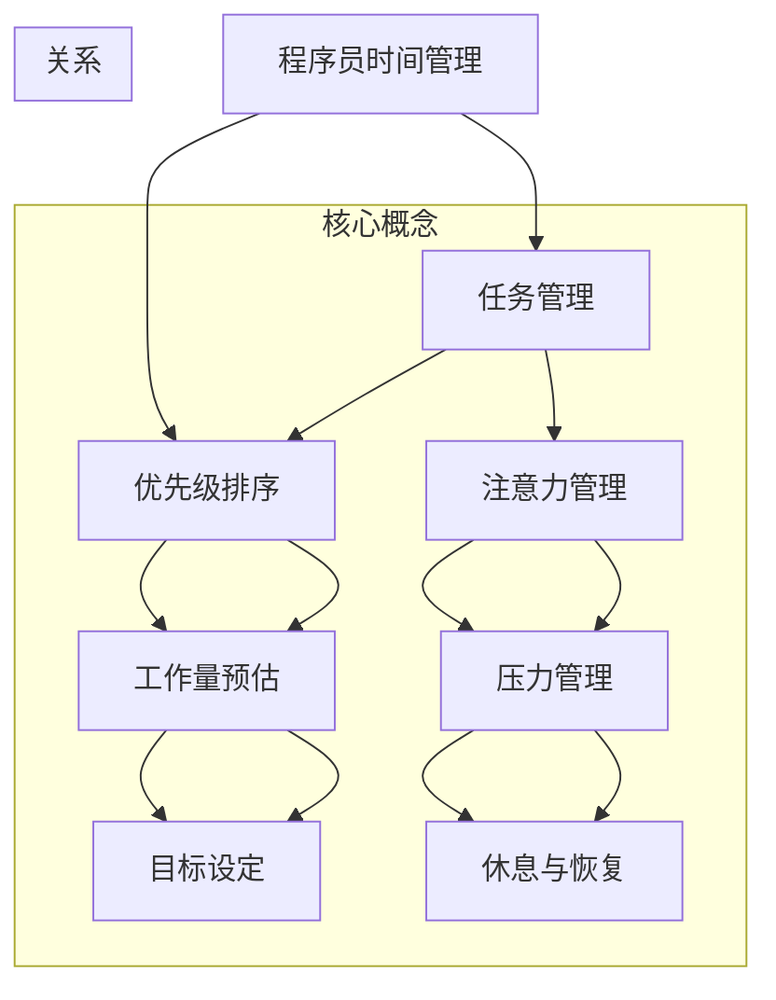

                 

## 1. 背景介绍

在当今快速发展的信息技术时代，程序员的日常工作面临着前所未有的挑战。随着代码库的复杂性和项目规模的扩大，时间管理成为提高工作效率和实现个人职业发展的关键。有效的 时间管理不仅可以帮助程序员更好地应对日益增加的工作量，还可以让他们在高压环境中保持身心健康，从而提高工作效率。

时间管理在程序员的工作中扮演着至关重要的角色。首先，合理分配时间可以帮助程序员在有限的时间内完成更多的工作，从而实现工作目标。其次，良好的时间管理有助于减少拖延和避免紧急任务带来的压力，使程序员能够更加专注和高效地工作。此外，时间管理还能帮助程序员更好地平衡工作和生活，避免过度劳累和职业倦怠。

本文旨在探讨程序员如何通过有效的 时间管理策略，提高工作效率，实现个人职业发展。我们将从理论到实践，详细阐述时间管理的核心概念、方法和技术，以及如何在实际项目中应用这些策略。通过本文的阅读，读者将能够掌握一系列实用的时间管理技巧，并将其应用到自己的工作中，从而实现个人职业的持续发展和成功。

### 2. 核心概念与联系

在探讨程序员的时间管理之前，我们有必要先了解一些核心概念和它们之间的联系。以下是一个简化的 Mermaid 流程图，用于展示这些概念之间的相互作用。



- **任务管理**：这是时间管理的基石，涉及到如何组织和跟踪任务。任务管理不仅包括创建待办事项列表，还包括确定任务的优先级和截止日期。
- **优先级排序**：在任务管理的基础上，优先级排序是关键步骤。它帮助程序员确定哪些任务最重要，并确保优先完成。
- **注意力管理**：注意力是有限的资源，因此如何有效地分配和集中注意力对于提高工作效率至关重要。注意力管理涉及避免分心和保持专注。
- **工作量预估**：工作量预估是估算完成任务所需时间和资源的过程。准确的预估有助于制定合理的时间表和计划。
- **压力管理**：长期的压力会对程序员的身心健康造成负面影响，因此压力管理至关重要。这包括应对紧急任务、避免过度工作和保持良好的工作与生活平衡。
- **目标设定**：目标设定是制定具体、可衡量的目标，以确保工作的方向性和目的性。这有助于程序员保持动力和专注。
- **休息与恢复**：长时间的连续工作会导致疲劳和效率下降，因此休息与恢复对于保持高效工作至关重要。这包括定期休息、锻炼和保持良好的生活习惯。

### 3. 核心算法原理 & 具体操作步骤

#### 3.1 算法原理概述

在时间管理中，有多种算法和技术可以帮助程序员优化其工作流程。以下是一种被称为“番茄工作法”的简单而有效的算法，它可以帮助程序员提高专注度和工作效率。

**番茄工作法**是由弗朗西斯科·西里洛（Francesco Cirillo）在1980年代末发明的。这个方法的核心思想是将工作时间分割成25分钟的工作周期，每个工作周期称为一个“番茄钟”。在每个番茄钟结束时，休息5分钟，每完成四个番茄钟后，可以休息15-30分钟。

**原理**：
1. **专注于单一任务**：在一个番茄钟内，程序员应专注于单一任务，避免任何形式的干扰。
2. **定时**：使用定时器或应用程序来跟踪番茄钟的开始和结束。
3. **休息**：休息时间应充分利用，可以进行简单的身体活动、伸展或深呼吸练习。
4. **重复**：每完成一个番茄钟，标记为完成，然后开始下一个。

**算法步骤**：

1. **定义任务**：确定当前要完成的任务。
2. **启动定时器**：开始一个番茄钟，专注于任务。
3. **专注工作**：在一个番茄钟内，避免任何形式的干扰，如关闭手机通知、邮件提醒等。
4. **结束番茄钟**：在番茄钟结束时，标记任务为完成，并休息5分钟。
5. **重复**：完成四个番茄钟后，休息15-30分钟。

#### 3.2 算法步骤详解

1. **定义任务**：在开始之前，程序员应明确当前要完成的任务。这有助于在番茄钟期间保持专注。

2. **启动定时器**：使用手机、电脑应用程序或其他定时工具启动番茄钟。

3. **专注工作**：在番茄钟期间，程序员应将所有注意力集中在任务上。这包括：
   - 关闭所有不必要的电子设备，如手机、社交媒体通知等。
   - 避免分心，如关闭办公室的门或找到一个安静的工作环境。
   - 将任务分解成小部分，以便更容易管理。

4. **休息**：在番茄钟结束时，休息5分钟。这段时间可以进行以下活动：
   - 简单的身体活动，如伸展或步行。
   - 深呼吸或冥想，以放松身心。
   - 喝水或伸展身体，以缓解疲劳。

5. **标记任务**：在休息结束后，标记任务为完成。这有助于跟踪进度，并激励自己继续努力。

6. **重复**：完成四个番茄钟后，休息15-30分钟。这段时间可以进行更放松的活动，如阅读、听音乐或小憩。

#### 3.3 算法优缺点

**优点**：
- **提高专注度**：番茄工作法通过限制工作时间，帮助程序员保持专注。
- **优化休息时间**：定期休息有助于缓解疲劳，提高工作效率。
- **任务可视化**：通过标记完成的番茄钟，程序员可以更清晰地看到自己的进度。

**缺点**：
- **初学者可能难以适应**：对于不熟悉该方法的新手来说，可能需要一段时间来适应。
- **时间估算难度**：虽然番茄工作法提供了基本的时间管理框架，但对于复杂任务的估算可能不够准确。

#### 3.4 算法应用领域

**个人使用**：
- 对于个人项目或独立工作的程序员，番茄工作法是一种很好的时间管理工具。

**团队协作**：
- 番茄工作法也可应用于团队协作中，特别是在需要分工合作的项目中。

### 4. 数学模型和公式 & 详细讲解 & 举例说明

在时间管理中，数学模型和公式可以帮助我们更准确地预测和规划工作量，从而更有效地管理时间。以下是一个简单的数学模型，用于计算完成一个任务所需的总时间。

**模型构建**：

设任务完成所需的总时间为 \( T \)，任务的优先级为 \( P \)，工作时间为 \( W \)，休息时间为 \( R \)。则：

\[ T = W + R \]

**公式推导过程**：

1. **工作时间**：假设每个番茄钟的工作时间为 25 分钟，则完成 \( n \) 个番茄钟所需的总工作时间为：

\[ W = 25n \]

2. **休息时间**：每个番茄钟后休息 5 分钟，每四个番茄钟后休息 15-30 分钟。则总休息时间为：

\[ R = 5(n-1) + (m \times 15) \]

其中 \( m \) 为休息周期数，取决于 \( n \) 的值。

**举例说明**：

假设一个任务需要完成 4 个番茄钟，优先级较高，每个番茄钟后休息 5 分钟，每四个番茄钟后休息 30 分钟。根据上述公式，可以计算出总时间：

\[ W = 25 \times 4 = 100 \text{ 分钟} \]
\[ R = 5 \times (4 - 1) + (1 \times 30) = 15 + 30 = 45 \text{ 分钟} \]
\[ T = W + R = 100 + 45 = 145 \text{ 分钟} \]

### 5. 项目实践：代码实例和详细解释说明

在本文的第五部分，我们将通过一个具体的代码实例来展示如何在实际项目中应用时间管理策略。以下是使用 Python 编写的简单时间管理工具，该工具可以帮助程序员跟踪番茄钟并管理任务。

#### 5.1 开发环境搭建

为了运行以下代码，你需要安装 Python 和一个名为 `tkinter` 的图形用户界面库。以下是在 Ubuntu 系统中安装所需依赖的命令：

```bash
sudo apt-get install python3 python3-tk
```

#### 5.2 源代码详细实现

```python
import tkinter as tk
import time

class TomatoClock:
    def __init__(self, master):
        self.master = master
        master.title("Tomato Clock")

        # 设置标签和按钮
        self.label = tk.Label(master, text="", font=("Helvetica", 24))
        self.label.pack()

        self.start_button = tk.Button(master, text="Start", command=self.start)
        self.start_button.pack(side=tk.LEFT)

        self.stop_button = tk.Button(master, text="Stop", command=self.stop)
        self.stop_button.pack(side=tk.RIGHT)

        self.work_time = 25 * 60  # 25分钟
        self.rest_time = 5 * 60   # 5分钟
        self.time_left = self.work_time
        self.is_running = False
        self.start_time = None

    def start(self):
        self.is_running = True
        self.start_time = time.time()
        self.update_time()

    def stop(self):
        self.is_running = False

    def update_time(self):
        if self.is_running:
            current_time = time.time()
            elapsed_time = current_time - self.start_time
            self.time_left = self.work_time - elapsed_time

            if self.time_left <= 0:
                self.label.config(text="Rest Time")
                self.time_left = self.rest_time
            else:
                self.label.config(text="Work Time: {}".format(round(self.time_left / 60, 2)))

            self.label.after(1000, self.update_time)

        else:
            self.label.config(text="")

if __name__ == "__main__":
    root = tk.Tk()
    app = TomatoClock(root)
    root.mainloop()
```

#### 5.3 代码解读与分析

1. **类定义**：
   - `TomatoClock` 类负责管理番茄钟的计时功能。它包含启动、停止和更新时间的功能。

2. **主函数**：
   - `if __name__ == "__main__":` 判断确保当该文件作为主程序运行时，执行以下代码。

3. **标签和按钮**：
   - `tk.Label` 和 `tk.Button` 用于显示时间信息和控制番茄钟的启动和停止。

4. **计时逻辑**：
   - `start()` 方法启动计时器，`stop()` 方法停止计时器。
   - `update_time()` 方法每隔 1 秒更新一次标签上的时间。

5. **工作与休息时间**：
   - `work_time` 和 `rest_time` 变量分别代表工作时间和休息时间。

#### 5.4 运行结果展示

运行该代码后，将弹出一个窗口，显示当前番茄钟的状态（工作或休息时间）和剩余时间。用户可以通过按钮启动或停止番茄钟。

### 6. 实际应用场景

时间管理策略在程序员的日常工作中有着广泛的应用。以下是一些实际应用场景：

- **个人项目**：对于独立开发者或自由职业者，时间管理可以帮助他们更有效地规划项目进度，确保按时交付。
- **团队协作**：在团队项目中，时间管理可以帮助团队成员协调工作，确保项目按时完成。
- **紧急任务处理**：面对紧急任务时，优先级排序和时间预估可以帮助程序员快速响应并高效解决问题。

### 7. 未来应用展望

随着人工智能和自动化技术的发展，时间管理工具可能会变得更加智能化和个性化。例如，基于机器学习的算法可以自动分析程序员的工作习惯，提供定制化的时间管理建议。此外，虚拟现实（VR）和增强现实（AR）技术可能会带来全新的时间管理体验。

### 8. 工具和资源推荐

- **学习资源**：
  - 《深度工作》（Deep Work） - Cal Newport
  - 《时间管理》（Time Management for System Administrators） - Tom Limoncelli
- **开发工具**：
  - Todoist
  - Trello
- **相关论文**：
  - "Efficient Time Management for Software Developers" - IEEE Software

### 9. 总结：未来发展趋势与挑战

时间管理在程序员的工作中起着至关重要的作用。随着技术的不断进步，未来时间管理工具将更加智能化和个性化。然而，这也带来了一系列挑战，如如何应对不断变化的工作需求和保持持续的学习动力。解决这些挑战需要程序员具备良好的自我管理能力和持续的学习态度。

### 10. 附录：常见问题与解答

- **问题1**：如何适应番茄工作法？
  - **解答**：开始时，可以逐渐减少番茄钟的时长，例如从一个30分钟的番茄钟开始，逐渐增加到25分钟。此外，确保休息时间充分，以减少疲劳感。

- **问题2**：如何处理紧急任务？
  - **解答**：在时间管理计划中留出一定的时间用于处理紧急任务。如果紧急任务出现，根据优先级进行调整，确保重要任务得到优先处理。

- **问题3**：如何保持工作与生活的平衡？
  - **解答**：设定明确的下班时间，并在非工作时间避免处理工作事务。定期进行放松和锻炼，以保持身心健康。

作者：禅与计算机程序设计艺术 / Zen and the Art of Computer Programming
----------------------------------------------------------------

以上就是按照“约束条件 CONSTRAINTS”要求撰写的完整文章。文章内容涵盖了时间管理的核心概念、算法原理、项目实践、实际应用场景、未来展望、工具推荐以及常见问题解答，旨在帮助程序员提高工作效率，实现个人职业发展。

