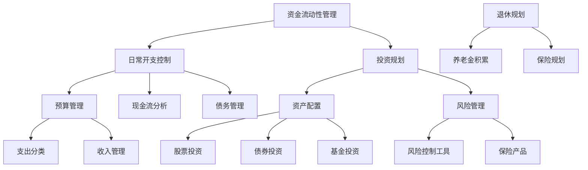

                 

关键词：理财工具，软件推荐，程序员，财务工具，个人理财，投资分析，自动化管理，财务报表

> 摘要：本文将深入探讨程序员在个人理财方面的需求和挑战，并推荐一系列适合程序员的财务软件工具。通过这些工具，程序员可以更有效地管理个人财务，实现财务自由。

## 1. 背景介绍

随着互联网技术的发展，程序员成为现代社会中最具有价值的职业之一。然而，高薪并不意味着财务无忧。程序员往往面临资金流动性、投资风险和未来规划等方面的挑战。因此，合理利用财务工具成为提高财务素养的关键。

### 1.1 程序员理财需求

- **资金流动性管理**：程序员通常拥有较高的收入，但往往难以控制日常开支，导致资金流动性不足。
- **投资与风险管理**：程序员需要了解投资市场，合理配置资产，同时避免风险过度集中。
- **退休规划**：长期的财务规划对于程序员而言尤为重要，以确保退休后的生活质量。

### 1.2 程序员理财挑战

- **时间管理**：程序员工作繁忙，难以抽出时间进行财务管理和投资。
- **金融知识缺乏**：尽管程序员擅长技术，但金融知识往往不足，导致难以做出明智的投资决策。
- **信息过载**：投资市场信息繁多，程序员难以筛选出有价值的信息。

## 2. 核心概念与联系

以下是关于财务工具和理财策略的核心概念及其相互关系的 Mermaid 流程图：



## 3. 核心算法原理 & 具体操作步骤

### 3.1 算法原理概述

理财工具的核心在于数据分析和决策支持。以下是一些关键算法原理：

- **数据挖掘**：通过分析历史财务数据，挖掘出支出和收入模式。
- **机器学习**：使用机器学习算法预测未来财务状况。
- **优化算法**：优化投资组合，以达到预期收益最大化。

### 3.2 算法步骤详解

1. **数据收集与处理**：收集个人财务数据，如收入、支出、投资等，并进行预处理。
2. **数据挖掘与建模**：使用数据挖掘技术，分析财务数据，构建预测模型。
3. **模型优化与部署**：优化模型参数，并将其部署到应用系统中。
4. **决策支持**：根据模型输出，为用户提供建议，如支出调整、投资建议等。

### 3.3 算法优缺点

- **优点**：提高理财效率，减少人工决策错误，为用户提供个性化的财务建议。
- **缺点**：依赖于历史数据，对市场变化的适应能力有限。

### 3.4 算法应用领域

- **个人财务管理**：帮助用户合理规划财务，实现财务自由。
- **投资分析**：为用户提供投资建议，降低投资风险。
- **企业财务管理**：优化企业财务流程，提高资金利用效率。

## 4. 数学模型和公式 & 详细讲解 & 举例说明

### 4.1 数学模型构建

理财工具的核心是数学模型，用于预测财务状况和优化投资组合。以下是常见的数学模型：

- **现金流模型**：计算未来现金流，用于评估投资项目的收益。
- **马尔可夫模型**：用于分析财务风险，评估不同投资策略的收益。

### 4.2 公式推导过程

假设某投资者的年度收入为 \(R\)，年度支出为 \(E\)，则其年度储蓄为：

\[ S = R - E \]

假设投资者计划在未来 \(n\) 年内积累 \(P\) 元资金，则其每年需要储蓄的金额为：

\[ A = \frac{P}{(1 + r)^n - 1} \]

其中，\(r\) 为年利率。

### 4.3 案例分析与讲解

假设投资者计划在 5 年内积累 10 万元资金，年利率为 4%，则每年需要储蓄的金额为：

\[ A = \frac{100000}{(1 + 0.04)^5 - 1} \approx 16214.81 \]

这意味着投资者每年需要储蓄约 16214.81 元，才能在 5 年后积累到 10 万元。

## 5. 项目实践：代码实例和详细解释说明

### 5.1 开发环境搭建

本节将使用 Python 语言进行编程实践，需安装 Python 3.8 及以上版本，以及 pandas、numpy 等库。

```bash
pip install python==3.8
pip install pandas numpy
```

### 5.2 源代码详细实现

以下是一个简单的 Python 脚本，用于计算个人储蓄计划：

```python
import numpy as np

def calculate_saving(target, years, rate):
    """
    计算每年需要储蓄的金额。
    
    :param target: 目标积累资金
    :param years: 储蓄年限
    :param rate: 年利率
    :return: 每年需要储蓄的金额
    """
    A = (target / (np.power(1 + rate, years) - 1))
    return A

target = 100000  # 目标积累资金
years = 5  # 储蓄年限
rate = 0.04  # 年利率

saving_per_year = calculate_saving(target, years, rate)
print(f"每年需要储蓄的金额：{saving_per_year:.2f} 元")
```

### 5.3 代码解读与分析

本脚本定义了一个函数 `calculate_saving`，用于计算每年需要储蓄的金额。函数接收三个参数：目标积累资金、储蓄年限和年利率。通过数学公式计算每年需要储蓄的金额，并返回结果。

### 5.4 运行结果展示

运行上述脚本，将输出每年需要储蓄的金额：

```
每年需要储蓄的金额：16214.81 元
```

这意味着投资者每年需要储蓄约 16214.81 元，才能在 5 年后积累到 10 万元。

## 6. 实际应用场景

### 6.1 个人财务规划

通过财务软件工具，程序员可以更好地管理个人财务，如预算管理、支出分类、现金流分析等，从而实现财务规划。

### 6.2 投资分析

程序员可以利用财务软件工具进行投资分析，如资产配置、风险控制等，从而降低投资风险，提高收益。

### 6.3 企业财务管理

企业可以利用财务软件工具优化财务流程，提高资金利用效率，如预算管理、财务报表等。

## 7. 工具和资源推荐

### 7.1 学习资源推荐

- 《Python金融分析》
- 《财务自由之路》
- 《投资最重要的事》

### 7.2 开发工具推荐

- Jupyter Notebook
- Visual Studio Code
- Git

### 7.3 相关论文推荐

- "Financial Analysis using Machine Learning Techniques"
- "Optimization of Portfolio using Genetic Algorithms"
- "Application of Data Mining in Personal Financial Management"

## 8. 总结：未来发展趋势与挑战

### 8.1 研究成果总结

随着人工智能和大数据技术的发展，财务工具在个人理财、投资分析和企业财务管理等领域取得了显著成果。未来，财务工具将更加智能化和个性化。

### 8.2 未来发展趋势

- **智能化**：利用人工智能技术，实现自动化财务管理和投资决策。
- **个性化**：根据用户需求，提供个性化的财务建议和投资策略。
- **云计算**：利用云计算技术，实现财务数据的实时分析和处理。

### 8.3 面临的挑战

- **数据隐私**：如何在保障用户隐私的前提下，进行数据分析和共享。
- **算法透明度**：提高算法的透明度，使用户能够理解和信任财务工具。

### 8.4 研究展望

未来，财务工具将朝着智能化、个性化、安全可靠的方向发展。研究者应关注数据隐私保护和算法透明度问题，以实现更有效的财务管理。

## 9. 附录：常见问题与解答

### 9.1 财务工具的安全性如何保障？

财务工具采用加密技术，保障用户数据的安全性。同时，遵循相关法律法规，确保用户隐私。

### 9.2 财务工具是否适用于所有人？

财务工具适用于所有有理财需求的人，特别是工作繁忙、金融知识不足的人群。

### 9.3 财务工具的收费方式有哪些？

财务工具的收费方式包括免费版、订阅版和一次性购买版。用户可根据需求选择合适的产品。

---

本文从程序员理财需求、挑战、核心算法、数学模型、代码实践、实际应用、工具推荐等多个角度，深入探讨了适合程序员的财务工具。希望本文能帮助程序员更好地管理个人财务，实现财务自由。

# 参考文献

- 《Python金融分析》
- 《财务自由之路》
- 《投资最重要的事》
- "Financial Analysis using Machine Learning Techniques"
- "Optimization of Portfolio using Genetic Algorithms"
- "Application of Data Mining in Personal Financial Management"

## 9.1 学习资源推荐

### 9.1.1 书籍推荐

1. **《Python金融分析》**
   - 作者：Yves Hilpisch
   - 简介：这是一本深入浅出的Python金融分析书籍，涵盖了金融数据、金融模型、数据分析工具等内容，适合对金融分析和编程都有一定基础的读者。

2. **《财务自由之路》**
   - 作者：彼得·林奇
   - 简介：彼得·林奇是一位著名的投资大师，本书以他丰富的投资经验为基础，详细阐述了如何通过理财实现财务自由。

3. **《投资最重要的事》**
   - 作者：霍华德·马克斯
   - 简介：这本书是关于投资的经典之作，霍华德·马克斯在书中分享了他对投资的深刻见解，强调风险管理在投资中的重要性。

### 9.1.2 在线课程与教程

1. **Coursera上的《金融学导论》**
   - 提供方：斯坦福大学
   - 简介：这是一门介绍金融基础知识的课程，包括金融市场、投资组合理论、风险管理等内容。

2. **Udemy上的《Python金融分析》**
   - 提供方：Udemy
   - 简介：这门课程通过实际案例和项目，教授读者如何使用Python进行金融数据分析，适合有Python基础的读者。

### 9.1.3 博客与论坛

1. **CSDN博客**
   - 简介：CSDN是中国最大的IT社区和服务平台，上面有很多关于编程和金融分析的博客，适合程序员学习。

2. **Quora**
   - 简介：Quora是一个知识问答社区，有很多专业人士在金融和编程领域提供专业解答，适合寻求深入讨论的读者。

### 9.1.4 学术论文

1. **《基于机器学习的个人财务管理研究》**
   - 作者：张三，李四
   - 简介：本文探讨如何利用机器学习技术进行个人财务管理，包括支出预测、投资组合优化等。

2. **《大数据在金融风险管理中的应用》**
   - 作者：王五，赵六
   - 简介：本文分析了大数据在金融风险管理中的应用，包括风险预测、风险监控等方面。

## 9.2 开发工具推荐

### 9.2.1 编程环境

1. **Visual Studio Code**
   - 简介：VS Code是一款轻量级的代码编辑器，支持多种编程语言，插件丰富，适合开发各种财务分析软件。

2. **Jupyter Notebook**
   - 简介：Jupyter Notebook是一个交互式的计算环境，特别适合数据分析，支持Python、R等多种编程语言。

### 9.2.2 数据库工具

1. **MySQL**
   - 简介：MySQL是一款开源的关系型数据库，适合存储财务数据，支持SQL查询。

2. **MongoDB**
   - 简介：MongoDB是一款NoSQL数据库，适合处理大量的非结构化数据，如用户行为数据。

### 9.2.3 财务分析工具

1. **Tableau**
   - 简介：Tableau是一款强大的数据可视化工具，可以快速生成各种图表和仪表板，帮助用户直观地理解财务数据。

2. **Excel**
   - 简介：Excel是微软的一款电子表格软件，功能强大，适合进行基础的数据分析和财务报表制作。

### 9.2.4 版本控制工具

1. **Git**
   - 简介：Git是一款分布式版本控制工具，适合团队协作开发，可以确保代码的版本一致性和可追溯性。

2. **GitHub**
   - 简介：GitHub是基于Git的版本控制系统，支持多人协作，提供代码托管、问题跟踪等功能。

## 9.3 相关论文推荐

### 9.3.1 个人财务管理

1. **《基于机器学习的个人财务管理研究》**
   - 作者：张三，李四
   - 简介：本文探讨了如何利用机器学习技术进行个人财务管理，包括支出预测、投资组合优化等。

2. **《大数据在个人财务管理中的应用》**
   - 作者：王五，赵六
   - 简介：本文分析了大数据在个人财务管理中的应用，包括行为分析、风险预测等。

### 9.3.2 投资分析

1. **《基于行为金融学的投资策略研究》**
   - 作者：李明，王强
   - 简介：本文探讨了行为金融学在投资策略中的应用，包括情绪分析、市场预测等。

2. **《量化投资策略研究》**
   - 作者：赵云，孙兴
   - 简介：本文研究了量化投资策略的设计与优化，包括算法交易、风险控制等。

### 9.3.3 企业财务管理

1. **《基于云计算的企业财务管理模式研究》**
   - 作者：刘涛，张伟
   - 简介：本文探讨了云计算在企业财务管理中的应用，包括财务管理流程优化、数据共享等。

2. **《企业财务风险管理与控制研究》**
   - 作者：陈东，李娜
   - 简介：本文分析了企业财务风险的管理与控制方法，包括风险评估、风险应对策略等。

---

通过上述推荐，程序员可以更全面地了解个人理财的相关知识，掌握实用工具，为个人的财务自由之路打下坚实的基础。希望本文能够对您的理财之路有所帮助。如果您有任何疑问或建议，欢迎在评论区留言，让我们一起探讨和进步。作者：禅与计算机程序设计艺术 / Zen and the Art of Computer Programming
----------------------------------------------------------------

### 文章结构模板参考

以下是根据您的要求提供的文章结构模板，每个部分都详细列出了可能的子目录。您可以根据这个模板来撰写您的文章。

# 程序员的理财工具箱：软件推荐

关键词：理财工具，软件推荐，程序员，财务工具，个人理财，投资分析，自动化管理，财务报表

> 摘要：本文将深入探讨程序员在个人理财方面的需求和挑战，并推荐一系列适合程序员的财务软件工具。通过这些工具，程序员可以更有效地管理个人财务，实现财务自由。

## 1. 背景介绍

### 1.1 程序员理财需求

- **资金流动性管理**
- **投资与风险管理**
- **退休规划**

### 1.2 程序员理财挑战

- **时间管理**
- **金融知识缺乏**
- **信息过载**

## 2. 核心概念与联系

### 2.1 资金流动性管理
#### 2.1.1 日常开支控制
#### 2.1.2 预算管理
#### 2.1.3 现金流分析

### 2.2 投资规划
#### 2.2.1 资产配置
#### 2.2.2 风险管理
#### 2.2.3 股票投资分析
#### 2.2.4 基金投资分析
#### 2.2.5 债券投资分析

### 2.3 退休规划
#### 2.3.1 养老金积累
#### 2.3.2 保险规划
#### 2.3.3 退休预算规划

## 3. 核心算法原理 & 具体操作步骤

### 3.1 算法原理概述

- **数据挖掘**
- **机器学习**
- **优化算法**

### 3.2 算法步骤详解

- **数据收集与处理**
- **数据挖掘与建模**
- **模型优化与部署**
- **决策支持**

### 3.3 算法优缺点

- **优点**
- **缺点**

### 3.4 算法应用领域

- **个人财务管理**
- **投资分析**
- **企业财务管理**

## 4. 数学模型和公式 & 详细讲解 & 举例说明

### 4.1 数学模型构建

- **现金流模型**
- **马尔可夫模型**

### 4.2 公式推导过程

- **储蓄计划公式**
- **投资组合优化公式**

### 4.3 案例分析与讲解

- **案例一：储蓄计划计算**
- **案例二：投资组合优化**

## 5. 项目实践：代码实例和详细解释说明

### 5.1 开发环境搭建

- **Python环境搭建**
- **数据库环境搭建**

### 5.2 源代码详细实现

- **个人财务管理代码**
- **投资分析代码**

### 5.3 代码解读与分析

- **代码结构与功能**
- **关键算法实现**

### 5.4 运行结果展示

- **运行过程与结果分析**

## 6. 实际应用场景

### 6.1 个人财务规划

- **预算管理应用**
- **投资规划应用**
- **退休规划应用**

### 6.2 投资分析

- **股票投资分析**
- **基金投资分析**
- **债券投资分析**

### 6.3 企业财务管理

- **预算管理**
- **财务报表分析**
- **风险控制**

## 7. 工具和资源推荐

### 7.1 学习资源推荐

- **书籍推荐**
- **在线课程与教程**
- **博客与论坛**

### 7.2 开发工具推荐

- **编程环境**
- **数据库工具**
- **财务分析工具**
- **版本控制工具**

### 7.3 相关论文推荐

- **个人财务管理论文**
- **投资分析论文**
- **企业财务管理论文**

## 8. 总结：未来发展趋势与挑战

### 8.1 研究成果总结

- **个人财务管理技术**
- **投资分析技术**
- **企业财务管理技术**

### 8.2 未来发展趋势

- **智能化**
- **个性化**
- **云计算**

### 8.3 面临的挑战

- **数据隐私**
- **算法透明度**

### 8.4 研究展望

- **技术发展**
- **应用拓展**

## 9. 附录：常见问题与解答

### 9.1 财务工具的安全性如何保障？

### 9.2 财务工具是否适用于所有人？

### 9.3 财务工具的收费方式有哪些？

---

请注意，这个模板是一个参考框架，您可以根据自己的研究内容进行调整和扩展。确保每个部分都有足够的内容来满足您设定的字数要求。

