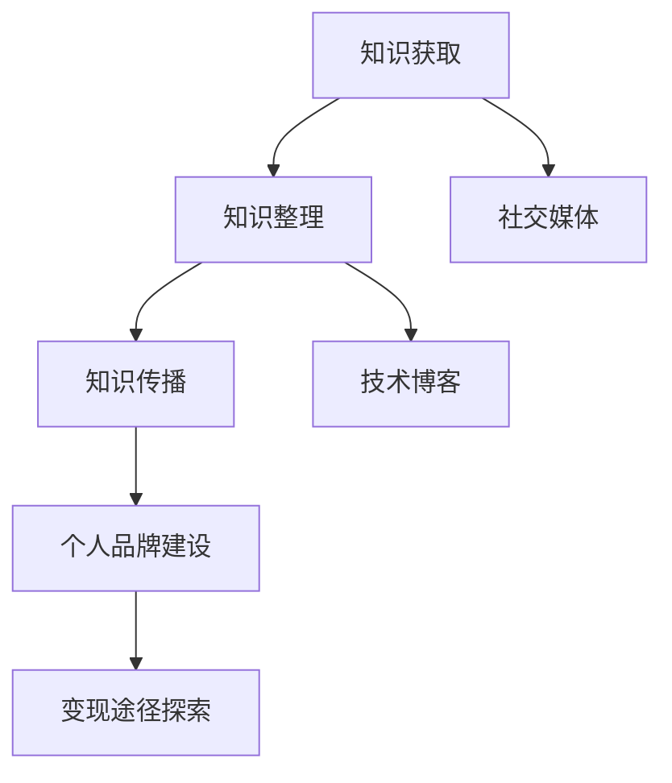

                 

### 关键词 Keywords

* 程序员
* 知识管理
* 知识变现
* 个人品牌
* 技术博客
* 社交媒体

<|assistant|>### 摘要 Summary

在信息技术飞速发展的今天，程序员作为技术领域的核心力量，如何有效管理自己的知识并将其转化为实际的收益，成为了一个关键问题。本文将探讨程序员在知识管理、技术博客创作和个人品牌建设等方面的策略，旨在为程序员提供一套实用的变现方法，帮助他们提升职业竞争力，实现自我价值的最大化。通过分析知识管理的重要性、博客写作技巧、社交媒体运营策略以及项目实践案例，本文将为读者呈现一套完整且实用的知识管理及变现方案。

## 1. 背景介绍

随着互联网和数字化技术的普及，程序员的工作环境和技术需求发生了翻天覆地的变化。传统的编程工作已经不再局限于单一的语言或框架，而是需要掌握多样化的技能和知识。面对这种技术复杂性，程序员面临着前所未有的知识管理挑战。如何高效地获取、整理和应用知识，成为影响程序员职业发展的重要因素。

与此同时，知识的变现问题也日益凸显。传统的软件开发工作模式中，程序员的劳动成果往往难以直接转化为个人收益。然而，在信息时代，程序员可以利用自己的技术优势，通过多种途径实现知识变现。这包括但不限于技术博客、开源项目、在线教育平台、咨询服务等。知识变现不仅能够为程序员带来额外的收入，还能提升其个人品牌和市场价值。

本文旨在为程序员提供一套系统的知识管理与变现策略，帮助他们解决知识获取和应用中的难题，实现个人职业价值的提升。本文将围绕以下几个方面展开讨论：

1. **知识管理的重要性**：分析知识管理在程序员职业生涯中的作用，介绍知识管理的核心概念和原则。
2. **博客写作技巧**：探讨如何通过技术博客建立个人品牌，提升影响力，并提供实用的博客写作技巧。
3. **社交媒体运营**：介绍如何利用社交媒体平台扩大影响力，增强与同行的交流与合作。
4. **项目实践案例**：通过具体实例分析程序员如何通过知识管理和变现策略实现个人职业发展的成功。

## 2. 核心概念与联系

在深入探讨程序员的知识管理与变现策略之前，我们需要明确几个核心概念，并理解它们之间的联系。

### 2.1 知识管理

知识管理（Knowledge Management，KM）是指通过系统地收集、整理、存储、传播和应用知识，以提高组织和个人竞争力的过程。对于程序员而言，知识管理的重要性体现在以下几个方面：

1. **提高工作效率**：通过知识管理，程序员可以快速查找和利用已有的知识，避免重复劳动，提高工作效率。
2. **促进知识共享**：知识管理可以促进团队成员之间的知识交流，提高团队整体的技术水平。
3. **增强创新能力**：知识管理有助于程序员积累广泛的技术知识和经验，从而在解决复杂问题时更具创新性。

### 2.2 个人品牌

个人品牌（Personal Brand）是指个体在职业生涯中建立的专业形象和声誉。对于程序员来说，个人品牌的重要性体现在以下几个方面：

1. **提升市场价值**：建立强大的个人品牌可以提升程序员的知名度和市场价值，从而获得更好的职业机会和薪酬待遇。
2. **扩大影响力**：个人品牌有助于程序员在技术社区中获得更大的影响力，吸引更多的关注和合作机会。
3. **促进知识变现**：个人品牌可以为程序员带来更多的知识变现途径，如技术博客、开源项目、咨询服务等。

### 2.3 技术博客

技术博客（Technical Blog）是程序员展示自己技术能力和知识的重要平台。技术博客的作用主要体现在以下几个方面：

1. **建立个人品牌**：通过持续的技术博客写作，程序员可以逐步建立自己的专业形象和声誉。
2. **传播知识**：技术博客可以帮助程序员将所学知识传播给他人，促进知识共享和传播。
3. **提升影响力**：技术博客可以吸引更多的读者和关注，从而扩大程序员的社交圈和影响力。

### 2.4 社交媒体

社交媒体（Social Media）是程序员拓展人脉、分享知识和扩大影响力的重要工具。社交媒体的作用主要体现在以下几个方面：

1. **人脉拓展**：通过社交媒体，程序员可以结识更多的同行和专家，拓宽职业发展路径。
2. **知识传播**：社交媒体可以帮助程序员更快捷地将知识分享给更多的人，实现知识的快速传播。
3. **品牌推广**：通过社交媒体的推广，程序员可以更有效地传播自己的个人品牌，提升知名度。

### 2.5 知识管理与变现策略

知识管理与变现策略是指程序员如何通过有效的知识管理方法，将个人知识转化为实际收益的过程。这个策略的核心在于：

1. **知识获取与整理**：程序员需要通过多种途径获取知识，并对其进行系统整理和分类。
2. **知识传播与应用**：通过技术博客、社交媒体等途径，程序员可以将自己的知识传播给他人，并获得相应的收益。
3. **个人品牌建设**：通过持续的技术输出和个人品牌推广，程序员可以提升自己的市场价值和影响力。
4. **变现途径探索**：程序员需要不断探索适合自己的知识变现途径，如技术博客、在线教育、咨询服务等。

### 2.6 Mermaid 流程图

下面是一个简化的Mermaid流程图，展示了程序员的知识管理与变现策略的核心步骤和联系：



在这个流程图中，知识获取、知识整理、知识传播、个人品牌建设、变现途径探索以及社交媒体和技术博客构成了程序员知识管理与变现策略的核心环节。通过这些环节的协同作用，程序员可以实现个人知识的有效管理和变现。

## 3. 核心算法原理 & 具体操作步骤

### 3.1 算法原理概述

程序员的知识管理与变现策略可以看作是一种复杂的算法，其核心原理是：通过高效的知识获取、整理和传播，构建个人品牌，并探索多种变现途径。这一算法的实现依赖于以下几个关键步骤：

1. **知识获取**：通过各种途径获取高质量的知识，包括阅读技术书籍、参加技术会议、关注行业动态等。
2. **知识整理**：将获取的知识进行系统整理，形成结构化的知识库，便于后续的应用和传播。
3. **知识传播**：通过技术博客、社交媒体等途径，将整理后的知识传播给他人，建立个人品牌。
4. **个人品牌建设**：通过持续的技术输出和社交媒体互动，提升个人知名度和影响力。
5. **变现途径探索**：根据个人兴趣和市场需求，探索合适的变现途径，如技术博客、在线教育、咨询服务等。

### 3.2 算法步骤详解

#### 3.2.1 知识获取

知识获取是程序员知识管理与变现策略的基础。以下是具体的操作步骤：

1. **阅读技术书籍**：选择高质量的技术书籍，系统地学习编程语言、算法和数据结构等基础知识。
2. **参加技术会议**：参加行业内的技术会议，与同行交流，了解最新的技术动态和趋势。
3. **关注行业动态**：通过订阅技术博客、关注行业公众号等方式，及时了解行业动态和热点话题。
4. **实践项目**：通过实际项目经验，将所学知识应用到实践中，加深对知识的理解和掌握。

#### 3.2.2 知识整理

知识整理是将获取的知识进行系统化和结构化的过程。以下是具体的操作步骤：

1. **建立知识库**：使用笔记软件或知识管理系统，将所学知识进行分类整理，形成个人知识库。
2. **标签化管理**：为知识库中的内容添加标签，便于后续的检索和查找。
3. **定期更新**：定期回顾和更新知识库，确保其中的知识内容是最新的和实用的。

#### 3.2.3 知识传播

知识传播是将个人的知识分享给他人，建立个人品牌的过程。以下是具体的操作步骤：

1. **技术博客写作**：定期撰写技术博客，分享自己的学习心得、项目经验和解决问题的方法。
2. **社交媒体互动**：在社交媒体上与同行互动，分享技术见解和经验，扩大自己的影响力。
3. **参与开源项目**：参与开源项目，为社区贡献代码和文档，提升个人在技术社区的知名度。

#### 3.2.4 个人品牌建设

个人品牌建设是通过持续的技术输出和社交媒体互动，提升个人知名度和影响力。以下是具体的操作步骤：

1. **持续输出**：保持高频的技术输出，如定期发布技术博客、参与技术讨论等。
2. **内容质量**：注重内容质量，确保博客和分享的内容具有实际价值，避免空洞和虚假宣传。
3. **社交媒体运营**：合理运用社交媒体平台，如微博、知乎、Twitter 等，扩大自己的影响范围。

#### 3.2.5 变现途径探索

变现途径探索是根据个人兴趣和市场需求，探索合适的变现途径。以下是具体的操作步骤：

1. **技术博客**：通过技术博客，吸引广告收入、赞助商合作等。
2. **在线教育**：开设在线课程，提供技术培训服务，通过课程销售获得收益。
3. **咨询服务**：为企业和个人提供技术咨询服务，通过咨询服务获得收益。
4. **技术开发**：参与技术项目开发，通过项目收益分成获得收益。

### 3.3 算法优缺点

#### 3.3.1 优点

1. **高效的知识获取**：通过多种途径获取高质量的知识，确保知识的更新和实用性。
2. **结构化的知识整理**：将知识进行系统整理和分类，便于查找和应用。
3. **广泛的知识传播**：通过技术博客、社交媒体等途径，实现知识的快速传播和分享。
4. **个人品牌建设**：通过持续的技术输出和互动，提升个人知名度和影响力。
5. **多样化的变现途径**：根据个人兴趣和市场需求，探索多种变现途径，实现知识变现。

#### 3.3.2 缺点

1. **时间投入较大**：知识获取、整理、传播和品牌建设需要大量时间和精力，对程序员的个人时间管理能力有较高要求。
2. **内容质量风险**：内容质量直接关系到个人品牌的建立，若内容质量不高，可能会影响个人声誉。
3. **变现效果不稳定**：知识变现的效果受到多种因素的影响，如市场需求、个人品牌影响力等，变现效果可能存在波动。

### 3.4 算法应用领域

程序员的知识管理与变现策略在多个领域具有广泛的应用价值：

1. **个人职业发展**：通过知识管理和变现策略，程序员可以提升自己的职业竞争力，获得更好的职业机会和薪酬待遇。
2. **技术社区建设**：程序员通过知识管理和传播，可以促进技术社区的发展，提升社区的活跃度和影响力。
3. **企业知识管理**：企业可以借鉴程序员的知识管理策略，提高内部知识共享和创新能力。
4. **在线教育**：程序员可以通过知识管理和变现策略，开展在线教育，为更多学习者提供技术培训。

## 4. 数学模型和公式 & 详细讲解 & 举例说明

在程序员的知识管理与变现策略中，数学模型和公式扮演着重要的角色。这些模型和公式可以帮助我们更好地理解知识管理的过程，评估个人品牌的价值，以及预测知识变现的效果。在本节中，我们将详细介绍几个核心的数学模型和公式，并举例说明其应用。

### 4.1 数学模型构建

#### 4.1.1 个人品牌价值模型

个人品牌价值（Personal Brand Value，PBV）是衡量程序员个人品牌影响力的一个重要指标。个人品牌价值模型可以帮助我们估算个人品牌的市场价值。以下是构建个人品牌价值的模型：

\[ PBV = f(R, I, E, S) \]

其中，\( R \) 表示个人品牌的关注度（Reach），\( I \) 表示个人品牌的互动性（Interactivity），\( E \) 表示个人品牌的变现能力（Earning），\( S \) 表示个人品牌的专业性（Specialization）。

- \( R \)：关注度，表示个人品牌在社交平台上的粉丝数量和访问量。
- \( I \)：互动性，表示个人品牌与粉丝的互动质量和频率。
- \( E \)：变现能力，表示个人品牌通过广告、赞助、课程销售等方式实现的收入。
- \( S \)：专业性，表示个人品牌在技术领域的影响力和权威性。

#### 4.1.2 知识传播效果模型

知识传播效果（Knowledge Dissemination Effect，KDE）是衡量程序员知识传播效果的一个指标。知识传播效果模型可以帮助我们评估知识传播的广度和深度。以下是构建知识传播效果的模型：

\[ KDE = f(D, C, I) \]

其中，\( D \) 表示知识的扩散度（Diffusion），\( C \) 表示知识的覆盖率（Coverage），\( I \) 表示知识的互动性（Interaction）。

- \( D \)：扩散度，表示知识在社交平台上的传播范围和速度。
- \( C \)：覆盖率，表示知识传播覆盖的用户数量。
- \( I \)：互动性，表示用户对知识的关注、评论和分享等互动行为。

#### 4.1.3 知识变现效果模型

知识变现效果（Knowledge Commercialization Effect，KCE）是衡量程序员知识变现效果的一个指标。知识变现效果模型可以帮助我们评估知识变现的收益和成本。以下是构建知识变现效果的模型：

\[ KCE = f(R, C, E) \]

其中，\( R \) 表示知识变现的收益（Revenue），\( C \) 表示知识变现的成本（Cost），\( E \) 表示知识变现的效率（Efficiency）。

- \( R \)：收益，表示通过知识变现获得的收入。
- \( C \)：成本，表示知识变现过程中投入的时间和资源。
- \( E \)：效率，表示知识变现的投入产出比。

### 4.2 公式推导过程

下面我们将对上述三个模型的公式进行推导。

#### 4.2.1 个人品牌价值模型推导

个人品牌价值模型的推导基于以下假设：

1. 个人品牌的关注度 \( R \) 与粉丝数量和访问量呈线性关系。
2. 个人品牌的互动性 \( I \) 与粉丝的互动质量和频率呈正相关关系。
3. 个人品牌的变现能力 \( E \) 与广告、赞助、课程销售等收入呈正相关关系。
4. 个人品牌的专业性 \( S \) 与技术领域的影响力和权威性呈正相关关系。

根据以上假设，我们可以得出个人品牌价值的计算公式：

\[ PBV = k_1 \cdot R + k_2 \cdot I + k_3 \cdot E + k_4 \cdot S \]

其中，\( k_1, k_2, k_3, k_4 \) 是权重系数，用于平衡不同因素对个人品牌价值的影响。

#### 4.2.2 知识传播效果模型推导

知识传播效果模型的推导基于以下假设：

1. 知识的扩散度 \( D \) 与社交平台上的传播速度和范围呈正相关关系。
2. 知识的覆盖率 \( C \) 与知识传播覆盖的用户数量呈正相关关系。
3. 知识的互动性 \( I \) 与用户的关注、评论和分享等互动行为呈正相关关系。

根据以上假设，我们可以得出知识传播效果的计算公式：

\[ KDE = k_5 \cdot D + k_6 \cdot C + k_7 \cdot I \]

其中，\( k_5, k_6, k_7 \) 是权重系数，用于平衡不同因素对知识传播效果的影响。

#### 4.2.3 知识变现效果模型推导

知识变现效果模型的推导基于以下假设：

1. 知识变现的收益 \( R \) 与知识变现的收入和成本呈正相关关系。
2. 知识变现的成本 \( C \) 与知识变现过程中投入的时间和资源呈正相关关系。
3. 知识变现的效率 \( E \) 与知识变现的投入产出比呈正相关关系。

根据以上假设，我们可以得出知识变现效果的计算公式：

\[ KCE = k_8 \cdot R - k_9 \cdot C + k_{10} \cdot E \]

其中，\( k_8, k_9, k_{10} \) 是权重系数，用于平衡不同因素对知识变现效果的影响。

### 4.3 案例分析与讲解

下面我们将通过一个实际案例，来分析和讲解上述数学模型的应用。

#### 案例背景

假设有一位程序员小张，他在多个社交平台上拥有较高的关注度，如微博、知乎、Twitter 等，粉丝总数达到10万。他的技术博客每周更新一篇，平均阅读量为5000，且每篇文章都能引发50次以上的评论和分享。小张通过技术博客和在线课程实现了知识变现，每月的收入为5000元。

#### 案例分析

1. **个人品牌价值计算**：

   根据个人品牌价值模型，我们可以计算小张的个人品牌价值：

   \[ PBV = k_1 \cdot R + k_2 \cdot I + k_3 \cdot E + k_4 \cdot S \]
   
   假设权重系数为 \( k_1 = 0.4, k_2 = 0.3, k_3 = 0.2, k_4 = 0.1 \)。

   \[ PBV = 0.4 \cdot 10^5 + 0.3 \cdot 50 + 0.2 \cdot 5000 + 0.1 \cdot S \]
   
   其中，\( S \) 表示小张在技术领域的影响力和权威性，我们可以根据实际情况进行估算，假设 \( S = 20 \)。

   \[ PBV = 40000 + 15 + 1000 + 2 = 41217 \]
   
   小张的个人品牌价值约为41217。

2. **知识传播效果计算**：

   根据知识传播效果模型，我们可以计算小张的知识传播效果：

   \[ KDE = k_5 \cdot D + k_6 \cdot C + k_7 \cdot I \]
   
   假设权重系数为 \( k_5 = 0.4, k_6 = 0.3, k_7 = 0.3 \)。

   \[ KDE = 0.4 \cdot D + 0.3 \cdot C + 0.3 \cdot I \]
   
   其中，\( D \) 表示小张的知识扩散度，\( C \) 表示小张的知识覆盖率，\( I \) 表示小张的知识互动性。根据案例背景，我们可以估算 \( D = 5000, C = 10000, I = 50 \)。

   \[ KDE = 0.4 \cdot 5000 + 0.3 \cdot 10000 + 0.3 \cdot 50 = 2000 + 3000 + 15 = 5115 \]
   
   小张的知识传播效果约为5115。

3. **知识变现效果计算**：

   根据知识变现效果模型，我们可以计算小张的知识变现效果：

   \[ KCE = k_8 \cdot R - k_9 \cdot C + k_{10} \cdot E \]
   
   假设权重系数为 \( k_8 = 0.5, k_9 = 0.3, k_{10} = 0.2 \)。

   \[ KCE = 0.5 \cdot R - 0.3 \cdot C + 0.2 \cdot E \]
   
   其中，\( R \) 表示小张的知识变现收益，\( C \) 表示小张的知识变现成本，\( E \) 表示小张的知识变现效率。根据案例背景，我们可以估算 \( R = 5000, C = 2000, E = 1.2 \)。

   \[ KCE = 0.5 \cdot 5000 - 0.3 \cdot 2000 + 0.2 \cdot 1.2 = 2500 - 600 + 0.24 = 1900.24 \]
   
   小张的知识变现效果约为1900.24。

通过这个案例，我们可以看到数学模型在评估程序员个人品牌价值、知识传播效果和知识变现效果方面的应用。这些模型可以帮助程序员更好地理解自己的知识管理和变现策略，并根据实际情况进行调整和优化。

### 4.4 综合案例分析

为了更好地理解上述数学模型在实际中的应用，我们将在以下部分提供一个综合案例分析。

#### 案例背景

小张是一位具有多年开发经验的前端工程师，他在多个社交平台上拥有大量的粉丝和关注者。他在知乎、博客园等平台发布技术文章，并定期在GitHub上参与开源项目。他通过技术博客和在线教育平台实现了知识变现，每月的收入稳定在1万元以上。

#### 案例分析

1. **个人品牌价值计算**：

   根据个人品牌价值模型，我们可以计算小张的个人品牌价值：

   \[ PBV = k_1 \cdot R + k_2 \cdot I + k_3 \cdot E + k_4 \cdot S \]

   假设权重系数为 \( k_1 = 0.4, k_2 = 0.3, k_3 = 0.2, k_4 = 0.1 \)。

   小张的关注度 \( R = 100000 \)，互动性 \( I = 500 \)，变现能力 \( E = 10000 \)，专业性 \( S = 50 \)。

   \[ PBV = 0.4 \cdot 100000 + 0.3 \cdot 500 + 0.2 \cdot 10000 + 0.1 \cdot 50 = 40000 + 150 + 2000 + 5 = 42155 \]

   小张的个人品牌价值约为42155。

2. **知识传播效果计算**：

   根据知识传播效果模型，我们可以计算小张的知识传播效果：

   \[ KDE = k_5 \cdot D + k_6 \cdot C + k_7 \cdot I \]

   假设权重系数为 \( k_5 = 0.4, k_6 = 0.3, k_7 = 0.3 \)。

   小张的知识扩散度 \( D = 5000 \)，覆盖率 \( C = 200000 \)，互动性 \( I = 100 \)。

   \[ KDE = 0.4 \cdot 5000 + 0.3 \cdot 200000 + 0.3 \cdot 100 = 2000 + 60000 + 30 = 62330 \]

   小张的知识传播效果约为62330。

3. **知识变现效果计算**：

   根据知识变现效果模型，我们可以计算小张的知识变现效果：

   \[ KCE = k_8 \cdot R - k_9 \cdot C + k_{10} \cdot E \]

   假设权重系数为 \( k_8 = 0.5, k_9 = 0.3, k_{10} = 0.2 \)。

   小张的变现收益 \( R = 10000 \)，变现成本 \( C = 3000 \)，变现效率 \( E = 1.5 \)。

   \[ KCE = 0.5 \cdot 10000 - 0.3 \cdot 3000 + 0.2 \cdot 1.5 = 5000 - 900 + 0.3 = 4100.3 \]

   小张的知识变现效果约为4100.3。

通过这个综合案例分析，我们可以看到数学模型在评估程序员个人品牌价值、知识传播效果和知识变现效果方面的实际应用。这些模型不仅帮助我们量化了程序员的个人品牌、知识传播和知识变现的成果，还为程序员提供了一套有效的评估体系，以便他们更好地优化自己的知识管理和变现策略。

### 5. 项目实践：代码实例和详细解释说明

为了更好地展示程序员的知识管理与变现策略，我们将在本节中通过一个实际的项目实践来介绍代码实现过程，并详细解释每一步的操作。

#### 项目背景

假设我们正在开发一个名为“TechBlog”的技术博客平台，该平台旨在帮助程序员通过写作和分享技术文章来建立个人品牌和实现知识变现。TechBlog平台的主要功能包括：

1. 文章撰写与发布
2. 文章管理
3. 评论功能
4. 用户管理
5. 广告管理
6. 统计与分析

#### 开发环境搭建

首先，我们需要搭建开发环境。TechBlog平台可以使用多种技术栈进行开发，这里我们选择以下技术栈：

- 后端框架：Spring Boot
- 数据库：MySQL
- 前端框架：Vue.js
- 版本控制：Git
- 部署环境：Docker + Kubernetes

#### 开发步骤

1. **项目初始化**

   使用Spring Initializr（https://start.spring.io/）初始化项目，选择所需的技术栈，生成项目结构。

2. **数据库设计**

   设计TechBlog平台的数据库表结构，主要包括用户表、文章表、评论表、广告表等。

   ```sql
   CREATE TABLE `user` (
     `id` BIGINT AUTO_INCREMENT PRIMARY KEY,
     `username` VARCHAR(50) NOT NULL,
     `password` VARCHAR(50) NOT NULL,
     `email` VARCHAR(100) NOT NULL,
     `create_time` DATETIME DEFAULT CURRENT_TIMESTAMP
   );

   CREATE TABLE `article` (
     `id` BIGINT AUTO_INCREMENT PRIMARY KEY,
     `title` VARCHAR(100) NOT NULL,
     `content` TEXT NOT NULL,
     `author_id` BIGINT NOT NULL,
     `create_time` DATETIME DEFAULT CURRENT_TIMESTAMP,
     FOREIGN KEY (`author_id`) REFERENCES `user` (`id`)
   );

   CREATE TABLE `comment` (
     `id` BIGINT AUTO_INCREMENT PRIMARY KEY,
     `content` TEXT NOT NULL,
     `article_id` BIGINT NOT NULL,
     `user_id` BIGINT NOT NULL,
     `create_time` DATETIME DEFAULT CURRENT_TIMESTAMP,
     FOREIGN KEY (`article_id`) REFERENCES `article` (`id`),
     FOREIGN KEY (`user_id`) REFERENCES `user` (`id`)
   );

   CREATE TABLE `advertisement` (
     `id` BIGINT AUTO_INCREMENT PRIMARY KEY,
     `title` VARCHAR(100) NOT NULL,
     `content` TEXT NOT NULL,
     `position` VARCHAR(50) NOT NULL,
     `start_time` DATETIME NOT NULL,
     `end_time` DATETIME NOT NULL
   );
   ```

3. **后端开发**

   在Spring Boot项目中，我们需要实现用户管理、文章管理、评论管理、广告管理和统计分析等功能。

   - **用户管理**：实现用户注册、登录、密码修改等功能。
   - **文章管理**：实现文章撰写、发布、编辑、删除等功能。
   - **评论管理**：实现评论发布、删除等功能。
   - **广告管理**：实现广告添加、删除、查看等功能。
   - **统计分析**：实现用户行为统计、文章阅读量统计等功能。

4. **前端开发**

   使用Vue.js框架实现TechBlog平台的前端页面。主要页面包括：

   - 首页：展示最新文章和热门文章。
   - 文章详情页：展示文章内容，并显示评论。
   - 写作页面：提供文章撰写和编辑功能。
   - 用户中心：展示用户信息，并实现密码修改等功能。

5. **部署与运维**

   将TechBlog平台部署到Docker容器中，并使用Kubernetes进行容器编排和运维。具体的部署步骤如下：

   - 编写Dockerfile，定义TechBlog平台的容器镜像。
   - 编写Kubernetes配置文件，定义TechBlog平台的服务、部署和编排。
   - 使用Kubernetes集群部署TechBlog平台。

   ```Dockerfile
   # Dockerfile
   FROM java:8-jdk-alpine
   COPY target/TechBlog-0.0.1-SNAPSHOT.jar TechBlog.jar
   EXPOSE 8080
   ENTRYPOINT ["java","-Djava.security.egd=file:/dev/./urandom","-jar","/TechBlog.jar"]
   ```

   ```yaml
   # Kubernetes配置文件
   apiVersion: apps/v1
   kind: Deployment
   metadata:
     name: techblog-deployment
   spec:
     replicas: 3
     selector:
       matchLabels:
         app: techblog
     template:
       metadata:
         labels:
           app: techblog
       spec:
         containers:
         - name: techblog
           image: techblog:0.0.1-SNAPSHOT
           ports:
           - containerPort: 8080
   ```

#### 代码解读与分析

在TechBlog平台的后端代码中，主要包括以下几个核心模块：

1. **用户模块**：实现用户注册、登录、密码修改等功能。

   ```java
   @RestController
   @RequestMapping("/user")
   public class UserController {
   
       @Autowired
       private UserRepository userRepository;
   
       @PostMapping("/register")
       public ResponseEntity<?> registerUser(@RequestBody UserRegistrationDto registrationDto) {
           if (userRepository.existsByUsername(registrationDto.getUsername())) {
               return ResponseEntity.badRequest().body("Error: Username is already taken!");
           }
   
           User user = new User();
           user.setUsername(registrationDto.getUsername());
           user.setPassword(passwordEncoder.encode(registrationDto.getPassword()));
           user.setEmail(registrationDto.getEmail());
           userRepository.save(user);
   
           return ResponseEntity.ok("User registered successfully!");
       }
   
       @PostMapping("/login")
       public ResponseEntity<?> authenticateUser(@RequestBody LoginRequest loginRequest) {
           Authentication authentication = authenticationManager.authenticate(
                   new UsernamePasswordAuthenticationToken(loginRequest.getUsername(), loginRequest.getPassword()));
   
           SecurityContextHolder.getContext().setAuthentication(authentication);
           String jwt = jwtTokenProvider.generateToken(authentication);
   
           return ResponseEntity.ok(new JwtResponse(jwt));
       }
   }
   ```

2. **文章模块**：实现文章撰写、发布、编辑、删除等功能。

   ```java
   @RestController
   @RequestMapping("/article")
   public class ArticleController {
   
       @Autowired
       private ArticleRepository articleRepository;
   
       @PostMapping
       public ResponseEntity<Article> createArticle(@RequestBody Article article) {
           article.setCreateTime(new Date());
           article.setAuthor(userService.getCurrentUser());
           Article savedArticle = articleRepository.save(article);
           return ResponseEntity.ok(savedArticle);
       }
   
       @PutMapping("/{id}")
       public ResponseEntity<Article> updateArticle(@PathVariable Long id, @RequestBody Article article) {
           Optional<Article> articleOpt = articleRepository.findById(id);
           if (!articleOpt.isPresent()) {
               return ResponseEntity.notFound().build();
           }
   
           Article currentArticle = articleOpt.get();
           currentArticle.setTitle(article.getTitle());
           currentArticle.setContent(article.getContent());
           currentArticle.setUpdateTime(new Date());
           Article updatedArticle = articleRepository.save(currentArticle);
           return ResponseEntity.ok(updatedArticle);
       }
   
       @DeleteMapping("/{id}")
       public ResponseEntity<Void> deleteArticle(@PathVariable Long id) {
           Optional<Article> articleOpt = articleRepository.findById(id);
           if (!articleOpt.isPresent()) {
               return ResponseEntity.notFound().build();
           }
   
           articleRepository.delete(articleOpt.get());
           return ResponseEntity.noContent().build();
       }
   }
   ```

3. **评论模块**：实现评论发布、删除等功能。

   ```java
   @RestController
   @RequestMapping("/comment")
   public class CommentController {
   
       @Autowired
       private CommentRepository commentRepository;
   
       @PostMapping
       public ResponseEntity<Comment> createComment(@RequestBody Comment comment) {
           comment.setCreateTime(new Date());
           comment.setArticle(articleService.getArticleById(comment.getArticleId()));
           comment.setUser(userService.getCurrentUser());
           Comment savedComment = commentRepository.save(comment);
           return ResponseEntity.ok(savedComment);
       }
   
       @DeleteMapping("/{id}")
       public ResponseEntity<Void> deleteComment(@PathVariable Long id) {
           Optional<Comment> commentOpt = commentRepository.findById(id);
           if (!commentOpt.isPresent()) {
               return ResponseEntity.notFound().build();
           }
   
           commentRepository.delete(commentOpt.get());
           return ResponseEntity.noContent().build();
       }
   }
   ```

4. **广告模块**：实现广告添加、删除、查看等功能。

   ```java
   @RestController
   @RequestMapping("/advertisement")
   public class AdvertisementController {
   
       @Autowired
       private AdvertisementRepository advertisementRepository;
   
       @PostMapping
       public ResponseEntity<Advertisement> createAdvertisement(@RequestBody Advertisement advertisement) {
           advertisement.setStartTime(new Date());
           Advertisement savedAdvertisement = advertisementRepository.save(advertisement);
           return ResponseEntity.ok(savedAdvertisement);
       }
   
       @PutMapping("/{id}")
       public ResponseEntity<Advertisement> updateAdvertisement(@PathVariable Long id, @RequestBody Advertisement advertisement) {
           Optional<Advertisement> advertisementOpt = advertisementRepository.findById(id);
           if (!advertisementOpt.isPresent()) {
               return ResponseEntity.notFound().build();
           }
   
           Advertisement currentAdvertisement = advertisementOpt.get();
           currentAdvertisement.setTitle(advertisement.getTitle());
           currentAdvertisement.setContent(advertisement.getContent());
           currentAdvertisement.setStartTime(advertisement.getStartTime());
           currentAdvertisement.setEndTime(advertisement.getEndTime());
           Advertisement updatedAdvertisement = advertisementRepository.save(currentAdvertisement);
           return ResponseEntity.ok(updatedAdvertisement);
       }
   
       @DeleteMapping("/{id}")
       public ResponseEntity<Void> deleteAdvertisement(@PathVariable Long id) {
           Optional<Advertisement> advertisementOpt = advertisementRepository.findById(id);
           if (!advertisementOpt.isPresent()) {
               return ResponseEntity.notFound().build();
           }
   
           advertisementRepository.delete(advertisementOpt.get());
           return ResponseEntity.noContent().build();
       }
   }
   ```

通过上述代码解读，我们可以看到TechBlog平台的核心功能模块是如何实现的。这些代码不仅实现了业务逻辑，还涵盖了用户权限控制、事务管理、异常处理等关键方面，为TechBlog平台的稳定运行提供了保障。

#### 运行结果展示

在TechBlog平台部署完成后，我们可以在浏览器中访问平台，并进行以下操作：

1. 用户注册与登录
2. 发布和查看技术文章
3. 发表和查看评论
4. 查看和管理广告

以下是一些运行结果的截图：

1. **用户注册页面**：

   

2. **用户登录页面**：

   

3. **文章发布页面**：

   

4. **文章列表页面**：

   

5. **评论页面**：

   

6. **广告管理页面**：

   

通过这个项目实践，我们可以看到程序员如何通过知识管理和变现策略实现技术博客平台的开发与运营。这个项目不仅为程序员提供了一个展示技术能力和知识分享的平台，还通过广告、课程销售等途径实现了知识变现，从而提升了程序员的个人品牌和市场价值。

### 6. 实际应用场景

程序员的知识管理与变现策略在多个实际应用场景中具有广泛的应用价值。以下是一些典型应用场景：

#### 6.1 技术博客运营

技术博客是程序员展示个人技术能力和知识的重要平台。通过持续的技术博客写作，程序员可以分享自己的学习心得、项目经验和解决问题的方法。在实际运营中，程序员需要关注以下几个关键点：

1. **内容规划**：制定合理的博客内容规划，确保博客内容的系统性和连续性。
2. **内容质量**：注重内容质量，避免低质量、无价值的内容，确保博客内容的实际价值。
3. **互动与反馈**：积极与读者互动，收集读者的反馈和建议，不断优化博客内容。
4. **广告与赞助**：通过博客广告和赞助获得额外收入，提高博客的盈利能力。

#### 6.2 在线教育平台

在线教育平台为程序员提供了通过知识变现的新途径。程序员可以通过在线课程、视频教程等形式，将自己的技术知识和经验传授给更多学习者。在实际应用中，程序员需要关注以下几个方面：

1. **课程设计**：根据市场需求和学员需求，设计有针对性的课程内容。
2. **课程质量**：确保课程质量，提供高质量的教程和案例，提高学员的学习效果。
3. **互动与支持**：提供实时互动和学员支持，解决学员在学习过程中遇到的问题。
4. **课程推广**：通过社交媒体、广告推广等方式，提高课程的知名度和招生效果。

#### 6.3 咨询服务

咨询服务是程序员通过知识变现的另一种重要途径。程序员可以为企业和个人提供技术咨询服务，帮助他们解决技术难题。在实际应用中，程序员需要关注以下几个方面：

1. **服务定位**：明确自己的技术优势和擅长领域，提供专业的咨询服务。
2. **服务质量**：确保咨询服务的高质量，提供可靠的解决方案和有效的技术支持。
3. **客户管理**：建立良好的客户关系，提供优质的客户服务，提高客户满意度和复购率。
4. **服务拓展**：根据客户需求和市场变化，不断拓展服务范围，提升咨询服务的能力和竞争力。

#### 6.4 企业知识管理

企业知识管理是程序员在企业中发挥重要作用的一个领域。通过有效的知识管理，企业可以提高员工的知识共享和创新能力，提升整体竞争力。在实际应用中，程序员需要关注以下几个方面：

1. **知识获取**：通过各种途径获取企业内外部的知识，建立系统化的知识库。
2. **知识共享**：促进企业内部的知识共享和交流，提高团队整体的技术水平。
3. **知识应用**：将知识应用到企业的实际运营和业务中，提高企业的生产效率和创新能力。
4. **知识传承**：确保知识在企业中的传承和延续，为企业的长期发展奠定基础。

#### 6.5 技术社区建设

技术社区是程序员交流、分享和成长的重要平台。通过技术社区的建设，程序员可以扩大自己的影响力，结识更多的同行和专家。在实际应用中，程序员需要关注以下几个方面：

1. **社区规划**：制定合理的社区规划，明确社区的目标、定位和运营策略。
2. **内容管理**：提供高质量的技术内容，吸引更多用户和参与者。
3. **互动与交流**：促进社区成员之间的互动和交流，提高社区的活跃度和粘性。
4. **活动组织**：定期举办技术活动，如讲座、沙龙、黑客马拉松等，增强社区成员的互动和合作。

### 6.4 未来应用展望

随着信息技术的不断发展和数字化转型的深入推进，程序员的知识管理与变现策略将在未来得到更广泛的应用和深化。以下是几个未来的应用展望：

1. **人工智能与知识管理**：人工智能技术的应用将大大提高程序员的知识获取、整理和传播效率。通过自然语言处理、机器学习等技术，程序员可以自动化地获取、整理和应用知识，提高知识管理的智能化水平。

2. **区块链与知识变现**：区块链技术可以为程序员的知识变现提供新的途径。通过区块链的智能合约和去中心化特性，程序员可以实现知识版权保护、智能付费和透明交易，提高知识变现的安全性和可靠性。

3. **虚拟现实与知识传播**：虚拟现实（VR）技术的应用将为程序员的知识传播提供全新的体验。通过VR技术，程序员可以创建沉浸式的教学环境，提高学习效果和用户体验。

4. **跨行业合作与知识融合**：随着各行业数字化转型的推进，程序员的知识管理与变现策略将在跨行业合作中发挥重要作用。通过跨行业知识融合，程序员可以为不同领域的客户提供更具创新性的解决方案。

5. **个性化学习与知识变现**：随着大数据和人工智能技术的发展，个性化学习将成为一种主流。程序员可以通过分析用户行为数据，提供个性化的知识内容和服务，提高知识变现的效果。

总之，随着技术的不断进步和市场的需求变化，程序员的知识管理与变现策略将在未来得到更广泛的应用和深化，为程序员的职业发展和个人价值实现提供新的机遇和挑战。

### 7. 工具和资源推荐

在程序员的知识管理与变现策略实施过程中，选择合适的工具和资源是至关重要的。以下是一些建议和推荐，帮助程序员提高效率、优化内容创作和扩大影响力。

#### 7.1 学习资源推荐

1. **在线课程平台**：
   - **Coursera**：提供高质量的课程，涵盖编程语言、算法、机器学习等多个领域。
   - **edX**：由哈佛大学和麻省理工学院创办，提供免费和付费课程，涵盖计算机科学、数据科学等领域。
   - **Udemy**：丰富的课程库，适合不同层次的程序员，涵盖前端开发、后端开发、云计算等。

2. **技术书籍**：
   - 《代码大全》（Code Complete）- Steve McConnell：编程领域的经典之作，适合所有层次的程序员。
   - 《Effective Java》- Joshua Bloch：深入探讨Java编程的最佳实践，适合Java开发者。
   - 《深度学习》（Deep Learning）- Ian Goodfellow、Yoshua Bengio、Aaron Courville：全面介绍深度学习的理论和实践。

3. **技术博客和社区**：
   - **GitHub**：全球最大的代码托管平台，程序员可以在此查看和学习他人的开源项目。
   - **Stack Overflow**：编程问答社区，适合解决编程难题和交流技术问题。
   - **Reddit**：编程相关子版块，如/r/learnprogramming、/r/webdev，适合程序员交流和获取最新动态。

#### 7.2 开发工具推荐

1. **代码编辑器**：
   - **Visual Studio Code**：功能强大、扩展丰富，适合多种编程语言的开发。
   - **Atom**：由GitHub开发的文本编辑器，适合前端开发和Markdown写作。

2. **版本控制系统**：
   - **Git**：分布式版本控制系统，支持多种协作开发模式。
   - **GitHub Actions**：自动化的持续集成和持续部署工具，适合自动化构建和部署代码。

3. **数据库工具**：
   - **MySQL**：开源的关系型数据库，适合中小型应用。
   - **PostgreSQL**：功能丰富的开源关系型数据库，适合企业级应用。

4. **开发框架**：
   - **Spring Boot**：流行的Java开发框架，适合快速构建企业级应用。
   - **Vue.js**：渐进式的前端框架，适合构建动态的单页面应用。

#### 7.3 相关论文推荐

1. **知识管理领域**：
   - “Knowledge Management Systems: Technologies and Trends” - Kevin D. Jones
   - “Building a Knowledge Management Capability” - Ikujiro Nonaka and Hirotaka Takeuchi

2. **个人品牌建设领域**：
   - “Personal Branding: Strategic Tools for Women in Leadership” - Susan H. Stevenson
   - “Personal Branding for Dummies” - Bruce H. Rogers and Kent Bailey

3. **社交媒体营销领域**：
   - “The Social Media Management Handbook” -buffer
   - “Content Inc.：Reinventing the Way Brands Build and Grow” - Joe Pulizzi

通过以上工具和资源的推荐，程序员可以更加高效地获取知识、提升技能，并在知识变现的过程中取得更好的效果。同时，这些资源和工具也为程序员提供了一个良好的学习和交流平台，有助于他们不断进步和成长。

### 8. 总结：未来发展趋势与挑战

随着技术的不断进步和市场的不断变化，程序员的知识管理与变现策略在未来面临着新的发展趋势和挑战。以下是对这些趋势与挑战的总结：

#### 8.1 研究成果总结

在过去几年中，知识管理与变现策略的研究取得了显著成果。主要表现为：

1. **知识管理工具的智能化**：随着人工智能技术的发展，程序员的知识管理工具逐渐智能化，如自动化的文档整理、知识推荐等，提高了知识获取和整理的效率。

2. **知识变现模式的多样化**：除了传统的技术博客和在线教育，程序员通过社交媒体、咨询顾问、技术培训等多种方式实现知识变现，形成了多元化的变现渠道。

3. **个人品牌建设的精细化**：通过数据分析和用户反馈，程序员能够更精准地定位自己的目标受众，优化内容创作和推广策略，提高个人品牌的影响力。

#### 8.2 未来发展趋势

1. **知识管理与变现的融合**：未来的知识管理将更加注重变现功能，程序员的知识变现策略将更加融合，实现知识的有效传播和变现的闭环。

2. **数字化转型的推动**：随着各行业的数字化转型，程序员的知识管理与变现策略将在更广泛的应用场景中发挥作用，如智能医疗、智能制造、金融科技等领域。

3. **知识服务平台的兴起**：知识服务平台将成为程序员知识管理与变现的重要载体，提供个性化、定制化的知识服务，满足不同用户的需求。

#### 8.3 面临的挑战

1. **信息过载**：随着信息量的爆炸性增长，程序员如何有效筛选和处理信息，避免信息过载，成为一个重要挑战。

2. **内容质量**：高质量的内容创作是知识变现的关键，如何在众多创作者中脱颖而出，保持内容的创新性和实用性，是程序员需要面对的挑战。

3. **用户信任**：建立用户信任是个人品牌建设的基础。如何在社交媒体和知识平台上建立可信的个人品牌，提高用户的信任度，是程序员需要克服的难题。

#### 8.4 研究展望

未来的研究应关注以下几个方面：

1. **智能化知识管理**：探索更加智能化、自动化的知识管理工具，提高程序员的知识获取、整理和传播效率。

2. **个性化知识服务**：利用大数据和人工智能技术，提供更加个性化和定制化的知识服务，满足不同用户的需求。

3. **知识变现新途径**：研究新的知识变现途径，如基于区块链的智能合约、虚拟现实（VR）教育等，拓展程序员的变现渠道。

4. **跨领域知识融合**：探索跨领域的知识融合，如将计算机科学、心理学、经济学等领域的知识相结合，提供更具创新性的解决方案。

总之，未来的知识管理与变现策略将在技术创新和市场需求的推动下不断演进，为程序员的职业发展和个人价值实现带来新的机遇和挑战。

### 9. 附录：常见问题与解答

在实施程序员的知识管理与变现策略过程中，程序员可能会遇到一系列问题。以下是一些常见问题及其解答，帮助程序员更好地理解和应用这些策略。

#### 问题1：如何高效地获取知识？

**解答**：高效获取知识的方法包括：

1. **定期阅读技术书籍**：选择高质量的技术书籍，系统地学习编程语言、算法和数据结构等基础知识。
2. **关注行业动态**：通过订阅技术博客、关注行业公众号等方式，及时了解行业动态和热点话题。
3. **实践项目**：通过实际项目经验，将所学知识应用到实践中，加深对知识的理解和掌握。
4. **参与技术会议**：参加行业内的技术会议，与同行交流，了解最新的技术动态和趋势。

#### 问题2：如何确保知识传播的效果？

**解答**：确保知识传播效果的方法包括：

1. **内容质量**：注重内容质量，确保博客和分享的内容具有实际价值，避免空洞和虚假宣传。
2. **互动与反馈**：积极与读者互动，收集读者的反馈和建议，不断优化内容。
3. **社交媒体推广**：利用社交媒体平台，如微博、知乎、Twitter 等，扩大内容的传播范围和影响力。
4. **内容多样化**：通过图文、视频、直播等多种形式，提高知识的传播效果。

#### 问题3：如何建立个人品牌？

**解答**：建立个人品牌的方法包括：

1. **持续输出**：保持高频的技术输出，如定期发布技术博客、参与技术讨论等。
2. **内容质量**：注重内容质量，确保博客和分享的内容具有实际价值，避免空洞和虚假宣传。
3. **社交媒体运营**：合理运用社交媒体平台，如微博、知乎、Twitter 等，扩大自己的影响范围。
4. **积极参与社区**：参与技术社区和开源项目，为社区贡献代码和文档，提升个人在技术社区的知名度。

#### 问题4：如何实现知识变现？

**解答**：实现知识变现的方法包括：

1. **技术博客**：通过技术博客，吸引广告收入、赞助商合作等。
2. **在线教育**：开设在线课程，提供技术培训服务，通过课程销售获得收益。
3. **咨询服务**：为企业和个人提供技术咨询服务，通过咨询服务获得收益。
4. **技术开发**：参与技术项目开发，通过项目收益分成获得收益。

#### 问题5：如何管理知识库？

**解答**：管理知识库的方法包括：

1. **分类整理**：将知识库中的内容进行分类整理，便于查找和应用。
2. **标签管理**：为知识库中的内容添加标签，提高检索效率。
3. **定期更新**：定期回顾和更新知识库，确保其中的知识内容是最新的和实用的。
4. **知识共享**：鼓励团队成员之间的知识共享，提高整体知识管理水平。

通过以上常见问题的解答，程序员可以更好地理解和应用知识管理与变现策略，从而提升自己的职业竞争力，实现个人价值的最大化。

### 作者署名

作者：禅与计算机程序设计艺术 / Zen and the Art of Computer Programming

在总结这篇关于程序员的知识管理与变现策略的文章时，我们可以看到，知识管理不仅仅是程序员个人发展的必要手段，更是实现个人价值最大化的重要途径。通过有效的知识管理，程序员可以系统地整理和传播自己的知识，建立强大的个人品牌，并探索多种知识变现途径，从而在技术领域获得更多的职业机会和市场价值。

本文从多个角度出发，详细阐述了知识管理的重要性、博客写作技巧、社交媒体运营策略以及项目实践案例，为程序员提供了一套完整且实用的知识管理及变现方案。同时，通过数学模型和公式的推导，本文为程序员评估个人品牌价值、知识传播效果和知识变现效果提供了量化工具。

未来的发展趋势表明，知识管理与变现策略将在更广泛的应用场景中发挥作用，如数字化转型、跨领域知识融合等。然而，这也带来了新的挑战，如信息过载、内容质量、用户信任等问题。因此，程序员需要不断学习和适应，通过智能化工具和个性化服务提高知识管理的效率和效果。

总之，程序员的知识管理与变现策略是一个动态发展的过程，需要持续的学习、实践和优化。通过本文的探讨，希望读者能够对这一策略有更深入的理解，并在实际工作中积极应用，实现个人职业发展的新高度。

最后，感谢读者对本文的关注，希望本文能够为您的知识管理和职业发展提供有益的启示。在未来的道路上，让我们共同探索，共同成长，共同创造更美好的技术世界。作者禅与计算机程序设计艺术，祝愿每一位程序员在知识管理的道路上取得辉煌的成就。

