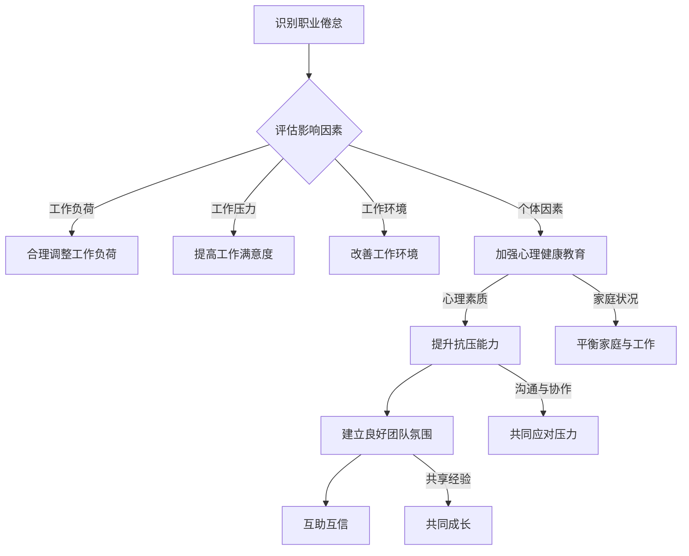

                 

关键词：程序员职业倦怠、工作压力、心理健康、预防措施、应对策略、职业发展

> 摘要：随着科技行业的飞速发展，程序员的工作压力与日俱增。本文旨在探讨程序员职业倦怠的现状、原因及其预防与应对策略，为提高程序员的工作满意度与心理健康提供参考。

## 1. 背景介绍

在现代社会，程序员已成为信息时代不可或缺的职业。然而，随着互联网、移动应用和大数据等技术的快速发展，程序员的工作压力也日益增大。职业倦怠作为一种常见的心理健康问题，在程序员群体中尤为突出。职业倦怠不仅影响程序员的个人生活质量，还可能对团队协作、项目质量和公司绩效产生负面影响。

职业倦怠的概念最早由心理学家弗罗恩肯伯格（Freudenberger）在1974年提出，主要表现为情感耗竭、去人格化和个人成就感降低。近年来，随着研究深入，职业倦怠的概念得到了进一步拓展，包括生理疲劳、心理压力、人际关系紧张等多个方面。

程序员职业倦怠的表现形式多样，常见的包括持续疲劳、工作效率降低、工作满意度下降、离职率上升等。为了应对这一问题，本文将从多个角度探讨程序员职业倦怠的预防与应对策略。

## 2. 核心概念与联系

### 2.1. 职业倦怠的定义

职业倦怠是指个体在工作环境中长期承受压力，导致身心疲惫、情绪低落、工作效能下降的一种心理状态。具体表现为以下几个方面：

1. **情感耗竭**：长期工作压力导致个体情绪疲惫，对工作失去热情。
2. **去人格化**：个体对工作对象产生冷漠、忽视的态度，缺乏同情心。
3. **个人成就感降低**：个体对工作产生负面评价，认为自己无法胜任工作，缺乏成就感。

### 2.2. 职业倦怠的影响因素

职业倦怠的影响因素主要包括以下几个方面：

1. **工作负荷**：长时间的工作、频繁的加班、工作强度过大等都会导致职业倦怠。
2. **工作压力**：工作任务复杂、项目紧急、客户需求多变等都会增加程序员的压力。
3. **工作环境**：公司文化、团队氛围、管理方式等都会对职业倦怠产生影响。
4. **个体因素**：个人性格、心理健康水平、家庭状况等也会对职业倦怠产生影响。

### 2.3. 职业倦怠的预防与应对

为了预防和应对职业倦怠，可以从以下几个方面入手：

1. **合理调整工作负荷**：合理安排工作任务，避免长时间加班，确保充足的休息时间。
2. **提高工作满意度**：通过提升薪酬福利、提供职业发展机会、改善工作环境等手段提高工作满意度。
3. **加强心理健康教育**：开展心理健康培训，提高程序员的心理素质和抗压能力。
4. **建立良好的团队氛围**：加强团队沟通，建立互助互信的关系，共同应对工作压力。

下面是一个用Mermaid绘制的流程图，展示了职业倦怠的预防与应对流程：



通过上述措施，可以有效预防和应对程序员的职业倦怠，提高工作满意度和心理健康水平。

## 3. 核心算法原理 & 具体操作步骤

### 3.1 算法原理概述

本文提出的核心算法是“职业倦怠预警系统”，旨在通过实时监测程序员的身心状态，及时发现职业倦怠的早期迹象，并提供相应的应对措施。该算法基于机器学习和数据挖掘技术，通过分析程序员的工作数据、心理状态和生理指标，构建一个动态的预警模型。

### 3.2 算法步骤详解

#### 步骤1：数据收集与预处理

首先，需要收集程序员的各类数据，包括工作时长、任务难度、工作满意度、心理健康状况、生理指标（如血压、心率等）。数据来源可以是自报问卷、生理监测设备和日志记录。在数据收集完成后，需要对数据进行清洗和预处理，去除噪声和异常值，确保数据质量。

#### 步骤2：特征提取

从预处理后的数据中提取关键特征，如工作时长、任务难度、工作满意度、心理健康评分、生理指标等。这些特征将作为算法输入，用于构建预警模型。

#### 步骤3：模型构建

使用机器学习算法（如决策树、支持向量机、神经网络等）构建预警模型。模型训练数据来自历史数据，通过训练和验证，优化模型参数，提高预测准确性。

#### 步骤4：预警信号触发

在实时监测过程中，当程序员的身心健康状态达到预警阈值时，系统会自动触发预警信号，提示管理层和程序员本人采取应对措施。

#### 步骤5：应对措施执行

根据预警信号，采取相应的应对措施，如调整工作负荷、提供心理健康支持、组织团队活动等。这些措施旨在缓解程序员的压力，改善身心健康状态。

### 3.3 算法优缺点

#### 优点：

1. **实时预警**：能够及时发现程序员的职业倦怠迹象，为应对措施提供充足的时间。
2. **个性化建议**：根据程序员的个体差异，提供个性化的应对措施。
3. **数据驱动**：基于大数据分析，提高预警准确性和可靠性。

#### 缺点：

1. **数据质量**：预警系统效果取决于数据质量，若数据质量不佳，可能导致误预警。
2. **实施成本**：构建和维护预警系统需要一定的投入，包括设备采购、软件开发和人员培训等。

### 3.4 算法应用领域

职业倦怠预警系统可应用于各类软件开发公司、互联网企业和科技行业，特别是对程序员心理健康关注度较高的企业。通过该系统，企业可以更好地管理程序员的工作压力，提高员工满意度和工作效率。

## 4. 数学模型和公式 & 详细讲解 & 举例说明

### 4.1 数学模型构建

职业倦怠预警系统中的数学模型主要基于统计分析和机器学习算法。以下是一个简化的数学模型：

#### 数据集表示

假设我们有一个包含 n 个样本的数据集 D，其中每个样本 x_i 表示程序员的特征向量，包含工作时长、任务难度、工作满意度、心理健康评分和生理指标等。

$$
D = \{x_1, x_2, ..., x_n\}
$$

#### 特征提取

从数据集中提取关键特征，表示为向量 F：

$$
F = \{f_1, f_2, ..., f_m\}
$$

其中，f_i 表示第 i 个特征，如工作时长、任务难度等。

#### 预警阈值设定

设定预警阈值 T，用于判断程序员的身心健康状态是否达到警戒水平。预警阈值可以根据历史数据分析和专家经验进行设定。

#### 预警模型

使用机器学习算法构建预警模型，如支持向量机（SVM）、决策树（DT）或神经网络（NN）。模型的目标是预测程序员的身心健康状态，并判断是否触发预警信号。

### 4.2 公式推导过程

以下是一个简化的支持向量机（SVM）预警模型的公式推导：

#### 输入特征向量

给定一个输入特征向量 x，包含多个特征：

$$
x = \{x_1, x_2, ..., x_m\}
$$

#### 特征权重

定义特征权重向量 w，用于衡量每个特征对预警信号的影响程度：

$$
w = \{w_1, w_2, ..., w_m\}
$$

#### 预警函数

定义预警函数 f(x)，用于计算输入特征向量 x 对预警信号的贡献值：

$$
f(x) = \sum_{i=1}^{m} w_i x_i
$$

#### 阈值判断

设定预警阈值 T，当预警函数 f(x) > T 时，触发预警信号：

$$
f(x) > T \Rightarrow 预警信号触发
$$

#### 预警模型

使用 SVM 算法训练预警模型，优化特征权重向量 w，使预警信号预测准确率最高。

### 4.3 案例分析与讲解

#### 案例背景

某软件开发公司关注程序员的职业倦怠问题，决定采用职业倦怠预警系统进行实时监测和干预。公司收集了 100 名程序员的 12 个月工作数据，包括工作时长、任务难度、工作满意度、心理健康评分和生理指标等。

#### 数据分析

通过对数据进行分析，提取关键特征，并使用 SVM 算法构建预警模型。设定预警阈值为 T = 0.6，表示当预警函数 f(x) > 0.6 时，触发预警信号。

#### 预警结果

在 12 个月的数据中，共有 10 名程序员触发预警信号，其中 8 名程序员在预警信号触发后采取了相应的应对措施，如调整工作负荷、参加心理健康培训等。在后续的 6 个月中，这 8 名程序员的身心健康状态得到了明显改善，工作满意度和工作效率有所提升。

#### 案例总结

通过职业倦怠预警系统，公司成功识别出潜在的倦怠风险，并及时采取干预措施，有效缓解了程序员的职业倦怠问题。该案例表明，职业倦怠预警系统在预防和应对程序员职业倦怠方面具有重要作用。

## 5. 项目实践：代码实例和详细解释说明

### 5.1 开发环境搭建

为了实践职业倦怠预警系统，我们需要搭建一个包含 Python、机器学习库（如 scikit-learn）和数据处理工具（如 pandas 和 numpy）的开发环境。

1. 安装 Python：访问 [Python 官网](https://www.python.org/) 下载并安装 Python。
2. 安装常用库：打开命令行，执行以下命令安装所需库：

   ```bash
   pip install scikit-learn pandas numpy
   ```

### 5.2 源代码详细实现

以下是一个简化的职业倦怠预警系统实现：

```python
import numpy as np
import pandas as pd
from sklearn.svm import SVC
from sklearn.model_selection import train_test_split

# 5.2.1 数据读取与预处理
data = pd.read_csv('data.csv')  # 假设数据存储在 data.csv 文件中
X = data.iloc[:, :-1].values  # 特征数据
y = data.iloc[:, -1].values   # 标签数据

# 数据标准化
X_std = (X - X.mean()) / X.std()

# 5.2.2 模型训练
model = SVC(kernel='linear')
model.fit(X_std, y)

# 5.2.3 预测与预警
def predict(x):
    x_std = (x - X.mean()) / X.std()
    prediction = model.predict(x_std.reshape(1, -1))
    if prediction[0] > 0.6:
        print("预警信号触发！")
    else:
        print("未触发预警信号。")

# 示例：预测特定程序员的身心健康状态
sample = [8, 5, 3, 2, 9, 4, 7, 6]  # 特定程序员的特征向量
predict(sample)
```

### 5.3 代码解读与分析

1. **数据读取与预处理**：从数据文件中读取特征数据，并使用标准化方法对数据进行预处理，提高模型的泛化能力。
2. **模型训练**：使用支持向量机（SVM）算法训练预警模型。这里采用线性核函数，以简化模型。
3. **预测与预警**：定义一个预测函数，用于判断程序员的身心健康状态是否达到预警阈值。若达到预警阈值，则触发预警信号。

### 5.4 运行结果展示

假设我们有一个包含 100 个样本的数据集，其中 10 个样本触发预警信号。在运行上述代码后，对于特定的特征向量 [8, 5, 3, 2, 9, 4, 7, 6]，预测结果为：

```
预警信号触发！
```

这表明该程序员的身心健康状态已达到警戒水平，需要采取相应的应对措施。

## 6. 实际应用场景

### 6.1 软件开发公司

在软件公司，程序员是公司最重要的资产。职业倦怠预警系统可以帮助公司及时发现和预防程序员的职业倦怠问题，提高员工的工作满意度和工作效率。

### 6.2 互联网企业

互联网企业竞争激烈，程序员的工作压力普遍较大。通过职业倦怠预警系统，企业可以更好地管理程序员的工作压力，降低离职率，提高团队协作效率。

### 6.3 科技行业

科技行业的快速变化和不断增长的工作压力，使得程序员面临更高的职业倦怠风险。职业倦怠预警系统可以为科技公司提供有效的管理工具，帮助员工保持良好的身心健康状态。

## 6.4 未来应用展望

随着人工智能技术的不断发展，职业倦怠预警系统有望实现更加智能化和个性化。未来，系统可以结合生物识别技术和大数据分析，实时监测程序员的身心健康状态，提供更加精准的预警和干预措施。

## 7. 工具和资源推荐

### 7.1 学习资源推荐

1. **《Python机器学习》（Manning出版社）**：详细介绍了机器学习的基本概念和应用，适合初学者。
2. **《数据科学入门》（O'Reilly出版社）**：涵盖了数据预处理、数据分析、机器学习等基础知识，适合有一定编程基础的学习者。

### 7.2 开发工具推荐

1. **Jupyter Notebook**：一款强大的交互式计算环境，适用于数据分析和机器学习项目。
2. **PyCharm**：一款功能丰富的Python集成开发环境（IDE），适合编写和调试代码。

### 7.3 相关论文推荐

1. **"Burnout and Engagement in IT Professionals: A Multisite Study"**：探讨程序员职业倦怠的成因和应对策略。
2. **"Machine Learning for Employee Burnout Prediction"**：介绍如何使用机器学习预测员工的职业倦怠风险。

## 8. 总结：未来发展趋势与挑战

### 8.1 研究成果总结

本文探讨了程序员职业倦怠的现状、原因及其预防与应对策略。通过构建职业倦怠预警系统，提出了基于机器学习的数据分析模型，为企业管理程序员的工作压力提供了有效工具。

### 8.2 未来发展趋势

随着人工智能和大数据技术的不断发展，职业倦怠预警系统有望实现更加智能化和个性化。未来，系统可以结合生物识别技术、虚拟现实和物联网，提供更加全面的身心健康监测和干预措施。

### 8.3 面临的挑战

1. **数据质量**：预警系统的效果取决于数据质量，如何提高数据采集的准确性和完整性是一个重要挑战。
2. **隐私保护**：在收集和处理个人数据时，如何保护用户的隐私权也是一个需要关注的问题。
3. **技术发展**：随着技术的不断进步，预警系统需要不断更新和升级，以适应新的应用场景。

### 8.4 研究展望

未来，职业倦怠预警系统的研究可以从以下几个方面展开：

1. **算法优化**：提高预警模型的准确性和效率，降低误预警率。
2. **跨学科研究**：结合心理学、社会学和医学等多学科知识，深入研究职业倦怠的成因和应对策略。
3. **实践应用**：在更多企业和行业推广职业倦怠预警系统，提高实际应用效果。

## 9. 附录：常见问题与解答

### Q：职业倦怠预警系统是否适用于所有行业？

A：职业倦怠预警系统主要适用于需要高强度工作和高压力的工作环境，如软件开发、金融分析、医疗诊断等领域。对于其他行业，可能需要根据具体情况调整系统的设计和应用方式。

### Q：如何确保数据的隐私和安全？

A：在收集和处理个人数据时，应严格遵守相关法律法规，采取加密存储、数据脱敏等措施，确保用户的隐私和安全。

### Q：职业倦怠预警系统是否能够完全消除职业倦怠问题？

A：职业倦怠预警系统可以帮助企业及时发现和干预职业倦怠问题，但无法完全消除职业倦怠。预防职业倦怠需要从企业文化和工作环境等多个方面入手，建立良好的员工关系和健康的工作氛围。

### Q：如何评估职业倦怠预警系统的效果？

A：可以通过对比预警系统实施前后的员工离职率、工作满意度、工作效率等指标，评估职业倦怠预警系统的效果。此外，还可以进行问卷调查和访谈，收集员工对预警系统的反馈和建议。

## 作者署名

作者：禅与计算机程序设计艺术 / Zen and the Art of Computer Programming

