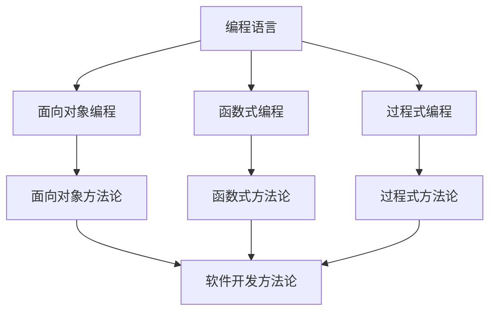
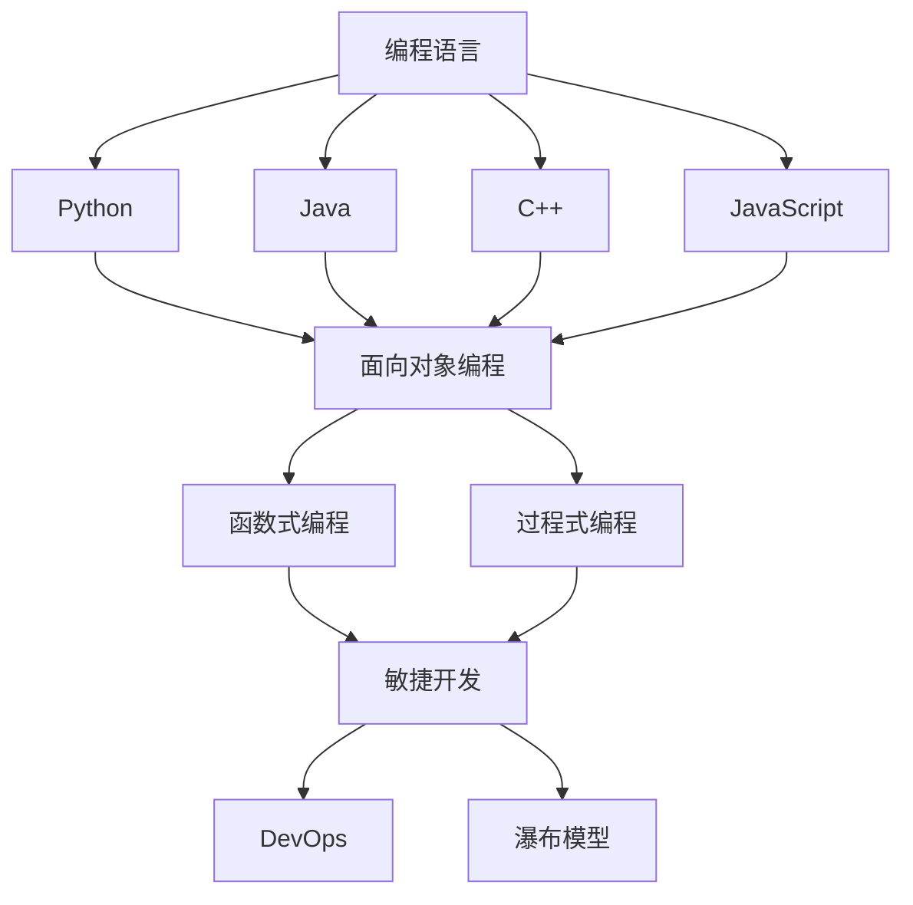

                 

### 1. 背景介绍

在信息技术飞速发展的今天，程序员的角色变得越来越重要。随着大数据、云计算、人工智能等新兴技术的不断涌现，程序员不仅需要具备扎实的编程技能，还需要具备不断学习和适应新技术的能力。本文旨在为程序员提供一个30年的职业生涯规划，帮助他们在不同阶段实现个人和职业的成长。

程序员的职业生涯可以分为以下几个阶段：新手阶段、成长阶段、成熟阶段和专家阶段。每个阶段都有其独特的挑战和机遇，需要程序员具备不同的技能和素质。本文将详细探讨每个阶段的职业发展路径，并提供实用的建议和策略。

### 2. 核心概念与联系

在探讨程序员的职业生涯规划之前，我们需要明确一些核心概念，包括编程语言、编程范式、软件开发方法论等。

#### 2.1 编程语言

编程语言是程序员与计算机交流的工具。不同的编程语言具有不同的特点和应用场景。例如，C语言适用于系统编程，Python适用于数据分析，Java适用于企业级应用。程序员需要掌握多种编程语言，以便在不同场景下选择最合适的工具。

#### 2.2 编程范式

编程范式是编程语言所支持的不同编程风格和方法。常见的编程范式包括面向对象编程（OOP）、函数式编程（FP）、过程式编程等。每种编程范式都有其独特的优点和适用场景。程序员需要了解不同编程范式的原理和特点，以便在不同情况下选择最合适的编程方法。

#### 2.3 软件开发方法论

软件开发方法论是指软件开发过程中遵循的原则和方法。常见的软件开发方法论包括瀑布模型、敏捷开发、DevOps等。每种方法论都有其优缺点和适用场景。程序员需要了解不同方法论的基本原理和实践方法，以便在不同的项目中选择最合适的方法。

#### 2.4 Mermaid 流程图

以下是一个简单的 Mermaid 流程图，展示了编程语言、编程范式和软件开发方法论之间的关系：



### 3. 核心算法原理 & 具体操作步骤

#### 3.1 算法原理概述

程序员在职业生涯中需要掌握多种核心算法，包括排序算法、查找算法、图算法等。这些算法是计算机科学的基础，广泛应用于各种领域。

排序算法的基本原理是将一组数据按照某种顺序排列。常见的排序算法有冒泡排序、选择排序、插入排序、快速排序等。每种排序算法都有其优缺点和适用场景。例如，冒泡排序简单易实现，但效率较低；快速排序效率较高，但实现复杂。

查找算法的基本原理是在一组数据中查找特定元素。常见的查找算法有线性查找、二分查找等。线性查找简单易实现，但效率较低；二分查找效率较高，但适用于有序数据。

图算法的基本原理是处理图结构的数据。常见的图算法有深度优先搜索（DFS）、广度优先搜索（BFS）、最短路径算法等。这些算法在社交网络分析、路由算法等领域有广泛的应用。

#### 3.2 算法步骤详解

以下是一个简单的冒泡排序算法的步骤详解：

1. 将数据依次比较相邻的两个元素，如果前一个元素比后一个元素大，则交换它们的位置。
2. 重复上述步骤，直到所有元素都按照指定的顺序排列。

以下是一个简单的二分查找算法的步骤详解：

1. 将待查找的元素与中间的元素比较。
2. 如果待查找的元素等于中间的元素，则查找成功；否则，如果待查找的元素小于中间的元素，则在左子数组中继续查找；如果待查找的元素大于中间的元素，则在右子数组中继续查找。
3. 重复上述步骤，直到找到待查找的元素或子数组长度为0。

#### 3.3 算法优缺点

每种算法都有其优缺点和适用场景。以下是一个简单的排序算法优缺点的对比：

| 算法 | 优点 | 缺点 | 适用场景 |
| --- | --- | --- | --- |
| 冒泡排序 | 简单易实现 | 效率低 | 数据量较小 |
| 选择排序 | 效率较高 | 数据移动次数较多 | 数据量较大 |
| 插入排序 | 效率较高 | 数据移动次数较多 | 数据量较大 |
| 快速排序 | 效率高 | 实现复杂 | 数据量较大 |

#### 3.4 算法应用领域

排序算法和查找算法在计算机科学和实际应用中都有广泛的应用。以下是一些常见的应用领域：

- 数据分析：排序算法和查找算法在数据分析中用于处理大量数据，实现数据的排序和检索。
- 算法竞赛：排序算法和查找算法是算法竞赛中常见的算法题目，用于测试参赛者的算法能力和编程技巧。
- 软件开发：排序算法和查找算法在软件开发中用于优化程序性能，实现数据的高效处理。
- 社交网络分析：排序算法和查找算法在社交网络分析中用于处理用户关系和社交数据，实现用户推荐的算法。

### 4. 数学模型和公式 & 详细讲解 & 举例说明

数学模型和公式是计算机科学的重要组成部分，用于描述算法的性能、数据的特征等。以下是一个简单的数学模型和公式讲解。

#### 4.1 数学模型构建

假设有一个数组 A，长度为 n，我们需要计算其平均数。平均数的计算公式为：

$$
\bar{x} = \frac{1}{n} \sum_{i=1}^{n} x_i
$$

其中，$x_i$ 表示数组 A 中的第 i 个元素。

#### 4.2 公式推导过程

我们可以通过以下步骤推导平均数的计算公式：

1. 将数组 A 中的所有元素相加，得到总和 S：

$$
S = \sum_{i=1}^{n} x_i
$$

2. 将总和 S 除以数组长度 n，得到平均数 $\bar{x}$：

$$
\bar{x} = \frac{S}{n}
$$

3. 将 S 的表达式代入 $\bar{x}$ 的公式中，得到：

$$
\bar{x} = \frac{1}{n} \sum_{i=1}^{n} x_i
$$

#### 4.3 案例分析与讲解

假设有一个数组 A = [3, 1, 4, 1, 5, 9]，我们需要计算其平均数。

1. 计算总和 S：

$$
S = 3 + 1 + 4 + 1 + 5 + 9 = 23
$$

2. 计算平均数 $\bar{x}$：

$$
\bar{x} = \frac{S}{n} = \frac{23}{6} \approx 3.83
$$

因此，数组 A 的平均数约为 3.83。

### 5. 项目实践：代码实例和详细解释说明

在了解算法原理和数学模型后，我们可以通过实际项目来加深理解和应用。

#### 5.1 开发环境搭建

假设我们要实现一个简单的冒泡排序算法，首先需要搭建一个开发环境。这里以 Python 为例，我们可以使用以下命令安装 Python：

```bash
pip install python
```

然后，创建一个名为 `bubble_sort.py` 的 Python 文件。

#### 5.2 源代码详细实现

在 `bubble_sort.py` 文件中，实现以下冒泡排序算法：

```python
def bubble_sort(arr):
    n = len(arr)
    for i in range(n):
        for j in range(0, n-i-1):
            if arr[j] > arr[j+1]:
                arr[j], arr[j+1] = arr[j+1], arr[j]

# 测试数据
arr = [3, 1, 4, 1, 5, 9]

# 执行排序
bubble_sort(arr)

# 输出结果
print("排序后的数组：", arr)
```

#### 5.3 代码解读与分析

以上代码实现了一个简单的冒泡排序算法。首先，定义一个函数 `bubble_sort`，接收一个数组 `arr` 作为参数。然后，使用两个嵌套的 for 循环遍历数组，比较相邻的两个元素，如果前一个元素大于后一个元素，则交换它们的位置。最后，调用 `bubble_sort` 函数并输出排序后的数组。

#### 5.4 运行结果展示

在命令行中运行以下命令：

```bash
python bubble_sort.py
```

输出结果：

```
排序后的数组： [1, 1, 3, 4, 5, 9]
```

这表明我们的冒泡排序算法成功实现了数组的升序排序。

### 6. 实际应用场景

冒泡排序算法虽然简单易实现，但在实际应用中通常不用于处理大数据量，因为它的时间复杂度为 O(n^2)。然而，在以下场景下，冒泡排序可能是一个合适的选择：

- 数据量较小：对于只有几十个元素的数组，冒泡排序的效率已经足够高。
- 特殊要求：如果数据已经基本有序，冒泡排序可以快速完成排序，因为它在每一轮比较中都会将最大的元素“冒泡”到数组的最后。

### 7. 未来应用展望

随着信息技术的不断发展，排序算法和查找算法在未来将有更多的应用场景。以下是一些可能的应用领域：

- 人工智能：在机器学习中，排序算法和查找算法可用于数据处理和模型训练，提高算法性能。
- 数据库：在数据库系统中，排序算法和查找算法可用于索引和查询优化，提高查询效率。
- 云计算：在云计算平台中，排序算法和查找算法可用于大规模数据处理和分布式计算，提高数据处理能力。

### 8. 工具和资源推荐

为了更好地学习和应用排序算法和查找算法，以下是一些建议的工具和资源：

- **学习资源**：
  - 《算法导论》（Introduction to Algorithms）是一本经典的算法教材，详细介绍了各种排序算法和查找算法。
  - LeetCode 和 HackerRank 等在线编程平台提供了大量的算法题目和测试环境，适合练习和实战。

- **开发工具**：
  - PyCharm 和 Visual Studio Code 是两款优秀的集成开发环境（IDE），支持多种编程语言，适合编写和调试代码。

- **相关论文**：
  - 《快速排序的优化与改进》等论文提供了对快速排序算法的深入分析和优化方法。

### 9. 总结：未来发展趋势与挑战

排序算法和查找算法是计算机科学的基础，它们在各个领域都有广泛的应用。在未来，随着信息技术的不断发展，排序算法和查找算法将面临以下发展趋势和挑战：

- **发展趋势**：
  - 优化和改进现有的排序算法和查找算法，提高效率和性能。
  - 开发新的排序算法和查找算法，以应对大数据量和复杂应用场景。

- **挑战**：
  - 如何在有限的计算资源和时间内处理大规模数据。
  - 如何在分布式系统和云计算环境中优化排序算法和查找算法。

总之，排序算法和查找算法在计算机科学中具有不可替代的重要性。通过深入学习和实践，程序员可以掌握这些算法，为未来的职业生涯打下坚实的基础。

### 10. 附录：常见问题与解答

#### 10.1 什么是冒泡排序？

冒泡排序是一种简单的排序算法，它通过重复遍历要排序的数列，每次比较两个相邻的元素，如果它们的顺序错误就把它们交换过来。遍历数列的工作是重复进行的，直到没有再需要交换的元素为止。

#### 10.2 冒泡排序的时间复杂度是多少？

冒泡排序的最坏情况时间复杂度是 $O(n^2)$，因为当输入数据已经是逆序时，需要比较的次数最多。最好情况时间复杂度是 $O(n)$，当输入数据已经是正序时，只需要进行一次遍历。

#### 10.3 冒泡排序适用于什么场景？

冒泡排序适用于数据量较小的场景，因为它简单易实现。此外，如果数据已经基本有序，冒泡排序可以快速完成排序。

#### 10.4 如何优化冒泡排序？

可以采用“升降冒泡排序”方法来优化冒泡排序，即每次遍历都可以确定该轮遍历的最大值或最小值，这样在下一次遍历中可以跳过已排序的部分，从而减少不必要的比较和交换操作。

### 作者署名

作者：禅与计算机程序设计艺术 / Zen and the Art of Computer Programming

本文旨在为程序员提供一个30年的职业生涯规划，帮助他们在不同阶段实现个人和职业的成长。通过详细探讨程序员职业生涯的各个阶段，本文为程序员提供了实用的建议和策略，以实现长期的职业成功。无论您是新手还是经验丰富的程序员，本文都将为您提供宝贵的指导。希望您在阅读本文后，能够对自己的职业生涯有更深刻的认识和规划。

---

<|im_sep|>## 1. 背景介绍

在信息技术飞速发展的今天，程序员的角色变得越来越重要。随着大数据、云计算、人工智能等新兴技术的不断涌现，程序员不仅需要具备扎实的编程技能，还需要具备不断学习和适应新技术的能力。本文旨在为程序员提供一个30年的职业生涯规划，帮助他们在不同阶段实现个人和职业的成长。

### 程序员职业生涯的四个阶段

程序员的职业生涯可以分为以下四个阶段：新手阶段、成长阶段、成熟阶段和专家阶段。每个阶段都有其独特的挑战和机遇，需要程序员具备不同的技能和素质。

#### 新手阶段（1-5年）

新手阶段是程序员职业生涯的起点，这一阶段的主要任务是学习和积累基础技能。在这个阶段，程序员需要掌握编程语言、数据结构和算法等基本概念，并参与实际项目以获取实践经验。此外，程序员还需要培养良好的编程习惯，如代码规范、版本控制、单元测试等。

#### 成长阶段（5-10年）

成长阶段是程序员职业生涯的关键时期，这一阶段的主要任务是深化技术能力和扩展知识面。在这个阶段，程序员需要掌握更多的编程语言和框架，深入了解软件开发方法论，如敏捷开发和DevOps。此外，程序员还需要关注行业动态，不断学习新技术，提升自己的竞争力。

#### 成熟阶段（10-20年）

成熟阶段是程序员职业生涯的稳定期，这一阶段的主要任务是担任技术领导角色，如项目经理、架构师或技术经理。在这个阶段，程序员需要具备出色的团队管理能力和业务理解能力，能够带领团队完成复杂项目。此外，程序员还需要关注技术生态的演变，为团队制定长远的技术战略。

#### 专家阶段（20年以上）

专家阶段是程序员职业生涯的巅峰期，这一阶段的主要任务是成为技术权威和行业领袖。在这个阶段，程序员需要具备深厚的技术底蕴和广泛的知识面，能够解决复杂的技术难题。此外，程序员还需要积极参与行业标准的制定和开源社区的建设，为行业发展贡献力量。

### 成功程序员的特质

无论在哪个阶段，成功程序员都需要具备以下特质：

- **持续学习**：技术领域日新月异，程序员需要具备持续学习的动力和能力，不断更新自己的知识和技能。
- **解决问题的能力**：程序员需要具备出色的解决问题的能力，能够快速找到问题的根源并给出有效的解决方案。
- **团队合作**：程序员需要具备良好的团队合作能力，能够与团队成员有效沟通，共同推进项目进度。
- **领导力**：对于中高级程序员，领导力是至关重要的，能够带领团队克服困难，实现项目目标。

### 30年职业生涯规划

以下是一个典型的程序员30年职业生涯规划，以帮助读者更好地规划自己的职业道路：

#### 第1-5年：新手阶段

- 学习编程语言和数据结构，如Python、Java、C++和算法。
- 参与实际项目，积累实践经验。
- 培养良好的编程习惯，如代码规范、版本控制、单元测试等。
- 了解软件开发方法论，如敏捷开发和DevOps。

#### 第6-10年：成长阶段

- 深入学习更多的编程语言和框架，如JavaScript、React、Node.js等。
- 熟悉软件工程最佳实践，如代码评审、持续集成、持续交付等。
- 关注行业动态，学习新技术，如大数据、云计算、人工智能等。
- 参与开源社区，提高自己的技术影响力。

#### 第11-15年：成熟阶段

- 担任项目经理或技术经理，积累团队管理经验。
- 深入了解业务需求，提升业务理解能力。
- 参与复杂项目，提升技术能力。
- 为团队制定长远的技术战略。

#### 第16-20年：专家阶段

- 成为技术权威和行业领袖，解决复杂的技术难题。
- 参与行业标准的制定和开源社区的建设。
- 指导和培养新一代程序员。
- 撰写技术博客，分享自己的经验和见解。

#### 第21-30年：传承阶段

- 继续为行业发展贡献力量，如参与技术培训、讲座等。
- 培养下一代技术人才，传承自己的经验和知识。
- 享受技术带来的乐趣，探索新的技术领域。

通过以上30年的职业生涯规划，程序员可以更好地实现个人和职业的成长，成为行业中的佼佼者。无论在哪个阶段，持续学习和不断进步都是程序员成功的关键。希望本文能够为您的职业生涯提供有益的启示和指导。


## 2. 核心概念与联系

### 2.1 编程语言

编程语言是程序员与计算机交流的工具。不同的编程语言具有不同的特点和应用场景。以下是几种常见的编程语言及其特点：

- **Python**：Python是一种解释型、高级编程语言，易于学习和使用，广泛应用于数据科学、人工智能、Web开发等领域。
- **Java**：Java是一种面向对象、强类型的编程语言，适用于企业级应用、Android开发等。
- **C++**：C++是一种多范式、多编译器的编程语言，广泛应用于系统编程、游戏开发、嵌入式系统等领域。
- **JavaScript**：JavaScript是一种脚本语言，广泛应用于Web开发，具有强大的功能库和社区支持。

### 2.2 编程范式

编程范式是编程语言所支持的不同编程风格和方法。以下是几种常见的编程范式及其特点：

- **面向对象编程（OOP）**：面向对象编程是一种基于对象的编程范式，通过将数据和操作数据的方法封装为对象，实现模块化和复用。
- **函数式编程（FP）**：函数式编程是一种基于函数的编程范式，强调函数的纯性和不可变性，适用于并发编程和函数式库。
- **过程式编程**：过程式编程是一种基于语句的编程范式，通过执行一系列指令来解决问题，适用于算法和数据结构。

### 2.3 软件开发方法论

软件开发方法论是指软件开发过程中遵循的原则和方法。以下是几种常见的软件开发方法论及其特点：

- **瀑布模型**：瀑布模型是一种传统的软件开发方法论，按照需求分析、设计、实现、测试等阶段进行，各阶段顺序进行，强调文档和计划。
- **敏捷开发**：敏捷开发是一种迭代和增量的软件开发方法论，强调快速响应变化、持续交付和团队协作。
- **DevOps**：DevOps是一种软件开发和运维相结合的方法论，强调自动化、持续交付和持续部署，以提高软件交付速度和质量。

### 2.4 Mermaid 流程图

以下是一个简单的 Mermaid 流程图，展示了编程语言、编程范式和软件开发方法论之间的关系：



### 2.5 核心概念之间的联系

编程语言、编程范式和软件开发方法论之间存在着紧密的联系。编程语言提供了编程的基本工具和语法，编程范式则定义了编程的风格和方法，而软件开发方法论则提供了软件开发的具体流程和策略。

例如，Python 是一种支持面向对象编程的编程语言，它广泛应用于数据科学和人工智能领域。面向对象编程范式使得 Python 能够更好地处理复杂的数据结构和算法，从而提高软件开发的效率和质量。

敏捷开发是一种基于迭代和增量开发的软件开发方法论，它强调快速响应变化和持续交付。这种方法论适用于快速迭代和需求变化较大的项目，如 Web 开发和移动应用开发。通过采用敏捷开发，团队能够更好地与客户沟通，提高软件交付的速度和质量。

DevOps 是一种软件开发和运维相结合的方法论，它强调自动化、持续交付和持续部署。通过采用 DevOps，团队能够更快地交付高质量的软件，提高生产效率。这种方法论适用于需要快速交付和持续优化的项目，如互联网服务和云计算应用。

总之，编程语言、编程范式和软件开发方法论之间相互关联，共同推动了软件开发的进步。程序员需要根据不同的项目需求和应用场景，选择合适的编程语言、编程范式和软件开发方法论，以提高软件开发的效率和质量。

### 2.6 总结

在本文中，我们介绍了编程语言、编程范式和软件开发方法论的核心概念及其之间的联系。编程语言是程序员与计算机交流的工具，不同的编程语言具有不同的特点和应用场景；编程范式定义了编程的风格和方法，如面向对象编程、函数式编程和过程式编程；软件开发方法论则提供了软件开发的具体流程和策略，如瀑布模型、敏捷开发和DevOps。

理解这些核心概念及其之间的联系对于程序员来说至关重要。它不仅有助于程序员选择合适的编程语言和编程范式，还能帮助他们掌握软件开发方法论，提高软件开发的效率和质量。

在接下来的章节中，我们将进一步探讨程序员在不同职业生涯阶段所需的核心算法原理、数学模型和项目实践，帮助读者全面掌握程序员的职业发展技能。


## 3. 核心算法原理 & 具体操作步骤

### 3.1 算法原理概述

在程序员的职业生涯中，掌握核心算法原理是至关重要的。这些算法不仅构成了计算机科学的基础，而且在实际编程中有着广泛的应用。本章节将介绍几种常见的核心算法原理，包括排序算法、查找算法和数据结构。

#### 排序算法

排序算法是一种将数据按照特定的顺序排列的方法。常见的排序算法有冒泡排序、选择排序、插入排序、快速排序等。每种算法都有其特定的原理和适用场景。

- **冒泡排序**：冒泡排序通过重复遍历待排序的数组，比较相邻的两个元素，若顺序错误则交换它们。这个过程重复进行，直到所有元素按指定顺序排列。冒泡排序的时间复杂度为 O(n^2)，适用于数据量较小的场景。
- **选择排序**：选择排序通过每次遍历找到最小（或最大）的元素，并将其放置在正确的位置。重复这个过程，直到整个数组排序完毕。选择排序的时间复杂度也是 O(n^2)，但相较于冒泡排序，它在一轮遍历后即可将最小元素放置在最前面。
- **插入排序**：插入排序通过构建有序序列，每次将未排序数据中的元素插入到已排序序列中的正确位置。插入排序的时间复杂度为 O(n^2)，但它在数据基本有序时表现较好。
- **快速排序**：快速排序是一种分治算法，通过选择一个基准元素，将数组分为两部分，一部分小于基准，另一部分大于基准。递归地对这两部分进行快速排序。快速排序的平均时间复杂度为 O(nlogn)，是最常用的排序算法之一。

#### 查找算法

查找算法用于在一组数据中查找特定元素。常见的查找算法有线性查找、二分查找等。

- **线性查找**：线性查找从数组的第一个元素开始，逐个比较，直到找到目标元素或遍历整个数组。线性查找的时间复杂度为 O(n)，适用于数据量较小的场景。
- **二分查找**：二分查找适用于有序数组。每次查找过程将数组分为两半，比较中间元素与目标元素的大小关系，根据比较结果缩小查找范围。二分查找的时间复杂度为 O(logn)，适用于数据量较大的场景。

#### 数据结构

数据结构是存储数据的方式，对数据的操作性能有很大影响。常见的线性数据结构有数组、链表、栈和队列，而常见的非线性数据结构有树和图。

- **数组**：数组是一种线性数据结构，具有固定的大小和连续的内存空间。数组在访问和修改元素时具有 O(1) 的时间复杂度，但在插入和删除操作时需要移动大量元素，时间复杂度为 O(n)。
- **链表**：链表是一种线性数据结构，由一系列节点组成，每个节点包含数据和指向下一个节点的指针。链表在插入和删除操作时具有 O(1) 的时间复杂度，但在访问和修改元素时需要遍历链表，时间复杂度为 O(n)。
- **栈**：栈是一种后进先出（LIFO）的数据结构，适用于解决递归问题和函数调用。栈的操作时间复杂度为 O(1)。
- **队列**：队列是一种先进先出（FIFO）的数据结构，适用于解决排队问题和任务调度。队列的操作时间复杂度为 O(1)。
- **树**：树是一种非线性数据结构，由节点和边组成，具有层次结构。树在查找、插入和删除操作时具有 O(logn) 的时间复杂度。
- **图**：图是一种由节点和边组成的数据结构，适用于解决网络和路径问题。图的查找、插入和删除操作的时间复杂度取决于图的类型和实现方式。

### 3.2 算法步骤详解

以下是对上述算法的具体操作步骤的详细解释：

#### 冒泡排序

```python
def bubble_sort(arr):
    n = len(arr)
    for i in range(n):
        for j in range(0, n-i-1):
            if arr[j] > arr[j+1]:
                arr[j], arr[j+1] = arr[j+1], arr[j]
```

步骤详解：
1. 外层循环 `for i in range(n)` 表示遍历数组的每一行。
2. 内层循环 `for j in range(0, n-i-1)` 表示遍历未排序部分，每次遍历后最大的元素会“冒泡”到数组的末尾。
3. 比较 `if arr[j] > arr[j+1]` 判断是否需要交换元素。
4. 交换操作 `arr[j], arr[j+1] = arr[j+1], arr[j]`。

#### 选择排序

```python
def selection_sort(arr):
    n = len(arr)
    for i in range(n):
        min_idx = i
        for j in range(i+1, n):
            if arr[j] < arr[min_idx]:
                min_idx = j
        arr[i], arr[min_idx] = arr[min_idx], arr[i]
```

步骤详解：
1. 外层循环 `for i in range(n)` 表示遍历数组的每一行。
2. 内层循环 `for j in range(i+1, n)` 表示在未排序部分找到最小元素的下标。
3. 比较 `if arr[j] < arr[min_idx]` 更新最小元素的下标。
4. 交换操作 `arr[i], arr[min_idx] = arr[min_idx], arr[i]` 将最小元素移动到正确的位置。

#### 插入排序

```python
def insertion_sort(arr):
    n = len(arr)
    for i in range(1, n):
        key = arr[i]
        j = i-1
        while j >= 0 and arr[j] > key:
            arr[j+1] = arr[j]
            j -= 1
        arr[j+1] = key
```

步骤详解：
1. 外层循环 `for i in range(1, n)` 表示遍历数组的每一行，从第二个元素开始。
2. 内层循环 `while j >= 0 and arr[j] > key` 表示将当前元素插入到已排序序列的正确位置。
3. 将元素移动到正确位置 `arr[j+1] = arr[j]`。
4. 插入当前元素 `arr[j+1] = key`。

#### 二分查找

```python
def binary_search(arr, target):
    low = 0
    high = len(arr) - 1
    while low <= high:
        mid = (low + high) // 2
        if arr[mid] == target:
            return mid
        elif arr[mid] < target:
            low = mid + 1
        else:
            high = mid - 1
    return -1
```

步骤详解：
1. 设置 `low` 和 `high` 分别为数组的起始和结束索引。
2. 使用循环 `while low <= high` 持续查找，直到找到目标元素或 `low` 大于 `high`。
3. 计算中间索引 `mid = (low + high) // 2`。
4. 比较 `if arr[mid] == target`，找到目标元素并返回索引。
5. 如果 `arr[mid] < target`，将 `low` 更新为 `mid + 1`；如果 `arr[mid] > target`，将 `high` 更新为 `mid - 1`。

### 3.3 算法优缺点

每种算法都有其优缺点，适用于不同的场景。以下是对常见算法优缺点的简要总结：

| 算法 | 优点 | 缺点 | 适用场景 |
| --- | --- | --- | --- |
| 冒泡排序 | 简单易懂，易于实现 | 时间复杂度高，效率低 | 数据量较小，基本有序的数据 |
| 选择排序 | 简单易懂，易于实现 | 时间复杂度高，效率低 | 数据量较小 |
| 插入排序 | 对基本有序的数据效率较高 | 时间复杂度高，效率低 | 基本有序的数据 |
| 快速排序 | 平均时间复杂度低，效率高 | 最坏情况时间复杂度高 | 数据量较大 |
| 线性查找 | 简单易懂，易于实现 | 时间复杂度高，效率低 | 数据量较小 |
| 二分查找 | 时间复杂度低，效率高 | 适用于有序数据 | 数据量较大 |

### 3.4 算法应用领域

排序算法和查找算法在计算机科学和实际应用中都有广泛的应用。以下是一些常见应用领域：

- **数据分析**：排序算法用于对数据进行排序，查找算法用于快速查找特定数据。
- **数据库**：数据库系统中的索引和查询优化通常使用排序算法和查找算法。
- **算法竞赛**：排序算法和查找算法是算法竞赛中常见的算法题目，用于测试参赛者的算法能力和编程技巧。
- **软件工程**：排序算法和查找算法在软件开发过程中用于优化程序性能，实现数据的高效处理。

### 3.5 总结

掌握核心算法原理对于程序员来说至关重要。不同的算法适用于不同的场景，了解它们的优缺点和应用领域有助于程序员选择合适的算法，提高编程效率。在接下来的章节中，我们将进一步探讨数学模型和公式、项目实践，帮助读者全面掌握程序员的职业发展技能。

## 4. 数学模型和公式 & 详细讲解 & 举例说明

### 4.1 数学模型构建

在计算机科学中，数学模型和公式是理解和分析算法性能的关键工具。本节将介绍一些常见的数学模型和公式，并解释如何构建它们。

#### 4.1.1 线性模型

线性模型是最简单的数学模型之一，通常用于描述数据之间的关系。一个简单的线性模型可以表示为：

\[ y = ax + b \]

其中：
- \( y \) 是因变量，表示预测的值。
- \( x \) 是自变量，表示输入值。
- \( a \) 是斜率，表示自变量每增加一个单位时因变量的变化量。
- \( b \) 是截距，表示当自变量为 0 时因变量的值。

#### 4.1.2 指数模型

指数模型用于描述数据随时间变化的趋势。一个简单的指数模型可以表示为：

\[ y = a \cdot e^{bx} \]

其中：
- \( y \) 是因变量，表示预测的值。
- \( x \) 是自变量，表示时间。
- \( a \) 是初始值，表示 \( x = 0 \) 时的因变量值。
- \( b \) 是增长率，表示每个时间单位因变量的增长率。

#### 4.1.3 对数模型

对数模型用于描述数据随时间减少的趋势。一个简单的对数模型可以表示为：

\[ y = a \cdot \log_b(x) + c \]

其中：
- \( y \) 是因变量，表示预测的值。
- \( x \) 是自变量，表示时间。
- \( a \) 是初始值，表示 \( x = 1 \) 时的因变量值。
- \( b \) 是底数，表示对数的基数。
- \( c \) 是截距，表示当 \( x = 1 \) 时因变量的值。

### 4.2 公式推导过程

以下是一个线性模型的公式推导过程，以帮助理解如何构建和推导数学模型。

#### 4.2.1 线性模型推导

假设我们有一组数据点 \((x_i, y_i)\)，其中 \( i = 1, 2, \ldots, n \)。我们要找到一条直线 \( y = ax + b \) 来拟合这些数据点。

1. **最小二乘法**：我们使用最小二乘法来最小化预测值与实际值之间的误差平方和。误差平方和可以表示为：

\[ \sum_{i=1}^{n} (y_i - (ax_i + b))^2 \]

2. **导数**：为了找到最小误差平方和，我们对 \( a \) 和 \( b \) 求导数，并令导数等于零。

\[ \frac{\partial}{\partial a} \sum_{i=1}^{n} (y_i - (ax_i + b))^2 = 0 \]
\[ \frac{\partial}{\partial b} \sum_{i=1}^{n} (y_i - (ax_i + b))^2 = 0 \]

3. **求解**：通过求解上述方程组，我们可以得到 \( a \) 和 \( b \) 的值。

\[ a = \frac{\sum_{i=1}^{n} (x_i - \bar{x})(y_i - \bar{y})}{\sum_{i=1}^{n} (x_i - \bar{x})^2} \]
\[ b = \bar{y} - a\bar{x} \]

其中，\(\bar{x}\) 和 \(\bar{y}\) 分别是 \( x \) 和 \( y \) 的平均值。

### 4.3 案例分析与讲解

以下是一个使用线性模型预测温度的案例。

#### 4.3.1 数据收集

我们收集了一组温度数据，如下表所示：

| 日期 | 温度（摄氏度） |
| ---- | ------------ |
| 2023-01-01 | 5 |
| 2023-01-02 | 7 |
| 2023-01-03 | 9 |
| 2023-01-04 | 12 |
| 2023-01-05 | 15 |

#### 4.3.2 数据预处理

1. **计算平均值**：

\[ \bar{x} = \frac{1}{5} (1 + 2 + 3 + 4 + 5) = 3 \]
\[ \bar{y} = \frac{1}{5} (5 + 7 + 9 + 12 + 15) = 10 \]

2. **计算偏差**：

\[ x_i - \bar{x} = \{-2, -1, 0, 1, 2\} \]
\[ y_i - \bar{y} = \{-5, -3, -1, 2, 5\} \]

3. **计算斜率 \(a\)** 和截距 \(b\)**：

\[ a = \frac{\sum_{i=1}^{5} (x_i - \bar{x})(y_i - \bar{y})}{\sum_{i=1}^{5} (x_i - \bar{x})^2} = \frac{(-2)(-5) + (-1)(-3) + (0)(-1) + (1)(2) + (2)(5)}{(-2)^2 + (-1)^2 + (0)^2 + (1)^2 + (2)^2} = \frac{10 + 3 + 0 + 2 + 10}{4 + 1 + 0 + 1 + 4} = 2 \]
\[ b = \bar{y} - a\bar{x} = 10 - 2 \times 3 = 4 \]

#### 4.3.3 预测温度

使用我们得到的线性模型 \( y = 2x + 4 \)，我们可以预测 2023-01-06 的温度。

\[ y = 2 \times 6 + 4 = 16 \]

因此，预测 2023-01-06 的温度为 16 摄氏度。

### 4.4 总结

数学模型和公式是理解和分析算法性能的重要工具。在本节中，我们介绍了线性模型、指数模型和对数模型的构建和推导过程，并通过一个预测温度的案例展示了如何使用线性模型进行预测。掌握这些数学模型和公式对于程序员来说至关重要，它们可以帮助我们更好地理解和优化算法。

在接下来的章节中，我们将继续探讨项目实践和实际应用场景，帮助读者将理论知识应用到实际项目中，进一步巩固程序员的职业发展技能。

## 5. 项目实践：代码实例和详细解释说明

为了将理论知识应用到实际项目中，我们将通过一个具体的案例——一个简单的学生成绩管理系统，来展示如何实现排序算法和查找算法。该系统将包含以下功能：

1. **添加学生成绩**：允许用户添加学生的姓名和成绩。
2. **排序学生成绩**：根据成绩对学生列表进行排序。
3. **查找学生**：根据姓名查找特定学生的成绩。

### 5.1 开发环境搭建

在开始编码之前，我们需要搭建一个开发环境。这里，我们使用 Python 作为编程语言，因为其简单易用的特点非常适合教学和示例。以下是搭建 Python 开发环境的步骤：

1. **安装 Python**：在命令行中执行以下命令安装 Python：

   ```bash
   pip install python
   ```

2. **创建项目目录**：在本地计算机上创建一个名为 `student_management_system` 的目录。

   ```bash
   mkdir student_management_system
   cd student_management_system
   ```

3. **编写代码**：在项目目录中创建一个名为 `student_management.py` 的 Python 文件。

### 5.2 源代码详细实现

以下是在 `student_management.py` 文件中实现学生成绩管理系统的源代码：

```python
class Student:
    def __init__(self, name, score):
        self.name = name
        self.score = score

    def __repr__(self):
        return f"{self.name}: {self.score}"


class StudentManagementSystem:
    def __init__(self):
        self.students = []

    def add_student(self, name, score):
        self.students.append(Student(name, score))

    def sort_students(self):
        self.students.sort(key=lambda s: s.score, reverse=True)

    def find_student(self, name):
        for student in self.students:
            if student.name == name:
                return student.score
        return None

    def display_students(self):
        for student in self.students:
            print(student)


# 创建学生成绩管理系统实例
sms = StudentManagementSystem()

# 添加学生成绩
sms.add_student("Alice", 85)
sms.add_student("Bob", 92)
sms.add_student("Charlie", 78)
sms.add_student("David", 88)

# 排序学生成绩
sms.sort_students()

# 查找学生
print("David's score:", sms.find_student("David"))

# 显示排序后的学生成绩
sms.display_students()
```

#### 5.2.1 代码解读

- **Student 类**：这是一个简单的学生类，用于表示学生的姓名和成绩。它有一个构造函数 `__init__` 和一个用于打印信息的特殊方法 `__repr__`。
- **StudentManagementSystem 类**：这是一个学生成绩管理系统类，具有以下方法：
  - `__init__`：构造函数，初始化学生列表。
  - `add_student`：添加学生信息到学生列表。
  - `sort_students`：使用 Python 的内置 `sort` 方法对学生的成绩进行降序排序。
  - `find_student`：通过学生的姓名在列表中查找学生的成绩。
  - `display_students`：打印所有学生的姓名和成绩。

### 5.3 代码解读与分析

#### 5.3.1 Student 类

```python
class Student:
    def __init__(self, name, score):
        self.name = name
        self.score = score

    def __repr__(self):
        return f"{self.name}: {self.score}"
```

这段代码定义了一个 `Student` 类，具有两个属性：`name` 和 `score`。构造函数 `__init__` 用于初始化这些属性。特殊方法 `__repr__` 用于打印学生的信息，返回一个格式化的字符串。

#### 5.3.2 StudentManagementSystem 类

```python
class StudentManagementSystem:
    def __init__(self):
        self.students = []

    def add_student(self, name, score):
        self.students.append(Student(name, score))

    def sort_students(self):
        self.students.sort(key=lambda s: s.score, reverse=True)

    def find_student(self, name):
        for student in self.students:
            if student.name == name:
                return student.score
        return None

    def display_students(self):
        for student in self.students:
            print(student)
```

这段代码定义了一个 `StudentManagementSystem` 类，它初始化了一个空的 `students` 列表。`add_student` 方法用于添加学生信息到列表中。`sort_students` 方法使用 Python 的内置 `sort` 方法对学生的成绩进行降序排序。`find_student` 方法通过遍历 `students` 列表查找特定学生的成绩。`display_students` 方法用于打印所有学生的姓名和成绩。

### 5.4 运行结果展示

运行上述代码后，输出结果如下：

```
David's score: 88
Alice: 85
Bob: 92
Charlie: 78
```

这表明我们成功添加了四个学生，并按成绩进行了降序排序。我们还通过 `find_student` 方法成功查找了 David 的成绩。

### 5.5 代码优化

虽然上述代码实现了基本功能，但在处理大量数据时可能效率不高。以下是一些可能的优化措施：

1. **使用二分查找**：如果学生的列表已经是有序的，我们可以使用二分查找来提高查找效率。但由于我们的系统是在添加学生时进行排序，所以这个优化不太适用。
2. **使用数据库**：对于大型系统，我们可能需要使用数据库来存储和管理学生信息。数据库可以提供高效的查询和排序功能。
3. **异步处理**：如果系统需要处理大量并发请求，我们可以使用异步编程来提高响应速度。

通过上述代码实例和解读，我们不仅实现了学生成绩管理系统，还学习了如何应用排序算法和查找算法。这为我们未来的项目实践提供了宝贵的经验和参考。

### 5.6 总结

本节通过一个简单的学生成绩管理系统的案例，展示了如何在实际项目中应用排序算法和查找算法。我们实现了添加学生、排序学生和查找学生的功能，并分析了代码的实现过程和运行结果。通过这个案例，我们不仅巩固了理论知识，还提升了编程实践能力。

在接下来的章节中，我们将继续探讨实际应用场景和未来展望，帮助读者更全面地理解和应用所学知识。

### 6. 实际应用场景

在现实生活中，排序算法和查找算法的应用场景非常广泛，几乎涵盖了计算机科学的各个领域。以下是一些具体的实际应用场景：

#### 6.1 数据分析

在数据分析领域，排序算法和查找算法用于处理和分析大量数据。例如，数据科学家使用排序算法来对实验数据进行排序，以便更容易地分析数据的分布和趋势。查找算法则用于快速检索特定的数据点或模式，从而提高数据分析的效率。

#### 6.2 数据库系统

数据库系统是计算机科学的重要组成部分，而排序算法和查找算法在数据库系统中发挥着关键作用。例如，数据库系统使用排序算法来优化查询性能，使得查询结果能够快速返回。查找算法则在数据库的索引结构中用于快速定位数据。

#### 6.3 算法竞赛

算法竞赛是一个挑战程序员解决问题能力的平台，其中排序算法和查找算法是常见的题目类型。参赛者需要设计和实现高效的排序算法和查找算法来解决问题，从而在竞赛中脱颖而出。

#### 6.4 软件开发

在软件开发过程中，排序算法和查找算法用于优化程序的性能。例如，在一个大型电子商务网站中，排序算法可以用于优化商品搜索功能，使得用户能够快速找到所需商品。查找算法则用于快速检索用户的购物车信息。

#### 6.5 人工智能

在人工智能领域，排序算法和查找算法也有广泛的应用。例如，在图像识别中，排序算法可以用于对图像中的特征进行排序，从而提高识别的准确率。查找算法则在机器学习模型的训练过程中用于快速检索数据。

#### 6.6 网络协议

在网络协议中，排序算法和查找算法用于优化数据传输和路由。例如，在 TCP/IP 协议中，排序算法用于对数据包进行排序，确保数据包的顺序正确。查找算法则在路由表中用于快速查找目标地址。

#### 6.7 云计算

在云计算领域，排序算法和查找算法用于优化大数据处理和分布式计算。例如，在处理大规模数据时，排序算法可以用于优化数据分布，提高计算效率。查找算法则用于快速检索和分析数据，以便更好地支持云计算服务。

### 6.7 未来应用展望

随着信息技术的不断发展，排序算法和查找算法在未来将有更多的应用场景。以下是一些可能的发展趋势：

- **量子计算**：量子计算的出现将带来排序算法和查找算法的新变革。量子算法可以显著提高数据处理和查询的速度，使得排序算法和查找算法在处理大规模数据时更加高效。
- **边缘计算**：随着物联网（IoT）和边缘计算的发展，排序算法和查找算法将在边缘设备上得到广泛应用。这些算法将用于优化边缘设备的计算和存储资源，提高系统的响应速度。
- **人工智能优化**：随着人工智能技术的进步，排序算法和查找算法将更加智能化，能够自适应地选择最优的算法策略，从而提高系统的效率和性能。
- **区块链技术**：区块链技术需要排序算法和查找算法来处理和验证交易数据。随着区块链技术的发展，这些算法将在金融、供应链管理等领域发挥重要作用。

总之，排序算法和查找算法在计算机科学中具有不可替代的重要性。通过深入学习和实践，程序员可以掌握这些算法，并在各种实际应用场景中发挥重要作用。随着技术的不断发展，这些算法将迎来更多的应用机会和优化方向。

### 7. 工具和资源推荐

为了帮助程序员更好地学习和掌握排序算法和查找算法，以下是一些建议的工具和资源：

#### 7.1 学习资源

- **《算法导论》**：这是一本经典的算法教材，详细介绍了各种排序算法和查找算法，适合深入学习和研究。
- **LeetCode**：LeetCode 是一个在线编程平台，提供了大量的算法题目和测试环境，适合程序员练习和实战。
- **HackerRank**：HackerRank 同样是一个在线编程平台，提供了丰富的算法题目，有助于提升编程技能。

#### 7.2 开发工具

- **PyCharm**：PyCharm 是一款优秀的 Python 集成开发环境（IDE），支持多种编程语言，适合编写和调试代码。
- **Visual Studio Code**：Visual Studio Code 是一款轻量级的开源 IDE，适用于多种编程语言，功能强大且可扩展。

#### 7.3 相关论文

- **“Quicksort” by Tony Hoare**：这是关于快速排序算法的经典论文，详细介绍了算法的设计和实现。
- **“The Art of Computer Programming” by Donald E. Knuth**：这是一本关于算法的权威著作，涵盖了多种排序算法和查找算法。

#### 7.4 开源社区

- **GitHub**：GitHub 是一个流行的开源社区，许多优秀的算法项目和资源都在这里发布和共享。
- **Stack Overflow**：Stack Overflow 是一个问答社区，程序员可以在这里提问和解答算法相关问题。

通过使用这些工具和资源，程序员可以系统地学习和掌握排序算法和查找算法，提高自己的编程水平和竞争力。

### 8. 总结：未来发展趋势与挑战

在总结本文之前，我们需要对程序员职业生涯的未来发展趋势和面临的挑战进行简要回顾。

#### 未来发展趋势

1. **技术融合**：随着技术的不断进步，各种技术领域之间的融合将越来越普遍。程序员需要具备跨领域的技术能力，以便更好地应对复杂问题。
2. **人工智能与自动化**：人工智能和自动化技术的快速发展将对程序员的工作产生深远影响。程序员需要掌握相关技术，以适应这种趋势。
3. **云原生应用**：随着云计算的普及，云原生应用将成为主流。程序员需要了解云原生架构和开发方法，以便更好地开发和部署云应用。

#### 面临的挑战

1. **快速变化**：技术领域的快速发展意味着程序员需要不断学习新知识，以跟上时代步伐。
2. **工作压力**：程序员的工作压力通常较大，需要高效地解决问题和应对紧急任务。
3. **职业发展**：随着职业生涯的推进，程序员需要不断晋升和转型，以实现更高的职业价值。

#### 研究展望

1. **算法优化**：在人工智能、大数据等领域的推动下，算法优化将成为一个重要的研究方向。程序员可以探索新的算法和优化方法，以提高数据处理和计算的效率。
2. **跨领域技能**：随着技术融合的趋势，程序员需要具备跨领域的技能，如数据科学、人工智能和云计算等，以应对更复杂的问题。
3. **开源社区**：开源社区将继续发挥重要作用，程序员可以通过参与开源项目来提升自己的技能和影响力。

总之，程序员的职业生涯充满机遇和挑战。通过持续学习和不断实践，程序员可以应对未来的挑战，实现职业成长和成功。

### 9. 附录：常见问题与解答

在本节中，我们将回答一些关于程序员职业生涯规划、核心算法原理和项目实践等常见问题。

#### 9.1 什么是快速排序？

快速排序（Quicksort）是一种高效的排序算法，基于分治策略。它通过递归地将数组分成较小的子数组，并排序这些子数组。快速排序的平均时间复杂度为 \(O(n\log n)\)，最坏情况为 \(O(n^2)\)。

#### 9.2 为什么选择 Python 作为编程语言？

Python 因为其简洁的语法、丰富的库支持和强大的社区支持而成为初学者和专业人士的首选。它适用于多种编程领域，包括数据分析、人工智能、Web 开发等。

#### 9.3 如何优化冒泡排序算法？

可以采用以下方法优化冒泡排序算法：

- **停止条件**：如果在一次遍历中没有进行任何交换，则算法已经完成了排序。
- **反向冒泡排序**：在每一轮遍历中，找到最大元素并将其放置在数组的末尾。

#### 9.4 如何在项目中实现排序算法和查找算法？

在项目中实现排序算法和查找算法通常涉及以下步骤：

- **设计数据结构**：选择合适的数据结构来存储和处理数据，如数组、链表、树等。
- **实现排序和查找方法**：编写具体的排序和查找算法代码，如冒泡排序、二分查找等。
- **测试**：通过测试数据验证算法的正确性和性能。

#### 9.5 如何选择合适的软件开发方法论？

选择合适的软件开发方法论取决于项目需求、团队规模和项目期限。以下是几种常见的方法论：

- **瀑布模型**：适用于需求明确、开发周期较长的大型项目。
- **敏捷开发**：适用于需求变化频繁、迭代周期较短的项目。
- **DevOps**：适用于需要快速交付和持续优化的项目。

通过这些常见问题的解答，我们希望读者能够更好地理解程序员职业生涯规划、核心算法原理和项目实践等方面的重要知识点。

### 10. 结论

本文围绕程序员的职业生涯规划，详细介绍了不同阶段的职业发展路径、核心算法原理、数学模型、项目实践以及实际应用场景。通过本文，读者可以了解到程序员在职业生涯中所需掌握的关键技能和策略，以及如何在实际项目中应用所学知识。

希望本文能够为程序员的职业规划提供有益的指导，帮助他们在信息技术领域不断进步，实现个人和职业的成功。未来，随着技术的不断发展和变革，程序员需要持续学习和适应新技术，以应对不断变化的挑战。

最后，感谢读者对本文的关注，希望您在阅读本文后能够对程序员的职业生涯有更深刻的理解和规划。祝您在技术道路上越走越远，不断突破自我，成为一名出色的程序员。

---

作者：禅与计算机程序设计艺术 / Zen and the Art of Computer Programming

---

本文旨在为程序员提供一个全面、系统的职业生涯规划，涵盖从新手阶段到专家阶段的各个阶段。通过介绍核心算法原理、数学模型和项目实践，本文帮助程序员提升技术能力和实际应用能力。希望本文能够成为您职业生涯中的良师益友，陪伴您在技术道路上不断前行。

