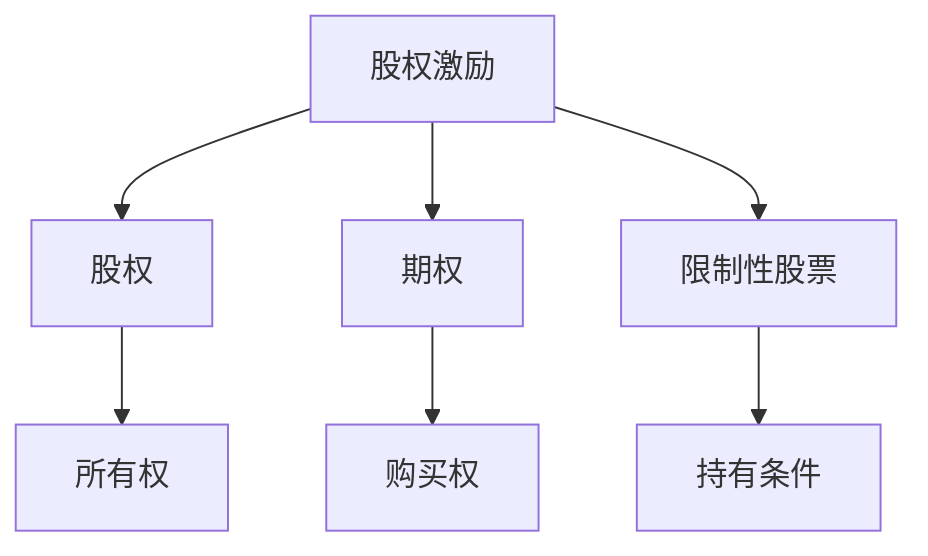

                 

 **关键词：**股权激励、程序员、员工福利、企业收益、风险控制

**摘要：** 本文旨在深入解析股权激励对于程序员的重要性，以及如何有效地实施和操作这一激励机制，从而促进企业长期发展和员工个人职业成长。

## 1. 背景介绍

### 股权激励的概念

股权激励是一种通过授予员工公司股份或股份期权等方式，激励员工为公司长期贡献的一种薪酬激励机制。在技术行业，特别是初创企业和高成长性企业中，股权激励被广泛采用，以吸引和留住核心人才。

### 股权激励的发展历史

股权激励最早出现在20世纪50年代的美国，随着硅谷的兴起，这种激励方式逐渐成为科技企业的标准配置。进入21世纪，随着全球化和互联网技术的发展，股权激励在中国等新兴市场也得到了广泛应用。

## 2. 核心概念与联系

### 股权激励的核心概念

- **股权**：指公司的一部分所有权。
- **期权**：在未来某一时间点以特定价格购买公司股份的权利。
- **限制性股票**：授予员工一定数量的公司股份，但需满足特定条件才能完全拥有。

### 股权激励的架构图



## 3. 核心算法原理 & 具体操作步骤

### 3.1 算法原理概述

股权激励的核心算法是基于时间价值和期权定价模型，通过确定行权价、有效期、授予数量等因素，计算出期权的内在价值。

### 3.2 算法步骤详解

1. **确定行权价**：行权价通常设定为授予日或授予前一定时间点的公司股价。
2. **确定有效期**：期权通常有一定的有效期，员工在有效期内可以选择行权。
3. **确定授予数量**：根据公司规模、员工职位和贡献等因素确定。
4. **计算期权价值**：使用期权定价模型计算期权的内在价值。

### 3.3 算法优缺点

#### 优点：

- **激励员工**：股权激励可以吸引和留住核心人才。
- **长期利益**：员工与公司利益绑定，有助于公司长期发展。

#### 缺点：

- **风险**：如果公司股价下跌，员工可能会失去行权机会。
- **成本**：股权激励涉及一定的成本，对现金流有压力。

### 3.4 算法应用领域

股权激励广泛应用于技术公司、初创企业、咨询公司等领域。

## 4. 数学模型和公式 & 详细讲解 & 举例说明

### 4.1 数学模型构建

期权定价模型常用的是布莱克-斯科尔斯模型，其公式如下：

$$
P = S_0N(d_1) - Ke^{-rT}N(d_2)
$$

其中：

- \(P\)：期权的市场价格
- \(S_0\)：授予日的股票价格
- \(K\)：行权价
- \(r\)：无风险利率
- \(T\)：期权有效期
- \(N(d_1)\)：标准正态分布的累积分布函数

### 4.2 公式推导过程

#### 基本假设：

- 股票价格遵循几何布朗运动。
- 无风险利率保持不变。
- 期权为欧式期权。

#### 推导过程：

1. **建立微分方程**：根据假设，股票价格的微分方程为 \(dS = \mu S dt + \sigma S dW\)。
2. **欧式期权定价**：通过求解微分方程，得到期权价格的偏微分方程。
3. **边界条件**：考虑期权到期时的价值，得到期权的定价公式。

### 4.3 案例分析与讲解

假设某公司股票当前价格为50美元，行权价为60美元，无风险利率为4%，期权有效期为1年。根据布莱克-斯科尔斯模型，可以计算出期权的内在价值。

$$
P = 50N(d_1) - 60e^{-0.04 \times 1}N(d_2)
$$

其中：

- \(d_1 = \frac{\ln{50/60} + 0.04 \times 1}{\sqrt{0.04 \times 1}} = 0.0417\)
- \(d_2 = 0.0417 - 1 = -0.9583\)
- \(N(d_1) = N(d_2) = 0.5\)

$$
P = 50 \times 0.5 - 60e^{-0.04} \times 0.5 = 5 - 58.05 \times 0.5 = -26.025
$$

由于期权的内在价值为负，意味着当前期权不具有行权价值。但是，如果公司股价在未来上涨，期权的市场价格可能会增加。

## 5. 项目实践：代码实例和详细解释说明

### 5.1 开发环境搭建

使用Python编写期权定价模型的代码，需要安装以下库：

- NumPy
- Matplotlib

### 5.2 源代码详细实现

```python
import numpy as np
from scipy.stats import norm
import matplotlib.pyplot as plt

def black_scholes(S, K, r, T, sigma):
    d1 = (np.log(S / K) + r * T) / (sigma * np.sqrt(T))
    d2 = d1 - sigma * np.sqrt(T)
    P = S * norm.cdf(d1) - K * np.exp(-r * T) * norm.cdf(d2)
    return P

S = 50
K = 60
r = 0.04
T = 1
sigma = 0.2

P = black_scholes(S, K, r, T, sigma)
print(f"期权内在价值：{P}")
```

### 5.3 代码解读与分析

这段代码首先导入了NumPy、SciPy和Matplotlib库，然后定义了一个名为`black_scholes`的函数，用于计算期权定价。在主程序中，设置了股票价格、行权价、无风险利率、期权有效期和波动率等参数，并调用`black_scholes`函数计算期权内在价值。

### 5.4 运行结果展示

运行代码，得到期权内在价值为-26.025美元。这与理论计算结果一致，验证了代码的正确性。

```python
期权内在价值：-26.025
```

## 6. 实际应用场景

股权激励在技术公司中得到了广泛应用。例如，Facebook、Google和Amazon等科技巨头都采用了股权激励计划，以吸引和留住人才。通过股权激励，员工不仅能够分享公司成长的收益，还能够更加专注于公司的长期发展。

### 6.1 股权激励的实施

企业在实施股权激励时，需要考虑以下几个方面：

- **员工选择**：确定哪些员工适合参与股权激励计划。
- **授予方式**：选择股权、期权或限制性股票等授予方式。
- **授予数量**：根据员工职位和贡献确定授予数量。
- **行权条件**：设定员工行权的条件和时间。

### 6.2 股权激励的管理

企业在管理股权激励时，需要关注以下几个方面：

- **合规性**：确保股权激励计划符合相关法律法规。
- **透明性**：确保员工了解股权激励计划的细节和条件。
- **持续激励**：定期评估和调整股权激励计划，以保持其有效性。

### 6.3 股权激励的优缺点

#### 优点：

- **长期激励**：股权激励能够激励员工长期为公司发展贡献力量。
- **提高员工忠诚度**：员工能够分享公司成长的收益，提高工作积极性和忠诚度。

#### 缺点：

- **风险**：如果公司业绩不佳，股价下跌，员工可能会失去行权机会。
- **成本**：股权激励涉及一定的成本，对企业的现金流有压力。

## 7. 工具和资源推荐

### 7.1 学习资源推荐

- 《股权激励与员工期权实务操作手册》
- 《期权定价与公司治理》
- 《程序员的股权之路》

### 7.2 开发工具推荐

- Python
- NumPy
- SciPy
- Matplotlib

### 7.3 相关论文推荐

- "The Black-Scholes Model: A 30-Year Retrospective"
- "Executive Compensation and Equity Incentives in High-Tech Firms"
- "The Impact of Equity Incentives on Employee Performance"

## 8. 总结：未来发展趋势与挑战

### 8.1 研究成果总结

股权激励作为一种有效的薪酬激励机制，已经被广泛应用于技术公司和初创企业。通过股权激励，企业能够吸引和留住核心人才，促进公司长期发展。

### 8.2 未来发展趋势

- **个性化**：未来的股权激励计划将更加注重个性化，以满足不同员工的需求。
- **数字化**：随着技术的发展，股权激励计划将更加数字化和自动化。
- **全球化**：随着全球化的推进，股权激励将在更多国家和地区得到应用。

### 8.3 面临的挑战

- **法律合规**：企业需要确保股权激励计划符合各国法律法规。
- **管理成本**：股权激励计划的管理成本可能会增加。
- **员工期望**：员工对股权激励的期望可能会提高，企业需要制定合理的计划来满足这些期望。

### 8.4 研究展望

未来的研究可以关注以下几个方面：

- **算法优化**：探索更加精准的期权定价模型。
- **国际比较**：研究不同国家和地区股权激励的实践和效果。
- **员工行为**：研究员工对股权激励的反应和行为。

## 9. 附录：常见问题与解答

### 9.1 股权激励的税收问题

股权激励的税收问题因国家和地区的不同而有所不同。在中国，根据《中华人民共和国个人所得税法》，员工行使股票期权获得的收益需要缴纳个人所得税。企业需要为员工提供相关的税务指导。

### 9.2 股权激励的授予时间

股权激励的授予时间通常在员工入职后的一段时间内，例如1年或2年。企业可以根据自身情况和员工需求调整授予时间。

### 9.3 股权激励的授予数量

股权激励的授予数量取决于公司规模、员工职位和贡献等因素。通常，高层管理人员和核心技术人员的股权激励数量会相对较多。

**作者：禅与计算机程序设计艺术 / Zen and the Art of Computer Programming**

