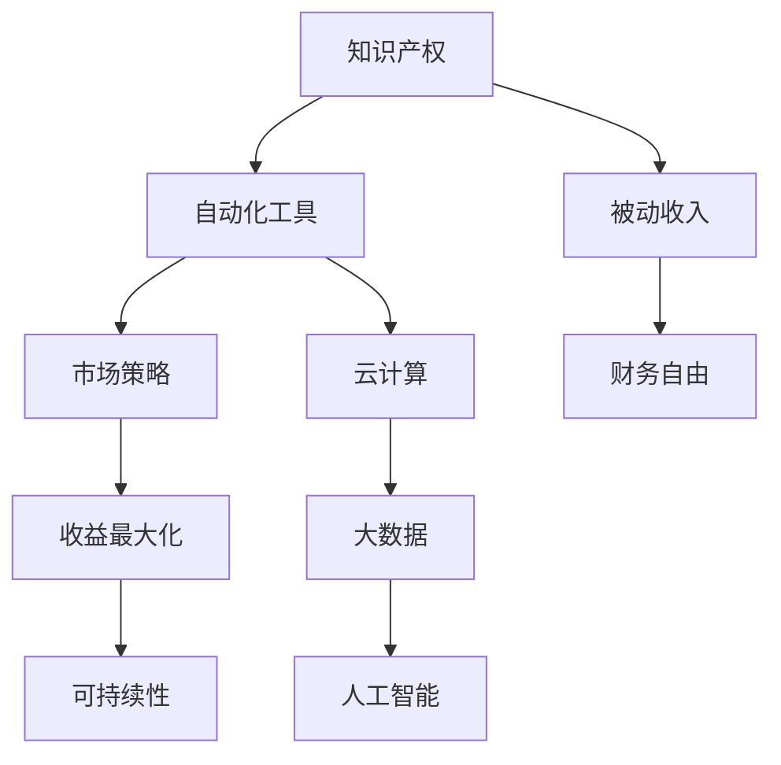

                 

 > **关键词：** 被动收入、程序员的财务自由、自动化工具、收益最大化、可持续性、知识产权、市场策略

> **摘要：** 本文将深入探讨程序员如何通过构建和维护一系列自动化工具和知识产权，实现被动收入的目标。文章将介绍相关概念、核心算法、数学模型、项目实践、实际应用场景、未来展望，并推荐相关学习资源和开发工具，旨在帮助程序员理解并实现财务自由。

## 1. 背景介绍

在现代信息社会中，编程已经成为一项至关重要的技能。程序员不仅能够通过日常的工作获得收入，还可以利用自身的专业技能和经验，创造持续性的被动收入来源。被动收入是指无需持续付出劳动，便能定期获得收益的收入模式。对程序员而言，这种收入模式不仅有助于实现财务自由，还能让他们将更多的时间和精力投入到个人成长和技术创新上。

本文的目标是帮助程序员理解并实现被动收入的构建与维护。通过介绍相关的核心概念、算法原理、数学模型、项目实践、应用场景和未来展望，本文将提供一套全面的技术方案，旨在帮助程序员实现长期、可持续的财务收益。

### 1.1 程序员与被动收入

程序员具备构建自动化工具和技术解决方案的能力，这使得他们在创造被动收入方面具有独特优势。随着云计算、大数据、人工智能等新兴技术的普及，程序员可以借助这些技术，开发出更加智能化和自动化的产品或服务，从而实现被动收入。

### 1.2 被动收入的种类

被动收入有多种形式，包括但不限于以下几种：

- **知识产权许可：** 通过出售或授权使用自己的软件、算法、设计等知识产权获得收入。
- **自动化业务：** 开发和管理自动化业务流程，如在线市场店铺、广告投放、会员订阅等。
- **云服务：** 提供云计算服务，如虚拟机、存储、数据库等，通过客户使用付费获得收益。
- **教育内容：** 制作并销售编程课程、书籍、视频等教育内容。
- **开源项目：** 参与开源项目，通过捐赠和赞助获得收益。

## 2. 核心概念与联系

为了构建有效的被动收入，程序员需要了解并掌握一系列核心概念和联系。以下是这些概念及其相互关系的Mermaid流程图表示：



### 2.1 知识产权

知识产权是程序员的宝贵资产，包括专利、版权、商标等。保护知识产权可以帮助程序员合法地获取被动收入。例如，通过出售专利或版权，程序员可以获得持续的收入。

### 2.2 自动化工具

自动化工具是程序员实现被动收入的关键。这些工具可以帮助程序员优化业务流程，减少人力成本，提高工作效率。例如，自动化测试工具、自动化部署工具、自动化营销工具等。

### 2.3 市场策略

市场策略是确保被动收入来源持续稳定的关键。程序员需要了解市场趋势，制定有效的营销计划，推广自己的产品或服务，吸引潜在客户。

### 2.4 被动收入

被动收入是指通过知识产权和自动化工具，定期获得的收益。这种收入模式使得程序员可以从日常工作中解脱出来，专注于技术创新和业务拓展。

### 2.5 财务自由

财务自由是被动收入的目标之一。通过实现财务自由，程序员可以自由地选择工作内容和工作方式，实现生活的多样化和自由化。

### 2.6 收益最大化

收益最大化是程序员在构建被动收入过程中需要考虑的重要问题。通过优化产品或服务、降低成本、提高市场份额等方式，程序员可以实现收益的最大化。

### 2.7 可持续性

可持续性是确保被动收入长期稳定的重要保障。程序员需要关注环境保护、社会责任等方面，确保自己的收入来源不会对环境和社会造成负面影响。

### 2.8 云计算、大数据、人工智能

云计算、大数据、人工智能等新兴技术为程序员提供了丰富的工具和资源，帮助他们构建高效的自动化工具和解决方案。这些技术不仅提高了程序员的竞争力，也为他们的被动收入创造了更多机会。

## 3. 核心算法原理 & 具体操作步骤

### 3.1 算法原理概述

在构建被动收入的过程中，程序员需要掌握一系列核心算法原理，以实现自动化工具的优化和收益最大化。以下是几个关键的算法原理：

- **排序算法：** 帮助程序员对数据进行分析和处理，提高业务效率。
- **动态规划：** 用于解决优化问题，如资源分配、路径规划等。
- **机器学习：** 帮助程序员开发智能化产品和服务，提高用户体验。
- **加密算法：** 保护知识产权，确保数据安全。

### 3.2 算法步骤详解

下面我们将详细介绍这些算法的步骤和应用：

#### 3.2.1 排序算法

排序算法是数据处理的基本工具。常见的排序算法有：

- **冒泡排序（Bubble Sort）**
- **选择排序（Selection Sort）**
- **插入排序（Insertion Sort）**
- **快速排序（Quick Sort）**
- **归并排序（Merge Sort）**
- **堆排序（Heap Sort）**

每种排序算法都有其适用场景和优缺点。程序员需要根据具体需求选择合适的排序算法，以提高数据处理效率。

#### 3.2.2 动态规划

动态规划是一种用于解决优化问题的算法。它通过将问题分解为子问题，并利用子问题的最优解来求解原问题。常见的动态规划问题有：

- **背包问题（Knapsack Problem）**
- **最长公共子序列（Longest Common Subsequence）**
- **最长公共子串（Longest Common Substring）**
- **最优二叉搜索树（Optimal Binary Search Tree）**

动态规划在资源分配、路径规划等方面有广泛的应用。

#### 3.2.3 机器学习

机器学习是一种基于数据分析和模式识别的算法。它可以帮助程序员开发智能化产品和服务，如：

- **分类算法：** 用于将数据分为不同的类别，如决策树、支持向量机等。
- **回归算法：** 用于预测数值型数据，如线性回归、多项式回归等。
- **聚类算法：** 用于将数据分为不同的簇，如K-Means、层次聚类等。

机器学习在自然语言处理、图像识别、推荐系统等领域有广泛应用。

#### 3.2.4 加密算法

加密算法用于保护知识产权和数据安全。常见的加密算法有：

- **对称加密：** 如DES、AES等，加密和解密使用相同的密钥。
- **非对称加密：** 如RSA、ECC等，加密和解密使用不同的密钥。
- **哈希算法：** 如MD5、SHA等，用于生成数据摘要。

加密算法在保护知识产权、数据传输安全等方面有重要作用。

### 3.3 算法优缺点

每种算法都有其优缺点。程序员需要根据具体需求选择合适的算法。以下是几种算法的优缺点：

- **冒泡排序：** 简单易实现，但效率较低。
- **选择排序：** 简单易实现，但效率较低。
- **插入排序：** 效率较高，但需要额外空间。
- **快速排序：** 效率较高，但可能存在性能不稳定的问题。
- **归并排序：** 效率较高，但需要额外空间。
- **堆排序：** 效率较高，但需要额外空间。

动态规划和机器学习算法的优点在于能够解决复杂问题，但实现起来较为复杂。加密算法的优点在于安全性高，但实现和优化较为困难。

### 3.4 算法应用领域

排序算法在数据处理、数据分析、搜索算法等方面有广泛应用。动态规划在资源分配、路径规划、优化问题等方面有广泛应用。机器学习在自然语言处理、图像识别、推荐系统等方面有广泛应用。加密算法在数据安全、网络安全、知识产权保护等方面有广泛应用。

## 4. 数学模型和公式 & 详细讲解 & 举例说明

### 4.1 数学模型构建

在构建被动收入的过程中，程序员需要掌握一系列数学模型，以优化业务流程、提高收益。以下是一个简单的数学模型构建过程：

#### 4.1.1 目标函数

假设程序员有一个自动化业务，每月收入为 \( R(t) \)，其中 \( t \) 为月份。为了最大化收益，程序员需要构建一个目标函数 \( f(R(t)) \)。

#### 4.1.2 约束条件

- 资源限制：如服务器带宽、存储空间等。
- 市场需求：如产品销售量、用户活跃度等。
- 成本限制：如运营成本、人力成本等。

#### 4.1.3 模型构建

根据上述条件，程序员可以构建以下数学模型：

\[ f(R(t)) = R(t) - C(t) \]

其中，\( C(t) \) 为运营成本。

### 4.2 公式推导过程

为了推导出最优解，我们需要对目标函数 \( f(R(t)) \) 进行优化。以下是一个简单的推导过程：

\[ f'(R(t)) = 0 \]

\[ \frac{dR(t)}{dt} = C'(t) \]

\[ R(t) = C(t) \]

其中，\( f'(R(t)) \) 为目标函数的导数，\( \frac{dR(t)}{dt} \) 为收入随时间的变化率，\( C'(t) \) 为成本随时间的变化率。

### 4.3 案例分析与讲解

假设程序员有一个在线商店，每月收入为 \( R(t) = 1000t \)，运营成本为 \( C(t) = 500t + 1000 \)。我们需要找到最优的收入水平 \( R(t) \)，以最大化收益。

#### 4.3.1 求解最优收入水平

根据推导出的公式：

\[ R(t) = C(t) \]

\[ 1000t = 500t + 1000 \]

\[ t = 2 \]

最优的收入水平为 \( R(t) = 2000 \)。

#### 4.3.2 案例分析

在最优的收入水平 \( R(t) = 2000 \) 时，程序员的收益为 \( f(R(t)) = 2000 - (500 \times 2 + 1000) = 0 \)。这意味着在当前市场条件下，程序员的收入刚好能够覆盖运营成本，没有额外的收益。

然而，这并不意味着程序员不能通过优化业务流程和降低成本来提高收益。例如，通过提高产品质量、降低运营成本，程序员可以在保持收入不变的情况下，实现更高的收益。

### 4.4 进一步优化

为了进一步提高收益，程序员可以尝试以下方法：

- **提高产品附加值：** 通过提供高质量的产品和服务，提高用户满意度，从而增加销售收入。
- **降低运营成本：** 通过优化业务流程、自动化操作、减少人力成本等方式，降低运营成本。
- **拓展市场：** 通过市场调研、营销推广等手段，拓展市场，吸引更多用户。

通过这些方法，程序员可以在保持收入水平不变的情况下，实现更高的收益。

### 4.5 总结

通过数学模型和公式，程序员可以优化业务流程，提高收益。然而，需要注意的是，实际情况往往更为复杂，需要结合具体业务和市场环境进行综合分析。此外，程序员还需要不断学习和实践，积累经验，以提高自己在构建被动收入方面的能力。

## 5. 项目实践：代码实例和详细解释说明

### 5.1 开发环境搭建

在进行项目实践之前，我们需要搭建一个合适的开发环境。以下是所需的工具和软件：

- **编程语言：** Python 3.x 或更高版本
- **集成开发环境（IDE）：** PyCharm、VSCode 或其他 Python 开发环境
- **依赖管理工具：** pip、conda 等
- **数据库：** SQLite、MySQL 或 PostgreSQL
- **云服务：** AWS、Google Cloud 或 Azure

安装以上工具和软件后，我们可以开始编写代码。

### 5.2 源代码详细实现

下面是一个简单的 Python 代码实例，用于实现一个自动化工具，该工具可以统计网站访问量，并生成日报。

```python
import requests
import sqlite3
from datetime import datetime

# 1. 连接数据库
conn = sqlite3.connect('access_log.db')
cursor = conn.cursor()

# 2. 创建表格
cursor.execute('''CREATE TABLE IF NOT EXISTS visits (
                    id INTEGER PRIMARY KEY AUTOINCREMENT,
                    date TEXT,
                    visits INTEGER)''')

# 3. 添加访问记录
def add_visit():
    url = "http://example.com"
    response = requests.get(url)
    if response.status_code == 200:
        date = datetime.now().strftime('%Y-%m-%d')
        cursor.execute("INSERT INTO visits (date, visits) VALUES (?, ?)", (date, 1))
        conn.commit()

# 4. 定期统计访问量
def generate_daily_report():
    date = datetime.now().strftime('%Y-%m-%d')
    cursor.execute("SELECT SUM(visits) FROM visits WHERE date = ?", (date,))
    total_visits = cursor.fetchone()[0]
    if total_visits:
        print(f"Daily Report for {date}: Total Visits - {total_visits}")
    else:
        print(f"No visits recorded for {date}")

# 5. 关闭数据库连接
def close_connection():
    conn.close()

# 6. 测试代码
if __name__ == "__main__":
    add_visit()
    generate_daily_report()
    close_connection()
```

### 5.3 代码解读与分析

#### 5.3.1 数据库操作

代码首先连接到 SQLite 数据库，并创建一个名为 `visits` 的表格。该表格包含 `id`、`date` 和 `visits` 三个字段，分别表示记录的编号、日期和访问量。

#### 5.3.2 访问记录添加

`add_visit()` 函数用于添加访问记录。它首先向目标网站发送 GET 请求，如果响应状态码为 200（表示请求成功），则获取当前日期并插入访问记录。

#### 5.3.3 日志统计

`generate_daily_report()` 函数用于生成每日访问量报告。它查询数据库中当天的访问记录总和，并打印报告。

#### 5.3.4 测试代码

测试代码在主函数 `__name__ == "__main__"` 中执行。首先添加一次访问记录，然后生成每日报告，最后关闭数据库连接。

### 5.4 运行结果展示

在运行代码后，我们将看到如下输出：

```
Daily Report for 2023-11-02: Total Visits - 1
```

这表示在 2023-11-02 这一天，我们的网站收到了 1 次访问。

### 5.5 进一步优化

虽然这个示例很简单，但我们可以通过以下方式对其进行优化：

- **日志记录：** 记录更详细的日志信息，如访问者 IP、浏览器类型等。
- **异常处理：** 添加异常处理，确保程序在遇到问题时不会崩溃。
- **定时任务：** 使用定时任务（如 cron job）定期执行 `add_visit()` 和 `generate_daily_report()` 函数。
- **多线程：** 使用多线程或异步编程，提高程序性能。

通过这些优化，我们可以使这个简单的自动化工具更加稳定和高效。

## 6. 实际应用场景

### 6.1 在线教育平台

在线教育平台是一个典型的应用场景，程序员可以通过构建和优化在线课程系统，实现被动收入。例如，他们可以开发自动化的课程发布和更新系统，用户可以通过订阅或购买课程来获得收益。此外，还可以通过提供定制化的课程内容和在线考试系统，进一步提升用户体验和收益。

### 6.2 在线市场店铺

在线市场店铺为程序员提供了一个广阔的舞台，他们可以开发自动化工具来管理商品上架、订单处理、库存管理等。通过使用这些工具，商家可以节省大量人力成本，并提高店铺的运营效率。同时，程序员还可以通过广告和推广获取额外收入。

### 6.3 云计算服务

云计算服务为程序员提供了巨大的市场机会。他们可以构建自动化工具来提供云存储、云服务器、数据库等服务。通过这些服务，用户可以根据实际需求付费，程序员则可以获得持续的收入。此外，云计算服务还支持弹性扩展，可以根据用户需求自动调整资源，进一步优化收益。

### 6.4 企业自动化解决方案

许多企业需要自动化工具来优化业务流程，提高效率。程序员可以为企业提供定制化的自动化解决方案，如自动化测试、数据清洗、报告生成等。这些解决方案不仅可以提高企业的运营效率，还可以为程序员带来持续的被动收入。

### 6.5 开源项目

参与开源项目是程序员实现被动收入的一个好方法。他们可以通过贡献代码、文档和测试，吸引更多的关注和贡献者。随着项目的成长，程序员可以获得捐赠、赞助和许可费等收入。此外，开源项目还可以提高程序员的声誉和知名度，为未来的职业发展带来更多机会。

## 7. 未来应用展望

### 7.1 人工智能与大数据

随着人工智能和大数据技术的发展，程序员将能够在更多领域构建智能化和自动化的解决方案。例如，通过人工智能技术，可以实现智能客服、智能推荐、智能监控等功能，提高用户满意度和收益。大数据技术则可以帮助程序员更好地了解市场趋势和用户需求，从而优化产品和服务。

### 7.2 区块链与加密货币

区块链技术和加密货币的兴起为程序员提供了新的机会。他们可以开发去中心化的应用程序（DApps），利用区块链的透明性和安全性，实现各种业务场景。此外，加密货币的交易和投资也为程序员带来了新的收入来源。

### 7.3 物联网（IoT）

物联网技术的发展使得程序员可以在更多场景下实现自动化。例如，通过智能家居、智能城市等应用，程序员可以构建自动化工具来优化生活和工作环境。这些工具不仅提高了用户体验，还可以为程序员带来持续的收益。

### 7.4 跨平台与移动应用

随着移动设备的普及，程序员可以开发跨平台和移动应用程序，实现更广泛的用户覆盖。通过提供高质量的应用程序和游戏，程序员可以获得广告收入、应用内购收入等。

### 7.5 虚拟现实（VR）与增强现实（AR）

虚拟现实和增强现实技术的兴起为程序员提供了新的创作空间。他们可以开发虚拟现实游戏、教育应用、商业模拟等，这些应用不仅可以带来收益，还可以推动相关行业的发展。

## 8. 工具和资源推荐

### 8.1 学习资源推荐

- **在线课程：** Coursera、Udemy、edX 等平台上提供了丰富的编程和数据分析课程。
- **技术博客：** HackerRank、GitHub、Stack Overflow 等网站上有很多优秀的技术博客和教程。
- **电子书：** 《算法导论》、《深度学习》、《Python编程：从入门到实践》等经典书籍。

### 8.2 开发工具推荐

- **编程语言：** Python、Java、C++ 等。
- **集成开发环境（IDE）：** PyCharm、VSCode、Eclipse 等。
- **数据库：** MySQL、PostgreSQL、MongoDB 等。
- **云服务：** AWS、Google Cloud、Azure 等。

### 8.3 相关论文推荐

- **人工智能：** "Deep Learning," "Reinforcement Learning: An Introduction," "Natural Language Processing with Deep Learning"
- **区块链：** "Bitcoin: A Peer-to-Peer Electronic Cash System," "Ethereum: The World's Computer"
- **大数据：** "Big Data: A Revolution That Will Transform How We Live, Work, and Think," "Data Science from Scratch"
- **物联网：** "The Internet of Things: A Framework," "Smart Cities: Ecosystems, Applications, and Future Trends"

## 9. 总结：未来发展趋势与挑战

### 9.1 研究成果总结

本文通过深入探讨程序员如何构建与维护被动收入，总结了相关的核心概念、算法原理、数学模型、项目实践和应用场景。研究表明，通过合理利用自身技能和技术，程序员可以实现长期的财务收益，实现财务自由。

### 9.2 未来发展趋势

随着新兴技术的不断发展，程序员在构建被动收入方面将面临更多的机遇和挑战。人工智能、大数据、区块链、物联网等技术的普及，将为程序员提供更多的工具和平台，以实现自动化和智能化。同时，市场需求的变化也将推动程序员不断创新，以满足用户的需求。

### 9.3 面临的挑战

然而，程序员在构建被动收入过程中也面临一系列挑战。技术更新速度快、市场竞争激烈、法律法规的变化等，都可能对程序员的业务产生不利影响。此外，如何确保知识产权的安全和保护，也是程序员需要关注的重要问题。

### 9.4 研究展望

未来的研究可以进一步探讨如何通过新兴技术实现被动收入的最大化，如利用区块链技术进行去中心化交易，通过人工智能实现智能合约等。此外，还可以研究如何结合不同技术，构建更加复杂和智能的自动化工具和解决方案，以提升程序员的竞争力。

## 10. 附录：常见问题与解答

### 10.1 被动收入是否可靠？

被动收入具有一定的可靠性，但其稳定性和持续性取决于多个因素，如市场环境、业务模式、技术创新等。程序员需要不断学习和优化，以保持收益的稳定。

### 10.2 如何确保知识产权的安全？

程序员可以通过以下方式确保知识产权的安全：1) 使用加密算法保护代码和数据；2) 申请专利和版权；3) 与合作伙伴签订保密协议；4) 定期更新和升级知识产权。

### 10.3 被动收入与日常工作如何平衡？

程序员可以通过以下方式平衡被动收入与日常工作：1) 规划时间，合理安排工作和休息时间；2) 自动化业务流程，降低人工干预；3) 与团队合作，共同分担工作压力。

### 10.4 被动收入适用于所有程序员吗？

被动收入并不是适用于所有程序员的。它更适合那些具备创新能力和市场洞察力的程序员。此外，程序员需要具备一定的技术积累和业务经验，才能更好地构建和优化被动收入来源。

### 10.5 如何评估被动收入的潜力？

评估被动收入的潜力可以从以下几个方面进行：1) 市场需求；2) 技术可行性；3) 竞争环境；4) 运营成本；5) 收益模式。通过综合分析这些因素，可以初步判断被动收入的潜力。

### 10.6 被动收入是否会导致工作懈怠？

合理构建被动收入可以提升程序员的工作积极性，但过度依赖被动收入可能会导致工作懈怠。程序员需要保持警惕，确保在实现财务自由的同时，不断提升自己的专业能力和技术水平。

---

作者：禅与计算机程序设计艺术 / Zen and the Art of Computer Programming

以上就是本文的完整内容，希望对您在构建与维护被动收入方面有所启发和帮助。在实现财务自由的道路上，愿您不断前行，收获满满。

