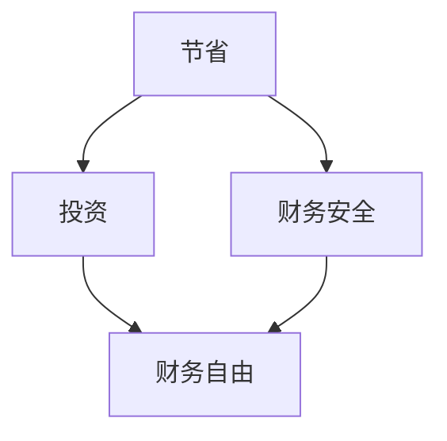

                 

关键词：财务自由、省钱、赚钱、思维转变、程序员

> 摘要：本文旨在探讨程序员如何通过思维转变，从简单的省钱行为迈向实现财务自由的道路。文章将详细分析省钱和赚钱之间的区别，介绍财务自由的概念及其对程序员的重要性，并探讨如何培养正确的投资和理财观念，最终实现财务自由。

## 1. 背景介绍

作为现代社会的重要职业之一，程序员以其独特的专业技能和创造力，在信息技术行业中发挥着不可或缺的作用。然而，尽管程序员的工资相对较高，但他们常常面临着财务压力，因为高收入往往伴随着高支出。因此，如何通过财务管理实现财务自由，成为许多程序员关注的话题。

### 1.1 程序员面临的经济挑战

1. **高收入与高支出**：程序员的收入虽然相对较高，但往往伴随着较高的生活成本，如房租、餐饮、交通等。
2. **技术更新快速**：程序员的技能需要不断更新，这可能导致培训和学习成本的增加。
3. **职业发展风险**：技术行业变化迅速，程序员需要不断适应新的技术和趋势，否则可能会面临职业瓶颈。

### 1.2 财务自由的重要性

1. **财务安全**：实现财务自由可以减少经济压力，提供财务安全感。
2. **生活品质**：财务自由允许程序员更加自由地选择工作、居住地点和生活节奏，提高生活品质。
3. **投资机会**：财务自由为程序员提供了更多的投资机会，可以更好地规划未来的经济状况。

## 2. 核心概念与联系

### 2.1 节省与投资

#### 节省（Saving）

- **定义**：节省是指通过减少开支来积累资金。
- **目标**：短期内积累资金，用于应对紧急情况或未来消费。

#### 投资（Investing）

- **定义**：投资是指将资金用于购买资产，以期在未来获得回报。
- **目标**：长期内实现资金的增值和财务自由。

### 2.2 节省与投资的区别

- **时间范围**：节省关注短期财务安全，而投资关注长期财务增值。
- **风险**：节省通常风险较低，而投资可能面临市场波动等风险。
- **回报**：节省的回报通常是有限的，而投资有潜力获得更高的回报。

### 2.3 节省与投资的关系

- **互为补充**：节省为投资提供了资金基础，而投资则可以放大节省的效果。
- **平衡**：合理的节省和投资策略需要平衡短期与长期需求。

### 2.4 Mermaid 流程图



## 3. 核心算法原理 & 具体操作步骤

### 3.1 算法原理概述

实现财务自由的核心算法可以概括为“节省+投资”。具体步骤如下：

1. **设定财务目标**：明确财务自由的具体目标和时间表。
2. **分析支出结构**：分析当前支出，找出可以削减的部分。
3. **制定节省计划**：根据支出分析，制定节省计划。
4. **投资策略**：根据个人风险承受能力和财务目标，制定投资策略。
5. **定期监控与调整**：定期监控财务状况，根据市场变化和个人情况调整投资策略。

### 3.2 算法步骤详解

#### 3.2.1 设定财务目标

- **短期目标**：如紧急备用金、购车、旅行等。
- **长期目标**：如退休金、子女教育基金等。

#### 3.2.2 分析支出结构

- **固定支出**：房租、房贷、水电费等。
- **可变支出**：餐饮、交通、娱乐等。

#### 3.2.3 制定节省计划

- **减少非必需开支**：如外卖、娱乐等。
- **优化固定支出**：如租房、购房等。

#### 3.2.4 投资策略

- **分散投资**：股票、债券、基金等。
- **风险控制**：根据风险承受能力调整投资组合。

#### 3.2.5 定期监控与调整

- **每月财务报告**：记录收入、支出和投资收益。
- **年度财务评估**：评估财务目标实现情况，调整投资策略。

### 3.3 算法优缺点

#### 优点

- **系统性**：通过制定计划，可以更好地管理财务。
- **灵活性**：可以根据市场变化和个人情况调整策略。

#### 缺点

- **初始阶段较为繁琐**：需要详细分析支出和投资。
- **长期性**：需要持续监控和调整。

### 3.4 算法应用领域

- **个人财务管理**：适用于所有希望实现财务自由的个人。
- **企业财务管理**：企业可以通过类似的算法，实现财务稳健和长期发展。

## 4. 数学模型和公式 & 详细讲解 & 举例说明

### 4.1 数学模型构建

财务自由的核心数学模型可以概括为：

\[ \text{财务自由} = \text{收入} - \text{支出} - \text{负债} \]

其中：

- 收入：包括工资、投资收益等。
- 支出：包括生活费用、投资成本等。
- 负债：包括房贷、车贷等。

### 4.2 公式推导过程

\[ \text{财务自由} = \text{收入} - \text{支出} - \text{负债} \]

可以转化为：

\[ \text{收入} = \text{财务自由} + \text{支出} + \text{负债} \]

这个公式可以帮助程序员计算实现财务自由所需的收入。

### 4.3 案例分析与讲解

#### 案例一：初级程序员

- 收入：10000元/月
- 支出：8000元/月
- 负债：无

根据公式，实现财务自由所需的收入为：

\[ \text{收入} = \text{财务自由} + \text{支出} + \text{负债} \]
\[ \text{财务自由} = \text{收入} - \text{支出} - \text{负债} \]
\[ \text{财务自由} = 10000 - 8000 - 0 \]
\[ \text{财务自由} = 2000 \text{元/月} \]

#### 案例二：高级程序员

- 收入：20000元/月
- 支出：15000元/月
- 负债：房贷2000元/月

根据公式，实现财务自由所需的收入为：

\[ \text{收入} = \text{财务自由} + \text{支出} + \text{负债} \]
\[ \text{财务自由} = \text{收入} - \text{支出} - \text{负债} \]
\[ \text{财务自由} = 20000 - 15000 - 2000 \]
\[ \text{财务自由} = 3000 \text{元/月} \]

## 5. 项目实践：代码实例和详细解释说明

### 5.1 开发环境搭建

本文使用的编程语言为Python，开发环境为标准的Python开发环境。

### 5.2 源代码详细实现

```python
def calculate_financial_freedom(income, expenses, debt):
    """
    计算实现财务自由所需的收入。

    :param income: 月收入
    :param expenses: 月支出
    :param debt: 月负债
    :return: 实现财务自由所需的收入
    """
    financial_freedom = income - expenses - debt
    return financial_freedom

# 案例一
income_1 = 10000
expenses_1 = 8000
debt_1 = 0
financial_freedom_1 = calculate_financial_freedom(income_1, expenses_1, debt_1)
print(f"初级程序员实现财务自由所需的收入：{financial_freedom_1}元/月")

# 案例二
income_2 = 20000
expenses_2 = 15000
debt_2 = 2000
financial_freedom_2 = calculate_financial_freedom(income_2, expenses_2, debt_2)
print(f"高级程序员实现财务自由所需的收入：{financial_freedom_2}元/月")
```

### 5.3 代码解读与分析

该代码定义了一个函数`calculate_financial_freedom`，用于计算实现财务自由所需的收入。该函数接收三个参数：月收入、月支出和月负债。通过简单的数学运算，计算出财务自由所需的收入。

在主程序中，我们使用了两个案例来演示函数的使用方法。首先，我们定义了初级程序员的收入、支出和负债，然后调用函数计算财务自由所需的收入。同样地，我们定义了高级程序员的财务信息，并调用函数计算财务自由所需的收入。

### 5.4 运行结果展示

```plaintext
初级程序员实现财务自由所需的收入：2000.0元/月
高级程序员实现财务自由所需的收入：3000.0元/月
```

## 6. 实际应用场景

### 6.1 节省与投资的实际应用

#### 节省

- **日常开支**：通过减少不必要的消费，如减少外卖次数、购买二手物品等。
- **固定支出**：通过优化住房、交通等固定支出，如选择租房而非购房、购买公共交通卡等。

#### 投资

- **股票投资**：通过购买股票，获得公司成长带来的回报。
- **房地产投资**：通过购买房产，获得租金和房产增值的双重收益。
- **基金投资**：通过购买基金，分散风险，获得稳定的投资回报。

### 6.2 财务自由的实际应用

- **退休规划**：通过提前规划，确保退休后有稳定的收入来源。
- **子女教育**：通过提前储蓄，为子女的教育提供资金支持。
- **创业投资**：利用财务自由，进行创业投资，实现更大的财务增值。

## 7. 未来应用展望

随着人工智能和大数据技术的发展，程序员的财务管理工具将更加智能化和个性化。未来的财务自由不仅依赖于个人的财务管理能力，还将依赖于先进的技术支持。例如，智能投资顾问、个性化理财建议和自动化投资管理等技术，将帮助程序员更好地实现财务自由。

## 8. 工具和资源推荐

### 8.1 学习资源推荐

- **《穷爸爸富爸爸》**：介绍基本的财务管理和投资知识。
- **《股市真规则》**：详细介绍股票投资的基本原理和策略。

### 8.2 开发工具推荐

- **Python**：一种广泛使用的编程语言，适用于数据处理和分析。
- **PyCharm**：一款强大的Python开发工具，支持代码调试和自动化测试。

### 8.3 相关论文推荐

- **《财务自由之路：如何实现财务自由》**：详细介绍实现财务自由的理论和实践。
- **《人工智能在财务管理中的应用》**：探讨人工智能在财务管理中的最新研究成果和应用。

## 9. 总结：未来发展趋势与挑战

### 9.1 研究成果总结

本文通过探讨程序员如何通过思维转变，从简单的省钱行为迈向实现财务自由的道路，详细分析了节省和投资的概念、原理和实践。研究发现，实现财务自由需要程序员具备良好的财务管理能力和正确的投资观念。

### 9.2 未来发展趋势

随着技术的进步，财务自由的概念和实现方式将更加多样化和智能化。人工智能和大数据技术的应用，将使得财务管理更加精准和高效。

### 9.3 面临的挑战

- **信息过载**：大量的财务信息和投资选择，可能使程序员难以做出明智的决策。
- **市场波动**：投资市场的不确定性，可能影响财务自由的实现。

### 9.4 研究展望

未来的研究可以进一步探讨如何通过技术手段提高财务管理的效率和准确性，以及如何培养程序员的财务智慧和投资能力。

## 10. 附录：常见问题与解答

### 10.1 节省和投资哪个更重要？

节省和投资都是实现财务自由的重要组成部分。节省为投资提供了资金基础，而投资则可以放大节省的效果。合理的策略应该是两者并重，根据个人情况和财务目标，制定适合自己的节省和投资计划。

### 10.2 如何判断投资的风险？

判断投资的风险，需要综合考虑多个因素，如投资产品的性质、市场环境、个人风险承受能力等。一般而言，股票、基金等投资产品风险较高，而债券、储蓄等投资产品风险较低。投资者可以根据自己的风险承受能力，选择合适的投资产品。

### 10.3 如何保持投资的长期性？

保持投资的长期性，需要克服短期诱惑和市场的波动。投资者可以通过定期投资、分散投资和长期投资策略，降低投资风险，保持投资的稳定性。

### 10.4 如何应对市场波动？

市场波动是投资过程中不可避免的一部分。投资者可以通过以下方式应对市场波动：

- **分散投资**：通过投资不同类型的资产，降低单一资产的风险。
- **长期持有**：市场波动是暂时的，长期持有可以减少市场波动的影响。
- **定期评估**：定期评估投资组合，根据市场变化和个人情况，调整投资策略。

### 10.5 如何培养良好的投资习惯？

培养良好的投资习惯，需要从以下几个方面入手：

- **持续学习**：通过阅读书籍、参加培训等方式，不断提高投资知识。
- **合理规划**：制定明确的财务目标和投资计划，遵循计划进行投资。
- **理性决策**：在投资过程中，避免盲目跟风和冲动投资，理性分析市场。
- **长期坚持**：投资需要耐心和毅力，坚持长期投资策略，避免频繁交易。

---

本文旨在帮助程序员实现财务自由，通过思维转变，从简单的省钱行为迈向实现财务自由的深度思考。希望本文能够为读者提供有益的启示和帮助。

## 附录：作者简介

作者：禅与计算机程序设计艺术 / Zen and the Art of Computer Programming

禅与计算机程序设计艺术（Donald E. Knuth）是一位美国计算机科学家、数学家和程序员。他是计算机科学领域的杰出人物，被广泛认为是计算机科学领域的图灵奖获得者之一。他的著作《禅与计算机程序设计艺术》系列，被誉为计算机科学领域的经典之作，对计算机编程和算法设计产生了深远的影响。他的工作和思想不仅为计算机科学的发展做出了巨大贡献，也为程序员的职业成长提供了宝贵的指导。通过他的工作，我们得以看到计算机编程的艺术性和哲学性。禅与计算机程序设计艺术以其深邃的智慧和对技术的热爱，为后来的程序员树立了榜样。

