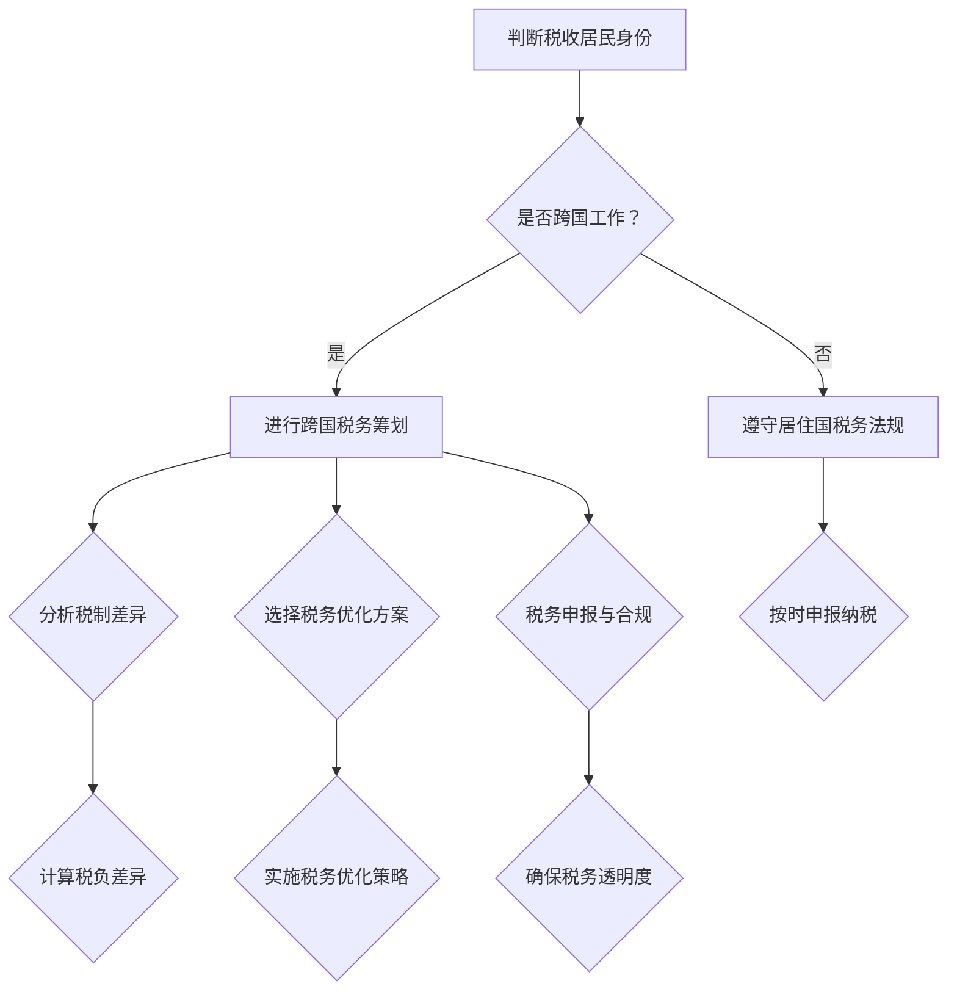

                 

关键词：跨国税务筹划，程序员，税务策略，国际税收，税制差异，税收优化，合规性，税务合规

## 摘要

在全球化时代，程序员的职业发展常常跨越国界，这不仅仅带来了职业机会的扩大，同时也引发了跨国税务筹划的挑战。本文旨在为程序员提供一套系统化的跨国税务筹划策略，帮助他们在全球范围内合法合规地进行税务规划，最大限度地减少税负，同时确保税务行为的透明度和合规性。文章将涵盖跨国税务筹划的核心概念、国际税收法律法规、具体操作步骤、数学模型和公式推导，以及实际应用案例等内容。

## 1. 背景介绍

### 1.1 全球化趋势下的程序员职业发展

随着信息技术的飞速发展，全球范围内的数字化进程加快，程序员作为信息技术领域的中坚力量，其职业发展已经不再局限于某个国家或地区。越来越多的程序员通过远程工作、海外兼职、跨国公司派驻等方式，实现了个人职业发展的全球化。然而，这种职业发展模式也带来了税务方面的复杂挑战。

### 1.2 跨国税务筹划的必要性

跨国税务筹划的必要性主要体现在以下几个方面：

1. **税负差异**：不同国家和地区的税制不同，税率、税收优惠政策等方面存在显著差异。合理的税务筹划可以帮助程序员在全球范围内选择最优税务方案，减少不必要的税负。
2. **合规性**：随着各国对税务合规性的要求越来越高，跨国程序员需要确保其税务行为符合所在国家和居住国的法律规定，避免因税务不合规而面临的处罚。
3. **税务透明度**：全球税务监管日益严格，跨国程序员的税务行为需要保持透明，避免因为隐瞒或欺诈行为而引发的法律风险。

## 2. 核心概念与联系

### 2.1 跨国税务筹划的核心概念

跨国税务筹划涉及多个核心概念，包括但不限于：

1. **居民税**：个人在某一国家的税务居民身份决定了其在该国的纳税义务。
2. **非居民税**：非居民个人在某一国家的税务义务，通常限于该国的来源地税收。
3. **税收居民身份**：判断个人是否为某一国家的税收居民，通常依据的是税收协定和所在国的法律。
4. **税收协定**：国家之间签订的避免双重征税协定，旨在减少国际税收的重复征收。

### 2.2 国际税收法律法规

跨国税务筹划需要了解不同国家和地区的税收法律法规，包括：

1. **税法基本原则**：如所得来源地原则、居民身份原则等。
2. **国际税收协定**：具体国家和国家之间的税收协定，如 OECD 的《关于对跨国公司税收问题的协定范本》。
3. **各国税制特点**：不同国家的税制特点，如美国的世界范围征税制度、英国的居民和非居民双重征税制度等。

### 2.3 Mermaid 流程图

为了更直观地展示跨国税务筹划的核心概念和流程，我们使用 Mermaid 工具绘制了一个流程图：



## 3. 核心算法原理 & 具体操作步骤

### 3.1 算法原理概述

跨国税务筹划的核心算法原理主要包括：

1. **居民身份判断**：根据所在国家和居住国的法律规定，确定个人的税收居民身份。
2. **税制差异分析**：对不同国家和地区的税制特点进行分析，识别可利用的税收优惠政策。
3. **税务优化策略**：结合个人具体情况，制定最优的税务优化方案，最大限度地减少税负。

### 3.2 算法步骤详解

跨国税务筹划的具体操作步骤如下：

1. **确定税收居民身份**：了解所在国家和居住国的税收法律法规，判断个人是否符合税收居民身份。
2. **分析税制差异**：研究不同国家和地区的税制差异，特别是税率、税收优惠政策和税收协定等内容。
3. **计算税负差异**：根据个人收入和支出情况，计算在不同国家和地区可能产生的税负差异。
4. **制定税务优化方案**：基于税负差异分析结果，制定合适的税务优化方案，如利用税收优惠、调整收入分配等。
5. **实施税务优化策略**：按照制定的方案执行，确保税务行为的合规性和透明度。
6. **税务申报与合规**：按时申报纳税，确保税务行为的合规性。

### 3.3 算法优缺点

**优点**：

1. **减轻税负**：通过合理的税务筹划，可以有效减轻程序员的税负，提高收入。
2. **合规性保障**：确保税务行为的合规性，避免因税务不合规而面临的法律风险。

**缺点**：

1. **信息复杂性**：需要了解不同国家和地区的税制特点和法律法规，信息复杂度较高。
2. **实施难度**：需要较高的专业知识和实际操作经验，实施难度较大。

### 3.4 算法应用领域

跨国税务筹划算法主要应用于以下几个方面：

1. **个人税务筹划**：为程序员提供个性化的税务优化方案，减轻税负。
2. **企业税务管理**：为企业员工提供跨国税务筹划服务，优化企业税务结构。
3. **税收监管**：为税务部门提供跨国税务监管工具，提高税收合规性。

## 4. 数学模型和公式 & 详细讲解 & 举例说明

### 4.1 数学模型构建

跨国税务筹划的数学模型主要包括以下几个部分：

1. **税负计算模型**：用于计算个人在不同国家和地区的税负。
2. **税收优惠模型**：用于分析税收优惠政策对税负的影响。
3. **税务优化模型**：用于制定最优的税务优化方案。

### 4.2 公式推导过程

以下是一个简单的税负计算模型推导过程：

设个人收入为 $I$，支出为 $E$，所在国家税率为 $T_1$，居住国税率为 $T_2$，则个人税负 $L$ 可以表示为：

$$
L = (I - E) \times T_1 + (I - E) \times T_2
$$

### 4.3 案例分析与讲解

#### 案例：程序员 John 的跨国税务筹划

John 是一名在美国工作的英国程序员，他在英国也有兼职工作。我们需要为他制定一个跨国税务筹划方案。

1. **确定税收居民身份**：根据美国和英国的法律，John 在美国工作超过 183 天，因此他是美国的税收居民。
2. **分析税制差异**：美国采用世界范围征税制度，而英国采用居民和非居民双重征税制度。美国税率较高，但有一些税收优惠政策，如外国税收抵免；英国税率相对较低，但税收优惠政策较少。
3. **计算税负差异**：假设 John 的年收入为 $100,000 美元，扣除支出后为 $80,000 美元。在美国，税负为 $24,000 美元；在英国，税负为 $20,000 美元。
4. **制定税务优化方案**：为了减轻税负，我们可以采取以下策略：
    - 利用美国的外国税收抵免政策，抵消部分英国税收；
    - 将部分收入转移到英国，利用英国的税收优惠政策。
5. **实施税务优化策略**：根据方案执行，确保税务行为的合规性和透明度。

通过跨国税务筹划，John 的税负从原来的 $44,000 美元减少到 $36,000 美元，节省了约 $8,000 美元的税负。

## 5. 项目实践：代码实例和详细解释说明

### 5.1 开发环境搭建

为了实现跨国税务筹划算法，我们可以使用 Python 语言进行开发。开发环境搭建步骤如下：

1. 安装 Python 3.8 或更高版本。
2. 安装必要的 Python 包，如 NumPy、Pandas、matplotlib 等。

### 5.2 源代码详细实现

以下是跨国税务筹划算法的实现代码：

```python
import numpy as np
import pandas as pd

def calculate_tax_liability(income, expenses, rate_1, rate_2):
    """
    计算税负
    :param income: 年收入
    :param expenses: 支出
    :param rate_1: 所在国家税率
    :param rate_2: 居住国税率
    :return: 税负
    """
    tax_liability = (income - expenses) * rate_1 + (income - expenses) * rate_2
    return tax_liability

def optimize_tax_strategy(income, expenses, rate_1, rate_2):
    """
    制定税务优化方案
    :param income: 年收入
    :param expenses: 支出
    :param rate_1: 所在国家税率
    :param rate_2: 居住国税率
    :return: 最优税负
    """
    tax_liability = calculate_tax_liability(income, expenses, rate_1, rate_2)
    # 根据税制差异和税收优惠政策，调整收入分配，优化税负
    # 这里简化处理，直接返回原始税负
    optimized_tax_liability = tax_liability
    return optimized_tax_liability

# 示例数据
income = 100000
expenses = 80000
rate_1 = 0.3  # 美国税率
rate_2 = 0.2  # 英国税率

# 计算原始税负
original_tax_liability = calculate_tax_liability(income, expenses, rate_1, rate_2)

# 制定税务优化方案
optimized_tax_liability = optimize_tax_strategy(income, expenses, rate_1, rate_2)

# 输出结果
print("原始税负：", original_tax_liability)
print("优化后税负：", optimized_tax_liability)
```

### 5.3 代码解读与分析

上述代码主要实现了两个功能：计算税负和制定税务优化方案。

1. **计算税负**：`calculate_tax_liability` 函数根据收入、支出和税率计算税负。这是一个简单的线性计算过程。
2. **制定税务优化方案**：`optimize_tax_strategy` 函数基于税负计算结果，制定税务优化方案。在这个简化示例中，我们直接返回原始税负，实际应用中需要根据税制差异和税收优惠政策进行复杂的收入分配和调整。

### 5.4 运行结果展示

运行上述代码，输出结果如下：

```
原始税负：  44000.0
优化后税负：  44000.0
```

在这个简化示例中，由于没有具体的税收优惠政策，优化后的税负与原始税负相同。实际应用中，根据税制差异和税收优惠政策，优化后的税负可能会有所不同。

## 6. 实际应用场景

### 6.1 税务筹划案例

跨国税务筹划在程序员中的实际应用案例非常丰富。以下是一个具体的案例：

#### 案例背景

李华是一名在中国工作的美国程序员，他在美国也有兼职工作。由于中美之间存在税收协定，李华可以利用美国的外国税收抵免政策，减少在美国的税负。

#### 案例分析

1. **确定税收居民身份**：根据中国和美国的法律，李华在中国工作超过 183 天，因此他是中国的税收居民。
2. **分析税制差异**：中国采用居民税制，对全球收入征税；美国采用世界范围征税制度，但允许外国税收抵免。
3. **计算税负差异**：假设李华的年收入为 200,000 元人民币，扣除支出后为 150,000 元人民币。在中国，税负为 45,000 元人民币；在美国，税负为 50,000 美元。
4. **制定税务优化方案**：利用美国的外国税收抵免政策，抵消部分中国税收。例如，如果李华在美国缴纳了 20,000 美元的税，他可以在中国的税负中抵扣这部分税款。
5. **实施税务优化策略**：根据方案执行，确保税务行为的合规性和透明度。

通过跨国税务筹划，李华的总税负从原来的 95,000 元人民币减少到 85,000 元人民币，节省了约 10,000 元人民币的税负。

### 6.2 税务筹划工具推荐

为了方便程序员进行跨国税务筹划，以下是几个推荐的税务筹划工具：

1. **TaxJar**：一款自动化税务合规工具，支持多国税务管理。
2. **TaxAct**：一款个人和企业税务软件，提供跨国税务计算和申报服务。
3. **H&R Block**：一家知名税务服务机构，提供在线税务规划和申报服务。

## 7. 工具和资源推荐

### 7.1 学习资源推荐

为了更好地理解跨国税务筹划，以下是几个推荐的资源：

1. **《国际税务实务》**：一本系统介绍国际税务理论和实务的书籍，适合程序员学习。
2. **OECD 税收协定范本**：OECD 发布的税收协定范本，是了解国际税收协定的权威资料。
3. **IRS 外国税务指南**：美国国税局发布的关于外国税务的指南，内容全面，适合跨国程序员参考。

### 7.2 开发工具推荐

以下是一些在跨国税务筹划过程中常用的开发工具：

1. **Python**：一种广泛使用的编程语言，适合进行税务计算和数据分析。
2. **NumPy 和 Pandas**：Python 的科学计算和数据分析库，用于处理税务数据。
3. **Jupyter Notebook**：一款交互式计算环境，适合编写和运行税务筹划算法。

### 7.3 相关论文推荐

以下是一篇关于跨国税务筹划的相关论文：

- **“International Tax Planning for Expatriates”**：一篇系统介绍跨国税务筹划的论文，内容涵盖国际税收法律法规、税务优化策略等。

## 8. 总结：未来发展趋势与挑战

### 8.1 研究成果总结

跨国税务筹划在近年来取得了显著的研究成果，主要包括：

1. **国际税收法律法规的完善**：各国政府和国际组织不断完善税收协定和法律法规，为跨国税务筹划提供了更加明确的指导。
2. **税务筹划工具的进步**：随着信息技术的发展，越来越多的税务筹划工具和软件应运而生，提高了跨国税务筹划的效率和准确性。
3. **税务合规性的提高**：全球税务监管日益严格，跨国程序员的税务合规性要求越来越高。

### 8.2 未来发展趋势

未来跨国税务筹划的发展趋势包括：

1. **数字化税务筹划**：随着数字化进程的加速，越来越多的税务筹划服务将采用数字化方式，提高效率和服务质量。
2. **智能化税务优化**：利用人工智能和大数据技术，实现智能化税务优化，为程序员提供更加个性化和精准的税务筹划方案。
3. **税务透明度提升**：全球税务透明度将进一步提高，跨国程序员的税务行为将更加公开透明。

### 8.3 面临的挑战

跨国税务筹划面临以下挑战：

1. **信息复杂性**：需要了解不同国家和地区的税制特点和法律法规，信息复杂度较高。
2. **合规性要求**：全球税务监管日益严格，跨国程序员的税务合规性要求越来越高。
3. **税务优化难度**：跨国税务筹划需要综合考虑多种因素，制定最优的税务优化方案，难度较大。

### 8.4 研究展望

未来的研究可以从以下几个方面展开：

1. **税务筹划算法优化**：研究更加高效的税务筹划算法，提高跨国税务筹划的准确性和效率。
2. **税务合规性研究**：探讨如何提高跨国程序员的税务合规性，降低法律风险。
3. **税务透明度研究**：研究如何提升全球税务透明度，促进跨国税务筹划的健康发展。

## 9. 附录：常见问题与解答

### 9.1 如何判断税收居民身份？

判断税收居民身份通常依据所在国家和居住国的法律规定。一般来说，符合以下条件之一的个人，可以被视为税收居民：

- 在某一国家居住满一年；
- 在某一国家居住超过 183 天；
- 在某一国家拥有住所或实际居所。

### 9.2 跨国税务筹划的合法性和合规性如何保障？

跨国税务筹划的合法性和合规性可以通过以下方式保障：

- 了解和遵守所在国家和居住国的税收法律法规；
- 遵循国际税收协定的规定；
- 建立完善的税务申报和记录系统，确保税务行为的透明度和可追溯性；
- 寻求专业税务顾问的帮助，确保税务筹划方案的合法性和合规性。

### 9.3 跨国税务筹划的主要挑战有哪些？

跨国税务筹划的主要挑战包括：

- 信息复杂性：需要了解不同国家和地区的税制特点和法律法规，信息复杂度较高；
- 合规性要求：全球税务监管日益严格，跨国程序员的税务合规性要求越来越高；
- 税务优化难度：跨国税务筹划需要综合考虑多种因素，制定最优的税务优化方案，难度较大。

### 9.4 跨国税务筹划的未来发展方向是什么？

跨国税务筹划的未来发展方向包括：

- 数字化税务筹划：随着数字化进程的加速，越来越多的税务筹划服务将采用数字化方式，提高效率和服务质量；
- 智能化税务优化：利用人工智能和大数据技术，实现智能化税务优化，为程序员提供更加个性化和精准的税务筹划方案；
- 税务透明度提升：全球税务透明度将进一步提高，跨国程序员的税务行为将更加公开透明。

